Introducing functional programming {#intro}
==================================

We start with an overview of what functional programming is all about, and what makes it different from other kinds of programming. In doing this we'll also begin to learn some Haskell. The chapter has three aims.

-   We will introduce the main ideas underpinning functional programming. We explain what it means to be a function and a type. We show how to find the value of an expression, and how we can write down an evaluation ourselves, step by step. Once we have seen how to use functions, we'll look at how to define functions for ourselves. To understand how functions behave we'll look at how to test functions, but also how we can use a mathematical proof to show that a function behaves in a particular way.

-   To see how this all works in practice we'll introduce a case study of pictures. We do this not only because it gives us a chance to preview aspects of Haskell in practice, but also because it's an example of a domain-specific language (DSL), for which Haskell is very well suited.

-   Finally, we want to give a preview of some of the more powerful and distinctive ideas in functional programming, and contrast them with other programming paradigms like object-oriented programming. We can then show why functional programming is the approach of choice for many practising programmers in the financial sector, in Web 2.0 and in efficient multicore programming for example. We'll also explain why a knowledge of functional programming will make you a better programmer, whatever area you eventually work in.

Where it makes sense we give pointers to later chapters of the book where the ideas are explained in more detail and illustrated by other examples. Many of the topics we cover are of more general interest and apply to other functional languages, as discussed in [Conclusion](21.md#conclusion); nevertheless, this book is principally intended to be a text on functional programming in the Haskell language.

Computers and modelling
-----------------------

In the last sixty years computers have moved from being enormous, expensive, scarce, slow and unreliable to being small, cheap, common, fast and relatively dependable. The first computers were 'stand-alone' machines, but now computers are networked across the world, as well as being embedded in domestic machines like cars and washing machines, and forming the heart of smart phones and other personal devices.If you're still to be convinced of how important computers are, just take a minute to think of what the effect would be of all computers stopping working: things would descend into chaos overnight.

The fundamental purpose of computing -- to process and manipulate symbolic information -- hasn't changed over time. This information can represent a simple situation, such as the items bought in a supermarket shopping trip, or more complicated ones, like the weather system above Europe. Given this information, we are required to perform tasks like calculating the total cost of a supermarket trip, or producing a 24-hour weather forecast for southern England.

How are these tasks achieved? We need to write a description of how the information is manipulated. This is called a **program** and it is written in a **programming language**. A programming language is a formal, artificial language used to give instructions to a computer. In other words the language is used to write the **software** which controls the behaviour of the **hardware**.

Despite them shrinking from room- to pocket-size, the way that computers work -- the assembly of gates and other circuits, put together to form processing elements and memory -- has changed very little; on the other hand, the ways in which they are programmed have developed dramatically. Initially programs were written using instructions which controlled the hardware directly, whereas modern programming languages aim to work at the level at which the programmer will herself think about the problem rather than at the level of the machine itself.

The programming language is made to work on a computer by an **implementation**, which is itself a program and which runs programs written in the higher-level language on the computer in question.The purpose of this text is to teach you about how to write functional programs, so we shall be occupied with the upper half of the diagram above, and not the details of implementation, which are covered in detail in a number of texts ([Peyton Jones 1987](bibliography.md#pj); [Peyton Jones and Lester 1992](bibliography.md#pj-lester))).

Our subject here is **functional** programming, which is one of a number of different programming styles or **paradigms**; others include object-oriented (OO), structured and logic programming. How can there be different paradigms, and how do they differ? One very fruitful way of looking at programming is that it is the task of **modelling** situations -- either real-world or imaginary -- within a computer. Each programming paradigm will provide us with different tools for building these models; these different tools allow us -- or force us -- to think about situations in different ways. A functional programmer will concentrate on the relationships between values, while an OO programmer will concentrate on the objects, say. Before we can say anything more about functional programming, we need first of all to explain what it means to be a function; this we do now.

What is a function?
-------------------

A **function** is something which we can picture as

a box with some inputs and an output, like this:

<figure><label class="checkbox-label"><input class="checkbox-img" type="checkbox">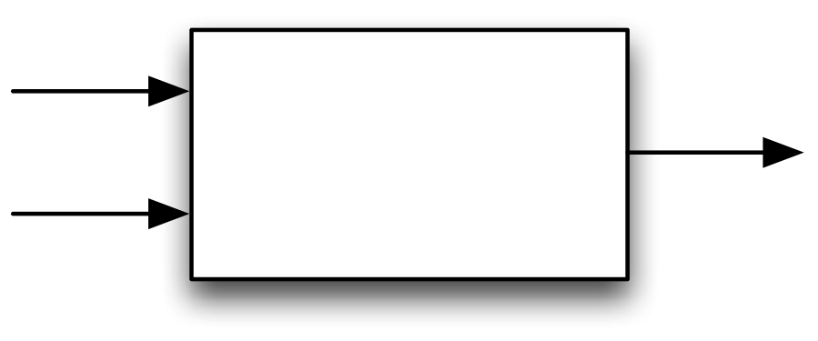<span class="img-wrapper"></span></label></figure>

The function gives an **output** value which depends upon the **input** value(s). We will often also use the term **result** for the output, and the terms **arguments** or **parameters** for the inputs.

A simple example of a function is addition, `+`, over numbers. Given input values `12` and `34` the corresponding output will be `46`.

<figure><label class="checkbox-label"><input class="checkbox-img" type="checkbox">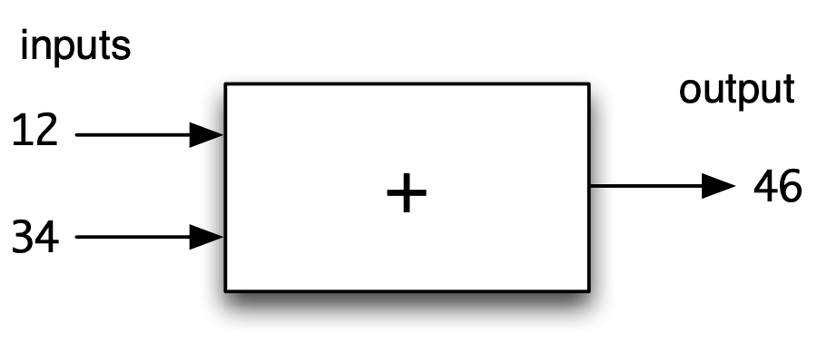<span class="img-wrapper"></span></label></figure>

The process of giving particular inputs to a function is called **function application**, and `(12 + 34)` represents the application of the function `+` to `12` and `34`.

Addition is a mathematical example, but there are also functions in many other situations; examples of these include <a id="examples1"></a>

-   a function giving the distance by road (*output*) between two cities (*inputs*);

-   a supermarket check-out program, which calculates the bill (*output*) from a list of bar codes scanned in (*input*); and

-   a process controller, which controls valves in a chemical plant. Its inputs are the information from sensors, and its output the signals sent to the valve actuators.

Different paradigms are characterized by the different tools which they provide for modelling. In a functional programming language we'll focus on values -- such as bar codes and bills -- and the functions which work over them -- giving the total of a bill, say. We'll also see this in our running example of pictures, which we look at next.

Pictures and functions {#picturesFuns}
----------------------

Let's take our first look at how pictures might be modelled. First of all, we want to show that many common relationships between pictures are modelled by functions; in the remainder of this section we consider a series of examples of this.

Reflection in a vertical mirror will relate two pictures, and we can model this by a function `flipV`:

<figure><label class="checkbox-label"><input class="checkbox-img" type="checkbox">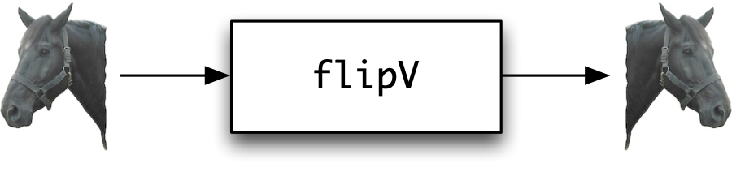<span class="img-wrapper"></span></label></figure>

where we have illustrated the effect of this reflection on the 'horse' image. In a similar way we have a function `flipH` to represent flipping in a horizontal mirror. Another function models the inversion of the colours in a (monochrome) image:

<figure><label class="checkbox-label"><input class="checkbox-img" type="checkbox">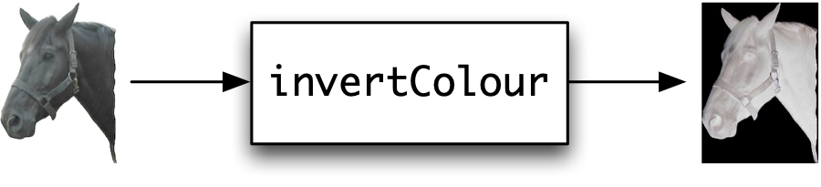<span class="img-wrapper"></span></label></figure>

Some functions will take two arguments, among them a function to scale images,

<figure><label class="checkbox-label"><input class="checkbox-img" type="checkbox">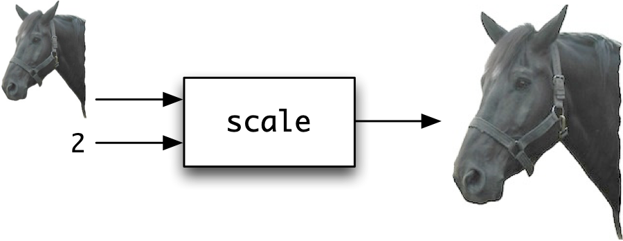<span class="img-wrapper"></span></label></figure>

a function to put one picture above another,

<figure><label class="checkbox-label"><input class="checkbox-img" type="checkbox">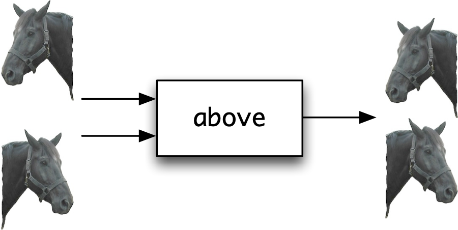<span class="img-wrapper"></span></label></figure>

and a function to place two pictures side by side.

<figure><label class="checkbox-label"><input class="checkbox-img" type="checkbox">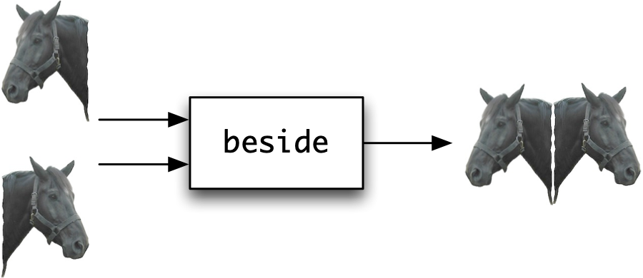<span class="img-wrapper"></span></label></figure>

All the functions here show that functions take a number of inputs (or arguments, parameters) and produce an output (or result) that depends on those inputs. What's more, this result only depends on those inputs, and will always give the same result for the same inputs.

Before we can fully explain functional programming in Haskell, we have to explain types, which we do now.

Types {#typesIntro}
-----

The functions which we use in functional programs will involve all sorts of different kinds of value: the addition function `+` will combine two numbers to give another number; `flipV` will transform a picture into a picture; `scale` will take a picture and a number and return a picture, and so on.

A **type** is a collection of values, such as numbers or pictures, grouped together because although they are different -- `2` is not the same as `567` -- they are the same *sort* of thing, in that we can do the same things to them. In particular, we can apply the same functions to them. For instance, we can find the larger of any two numbers, but it doesn't make sense to do this for two pictures or a number and a picture.

Each of the functions we have looked at so far will accept inputs from particular types, and give a result of a particular type too. If we look at the addition function, `+`, it only makes sense to add two scnumbers but not two pictures, say. This is an example of the fact that the functions we have been talking about themselves have a type, and indeed we can illustrate this diagrammatically:

<figure><label class="checkbox-label"><input class="checkbox-img" type="checkbox">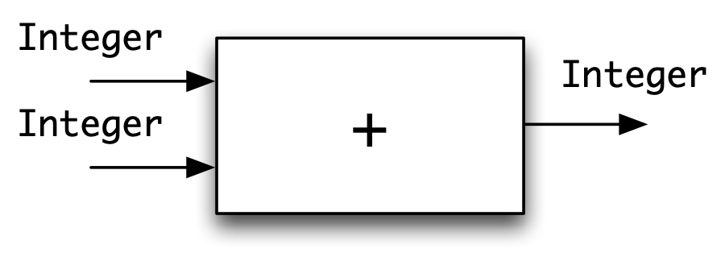<span class="img-wrapper"></span></label></figure>

The diagram indicates that `+` takes two whole numbers (or `Integers`) as arguments and gives an `Integer` as a result. In a similar way, we can label the `scale` function

<figure><label class="checkbox-label"><input class="checkbox-img" type="checkbox">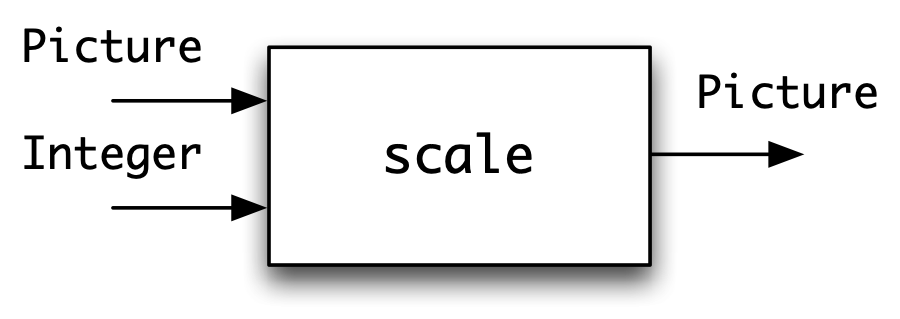<span class="img-wrapper"></span></label></figure>

to indicate that its first argument is a `Picture` and its second is an `Integer`, with its result being a `Picture`. We can see an example of this here, where `above` is correctly applied to two `Pictures`

<figure><label class="checkbox-label"><input class="checkbox-img" type="checkbox"><span class="img-wrapper"></span></label></figure>

but when applied to a `Picture` and an `Integer` a **type error** occurs, indicating that we have made a mistake:

<figure><label class="checkbox-label"><input class="checkbox-img" type="checkbox">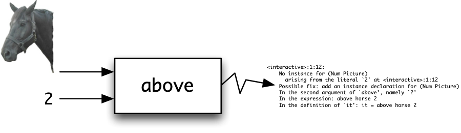<span class="img-wrapper"></span></label></figure>

We have now explained two of the central ideas in functional programming: a type is a collection of values, like the whole numbers or integers; a function is an operation which takes one or more arguments to produce a result. The two concepts are linked: functions will operate over particular types: a function to scale a picture will take two arguments, one of type `Picture` and the other of type `Int`, and return a `Picture`.

In modelling a problem situation -- often called a problem **domain** -- types represent the things[^1] in the domain, while functions will represent what can be done to transform or manipulate the objects. In the case of pictures, we'll have a type `Picture` to represent the pictures themselves, and functions give operations on pictures, such as placing one above another, or scaling a picture.

A rough and ready rule is that types correspond to *nouns*, while functions, which transform or combine values from these types, are like *verbs*. We come back to types in [Types and functional programming](#typesFP) below.

The Haskell programming language
--------------------------------

Haskell ([Marlow 2010](bibliography.md#haskell2010)) is the particular functional programming language which we use in this text. Haskell was first defined in 1990, and it has undergone a series of changes since then: the version as I write is Haskell 2010.

Haskell is named after Haskell B. Curry, who was one of the pioneers of the `λ` calculus (lambda calculus), a mathematical theory of functions that has been an inspiration to designers of a number of functional languages.

The best place to find out about everything to do with Haskell -- including the language definition itself, implementations, libraries, resources, mailing lists, news and Haskell jobs -- is the `haskell.org` website:

`http://www.haskell.org/`

There are various implementations of Haskell; in this text we shall use **GHCi** ([2010](bibliography.md#GHCi)). 'GHCi' is an abbreviation for 'Glasgow Haskell Compiler interactive': work on the compiler was started when Simon Peyton Jones and Simon Marlow were at Glasgow University; they are now both at Microsoft Research in Cambridge. GHCi provides an excellent environment for the learner, since it is freely available for PC, Linux and Mac OS X systems, it is efficient and compact and has a flexible user interface.

GHCi is an interpreter -- which means loosely that it evaluates expressions step-by-step as we might on a piece of paper -- but it can also load code that has been compiled into machine language. So, GHCi combines the flexibility of an interpreter with the efficiency of a compiler, allowing its programs to run with a speed similar to those written in more conventional languages like C and C++. Details of other different implementations of Haskell can be found in Appendix [Haskell practicalities](otherHs.md#OtherHS), and a full description of all of them is available at the `haskell.org` page.

GHCi comes as a part of the **Haskell Platform** ([Haskell Platform 2010](bibliography.md#HaskellPlatform)), a standard distribution of the compiler and a selection of commonly-used libraries. Other libraries are available from an extensive online database, **HackageDB** ([Hackage 2010](bibliography.md#Hackage)). The **Cabal** ([Cabal 2010](bibliography.md#Cabal)) packaging and distribution infrastructure, which comes as part of the Haskell Platform, makes it easy to download and install these libraries. We describe how to work with the interactive version of GHC in the next chapter, and how to use Hackage and Cabal in [Programming with lists](6.md#progLists).

All the programs and examples used in the text can be downloaded as the `Craft3e` package from Cabal and from the website for this book,

` http://www.haskellcraft.com/ `

This site also pulls together a collection of resources, further reading and other background materials for this text. The site will also keep track of how the book can be used with later versions of the Haskell Platform.

Expressions and evaluation {#exprEval}
--------------------------

In our first years at school we learn to **evaluate** an **expression** like `(7 - 3) * 2`

<figure><label class="checkbox-label"><input class="checkbox-img" type="checkbox">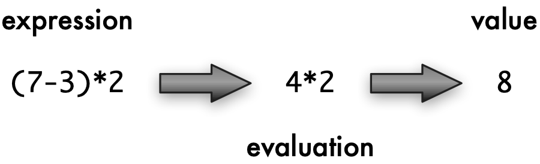<span class="img-wrapper"></span></label></figure>

to give the **value** `8`. Expressions are built up by applying functions to numbers and other expressions built in the same way. In this particular example, the functions are subtraction `-` and multiplication `*`, and the numbers `7`, `3` and `2`; the value of the expression is a number. This process of evaluation is automated in an electronic calculator.

In functional programming we do exactly the same: we evaluate expressions to give values, but in those expressions we use functions which model our particular problem. For example, in modelling pictures we will want

to evaluate expressions whose values are pictures. If the picture

<figure><label class="checkbox-label"><input class="checkbox-img" type="checkbox">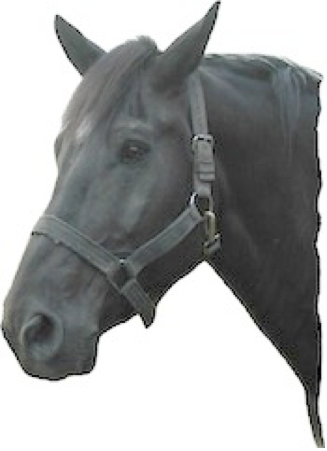<span class="img-wrapper"></span></label></figure>

is called `horse`, then we can form an expression by applying the function `flipV` to the horse. This function application is written by putting the function followed by its arguments, like this:

```haskell
flipV horse
```

and then evaluation will give

<figure><label class="checkbox-label"><input class="checkbox-img" type="checkbox">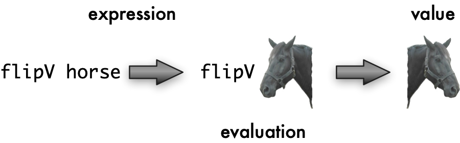<span class="img-wrapper"></span></label></figure>

A more complicated expression is

```haskell
invertColour (flipV horse)
```

the effect of which is to give a horse reflected in a vertical mirror -- `flipV horse` as shown above -- and then to invert the colours in the picture to give

<figure><label class="checkbox-label"><input class="checkbox-img" type="checkbox">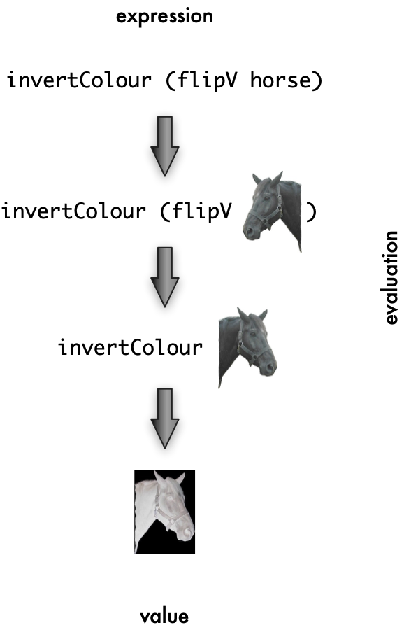<span class="img-wrapper"></span></label></figure>

To recap, in functional programming, we compute by evaluating expressions which use functions in our area of interest. We can see an implementation of a functional language as something like an electronic calculator: we supply an expression, and the system evaluates the expression to give its value. The task of the programmer is to write the functions which model the problem area.

So, a **functional program** is made up of a series of **definitions** of functions and other values. We will look at how to write these definitions now.

Definitions {#defsIntro}
-----------

A functional program in Haskell consists of a number of **definitions**. A Haskell definition associates a **name** with a value of a particular **type**. We often use the word '**identifier**' instead of 'name': they mean exactly the same thing.

In the simplest case a definition will look like this

```haskell
name :: type
name = expression
```

as in the example

```haskell
size :: Integer
size = 12+13
```

which associates the name on the left-hand side, `size`, with the value of the expression on the right-hand side, `25`, a value whose type is `Integer`, the type of whole numbers or integers. The symbol '`::`' can be read as "is a / is an", so the first line of the last definition reads '`size` is an `Integer`'. Note also that names for functions and other values begin with a *small letter*, while type names begin with a *capital letter*.

Suppose that we are supplied with the definitions of `horse` and the various functions over `Picture` mentioned earlier -- we will discuss in detail how to download these and use them in a program in [Getting started with Haskell and GHCi](2.md#getStart) -- we can then write definitions which use these operations over pictures. For example, we can say

```haskell
blackHorse :: Picture
blackHorse = invertColour horse
```

so that the `Picture` associated with `blackHorse` is obtained by applying the function `invertColour` to the `horse`, thus giving

<figure><label class="checkbox-label"><input class="checkbox-img" type="checkbox">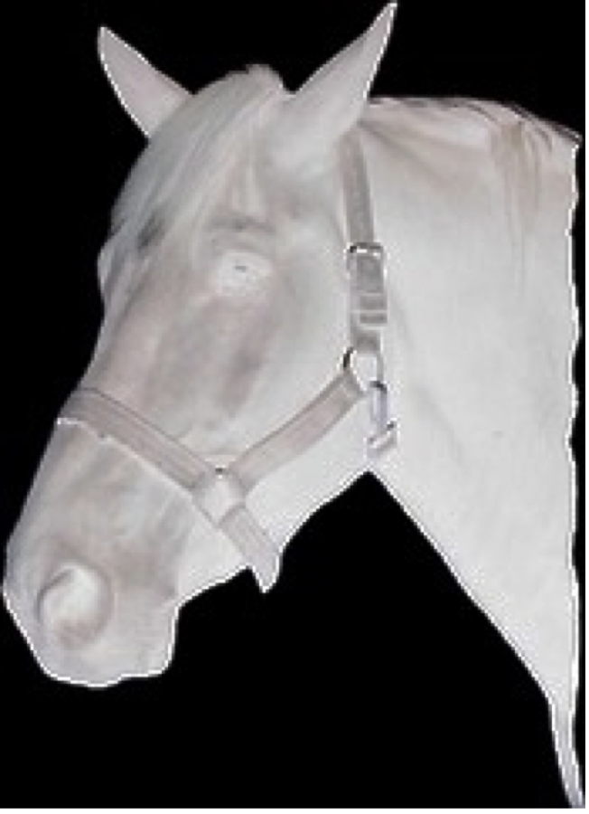<span class="img-wrapper"></span></label></figure>

<figure><label class="checkbox-label"><input class="checkbox-img" type="checkbox">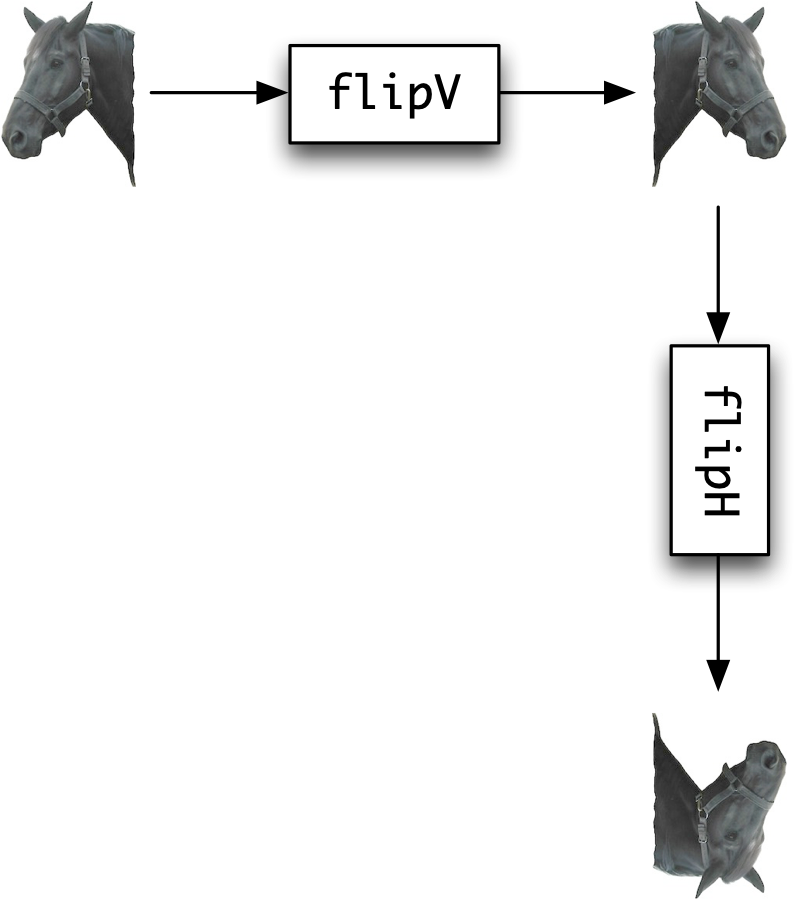<span class="img-wrapper"></span></label><figcaption>Calculating a rotation</figcaption></figure>

<a id="flipping"></a>
Another example is the definition

```haskell
rotateHorse :: Picture
rotateHorse = flipH (flipV horse)
```

where [Calculating a rotation](#flipping) illustrates the evaluation of the right-hand side, assuming that the function `flipH` has the effect of reflecting a `Picture` in a horizontal mirror. The effect of these two reflections is to rotate the picture through `180°`.

In [Expressions and evaluation](#exprEval) we explained that GHCi works rather like a calculator in evaluating expressions. How will it evaluate an expression like

```haskell
size - 17
```

for instance? Using the definition of `size` given earlier, we can replace the left-hand side -- `size` -- with the corresponding right-hand side -- `12+13`; this gives us the expression

```haskell
(12+13) - 17
```

and so by doing some arithmetic we can see that the value of the expression is `8`.

The definitions we have seen so far are simply of constant values; we now turn find out how functions are defined.

Function definitions {#funDefs}
--------------------

We can also define functions, and we look at some simple examples now. To square an integer we can say

```haskell
square :: Integer -> Integer
square n = n*n
```

where diagrammatically the definition is represented by

<figure><label class="checkbox-label"><input class="checkbox-img" type="checkbox">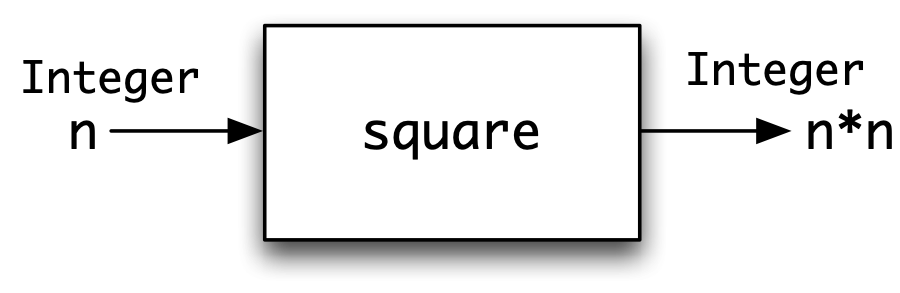<span class="img-wrapper"></span></label></figure>

The first line of the Haskell definition of `square` declares the type of the thing being defined. The arrow `->` signifies that this is a function, with one input, an `Integer`, appearing before the arrow, and, coming after the arrow, a result of type `Integer`. So, we can read `square :: Integer -> Integer` as

> "`square` is a function taking an `Integer` to an `Integer`"

The second line gives the definition of the function: the equation says that when `square` is applied to an **unknown** or **variable** `n`, then the result is `n*n`. How should we read an equation like this? Because `n` is an arbitrary, or unknown value, it means that the equation holds *whatever the value of* `n`, so that it will hold whatever integer expression we put in the place of `n`, so that, for instance

```haskell
square 5 = 5*5
```

and

```haskell
square (2+4) = (2+4)*(2+4)
```

This is the way that the equation is used in evaluating an expression which uses `square`. If we need to evaluate `square` applied to the expression `e`, we replace the application `square e` with the corresponding right-hand side, `e*e`.

In general a simple function definition will take the form

<figure><label class="checkbox-label"><input class="checkbox-img" type="checkbox">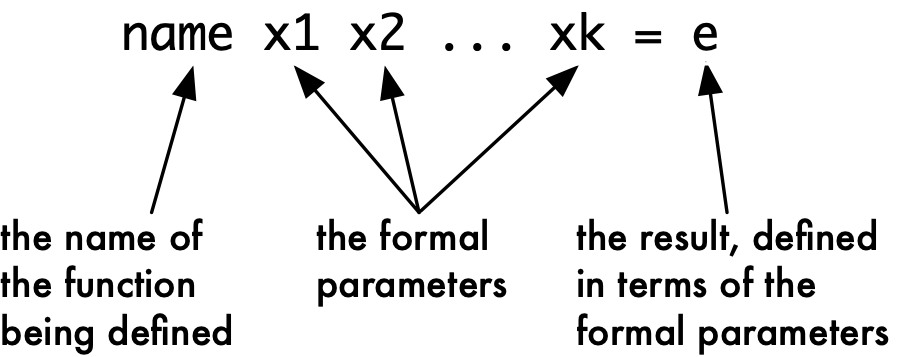<span class="img-wrapper"></span></label></figure>

The variables used in an equation defining a function stand for arbitrary values: the definition holds for whatever value is chosen for these inputs. These variables are called the **formal parameters** of the function because they stand for arbitrary values of the parameters: the **actual** parameters are supplied when the function is applied, as in `square 7`, where `7` is the actual parameter to `square`. We'll only use 'formal' and 'actual' in the text when we need to draw a distinction between the two; in most cases it will be obvious what is meant when 'parameter' is used.

Accompanying the definition of the function is a statement or **declaration** of its type. That will look like this, using the `scale` function over pictures as an example:

<figure><label class="checkbox-label"><input class="checkbox-img" type="checkbox">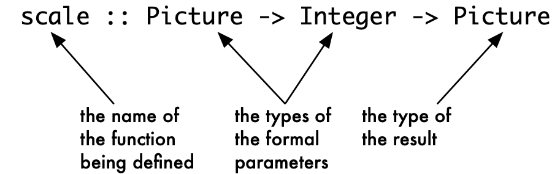<span class="img-wrapper"></span></label></figure>

In the general case we have

<figure><label class="checkbox-label"><input class="checkbox-img" type="checkbox">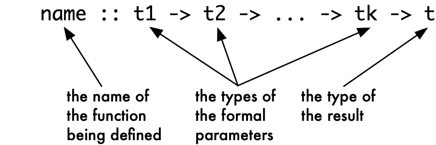<span class="img-wrapper"></span></label></figure>

The definition of `rotateHorse` in [Definitions](#defsIntro) suggests a general definition of a rotation function. To rotate *any* picture we can perform the two reflections, and so we define

```haskell
rotate :: Picture -> Picture
rotate pic = flipH (flipV pic)
```

We can read the definition like this:

> To `rotate` a picture `pic`, we first apply `flipV` to form `(flipV pic)`; we then apply `flipH` to reflect this in a horizontal mirror, giving the result `flipH (flipV pic)`.

Given this definition, we can replace the definition of `rotateHorse` by

```haskell
rotateHorse :: Picture
rotateHorse = rotate horse
```

which states that `rotateHorse` is the result of applying the function `rotate` to the picture `horse`.

The pattern of definition of `rotate` -- 'apply one function, and then apply another to the result' -- is so common that Haskell gives a way of combining functions directly in this way. We define

```haskell
rotate :: Picture -> Picture
rotate = flipH . flipV
```

<a id="here"></a>
The '`.`' in the definition signifies **function composition**, in which the output of one function becomes the input of another. In pictures,

<figure><label class="checkbox-label"><input class="checkbox-img" type="checkbox">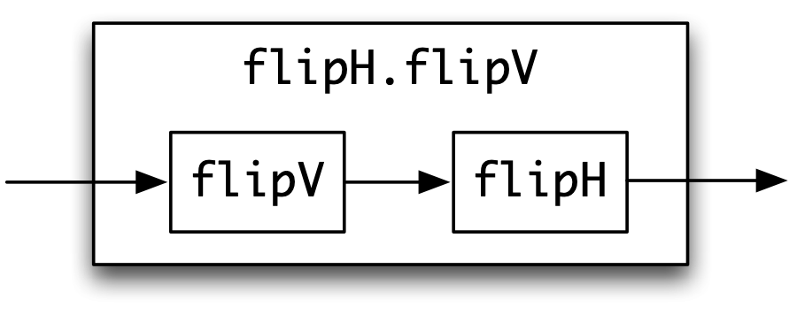<span class="img-wrapper"></span></label></figure>

we see the creation of a new function by connecting together the input and output of two given functions: obviously this suggests many other ways of connecting together functions, many of which we will look at in the chapters to come.

The direct combination of functions is one example of the power of functional programming: we are able to combine functions using an operator like '`.`' just as we can combine numbers using '`+`'. We use the term '**operator**' here rather than 'function' since '`.`' is written between its arguments rather than before them; we discuss operators in more detail in [Syntax](3.md#syntax).

The direct combination of functions by means of the operator '`.`' which we have seen here is not possible in other programming paradigms, or at least it would be an 'advanced' aspect of the language, rather than appearing of an introductory text.

Types and functional programming {#typesFP}
--------------------------------

What is the role of types in functional programming? Giving a type to a function first of all gives us crucial information about how it is to be used. If we know that

```haskell
scale :: Picture -> Integer -> Picture
```

we know two things immediately.

-   First, `scale` has two arguments: the first is a `Picture` and the second an `Integer`; this means that `scale` can be applied to `horse` and `3`.

-   The result of applying `scale` to this `Picture` and `Integer` will be a `Picture`.

The type thus does two things. First, it expresses a **constraint** on how the function `scale` is applied: it must be applied to a `Picture` and an `Integer`. Second, the type tells us what the result is if the function is correctly applied: in this case the result is a `Picture`.

Giving types to functions and other things not only tells us how they can be used; it is also possible to check automatically that functions are being used in the right way and this process -- which is called **type checking** -- takes place in Haskell. If we use an expression like

```haskell
scale horse horse
```

we will be told that we have made an error in applying `scale` to two pictures when a picture and a number are what was expected. Moreover, this can be done without knowing the *values* of `scale` or `horse` -- all that we need to know to perform the check is the *types* of the things concerned. Thus, **type errors** like these are caught before programs are used or expressions are evaluated.

It is remarkable how many errors, due either to mistyping or to misunderstanding the problem, are made by novices and experienced programmers alike. The Haskell type system therefore helps us to write correct programs, and to avoid a large proportion of programming pitfalls, both obvious and subtle, typos and misunderstandings. This is something which you particularly appreciate if you do use other languages without this kind of type checking, where you need to trace back from a particular error that happens during evaluation to its source.

### Type abstraction {#type-abstraction .unnumbered}

Before moving on, there is another important point which we'll explore later in the book. In [Definitions](#defsIntro) and [Function definitions](#funDefs) we gave definitions of

```haskell
blackHorse :: Picture
rotate     :: Picture -> Picture
```

which **use** the type `Picture` and some functions already defined over it: `flipH` and `flipV`. We were able to write the definitions of `blackHorse` and `rotate` *without knowing anything about* how the type of `Picture`s or the functions working with `Picture`s were actually defined. We can use these functions because we know their types, so we know what they have to be applied to, and what type their results will be.

Treating the type `Picture` in this way is called **type abstraction**: as users of the type we don't need to concern ourselves with how the type is defined. The advantage of this is that the definitions we give apply *however* pictures are modelled. We might choose to model them in different ways in different situations; whatever the case, the function composition `flipH . flipV` will rotate a picture through `180°`. We'll see this in practice in [Two models of Pictures](#two-models) where we give two, very different, models of pictures; [Abstract data types](16.md#adt) discusses this in more detail, and explains the Haskell mechanism to support type abstraction.

Calculation and evaluation
--------------------------

We have explained that GHCi can be seen as a general calculator, using the functions and other things defined in a functional program. When we evaluate an expression like

```haskell
23 - (double (3+1))  -- (‡)
```

we need to use the definition of the function:

```haskell
double :: Integer -> Integer
double n = 2*n  -- (dbl)
```

This we do by replacing the unknown `n` in the definition `(dbl)` by the expression `(3+1)`, giving

```haskell
double (3+1) = 2*(3+1)
```

Now we can replace `double (3+1)` by `2*(3+1)` in `(‡)`, and evaluation can continue.

One of the distinctive aspects of functional programming is that such a simple 'calculator' model is a complete description of computation in Haskell. Because the model is so straightforward, we can perform evaluations in a **step-by-step** manner; in this text we call these step-by-step evaluations **calculations**. As an example, we now show the calculation of the expression with which we began the discussion.

```haskell
23 - (double (3+1))
~> 23 - (2*(3+1))  -- using (dbl)
~> 23 - (2*4)   -- arithmetic
~> 23 - 8   -- arithmetic
~> 15   -- arithmetic
```

where we have used ' \>' to indicate a step of the calculation, and on each line we indicate at the right-hand margin how we have reached that line. For instance, the second line of the calculation:

```haskell
~> 23 - (2*(3+1))  -- using (dbl)
```

says that we have reached here using the definition of the `double` function, `(dbl)`.

In writing a calculation it is sometimes useful to <u>underline</u> the part of the expression which gets modified in transition to the next line. This is, as it were, where we need to focus our attention in reading the calculation. The calculation above will have underlining added like this:

```haskell
23 - (double (3+1))
~> 23 - (2*(3+1))  -- using (dbl)
~> 23 - (2*4)   -- arithmetic
~> 23 - 8   -- arithmetic
~> 15   -- arithmetic
```

In what is to come, when we introduce a new feature of Haskell we shall show how it fits into this line-by-line model of evaluation. This has the advantage that we can then explore new ideas by writing down calculations which involve these ideas.

The essence of Haskell programming
----------------------------------

We've learned enough about functional programming in Haskell to compare it with other kinds of programming paradigm, particularly OO and other imperative languages. First we'll summarise the essentials of Haskell, and then look at how it differs from others approaches.

So, what makes functional programming in Haskell special? Working in Haskell we concentrate on using a rich collection of data types -- including functions themselves, as well as types defined by the user -- to model the objects in the problem domain. Programming over these is done by writing functions: functions are defined by equations like

```haskell
rotate :: Picture -> Picture
rotate pic = flipH (flipV pic)  -- (rotate)
```

Finally, computing with these functions is done by calculation, or evaluation, using the definitions to calculate a result as we saw in the last section. In a equation like `(rotate)`, `pic` is a variable, in the mathematical sense of something that stands for an *arbitrary* `Picture`.

If you know Java, or another OO or imperative language like C, C++ or C\#, then you need to understand that Haskell variables are very different from variables in these languages. A Java variable is like a box, where values can be stored: the value is changed by making an assignment. In Java we compute by changing these contents, or the`state` as it is called. Methods which change state are said to have **side-effects**.

By contrast, Haskell variables don't vary, and the way we program is to write functions which describe how particular data values are related. These functions don't have side-effects, and there is no state in Haskell. We'll find about how all of this works in the chapters to come, we can summarize the important advantages now.

-   Haskell programs are *higher-level*: they can be read as a direct description of *what* are the relationships between input and output data, rather than covering the details of *how* a result is computed in a series of steps that change the values of variables.

-   Functions in Haskell can themselves be passed around just like any other *data*. So, we can use functions as well as all the other Haskell types when we're modelling complex problems.

-   Haskell functions are without side-effects, but in Haskell it's possible to do I/O, work with files, and inter-operate with other programming languages. We can do this using *monads* which allow these 'computational effects' to be embedded inside Haskell and its type system.

-   Haskell programs are easy to *parallelise*, and to run efficiently on multicore hardware, because there is no state to be shared between different threads. In Java different treads share the same state, and it's very hard to make sure that a Java program will run efficiently -- or even correctly -- in a multicore environment.

-   If definitions are equations, then it's possible to think of them as expressing *properties* of programs, and we can use these to write *proofs* of other properties our programs have, and so validate what they do.

-   There are often many different ways of solving the same problem, and when we begin to try to solve a problem it can be very hard to know which approach to take. Because Haskell programs are free of side-effects it's much easier to transform or *refactor* our programs to have a different design, as we might need to do before extending or modifying our program.

Taking these together, we can see why Haskell is popular for many tasks, and particularly for writing domain-specific languages, which we look at now.

Domain-specific languages
-------------------------

Haskell is a general-purpose programming language: it can be used to solve any kind of programming problem. Other languages, called **domain-specific languages** (**DSLs**) or **little languages**, are designed to solve problems in a particular domain. For example, this book has been written using LaTeX, a language for typesetting; other DSls are used for hardware design (Verilog), statistics (R, Excel) and graph layout (GraphViz). Stand-alone DSLs like these have the advantage that everything about them, from the way that programs are written to the details of what they mean, can be adapted to the particular domain. On the other hand, all the infrastructure has to be built from scratch.

A different approach is not to build the DSL from scratch, but instead to embed it in an existing programming language. These **embedded domain-specific languages** can take advantage of everything that the programming language provides, while expressing the concepts of the particular domain as well. Haskell has been particularly successful as a basis for embedding DSLs, including Lava ([Bjesse et al. 1998](bibliography.md#lava)) for circuit simulation and layout, Paradise ([Augustsson et al. 2008](bibliography.md#paradise)) for pricing financial products and Orc ([Launchbury and Elliott 2010](bibliography.md#orc)) for orchestrating scientific computations.

Why has Haskell been particularly successful for embedding DSLs? The rich set of data types -- including functions and user-defined `data` types -- which can be used to model the underlying domains; the absence of side-effects makes it possible to write models which focus on the data, independent of any state. More advanced aspects of Haskell also help the DSL writer. Some are beyond the scope of this text, but we'll cover three important features. Polymorphism and type classes are two different mechanisms to make it possible for functions to be used over multiple types: this allows a DSL to be interpreted in different ways; for example, this allows a hardware DSL can be used both for simulation and layout of circuits. Monads allow DSLs to have side-effects in a controlled way. We'll come back to this discussion as we look at DSLs in Haskell in [Domain-Specific Languages](19.md#dsls).

<figure><label class="checkbox-label"><input class="checkbox-img" type="checkbox"><span class="img-wrapper"></span></label><figcaption>Viewing <code>Pictures</code> in a web browser</figcaption></figure>

<a id="svgpix"></a>
Two models of `Picture`s {#two-models}
------------------------

This section looks at the pictures example as a small DSL, and gives two models -- or implementations -- of the pictures DSL.

### The `Picture` DSL {#the-picture-dsl .unnumbered}

We can describe the DSL for `Picture`s by giving the type declarations of its constructs.

```haskell
horse        :: Picture

flipH        :: Picture -> Picture
flipV        :: Picture -> Picture
invertColour :: Picture -> Picture

above        :: Picture -> Picture -> Picture
beside       :: Picture -> Picture -> Picture

scale        :: Picture -> Integer -> Picture
```

We form complex pictures by combining these into expressions, such as

```haskell
horse `above` (flipH horse)
```

but because the DSL is embedded in Haskell we can use all the facilities of Haskell too. We might make a complicated calculation of how much we want to scale a picture,

```haskell
scale (horse `above` (flipH horse)) (complicated Integer calculation)
```

but we can also use the facilities of Haskell for naming `Picture`s

```haskell
bigPic = scale (horse `above` (flipH horse)) 42
```

and defining other functions

```haskell
mirror pic = pic `beside` (flipV pic)
```

```haskell
.......##...               ......##....               ...##.......
.....##..#..               .....#.#....               ..#..##.....
...##.....#.               ....#..#....               .#.....##...
..#.......#.               ...#...#....               .#.......#..
..#...#...#.               ..#...#.....               .#...#...#..
..#...###.#.               .#....#..##.               .#.###...#..
.#....#..##.               ..#...###.#.               .##..#....#.
..#...#.....               ..#...#...#.               .....#...#..
...#...#....               ..#.......#.               ....#...#...
....#..#....               ...##.....#.               ....#..#....
.....#.#....               .....##..#..               ....#.#.....
......##....               .......##...               ....##......

horse                      flipH horse                flipV horse
```

<figcaption>ASCII-art pictures</figcaption>

<a id="Horses"></a>
### SVG pictures {#svg-pictures .unnumbered}

The pictures we've seen so far in this chapter are from a model of pictures which can be displayed in web browsers supporting the SVG standard([SVG 2010](bibliography.md#SVG)), as shown in [Viewing Pictures in a web browser](#svgpix). The web page allows you to view pictures "rendered from" Haskell descriptions; we'll come back to the details of how this is done in [A second example: pictures](2.md#ShowBrowser). For now the message is that you can use the DSL just knowing the types of the functions, as they tell you all you need to know to use them: for each function they tell us the types of the inputs they should be applied to and the type of the result.

### Pictures and lists {#pictures-and-lists .unnumbered}

We include this section in the first chapter of the book for two reasons. To start with, we want to describe a second way in which `Picture`s can be modelled in Haskell. Secondly, we want to provide an informal preview of a number of aspects of Haskell which make it a powerful and distinctive programming tool. As we go along we will indicate the parts of the book where we expand on the topics first introduced here.

Our model consists of two-dimensional, monochrome pictures built from **characters**. Characters are the individual letters, digits, spaces and so forth which can be typed at the computer keyboard and which can also be shown on a computer screen. In Haskell the characters are given by the built-in type `Char`. This model has the advantage that it is straightforward to view these pictures on a computer terminal window.

Our version of the `horse` picture, and the same picture flipped in horizontal and vertical mirrors are shown in [ASCII-art pictures](#Horses), where we use dots to show the white parts of the pictures.

How are the pictures built from characters? In our model we think of a picture as being made up of a **list** of lines, that is a collection of lines coming one after another in order. Each line can be seen in a similar way as a list of characters. Because we often deal with collections of things when programming, lists are built into Haskell. More specifically, given any type -- like characters or lines -- Haskell contains a type of lists of that type, and so in particular we can model pictures as we have already explained, using lists of characters to represent lines, and lists of lines to represent pictures.

With this model of `Picture`s, we can begin to think about how to model functions over pictures. A first definition comes easily; to reflect a picture in a horizontal mirror each line is unchanged, but the order of the lines is reversed: in other words we reverse the list of lines:

```haskell
flipH = reverse
```

where `reverse` is a built-in function to reverse the order of items in a list. How do we reflect a picture in a vertical mirror? The ordering of the lines is not affected, but instead *each line is to be reversed*. We can write

```haskell
flipV = map reverse
```

since `map` is the Haskell function which applies a function to each of the items in a list, individually. In the definitions of `flipH` and `flipV` we can begin to see the power and elegance of functional programming in Haskell.

-   We have used `reverse` to reverse a list of lines in `flipH` and to reverse each line in `flipV`: this is because the same definition of the function `reverse` can be used over *every* type of list. This is an example of polymorphism, or generic programming, which is examined in detail in [Generic functions: polymorphism](6.md#poly).

-   In defining `flipV` we see the function `map` applied to its argument `reverse`, *which is itself a function*. This makes `map` a very general function, as it can have any desired action on the elements of the list, specified by the function which is its argument. This is the topic of [Generalization: patterns of computation](10.md#patternsGen).

-   Finally, the *result* of applying `map` to `reverse` is itself a function. This covered in [Higher-order functions](11.md#gen2).

The last two facts show that functions are 'first-class citizens'

and can be handled in exactly the same way as any other sort of object like numbers or pictures. The combination of this with polymorphism means that in a functional language we can write very general functions like `reverse` and `map`, which can be applied in a multitude of different situations.

The examples we have looked at here are not out of the ordinary. We can see that other functions over pictures have similarly simple definitions. We place one picture `above` another simply by joining together the two lists of lines to make one list. This is done by the built-in operator `++`, which joins together two lists:[^2]

```haskell
above = (++)
```

To place two pictures `beside` each other we have to join corresponding lines together, thus <a id="beside"></a>

```haskell
.......##...   ++   ......##....
.....##..#..   ++   .....#.#....
...##.....#.   ++   ....#..#.... 
..#.......#.   ++   ...#...#.... 
..#...#...#.   ++   ..#...#.....
..#...###.#.   ++   .#....#..##.    
.#....#..##.   ++   ..#...###.#.    
..#...#.....   ++   ..#...#...#.     
...#...#....   ++   ..#.......#.     
....#..#....   ++   ...##.....#.      
.....#.#....   ++   .....##..#..      
......##....   ++   .......##...         
```

and this is defined using the function `zipWith`. This function is defined to 'zip together' corresponding elements of two lists using -- in this case -- the operator `++`.

```haskell
beside = zipWith (++) 
```

We shall return to these examples in [Higher-order functions](11.md#gen2).

Tests, properties and proofs {#proof}
----------------------------

<a id="pictureProps"></a>
How can we be sure that a program we have written does what it should? The traditional answer is to test the program on a selection of inputs, and of course we can -- and should -- do this for Haskell programs. We've got two other more powerful options, **property-based testing** and **proof**, and we'll introduce those in this section, and follow them up in the rest of the book.

### Tests and properties {#tests-and-properties .unnumbered}

Let's look at the example of `Picture`s from the last section: how do we test this? One way of doing this is to write tests of the form:

> "apply this function to this input ...the output should be this"

Given the picture library, we can also look at how the functions work together, and a simple way of doing this is to check how a combination of applications works. For example,

-   if we flip a picture twice in a mirror we should get back the original picture;

-   if we flip a picture in both a horizontal and vertical mirror, it shouldn't matter the order in which we do this, as illustrated in [Reflection in vertical and horizontal mirrors](#vh-hv).

<figure><label class="checkbox-label"><input class="checkbox-img" type="checkbox">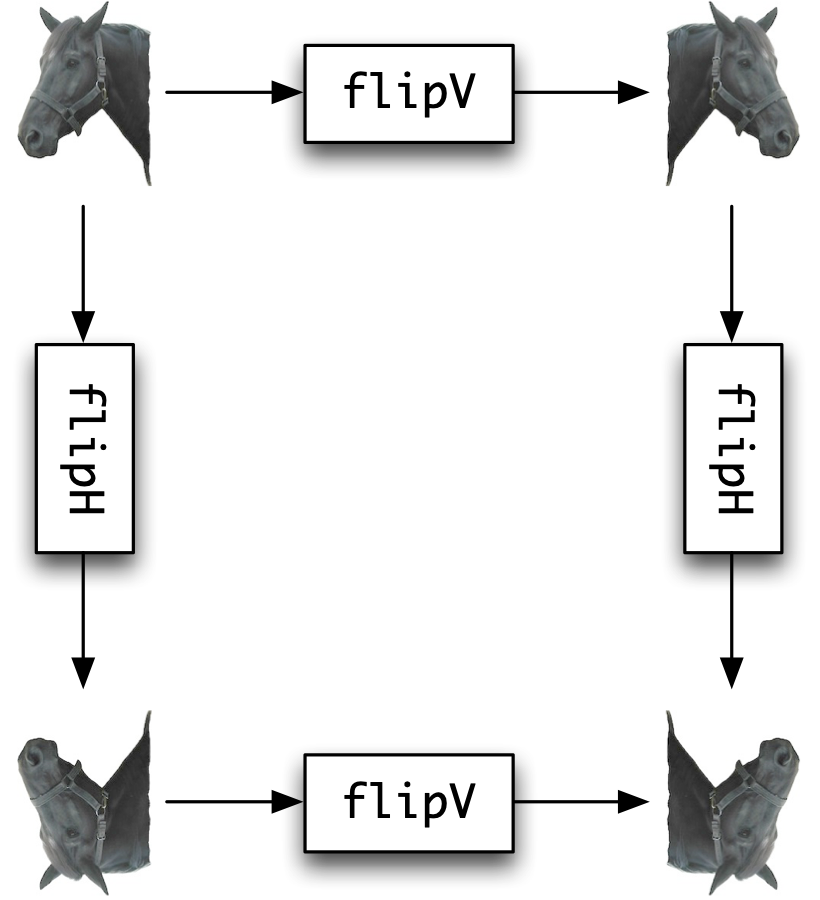<span class="img-wrapper"></span></label><figcaption>Reflection in vertical and horizontal mirrors</figcaption></figure>

<a id="vh-hv"></a>
These tests can be defined in Haskell, where the equality operator '`==`' is used to check whether two values are equal, returning the result `True` or `False`. These two values are the two elements of the Boolean type, `Bool`, which we come back to in the next chapter. Here are the tests:

```haskell
test_rotate, test_flipV, test_flipH :: Bool
 
test_rotate  =  flipV (flipH horse) == flipH (flipV horse)
test_flipV   =  flipV (flipV horse) == horse
test_flipH   =  flipH (flipV horse) == horse
```

The first two tests pass, and give the answer `True`. The third fails, because we made a mistake in writing `flipV` when we should have written `flipH`; if we correct the test, it will pass as well.

These tests work for a single input, and though `horse` is as good as any example, we ought to think of making more tests than this. **Property-based testing** in QuickCheck ([Claessen and Hughes 2000](bibliography.md#quickCheck)) allows us to check whether a property holds for a whole collection of randomly generated inputs.

What do we mean by a property? Informally, it's something like the explanation we gave earlier "if we flip *a picture* twice in a mirror we expect to get back *the original picture*" where the "*picture*" could be any picture. We can formalise these as Haskell functions:

```haskell
prop_rotate, prop_flipV, prop_flipH :: Picture -> Bool

prop_rotate pic  =  flipV (flipH pic) == flipH (flipV pic)
prop_flipV pic   =  flipV (flipV pic) == pic
prop_flipH pic   =  flipH (flipV pic) == pic
```

<figure><label class="checkbox-label"><input class="checkbox-img" type="checkbox">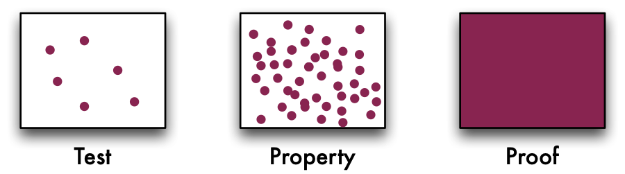<span class="img-wrapper"></span></label><figcaption>Coverage of testing, property-based testing and proof</figcaption></figure>

<a id="TPP"></a>
These properties are just like the tests, except that they are applied to an arbitrary `pic` rather than the `horse`. If we apply `quickCheck` to these properties like this

```haskell
quickCheck prop_rotate
```

and evaluate this in Haskell, we get the result

```haskell
+++ OK, passed 100 tests.
```

for the first two tests. In the final test we've replicated the error from earlier on, and we get this output

```haskell
*** Failed! Falsifiable (after 3 tests and 3 shrinks):  
["ab"]
```

This tells us two things: it tells us that the property isn't always true, and it also gives us an example of when it goes wrong. In fact we get the simplest case where it goes wrong, through "shrinking": this is a picture with one line and two characters!

This testing is automatic: once we have written the properties to test, the data are generated randomly from the type -- `Picture` in this case. Through the book we'll see more complex examples of using QuickCheck, and find ways that we can control how QuickCheck works.

### Coverage {#coverage .unnumbered}

Property-based testing has replaced one test with a hundred, but we might still be unlucky, and miss the failing cases in the random data. On the other hand, having a proof gives us complete certainty that a function is correct.

[Coverage of testing, property-based testing and proof](#TPP) illustrates the coverage given by the different mechanisms. Testing will check how the program behaves at a few, well-chosen, points; property-based testing expands this to hundreds of randomly-generated points, which, it is hoped, are representative, but a point where an error occurs *may* be missed[^3]; proof covers *all* cases, no exceptions.

### Proof {#proof-1 .unnumbered}

A **proof** is a logical or mathematical argument to show that something holds *in all circumstances*. For example, given any particular right-angled triangle

<figure><label class="checkbox-label"><input class="checkbox-img" type="checkbox">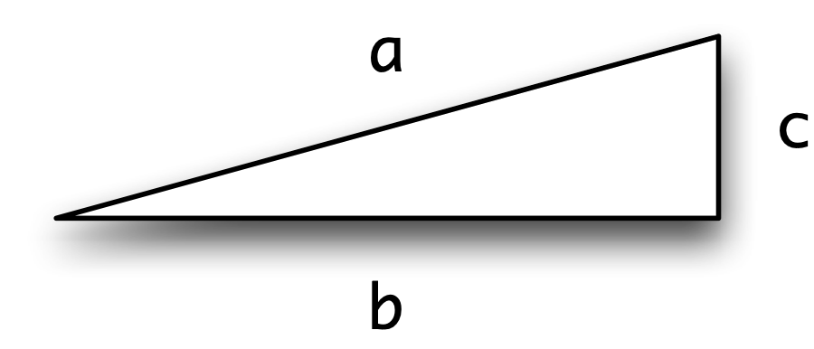<span class="img-wrapper"></span></label></figure>

we can check whether or not `a^ 2=b^ 2+c^ 2` holds. In each case we check, this formula will hold, but this is not in itself enough to show that the formula holds for all `a`, `b` and `c`. A proof of Pythagoras's Theorem, on the other hand, is a general argument which establishes that `a^ 2=b^ 2+c^ 2` holds whatever right-angled triangle we choose.

How is proof relevant to functional programming? To answer this we go back to the example of flipping in horizontal and vertical mirrors. As we saw in [Reflection in vertical and horizontal mirrors](#vh-hv), the order of reflection looks as though is not significant, and we can express this as the property:

```haskell
prop_rotate :: Picture -> Bool
prop_rotate pic  =  flipV (flipH pic) == flipH (flipV pic)
```

Moreover, we can look at our implementations of `flipV` and `flipH` and give a logical **proof** that these functions have the property `prop_rotate` above for **any** picture `pic`. The crux of the argument is that the two functions operate independently:

-   the function `flipV` affects each line but leaves the lines in the same order while

-   the function `flipH` leaves each line unaffected, while reversing the order of the list of lines.

Because the two functions affect different aspects of the list it is immaterial which is applied first, since the overall effect of applying the two in either case is to

-   reverse each line and reverse the order of the list of lines.

Proof is possible for most programming languages, but it is substantially easier for functional languages than for any other paradigm. Proof of program properties will be a theme in this text, and we start by exploring proof for list-processing functions in [Reasoning about programs](9.md#reasoningProgs).

What benefit is there in having a proof of a property like `prop_rotate`? It give us *certainty* that our functions have a particular property. Contrast this with traditional and property-based testing. In both cases the test only gives us the assurance that the function has the property we seek at the test points, and in principle tells us nothing about the function in other circumstances. There are safety-critical situations in which it is highly desirable to be sure that a program behaves properly, and proof has a role here. We are not, however, advocating that testing is unimportant -- merely that testing and proof have complementary roles to play in software development.

More specifically, `prop_rotate` means that we can be sure that whatever order we apply the functions `flipH` and `flipV` they will have the same effect. We could therefore **transform** a program containing `... (flipH (flipV ...)) ...` into one using the functions in the reverse order, `... (flipV (flipH ...)) ...`, and be certain that the new program will have exactly the same effect as the old. Ideas like this can be used to good effect within implementations of languages, and also in developing programs themselves, as we shall see in [Verification and general functions](11.md#verifGen).

Summary {#summary .unnumbered}
-------

As we said at the start, this chapter has three aims. We wanted to introduce some of the fundamental ideas of functional programming; to illustrate them with the example of pictures, and also to give a flavour of what it is that is distinctive about functional programming. To sum up the definitions we have seen,

-   a function is something which transforms its inputs to an output;

-   a type is a collection of objects of similar sort, such as whole numbers (integers) or pictures;

-   every object has a clearly defined type, and we state this type on making a definition;

-   functions defined in a program are used in writing expressions to be evaluated by the implementation; and

-   the values of expressions can be found by performing calculation by hand, or by using GHCi.

In the remainder of the book we'll explore different ways of defining new types and functions, as well as following up the topics of polymorphism, functions as arguments and results, data abstraction and proof which we have touched upon in an informal way here. We'll also make sure that we validate our programs using property-based testing in QuickCheck as well as proof. Finally, we'll see how Haskell is used in defining domain-specific languages.

[^1]: I have not used the word 'object' here because that has a technical meaning in OO languages; you could use it, but just remember it's meant in the non-technical sense here.

[^2]: The operator `++` is surrounded by parentheses `(...)` in this definition so that it is interpreted as a function; we say more about this in [Syntax](3.md#syntax).

[^3]: We'll see an example of this in [Reasoning about programs](9.md#reasoningProgs)
