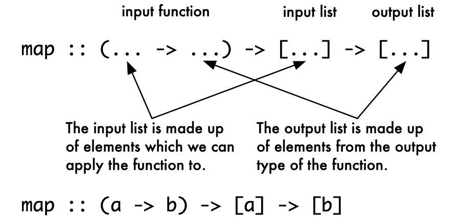
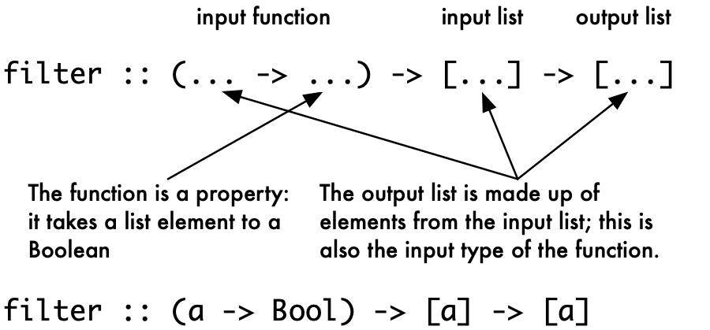
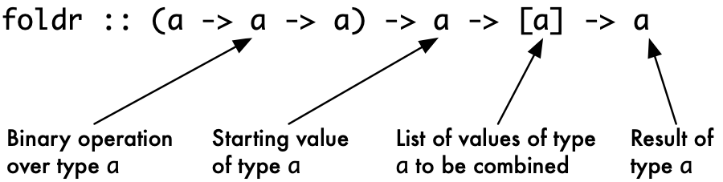

Generalization: patterns of computation {#patternsGen}
=======================================

Software reuse is a major goal of the software industry. One of the great strengths of modern functional programming languages like Haskell is that we can use them to define general functions which can be used in many different applications. The Haskell prelude functions over lists, for instance, form a toolkit to which we turn again and again in a host of situations.

We have already seen one aspect of this generality in **polymorphism**, under which the same program can be used over many different types. The prelude functions over lists introduced in [Data types, tuples and lists](5.md#tupleList) provide many examples of this including `length`, `++` and `take`.

As we said, these functions have the same effect over every argument -- `length` computes the length of a list of any type, for instance. In this chapter we explore a second mechanism, by which we can write functions which embody a **pattern of computation**; two examples of what we mean

follow.

-   *Transform every element of a list in some way*. We might turn every alphabetic character into upper case, or double every number.

-   *Combine the elements of a list using some operator*. We could add together the elements of a numeric list in this way, for example.

How can we write general functions which implement patterns like this? We need to make the transformation or operator into a **parameter** of the general function; in other words we need to have functions as arguments of other functions. These **higher-order functions** are the topic of this chapter. Complementing this is the ability to make functions the **results** of functions; we look at that in the next chapter.

We begin the chapter by examining the patterns of computation over lists which we have encountered so far, and in the remaining sections of the chapter we show how these are realized as higher-order Haskell functions. We also re-examine primitive recursive definitions, and see that they generalize the process of combining the elements of a list using an operator.

Next we look at an example of generalization: taking a function over `String` into a polymorphic, higher-order function. We do this by identifying the parts of the function which make it specific to `String` and turning those into a parameter of the function. The example serves as a model for how we can generalize functions in any situation and so make them applicable in many more contexts.

We conclude by revisiting a number of the case studies we have looked at earlier, and encourage you to look at these again, bearing in mind the new patterns of computation introduced in this chapter.

Patterns of computation over lists {#defForms}
----------------------------------

Many of the definitions of list processing functions we have seen so far fall into a small number of different sorts. In this section we look back over the previous chapters and discuss the patterns which emerge. These patterns are realized as Haskell functions later in the chapter.

### Applying to all -- mapping {#applying-to-all-mapping .unnumbered}

Many functions call for all of the elements of a list to be transformed in some way -- this we call **mapping**. We have seen examples of this from the first chapter, where we noted that to flip a picture in a vertical mirror -- `flipV` -- we needed to `reverse` each line of the `Picture`, which is a list of lines.

We also saw mapping in [Data types, tuples and lists](5.md#tupleList) in our first example of a list comprehension which was to double every element of a list of integers.

```haskell
doubleAll [2,3,71] = [4,6,142]doubleAll
```

Other examples include

-   taking the second element of each pair in a list of pairs, as we do in the library database;

-   in the supermarket billing example, converting every item in a list of bar codes to the corresponding `(Name,Price)` pair;

-   formatting each `(Name,Price)` pair in a list.

### Selecting elements -- filtering {#selecting-elements-filtering .unnumbered}

Selecting all the elements of a list with a given property is also common. [Data types, tuples and lists](5.md#tupleList) contains the example of the function which selects the digits from a string

```haskell
digits "29 February 2004" = "292004"digits
```

Among the other cases we have seen are

-   select each pair which has a particular person as its first element;

-   select each pair which is *not* equal to the loan pair being returned.

### Combining the items -- folding {#combining-the-items-folding .unnumbered}

The first example of primitive recursion in [Defining functions over lists](7.md#defFunLists) was `sum`,

which computes the total of a list of integers. The total of the list is given by **folding** the function `+` into the list, thus:

```haskell
sum [2,3,71] = 2+3+71
```

In a similar way,

-    `++` can be folded into a list of lists to concatenate it, as is done in the definition of `concat`;

-    `&&` can be folded into a list of Booleans to take their conjunction: this is the prelude function `and`;

-    `max` can be folded into a list of integers to give their maximum.

### Breaking up lists {#breaking-up-lists .unnumbered}

A common pattern in the text processing example of [Defining functions over lists](7.md#defFunLists) is to take or drop items from a list while they have some property. A first example is `getWord`,

```haskell
getWord "cat dog" = "cat"getWord
```

in which we continue to take characters while they are alphabetic. Other examples include `dropWord`, `dropSpace` and `getLine`. In the last of these the property in question depends not only upon the particular list item but also on the part of the list selected so far.

### Combinations {#combinations .unnumbered}

These patterns of definition are often used together. In defining `books` for the library database, which returns all the books on loan to a given person, we filter out all pairs involving the person, and then take all second components of the results. The strength of list comprehensions is that they give this combination of mapping and filtering, which fits some examples -- like the library database -- particularly well.

Other combinations of functions are also common.

-   In the pictures case study the function `invertColour` inverts the colour of every character in a `Picture` by inverting every line; inverting a line requires us to invert every character, so here we have two, nested, uses of mapping.

-   Formatting the item part of a supermarket bill involves processing each item in some way, then combining the results, using `++`.

### Primitive recursion and folding {#primitive-recursion-and-folding .unnumbered}

The form of many definitions is primitive recursive. Sorting by insertion is a classic example:

```haskell
iSort []     = []iSort
iSort (x:xs) = ins x (iSort xs)
```

Haskell provides a mechanism to turn a prefix function like `ins` into an infix version. The name is enclosed by back quotes, `‘ins‘`, so

```haskell
iSort (x:xs) = x `ins` (iSort xs)
```

and, in a given example, we have

```haskell
iSort [4,2,3] = 4 `ins` 2 `ins` 3 `ins` []
```

Looked at this way, the definition looks like `‘ins‘` folded into the list `[4,2,3]`. We shall look at this again in [Folding and primitive recursion](#foldPrimRec).

### The last 10% {#the-last-10 .unnumbered}

The different kinds of definition discussed so far have all been primitive recursive: we were able to define the result for `(x:xs)` in terms of the result for `xs`. It has been said that at least 90% of all definitions of list processing functions are primitive recursive. Some are not, however; in [Defining functions over lists](7.md#defFunLists) notable examples are quicksort and the `splitLines` function,

```haskell
splitLines
splitLines [] = []
splitLines ws
  = getLine lineLen ws
         : splitLines (dropLine lineLen ws)
```

For a non-empty list of words `ws`, the result `splitLines ws` is defined using a recursive call of `splitLines` not on the tail of `ws` but on `(dropLine lineLen ws)`. This form of recursion will terminate because `(dropLine lineLen ws)` will always be shorter than `ws` itself, at least in sensible cases where no word in the list `ws` is longer than the line length `lineLen`.

Higher-order functions: functions as arguments {#hofs}
----------------------------------------------

A function is **higher-order** if it takes a function as an argument or returns a function as a result, or does both. In this section we show how a variety of functions, including some of the patterns discussed in the last section, can be written using functions as arguments.

### Mapping -- the `map` function {#mapping-the-map-function .unnumbered}

We can double all the elements in an integer list in two ways, either using a list comprehension,

```haskell
doubleAll
doubleAll :: [Integer] -> [Integer]
doubleAll xs = [ 2*x | x <- xs ]
```

or using primitive recursion,

```haskell
doubleAll []     = []
doubleAll (x:xs) = 2*x : doubleAll xs
```

In both cases, we can see that the specific operation of multiplying by two is applied to an element of the list in the expression '`2*x`'.

Suppose that we want to modify every element of a list by another operation -- for instance, the function `ord` that transforms a `Char` into an `Int` -- we could modify one of the definitions above by replacing the '`2*x`' by '`fromEnum x`' to give a different definition.

Taking this approach would mean that we would write a whole lot of definitions which differ only in the function used to make the transformation. Instead of doing this, we can write a *single* definition in which the function becomes a **parameter** of the definition. Our general definition will be

```haskell
map f xs = [ f x | x <- xs ]  -- (map.0)
```

or we can give an explicit primitive recursion

```haskell
map f []     = []  -- (map.1)
map f (x:xs) = f x : map f xs  -- (map.2)
```

The function to `double` all the elements of a list can now be given by applying `map` to two things: the transformation -- `double` -- and the list in question.

```haskell
doubleAll xs = map double xs           
```

where `double x = 2*x`. In a similar way, the function to convert all the characters into their codes will be

```haskell
convertChrs
convertChrs :: [Char] -> [Int]
convertChrs xs = map fromEnum xs
```

In the `Picture` case study to flip a picture in a vertical mirror we can write

```haskell
flipV
flipV :: Picture -> Picture
flipV xs = map reverse xs
```

What is the type of `map`? It takes two arguments -- the first is a function, and the second is a list -- and it returns a list.

<label class="checkbox-label"><input class="checkbox-img" type="checkbox"><span class="img-wrapper"></span></label>

The figure shows how the types of the functions and lists are related, giving `map` the type

```haskell
map :: (a -> b) -> [a] -> [b]
```

where recall that `a` and `b` are type variables, standing for arbitrary types. Instances of the type of `map` include

```haskell
map :: (Integer -> Integer) -> [Integer] -> [Integer]
```

as used in the definition of `doubleAll`, where `map` is applied to the function `double` of type `Int -> Int` and

```haskell
map :: (Char -> Int) -> [Char] -> [Int]
```

as in the definition of `convertChrs`.

### Modelling properties as functions {#modelling-properties-as-functions .unnumbered}

Before defining the function to **filter**, or select, those elements of a list having a given property, we need to think about how such properties are to be modelled in Haskell. Take the example of filtering the digits from a string -- the function `digits` mentioned earlier. How is the property of 'being a digit' to be modelled? We have already seen that the library `Data.Char` contains a function

```haskell
isDigit
isDigit :: Char -> Bool
```

and we find out whether a particular character like `’d’` is a digit or not by applying the function to the character to give a Boolean result, that is `True` or `False`.

This is the way that we can model a **property** over any type `t`. The property is given by a function of type

```haskell
t -> Bool 
```

and an element `x` has the property precisely when `f x` has the value `True`. We have already seen the example of `isDigit`; other examples include

```haskell
isEvenisSorted
isEven :: Integer -> Bool
isEven n = (n `mod` 2 == 0)

isSorted :: [Integer] -> Bool
isSorted xs = (xs == iSort xs)
```

We usually adopt the convention that the names of properties begin with '`is`'.

### Filtering -- the `filter` function {#filtering-the-filter-function .unnumbered}

Building on our discussion of properties, we see that the `filter` function will take a property and a list, and return those elements of the list having the property:

```haskell
filter p [] = []  -- (filter.1)
filter p (x:xs)
  | p x         = x : filter p xs  -- (filter.2)
  | otherwise   =     filter p xs  -- (filter.3)
```

In the case of an empty list, the result is empty. For a non-empty list `(x:xs)` there are two cases. If the guard condition `p x` is true then the element `x` is the first element of the result list; the remainder of the result is given by selecting those elements in `xs` which have the property `p`. If `p x` is `False`, `x` is not included, and the result is given by searching `xs` for elements with property `p`.

A list comprehension also serves to define `filter`,

```haskell
filter p xs = [ x | x <- xs , p x ]  -- (filter.0)
```

where again we see that the condition for inclusion of `x` in the list is that it has the property `p`.

Our example `digits` is defined using `filter` as follows

```haskell
digits
digits xs = filter isDigit xs
```

Other applications of `filter` give

```haskell
filter isEven [2,3,4,5]                    ~> [2,4]
filter isSorted [[2,3,4,5],[3,2,5],[],[3]] ~> [[2,3,4,5],[],[3]]
```

What is the type of `filter`? It takes a property and a list, and returns a list.

<label class="checkbox-label"><input class="checkbox-img" type="checkbox"><span class="img-wrapper"></span></label>

### Combining `zip` and `map` -- the `zipWith` function {#combining-zip-and-map-the-zipwith-function .unnumbered}

We have already seen the polymorphic function

```haskell
zip :: [a] -> [b] -> [(a,b)]
```

which 'zips together' the the elements of two lists into a single list of pairs, pairing up corresponding elements in the two lists. For instance,

```haskell
zip [2,3,4] "Frank" = [(2,'F'),(3,'r'),(4,'a')]
```

As the example shows, if the lists are of different lengths, we just drop the elements in the longer list with no element to pair with.

What happens if we want to do something to two corresponding elements other than making a pair of them? Recall from [Introducing functional programming](1.md#intro) that in our `Picture` case study to define `beside` we wanted to join corresponding lines using (++). To this end we define the `zipWith` function, which combines the effect of zipping and mapping:

```haskell
zipWith f (x:xs) (y:ys) = f x y : zipWith f xs ys
zipWith f  _      _     = []
```

In the first case we see that if both lists are non-empty we apply the function `f` to their heads to give the first element of the result, and zip their tails with `f` in a similar way. In the second case -- when at least one of the inputs is `[]` -- the result is `[]`, just as it was in the definition of `zip`.

Returning to the `Picture` case study, we can then define

```haskell
beside
beside :: Picture -> Picture -> Picture
beside pic1 pic2 = zipWith (++) pic1 pic2
```

What is the type of `zipWith`? The function takes three arguments. The second and third are lists of arbitrary type, `[a]` and `[b]` respectively. The result is also a list of arbitrary type, `[c]`. Now, the first argument is applied to elements of the input lists to give an element of the output list, so it must have type `a -> b -> c`. Putting this together, we have

```haskell
zipWith :: (a -> b -> c) -> [a] -> [b] -> [c]
```

In the exercises we look further at the examples defined here, as well as introducing other higher-order functions.

**Exercises**

1.  Write three line-by-line calculations of `doubleAll [2,1,7]` using the three different definitions of `doubleAll` that use a list comprehension, primitive recursion and `map`.

2.  How would you define the `length` function using `map` and `sum`?

3.  Given the function

    ```haskell
    addUp ns = filter greaterOne (map addOne ns)
    ```

    where

    ```haskell
    greaterOne n = n>1
    addOne n     = n+1
    ```

    how would you redefine it using `filter` before `map`, as in

    ```haskell
    addUp ns = map fun1 (filter fun2 ns)
    ```

4.  Describe the effect of

    ```haskell
    map addOne (map addOne ns) 
    ```

    Can you conclude anything in general about properties of `map f (map g xs)` where `f` and `g` are arbitrary functions?

5.  What is the effect of

    ```haskell
    filter greaterOne (filter lessTen ns)
    ```

    where `lessTen n = n<10`? What about the general case of

    ```haskell
    filter p (filter q xs)
    ```

    where `p` and `q` are arbitrary properties?

6.  Give definitions of functions to take a list of integers, `ns`, and

    -   return the list consisting of the squares of the integers in `ns`;

    -   return the sum of squares of items in `ns`;

    -   check whether all items of the list are greater than zero.

7.  Using functions defined already wherever possible, write definitions of functions to

    -   give the minimum value of a function `f` on inputs `0` to `n`;

    -   test whether the values of `f` on inputs `0` to `n` are all equal;

    -   test if all values of `f` on inputs `0` to `n` are greater than zero, and,

    -   check whether the values `f 0`, `f 1` to `f n` are in increasing order.

8.  State the type of and define a function `twice` which takes a function from integers to integers and an input integer, and whose output is the function applied to the input twice. For instance, with the `double` function and `7` as input, the result is `28`. What is the most general type of the function you have defined?

9.  Give the type of and define a function `iter` so that

    ```haskell
    iter n f x = f (f (f ... (f x)...))  
    ```

    where `f` occurs `n` times on the right-hand side of the equation. For instance, we should have

    ```haskell
    iter 3 f x = f (f (f x))
    ```

    and `iter 0 f x` should return `x`.

10. Using `iter` and `double` define a function which on input `n` returns `2^n`; remember that `2^n` means one multiplied by two `n` times.

11. Define QuickCheck properties that you would expect to hold for the result of a `filter`,

    ```haskell
    filter p xs
    ```

12. Suppose that `g` is the *inverse* of `f`, so that

    ```haskell
    g (f x) ~>x
    f (g y) ~>y
    ```

    for all `x` and `y`, give properties that you would expect to hold for the result of the `map`:

    ```haskell
    map f xs
    ```

Folding and primitive recursion {#foldPrimRec}
-------------------------------

In this section we look at a particular sort of higher-order function which implements the operation of **folding** an operator or function into a list of values. We will see that this operation is more general than we might first think, and that most primitive recursive functions over lists can, in fact, be defined using a fold.

### The functions `foldr1` and `foldr` {#the-functions-foldr1-and-foldr .unnumbered}

Here we look at two sorts of folding function. First we look at a function which folds a function into a non-empty list; it is defined in `GHC.List` and is called `foldr1`; we will discuss why it is called this later in the section.

The definition of `foldr1` will have two cases. Folding `f` into the singleton list `[a]` gives `a`. Folding `f` into a longer list is given by

```haskell
foldr1 f [e_1,e_2,...,e_k]
  = e_1 `f` (e_2 `f` ( ... `f` e_k)...)
  = e_1 `f` (foldr1 f [e_2,...,e_k])
  = f e_1 (foldr1 f [e_2,...,e_k])
```

The Haskell definition is therefore

```haskell
foldr1 f [x]    = x  -- (foldr1.1)
foldr1 f (x:xs) = f x (foldr1 f xs)  -- (foldr1.2)
```

and the type of `foldr1` will be given by

```haskell
foldr1 :: (a -> a -> a) -> [a] -> a
```

The type shows that `foldr1` has two arguments.

-   The first argument is a binary function over the type `a`; for example, the function `(+)` over `Int`.

-   The second is a list of elements of type `a` which are to be combined using the operator; for instance, `[3,98,1]`

The result is a single value of type `a`; in the running example we have

```haskell
foldr1 (+) [3,98,1] = 102
```

Other examples which use `foldr1` include

```haskell
foldr1 (||) [False,True,False] = True
foldr1 (++) ["Freak ", "Out" , "", "!"] = "Freak Out!"
foldr1 min [6] = 6
foldr1 (*) [1 ..\ 6] = 720
```

The function `foldr1` gives an error when applied to an empty list argument.

We can modify the definition to give an extra argument which is the value returned on the empty list, so giving a function defined on all finite lists. This function is called `foldr` and is defined as follows

```haskell
foldr f s []     = s  -- (foldr.1)
foldr f s (x:xs) = f x (foldr f s xs)  -- (foldr.2)
```

The '`r`' in the definition is for 'fold, bracketing to the **right**'. Using this slightly more general function, whose type we predict is

<label class="checkbox-label"><input class="checkbox-img" type="checkbox"><span class="img-wrapper"></span></label>

we can now define some of the standard functions of Haskell,

```haskell
concat :: [[a]] -> [a]concat
concat xs = foldr (++) [] xs

and :: [Bool] -> Booland
and bs = foldr (&&) True bs
```

Returning to the start of the section, we can now see why `foldr1` is so called: it is fold function, designed to take a list with at least **one** element. We can also define `foldr1` from `foldr`, like this

```haskell
foldr1 f xs = foldr f (last xs) (init xs)  -- (foldr1.0)
```

where `last` gives the last element of a list, and `init` removes that element.

### Folding in general -- `foldr` again {#folding-in-general-foldr-again .unnumbered}

In fact, the most general type of `foldr` is more general than we predicted. Suppose that the starting value has type `b` and the elements of the list are of type `a`, then

```haskell
foldr :: (a -> b -> b) -> b -> [a] -> b
```

We give a full explanation of how this type is derived in [Polymorphic type checking](13.md#polyTypeCheck).

With this insight about the type of `foldr` we can see that `foldr` can be used to define another whole cohort of list functions. For instance, we can reverse a list thus:

```haskell
rev
rev :: [a] -> [a]rev
rev xs = foldr snoc [] xs

snoc :: a -> [a] -> [a]snoc
snoc x xs = xs ++ [x]
```

This function is traditionally called `snoc` because it is like 'cons', `:`, in reverse. We can also sort a list in this way

```haskell
iSort :: [Integer] -> [Integer]iSort
iSort xs = foldr ins [] xs
```

Before we move on, we look for one last time at the definition of `foldr`

```haskell
foldr f s []     = s  -- (foldr.1)
foldr f s (x:xs) = f x (foldr f s xs)  -- (foldr.2)
```

What is the effect of `foldr f s`? We have two cases:

-   the value at the empty list is given outright by `s`;

-   the value at `(x:xs)` is defined in terms of the value at `xs`, and `x` itself.

This is just like the definition of primitive recursion over lists in [Defining functions over lists](7.md#defFunLists).[^1] Because of this it is no accident that we can define many of our primitive recursive functions using `foldr`. It is usually mechanical to go from a primitive recursive definition to the corresponding application of `foldr`.

How do the two approaches compare? It is often easier initially to think of a function definition in recursive form and only afterwards to transform it into an application of `foldr`. One of the advantages of making this transformation is that we might then recognize properties of the function by dint of its being a fold. We look at proof for general functions like `map`, `filter` and `foldr` in [Verification and general functions](11.md#verifGen) and we look at other fold functions in [Time and space behaviour](20.md#behaviour).

**Exercises**

1.  How would you define the sum of the squares of the natural numbers `1` to `n` using `map` and `foldr`?

2.  Define a function to give the sum of squares of the positive integers in a list of integers.

3.  For the purposes of this exercise you should use `foldr` to give definitions of the prelude functions `unZip`, `last` and `init`, where examples of the latter two are given by

    ```haskell
    last "Greggery Peccary" = 'y'
    init "Greggery Peccary" = "Greggery Peccar"
    ```

4.  How does the function

    ```haskell
    mystery xs = foldr (++) [] (map sing xs)
    ```

    behave, where `sing x = [x]` for all `x`?

5.  The function `formatLines` is intended to format a list of lines using the function

    ```haskell
    formatLine :: Line -> String
    ```

    to format each line in the list. Define a function

    ```haskell
    formatList :: (a -> String) -> [a] -> String
    ```

    which takes as a parameter a function of type

    ```haskell
    a -> String
    ```

    to format each item of the list which is passed as the second parameter. Show how `formatLines` can be defined using `formatList` and `formatLine`.

6.  Define a function

    ```haskell
    filterFirst :: (a -> Bool) -> [a] -> [a]
    ```

    so that `filterFirst p xs` removes the first element of `xs` which does not have the property `p`. Use this to give a version of `returnLoan` which returns only one copy of a book. What does your function do on a list all of whose elements have property `p`?

7.  Can you define a function

    ```haskell
    filterLast :: (a -> Bool) -> [a] -> [a]
    ```

    which removes the last occurrence of an element of a list without property `p`? How could you define it using `filterFirst`?

8.  How could you define a function `switchMap` which maps two functions along a list, alternating which to apply. For example,

    ```haskell
    switchMap addOne addTen [1,2,3,4] ~>[2,12,4,14]
    ```

    where `addOne` and `addTen` behave as you would expect. What is the most general type of `switchMap`?

9.  Define functions

    ```haskell
    split :: [a] -> ([a],[a])
    merge :: ([a],[a]) -> [a]
    ```

    so that `spilt` will split a list into two lists, picking elements alternately, while merge will interleave the two lists; for example,

    ```haskell
    split [1,2,3,4,5] ~>([1,3,5],[2,4])
    merge ([1,3,5],[2,4]) ~>[1,2,3,4,5]
    ```

10. Can you formulate QuickCheck properties which characterise the way that `split` and `merge` work together?

11. \[Harder\] Suppose that the function `g` is *associative*, that is

    ```haskell
    g x (g y z) = g (g x y) z
    ```

    give a QuickCheck property that you would expect `foldr1 g (xs ++ ys)` to have. Can you think of a similar property for `foldr g s (xs ++ ys)`? Hint: you will need to think about what property `s` needs to obey.

Generalizing: splitting up lists
--------------------------------

As a final example in this chapter we look at how we can generalize the function `getWord` into a polymorphic, higher-order function. This serves as a model for similar generalizations in many different circumstances.

Many list manipulating programs involve splitting up lists in some way, as a part of their processing. One way of doing this is to select some or all the elements with a particular property -- this we have seen with `filter`. Other ways of processing include taking or dropping elements of the list from the front -- this we saw in the text processing example. If we know the number of elements to be dropped, we can use

```haskell
take, drop :: Int -> [a] -> [a]takedrop
```

where `take n xs` and `drop n xs` are intended to take or drop `n` elements from the front of the list `xs`. These functions are defined in [Defining functions over lists](7.md#defFunLists).

Also in [Defining functions over lists](7.md#defFunLists) we looked at the example of text processing, in which lists were split to yield words and lines. The functions `getWord` and `dropWord` defined there were *not* polymorphic, as they were designed to split at whitespace characters.

It is a general principle of functional programming that programs can often be rewritten to use more general polymorphic and/or higher-order functions, and we illustrate that here.

The function `getWord` was originally defined thus:

```haskell
getWord :: String -> StringgetWord
getWord []    = []   -- (getWord.1)
getWord (x:xs) 
  | elem x whitespace   = []  -- (getWord.2)
  | otherwise           = x : getWord xs   -- (getWord.3)
```

What forces this to work over strings is the test in `(getWord.2)`, where `x` is checked for membership of `whitespace`. We can generalize the function to have the test -- or property -- as a parameter.

How is this to be done? Recall that a property over the type `a` is represented by a function of type `(a -> Bool)`. Making this test a parameter we have

```haskell
getUntil :: (a -> Bool) -> [a] -> [a]getUntil
getUntil p []    = [] 
getUntil p (x:xs) 
  | p x         = []
  | otherwise   = x : getUntil p xs
```

in which the test `elem x whitespace` has been replaced by the test `p x`, the arbitrary property `p` applied to `x`. We can of course recover `getWord` from this definition:

```haskell
getWord xs 
  = getUntil p xs
    where 
    p x = elem x whitespace
```

Built into Haskell are the functions `takeWhile` and `dropWhile`, which are like `getUntil` and `dropUntil`, except that they take or drop elements while the condition is `True`. For instance,

```haskell
takeWhile :: (a -> Bool) -> [a] -> [a]
takeWhile p []    = [] 
takeWhile p (x:xs) 
  | p x         = x : takeWhile p xs
  | otherwise   = []
```

`getUntil` can be defined using `takeWhile`, and vice versa.

**Exercises**

1.  Give the type and definition of the generalization `dropUntil` of the function `dropWord`.

2.  How would you define the function `dropSpace` using `dropUntil`? How would you define `takeWhile` using `getUntil`?

3.  How would you split a string into lines using `getUntil` and `dropUntil`?

4.  The function `getLine` of [Defining functions over lists](7.md#defFunLists) has a polymorphic type -- what is it? How could you generalize the test in this function? If you do this, does the type of the function become more general? Explain your answer.

5.  Can you give generalizations to polymorphic higher-order functions of the text processing functions `getLine`, `dropLine` and `splitLines`?

Case studies revisited
----------------------

We have already seen how the functions introduced here, `map`, `filter` and `zipWith` and so forth, can be used to re-define many of the functions from the pictures case study. This section goes back to look at other examples from that case study, as well as at others.

### Pictures {#pictures .unnumbered}

We have discussed the `Picture` type and the functions over it already in [Introducing functional programming](1.md#intro), [A second example: pictures](2.md#picModuleEx) and [Solving a problem in steps: local definitions](4.md#localDefs) and [Programming with lists](6.md#progLists). In this chapter we have seen that we can define `flipV` using `map`, and `beside` using `zipWith`. The exercises that follow pick up other examples.

**Exercises**

1.  How can you use `map` to define the `invertColour` function, which turns a Picture into its negative?

2.  How can you use `zipWith` to define the `superimpose` function,

    ```haskell
    superimpose :: Picture -> Picture -> Picture
    ```

    which superimposes one `Picture` (the first argument) on top of another (the second)? What does your function do if the pictures are not the same size? Can you modify your definition so that it handles this case properly?

3.  \[Harder\] Using `map` and any other functions that you need, define the function

    ```haskell
    rotate90 :: Picture -> Picture
    ```

    which rotates a picture through 90 degrees.

### Library database and supermarket billing {#library-database-and-supermarket-billing .unnumbered}

In the database and supermarket billing examples, [A library database](5.md#library) and [Extended exercise: supermarket billing](6.md#superBill), we used list comprehensions heavily. Clearly we could have instead used `map`, `filter` and other standard list functions such as `sum`. It is a useful exercise to revisit these examples and to try re-defining some of the functions.

**Exercises**

1.  Re-implement the functions

    ```haskell
    books       :: Database -> Person -> [Book]
    borrowers   :: Database -> Book -> [Person]
    borrowed    :: Database -> Book -> Bool
    numBorrowed :: Database -> Person -> Int
    makeLoan   :: Database -> Person -> Book -> Database
    returnLoan :: Database -> Person -> Book -> Database
    ```

    using the functions `map`, `filter` and so on.

2.  Re-implement the functions from the previous exercise using this new definition of the `Database` type:

    ```haskell
    type Database = [(Person,[Book])]
    ```

3.  Revisit the exercises of [Extended exercise: supermarket billing](6.md#superBill), where the supermarket billing example was developed, and re-implement your solutions using the prelude and library functions `map`, `filter` and so on.

4.  In the light of the previous exercises, can you come to any conclusions about when it is sensible to use list comprehensions, and when it is more useful to use the prelude and library functions explicitly?

### Rock - Paper - Scissors {#rock---paper---scissors .unnumbered}

We introduced the Rock - Paper - Scissors game in [Defining types for ourselves: enumerated types](4.md#EnumTypes) and built on that by defining strategies in [Rock - Paper - Scissors: strategies](8.md#strategiesRPS) and showing how to play the game interactively in [Rock - Paper - Scissors: playing the game](8.md#playingRPS).

**Exercises**

1.  Using the function `outcome` from Exercise 8.1 () and standard list functions such as `map`, redefine the function

    ```haskell
    tournamentOutcome :: Tournament -> Integer
    ```

    described in Exercise 8.2.

2.  Redefine the function

    ```haskell
    showTournament :: Tournament -> String
    ```

    first introduced, using the standard list functions introduced in this chapter.

Summary {#summary .unnumbered}
-------

This chapter has shown how the informal patterns of definition over lists can be realized as higher-order, polymorphic functions, such as `map`, `filter` and `foldr`. We saw how these functions arose, and also how their types were derived, as well as reviewing the ways in which they could be used to solve problems.

Next we looked at an example of how to generalize a function -- the particular example was taken from the text processing case study, but the example serves as a model for how to generalize functions in general. The chapter concludes with a re-examination of some of the case studies.

The chapter has focused on how to write functions which take other functions as arguments; where do these arguments come from? One answer is that they are already defined; another is that they come themselves as the results of Haskell functions -- this is the topic of the next chapter.

[^1]: There is an ambiguity in our original characterization. In defining the function `g` by primitive recursion the value of `g (x:xs)` is defined in terms of both `x` and `xs` as well as the value `g xs` itself; this makes primitive recursion slightly more general than folding using `foldr`.
