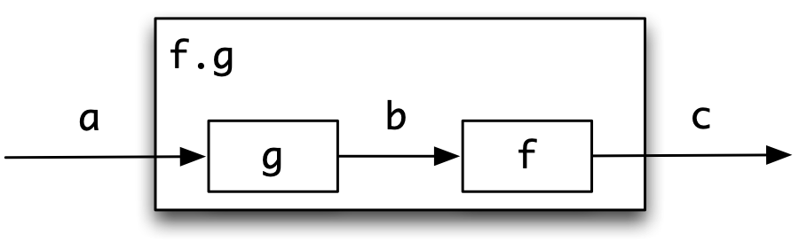
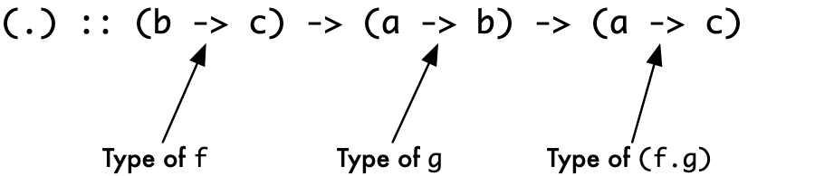
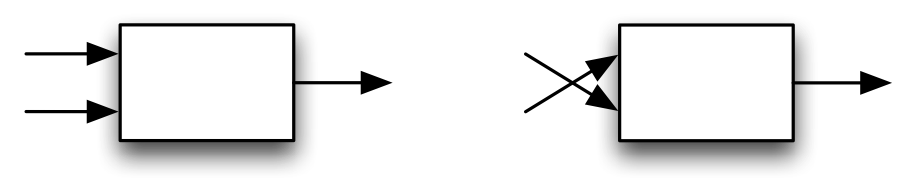
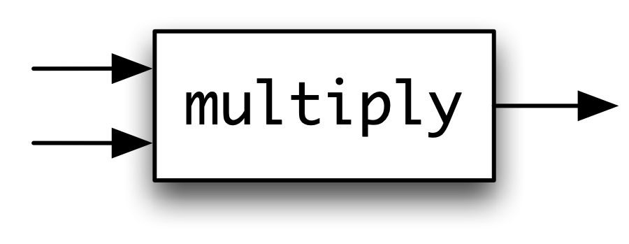
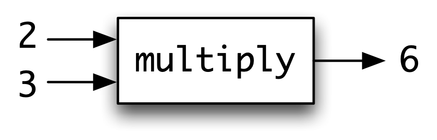
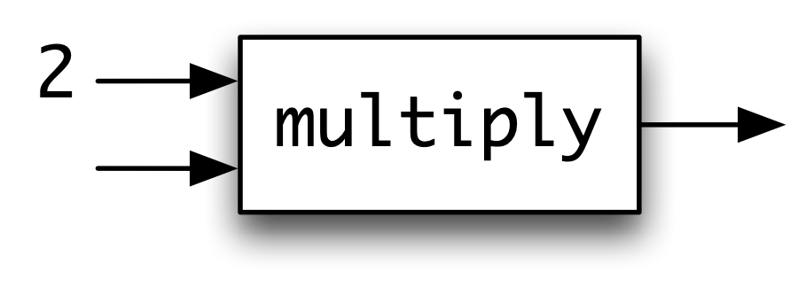
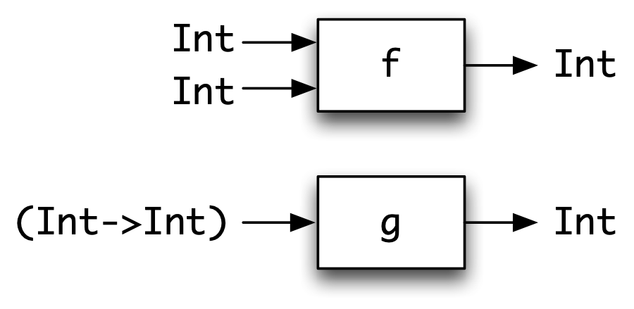
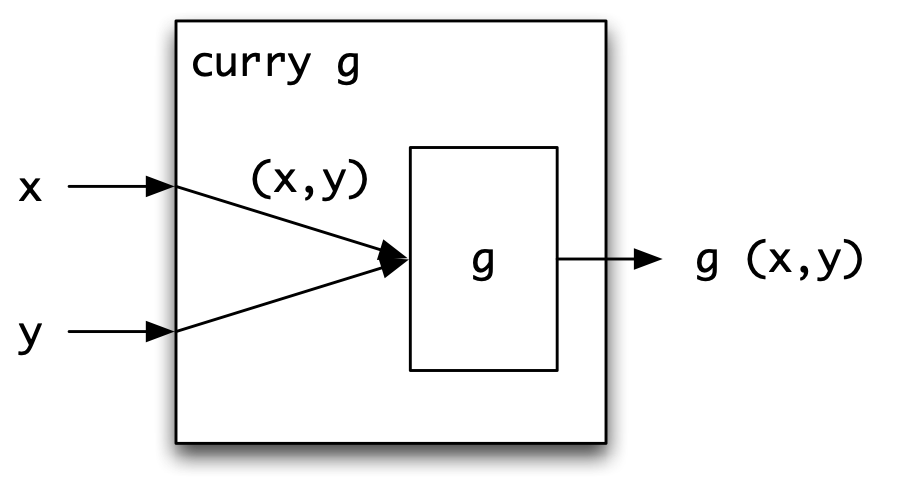
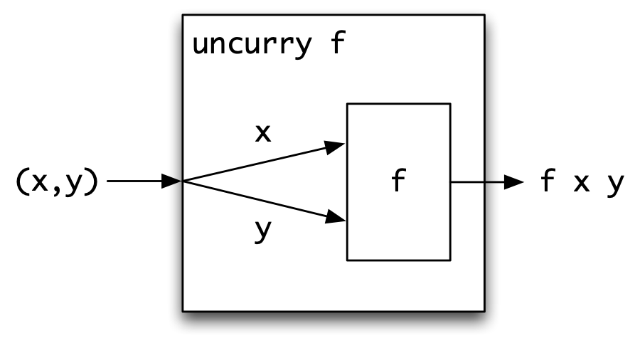
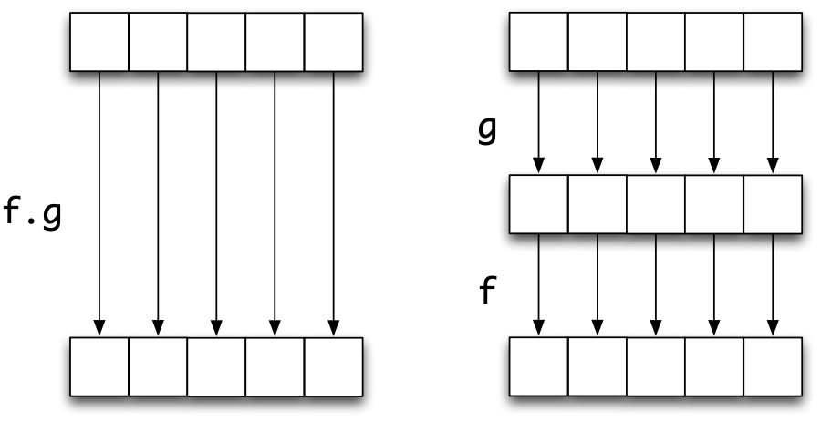

Higher-order functions {#gen2}
======================

Haskell is a *functional* programming language: that means that the main way in which we compute things is by defining functions which describe how to transform the inputs into the required output. Haskell has a collection of built-in data types which we can use to model the data in the problem domain, including numbers, booleans, lists, tuples and `data` types.

Haskell is also functional in a more distinctive way: *functions are data* in Haskell, and can be treated just like data of any other type.

-   Functions can be combined using *operators*, just like the numbers can be combined using the arithmetical operators.

-   Haskell provides *lambda abstractions*, which allow us to describe functions directly by expressions, rather than having to define and name a function in order to use it.

-   Functions can be the inputs and outputs of other functions in exactly the same way as any other type. Functions which have other functions as arguments or results are called *higher-order functions*.

-   In particular, the syntax of Haskell makes it particularly easy to *partially apply* functions and operators, so that functions are returned as the results of applying functions.

This chapter covers these topics, setting the scene for [Developing higher-order programs](12.md#developingHOPs) where will put these ideas into practice.

Finally, we'll also see that we can start to write function-level definitions -- sometimes called 'point-free' definitions -- which can be more concise, more readable and more suitable for program verification and transformation. Indeed, the chapter concludes with some examples of program verification involving higher-order polymorphic functions, and we see there that the theorems proved about them are reusable in exactly the same way that the functions themselves are reusable.

Operators: function composition and application
-----------------------------------------------

This section describes the built-in operators for function composition and application, as well as defining a new operator, forward composition, which composes functions in the 'natural' order.

### Function composition: `.` {#function-composition-. .unnumbered}

<figure><label class="checkbox-label"><input class="checkbox-img" type="checkbox"><span class="img-wrapper"></span></label><figcaption>Function composition</figcaption></figure>

<a id="funComp"></a>

Function composition is one of the simplest ways of structuring a program: do a number of things one after the other: each part can be designed and implemented separately.

Haskell has the **function composition** operator over functions built in. The operator, which is denoted by the '`.`' between the two functions, has the effect of 'wiring together' two functions: passing the output of one to the input of another, and it is . This is pictured in [Function composition](#funComp), where the annotations of the arrows in the diagram indicate the types of elements involved.

For any functions `f` and `g`, the effect of `f.g` is given by the definition

```haskell
(f.g) x = f (g x)  -- (comp.1)
```

Not all pairs of functions can be composed. The output of `g`, `g x`, becomes the input of `f`, so that the output type of `g` must equal the input type of `f`.

Recalling the `Picture` example, we have already seen a definition of `rotate`:

```haskell
rotate :: Picture -> Picture
rotate pic = flipV (flipH pic)  -- (rotate.1)
```

Using the composition operator we can say directly that `rotate` is the composition of `flipH` with `flipV`: like

```haskell
rotate = flipV . flipH  -- (rotate.2)
```

Notice that we explained the definition `(rotate.2)` as the 'composition of `flipH` with `flipV`': why that way round? We do this because `flipH` is the function that is applied first, with `flipV` being applied to the result of the first application. We are able to compose `flipH` with `flipV` because the output of `flipH` and the input of `flipV` are both of `Picture` type.

In general, the constraint on which functions can be composed is expressed by giving '`.`' the type

<figure><label class="checkbox-label"><input class="checkbox-img" type="checkbox"><span class="img-wrapper"></span></label></figure>

which shows that, if we call the first input `f` and the second `g`,

-   The input of `f` and the output of `g` are of the same type: `b`.

-   The result `f.g` has the same input type, `a`, as `g` and the same output type, `c`, as `f`.

Composition is **associative**, that is `f.(g.h) ` is equal to `(f.g).h` for all `f`, `g` and `h`. We can therefore write `f.g.h` unambiguously to mean 'do `h`, then `g`, then `f`'.[^1]

> **The 'binding power' of composition**
>
> There is a common error caused by the binding powers of function application and function composition.
>
> It is an error to write `f.g x` thinking it means `(f.g)` applied to `x`. Because function application binds more tightly than anything else, it is interpreted by the system as `f.(g x)`, which will often lead to a type error. For example, evaluating
>
> ``` {.haskell}
> not.not True
> ```
>
> gives the type error message
>
> ``` {.haskell}
>     Couldn't match expected type `a -> Bool'
>
>             against inferred type `Bool'
>
>     In the second argument of `(.)', namely `not True'
>
>     In the expression: not . not True
>
>     In the definition of `it': it = not . not True
> ```
>
> since there is an attempt to treat `not True` as a function to be composed with `not`. Such a function needs to have type `a -> Bool`, whereas it actually has type `Bool`.
>
> In applying a composition we therefore need to be sure that it is **parenthesized** like this:
>
> ``` {.haskell}
> (not.not) True
> ```

### Forward composition: `>.>` {#forward-composition-. .unnumbered}

The order in `f.g` is significant, and can be confusing; `(f.g)` means 'first apply `g` and then apply `f` to the result', so the function that is applied first comes second in the composition.

It is simple in Haskell to define an operator for composition which takes its arguments in the opposite order to '`.`', like this:

```haskell
infixl 9 >.>

(>.>) :: (a -> b) -> (b -> c) -> (a -> c)

g >.> f = f . g  -- (fcomp.1)
```

This definition has the effect that

```haskell
(g >.> f) x = (f.g) x = f (g x)  -- (fcomp.2)
```

showing that, as it were, the order of the `f` and `g` is swapped before the functions are applied. The `rotate` example can then be written

```haskell
rotate = flipH >.> flipV  
```

which we can read as `flipH` *then* `flipV`, with the functions being applied *from left to right*.

The notation '`>.>`' contains a '`.`' to show that it is a form of composition, with the arrows showing the direction in which information is flowing. We will tend to use '`>.>`' in situations where a number of functions are composed, and it is therefore tiresome to read some lines down the page in order to work out the effect of a function definition.

### The application operator: `$` {#the-application-operator .unnumbered}

We're familiar in Haskell with how to write the application of a function `f` to an argument `e`: we just write `f` next to `e`, like this: `f e`. In other words, we **juxtapose** the function and its argument.

We can also explicitly write down an application using the application operator, '`$`', like this: `f $ e`. Why on earth would we want to do this, when we can write it without the '`$`'? There are two reasons that an explicit application gets used:

-   Many Haskell programmers use '`$`' as an alternative to parentheses, so you may well see this in libraries that people have written. Instead of writing something like

    ```haskell
    flipV (flipH (rotate horse))
    ```

    it is possible to write:

    ```haskell
    flipV  flipH  rotate horse
    ```

    with the same meaning. Arguably this is a little clearer, and it is shorter! Incidentally you can see from this example that '`$`' is **right associative**.

-   We need to use the application operator as a function, as in the example

    ```haskell
    zipWith ($) [sum,product] [[1,2],[3,4]] 
    ```

    where the application operator is applied to corresponding elements of the two lists.

> **Application and composition**
>
> Application and composition can get confused. Function composition combines two functions, while application combines a function and an argument (which can be a function, of course). If, for example, `f` has type `Integer -> Bool`, then
>
> -   `f.x` means `f` composed with the *function* `x`; `x` therefore needs to be of type `s -> Integer` for some type `s`.
>
> -   `f x` means `f` applied to the object `x`, so `x` must therefore be an integer.
>
> -   `f $ x` also means `f` applied to the object `x`, and so `x` must again be an integer.
>
**Exercises**

1.  Redefine the function `printBill` from the supermarket billing exercise in [Extended exercise: supermarket billing](6.md#superBill) so that composition is used. Repeat the exercise using forward composition, `>.>`.

2.  If `id` is the polymorphic identity function, defined by `id x = x`, explain the behaviour of the expressions

    ```haskell
    (id.f)         (f.id)         id f
    ```

    If `f` is of type `Int -> Bool`, at what instance of its most general type `a -> a` is `id` used in each case? What type does `f` have if `f id` is properly typed?

3.  Define a function `composeList` which composes a list of functions into a single function. You should give the type of `composeList`, and explain why the function has this type. What is the effect of your function on an empty list of functions?

4.  What is the type of the application operator, `$`?

5.  What is the result of the expression given above:

    ```haskell
    zipWith ($) [sum,product] [[1,2],[3,4]] 
    ```

6.  If `id` is the polymorphic identity function, defined by `id x = x`, explain the behaviour of the expressions

    ```haskell
    (id $ f)         (f $ id)         id ($)
    ```

    If `f` is of type `Int -> Bool`, at what instance of its most general type `a -> a` is `id` used in each case? What type does `f` have if `f $ id` is properly typed?

Expressions for functions: lambda abstractions {#exprFuns}
----------------------------------------------

Haskell definitions give us a way of defining functions, and once we have defined a function we can use its name to refer to it, as in the application

```haskell
map addOne [2,3,4]
```

assuming that we've already defined

```haskell
addOne x = x+1
```

Haskell gives us a way of writing down an expression that means 'the function that adds one to a number' directly, without having to give it a name. We write

```haskell
\x -> x+1
```

which we can read as saying 'the function that takes `x` to `x+1`', the initial '\\' signalling that it's a function. So, we can add one to all the numbers in the list `[2,3,4]` by writing the expression

```haskell
map (\x -> x+1) [2,3,4]
```

An expression like `(\x -> x+1)` is called a *lambda abstraction*.

> **Why is a called a 'lambda abstraction'?**
>
> The 'lambda' comes from the lambda calculus, a mathematical theory of functions. The symbol '`\`' is the closest ASCII character to the Greek character lambda, `λ`, used in the `λ`-calculus. One of the inventors of the `λ`-calculus was Haskell B. Curry, after whom Haskell is named.
>
> The 'abstraction' comes from the fact that the expression `(\x -> e)` is a function, which 'abstracts away' from the particular expression `e`.

### Examples of lambda abstractions {#examples-of-lambda-abstractions .unnumbered}

Let's take a look at some other uses of this notation now. Suppose that we want to take a list of functions and apply them all to a particular argument,

```haskell
mapFuns :: [a->b] -> a -> [b]
```

giving a list of results. We might do this in playing a game of Rock - Paper - Scissors where we apply a number of different strategies to the current game position, and then compare the different results; we'll come back to this scenario later in the chapter.

We could define the function by recursion, like this:

```haskell
mapFuns [] x     = []
mapFuns (f:fs) x = f x : mapFuns fs x
```

but in fact we can use `map` in making the definition: what we have to do at each element of the list (remember, each element is a function) is to apply it to `x`, so

```haskell
mapFuns fs x = map (\f -> f x) fs
```

What's important to see here is that the function `(\f -> f x)` depends on the value of `x`, and so we cannot define it as a top level function. We could, alternatively, define it in a `where` clause,

```haskell
mapFuns fs x = map applyToX fs
               where
               applyToX f = f x
```

The first definition is clearer, and defines the operative function directly, rather than having to name and define it in a `where` clause, separately from where it is used; of course, either is OK, and it's a matter of taste which you might use.

One of the main uses of lambda abstractions is to define functions which are the results of functions. Let's look at the example of the function

```haskell
addNum :: Integer -> (Integer -> Integer)
```

The function takes an integer, 17 say, and returns a function: in this case the function that adds 17 to its argument. The definition says this directly:

```haskell
addNum n = (\m -> n+m)
```

### 'Plumbing' functions together {#plumbing-functions-together .unnumbered}

Another example which uses a lambda abstraction is given by the 'plumbing' illustrated in [Plumbing f and g together.](#plumb).

<figure><label class="checkbox-label"><input class="checkbox-img" type="checkbox"><span class="img-wrapper"></span></label><figcaption>Plumbing <code>f</code> and <code>g</code> together.</figcaption></figure>

<a id="plumb"></a>

The object shown is a function, whose arguments are `x` and `y`. The result of the function is

```haskell
g (f x) (f y)
```

so the overall effect is to give a function which applies `f` to each of its (two) arguments before applying `g` to the results. Again, the definition states this directly:

```haskell
comp2 :: (a -> b) -> (b -> b -> c) -> (a -> a -> c)

comp2 f g = (\x y -> g (f x) (f y))
```

To add together the squares of `3` and `4` we can write

```haskell
comp2 sq add 3 4
```

where `add` and `sq` have the obvious definitions.

In general, a lambda abstraction is an **anonymous** version of the sort of function we have defined earlier. In other words, the function `f` defined by

```haskell
f x y z = result
```

and the function

```haskell
\x y z -> result
```

have exactly the same effect.

We shall see in the next section that partial application will make many definitions -- including some of the functions here -- more straightforward. On the other hand the lambda abstraction is more general, and thus can be used in situations when a partial application could not.

**Exercises**

1.  Using a lambda abstraction, the Boolean function `not` and the built-in function `elem` describe a function of type

    ```haskell
    Char -> Bool
    ```

    which is `True` only on non-whitespace characters, that is those which are not elements of the list `" \t\n"`.

2.  Define a function `total`

    ```haskell
    total :: (Integer -> Integer) -> (Integer -> Integer)
    ```

    so that `total f` is the function which at value `n` gives the total

    ```haskell
    f 0 + f 1 + ... + f n
    ```

    You should be able to do this using built-in functions, rather than using recursion.

3.  Given a function `f` of type `a -> b -> c`, write down a lambda abstraction that describes the function of type `b -> a -> c` which behaves like `f` but which takes its arguments in the other order. Pictorially,

    <figure><label class="checkbox-label"><input class="checkbox-img" type="checkbox"><span class="img-wrapper"></span></label></figure>

4.  Using the last exercise, or otherwise, give a definition of the function

    ```haskell
    flip :: (a -> b -> c) -> (b -> a -> c) 
    ```

    which reverses the order in which its function argument takes its arguments.

Partial application
-------------------

In this section we'll discover how it is possible to *partially apply* functions in Haskell, and what the effect of this is. Underlying the Haskell approach to functions is what is called the *curried* representation of functions, in honour of Haskell Curry; this is introduced in the section after this.

### Introducing partial application {#introducing-partial-application .unnumbered}

The function `multiply` multiplies together two arguments,

```haskell
multiply :: Int -> Int -> Int
multiply x y = x*y
```

We can view the function as a box, with two input arrows and an output arrow.

<figure><label class="checkbox-label"><input class="checkbox-img" type="checkbox"><span class="img-wrapper"></span></label></figure>

If we apply the function to two arguments, the result is a number; so that, for instance, `multiply 2 3` equals `6`.

<figure><label class="checkbox-label"><input class="checkbox-img" type="checkbox"><span class="img-wrapper"></span></label></figure>

What happens if `multiply` is applied to **one** argument `2`? Pictorially, we have

<figure><label class="checkbox-label"><input class="checkbox-img" type="checkbox"><span class="img-wrapper"></span></label></figure>

From the picture we can see that this represents a function, as there is still one input arrow to the function awaiting a value. This function will, when given the awaited argument `y`, return double its value, namely `2*y`.

This is an example of a general phenomenon: any function taking two or more arguments can be **partially applied** to one or more arguments. This gives a powerful way of forming functions as results.

### Example: the `doubleAll` function {#example-the-doubleall-function .unnumbered}

To illustrate, we at the example of the function which doubles every element in a list of integers. The function can be defined like this:

```haskell
doubleAll :: [Int] -> [Int]
doubleAll = map (multiply 2)
```

In this definition there are two partial applications:

-   `multiply 2` is a function from integers to integers, given by applying `multiply` to one rather than two arguments;

-   `map (multiply 2)` is a function from `[Int]` to `[Int]`, given by partially applying `map`.

Partial application is being put to two different uses here.

-   In the first case -- `multiply 2` -- the partial application is used to form the function which multiplies by two, and which is passed to `map` to form the `doubleAll` function.

-   the second partial application -- of `map` to `multiply 2` -- could be avoided by writing the argument to `doubleAll`

    ```haskell
    doubleAll xs = map (multiply 2) xs
    ```

    but it is quite possible to write a *function level* definition like this, and it is shorter and clearer than the definition with the arguments supplied.

In [Expressions for functions: lambda abstractions](#exprFuns) we saw the example of `addNum`,

```haskell
addNum n = (\m -> n+m)
```

which when applied to an integer `n` was intended to return the function which adds `n` to its argument. With partial application we have a simpler mechanism, as we can say

```haskell
addNum n m = n+m
```

since when `addNum` is applied to one argument `n` it returns the function adding `n` to its argument.

> **Order of arguments**
>
> It is not always possible to make a partial application, since the argument to which we want to apply the function may not be its first argument. Let's look at the function
>
> ``` {.haskell}
> elem :: Char -> [Char] -> Bool
> ```
>
> We can test whether a character `ch` is a whitespace character by writing
>
> ``` {.haskell}
> elem ch whitespace
> ```
>
> where `whitespace` is the string `" \t\n"`. We would like to write the function to test this by partially applying `elem` to `whitespace`, but cannot, because this is the secdon argument rather than the first.
>
> One solution is to define a variant of `elem` which takes its arguments in the other order, as in
>
> ``` {.haskell}
> member xs x = elem x xs
> ```
>
> and write the function as the partial application
>
> ``` {.haskell}
> member whitespace
> ```
>
> Alternatively, we can write down this function as a lambda abstraction, like this:
>
> ``` {.haskell}
> \ch -> elem ch whitespace
> ```

### Partially applied operators: operator sections {#opsecs .unnumbered}

The operators of the language can be partially applied, giving what are known as **operator sections**. Examples include

|            |                                                                                                    |
|:-----------|:---------------------------------------------------------------------------------------------------|
| `(+2)`     | The function which adds two to its argument.                                                       |
| `(2+)`     | The function which adds two to its argument.                                                       |
| `(>2)`     | The function which returns whether a number is greater than two.                                   |
| `(3:)`     | The function which puts the number `3` on the front of a list.                                     |
| `(++"\n")` | The function which puts a newline at the end of a string.                                          |
| `("\n"++)` | The function which puts a newline at the beginning of a string.                                    |
| `($ 3)`    | The function which applies its argument -- which will have to be a function -- to the integer `3`. |

The general rule here is that a section of the operator `op` will put its argument to the side which completes the application. That is,

```haskell
(op x) y = y op x
(x op) y = x op y
```

When combined with higher-order functions like `map`, `filter` and composition, the notation is both powerful and elegant, enabling us to make a whole lot more function-level definitions. For example,

```haskell
filter (>0) . map (+1)
```

is the function which adds one to each member of a list, and then removes those elements which are not positive.

> **Parentheses in Haskell**
>
> The main role of parentheses, `(` ...`)`, in Haskell is to group items together so that the system interprets what you have written in the right way. Typical examples include
>
> -   enclosing a pattern in a definition, as in `sum (Node t1 t2) = …`;
>
> -   enclosing a negative literal in a function application, as in `fac (-1)`;
>
> -   enclosing a type annotation, as in `foldr plus (1::Int) [1..1000]`;
>
> -   overriding the binding power of operators, as in `(2+3)*6`;
>
> -   grouping names in a `deriving` clause like `deriving (Eq, Show) `.
>
> However, other uses of parentheses have an effect of building data elements or changing the meaning of an identifier.
>
> -   To form a tuple, it is necessary to enclose the items in parentheses, as in `(1,True)`; the notation `1,True` on its own is meaningless.
>
> -   To turn an infix operator into a prefix operator, it must be enclosed in parentheses, as in `(&&)`.
>
> -   To form an operator section, the operator and arguments are enclosed in parentheses as seen in this example: `(&& True).(0 /=).(‘rem‘ 2)`.
>
### Using partial applications {#using-partial-applications .unnumbered}

The partial application and operator sections is important in Haskell programming. We have already seen that many functions can be defined as **specializations** of general operations

like `map`, `filter` and so on. These specializations arise by passing a function to the general operation -- this function is often given by a partial application, as in the examples from the pictures case study first seen in [Introducing functional programming](1.md#intro):

```haskell
flipV  = map reverse
beside = zipWith (++)
```

We return to look at the `Picture` case study in greater detail in [Revisiting the Picture example](12.md#hofPicture).

More examples of partial applications will be seen throughout the material to come, and can be used to simplify and clarify many of the preceding examples. Three simple examples are the text processing functions we first looked at in [Example: text processing](7.md#textProc):

```haskell
dropSpace = dropWhile (member whitespace)
dropWord  = dropWhile (not . member whitespace)
getWord   = takeWhile (not . member whitespace)
```

where

```haskell
member xs x = elem x xs
```

**Exercises**

1.  Use partial applications to define the functions `comp2` and `total` given in [Expressions for functions: lambda abstractions](#exprFuns) and its exercises.

2.  Find operator sections `sec_1` and `sec_2` so that

    ```haskell
    map sec_1 . filter sec_2
    ```

    has the same effect as

    ```haskell
    filter (>0) . map (+1)
    ```

3.  Re-define the function `mapFuns`, first defined in [Expressions for functions: lambda abstractions](#exprFuns), using an operator section of the application operator, `$`.

Under the hood: curried functions
---------------------------------

Functions in Haskell are represented in **curried** form, where they take their arguments one at a time. This

is called **currying** after Haskell Curry[^2] who was one of the pioneers of the `λ`-calculus and after whom the Haskell language is named. This section explains how curried functions work, and how we can covert to and fro between curried and uncurried form.

Why are Haskell functions in curried form? A major reason is that it supports partial application, as explored in the previous section; it also gives a 'clean' readable form to the syntax. One reason against choosing a curried representation is its unfamiliarity to most programmers; another is discussed towards the end of the section.

### Curried functions and function arguments {#curried-functions-and-function-arguments .unnumbered}

Partial application can appear confusing: in some contexts functions appear to take one argument, and in others more than one. In fact, *every function in Haskell takes exactly one argument*. This is called the **curried** representation of functions.If this application yields a function, then this function may be applied to a further argument, and so on. Consider the multiplication function again.

```haskell
multiply :: Int -> Int -> Int
```

This is shorthand for

```haskell
multiply :: Int -> (Int -> Int)
```

and so it can therefore be applied to an integer. Doing this gives (for example)

```haskell
multiply 2 :: Int -> Int
```

This can itself be applied to give

```haskell
(multiply 2) 5 :: Int
```

which, since function application is left associative, can be written

```haskell
multiply 2 5 :: Int
```

Our explanations earlier in the book are consistent with this full explanation of the system. We hid the fact that

```haskell
f e_1 e_2 ... e_k
t_1 -> t_2 -> ... t_n -> t
```

were shorthand for

```haskell
( ...((f e_1) e_2) ... e_k)
t_1 -> (t_2 -> (...(t_n -> t)...))
```

but this did no harm to our understanding of how to use the Haskell language. It is to support this shorthand that function application is made left associative and `->` is made right associative.

> **The syntax of application and `->`**
>
> Function application is **left associative** so that `f x y` means `(f x) y`, *not* `f (x y)`.
>
> The function space symbol '`->`' is **right associative**, so that `a -> b -> c` means `a -> (b -> c)`, *not* `(a -> b) -> c`.

> **The arrow is not associative.**
>
> Functions `f :: Int -> Int -> Int` and `g :: (Int -> Int) -> Int` are illustrated here
>
> <figure><label class="checkbox-label"><input class="checkbox-img" type="checkbox"><span class="img-wrapper"></span></label></figure>
>
> The function `f` will yield a function from `Int` to `Int` when given a `Int` -- an example is `multiply`. On the other hand, when given a function of type `Int -> Int`, `g` yields a `Int`. An example is
>
> ``` {.haskell}
> g :: (Int -> Int) -> Int
>
> g h = (h 0) + (h 1)
> ```
>
> The function `g` defined here takes a function `h` as argument and returns the sum of `h`'s values at `0` and `1`, and so `g succ` will have the value `3`.

### The types of partial applications {#the-types-of-partial-applications .unnumbered}

How is the type of a partial application determined? There is a simple rule which explains it.

**Definition 1.**

Rule of cancellation

> If the type of a function `f` is
>
> ``` {.haskell}
> t_1 -> t_2 -> ... -> t_n -> t
> ```
>
> and it is applied to arguments
>
> ``` {.haskell}
> e_1::t_1, e_2::t_2, ..., e_k::t_k
> ```
>
> (where`k≤n`)thentheresulttypeisgivenby**cancelling**thetypes`t_1`to t\_k
>
> ``` {.haskell}
> /t_1 -> /t_2 -> ... -> /t_k-> t_k+1 -> ... -> t_n -> t
> ```
>
> which gives the type
>
> ``` {.haskell}
> t_k+1 -> t_k+2 -> ... -> t_n -> t
> ```

For example, using this rule we can see that we get the following types

```haskell
multiply 2      :: Int -> Int
multiply 2 3    :: Int
doubleAll       :: [Int] -> [Int]
doubleAll [2,3] :: [Int]
```

### Currying and uncurrying {#curry .unnumbered}

In Haskell we have a choice of how to model functions of two or more arguments. For instance, a function to multiply two integers would normally be defined thus:

```haskell
multiply :: Int -> Int -> Int
multiply x y = x*y
```

while an **uncurried** version can be given by bundling the arguments into a pair, thus:

```haskell
multiplyUC :: (Int,Int) -> Int
multiplyUC (x,y) = x*y
```

Why do we usually opt for the curried form? There are a number of reasons.

-   The notation is somewhat neater; we apply a function to a single argument by juxtaposing the two, `f x`, and application to two arguments is done by extending this thus: `g x y`.

-   It permits partial application. In the case of multiplication we can write expressions like `multiply 2`, which returns a function, while this is not possible if the two arguments are bundled into a pair, as is the case for `multiplyUC`.

We can in any case move between the curried and uncurried representations with little difficulty, and indeed we can define two higher-order functions which convert between curried and uncurried functions.

Suppose first that we want to write a curried version of a function `g`, which is itself uncurried and of type `(a,b) -> c`.

<figure><label class="checkbox-label"><input class="checkbox-img" type="checkbox"><span class="img-wrapper"></span></label></figure>

This function expects its arguments as a pair, but its curried version, `curry g`, will take them separately -- we therefore have to form them into a pair before applying `g` to them:

```haskell
curry :: ((a,b) -> c) -> (a -> b -> c)
curry g x y = g (x,y)
```

`curry multiplyUC` will be exactly the same function as `multiply`.

Suppose now that `f` is a curried function, of type `a -> b -> c`.

<figure><label class="checkbox-label"><input class="checkbox-img" type="checkbox"><span class="img-wrapper"></span></label></figure>

The function `uncurry f` will expect its arguments as a pair, and these will have to be separated before `f` can be applied to them:

```haskell
uncurry :: (a -> b -> c) -> ((a,b) -> c)
uncurry f (x,y) = f x y
```

`uncurry multiply` will be exactly the same function as `multiplyUC`. The functions `curry` and `uncurry` are inverse to each other.

A disadvantage of the curried representation of functions is that the inverse of a function like

```haskell
unzip :: ([a,b]) -> ([a],[b])
```

is not `zip :: [a] -> [b] -> [(a,b)]` but in fact

```haskell
uncurry zip :: ([a],[b]) -> [(a,b)]
```

(or `zip’` as we called it earlier in the book) so that statements of properties of these functions, such as

```haskell
prop_zip xs = uncurry zip (unzip xs) == xs
```

will necessarily involve the uncurried version of the binary function, rather than the curried.

**Exercises**

1.  What is the effect of `uncurry ($)`? What is its type? Answer a similiar question for `uncurry (:)`, `uncurry (.)`.

2.  \[Harder\] What are the effects and types of `uncurry uncurry`, `curry uncurry`.

3.  Can you state a property relating `unzip` and `uncurry zip`, where the latter is the function applied first?

4.  Can you define functions

    ```haskell
    curry3 :: ((a,b,c) -> d) -> (a -> b -> c -> d)
    uncurry3 :: (a -> b -> c -> d) -> ((a,b,c) -> d)
    ```

    which perform the analogue of `curry` and `uncurry` but for three arguments rather than two? Can you use `curry` and `uncurry` in these definitions?

5.  \[Harder\] Can you define functions

    ```haskell
    curryList :: ([a] -> d) -> (a -> [a] -> d)
    uncurryList :: (a -> [a] -> d) -> ([a] -> d)
    ```

    which perform the analogue of `curry` and `uncurry` but for a list of arguments rather than two distinct arguments? Can you use `curry` and `uncurry` in these definitions?

Defining higher-order functions {#defHOFs}
-------------------------------

This section revises the different ways that we can use to define higher-order functions, and in particular functions that return functions as results. These functions are one of the features of functional programming not shared with most other programming languages that you might be familiar with, and give Haskell particular elegance and power.

### Using the operators {#using-the-operators .unnumbered}

We can use the built-in operators in defining functions directly. We already saw that we could define forward composition in terms of composition,

```haskell
f >.> g = g.f
```

We also saw this in action in the definition of `rotate` from the `Picture` case study:

```haskell
rotate :: Picture -> Picture
rotate = flipV . flipH
```

where again the function is defined directly as the *composition* of two other functions. The meaning of this definition is just the same as one which has explicit arguments:

```haskell
rotate pic = flipV (flipH pic)
```

but the earlier definition is clearer to read and to modify; we see *explicitly* that the definition is a composition of two functions, rather than having to see it as a consequence of the way the right-hand side is defined in the latter equation.

More importantly, if we state a definition in this form, then we can apply properties of '`.`' in analysing how `rotate` behaves. This means that in proofs we are able to use properties of composition, as well as being able to see examples of program transformations which will apply because of the form of composition involved. In general these remarks will apply to all higher-order, polymorphic functions, and we see examples of this in [Verification and general functions](#verifGen) below.

Let's look at some more examples which use composition in their definitions: the simplest is this:

```haskell
twice f = f.f  -- (twice.1)
```

`f` is a function, and the result is `f` composed with itself. For this to work, it needs to have the same input and output type, so we have

```haskell
twice :: (a -> a) -> (a -> a)
```

This states that `twice` takes one argument, a function of type `(a -> a)`, and returns a result of the same type. For instance, if `succ` is the function to add one to an integer,

```haskell
succ :: Integer -> Integer
succ n = n+1
```

then applying `twice` to it gives the example

```haskell
(twice succ) 12
~> (succ.succ) 12   -- by (twice.1)
~> succ (succ 12)   -- by definition of  .
~> 14
```

We can generalize `twice` so that we pass a parameter giving the number of times the functional argument is to be composed with itself

```haskell
iter :: Integer -> (a -> a) -> (a -> a)

iter n f 
  | n>0         = f . iter (n-1) f  -- (iter.1)
  | otherwise   = id  -- (iter.2)
```

This is a standard primitive recursion over the integer argument; in the positive case we take the composition of `f` with itself `n-1` times and compose once more with `f`. In the zero case we apply `f` no times, so the result is a function which returns its argument unchanged, namely `id`.

As an example of using `iter`, we can define `2^n` as `iter n double 1`, if `double` doubles its argument.

**Exercises**

1.  Give calculations of

    ```haskell
    iter 3 double 1
    (comp2 succ (*)) 3 4
    comp2 sq add 3 4
    ```

2.  What is the type and effect of the function

    ```haskell
    \n -> iter n succ
    ```

3.  Give an alternative "constructive" definition of `iter` which creates the list of `n` copies of `f`

    ```haskell
    [f,f,...,f]
    ```

    and then composes these functions by folding in the operator '`.`' to give

    ```haskell
    f . f . ... . f
    ```

### Using local definitions {#using-local-definitions .unnumbered}

Local definitions allow us to define functions as a subsidiary part of a function definition. We looked earlier at the example of

```haskell
addNum :: Integer -> Integer -> Integer
```

We can use a local definition to give the result, either using a `where`

```haskell
addNum n = addN
           where
           addN m = n+m
```

or a `let`

```haskell
addNum n = let 
             addN m = n+m
           in
             addN
```

This gives us a way of defining results which are functions by locally defining that function and returning it as the result; it has the advantage of not requiring any more advanced machinery, but the disadvantage of introducing a named definition of `addN` which is extraneous to the actual result.

### Lambda abstractions {#lambda-abstractions .unnumbered}

Let's try to define a function that takes a binary function as argument, and which returns a binary function that takes its arguments in the opposite order; let's call it `flip`:

```haskell
flip :: (a -> b -> c) -> (b -> a -> c)
```

We can use a lambda abstraction to give the result:

```haskell
flip f = \x y -> f y x  -- (flip.1)
```

This makes clear that a function like `flip map` takes as its first argument the list and as its second the function to be mapped; it can then be partially applied to its first argument, having the effect of applying `map` to its second only. This allows us to do a partial application to the second argument of a two argument function.

### Partial application {#partial-application-1 .unnumbered}

Partial applications give us a particularly direct way of defining some higher order functions. Taking the example we have just looked at, we can instead say

```haskell
flip f x y = f y x
```

If we apply `flip` to one argument, we have a function which behaves just as described in `(flip.1)`. Similarly, the behaviour of

```haskell
addNum n = addN
           where
           addN m = n+m
```

is given by the simple definition

```haskell
addNum n m = n+m
```

partially applied to `n`.

> **Constructors are functions too**
>
> Datatype constructors are functions, and so they can be partially applied, passed as arguments to functions or indeed returned as results. To give just one example, this expression creates a list of `People` from lists of names and ages:
>
> ``` {.haskell}
> zipWith Person ["Geraint","Bob"] [45,67]
> ```

> **Point-free programming**
>
> Some function-level, or 'point-free', definitions express what the function does with real clarity: writing<a id="pointfree"></a> ` flipV = map reverse ` precisely describes how to flip a picture in a vertical mirror. However, it is possible to take this approach too far, and write definitions which it's very hard to understood. For instance, what does this function do:
>
> ``` {.haskell}
> puzzle = (.) (.)
> ```
>
> Reading the definition tells us that it is the composition operator partially applied to itself, but still it's not clear what the function will do. How can we work out what it does? The best way is to apply it to some arguments and see what it does:
>
> ``` {.haskell}
> (.) (.) x ~>(.).x
> ```
>
> so
>
> ``` {.haskell}
> (.) (.) x y ~>((.).x) y ~>(.) (x y)
> ```
>
> Applying to a third argument gives
>
> ``` {.haskell}
> (.) (.) x y z ~> ... ~>(.) (x y) z ~>(x y) . z
> ```
>
> and finally
>
> ``` {.haskell}
> (.) (.) x y z w ~> ... ~>((x y) . z) w ~>(x y) (z w)
> ```
>
> giving us the much more informative explanation:
>
> ``` {.haskell}
> puzzle x y z w = (x y) (z w)
> ```
>
> Finally, we use to get GHCi to give its type, like this `:type (.)(.)` and get
>
> ``` {.haskell}
> (.)(.) :: (a1 -> b -> c) -> a1 -> (a -> b) -> a -> c
> ```
>
> So there we are ... To be fair, once we understand what `puzzle` does, it can be useful to have the original definition which explicitly uses the composition operator, because then any general laws that we discover for `(.)` will apply to `puzzle` too.

### Examples {#examples .unnumbered}

We conclude this section by exploring how partial applications and operator sections can be used to simplify and shorten definitions in a number of other examples. Often it is possible to avoid giving an explicit function definition if we can use a partial application to return a function. Revisiting the examples of [Defining functions over lists](7.md#defFunLists) we see that to double all the elements in a list we can write

```haskell
doubleAll :: [Int] -> [Int]
doubleAll = map (*2)
```

using an operator section `(*2)` to replace the `double` function, and giving the function definition directly by partially applying `map`.

To filter out the even elements in a numerical list, we have to check whether the remainder on dividing by two is equal to zero. As a function we can write

```haskell
(==0).(`mod` 2)
```

This is the composition of two operator sections: first find the remainder on dividing by two, then check if it is equal to zero. (Why can we not write `(‘mod‘ 2 == 0)`?) The filtering function can then be written

```haskell
getEvens :: [Int] -> [Int]
getEvens = filter ((==0).(`mod` 2))
```

Our final example comes from the list splitting study. We defined

```haskell
getWord xs 
  = getUntil p xs
    where 
    p x = elem x whitespace
```

The local definition is not now needed, as we can define the function `p` by an operator section:

```haskell
getWord xs = getUntil (`elem` whitespace) xs
```

Note the way that we partially apply a function to its *second* argument, by forming an operator section. This works because

```haskell
(`elem` whitespace) x
= x `elem` whitespace
= elem x whitespace
```

as required.

Finally, the function `getWord` can itself be given a direct definition, by partial application thus

```haskell
getWord = getUntil (`elem` whitespace)
```

This definition reads like an informal explanation -- to get a word, get characters until a whitespace character is found.

**Exercises**

1.  Using partial application re-define the function

    ```haskell
    mapFuns :: [a->b] -> a -> [b]
    ```

    first defined in [Expressions for functions: lambda abstractions](#exprFuns).

2.  \[Harder\] Define a function

    ```haskell
    slope :: (Float -> Float) -> (Float -> Float)
    ```

    which takes a function `f` as argument, and returns (an approximation to) its derivative `f’` as result.

3.  \[Harder\] Define a function

    ```haskell
    integrate :: (Float -> Float) -> (Float -> Float -> Float)
    ```

    which takes a function `f` as argument, and returns (an approximation to) the two argument function which gives the area under its graph between two end points as its result.

Verification and general functions {#verifGen}
----------------------------------

Verification can take on a different character when we look at higher-order polymorphic functions. We can start to prove equalities between functions, rather than between values of functions, and we shall also see that we are able to prove theorems which resemble their subjects in being general and reusable, and so applicable in many contexts.

### Function-level verification {#function-level-verification .unnumbered}

We claimed in [Defining higher-order functions](#defHOFs) that the function `iter` is a generalization of `twice`, since

```haskell
iter 2 f
  = f . iter 1 f  -- by (iter.1)
  = f . (f . iter 0 f)  -- by (iter.1)
  = f . (f . id)  -- by (iter.2)
  = f . f  -- by (compId)
  = twice f  -- by (twice.1)
```

In proving this we have used the equality between two functions

```haskell
f . id = f   -- (compId)
```

How is this proved? We examine how each side behaves on an arbitrary argument `x`

```haskell
(f . id) x
  = f (id x)
  = f x
```

so that for any argument `x` the two functions have the same behaviour. As black boxes, they are therefore the same. As what interests us here is their behaviour, we say that they are equal. We call this 'black-box' concept of equality **extensional**.

**Definition 2.**

Principle of extensionality:

Two functions `f` and `g` are equal if they have the same value at every argument.

This is called extensionality in contrast to the idea of **intensionality** in which we say two functions are the same only if they have the same definitions -- we no longer think of them as black boxes; we are allowed to look inside them to see how the mechanisms work, as it were. If we are interested in the results of our programs, all that matters are the values given by functions, not how they are arrived at. We therefore use extensionality when we are reasoning about function behaviour in Haskell. If we are interested in **efficiency** or other performance aspects of programs, then the way in which a result is found *will* be significant, however. This is discussed further in [Time and space behaviour](20.md#behaviour).

**Exercises**

1.  Using the principle of extensionality, show that function composition is associative: that is, for all `f`, `g` and `h`,

    ```haskell
    f . (g . h) = (f . g) . h
    ```

2.  Show that for all `f`,

    ```haskell
    id . f = f
    ```

3.  Show that the function `flip` defined in [Currying and uncurrying](#curry) satisfies

    ```haskell
    flip . flip = id
    ```

    Hint: to show this, you might want to prove that for any `f`,

    ```haskell
    flip (flip f) = f
    ```

4.  Two functions `f` and `g` are **inverses** if it can be shown that

    ```haskell
    f . g = id              g . f = id
    ```

    Prove that the functions `curry` and `uncurry` of [Currying and uncurrying](#curry) are inverses. Can you think of other pairs of inverse functions?

5.  Using induction, prove that for all natural numbers `n`,

    ```haskell
    iter n id = id
    ```

6.  A function `f` is called **idempotent** if

    ```haskell
    f . f = f
    ```

    Show that the functions `abs` and `signum` are idempotent. Can you think of any other idempotent functions?

### Higher-level proofs {#higher-level-proofs .unnumbered}

Our verification thus far has concentrated on first-order, monomorphic functions. Just as `map`, `filter` and `fold` generalize patterns of definition, we shall find that proofs about these functions generalize results we have seen already. To give some examples, it is not hard to prove that

```haskell
doubleAll (xs++ys) = doubleAll xs ++ doubleAll ys
```

holds for all finite lists `xs` and `ys`. When `doubleAll` is defined as `map (*2)` it becomes clear that we have an example of a general result,

```haskell
map f (xs++ys) = map f xs ++ map f ys  -- (map++)
```

which is valid for *any* function `f`. We also claimed in an earlier exercise that

```haskell
sum (xs++ys) = sum xs + sum ys  -- (sum.3)
```

for all finite lists `xs`, `ys`. The function `sum` is given by folding in `(+)`,

```haskell
sum = foldr (+) 0
```

and we have, generally, if `f` is associative, and `st` is an identity for `f`, that is, <a id="assocId"></a>

```haskell
x `f` (y `f` z) = (x `f` y) `f` z
x `f` st = x = st `f` x
```

for all `x`, `y`, `z` then the equation

```haskell
foldr f st (xs++ys) = f (foldr f st xs) (foldr f st ys)  -- (foldr.3)
```

holds for all finite `xs` and `ys`. Obviously `(+)` is associative and has `0` as an identity, and so `(sum.3)` is a special case of `(foldr.3)`. Now we give three proofs of examples in the same vein.

### `map` and composition {#map-and-composition .unnumbered}

A first example concerns `map` and composition. Recall the definitions

```haskell
map f []     = []   -- (map.1)
map f (x:xs) = f x : map f xs  -- (map.2)
(f . g) x    = f (g x)  -- (comp.1)
```

It is not hard to see that we should be able to prove that

```haskell
map (f . g) xs = (map f . map g) xs   -- (map.3)
```

holds for every finite list `xs`.

<figure><label class="checkbox-label"><input class="checkbox-img" type="checkbox"><span class="img-wrapper"></span></label></figure>

Applying `(f . g)` to every member of a list should be the same as applying `g` to every member of the list and then applying `f` to every member of the result. It is proved just as easily, by structural induction. The `(base)` case requires the identity to be proved for the empty list.

```haskell
map (f . g) [] = []   -- by (map.1)

(map f . map g) [] 
  = map f (map g [])   -- by (comp.1)
  = map f []   -- by (map.1)
  = []   -- by (map.1)
```

Assuming that

```haskell
map (f . g) xs = (map f . map g) xs  -- (hyp)
```

is true, it is now necessary to prove that

```haskell
map (f . g) (x:xs) = (map f . map g) (x:xs)  -- (ind)
```

Again, it is enough to analyse each side of the equation.

```haskell
map (f . g) (x:xs) 
  = (f . g) x : map (f . g) xs   -- by (map.2)
  = f (g x) : map (f . g) xs   -- by (comp.1)

(map f . map g) (x:xs) 
  = map f (map g (x:xs))   -- by (comp.1)
  = map f (g x : map g xs)   -- by (map.2)
  = f (g x) : map f (map g xs)   -- by (map.2)
  = f (g x) : (map f . map g) xs   -- by (comp.1)
```

The induction hypothesis is exactly what is needed to prove the two sides equal, completing the proof of the induction step and the proof itself. ∎

Each Haskell list type, besides containing finite lists, also contains infinite and partial lists. In [Lazy programming](17.md#lazy) these will be explained and it will be shown that `(map.3)` is true for *all* lists `xs`, and therefore that the functional equation

```haskell
map (f . g) = (map f) . (map g)
```

holds in general.

### `map` and `filter` {#map-and-filter .unnumbered}

The proof above showed how properties of functional programs could be proved from the definitions of the functions in a straightforward way. The properties can state how the program behaves -- that a sorting function returns an ordered list, for instance -- or can relate one program to another. This latter idea underlies **program transformation** for functional languages. This section introduces an example called **filter promotion** which is one of the most useful of the basic functional transformations. <a id="filterMap"></a>

```haskell
filter p . map f = map f . filter (p . f)  -- (filter/map)
```

The equation says that a `map` followed by a `filter` can be replaced by a `filter` followed by a `map`. The right-hand side is potentially more efficient than the left, since the `map` operation will there be applied to a shorter list, consisting of just those elements with the property `(p . f)`. An example is given by the function first defined in [Partially applied operators: operator sections](#opsecs).

```haskell
filter (0<) . map (+1)
```

Instead of mapping first, the function can be replaced by

```haskell
map (+1) . filter ((0<) . (+1))
 = map (+1) . filter (0<=)
```

and it is clear that here the transformed version is more efficient, since the test `(0<=)` is no more costly than `(0<)`. The proof that

```haskell
(filter p . map f) xs = (map f . filter (p . f)) xs
```

for finite lists `xs` is by structural induction. First we reiterate the definitions of `map`, `filter` and `composition`.

```haskell
map f []        = []   -- (map.1)
map f (x:xs)    = f x : map f xs  -- (map.2)

filter p []     = []  -- (filter.1)
filter p (x:xs) 
  | p x         = x : filter p xs  -- (filter.2)
  | otherwise   =     filter p xs  -- (filter.3)

(f . g) x       = f (g x)  -- (comp.1)
```

The base case consists of a proof of

```haskell
(filter p . map f) [] = (map f . filter (p . f)) []   -- (base)
```

This is true since

```haskell
(filter p . map f) []
  = filter p (map f [])   -- by (comp.1)
  = filter p []   -- by (map.1)
  = []   -- by (filter.1)
```

and

```haskell
(map f . filter (p . f)) []
  = map f (filter (p . f) [])    -- by (comp.1)
  = map f []    -- by (filter.1)
  = []    -- by (map.1)
```

In the induction step, a proof of

```haskell
(filter p . map f) (x:xs) = (map f . filter (p . f)) (x:xs)   -- (ind)
```

is required, using the induction hypothesis

```haskell
(filter p . map f) xs = (map f . filter (p . f)) xs   -- (hyp)
```

The proof begins with an analysis of the left-hand side of `(ind)`.

```haskell
(filter p . map f) (x:xs)
  = filter p (map f (x:xs))    -- by (comp.1)
  = filter p (f x : map f xs)   -- by (map.2)
```

There are two[^3] cases to consider: whether `p (f x)` is `True` or `False`. Taking the case where `p (f x)` is `True`, we continue to examine the left-hand side of `(ind)`, giving

```haskell
  = f x : filter p (map f xs)    -- by (filter.2)
  = f x : (filter p . map f) xs   -- by (comp.1)
  = f x : (map f . filter (p . f)) xs   -- by (hyp)
```

Now we look at the right-hand side of `(ind)`, also assuming that `p (f x)` is `True`:

```haskell
(map f . filter (p . f)) (x:xs) 
  = map f (filter (p . f) (x:xs))  -- by (comp.1) 
  = map f (x: (filter (p . f) xs))  -- by (filter.2) 
  = f x : map f (filter (p . f) xs)  -- by (map.2)
  = f x : (map f . filter (p . f)) xs   -- by (comp.1)
```

which shows that `(ind)` holds in the case that `p (f x)` is `True`.

A similar chain of reasoning gives the same result in the case where `p (f x)` is `False`. This establishes `(ind)` assuming `(hyp)`, and so together with `(base)` completes the proof of the filter promotion transformation in the case of finite lists; it holds, in fact, for all lists. ∎

<a id="QChofs"></a>

We've already seen that QuickCheck is a very good way of checking whether particular properties hold for functions that we define. QuickCheck works by generating random test data and checking whether properties hold at these values. While generating data is not entirely straightforward for structured types like lists and algebraic types, it can be done. Generating random functions is more difficult, and isn't supported "out of the box" by QuickCheck: for it to work we need to be able to "show" functions. We examine how to do this, and so how to use QuickCheck to test properties involving higher-order functions, in [Domain-Specific Languages](19.md#dsls). In the meantime we look at how to check properties for given functions and randomly-generated lists.

Let's take the example of the property for `map` and `filter`, `(filter/map)` introduced:

```haskell
prop_mf p f = 

    \xs -> (filter p . map f) xs == (map f . filter (p . f)) xs
```

We can check this for specific values of `p` and `f` like this

```haskell
Prompt> quickCheck (prop_mf (>0) (\x -> x*x))

+++ OK, passed 100 tests.

Prompt> quickCheck (prop_mf (>=0) (\x -> x*x*x))

+++ OK, passed 100 tests.
```

where for each instance of `p` and `f` the property is tested for 100 randomly generated values.

### `map`, `reverse` and the `Picture` case study {#map-reverse-and-the-picture-case-study .unnumbered}

When we introduced the `Picture` case study in [Introducing functional programming](1.md#intro) we claimed that we could prove that `flipV` and `flipH` can be applied in either order to give the same result. Our implementation defines them thus

```haskell
flipH = reverse
flipV = map reverse
```

and we can see informally that

-   `reverse` affects the order of the elements, while leaving the elements unchanged;

-   `map reverse` affects each of the elements, while keeping their order the same.

The second observation is a consequence of the function being a `map`, and so we make the more general claim that for all finite lists `xs` and all functions `f`,

```haskell
map f (reverse xs) = reverse (map f xs)  -- (map/reverse)
```

This has the consequence that

```haskell
flipV (flipH xs) = flipH (flipV xs)
```

if we replace `f` in `(map/reverse)` by `reverse`. We will see in [Lazy programming](17.md#lazy) that we can establish `(map/reverse)` for all lists `xs` and so conclude that the functional equations hold:

```haskell
map f . reverse = reverse . map f
flipV . flipH   = flipH . flipV
```

We now prove `(map/reverse)` by induction over `xs`.

We have seen the definition of `map` in the previous examples; `reverse` is defined thus.

```haskell
reverse []     = []  -- (reverse.1)
reverse (z:zs) = reverse zs ++ [z]  -- (reverse.2)
```

###### Statement

We first have to prove the base case:

```haskell
map f (reverse []) = reverse (map f [])  -- (base)
```

and then we need to prove the induction step,

```haskell
map f (reverse (x:xs)) = reverse (map f (x:xs))  -- (ind)
```

assuming the induction hypothesis:

```haskell
map f (reverse xs) = reverse (map f xs)  -- (hyp)
```

###### Base

Looking at the two sides of the base case in turn, we have

```haskell
map f (reverse [])
  = map f []   -- by (reverse.1)
  = []   -- by (map.1)

reverse (map f [])
  = reverse []   -- by (map.1)
  = []   -- by (reverse.1)
```

and this shows that the two sides of the base case equation have the same value, and so we move on to the induction case.

###### Induction

We start by examining the left-hand side of `(ind)`:

```haskell
map f (reverse (x:xs)) 
  = map f (reverse xs ++ [x])  -- by (reverse.2)
```

Now, it is not hard to prove that

```haskell
map f (ys++zs) = map f ys ++ map f zs  -- (map++)
```

(we leave this proof as an exercise for the reader) and using `(map++)` we can continue to simplify the left-hand side

```haskell
  = map f (reverse xs) ++ map f [x]   -- by (map++)
  = map f (reverse xs) ++ [f x]    -- by (map.1),(map.2)
```

Using the induction hypothesis, we can make one more step,

```haskell
  = reverse (map f xs) ++ [f x]  -- by (hyp)
```

Now looking at the right-hand side,

```haskell
reverse (map f (x:xs))
  = reverse (f x : map f xs)   -- by (map.2)
  = reverse (map f xs) ++ [f x]  -- by (reverse.2) 
```

and now we see that the two sides are equal, which establishes the induction step and so completes the proof. ∎

### Libraries of theorems {#libraries-of-theorems .unnumbered}

We have seen in this section that we can prove properties of general functions like `map`, `filter` and `foldr`. This means that when we define a function which uses `map`, say, we can call on a whole library of properties of `map`, including, for all finite `xs` and `ys`:

```haskell
map (f . g) xs        = (map f . map g) xs
(filter p . map f) xs = (map f . filter (p . f)) xs
map f (reverse xs)    = reverse (map f xs)
map f (ys++zs)        = map f ys ++ map f zs
```

We have seen that using the general functions `map`, `filter` and others allowed us to make direct definitions of new functions rather than having to define them 'from scratch' using recursion. In exactly the same way, these general theorems will mean that in many cases we can avoid writing an induction proof about our specific function, and instead simply use one of these theorems.

**Exercises**

1.  Prove that for all `ys` and `zs` the equation

    ```haskell
    map f (ys++zs) = map f ys ++ map f zs  -- (map++)
    ```

    as was used in the proof of the theorem about `map` and `reverse`.

2.  If `f` is associative, and `st` is an identity for `f` -- these notions were defined -- then prove that the equation `(foldr.3)`:

    ```haskell
    foldr f st (xs++ys) = f (foldr f st xs) (foldr f st ys)
    ```

    holds for all finite `xs` and `ys`.

3.  Argue that the result

    ```haskell
    concat (xs ++ ys) = concat xs ++ concat ys
    ```

    is a special case of `(foldr.3)`, using

    ```haskell
    concat = foldr (++) []
    ```

    as the definition of `concat`.

4.  Prove that for all finite lists `xs`, and functions `f`,

    ```haskell
    concat (map (map f) xs) = map f (concat xs)
    ```

5.  Prove that over the type `Int`

    ```haskell
    (0<) . (+1) = (0<=)
    ```

    as is used in the theorem relating `map` and `filter`.

6.  Prove for all finite lists `xs` that

    ```haskell
    filter p (filter q xs) = filter (p &&& q) xs
    ```

    where the operator `&&&` is defined by

    ```haskell
    p &&& q = \x -> (p x && q x)
    ```

Summary {#summary .unnumbered}
-------

We have seen in this chapter how we can write functions with functions as results. This means that we can create the functions by applying operations like `map`, `filter` and `foldr` within our programs, and that we can indeed treat functions as 'first-class citizens' of our programming language. A consequence of this has been that we are able to explain the definitions of some of the `Picture` operations first seen in [Introducing functional programming](1.md#intro).

The main mechanisms introduced here have allowed us to create functions by applying functions or operators to fewer arguments than we expected, thus creating partial applications and operator sections. We also saw how the Haskell-type system and syntax were adapted to deal with the curried form of function definitions, by which multi-argument functions take their arguments one at a time.

We concluded by showing that we could prove general properties about general functions like `map`, and thus build up libraries of results about these functions which can potentially be applied whenever the general function is reused.

[^1]: For technical reasons, the '`.`' is treated as right associative in the Haskell standard prelude.

[^2]: In fact the first person to describe the idea was Schönfinkel, but 'Schönfinkeling' does not sound so snappy!

[^3]: We should also think about what happens when p (f x) is undefined; in this case both sides will be undefined, and so equal.
