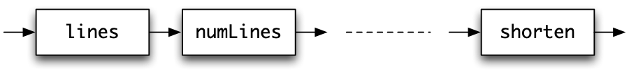

Developing higher-order programs {#moreDesign}
================================

<a id="developingHOPs"></a>
This chapter doesn't introduce any new Haskell features; instead it gives a series of examples, exercises and case studies which build on what we have covered so far. In particular it uses what we have learned about higher-order functions in the previous chapter.

As we saw there, functions in Haskell are data values just like any other, and so they can be used in modelling just as easily as using other data types. This is completely different from other kinds of programming languages, such as Java, C or C\#, where there is a rigid distinction between data and the methods operating over that data. We'll see that having functions as data gives us a powerful new tool for programming, and that is illustrated in this chapter through a series of examples and exercises.

We also include in this chapter a longer example -- building an index for a document -- which shows how program development can proceed in Haskell, using higher-order functions as a natural part of the development of larger programs. We start the chapter by revisiting the `Picture` example, and conclude with some general advice about program development, and about how to read and understand an unfamiliar function definition in Haskell.

Revisiting the `Picture` example
--------------------------------

<a id="hofPicture"></a>
Now that we have been introduced to higher-order functions, and in particular partial application, we can revisit the example of pictures and complete our definitions of the functions over the `Picture` type. The case study was introduced in Chapter [Introducing functional programming](1.md#intro) and further developed in Sections [A second example: pictures](2.md#picModuleEx) and [picturesAgain](6.md#picturesAgain).

Recall that a picture is a list of lines, each of which is made up of a list of characters

```haskell
type Picture = [[Char]]
```

We first define reflection in a horizontal mirror, which is given simply by reversing the list of lines,

```haskell
flipH
flipH :: Picture -> Picture
flipH = reverse
```

To reflect in a vertical mirror we need to reverse every line -- clearly a task for `map`:

```haskell
flipV
flipV :: Picture -> Picture
flipV = map reverse
```

To place pictures next to each other we have two functions. To put one picture above the other we join together the two lists of lines

```haskell
above
above :: Picture -> Picture -> Picture
above = (++)
```

while placing the pictures side-by-side requires corresponding lines to be joined together with `++`, using the function `zipWith` first introduced in Section [Higher-order functions: functions as arguments](10.md#hofs).

```haskell
beside
beside :: Picture -> Picture -> Picture
beside = zipWith (++)
```

Among the other functions mentioned were

```haskell
invertColour :: Picture -> Picture
superimpose  :: Picture -> Picture -> Picture
printPicture :: Picture -> IO ()
```

and we give their definitions now. To invert the colour in a picture, we need to invert the colour in every line, so

```haskell
invertColour
invertColour = map ...
```

where `...` will be the function to invert the colour in a single line. To invert every character in a line -- which is itself a list of characters -- we will again use `map`. The function mapped is `invertChar`, first defined in Section [picturesAgain](6.md#picturesAgain). This gives the definition

```haskell
invertChar
invertColour :: Picture -> Picture
invertColour = map (map invertChar)
```

which we can read as saying

> apply `map invertChar` to every line in the `Picture`; that is, apply the function `invertChar` to every character in the `Picture`, which is a list of lists of characters.

Suppose we are equipped with a function

```haskell
combineChar
combineChar :: Char -> Char -> Char
```

which superimposes two characters; how are we to use this in superimposing two pictures? Recall the function

```haskell
zipWith :: (a -> b -> c) -> [a] -> [b] -> [c]
```

where `zipWith f xs ys` produces a list by applying the function `f` to corresponding elements chosen from `xs` and `ys`, so that, for instance

```haskell
zipWith (*) [2,0] [3,1] = [6,0]
```

To superimpose the pictures, we will need to superimpose corresponding lines, so

```haskell
superimpose
superimpose = zipWith ...
```

where `...` will be required to superimpose two single lines.

In doing this, we have to superimpose corresponding characters, so this is again an application of `zipWith`. What is used to perform the combination of individual characters? The answer is `combineChar`, and so we have

```haskell
superimpose :: Picture -> Picture -> Picture
superimpose = zipWith (zipWith combineChar)
```

Our final definition is of `printPicture`, which outputs a `Picture` to the screen. We have already seen that to output a `String` we can use the function

```haskell
putStr :: String -> IO ()
```

so it will be sufficient for us to precede application of this by a function to turn the list of lines making up the `Picture` into a string, in which the lines are separated by newline characters. This we can write as a composition

```haskell
concat . map (++"\n")
```

since the effect of this is first to add a newline character to every line -- the role of `map (++"")` -- and then to join this list of strings into a single string -- the effect of the `concat`. We therefore define the printing function thus:

```haskell
printPicture
printPicture :: Picture -> IO ()
printPicture = putStr . concat . map (++"\n")
```

**Exercises**

1.  In these exercises we suggest further operations over pictures.

2.  Define a function

    ```haskell
    chessBoard :: Int -> Picture
    ```

    so that `chessBoard n` is a picture of an `n` by `n` chess board.

3.  How would you implement `invertColour`, `superimpose` and `printPicture` if `Picture` was defined to be `[[Bool]]`?

4.  Define a function

    ```haskell
    makePicture :: Int -> Int -> [(Int,Int)] -> Picture
    ```

    where the list argument gives the positions of the black points in the picture, and the two integer arguments give the width and height of the picture. For example,

    ```haskell
    makePicture 7 5 [(1,3),(3,2)]
    ```

    will have the form

    ```haskell
    .......
    ...#...
    .......
    ..#....
    .......
    ```

    It is evident from this that positions within lines and lines themselves are counted from zero, with line zero being the top line.

5.  Define a function

    ```haskell
    pictureToRep :: Picture -> ( Int , Int , [(Int,Int)] )
    ```

    which has the reverse effect of `makePicture`. For example, if `pic` is

    ```haskell
    ....
    .##.
    ....
    ```

    then `pictureToRep pic` will be `( 4 , 3, [(1,1),(1,2)] )`

6.  If we make the definition

    ```haskell
    type Rep = ( Int , Int , [(Int,Int)] )
    ```

    discuss how you would define functions over `Rep` to rotate, reflect and superimpose pictures under this alternative representation. Discuss the advantages and disadvantages of this representation in comparison with the original representation given by the `Picture` type.

7.  In the light of the discussion in the last four chapters, redo the exercises of Section [Extended exercise: positioned pictures](6.md#posPix), which deal with positioned pictures.

Functions as data: strategy combinators {#strategyCombs}
---------------------------------------

This section revisits the Rock - Paper - Scissors game, which we have already looked at in Section [Defining types for ourselves: enumerated types](4.md#EnumTypes) which introduced the `Move` type, in Section [Rock - Paper - Scissors: strategies](8.md#strategiesRPS) where we defined the `Strategy` type, and in Section [Rock - Paper - Scissors: playing the game](8.md#playingRPS) where we saw how the game could be played. Strategies are represented by functions

```haskell
Strategy
type Strategy = [Move] -> Move
```

Section [Rock - Paper - Scissors: strategies](8.md#strategiesRPS) introduced a number of strategies, including random, cycling and constant strategies. One way of building new strategies is to combine existing strategies in different ways: we do this by defining functions or **combinators** working over strategies. Because strategies are represented by functions, these new functions will be *higher-order*, having functions as arguments and results.

### Choosing between alternatives {#choosing-between-alternatives .unnumbered}

Let's begin by defining the function

```haskell
alternate
alternate :: Strategy -> Strategy -> Strategy
```

so that the strategy given by

```haskell
alternate str1 str2
```

is to combine the two strategies `str1` and `str2`, using them alternately. We can define the function using partial application like this

```haskell
alternate str1 str2 moves =
    case length moves `rem` 2 of
      1 -> str1 moves
      0 -> str2 moves
```

or using a lambda abstraction we have

```haskell
alternate str1 str2 = 
    \moves ->
        case length moves `rem` 2 of
          1 -> str1 moves
          0 -> str2 moves
```

In both definitions we check whether the length of list of `moves` is even or odd to decide between the two alternatives. Another way to define the function is this:

```haskell
alternate str1 str2 moves = 
    map ($ moves) [str1,str2] !! (length moves `rem` 2) 
```

In this definition both of the strategies -- put into a list -- are applied to the `moves` and then one of the elements of that list is chosen using `(length moves ‘rem‘ 2)` as an index into the list. In reading this definition, recall that `xs!!j` is the `j`th element of `xs`, starting counting at `0`, and that `($ moves)` is a partial application of `$`, the application operator, so that

```haskell
( moves) str1 ~>(str1  moves) ~>str1 moves
```

**Exercises**

1.  Using `randInt n`, which returns a random integer in the range `[0 .. n-1]`, or otherwise, define a function

    ```haskell
    sToss :: Strategy -> Strategy -> Strategy
    ```

    so that `sToss srt1 srt2` makes a random choice between the two strategies each time the function is applied to a list of moves.

2.  Define a function

    ```haskell
    alternativeList :: [Strategy] -> Strategy
    ```

    which cycles through all the strategies in the argument in turn. *Hint:* you may want to model you definition on one of the definitions of `alternative` above. You may also want to think about what your function does when passed the empty list of strategies!

3.  Define a function

    ```haskell
    sTossList :: [Strategy] -> Strategy
    ```

    which makes a random choice of which strategy it should apply form its argument list, each time it applied. In writing the definition, you will need to think about what `sTossList []` should be.

4.  Can you use the function `sTossList` to give another definition of the `randomStrategy` strategy first defined in Section [Rock - Paper - Scissors: strategies](8.md#strategiesRPS)?

### Other strategy combinators {#other-strategy-combinators .unnumbered}

There are more sophisticated ways of playing Rock - Paper - Scissors than playing randomly or cycling through a set of alternatives. A first approach is to make a hypothesis about what strategy our opponent is playing, and for us to play to beat that. We achieve that by applying our opponent's strategy (here called `opponent`) and choose to `beat` that:

```haskell
beatStrategy
beatStrategy :: Strategy -> Strategy

beatStrategy opponent moves =
    beat (opponent moves)
```

We will look at some other suggested strategy combinators in the following exercises.

**Exercises**

1.  Define a function

    ```haskell
    majority :: [Strategy] -> Strategy
    ```

    which works by applying all the strategies in the list at each stage, choosing the option that is chosen by the most strategies: in the case of a draw, a choice is made randomly.

2.  Define a function

    ```haskell
    train :: Moves -> [Strategy] -> Strategy
    ```

    which is supplied with a list of opponent's moves to train it, and a list of possible strategies to use. The function should run all the strategies in the list on the list of moves, and choose the strategy which is most successful in winning against the given moves.

Functions as data: recognising regular expressions {#regExps}
--------------------------------------------------

Regular expressions are *patterns* which can be used to describe sets of strings of characters of various kinds, such as these.

-   The identifiers of a programming language -- strings of alphanumeric characters which begin with an alphabetic character.

-   The numbers -- integer or real -- given in a programming language.

-   Regular expressions can also be used to extend the pattern language in a programming language, allowing functions to match in more powerful ways than those built in.

There are five sorts of pattern, or regular expression:

  ------- ------------------------------------------------------------------------
          This is the Greek character *epsilon*, which matches the empty string.
  x       x is any character. This matches the character itself.
  (\|)     and  are regular expressions.
  ()       and  are regular expressions.
  (r)\*   r is a regular expression.
  ------- ------------------------------------------------------------------------

Examples of regular expressions include (a\|(ba)), ((ba)\|(\|(a)\*)) and hello. In order to give a more readable version of these, it is assumed that binds more tightly than juxtaposition (*i.e.* ()), and that juxtaposition binds more tightly than \|. This means that will mean (()\*), *not* (())\*, and that \| will mean \|(), *not* (\|).

Regular expressions are patterns, so we need to describe which strings match each regular expression.

  ------- ------------------------------------------------------------------------------------------------------------------------------------------------------------------------------------------------------------------------
          The empty string matches epsilon.
          
  x       The character x matches the pattern x, for any character x.
          
  (\|)    The string st will match (\|) if st matches either  or  (or both).
          
  ()      The string st will match () if st can be split into two substrings  and , st = ++, so that  matches  and  matches .
          
  (r)\*   The string st will match (r)\* if st can be split into zero or more substrings, st = ++++\...++, each of which matches r. The zero case implies that the empty string will match (r)\* for *any* regular expression r.
  ------- ------------------------------------------------------------------------------------------------------------------------------------------------------------------------------------------------------------------------

Let's build a model of regular expressions in Haskell; we choose to embed them as functions from `String` to `Bool`, which is the function which recognises exactly the strings matching the pattern.

```haskell
RegExp
type RegExp = String -> Bool
```

Now we define the five different kinds of regular expression, starting off with epsilon, `ε`, which is matched by the empty string only. We use an operator section to define the function:

```haskell
epsilon
epsilon :: RegExp
epsilon = (=="")
```

We use a similar definition for the function that recognises a single character, passed in as its argument

```haskell
char
char :: Char -> RegExp
char ch = (==[ch])
```

We next define the Haskell operator `|||`, which implements the 'or' operation, `|`. Applying this to `e1` and `e2` gives a function which takes the string `x` to the 'or' of the two values `e1 x` and `e2 x`:

```haskell
"|"|"|
(|||) :: RegExp -> RegExp -> RegExp

e1 ||| e2 = 
    \x -> e1 x || e2 x
```

Sequencing the match of two regular expressions is given by the Haskell `<*>` operator. In defining this we'll use the function `splits` that returns a list of all the ways that a string can be split in two

```haskell
splits
splits "Spy" ~>[("","Spy"),("S","py"),("Sp","y"),("Spy","")]
```

Now we can give the definition of `<*>`

```haskell
(<*>) :: RegExp -> RegExp ->  RegExp

e1 <*> e2 =
    \x -> or [ e1 y && e2 z | (y,z) <- splits x ]
```

How does this definition work? The list comprehension runs through all the splits of the input string, `x`. For each of these we test whether the front half (`y`) matches the first pattern (`e1`) by *applying* `e1` to `x`, and similarly we apply `e2` to the second half of the string (`z`). Since we need both matches to succeed, we combine the results with 'and', `&&`. The result of this is to give a list of the answers for each split: we only need *one* of these to succeed, and so we combine the results with the built-in function `or` that takes the 'or' of a list of Boolean values.

We can define the star operation using the operators that we've already defined, like this:

```haskell
star
star :: RegExp -> RegExp

star p = epsilon ||| (p <*> star p)
```

The definition says 'to match (p)\*, either match it zero times (`epsilon`) or match `p` followed by `(p)*`'. What is elegant about this is that we just used the operators `|||` and `<*>`, together with recursion, to make the definition at the level of the `RegExp` type; we didn't need to think about `star p` being a function.

**Exercises**

1.  Define the function

    ```haskell
    splits :: [a] -> ([a],[a])
    ```

    which defines the list of all the ways that a list can be split in two (see the example of `splits "Spy"` above).

2.  By trying it with a number of examples, which strings does this regular expression match?

    ```haskell
    star ((a ||| b) <*> (a ||| b))
    ```

    where `a` and `b` are defined by

    ```haskell
    a, b :: RegExp
    a = char 'a'
    b = char 'b'
    ```

3.  Which strings does this regular expression match?

    ```haskell
    star (star ((a ||| b) <*> (a ||| b)))
    ```

4.  Define functions

    ```haskell
    option, plus :: RegExp -> RegExp
    ```

    where `option e` matches zero or one occurrences of the pattern `e`, and `plus e` matches one or more occurrences of the pattern `e`.

5.  Define regular expressions which match

    -   Strings of digits which begin with a non-zero digit.

    -   Fractional numbers: two strings of digits separated by '.'; make sure that these numbers have no superfluous zeroes at the beginning or the end, so exclude strings like `"01.34"` and `"1.20"`.

    In doing this you might find it useful to define a function

    ```haskell
    range :: Char -> Char -> RegExp
    ```

    so that, for example, `range ’A’ ’Z’` will match any capital letter.

6.  Give regular expressions describing the following sets of strings

    -   All strings of as and bs containing at most two as.

    -   All strings of as and bs containing exactly two as.

    -   All strings of as and bs of length at most three.

    -   All strings of as and bs which contain no repeated adjacent characters, that is no substring of the form aa or bb.

7.  \[Hard\] Add to the regular expressions the facility to name substrings that match particular sub-expressions, so that instead of returning a `Bool` a `RegExp` will return a *list* of bindings of names to substrings.

    Why a list? First, it allows for no matching to happen (empty list, `[]`) or for *multiple* matches, which can also happen as matching the regular expressions `()` and `(r)*` can succeed in multiple different ways.

Case studies: functions as data
-------------------------------

This section introduces a number of shorter case studies which use functions to represent data. First we show then we can model natural numbers as higher-order functions, next we look at graphics can be represented by functions, in a 'bit-mapped' style.

### Natural numbers as functions {#natural-numbers-as-functions .unnumbered}

We can represent the natural numbers 0, 1, 2, ...by functions of type

```haskell
Natural
type Natural a = (a -> a) -> (a -> a)
```

where the number `n` is represented by "apply the argument `n` times", so

```haskell
zero f = id
one f  = f
two f  = f.f
```

and so on. We can get a visible version of one of the numbers using the function

```haskell
int :: Natural Int -> Int
int n = n (+1) 0
```

**Exercises**

1.  Define functions

    ```haskell
    succ :: Natural a -> Natural a
      -- sends representation of n to rep. of n+1

    plus :: Natural a -> Natural a -> Natural a
      -- sends reps. of n and m to rep. of n+m

    times :: Natural a -> Natural a -> Natural a
      -- sends reps. of n and m to rep. of n*m
    ```

    and test your answers using `int`.

2.  Can you write QuickCheck properties which can be used to test these functions and this representation of natural numbers?

### Graphics as functions {#graphics-as-functions .unnumbered}

Bitmaps represent graphical images, recording information pixel by pixel, typically for a rectangular region. Dealing with real bitmap formats, such as BMP, GIF, TIFF and others, requires grappling with the details of the encoding and compression used to store images compactly. Many of these formats are supported in the packages on Hackage, and as an *extended exercise* it is possible to transform the representation we discuss here into a real graphical format. The remainder of this section develops this "lo fi" model through a series of exercises.

#### Representation {#representation .unnumbered}

We should think how to model Pictures in this way. If we use our previous representation of positions,

```haskell
type Position = (Int,Int)
```

where the first coordinate is the `x` or horizontal coordinate and the second is the `y` or vertical one. We can then think of a bitmap being defined like this:

```haskell
type Bitmap = Position -> Pixel  -- {(Bitmap.1)}
```

where `Pixel` contains the particular information held about an individual pixel. One "lo fi" model of this -- consistent with the `Picture` type -- is to define

```haskell
type Pixel = Char
```

but more complex representations of each pixel are possible. The representation `(Bitmap.1)` is an *infinite* bitmap, and to represent finite objects we need to specify the area that is represented.

-   We can do this by supplying a single `Position` which specifies the dimensions of the bitmap, so that given position `(width,height)` the relevant values of the function are those `(x,y)` where `x` is between `0` and `width-1`, and similarly for `y`. We call this the *floating* representation.

-   Alternatively, we can specify two positions which give the bottom left and top right corners of the relevant area of the mapping. This is the `positioned` representation.

**Exercises**

1.  Give new definitions of `Bitmap` which embody the floating and positioned representations outlined above.

2.  Define functions that will convert between your definitions of `Bitmap` and `Picture`.

3.  \[Harder\] Investigate the `Data.Map` module as another representation of bitmaps.

#### Operations {#operations .unnumbered}

We have already discussed pictures in Chapter [Introducing functional programming](1.md#intro) and then in Sections [A second example: pictures](2.md#picModuleEx), [picturesAgain](6.md#picturesAgain) and [hofPicture](#hofPicture), and these sections present various operations over the `Picture` type.

**Exercises**

1.  Try to re-implement the operations over pictures using the two representations of `Bitmap` you developed earlier. Is it possible to implement all the operations: if not, explain why not.

2.  \[Harder\] Re-implement the operations over the `Data.Map` representation of bitmaps.

#### Taking it further {#taking-it-further .unnumbered}

It is possible to develop a more realistic implementation of bitmaps using facilities that are available in Hackage.

**Exercises**

1.  Develop a variant of `Bitmap` that allows for pixels to be *coloured*. You can render this to a terminal using the facilities of the package `ansi-terminal`, which is available on Hackage.

2.  \[Hard\] Transform the "lo fi" representation we discussed in this section into a real graphical format such as BMP, GIF or TIFF, using the facilities provided in Hackage.

3.  \[Hard\] As an application of one of the bitmap formats supported by Haskell, create a program to yield a *pixel visualisation* of a text file, such as a computer program. In this visualisation each character in the file is rendered as a pixel, and it is particularly effective for visualising program code which has been processed with some sort of syntax highlighting.

Example: creating an index {#indexExam}
--------------------------

This section explores a different aspect of text processing from those we have looked at already. How can an index for a document be produced automatically? We use the example to illustrate how higher-order functions are used in many parts of the final program. Polymorphism allows their use at different types, and their function parameters mean that they can be used to different effect in different situations.

To make the example texts shorter, a scaled-down version of the indexing problem is investigated. This is only done for ease of presentation, as all the important aspects of the system are explored here.

### Specification {#specification .unnumbered}

We should first specify what the program is to do. The input is a text string, in which lines are separated by the newline character ''. The index should give every line on which the word in question occurs. Only words of length at least four letters are to be indexed, and an alphabetical listing of the results produced. Within each entry, a line number should not be duplicated. For example, on the input

```haskell
"cathedral doggerel cathedral\nbattery doggerel cathedral\ncathedral"
```

we would expect to get an index

```haskell
battery         2
cathedral       1, 2, 3
doggerel        1, 2
```

### Designing the program {#designing-the-program .unnumbered}

We can represent the index as a list, with each entry being an item. What will a single entry be? It has to associate a collection of line numbers with each word in the text; we can therefore represent each entry by a pair consisting of a list of numbers, of type `[Int]`, and a word, of type String. The top-level function will therefore be

```haskell
makeIndex :: Doc -> [ ([Int],Word) ]makeIndex
```

where we use the type synonyms

```haskell
type Doc  = String
type Line = String
type Word = String
```

to distinguish the different uses of the string type in the design which follows. Note that these are all the same type; we use the names to make our discussion of types carry more information: the definition of '`Line`' can be read as saying '`String` thought of as representing a line', for example.

How can the program be designed? We focus on the **data structures** which the program will produce, and we can see the program as working by making a series of modifications to the data with which we begin. This **data-directed** design is common in Haskell functional program development.

At the top level, the solution will be a **composition** of functions. These perform the following operations, in turn.

-   Split the text, a `Doc`, into lines, giving an object of type .

-   Pair each line with its line number, giving an object of type `[(Int,Line)]`.

-   Split the lines into words, associating each word with the number of the line on which it occurs. This gives a list of type `[(Int,Word)]`.

-   Sort this list according to the alphabetical ordering of words ( Strings), giving a list of the same type.

-   Modify the lists so that each word is paired with a list containing a single line number. This gives a result of type `[([Int],Word)]`.

-   Amalgamate entries for the same word into a list of numbers, giving a list of type `[([Int],Word)]`.

-   Shorten the list by removing all entries for words of less than four letters, giving a list of type `[([Int],Word)]`.

The definition follows; note that we have used comments to give the type of each component function in the forward composition:

```haskell
makeIndex
  = lines       >.>     --   Doc            -> [Line]
    numLines    >.>     --   [Line]         -> [(Int,Line)] 
    allNumWords >.>     --   [(Int,Line)]   -> [(Int,Word)]
    sortLs      >.>     --   [(Int,Word)]   -> [(Int,Word)]
    makeLists   >.>     --   [(Int,Word)]   -> [([Int],Word)]
    amalgamate  >.>     --   [([Int],Word)] -> [([Int],Word)]
    shorten             --   [([Int],Word)] -> [([Int],Word)]
```

Once the type of each of the functions is given, development of each can proceed independently. The only information necessary to use a function is its *type*, and these types are specified in the definition above. Each of the functions can now be given, in turn.

### Implementing the component functions {#implementing-the-component-functions .unnumbered}

To split a string into a list of lines it must be split at each occurrence of the newline character, `’’`. How is this written as a function? One solution is to write functions analogous to `getWord` and `dropWord`, which together were used earlier in `splitWords`. Alternatively, we can use the functions `getUntil` and `dropUntil` from Chapter [Defining functions over lists](7.md#defFunLists). A third alternative is to look in the standard prelude where we find the function `lines` already defined; we therefore use that.

```haskell
lines
lines :: Doc -> [Line]
```

The next function should pair each line with its line number. If the list of lines is `linels`, then the list of line numbers is

```haskell
[1 ..\ length linels]
```

Stepping back from the problem, it is apparent that the lists of lines and line numbers need to be combined into a **list of pairs**, by zipping the two lists together. The `zip` function has already been defined to do exactly this, so the required function is

```haskell
numLines
numLines :: [Line] -> [ ( Int , Line ) ]
numLines linels
  = zip [1 ..\ length linels] linels
```

Now the lines have to be split into words, and line numbers attached. We first consider the problem for a single line.

```haskell
numWords
numWords :: ( Int , Line ) -> [ ( Int , Word ) ]
```

Splitting into words can be done by the function `splitWords` of Chapter [Defining functions over lists](7.md#defFunLists), modified slightly. When we defined `splitWords` we preserved any punctuation characters, as these were to appear in the output of the text processor. In contrast here we will modify the definition of whitespace to include punctuation, and so remove the punctuation from the resulting words. We define

```haskell
whitespace :: String
whitespace = " \n\t;:.,\'\"!?()-"
```

Each of these words is then to be paired with the (same) line number. Stepping back from the problem, we see that we have to perform an operation on every item of a list, the list of words making up the line. This is a job for `map`,

```haskell
numWords (number , line)
  = map (\word -> (number,word)) (splitWords line)
```

or a list comprehension

```haskell
numWords (number , line)
  = [ (number , word) | word <- splitWords line ]
```

To apply this to the whole text, the function `numWords` has to be applied to every line. This is again done by `map`, and the individual results joined together or **concatenated**. We make a direct definition of the function, by composing its two parts. First we map the function `numWords`, then we concatenate the results, using `concat`.

```haskell
allNumWords
allNumWords :: [ ( Int , Line ) ] -> [ ( Int , Word ) ]
allNumWords = concat . map numWords
```

What has been achieved so far? The text has been transformed into a list of line-number/word pairs, from which an index is to be built. For instance, the text

```haskell
"cat dog\nbat dog\ncat"
```

will be converted to

```haskell
[(1,"cat") , (1,"dog") , (2,"bat") , (2,"dog") , (3,"cat")]
```

The list must next be sorted by word order, and lists of lines on which a word appears be built. The ordering relation on pairs of numbers and words is given by

```haskell
orderPair
orderPair :: ( Int , Word ) -> ( Int , Word ) -> Bool
orderPair ( n1 , w1 ) ( n2 , w2 )
  = w1 < w2 || ( w1 == w2 && n1 < n2 )
```

The words are compared for dictionary order. For pairs containing the same words, ordering is by line number.

Sorting a list is most easily done by a version of the **quicksort** algorithm. The list is split into parts smaller than and larger than a given element; each of these halves can be sorted separately, and then joined together to form the result.

<a id="sortLs"></a>
```haskell
sortLs
sortLs :: [ ( Int , Word ) ] -> [ ( Int , Word ) ]sortLs

sortLs []     = []
sortLs (p:ps) = sortLs smaller ++ [p] ++ sortLs larger
```

The lists `smaller` and `larger` are the lists of elements of `ps` which are smaller (or larger) than the pair `p`. Note that it is here that duplicate copies are removed -- any other occurrence of the pair p in the list `ps` does not appear in either `smaller` or `larger`.

How are the two lists defined? They are given by selecting those elements of `ps` with given properties: a job for `filter`, or a list comprehension. Going back to the definition of `sortLs`,

```haskell
sortLs (p:ps)
  = sortLs smaller ++ [p] ++ sortLs larger
    where
    smaller = [ q | q<-ps , orderPair q p ]
    larger  = [ q | q<-ps , orderPair p q ]
```

After sorting the running example will be

```haskell
[(2,"bat") , (1,"cat") , (3,"cat") , (1,"dog") , (2,"dog")]
```

The entries for the same word need to be accumulated together. First each entry is converted to having a *list* of line numbers associated with it, thus

```haskell
makeLists ::  [ (Int,Word) ] -> [ ([Int],Word) ]
makeLists 
  = map mklis 
    where
    mklis ( n , st ) = ( [n] , st )
```

For our example, this gives

```haskell
[ ([2],"bat") , ([1],"cat") , ([3],"cat") , 
  ([1],"dog") , ([2],"dog") ]
```

After this, the lists associated with the same words are amalgamated.

```haskell
amalgamate
amalgamate :: [ ([Int],Word) ] -> [ ([Int],Word) ]

amalgamate [] = []
amalgamate [p] = [p]
amalgamate ((l1,w1):(l2,w2):rest)
  | w1 /= w2    = (l1,w1) : amalgamate ((l2,w2):rest)  -- (amalg.1)  
  | otherwise   = amalgamate ((l1++l2,w1):rest)  -- (amalg.2)
```

The first two equations are simple, with the third doing the work.

-   If we have two adjacent entries with different words, case `(amalg.1)`, then we know that there is nothing to add to the first entry -- we therefore have to amalgamate entries in the *tail* only.

-   If two adjacent entries have the same word associated, case `(amalg.2)`, they are amalgamated and the function is called again on the result. This is because there may be other entries with the same word, also to be amalgamated into the leading entry.

Consider an example

```haskell
amalgamate [ ([2],"bat") , ([1],"cat") , ([3],"cat") ]
~> ([2],"bat") : amalgamate [([1],"cat"),([3],"cat")]  -- by (amalg.1)
~> ([2],"bat") : amalgamate [ ([1,3],"cat") ]   -- by (amalg.2)
~> ([2],"bat") : [ ([1,3],"cat") ]
~> [ ([2],"bat") , ([1,3],"cat") ]
```

To meet the requirements, one other operation needs to be performed. 'Small' words of less than four letters are to be removed.

```haskell
shorten 
  = filter sizer 
    where
    sizer (nl,wd) = length wd > 3
```

Again, the `filter` function proves useful. The index function can now be defined in full:

```haskell
makeIndex :: Doc -> [ ([Int],Word) ]
makeIndex
  = lines >.> numLines >.> allNumWords >.> sortLs >.>
    makeLists >.> amalgamate >.> shorten 
```

As was said at the beginning of this section, function composition provides a powerful method for structuring designs: programs are written as a **pipeline** of operations, passing the appropriate data structures between them.

{width="4.5in"}

It is easy to see how designs like these can be modified. To take one example, the indexing program above filters out short words only as its final operation. There are a number of earlier points in the chain at which this could have been done, and it is a worthwhile exercise to consider these.

**Exercises**

1.  Define the function `lines` using the functions `getUntil` and `dropUntil` from Chapter [Generalization: patterns of computation](10.md#patternsGen), or the built-in functions `takeWhile` and `dropWhile`. You should be careful that your functions do not give an empty word when there are empty lines in the `Doc`; this might happen for the examples `"catdog"` and `"fish"`.

2.  How would you use lambda expressions to replace the local definitions in `makeLists` and `shorten`? How would you define these functions using list comprehensions?

3.  In the index for this book, instead of printing an entry like

    ```haskell
    cathedral        3, 5, 6, 7, 9, 10
    ```

    a number of ranges could be given:

    ```haskell
    cathedral        3, 5-7, 9-10
    ```

    How would you redesign your program to do this? Hint: first think about the type of the new index representation and then consider adding another function to the (forward) composition which currently forms the definition of `makeIndex`.

4.  How would you re-define `sortLs` so that duplicate copies of an item are *not* removed? For the index, this means that if a word occurs twice on line `123` say, then `123` occurs twice in the index entry for that word.

5.  How could the functions `getUntil` and `dropUntil` be used in the definition of `amalgamate`?

6.  Explain how the function `sizer` defined locally in `shorten` can be defined as a composition of built-in functions and operator sections; the role of `sizer` is to pick the second half of a pair, find its length, and compare the result with `4`.

7.  How is the following definition of the last conditional equation for `amalgamate` incorrect? Give an example calculation to justify your answer.

    ```haskell
    amalgamate ((l1,w1):(l2,w2):rest)
      | w1 /= w2    = (l1,w1) : amalgamate ((l2,w2):rest)
      | otherwise   = (l1++l2,w1) : amalgamate rest
    ```

8.  Give a definition of

    ```haskell
    printIndex :: [ ([Int],Word) ] -> IO ()
    ```

    which gives a neatly laid-out printable version of an index, as shown at the start of the section. You might find it useful to define a function

    ```haskell
    showIndex :: [ ([Int],Word) ] -> String
    ```

    and to use this as a part of your definition of `printIndex`.

9.  Modify the program so that words of less than four letters are removed as a part of the definition of `allNumWords`.

10. Modify the `makeIndex` function so that instead of returning the list of line numbers on which a word occurs, the function returns the total number of times that the word occurs. You will need to make sure that multiple occurrences of a word in a single line are counted. There are two ways of tackling the problem.

    -   Modify the program as little as is necessary -- you could return the length of a list rather than the list itself, for instance.

    -   Take the program structure as a guide, and write a (simpler) program which calculates the number of occurrences directly.

11. Modify the program so that capitalized words like `"Dog"` are indexed under their uncapitalized equivalents (`"dog"`). This does not work well for proper names like `"Amelia"` --- what could you do about that?

12. The function `sortLs` is limited to sorting lists of type `[(Int,Word)]` because it calls the `orderPair` function. Redefine the function so that it takes the comparison function as a *parameter*. What is its type after this redefinition?

13. How would you modify the program if it was to be used to form the index for a Haskell script? Hint: you need to think about what it is sensible to ignore in such an enterprise.

Development in practice
-----------------------

This section goes back to the advice on design and programming from Chapter [Designing and writing programs](4.md#writingProgs) and illustrates how it can be used in a series of programming examples.

### Generalizing the problem {#generalizing-the-problem .unnumbered}

Suppose that we are asked to define the lists `[1 .. n]` for ourselves. A first attempt might try to use recursion, thus

```haskell
[1 ..\ n] = 1 : [2 ..\ n]  -- (..1)
```

but the problem here is that `[2 .. n]` is not an instance of what we are trying to define. The presence of the `2` here suggests that instead of solving the particular problem of lists starting at `1` we should solve the more general problem of defining lists beginning at an arbitrary value. We therefore define `[m .. n]`:

```haskell
[m .. n]
  | m>n         = []  -- (..2)
  | otherwise   = m : [m+1 .. n]
```

Another solution is given by

```haskell
[1 .. n] 
  | 1>n         = []  -- (..3)
  | otherwise   = [1 .. n-1] ++ [n]
```

but `(..3)` has the disadvantage that it is substantially less efficient than `(..2)`, a topic we pick up in Chapter [Time and space behaviour](20.md#behaviour).

Another example of generalization was given in the text processing example in Section [Example: text processing](7.md#textProc) where we defined a function `getLine`. The effect of this function is to take a list of words and to return the list of words making up the maximal first line (of length `lineLen`) which can be built from the words. It was apparent in making the definition that we needed to make the line length a parameter of the definition, so that we defined

```haskell
getLine
getLine :: Int -> [Word] -> Line
```

rather than giving it the type `[Word] -> Line`.

### Simplifying the problem {#simplifying-the-problem .unnumbered}

Suppose that we are asked to solve the problem of identifying strings which are palindromes, like

```haskell
"Madam I\'m Adam"
```

One way of approaching the problem is first to think of identifying palindromes where punctuation and capitalization are not considered, such as `"ABBA"`. We might solve this by <a id="simplePalCheck"></a>

```haskell
simplePalCheck :: String -> Bool
simplePalCheck st = (reverse st == st)
```

for instance, but note that there are at least two other different ways we might implement the function `simplePalCheck`. Once we have this function we can then *modify* it to solve the original problem. Alternatively we can *use* this solution to a simplified problem in the full solution:

```haskell
palCheck
palCheck = simplePalCheck . clean
```

where

```haskell
clean :: String -> String
```

puts all capitals into small letters and removes punctuation. We look at this in the next section.

### Design choices {#design-choices .unnumbered}

The `clean` function combines mapping (capitals to smalls) and filtering (removing punctuation) and so can be solved thus

```haskell
clean = map toSmall . filter notPunct  -- (clean.1)
```

or by means of a list comprehension

```haskell
clean st = [ toSmall ch | ch <- st , notPunct ch ]  -- (clean.2)
```

How do we choose between these options? One advantage of `(clean.1)` is that we see clearly that we have a function composition, but perhaps `(clean.2)` is more readable.

### Auxiliary functions {#auxiliary-functions .unnumbered}

Suppose we are asked to define when one string is a subsequence of another. By that we mean that the characters of the first string occur next to each other inside the second string, so that `"Chip"` is a subsequence of `"Fish & Chips"`, but not of `"Chin up"`. The function we seek to define is

```haskell
subseq
subseq :: String -> String -> Bool
```

and we try to define this by recursion. Starting with the cases of the empty string,

```haskell
subseq []    _  = True
subseq (_:_) [] = False
```

so what is the general case, `subseq (x:xs) (y:ys)`?

-   One alternative is that `(x:xs)` is a subsequence of `ys`, as in\
    `subseq "Chip" "Fish & Chips"`

-   The other alternative is that `(x:xs)` occurs at the start of `(y:ys)`, as in\
    `subseq "Chip" "Chips"`

This latter is not a recursive call to the function we are defining, so we have to say

```haskell
subseq (x:xs) (y:ys)
  = subseq (x:xs) ys || frontseq (x:xs) (y:ys)
```

and write an auxiliary function definition to check this new condition.

```haskell
frontseq
frontseq :: String -> String -> Bool
frontseq []     _  = True
frontseq (_:_)  [] = False
frontseq (x:xs) (y:ys)
  = (x==y) && frontseq xs ys
```

**Exercises**

1.  Give a recursive definition of the range

    ```haskell
    [m,n .. p]
    ```

2.  Think of two more ways of implementing the function

    ```haskell
    simplePalCheck :: String -> Bool
    ```

    discussed.

3.  Define a function

    ```haskell
    subst :: String -> String -> String ->  String
    ```

    so that the result of `subst start find replace` is the string `start` modified so that the first occurrence of `find` as a subsequence is replaced by `replace`. If there is no such subsequence, the string should be returned unmodified, so that, for instance,

    ```haskell
    subst "Fish & Chips" "Chip" "Boat" ~> "Fish & Boats"
    subst "Fish & Chips" "Ship" "Boat" ~> "Fish & Chips"
    ```

    Modify the definition so that every occurrence of `find` is replaced by `replace`. Explain what your original and modified definitions do in the case of the example

    ```haskell
    subst "Fish & Chips" "" "Boat"
    ```

Understanding programs {#understanding}
----------------------

This section offers advice to readers confronted with an unfamiliar function definition. There are various things we can do with the definition, and these are examined in turn here. Given a functional program like

```haskell
mapWhile :: (a -> b) -> (a -> Bool) -> [a] -> [b]mapWhile

mapWhile f p []    = []   -- (mapWhile.1)
mapWhile f p (x:xs)
  | p x            = f x : mapWhile f p xs   -- (mapWhile.2)
  | otherwise      = []   -- (mapWhile.3)
```

we can understand what it means in various different ways. We can read the program itself, we can write calculations of examples using the program, we can prove properties of the program, and we can estimate its space and time complexity,

### Reading the program {#reading-the-program .unnumbered}

Besides any comments which might accompany a program, the program itself is its most important documentation.

The type declaration gives information about the input and output types: for `mapWhile`, we have to supply three arguments:

-   a function, `f` say, of arbitrary type, `a -> b`;

-   a **property** of objects of type `a`; that is a function taking an `a` to a Boolean value; and,

-   a list of items of type `a`.

The output is a list of elements of type `b` -- the output type of `f`.

The function definition itself is used to give values of `mapWhile`, but also can be read directly as a description of the program.

-   On `[]`, the result is `[]`.

-   On a non-empty list, if the head `x` has property `p`, then according to `(mapWhile.2)`, we have `f x` as the first element of the result, with the remainder given by a recursive call on `xs`.

-   If the property `p` fails of `x`, the result is terminated, as it were, by returning the empty list `[]`.

In the definition we have a complete description of how the program behaves, but we can animate this by trying specific examples.

### Calculating with the program {#calculating-with-the-program .unnumbered}

A more concrete view of what the program does is given by calculating particular examples. For instance,

```haskell
mapWhile (2+) (>7) [8,12,7,13,16]
~> 2+8 : mapWhile (2+) (>7) [12,7,13,16]   -- by (mapWhile.2)
~> 10 : 2+12 : mapWhile (2+) (>7) [7,13,16]   -- by (mapWhile.2)
~> 10 : 14 : []   -- by (mapWhile.3)
~> [10,14]
```

Other examples include

```haskell
mapWhile (2+) (>2) [8,12,7,13,16] ~> [10,14,9,15,18]
mapWhile (2+) (>2) []             ~> []
```

Note that in these examples we use `mapWhile` at the instance

```haskell
(Int -> Int) -> (Int -> Bool) -> [Int] -> [Int]
```

of its polymorphic type, given by replacing the type variables `a` and `b` by the type `Int`.

### Reasoning about the program {#reasoning-about-the-program .unnumbered}

We can get a deeper understanding about a program by **proving** properties that the program might have. For `mapWhile`, we might prove that for all `f`, `p` and finite lists `xs`,

```haskell
mapWhile f p xs            = map f (takeWhile p xs)  -- (mapWhile.4)
mapWhile f (const True) xs = map f xs  -- (mapWhile.5)
mapWhile id p xs           = takeWhile p xs  -- (mapWhile.6)
```

where we can, in fact, see `(mapWhile.5)` and `(mapWhile.6)` as consequences of the characterization of `mapWhile` given by property `(mapWhile.4)`.

Rather than proving these properties, it is possible to use QuickCheck to test them with random data. Recall the discussion in the breakout box 'QuickCheck and higher-order functions', which outlines how functions of this sort can be tested on a selection of functional arguments and randomly-generated list data.

### Program behaviour {#program-behaviour .unnumbered}

It is not hard to see that the program will at worst take time linear (that is `O(n)`) in the length (`n`) of the list argument assuming `O(n)` behaviour of `f` and `p`, as it runs through the elements of the list once, if at all.

The **space** behaviour is more interesting; because we can output the head of a list once produced, the space required will be constant, as suggested by underlining the parts which can be output in the calculation above.

```haskell
mapWhile (2+) (>7) [8,12,7,13,16]
~> 2+8 : mapWhile (2+) (>7) [12,7,13,16] 
~> 10 : 2+12 : mapWhile (2+) (>7) [7,13,16] 
~> 10 : 14 : [] 
~> [10,14]
```

We return to a fuller discussion of program behaviour in Chapter [Time and space behaviour](20.md#behaviour).

### Getting started {#getting-started .unnumbered}

Each view of the program gives us a different understanding of its behaviour, but when we are presented with an unfamiliar definition we can begin to understand what its effect is by calculating various small examples. If we are given a collection of functions, we can test out the functions from the bottom up, building one calculation on top of another, using GHCi as a calculator.

The important thing is to realize that rather than being stuck, we can get started by calculating representative examples to show us the way.

Summary {#summary .unnumbered}
-------

This chapter has explored the idea that program development works in a cycle: first we clarify the specification of the problem to be solved, next we devise a plan of how to solve the problem, and only then do we implement the solution.

At each stage we should reflect on and evaluate what we have done: this aspect is crucial particularly when we are learning to program. For example, being aware of the errors that we make can help us to prevent making them in the future. Also, if we take a problem we have already solved and try to solve it with a new technique we will learn something about the new technique as well as seeing how it fits in with what we have learned already. This is something that we do by continually revisiting the `Picture` case study.
