Overloading, type classes and type checking {#typeClasses}
===========================================

<a id="types"></a>
<a id="classes"></a>
In looking at Haskell so far we have seen two kinds of function which work over more than one type. A polymorphic function such as `length` has a *single* definition which works over all its types. On the other hand, **overloaded** functions like equality, `+` and `show` can be used at a variety of types, but with different definitions at the different types.

The chapter starts with a discussion of the benefits of overloading, before looking at **type classes**, which are collections of types; what the members of a class have in common is the fact that certain functions are defined over the type. For instance, the members of the equality type class, `Eq`, are those types which carry an equality function, `==`. Type classes are thus the mechanism by which overloaded functions can be given types in Haskell.

We shall see how to define type classes and types which belong to these classes: the **instances** of the class. Haskell's prelude and libraries contain a number of classes and instances, particularly for numeric types -- we survey these, referring readers to the Haskell report ([Marlow 2010](bibliography.md#haskell2010)) for a full exposition.

We then look at how type inference and type checking work in Haskell, first looking at types without type variables -- monomorphic definitions -- and then at polymorphic, overloaded definitions, and see how they are given types, illustrated by a series of examples.

Why overloading? {#whyOver}
----------------

This section looks at the reason for including overloading in Haskell; we do this by looking at a scenario.

Suppose that Haskell did not have overloading, and that we wanted to check whether a particular element is a member of a list of type `Bool`. We would define a function like

```haskell
elemBool
elemBool :: Bool -> [Bool] -> Bool
elemBool x [] = False
elemBool x (y:ys)
  = (x ==_Bool y) || elemBool x ys
```

where we have written `==_Bool` for the equality function over `Bool`.

Suppose now that we want to check whether an integer is a member of an integer list, then we need to define a *new* function

```haskell
elemInt
elemInt :: Int -> [Int] -> Bool
```

which differs from `elemBool` only in using `==_Int` instead of `==_Bool`. Each time we want to check membership of a list of a different type we will have to define yet another -- very similar -- function. One way out of this problem is to make the equality function a parameter of a general function

```haskell
elemGen :: (a -> a -> Bool) -> a -> [a] -> Bool
```

but this gives too much generality, because it can be used with *any* parameter of type `a -> a -> Bool` rather than just an equality function. More importantly, using this definition the parameter has to be passed in explicitly each time the function `elemGen` is used, like this

```haskell
elemGen (==_Bool)
```

making programs less easy to read.[^1] The alternative is to define a function which uses the overloaded equality,

```haskell
elem :: a -> [a] -> Bool
```

where the type `a` *has to be restricted to those types `a` which have an equality*. The advantages of this approach are

-   **Reuse**1em The definition of `elem` can be used over all types with equality.

-   **Readability**1em It is much easier to read `==` than `==_Int` and so on. This argument holds particularly for numeric operators, where it is more than tiresome to have to write `+_Int`, `*_Float` and so on.

What this discussion shows is that a mechanism is needed to give a type to functions like `elem`: that is precisely the purpose of type classes.

Introducing classes
-------------------

The `elem` function appears to have the type

```haskell
elem :: a -> [a] -> Bool
```

*but* `elem` *only has this type for types* `a` *which have an equality function*. How is this to be expressed? We need some way of saying whether we have an equality function over a given type. We call the collection of types over which a function is defined a **type class** or simply a **class**. For instance, the set of types over which `==` is defined is the **equality class**, `Eq`.

### Defining the equality class, `Eq` {#defining-the-equality-class-eq .unnumbered}

How do we define a class, such as `Eq`? We say what is needed for a type `a` to be in a class. In this case we need a function `==` defined over `a`, of type `a->a->Bool`.

```haskell
class
class Eq a where
  (==) :: a -> a -> Bool
```

In general we will specify an **interface** or **signature** which has to be implemented for a type to belong to the class.

Members of a type class are called its **instances**, and a type is made into an instance by giving an implementation of the interface for that type. This is called an instance declaration. Built-in instances of `Eq` include the base types `Int`, `Float`, `Bool`, `Char`. Other instances are given by tuples and lists built from types which are themselves instances of `Eq`; examples include the types `(Int,Bool)` and `[[Char]]`.

Not all types will necessarily carry an equality; we may choose not to define one, for reasons of information hiding, or there may be no natural way of defining an equality on a particular type.

For example, function types like `Integer -> Integer` are not instances of `Eq`, since there is no way that we can write a program which will decide whether two functions over `Integer` have the same behaviour, that is have the same values at every possible input.

> **'Instances' in Haskell**
>
> It is unfortunate that the term *instance* is used in two
>
> different ways in Haskell. We talked in [Generic functions: polymorphism](6.md#poly) of a type `t_1` being an instance of a *type* `t_2`, when we can substitute for a type variable in `t_2` to give `t_1`. Here we have talked about a type being an instance of a *class*. It should be clear which one we mean from the context of a discussion, but it's helpful to bear this 'overloading' of terminology in mind.

### Functions that use equality {#functions-that-use-equality .unnumbered}

Many of the functions which we have defined so far use equality over particular types. The function

```haskell
allEqual
allEqual :: Int -> Int -> Int -> Bool
allEqual m n p = (m==n) && (n==p)
```

decides whether three integers are equal. If we examine the definition itself, it contains nothing which is specific to integers; the only constraint it makes is that `m`, `n` and `p` are compared for equality. Their type can be `a` *for any `a` in the type class* `Eq`. This gives `allEqual` a most general type thus:

```haskell
allEqual :: Eq a => a -> a -> a -> Bool
allEqual m n p = (m==n) && (n==p)
```

The part before the `=>` is called the **context**. We can read the type

as saying that

> `allEqual` has type `a -> a -> a -> Bool` for all types `a` in the class `Eq` (that is, all types `a` for which `==` is defined)

This means that `allEqual` can be used at many types, including these

```haskell
allEqual :: Char -> Char -> Char -> Bool
allEqual :: (Int,Bool) -> (Int,Bool) -> (Int,Bool) -> Bool
```

since both `Char` and `(Int,Bool)` belong to `Eq`.

What happens if we break this constraint by trying to compare three functions for equality? If we define

```haskell
suc :: Integer -> Integer
suc = (+1)
```

and try to evaluate

```haskell
allEqual suc suc suc 
```

in GHCi we get the message

```haskell
    No instance for (Eq (Integer -> Integer))
      arising from a use of `allEqual' at <interactive>:1:0-19
    Possible fix:
      add an instance declaration for (Eq (Integer -> Integer))
    In the expression: allEqual suc suc suc
    In the definition of `it': it = allEqual suc suc suc
```

which conveys the fact that `(Integer -> Integer)` is not in the `Eq` class, and suggests that the way to fix the problem is to add an instance declaration for that type.

### More equality examples {#more-equality-examples .unnumbered}

The `elem` example in [Why overloading?](#whyOver) will have the type

```haskell
elem :: Eq a => a -> [a] -> Bool
```

and so it will be usable at the types

```haskell
Bool -> [Bool] -> Bool
Int  -> [Int]  -> Bool
```

and so on. Many of the functions we have defined already use equality in an overloaded way. We can use GHCi to deduce the most general type of a function, such as the `books` function from the library database of [A library database](5.md#library), by commenting out its type declaration in the script, thus

```haskell
-- books :: Database -> Person -> [Book]books
```

and then by typing

```haskell
:type books
```

to the prompt. The result we get in that case is

```haskell
books :: Eq a => [ (a,b) ] -> a -> [b]books
```

which is perhaps a surprise at first. This is less so if we rewrite the definition with `books` renamed `lookupFirst`, because it looks up all the pairs with a particular first part, and returns their corresponding second parts. Here it is with its variables renamed as well

```haskell
lookupFirst
lookupFirst :: Eq a => [ (a,b) ] -> a -> [b]

lookupFirst ws x 
  = [ z | (y,z) <- ws , y==x ]
```

Clearly from this definition there is nothing specific about books or people and so it is polymorphic, if we can compare objects in the first halves of the pairs for equality. This condition gives rise to the context `Eq a`. Finally from [A library database](5.md#library), as we saw for `books`,

```haskell
borrowed    :: Eq b => [ (a,b) ] -> b -> Boolborrowed
numBorrowed :: Eq a => [ (a,b) ] -> a -> IntnumBorrowed
```

Summary {#summary .unnumbered}
-------

In this section we have introduced the idea of a class, which is a collection of types, its instances, with the property that certain functions described in an interface are defined over the type. One way we can think of a class is as an **adjective**: any particular type is or is not in the class, just as the

weather at any particular moment might or might not be sunny.

We saw how equality could be seen as being defined over all the types in the class `Eq`. This allows many of the functions defined so far to be given polymorphic type, allowing them to be used over any type in the class `Eq`. In the following sections we explain how classes and instances are defined in general, and explore the consequences of classes for programming in Haskell.

**Exercises**

1.  How would you define the 'not equal' operation, `/=`, from equality, `==`? What is the type of `/=`?

2.  Define the function `numEqual` which takes a list of items, `xs` say, and an item, `x` say, and returns the number of times `x` occurs in `xs`. What is the type of your function? How could you use `numEqual` to define `member`?

3.  Define functions

    ```haskell
    oneLookupFirst  :: Eq a => [ (a,b) ] -> a -> b
    oneLookupSecond :: Eq b => [ (a,b) ] -> b -> a
    ```

    `oneLookupFirst` takes a list of pairs and an item, and returns the second part of the first pair whose first part equals the item. You should explain what your function does if there is no such pair. `oneLookupSecond` returns the first pair with the roles of first and second reversed.

Signatures and instances {#sigInsts}
------------------------

In the last section we saw that the operation of equality, `==`, is overloaded. This allows `==` to be used over a variety of types, and also allows for functions using `==` to be defined over all instances of the class of types `Eq`. This section explains the mechanics of how classes are introduced, and then how instances of them may be declared. This allows us to program with classes that we define ourselves, rather than simply using the built-in classes of Haskell.

### Declaring a class {#declaring-a-class .unnumbered}

As we saw earlier, a class is introduced by a declaration like:

```haskell
class Info a whereclassInfo
  examples :: [a]
  size     :: a -> Int
```

The declaration introduces the name of the class, `Info`, and this is followed by an **interface** or signature, that is a list of identifiers and their types. To be in the `Info` class the type

`a` must carry the two bindings in the

signature:

-   the `examples` list, which is a list of objects of type `a`, which we can think of as giving a list of representative examples from the type, and,

-   the `size` function, which returns a measure of the size of the argument, as an integer.

The general form of a class definition will be:

```haskell
class Name ty where
  ... signature involving the type variable ty ...
```

Now, how are types made instances of such a class?

### Defining the instances of a class {#defining-the-instances-of-a-class .unnumbered}

A type is made a member or **instance** of a class by defining the interface functions for the type. For example,

```haskell
instance Eq Bool whereinstanceEq
  True  == True  = True
  False == False = True
  _     == _     = False
```

describes how `Bool` is an instance of the equality class. The declarations that numeric types like `Int` and `Float` are in the equality class (and indeed other built-in classes) involve the appropriate primitive equality functions supplied by the implementation.

Although we have called the class `Eq` the equality class, there is no requirement that the `==` function we define has any of the usual properties of equality apart from having the same type as equality. It is up to the user to ensure that he or she makes sensible definitions, and documents them adequately.

Going back to our `Info` example, we might say

```haskell
instance Info Char whereInfo
  examples = ['a','A','z','Z','0','9']
  size _   = 1
```

This gives a list of six typical characters and states that each character is of size one. We can also make `Bool` and `Int` instances of `Info`, like this:

```haskell
instance Info Bool where
  examples = [True,False]
  size _   = 1
  
instance Info Int where
  examples = [-100..100]
  size _   = 1  
```

In the `examples` for `Bool` we can list all the elements, for integers we choose a range of "small" numbers; as for characters, we say each object is of size one. Finally we can look at the `data` type of `Shape`s, and declare an instance for them:

```haskell
instance Info Shape where
  examples = [ Circle 3.0, Rectangle 45.9 87.6 ]
  size     = round . area
```

Here we just list a couple of typical shapes, and use the `area`, rounded to an integer, as an indication of size

#### Instances and contexts {#instances-and-contexts .unnumbered}

Suppose that the type `a` is in the `Info` classs: this means that we can estimate the size of a value in `a`, and we have a list of examples of type `a`. Using this function and list we are able to define a `size` function for `[a]` and a list of examples of type `[a]` like thisto define those functions over `[a]`, so we can declare the following instance

```haskell
instance Info a => Info [a] where ....
```

in which the **context** `Info a` appears, making clear that we are only providing information about lists of objects for which we already have information about the individual members.

> **Type error messages**
>
> We first saw the example of a type error message mentioning 'instances' in [Errors and error messages](2.md#errors) where the application `4 double` gave rise to the error message
>
> ``` {.haskell}
> \ \ \ \ No instance for (Num ((Integer -> Integer) -> t))
>
> \ \ \ \ \ \ arising from the literal `4' at <interactive>:1:0-7
>     ...
> ```
>
> instead of the simple message "attempt to apply a number to a function".
>
> The problem is that we *could* have overloaded the numbers to have this sort of behaviour, but common sense suggest that we haven't; it's difficult, though, to get error messages to reflect common sense, because it it inconsistent and context-dependent. At least, though, we can now understand what is being said in the error message, even if the appropriate course of action is quite different ... .

We can complete the definition like this <a id="visiDec"></a>

```haskell
instance Info a => Info [a] where
  examples = [ [] ] ++ 
             [ [x] | x<-examples ] ++ 
             [ [x,y] | x<-examples , y<-examples ]
  size     = foldr (+) 1 . map size  
```

Out list of examples is made up by the empty list, together with all the one and two element lists that can be built up from the `examples` of type `a`. So, in this definition we see overloading in action: on the left hand side of the `examples` is used at type `[a]`, while on the right hand side the three occurrences are all at type `a`.

To estimate the size of a list of `a` we take the size of each element (`map size`), and add one to the total of these sizes using `foldr (+) 1`. Again, on the right-hand side of this definition we use `size` over the type `a`; this shows that we need the context which says that `a` is in the `Info` class.

#### Limitations {#limitations .unnumbered}

Instances in Haskell are *global*, so that once you have declared an instance for a type, that instance is the one that you will have to use with that type: in particular it isn't possible to make instances *local* to a module or set of modules. If you still want to do this, the mechanism to use would be to define a 'wrapped' type, like

```haskell
data WInt = Wrap Int
```

and to declare the instances you want for this type of integers.

There are also some limitations to what can be declared as an instance, in other words on what can appear after the `=>` (if any) in an instance declaration. This must either be a base type like `Int`, or consist of a type constructor like `[...]`, `(...,...)` or `Shape` applied to distinct type variables.

We will *not* be able, for example, to declare `(Float,Float)` as an instance; nor can we use named types (introduced by a `type` definition). More details of the mechanism can be found in the Haskell 2010 report ([Marlow 2010](bibliography.md#haskell2010)).

> **Haskell 2010 *vs.* GHC Haskell**
>
> In fact, GHC implements a more flexible mechanism for type classes and instances, and choosing this option within GHC or GHCi using the flag `-XFlexibleInstances` allows us to move away from Haskell 2010. This can be achieved by putting this as the first line in a Haskell file, preceding the `module` declaration:
>
> ``` {.haskell}
> {-# OPTIONS_GHC -XFlexibleInstances #-}
> ```
>
> The problem with doing this is that your program becomes reliant on GHC rather than Haskell 2010, which is supported by a number of compilers, and also runs the risk of depending on a feature which might change. Sufficiently many Haskell programmers are prepared to take little risks like this that it is difficult to find a project of any size which is fully Haskell 2010 compliant.

### Default definitions {#default-definitions .unnumbered}

To return to our example of equality, the Haskell equality class is in fact defined by

```haskell
class Eq a where
  (==), (/=) :: a -> a -> Bool
  x /= y     = not (x==y)
  x == y     = not (x/=y)
```

To the equality operation is added inequality, `/=`. As well as this, there are **default** definitions of `/=` from `==` and of `==` from `/=`. These definitions have two purposes; they give a definition over all equality types, but as defaults they can **overridden** by an `instance` declaration.

At any instance a definition of at least one of `==` and `/=` needs to be supplied for there to be a proper definition of (in)equality, but a definition of either is sufficient to give both, by means of the defaults.

It is also possible to define both of the operations in an instance delaration , so that if we wanted to define a different version of `/=` over `Bool`, we could add to our instance declaration for `Bool` the line

```haskell
  x /= y     = ... our definition ...
```

In our `Info` example you will probably have noticed that for many of the base types we simply said that the `size` of all the objects was one; we can add this as a default to the definition of `Info` like this:

```haskell
Info
class Info a where
  examples :: [a]
  size     :: a -> Int
  size _   = 1
```

and then the declarations for `Int`, `Char` and `Bool` become

```haskell
instance Info Int where
  examples = [-100..100]

instance Info Char where
  examples = ['a','A','z','Z','0','9']

instance Info Bool where
  examples = [True,False]
```

> **Default or top-level?**
>
> If we want to *stop* a default being overridden, we should remove the operation from the class, and instead give its definition at the top level and not in the signature. In the case of the operation `/=` in `Eq` we would give the top-level definition
>
> ``` {.haskell}
> x /= y       = not (x == y)
> ```
>
> which has the type
>
> ``` {.haskell}
> (/=) :: Eq a => a -> a -> Bool
> ```
>
> and will be effective over all types which carry the `==` operation.
>
> There are some situations when it is better to give default definitions, which can be overridden, rather than top-level definitions, which cannot. Over the numerical types, for instance, an implementation may well supply all the operations as hardware instructions, which will be much more efficient than the default definitions.

### Derived classes {#derived-classes .unnumbered}

Functions and instances can depend upon types being in classes; this is also true of classes. The simplest example in Haskell is the class of ordered types, `Ord`. To be ordered, a type must carry the operations `>`, `>=` and so on, as well as the equality operations. We say

```haskell
class Eq a => Ord a whereOrd
  (<), (<=), (>), (>=) :: a -> a -> Bool
  max, min             :: a -> a -> a
  compare              :: a -> a -> Ordering
```

For a type `a` to be in the class `Ord`, we must supply over `a` definitions of the operations of `Eq` as well as the ones in the signature of `Ord`. Given a definition of `<` we can supply default definitions of the remaining operations of `Ord`. For instance,

```haskell
x <= y     = (x < y || x == y)
x >  y     =  y < x
```

We will explain the type `Ordering` and the function `compare` in [A tour of the built-in Haskell classes](#haskellClasses).

A simple example of a function defined over types in the class `Ord` is the insertion sort function `iSort` of [Defining functions over lists](7.md#defFunLists). Its most general type is

```haskell
iSort :: Ord a => [a] -> [a]iSort
```

Indeed, any sorting function (which sorts using the ordering given by `<=`) would be expected to have this type.

From a different point of view, we can see the class `Ord` as **inheriting** the operations of `Eq`; inheritance is one of the central

ideas of object-oriented programming.

### Multiple constraints {#multiple-constraints .unnumbered}

In the contexts we have seen so far, we have a single constraint on a type, such as `Eq a`. There is no reason why we should not have multiple constraints on types. This section introduces the notation we use, and some examples where it is needed.

Suppose we wish to sort a list and then show the results as a string. We can write

```haskell
vSort = show . iSort 
```

To sort the elements, we need the list to consist of elements from an ordered type, as we saw above. To convert the results to a `String` we need `[a]` to be in the `Show` class (which we discuss in detail in the next section). To do this it is sufficient for each element of type `a` to be printable, and so the type of `vSort` is

```haskell
vSort :: (Ord a,Show a) => [a] -> String
```

showing that `a` must be in both the classes `Ord` and `Show`. Such types include `Bool`, `[Char]` and so on.

In a similar way, suppose we are to use `lookupFirst`, and then make the results visible. We write

```haskell
vLookupFirst xs x = show (lookupFirst xs x)
```

We have twin constraints again on our list type `[(a,b)]`. We need to be able to compare the first halves of the pairs, so `Eq a` is required. We also want to turn the second halves into strings, so needing `Show b`. This gives the type

```haskell
vLookupFirst :: (Eq a,Show b) => [(a,b)] -> a -> String
```

Multiple constraints can occur in an instance declaration, such as

```haskell
instance (Eq a,Eq b) => Eq (a,b) where
  (x,y) == (z,w)  =  x==z && y==w
```

which shows that a pair of types in `Eq` again belongs to `Eq`. Multiple constraints can also occur in the definition of a class,

```haskell
class (Ord a,Show a) => OrdShow a
```

In such a declaration, the class inherits the operations of both `Ord` and `Show`.

In this particular case, the class declaration contains an empty signature. To be in `OrdShow`, the type `a` must simply be in the classes `Ord` and `Show`. We could then modify the type of `vSort` to say

```haskell
vSort :: OrdShow a => [a] -> String
```

The situation when a class is built on top of two or more classes is called **multiple inheritance**; this has consequences for programming

style, explored in [Algebraic types and type classes](14.md#oop).

### `infoCheck`: a QuickCheck clone {#infoCheck .unnumbered}

We can define a stripped-down version of QuickCheck for ourselves, using the `examples` that the `Info` type class provides. Suppose we have these examples for type `a`: how do we check that a `property` of type `a -> Bool`? We want to check that the `property` holds for all the examples, so we apply it to all of them, using `map` and then take their conjunction, using `and`:

```haskell
infoCheck :: (Info a) => (a -> Bool) -> Bool

infoCheck property = and (map property examples)  -- (infoCheck.1)  
```

We could do a similar thing for a two argument property, defining

```haskell
infoCheck2 :: (Info a, Info b) => (b -> a -> Bool) -> Bool

infoCheck2 property = 
    and (map (infoCheck.property) examples)   -- (infoCheck.2)  
```

Note that `infoCheck2` uses `infoCheck` in its definition. Similarly we can define `infoCheck3` and so on. We could stop here, but we can do better, using overloading to define a single `infoCheck` function, just as there is a single `quickCheck` function.

To do this we define another type class, and say that a type is `Checkable` if it's something that can be checked by applying it to the `examples` given in an `Info` type:

```haskell
class Checkable b where
 infoCheck :: (Info a) => (a -> b) -> Bool
```

What instances can we define? Well, the definition of `(infoCheck.1)` is the same as an instance declaration for `Bool`:

```haskell
instance Checkable Bool where
  infoCheck property = and (map property examples)  
```

The definition `(infoCheck.2)` gives us a way of making checkable functions with an additional argument,

```haskell
instance (Info a, Checkable b) => Checkable (a -> b) where
  infoCheck property = and (map (infoCheck.property) examples) 
```

Taking these together, we have `infoCheck` defined over all these types:

```haskell
Bool -> Bool
Shape -> Bool
Int -> Shape -> Bool
Bool -> Int -> Shape -> Bool
```

In short, we can apply `infoCheck` to any type where the argument types are in the `Info` class, and where the result is a `Bool`, just as in the original definition of the `quickCheck` function.

Summary {#summary-1 .unnumbered}
-------

This section has explained the basic details of the class mechanism in Haskell. We have seen that a class definition specifies a signature, and that in defining an instance of a class we must provide definitions of each of the operations of the signature. These definitions override any default definitions which are given in the class declaration. Contexts were seen to contain one or more constraints on the type variables which appear in polymorphic types, instance declarations and class declarations.

**Exercises**

1.  How would you make `Move`, playing cards (as defined in [Extended exercise: cards and card games](6.md#cardGames)), and triple types, `(a,b,c)`, into `Info` types?

2.  \[Harder\] Moving beyond Haskell 2010 to use the `-XFlexibleInstances` for GHCi, declare instances of `Info` for `Int -> Bool` and `Int -> Int`.

3.  Give an instance of `Info` for the `Float` type, and using this re-define the instance of `Info` for the `Shape` type.

4.  What is the type of the function

    ```haskell
    compare x y    = size x <= size y ?
    ```

5.  Complete the default definitions for the class `Ord`.

6.  Complete the following instance declarations:

    ```haskell
    instance (Ord a, Ord b) => Ord (a,b) where ...
    instance Ord b => Ord [b] where ...
    ```

    where pairs and lists should be ordered **lexicographically**, like the words in a dictionary.

A tour of the built-in Haskell classes {#haskellClasses}
--------------------------------------

Haskell contains a number of built-in classes, which we briefly introduce in this section. Many of the classes are numeric, and are built to deal with overloading of the numerical operations over integers, floating-point reals, complex numbers and rationals (that is integer fractions like `22/7`). Rather than give complete details of the numeric types, we give an exposition of their major features. Full details of the classes are given in the Haskell 2010 report ([Marlow 2010](bibliography.md#haskell2010)), and their dependencies are illustrated in Figure [The Haskell 2010 classes](#ClassesDiagram), taken from the Haskell 2010 report.

### Equality: `Eq` {#equality-eq .unnumbered}

Equality was described above; to recap, we define it by

```haskell
class Eq a whereEq
  (==), (/=) :: a -> a -> Bool  
  x /= y   =  not (x==y)
  x == y   =  not (x/=y)
```

### Ordering: `Ord` {#ordering-ord .unnumbered}

Similarly, we build the ordered class on `Eq`:

```haskell
class (Eq a) => Ord a whereOrd
  compare              :: a -> a -> Ordering
  (<), (<=), (>=), (>) :: a -> a -> Bool
  max, min             :: a -> a -> a
```

The `data` type `Ordering` contains three values `LT`, `EQ` and `GT`, which represent the three possible outcomes from comparing two elements in the ordering, and is defined thus:

```haskell
data Ordering = LT | EQ | GT
```

The advantage of using `compare` is that a single function application decides the exact relationship between two inputs, whereas when using the ordering operators -- which return Boolean results -- two comparisons might well be necessary. Indeed, we see this in the default definition of `compare` from `==` and `<=`, where two tests are needed to reach the results `LT` and `GT`.

```haskell
  compare x y
    | x == y      = EQ
    | x <= y      = LT
    | otherwise   = GT
```

The defaults also contain definitions of the ordering operators from `compare`:

```haskell
  x <= y          = compare x y /= GT
  x <  y          = compare x y == LT
  x >= y          = compare x y /= LT
  x >  y          = compare x y == GT
```

There are default definitions for all the operations of `Ord`, but we need to supply an implementation of either `compare` or `<=` in order to give an instance of `Ord`.

<label class="checkbox-label"><input class="checkbox-img" type="checkbox">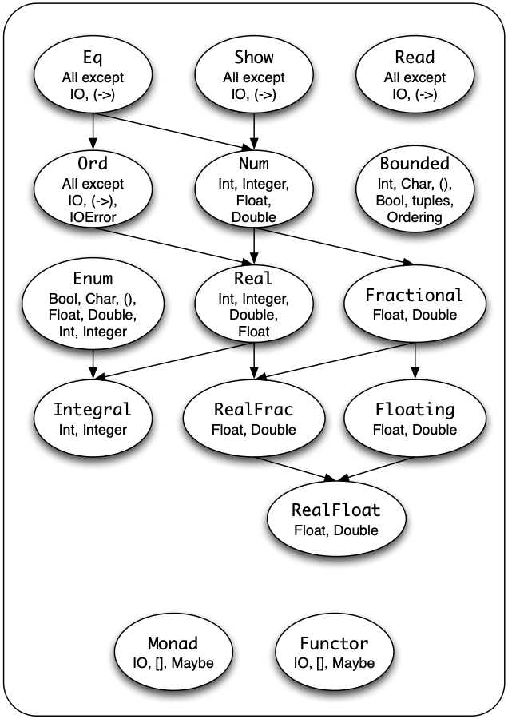<span class="img-wrapper"></span></label>

<a id="ClassesDiagram"></a>
Finally we have default definitions for the maximum and minimum operations,

```haskell
maxmin
  max x y 
    | x <= y      = y
    | otherwise   = x
  min x y 
    | x <= y      = x
    | otherwise   = y
```

Most Haskell types belong to these equality and ordering classes: among the exceptions are function types, and some of the abstract data types we meet below in [Abstract data types](16.md#adt).

### Enumeration: `Enum` {#enumeration-enum .unnumbered}

It is useful to generate lists like `[2,4,6,8]` using the enumeration expression

```haskell
[2,4 ..\ 8]
```

but enumerations can be built over other types as well: characters, floating-point numbers, and so on. The class definition is

```haskell
class (Ord a) => Enum a whereEnumtoEnumfromEnum
  succ, pred       :: a -> a
  toEnum           :: Int -> a
  fromEnum         :: a -> Int
  enumFrom         :: a -> [a]              -- [n ..\ ]
  enumFromThen     :: a -> a -> [a]         -- [n,m ..\ ]
  enumFromTo       :: a -> a -> [a]         -- [n ..\ m]
  enumFromThenTo   :: a -> a -> a -> [a]    -- [n,n' ..\ m]
```

where `enumFromTo` and `enumFromThenTo` have default definitions, which we leave as exercises for the reader.

The signature of the class also contains operations `fromEnum` and `toEnum` which convert between the type and `Int`. Finally, the class contains `succ` and `pred` which step through the enumeration upwards and downwards: when `succ` is called at the greatest element, an error is returned.

Confusingly, the Haskell report states that 'these functions \[`toEnum` and `fromEnum`\] are not meaningful for all instances of `Enum`', and using these operations over floating-point values or full precision integers will result in a run-time error.

Full instances of the class include `Int`, `Char`, `Bool` and other finite types like `Ordering`.

### Bounded types: `Bounded` {#bounded-types-bounded .unnumbered}

The `Bounded` class is specified by the declaration

```haskell
class Bounded a where
  minBound, maxBound :: a
```

and the two values give the minimum and maximum values in these types. The types `Int`, `Char`, `Bool`, `Ordering` belong to this class. Types that are in both `Bounded` and `Enum` obey some extra constraints that are explained in detail in the Haskell 2010 report ([Marlow 2010](bibliography.md#haskell2010)).

### Turning values to strings: `Show` {#turning-values-to-strings-show .unnumbered}

The standard prelude defines the class `Show`, which contains types whose values can be written (or 'shown') as strings.

```haskell
type ShowS = String -> String

class Show a where
  showsPrec :: Int -> a -> ShowS
  show      :: a -> String
  showList  :: [a] -> ShowS
```

The function `showsPrec` supports flexible and efficient conversion of large data values, but in an introductory context, the function

```haskell
show :: a -> String
```

which converts a value into a string is all that is needed. The class contains default definitions of `showsPrec` from `show` and vice versa. Further details about how to exploit the subtleties of `showsPrec` can be found in .

Most types belong to the class `Show`, but absent are function types and `IO`. For other types, example instance declarations might be

```haskell
instance Show Bool where
   show True  = "True"
   show False = "False"

instance (Show a, Show b) => Show (a,b) where
   show (x,y) = "(" ++ show x ++ "," ++ show y ++ ")"
```

In fact we discuss how some function types might be shown in [DSLs for computation: generating data in QuickCheck](19.md#qcGens).

### Turning strings to values: `Read` {#turning-strings-to-values-read .unnumbered}

The class `Read` contains types whose values can be read from strings. To use the class it is enough to know about the function

```haskell
read :: (Read a) => String -> aReadread
```

The result of a `read` may not be properly defined: there needs to be exactly one object of the required type in the input string (which may optionally also contain whitespace or nested comments); in any other case the `read` will fail with an error. More details of how strings are **parsed** in this way can be found in [Case study: parsing expressions](17.md#parsing).

It is also important to see that in many cases the type of the result of the `read` has to be specified, since it could potentially be of any type in the class `Read`. For instance, we can write

```haskell
(read " 1 ") :: Int
```

which indicates that in this case we require the result of the `read` to be an `Int`. Without this type declaration we get this error on evaluating `(read " 1 ")`:

```haskell
Ambiguous type variable `a' in the constraint:
  `Read a' arising from a use of `read' at <interactive>:1:0-8
Probable fix: add a type signature that fixes these type variable(s)
```

The class `Read` complements `Show`, since strings produced by `show` are usually readable by `read`. Many types can be read, but exclusions include function types.

### The Haskell numeric types and classes {#the-haskell-numeric-types-and-classes .unnumbered}

One of the purposes of the Haskell design was to build a functional programming language which had a strong type system -- in which any type errors in definitions and expressions are found before evaluation -- yet which contains a rich set of numeric types, as befits a language suitable to substantial 'real world' tasks. Among Haskell's numeric types are

-   The fixed precision integers, `Int`, and the full precision integers, `Integer`, which represent *all* integers faithfully.

-   The floating-point numbers, `Float`, and the double-precision floating-point numbers, `Double`.

-   Rational numbers, that is fractions, represented as ratios of integers; built-in is the type `Rational` of `Integer` fractions.

-   Complex numbers, which can be built over other types such as `Float`.

The design also required that the usual operations like `+` and `/` and literals such as `23` and `57.4` would be overloaded. For instance, `Int` and `Integer` will carry identical operations[^2] and have identical literals, as indeed will `Float` and `Double`; a guide to the operations over integers and floats was given in [The integers: Integer and Int](3.md#ints) and [Floating-point numbers: Float](3.md#float). This overloading can lead to situations where the type of an expression is undetermined; in such a case we can give an explicit type to an expression, thus:

```haskell
(2+3)::Int
```

The Haskell report ([Marlow 2010](bibliography.md#haskell2010)), Section 4.3.4, discusses a mechanism by which a *default* type can be given to numeric expressions.<a id="ambiguity"></a> These default directives mean that whole numbers are taken to be `Integer` and others to be `Double` in the absence of any other type information. This can be seen in action in this snapshot of GHCi:

```haskell
Prelude> let myadd = (+)
Prelude> :type myadd
myadd :: Integer -> Integer -> Integer
```

Overloading of numeric functions is achieved by defining a collection of classes. Full details of these can be found in the Haskell report ([Marlow 2010](bibliography.md#haskell2010)), and in the standard prelude, `Prelude.hs`; a brief introduction follows here.

The base class to which all numeric types belong is `Num`, which has the signature

```haskell
+*EqShow
class (Eq a, Show a) => Num a where
  (+), (-), (*)  :: a -> a -> a
  negate         :: a -> anegate
  abs, signum    :: a -> aabssignum
  fromInteger    :: Integer -> afromInteger

  x - y           = x + negate y
```

This signature has the effect that all numeric types carry equality and `show` functions, together with addition, subtraction, multiplication and related operations. It is also possible to convert an `Int` or and `Integer` into a value of any numeric type.

Integer literals are of any numeric type, so that, for example

```haskell
2 :: Num a => a
```

The integer types belong to the class `Integral` among whose signature functions are

```haskell
quotremdivmod
quot, rem :: a -> a -> a
div, mod  :: a -> a -> a
```

which give two variants of integer division, `‘quot‘` truncating towards zero, and `‘div‘` truncating below.

Numbers with fractional parts have a substantially richer class structure. Literals of this kind belong to every type in the `Fractional` class,

```haskell
Fractional
2.3 :: Fractional a => a 
```

which extends `Num` with fractional division and reciprocal,

```haskell
/recip
class (Num a) => Fractional a where
  (/)          :: a -> a -> a
  recip        :: a -> a
  fromRational :: Rational -> a

  recip x       = 1 / x
```

The floating-point numbers in `Float` and `Double` belong to the class `Floating`, which carries the 'mathematical' functions. A part of its signature follows,

```haskell
Floating
class (Fractional a) => Floating a where
  pi                  :: api
  exp, log, sqrt      :: a -> aexplogsqrt
  (**), logBase       :: a -> a -> a**logBase
  sin, cos, tan       :: a -> asincostan
   ....
```

and the full signature is to be found in `Prelude.hs`. Further details of this and the complex and rational types can be found in the prelude, libraries and the Haskell documentation.

### Derived instances {#derived-instances .unnumbered}

When a new `data` type is introduced, it comes with facilities for pattern matching but no other pre-defined functions. On the other hand, it's possible to come up with standard definitions of equality, ordering, `show` and `read` functions for these types, and this **deriving** mechanism is the bit of 'Haskell magic' which we mentioned in [Defining types for ourselves: enumerated types](4.md#EnumTypes) and [Introducing algebraic types](5.md#introAlg) when we introduced `data` type definitions. If we make a definition like

```haskell
People
data People = Person Name Age
              deriving (Eq,Show)
```

then definitions of `==` and `show` which "do the obvious thing" are synthesised for this type. This could be done for all the standard classes, but we could also choose to define instances of other standard classes for ourselves, so that we might read name, age pairs from a comma separated variable (CSV) file, rather than using the standard definition of `read`, which would expect input of the form

```haskell
Person "name" age
```

> **`Functor` and `Monad`**
>
> We talk about the `Functor` and `Monad` classes in [Programming with monads](18.md#actions).

**Exercises**

1.  Investigate the Haskell definition of '`<`' on the types `Bool` and `(t_1,t_2,…,t_k)`.

2.  Define a function

    ```haskell
    showBoolFun :: (Bool -> Bool) -> String
    ```

    which displays a Boolean function as a table. Generalize this to

    ```haskell
    showBoolFunGen :: (a -> String) -> (Bool -> a) -> String
    ```

    whose first argument is a function to show elements of `a`. This argument is used in giving a table of the results of the function. How would you extend your answer to deal with multiple-argument Boolean functions?

3.  Using your answer to the previous question, or otherwise, describe how you would make `Bool -> Bool` an instance of the class `Show`. (Note, however, that this will *not* be legitimate Haskell 2010, since `Bool -> Bool` is not of the right form for an instance declaration; you *can* achieve this using the GHC option `-XFlexibleInstances`.)

4.  How can you write a general instance for `Show` for function types: you could do this by showing a "sample" of the values from the function, that is showing how a sample of inputs are sent to the corresponding outputs.

5.  Some types are not enumerated in the sense that they can be listed from smallest to largest: a good example is the `Move` type from the Rock - Paper - Scissors game. Define a type class to which the `Move` type can belong, and give an instance for `Move`. What other types can you think of giving an instance for: give some examples and their instances, too.

6.  Define a `data` type `Roman` like this

    ```haskell
    data Roman = Roman Integer
    ```

    and define instances of `Show` and `Num` for this type. The `show` function should display numbers in the form of Roman numerals, so that

    ```haskell
    show (Roman 99) = "IC"
    show (Roman 1327) = "MCCCXXVII"
    ```

    and so forth. The instance of `Num` should obey

    ```haskell
    (Roman n) + (Roman m) ~> Roman (n+m)
    ```

7.  \[Harder\] For the `data` type `Roman` define an instances of the `Read` class, which is the inverse of the `show` function in the previous question.

> **Type classes and object-oriented programming**
>
> ::: {#advClasses}
> :::
>
> This note discusses the relationship between Haskell type classes and the classes of object-oriented programming; it can be omitted on first reading.
>
> The type system of Haskell can be seen as giving monomorphic types to functions. Polymorphic types like
>
> ``` {.haskell}
> show :: Show a => a -> String
> ```
>
> which involve type classes can be seen as shorthand for collections of typings, such as
>
> ``` {.haskell}
> show :: Bool -> String
> show :: Char -> String
> ```
>
> for each type `Bool`, `Char`, ... belonging to the class.
>
> In Haskell a class is a collection of types. Other languages such as `C++` make a type and a class the same thing. Under that approach, introducing the class of visible objects would effectively give us a type[^3] `ShowType`. This class would be characterized by having the function
>
> ``` {.haskell}
> ShowType
> show :: ShowType -> String
> ```
>
> in its interface. The class `ShowType` would have `Bool` and `Char` among its sub-classes (or sub-types). This would allow us to write values like
>
> ``` {.haskell}
> [True,'N',False] :: [ShowType]
> ```
>
> Moreover, to convert such a list to a `String` we could write
>
> ``` {.haskell}
> concat . map show :: [ShowType] -> String
> ```
>
> At different items of the list we use *different* versions of the `show` function; on the first we use the `Bool` function, on the second the `Char` function and so forth. This so-called **dynamic binding** is a powerful feature of many object-oriented languages, including `C++`, but it is not a feature of Haskell 98; an extension which would allow dynamic binding is described in .
>
> Returning to our example, what is the type of `concat . map show` in Haskell? It is not hard to see that it is
>
> ``` {.haskell}
> Show a => [a] -> [Char]
> ```
>
> so that it can be applied to elements of `[Bool]`, `[Char]` and so on, but not to heterogeneous lists like `[True,’N’,False]` which are not legitimately typed in Haskell.
>
> Java allows users to define interfaces, which consist of a signature. A part of a class definition can say which interfaces the class implements. This is very like the way in which Haskell types are made instances of type classes, except that in Haskell it is not necessary to make the instance declaration a part of the type definition itself. This has the effect of allowing *post hoc* extensions to the operations supported by a type, in a way which is not possible for a class in Java.

Type checking and type inference: an overview
---------------------------------------------

Now that we have covered classes, we can see that every value in Haskell has a defined type, which might be monomorphic, polymorphic, or involve one or more type class constraints in a context. For example,

```haskell
'w'   :: Char
flip  :: (a -> b -> c) -> (b -> a -> c)
elem  :: Eq a => a -> [a] -> Bool
```

Strong typing means that we can **check** whether or not expressions we wish to evaluate or definitions we wish to use obey the typing rules of the language without any evaluation taking place. The benefit of this is obvious: we can catch a whole lot of errors before we run a program.

### Type declarations or type inference? {#type-declarations-or-type-inference .unnumbered}

Haskell types can be *inferred* from expressions and definitions, and so it is possible never to write a type declaration. For example, we can write a definition like this

```haskell
prodFun
prodFun f g = \x -> (f x, g x)
```

either in a module or directly in GHCi, and then ask for its type in CHGi like this:

```haskell
*TypeError> :type prodFun
prodFun :: (t -> t1) -> (t -> t2) -> t -> (t1,t2)
```

Because of this facility, some Haskellers never write a type declaration, but others, including the author, always do: why?

-   The type of an object is the *most important single piece of documentation* for the object, since it tells us how it can be used -- what arguments need to be passed to it, and what type the result has -- without us having to understand precisely how it is implemented.

-   We can use a type declaration to *give a more specific type to a definition*. This was the mechanism underlying the first part of the book, which turned polymorphic functions into monomorphic versions. To be clear, if we define `prodFun` like this

    ```haskell
    prodFun :: (Int -> Bool) -> (Int -> Char) -> Int -> (Bool,Char)
    prodFun f g = \x -> (f x, g x)
    ```

    then it will have this more specific type. It is not difficult to recover the most general type for the definition: just comment out the type declaration.

-   In writing a type declaration we are saying *what type we think a function has*. We may have not got this right, and the function is properly typed, but has a different type. For instance, typing

    ```haskell
    fun :: Int -> Bool -> Int

    fun True 0 = 0
    fun True n = n-1
    fun _ n    = n
    ```

    gives rise to this error in GHCi:

    ```haskell
        Couldn't match expected type `Int' against inferred type `Bool'
        In the pattern: True
        In the definition of `fun': fun True 0 = 0
    ```

    In a case like this it is useful to *know* that we were wrong, and then we can either correct the type declaration, or modify the function so that it has the type we wanted. Here the problem is fixed by swapping the types of the two arguments.

There is one case where we *do* need to use type declarations or annotations: this is in resolving ambiguity due to overloading (we talked briefly about this earlier, in [ambiguity](#ambiguity)).

### Types and libraries {#types-and-libraries .unnumbered}

Types are also useful in locating functions in a library. Suppose we want to define a function to remove the duplicate elements from a list, transforming `[2,3,2,1,3,4]` to `[2,3,1,4]`, for instance. Such a function will have type

```haskell
(Eq a) => [a] -> [a]
```

A Hoogle search of the standard prelude and libraries reveals just one function of this type, namely `nub`, which does exactly what we want. Plainly in practice there might be multiple matches (or missed matches because of the choice of parameter order) but nonetheless the types provide a valuable way into the Haskell library.

### Overview {#overview .unnumbered}

In the remainder this chapter we give an informal overview of the way in which types are checked. We start by looking at how type checking works in a monomorphic framework, in which every properly typed expression has a single type. Building on this, we then look at the polymorphic case, and see that it can be understood by looking at the **constraints** put on the type of an expression by the way that the expression is constructed. Crucial to this is the notion of **unification**, through which constraints are combined. We conclude the chapter by looking at the **contexts** which contain information about the class membership of type variables, and which thus manage **overloading**.

Monomorphic type checking {#monoCheck}
-------------------------

In this section we look at how type checking works in a monomorphic setting, without polymorphism or overloading. The main focus here is type-checking function applications. The simplified picture we see here prepares us for Haskell type checking in general, which is examined in the section after this.

We look first at the way that we type-check expressions, and then look at how definitions are type-checked.

### Expressions {#expressions .unnumbered}

In general, an expression is either a literal, a variable or a constant or it is built up by applying a function to some arguments, which are themselves expressions.

The case of function applications includes rather more than we might at first expect. For example, we can see list expressions like `[True,False]` as the result of applying the constructor function, '`:`', thus: `True:[False]`. Also, operators and the `if` ...`then` ...`else`

construct act in exactly the same way as functions, albeit with a different syntax.

The rule for type checking a function application is set out in the following diagram, where we see that a function of type `s -> t` must be applied to an argument of type `s`. A properly typed application results in an expression of type `t`.

<label class="checkbox-label"><input class="checkbox-img" type="checkbox">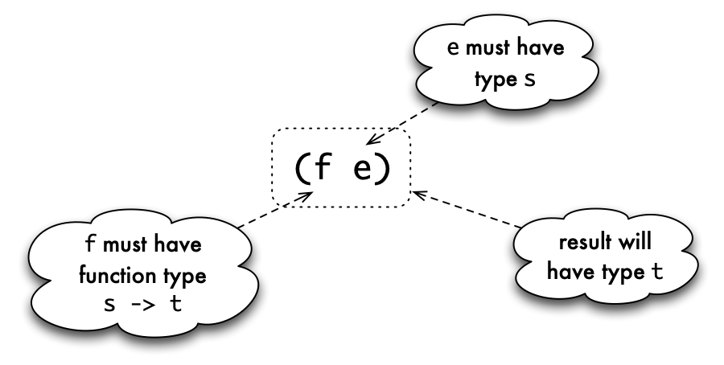<span class="img-wrapper"></span></label>

We now look at two examples. First we take `(not False) && True`, a correctly typed expression of type `Bool`,

<label class="checkbox-label"><input class="checkbox-img" type="checkbox">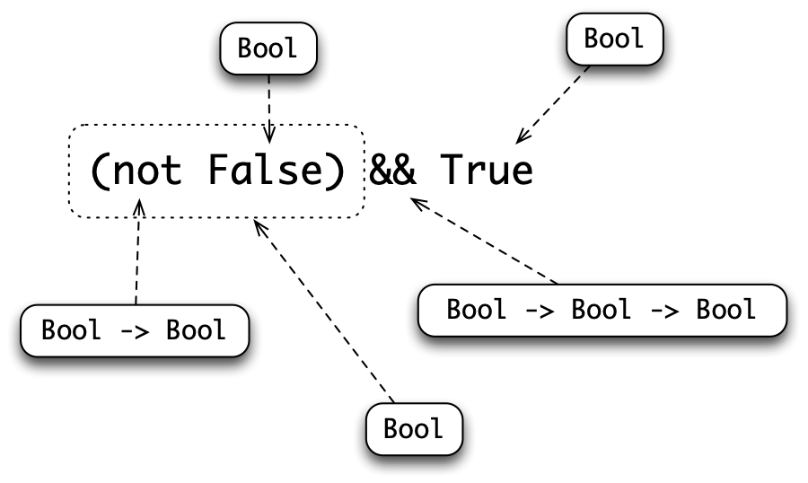<span class="img-wrapper"></span></label>

The application of `not` to `False` results in an expression of type `Bool`. The second argument to `&&` is also a `Bool`, so the application of `&&` is correctly typed, and gives a result of type `Bool`.

If we modify the example to `(not ’c’) && True`, we now see a type error, since a character argument, `’c’`, is presented to an operator expecting a `Bool` argument, `not`.

<label class="checkbox-label"><input class="checkbox-img" type="checkbox">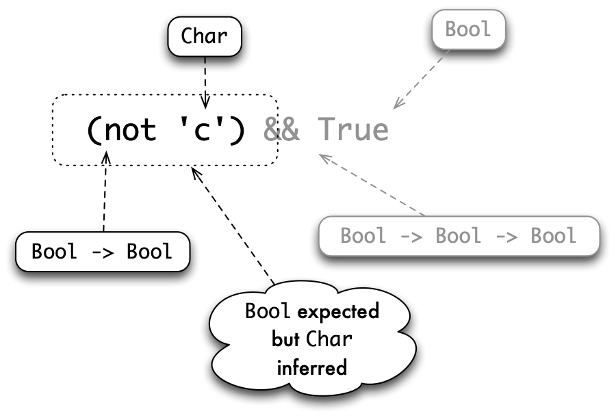<span class="img-wrapper"></span></label>

The GHCi error message for this indicates the cause of the problem:

```haskell
    Couldn't match expected type `Bool' against inferred type `Char'
    In the first argument of `not', namely 'c'
    In the first argument of `(&&)', namely `(not 'c')'
    In the expression: (not 'c') && True
```

### Function definitions {#function-definitions .unnumbered}

In type-checking a monomorphic function definition such as

```haskell
f :: t_1 -> t_2 -> ...  -> t_k -> t  -- (fdef)

f p_1 p_2 ... p_k
  | g_1     = e_1
  | g_2     = e_2
  ...
  | g_l     = e_l
```

<a id="fdef"></a>
we need to check three things.

-   Each of the guards g\_i must be of type `Bool`.

-   The value e\_i returned in each clause must be of type `t`.

-   The pattern p\_j must be consistent with type of that argument, namely t\_j.

A pattern is **consistent** with a type if it will match (some) elements of the type. We now look at the various cases. A variable is consistent with any type; a literal is consistent with its type. A pattern `(p:q)` is consistent with the type `[t]` if `p` is consistent with `t` and `q` is consistent with `[t]`. For example, `(0:xs)` is consistent with the type `[Int]`, and `(x:xs)` is consistent with any type of lists. The other cases of the definition are similar.

This concludes our discussion of type checking in the monomorphic case; we turn to polymorphism next.

**Exercises**

1.  Predict the type errors you would obtain by defining the following functions

    ```haskell
    f n     = 37+n
    f True  = 34

    g 0 = 37
    g n = True

    h x 
      | x>0         = True
      | otherwise   = 37

    k x = 34
    k 0 = 35
    ```

    Check your answers by typing each definition into a Haskell script, and loading the script into GHCi. Remember that you can use `:type` to give the type of an expression.

Polymorphic type checking {#polyTypeCheck}
-------------------------

In a monomorphic situation, an expression is either well typed, and has a single type, or is not well typed and has none. In a polymorphic language like Haskell, the situation is more complicated, since a polymorphic object is precisely one which has many types.

In this section we first re-examine what is meant by polymorphism, before explaining type checking by means of **constraint satisfaction**. Central to this is the notion of **unification**, by which we find the types simultaneously satisfying two type constraints.

### Polymorphism {#polymorphism .unnumbered}

We are familiar with functions like

```haskell
length :: [a] -> Int  -- (length)
```

whose types are polymorphic, but how should we understand the type variable `a` in this type? We can see `(length)` as shorthand for saying that `length` has a **set** of types,

```haskell
[Int] -> Int
[(Bool,Char)] -> Int
 ...
```

in fact containing all the types `[t] -> Int` where `t` is a **monotype**, that is a type not containing type variables.

When we apply `length` we need to determine at which of these types `length` is being used. For example, when we write

```haskell
length ['c','d']
```

we can see that `length` is being applied to a list of `Char`, and so we are using `length` at type `[Char] -> Int`.

### Constraints {#constraints .unnumbered}

How can we explain what is going on here in general? We can see different parts of an expression as putting different **constraints** on its type. Under this interpretation, type checking becomes a matter of working out whether we can find types which meet the constraints. We have seen some informal examples of this when we discussed the types of `map` and `filter` in [Higher-order functions: functions as arguments](10.md#hofs). We consider some further examples now.

#### Example 1 {#example-1 .unnumbered}

Consider the definition

```haskell
f (x,y) = (x , ['a' .. y])
```

The argument of `f` is a pair, and we consider separately what constraints there are on the types of `x` and `y`. `x` is completely unconstrained, as it is returned as the first half of a pair. On the other hand, `y` is used within the expression `[’a’ .. y]`, which denotes a range within an enumerated type, starting at the character `’a’`. This forces `y` to have the type `Char`, and gives the type for `f`:

```haskell
f :: (a,Char) -> (a,[Char])
```

#### Example 2 {#example-2 .unnumbered}

Now we examine the definition

```haskell
g (m,zs) = m + length zs
```

What constraints are placed on the types of `m` and `zs` in this definition? We can see that `m` is added to something, so `m` must have a numeric type -- which one it is remains to be seen. The other argument of the addition is `length zs`, which tells us two things.

<label class="checkbox-label"><input class="checkbox-img" type="checkbox">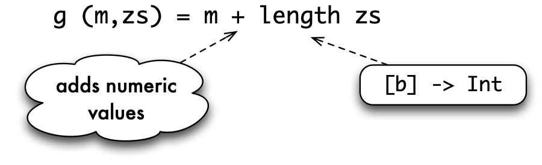<span class="img-wrapper"></span></label>

First, we see that `zs` will have to be of type `[b]`, and also that the result is an `Int`. This forces `+` to be used at `Int`, and so forces `m` to have type `Int`, giving the result

```haskell
g :: (Int,[b]) -> Int
```

#### Example 3 {#example-3 .unnumbered}

We now consider the composition of the last two examples,

```haskell
h = g . f
```

In a composition `g . f`, the output of `f` becomes the input of `g`,

<label class="checkbox-label"><input class="checkbox-img" type="checkbox">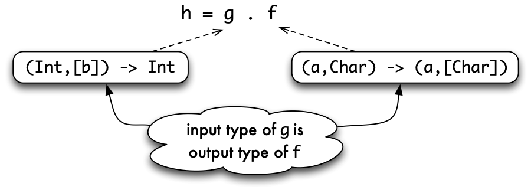<span class="img-wrapper"></span></label>

Here we should recall the meaning of types which involve type variables; we can see them as shorthand for sets of types. The output of `f` is described by `(a,[Char])`, and the input of `g` by `(Int,[b])`. We therefore have to look for types which meet both these descriptions. We will now look at this general topic, returning to the example in the course of this dicussion.

### Unification {#unification .unnumbered}

How are we to describe the types which meet the two descriptions `(a,[Char])` and `(Int,[b])`?

<label class="checkbox-label"><input class="checkbox-img" type="checkbox">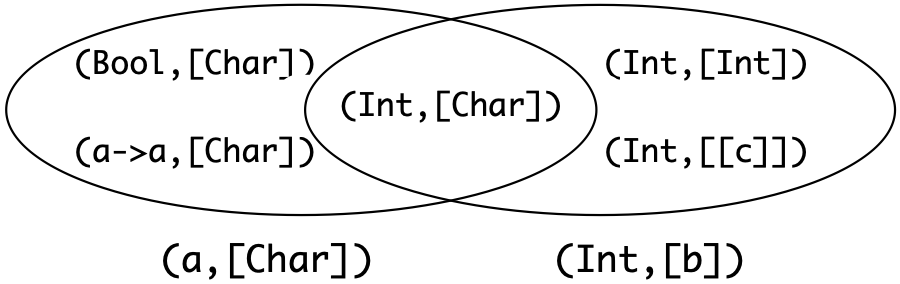<span class="img-wrapper"></span></label>

As sets of types, we look for the intersection of the sets given by `(a,[Char])` and `(Int,[b])`. How can we work out a description of this intersection? Before we do this, we revise and introduce some terminology.

Recall that an **instance** of a type is given by replacing a type variable or variables by type expressions. A type expression is a common instance of two type expressions if it is an instance of each expression. The most general common instance of two expressions is a common instance `mgci` with the property that every other common instance is an instance of `mgci`.

Now we can describe the intersection of the sets given by two type expressions. It is called the **unification** of the two, which is the **most general common instance** of the two type expressions.

#### Example 3 (continued) {#example-3-continued .unnumbered}

In this example, we have

<label class="checkbox-label"><input class="checkbox-img" type="checkbox">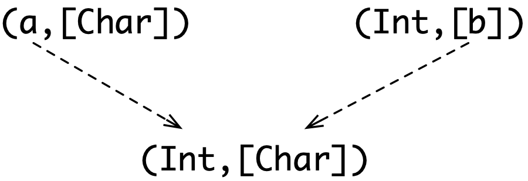<span class="img-wrapper"></span></label>

with a single type resulting. This means that the type `a` has to be `Int` and so the type of the function `h = g.f` is

```haskell
h :: (Int,Char) -> Int
```

This concludes the discussion of example 3.

#### Unification, revisited {#unification-revisited .unnumbered}

Unification need not result in a monotype. In the example of unifying the types `(a,[a])` and `([b],c)`,

<label class="checkbox-label"><input class="checkbox-img" type="checkbox">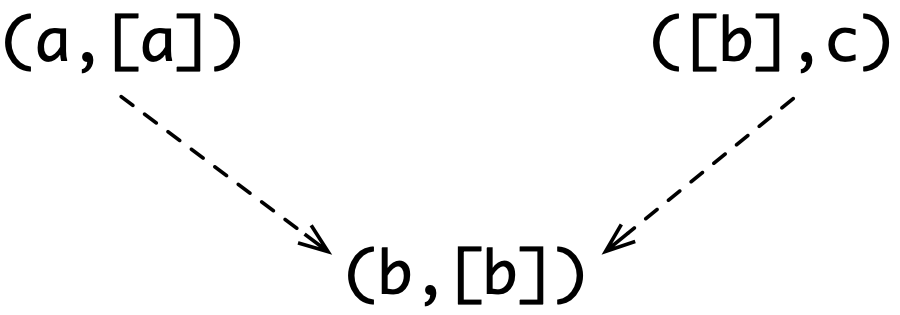<span class="img-wrapper"></span></label>

the result is the type `([b],[[b]])`. This is because the expression `(a,[a])` constrains the type to have in its second component a list of elements of the first component type, while the expression `([b],c)` constrains its first component to be a list. Thus satisfying the two gives the type `([b],[[b]])`.

In the last example, note that there are many common instances of the two type expressions, including `([Bool],[[Bool]])` and `([[c]],[[[c]]])`, but neither of these examples is the unifier, since `([b],[[b]])` is not an instance of either of them. On the other hand, they are each instances of `([b],[[b]])`, as it is the most general common instance, and so the unifier of the two type expressions.

Not every pair of types can be unified: consider the case of `[Int] -> [Int]` and .

<label class="checkbox-label"><input class="checkbox-img" type="checkbox">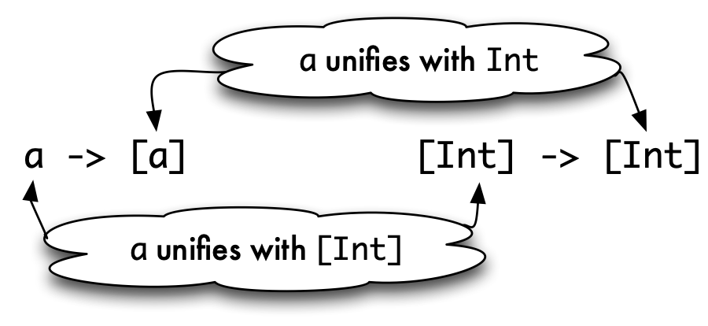<span class="img-wrapper"></span></label>

Unifying the argument types requires `a` to become `[Int]`, while unifying the result types requires `a` to become `Int`; clearly these constraints are inconsistent, and so the unification fails.

### Type-checking expressions {#type-checking-expressions .unnumbered}

As we saw in [Monomorphic type checking](#monoCheck), function application is central to expression formation. This means that type checking also hinges on function applications.

#### Type-checking polymorphic function application {#type-checking-polymorphic-function-application .unnumbered}

<label class="checkbox-label"><input class="checkbox-img" type="checkbox">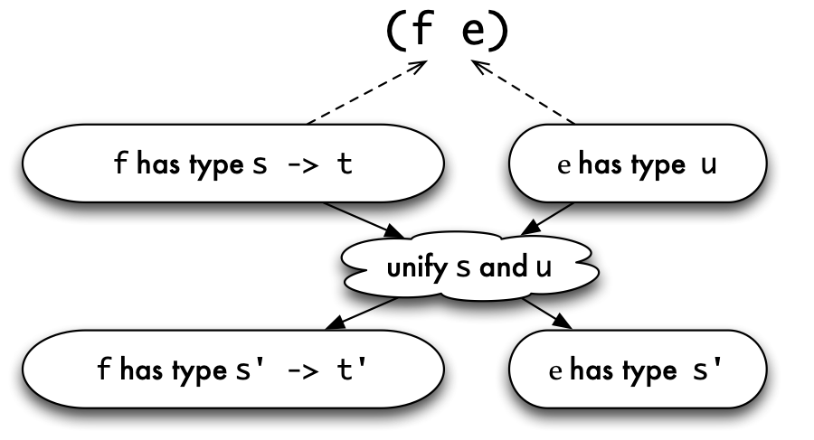<span class="img-wrapper"></span></label>

In applying a function `f :: s -> t` to an argument `e :: u` we do not require that `s` and `u` are equal, but instead that they are unifiable to a type `s’`, say, giving `e :: s’` and `f :: s’ -> t’`; the result in that case is of type `t’.`

#### Example 4 {#example-4 .unnumbered}

As an example, consider the application `map Circle` where `Circle` is one of the constructor functions for the `Shape` type.

```haskell
map :: (a -> b) -> [a] -> [b]
Circle :: Float -> Shape
```

Unifying `a -> b` and `Float -> Shape` results in `a` becoming `Float` and `b` becoming `Shape`; this gives

```haskell
map :: (Float -> Shape) -> [Float] -> [Shape]
```

and so

```haskell
map Circle :: [Float] -> [Shape]
```

As in the monomorphic case, we can use this discussion of typing and function application in explaining type checking all aspects of expressions. We now look at another example, before examining a more technical aspect of type checking.

#### Example 5, `foldr` revisited {#example-5-foldr-revisited .unnumbered}

In [Folding and primitive recursion](10.md#foldPrimRec) we introduced the `foldr` function

```haskell
foldr f s []     = s  -- (foldr.1)
foldr f s (x:xs) = f x (foldr f s xs)  -- (foldr.2)
```

which could be used to fold an operator into a list, as in

```haskell
foldr (+) 0 [2,3,1] = 2+(3+(1+0))
```

so that it appears as if `foldr` has the type given by

```haskell
foldr :: (a -> a -> a) -> a -> [a] -> a
```

In fact, the most general type of `foldr` is more general than this. Suppose that the starting value has type `b` and the elements of the list are of type `a`

```haskell
foldr :: (... -> ... -> ...) -> b -> [a] -> ...
```

Then we can picture the definition thus:

<label class="checkbox-label"><input class="checkbox-img" type="checkbox">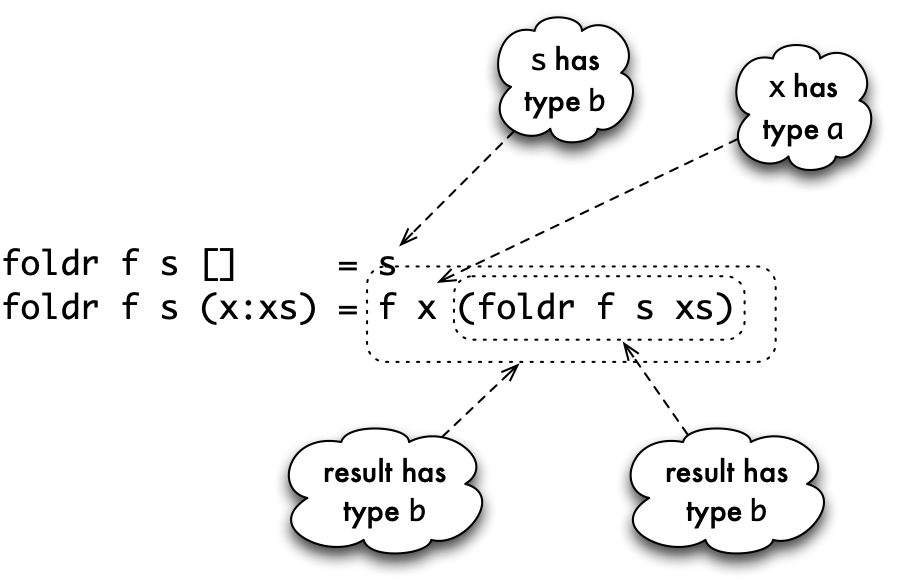<span class="img-wrapper"></span></label>

`s` is the result of the first equation, and so the result type of the `foldr` function itself will be `b`, the type of `s`

```haskell
foldr :: (... -> ... -> ...) -> b -> [a] -> b
```

In the second equation, `f` is applied to `x` as first argument, giving

```haskell
foldr :: (a -> ... -> ...) -> b -> [a] -> b
```

The second argument of `f` is the result of a `foldr`, and so of type `b`,

```haskell
foldr :: (a -> b -> ...) -> b -> [a] -> b
```

Finally, the result of the second equation is an application of `f`; this result must have the same result type as the `foldr` itself, `b`.

```haskell
foldr :: (a -> b -> b) -> b -> [a] -> b
```

With this insight about the type of `foldr` we were able to see that `foldr` could be used to define another whole cohort of list functions, such as an insertion sort,

```haskell
iSort
iSort :: Ord a => [a] -> [a]
iSort = foldr ins []
```

in which `ins` has the type `Ord a => a -> [a] -> [a]`.

### Polymorphic definitions and variables {#polymorphic-definitions-and-variables .unnumbered}

Here we examine a more technical aspect of how type checking works over polymorphic definitions; it may be omitted on first reading.

Functions and constants can be used at different types in the same expression. A simple instance is

```haskell
expr = length ([]++[True]) + length ([]++[2,3,4])   -- (expr)
```

The first occurrence of `[]` is at `[Bool]`, whilst the second is at `[Integer]`. This is completely legitimate, and is one of the advantages of a polymorphic definition. Now suppose that we replace the `[]` by a variable, and define

```haskell
funny xs = length (xs++[True]) + length (xs++[2,3,4])   -- (funny)
```

The variable `xs` is forced to have type `[Bool]` *and* type `[Integer]`; it is forced to be polymorphic, in other words. This is not allowed in Haskell, as there is no way of expressing the type of `funny`. It might be thought that

```haskell
funny :: [a] -> Int
```

was a correct type, but this would mean that `funny` would have all the instance types

```haskell
funny :: [Int] -> Int
funny :: [[Char]] -> Int
  ...
```

which it clearly does not. We conclude that constants and variables are treated differently: constants may very well appear at different incompatible types in the same expression, variables cannot.

What is the significance of disallowing the definition `(funny)` but allowing the definition `(expr)`? Taking `(expr)` first, we have a polymorphic definition of the form `[] :: [a]` and an expression in which `[]` occurs twice; the first occurrence is at `[Bool]`, the second at `[Integer]`. To allow these independent uses to occur, we type-check each use of a polymorphic definition with different type variables, so that a constraint on one use does not affect any of the others.

On the other hand, how is the definition of `(funny)` disallowed? When we type check the use of a variable we will not treat each instance as being of an independent type. Suppose we begin with no constraint on `xs`, so `xs::t`, say. The first occurrence of `xs` forces `xs::[Bool]`, the second requires `xs::[Integer]`; these two constraints cannot be satisfied simultaneously, and thus the definition `(funny)` fails to type check.

The crucial point to remember from this example is that the definition of a function can't force any of its arguments to be polymorphic.

### Function definitions {#function-definitions-1 .unnumbered}

In type checking a function definition like `(fdef)` above we have to obey rules similar to the monomorphic case.

-   Each of the guards g\_i must be of type `Bool`.

-   The value e\_i returned in each clause must have a type s\_i which is at least as general as `t`; that is, s\_i must have `t` as an instance.

-   The pattern p\_j must be **consistent** with type of that argument, namely t\_j.

We take up a final aspect of type checking -- the impact of type classes -- in the next section.

**Exercises**

1.  Do the following pairs of types -- listed vertically -- unify? If so, give a most general unifier for them; if not, explain why they fail to unify.

    ```haskell
    (Int -> b)       (Int,a,a)
    (a -> Bool)      (a,a,[Bool])
    ```

2.  Show that we can unify `(a,[a])` with `(b,c)` to give `(Bool,[Bool])`.

3.  Can the function

    ```haskell
    f :: (a,[a]) -> b
    ```

    be applied to the arguments `(2,[3])`, `(2,[])` and `(2,[True])`; if so, what are the types of the results? Explain your answers.

4.  Repeat the previous question for the function

    ```haskell
    f :: (a,[a]) -> a
    ```

    Explain your answers.

5.  Give the type of `f [] []` if `f` has type

    ```haskell
    f :: [a] -> [b] -> a -> b
    ```

    What is the type of the function `h` given by the definition

    ```haskell
    h x = f x x ?
    ```

6.  How can you use the Haskell system to check whether two type expressions are unifiable, and if so what is their unification? Hint: you can make dummy definitions in Haskell in which the defined value, `zircon` say, is equated with itself:

    ```haskell
    zircon = zircon
    ```

    Values defined like this can be declared to have any type you wish.

7.  \[Harder\] Recalling the definitions of `curry` and `uncurry` from [Currying and uncurrying](11.md#curry), what are the types of

    ```haskell
    curry id
    uncurry id
    curry (curry id)
    uncurry (uncurry id)
    uncurry curry
    ```

    Explain why the following expressions do not type-check:

    ```haskell
    curry uncurry
    curry curry
    ```

8.  \[Harder\] Give an *algorithm* which decides whether two type expressions are unifiable. If they are, your algorithm should return a most general unifying substitution; if not, it should give some explanation of why the unification fails.

Type checking and classes {#typeCheckClasses}
-------------------------

Classes in Haskell restrict the use of some functions, such as `==`, to types in the class over which they are defined, in this case `Eq`. These restrictions are apparent in the **contexts** which appear in some types. For instance, if we define

```haskell
member []     y = Falsemember
member (x:xs) y = (x==y) || member xs y
```

its type will be

```haskell
Eq a => [a] -> a -> Bool
```

because `x` and `y` of type `a` are compared for equality in the definition, thus forcing the type `a` to belong to the equality class `Eq`.

This section explores the way in which type checking takes place when overloading is involved; the material is presented informally, by means of an example.

Suppose we are to apply the function `member` to an expression `e`, whose type is

```haskell
Ord b => [[b]]
```

Informally, `e` is a list of lists of objects, which belong to a type which carries an ordering. In the absence of the contexts we would unify the type expressions, giving

```haskell
member :: [[b]] -> [b] -> Bool      e :: [[b]]
```

and so giving the application `member e` the type `[b] -> Bool`. We do the same here, but we also apply the unification to the contexts, producing the context

```haskell
(Eq [b] , Ord b)  -- (ctx.1)EqOrd
```

Now, we check and simplify the context.

-   The requirements in a context can only apply to type variables, so we need to eliminate requirements like `Eq [b]`. The only way these can be eliminated is to use the `instance` declarations. In this case the built-in instance declaration

    ```haskell
    instance Eq a => Eq [a] where ....
    ```

    allows us to replace the requirement `Eq [b]` with `Eq b` in `(ctx.1)`, giving the new context

    ```haskell
    (Eq b , Ord b)  -- (ctx.2)
    ```

    We repeat this process until no more instances apply. If we fail to reduce all the requirements to ones involving a type variable, the application fails, and an error message would be generated. This happens if we apply `member` to `[id]`;

    ```haskell
        No instance for (Eq (a -> a))
          arising from a use of `member' at <interactive>:1:0-10
        Possible fix: add an instance declaration for (Eq (a -> a))
        In the expression: member [id]
        In the definition of `it': it = member [id]
    ```

    since `id` is a function, whose type is not it the class `Eq`.

-   We then simplify the context using the `class` definitions. In our example we have both `Eq b` and `Ord b`, but recall that

    ```haskell
    class Eq a => Ord a where ...
    ```

    so that any instance of `Ord` is automatically an instance of `Eq`; this means that we can simplify `(ctx.2)` to

    ```haskell
    Ord b
    ```

    This is repeated until no further simplifications result.

For our example, we thus have the type

```haskell
member e :: Ord b => [b] -> Bool
```

This three-stage process of unification, checking (with instances) and simplification is the general pattern for type checking with contexts in Haskell.

Finally, we should explain how contexts are introduced into the types of the language. They originate in types for the functions in class declarations, so that, in the example of the `Info` class from earlier in the chapter, we have

```haskell
examples :: Info a => [a]Info
size     :: Info a => a -> Int
```

The type checking of functions which use these overloaded functions will propagate and combine the contexts as we have seen above.

We have seen informally how the Haskell type system accommodates type checking for the overloaded names which belong to type classes. A more thorough overview of the technical aspects of this, including a discussion of the 'monomorphism restriction' which needs to be placed on certain polymorphic bindings, is to be found in the Haskell 2010 report ([Marlow 2010](bibliography.md#haskell2010)).

**Exercises**

1.  Give the type of each of the individual conditional equations which follow, and discuss the type of the function which together they define.

    ```haskell
    merge (x:xs) (y:ys) 
      | x<y         = x : merge xs (y:ys)
      | x==y        = x : merge xs ys
      | otherwise   = y : merge (x:xs) ys
    merge (x:xs) []    = (x:xs)
    merge []    (y:ys) = (y:ys)
    merge []    []     = []
    ```

2.  Define a polymorphic sorting function, and show how its type is derived from the type of the ordering relation

    ```haskell
    compare :: Ord a => a -> a -> Ordering
    ```

3.  Investigate the types of the following numerical functions; you will find that the types refer to some of the built-in numeric classes.

    ```haskell
    mult x y = x*y
    divide x = x `div` 2
    share x  = x / 2.0
    ```

    Recall that these can be given more restrictive types, such as

    ```haskell
    divide :: Int -> Int
    ```

    by explicitly asserting their types as above.

Summary {#summary-2 .unnumbered}
-------

This chapter has shown how names such as `read` and `show` and operators like `+` can be overloaded to have different definitions at different types. The mechanism which enables this is the system of Haskell classes. A `class` definition contains a signature which contains the names and types of operations which must be supplied if a type is to be a member of the class. For a particular type, the function definitions are contained in an `instance` declaration.

In giving the type of a function, or introducing a class or an instance, we can supply a context, which constrains the type variables occurring. Examples include

```haskell
member :: Eq a => [a] -> a -> BoolEq
instance  Eq a => Eq [a] where ....
class     Eq a => Ord a  where ....Ord
```

In the examples, it can be seen that `member` can only be used over types in the class `Eq`. Lists of `a` can be given an equality, provided that `a` itself can; types in the class `Ord` must already be in the class `Eq`. After giving examples of the various mechanisms, we looked at the classes in the standard preludes of Haskell.

We concluded the chapter with a discussion of how type checking of expressions and definitions is performed in Haskell, initially in the monomorphic case, and then in full generality with polymorphic and overloaded functions. In that case we saw type checking as a process of extracting and consolidating constraints which come from the unification of type expressions which contain type variables.

[^1]: In fact, the implementation of classes works like this, passing in a *dictionary* argument containing the appropriate equality function at each point that `elem` is used, after it has been transformed into `elemGen`.

[^2]: Apart from (de)coding of Char, `take`, `drop` and so forth.

[^3]: In `C++` teminology this would be an abstract base class, with `Bool` etc. inheriting and being forced to implement the operations of that class.
