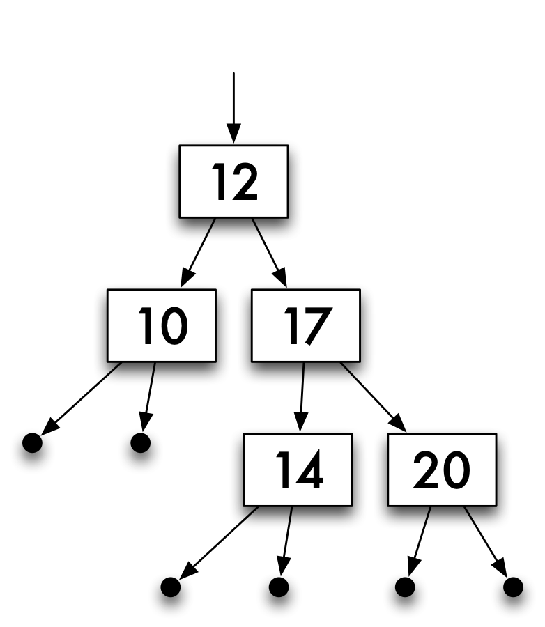
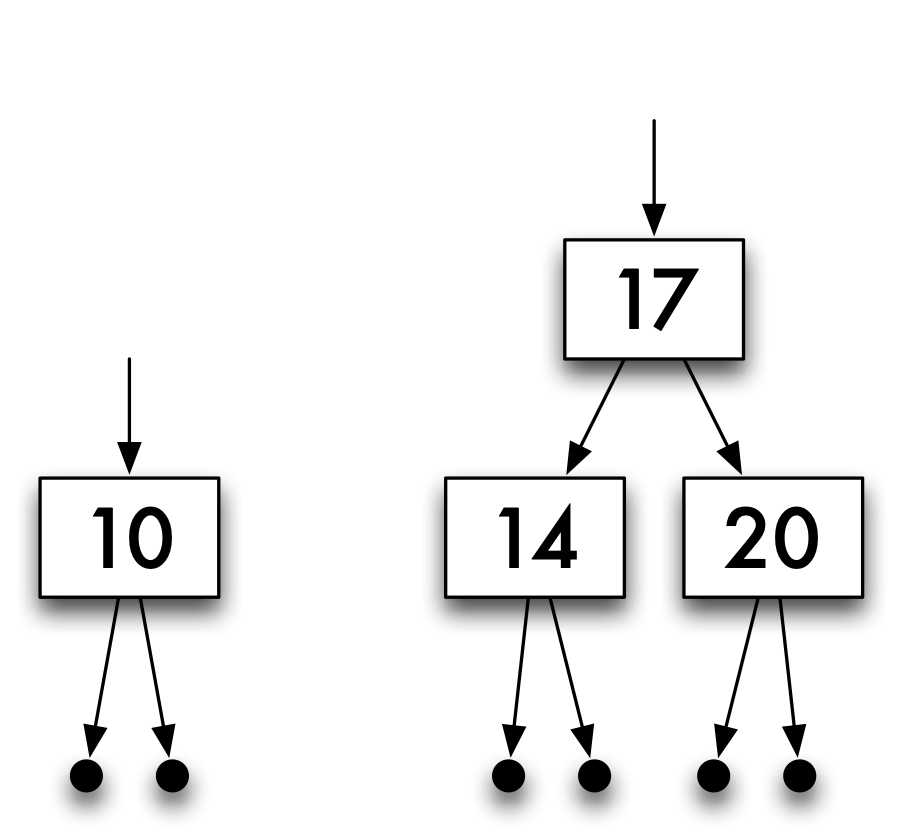
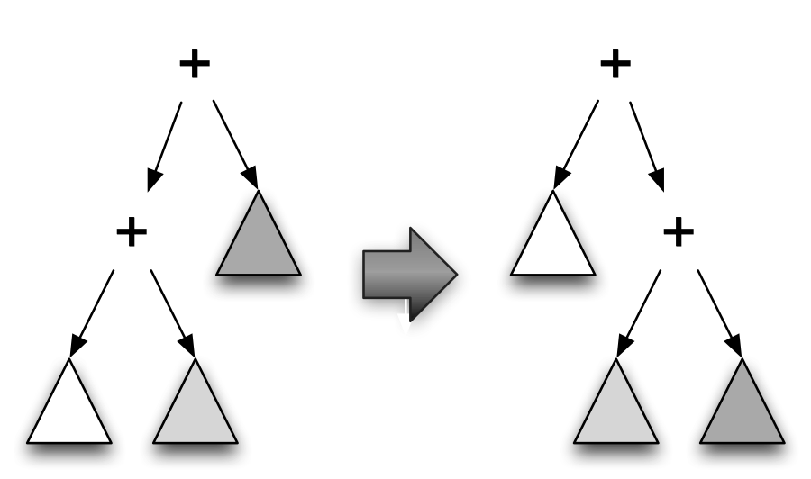
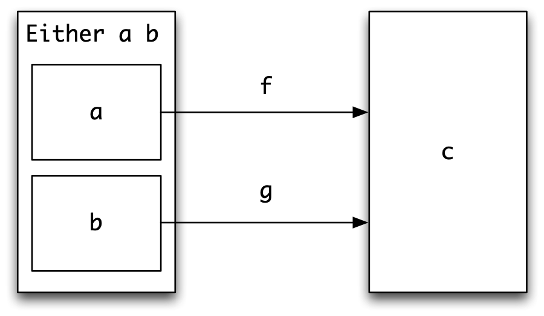
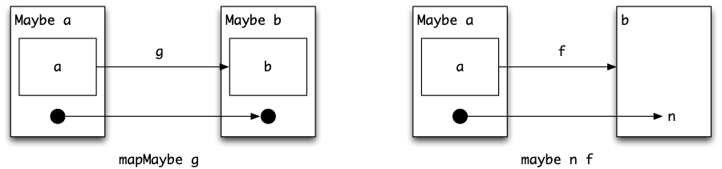
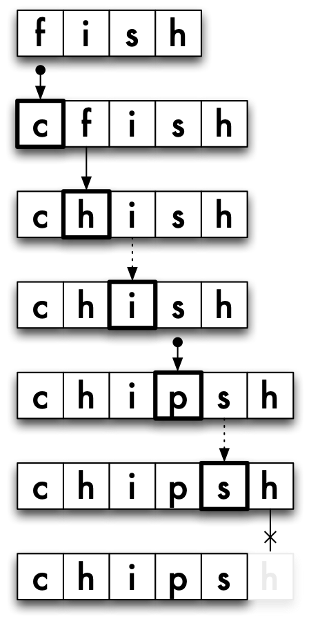
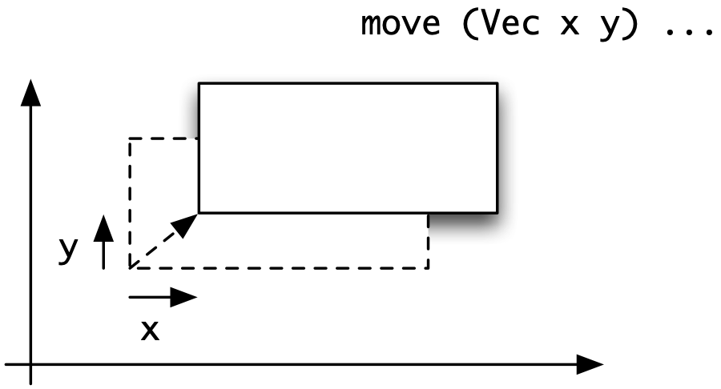

Algebraic types {#algTypes}
===============

<a id="ix-14-algebraic-type"></a>

<figure><label class="checkbox-label"><input class="checkbox-img" type="checkbox"><span class="img-wrapper"></span></label><figcaption>An example of a tree of integers.</figcaption></figure>

<a id="treeFig"></a>

So far in our discussion of Haskell we have been able to model entities using

-   the base types, `Int`, `Float`, `Bool` and `Char`, and

-   composite types: tuple types, `(t1,t2,…,tn)`; list types, `[t1]`; and function types, `(t1 -> t2)`; where `t1`, ..., `tn` are themselves types,

-   algebraic types, including enumerated types, as introduced in [Defining types for ourselves: enumerated types](4.md#EnumTypes), and product and sum type, first given in [Introducing algebraic types](5.md#introAlg).

This gives a wide range of types to use in modelling different domains in Haskell. This chapter completes our coverage of the topic of algebraic types and looks at two extensions in some detail:

-   The types can be **recursive**; we can use the type we are defining, `Typename`, as (part of) any of the component types, as in the definition of numeric trees "`NTree`s":

    ```haskell
    data NTree = NilT |
                 Node Integer NTree NTree
    ```

    an illustration of a tree from `NTree` is given in [An example of a tree of integers.](#treeFig). Recursion in `data` type definitions gives us lists, trees and many other useful data structures.

-   The name of the type being defined can be followed by one or more type variables which may be used on the right-hand side, making the definition **polymorphic**.<a id="ix-14-algebraic-type-polymorphic"></a> An example built-into Haskell is the `Maybe` type,

    ```haskell
    data Maybe a = Nothing | Just a
    ```

    which can be used in modelling program errors.

Recursive polymorphic types combine these two ideas, and this powerful mixture provides types which can be reused in many different situations -- the built-in type of lists is an example which we have already seen. We'll look again at the `NTree` and `Maybe` types later in this chapter, and other examples are given in the sections which follow.

Algebraic type definitions revisited {#algRevisited}
------------------------------------

Algebraic data type definitions are introduced by the keyword `data`, followed by the name of the type, an equals sign and then the **constructors** of the<a id="ix-14-constructor"></a> type being defined. The name of the type and the names of constructors begin with capital letters.

The general form of the algebraic type definitions which we have seen so far is <a id="ix-14-algebraic-type-general-form-of-definition"></a>

```haskell
data Typename   -- (Typename)
  = Con1 t11 ... t1k1 | 
    Con2 t21 ... t2k2 | 
        ....
    Conn tn1 ... tnkn   
```

Each `Coni` is a constructor, followed by ki types, where ki is a non-negative integer which may be zero. We build elements of the type `Typename` by applying these constructor functions to arguments of the types given in the definition, so that

```haskell
Coni vi1 ... viki
```

will be a member of the type `Typename` if vij is in tij for `j` ranging from `1` to ki. Reading the constructors as functions, the definition `(Typename)` gives the constructors the following types

```haskell
Coni :: ti1 -> ... -> tiki -> Typename
```

Of the examples we have seen so far, enumerated types have constructors which take no arguments,

```haskell
data Season = Spring | Summer | Autumn | Winter
```

product types have a single constructor,

```haskell
data People = Person Name Age 
```

and sum types are the most general: they have a number of constructors taking different arguments, as in the definition

```haskell
data Shape = Circle Float |
             Rectangle Float Float
```

Definitions over algebraic types use pattern matching both to distinguish between different alternatives and to extract components from particular elements:

```haskell
area :: Shape -> Float
area (Circle r)      = pi*r*r
area (Rectangle h w) = h*w
```

As we discussed in [A tour of the built-in Haskell classes](13.md#haskellClasses), Haskell has a number of built-in classes including `Eq`, `Ord`, `Enum`, `Show`, and `Read`. When we introduce a new algebraic type it's possible to `derive` instances of these classes for the new type, like this:

```haskell
data Season = Spring | Summer | Autumn | Winter 
              deriving (Eq,Ord,Enum,Show,Read)
```

We can thus compare seasons for equality and order, write expressions of the form `[Spring .. Autumn]` denoting the list `[Spring, Summer, Autumn]`, and `show` and read values of the type.

**Exercises**

1.  Reimplement the library database<a id="ix-14-library-database"></a> of [A library database](5.md#library) to use an algebraic type like `People` rather than a pair. Compare the two approaches to this example.

2.  The library database of [A library database](5.md#library) is to be extended in the following ways.

    -   CDs and videos as well as books are available for loan.

    -   A record is kept of the authors of books as well as their titles. Similar information is kept about CDs, but not about videos.

    -   Each loan has a period: books one month, CDs one week and videos three days.

    Explain how you would modify the types used to implement the database, and how the function types might be changed. The system should perform the following operations. For each case, give the types and definitions of the functions involved.

    -   Find all items on loan to a given person.

    -   Find all books, CDs or videos on loan to a particular person.

    -   Find all items in the database due back on or before a particular day, and the same information for any given person.

    -   Update the database with loans; the constant `today` can be assumed to contain today's date, in a format of your choice.

    What other functions would have to be defined to make the system usable? Give their types, but not their definitions.

Recursive algebraic types {#recTypes}
-------------------------

<a id="ix-14-recursive-type"></a>

Types are often naturally described in terms of themselves. For instance, an integer expression is either a **literal** integer, like `347`, or is given by combining two expressions using an arithmetic operator such as plus or minus, as in `(3-1)+3`.

```haskell
data Expr = Lit Integer |
            Add Expr Expr |
            Sub Expr Expr
```

Similarly, a tree is either nil or is given by combining a value and two sub-trees. For example, the number `12` and the trees in [Two trees.](#treeFig2) are assembled to give the tree in [An example of a tree of integers.](#treeFig).

<figure><label class="checkbox-label"><input class="checkbox-img" type="checkbox"><span class="img-wrapper"></span></label><figcaption>Two trees.</figcaption></figure>

<a id="treeFig2"></a>

As a Haskell type we say

```haskell
data NTree = NilT |
             Node Integer NTree NTree
```

Finally, we have already used the type of lists: a list is either empty ( `[]`) or is built from a head and a tail -- another list -- using the list constructor '`:`'. Lists will provide a good guide to using recursive (and polymorphic) definitions. In particular they suggest how 'general' polymorphic higher-order functions over other algebraic types are defined, and how programs are verified. We now look at some examples in more detail.

### Expressions {#expressions .unnumbered}

<a id="ix-14-calculator"></a>

The type `Expr` gives a model of the simple numerical expressions discussed above. These might be used in implementing a simple numerical calculator, for instance.

```haskell
data Expr = Lit Integer |
            Add Expr Expr |
            Sub Expr Expr
```

Some examples are

|           |                                     |
|:----------|:------------------------------------|
| `2`       | `Lit 2`                             |
| `2+3`     | `Add (Lit 2) (Lit 3)`               |
| `(3-1)+3` | `Add (Sub (Lit 3) (Lit 1)) (Lit 3)` |

where the informal expressions are listed in the left-hand column, and their `Expr` forms in the right. Given an expression, we might want to

-   evaluate it;

-   turn it into a string, which can then be printed;

-   estimate its size -- count the operators, say.

Each of these functions will be defined in the same way, using **primitive recursion**.<a id="ix-14-primitive-recursion"></a> As the type is itself recursive, it is not a surprise that the functions which handle the type are also recursive. Also, the form of the recursive definitions follows the recursion in the type definition. For instance, to evaluate an operator expression we work out the values of the arguments and combine the results using the operator.

```haskell
eval :: Expr -> Integer

eval (Lit n)     = n
eval (Add e1 e2) = (eval e1) + (eval e2)
eval (Sub e1 e2) = (eval e1) - (eval e2)
```

Primitive recursive definitions have two parts:

-   At the non-recursive, *base* cases -- `(Lit n)` here -- the value is given outright. <a id="ix-14-primitive-recursion-base-case"></a>

-   At the recursive cases, the values of the function at the <a id="ix-14-primitive-recursion-recursive-case"></a> sub-expressions from which the expression is formed -- `eval e1` and `eval e2` here -- can be used in calculating the result.

The `show` function has a similar form

```haskell
show :: Expr -> String

show (Lit n) = show n
show (Add e1 e2) 
  = "(" ++ show e1 ++ "+" ++ show e2 ++ ")"
show (Sub e1 e2) 
  = "(" ++ show e1 ++ "-" ++ show e2 ++ ")"
```

as does the function to calculate the number of operators in an expression; we leave this as an exercise. Other exercises at the end of the section look at a different representation of expressions for which a separate type is used to represent the different possible operators. Next, we look at another recursive algebraic type, but after that we return to `Expr` and give an example of a non-primitive-recursive definition of a function to rearrange expressions in a particular way.

### Trees of integers {#trees-of-integers .unnumbered}

<a id="ix-14-tree-numeric"></a>

Trees of integers like that in [An example of a tree of integers.](#treeFig) can be modelled by the type

```haskell
data NTree = NilT |
             Node Integer NTree NTree
```

The null tree is given by `NilT`, and the trees in [Two trees.](#treeFig2) by

```haskell
Node 10 NilT NilT
Node 17 (Node 14 NilT NilT) (Node 20 NilT NilT)
```

Definitions of many functions are primitive recursive. For instance,

```haskell
sumTree,depth :: NTree -> Integer

sumTree NilT           = 0
sumTree (Node n t1 t2) = n + sumTree t1 + sumTree t2

depth NilT             = 0
depth (Node n t1 t2)   = 1 + max (depth t1) (depth t2)
```

with, for example,

```haskell
sumTree (Node 3 (Node 4 NilT NilT) NilT) = 7
depth   (Node 3 (Node 4 NilT NilT) NilT) = 2
```

As another example, take the problem of finding out how many times a number, `p` say, occurs in a tree. The primitive recursion suggests two cases, depending upon the tree.

-   For a null tree, `NilT`, the answer must be zero.

-   For a non-null tree, `(Node n t1 t2)`, we can find out how many times `p` occurs in the sub-trees `t1` and `t2` by two recursive calls; we have to make a case split depending on whether `p` occurs at the particular node, that is depending on whether or not `p==n`.

The final definition is

```haskell
occurs :: NTree -> Integer -> Integer

occurs NilT p = 0
occurs (Node n t1 t2) p
  | n==p        = 1 + occurs t1 p + occurs t2 p
  | otherwise   =     occurs t1 p + occurs t2 p
```

The exercises at the end of the section give a number of other examples of functions defined over trees using primitive recursion. We next look at a particular example where a different form of recursion is used.

### Rearranging expressions {#rearranging-expressions .unnumbered}

The next example shows a definition which uses a more general recursion than we have seen so far. After showing why the generality is necessary, we argue that the function we have defined is total: it will give a result on all well-defined expressions.

The operation of addition over the integers is associative<a id="ix-14-associativity"></a>, so that the way in which an expression is bracketed is irrelevant to its value. We can, therefore, decide to bracket expressions involving '`+`' in any way we choose. The aim here is to write a program to turn expressions into right bracketed form, as shown in [Rearranging additions](#associate) and in the following table:

```haskell
(2+3)+4                 2+(3+4)
((2+3)+4)+5             2+(3+(4+5))
((2-((6+7)+8))+4)+5    (2-(6+(7+8)))+(4+5)
```

What is the program to do? The main aim is to spot occurrences of

```haskell
Add (Add e1 e2) e3   -- (AddL)
```

and to transform them to

```haskell
Add e1 (Add e2 e3)  -- (AddR)
```

so a first attempt at the program might say

```haskell
try (Add (Add e1 e2) e3) 
  = Add (try e1) (Add (try e2) (try e3))
try ...
```

which is primitive recursive: on the right-hand side of their definition the function `try` is only used on sub-expressions of the argument. This function will have the effect of transforming `(AddL)` to `(AddR)`, but unfortunately `(AddExL)` will be sent to `(AddExR)`:

```haskell
((2+3)+4)+5   -- (AddExL) 
(2+3)+(4+5)  -- (AddExR)  
```

<figure><label class="checkbox-label"><input class="checkbox-img" type="checkbox"><span class="img-wrapper"></span></label><figcaption>Rearranging additions</figcaption></figure>

<a id="associate"></a>

The problem is that in transforming `(AddL)` to `(AddR)` we may produce another pattern we are looking for at the top level: this is precisely what happens when `(AddExL)` is transformed to `(AddExR)`. We therefore have to call the function *again* on the result of the rearrangement

```haskell
assoc :: Expr -> Expr

assoc (Add (Add e1 e2) e3)
  = assoc (Add e1 (Add e2 e3))   -- (Add.1)
```

The other cases in the definition make sure that the *parts* of an expression are rearranged as they should be.

```haskell
assoc (Add e1 e2) 
  = Add (assoc e1) (assoc e2)   -- (Add.2)
assoc (Sub e1 e2) 
  = Sub (assoc e1) (assoc e2)
assoc (Lit n) 
  = Lit n
```

The equation `(Add.2)` will only be applied to the cases where `(Add.1)` does not apply -- this is when `e1` is either a `Sub` or a `Lit` expression. This is always the case in pattern matching<a id="ix-14-pattern-matching"></a>; the *first* applicable equation is used.

When we use primitive recursion we can be sure that the recursion will **terminate**<a id="ix-14-termination"></a> to give an answer: the recursive calls are only made on smaller expressions and so, after a finite number of calls to the function, a base case will be reached.

The `assoc` function is more complicated, and we need a more subtle argument to see that the function will always give a result. The equation `(Add.1)` is the tricky one, but intuitively, we can see that some progress has been made -- some of the 'weight' of the tree has moved from left to right. In particular, one addition symbol has swapped sides. None of the other equations moves a plus in the other direction, so that after applying `(Add.1)` a finite number of times, there will be no more exposed addition symbols at the top level of the left-hand side. This means that the recursion cannot go on indefinitely, and so the function always leads to a result.

In [Reasoning about algebraic types](#proofAlgTypes) we'll look at specifying QuickCheck properties for functions over algebraic types, including `assoc`, as well as showing how some of these can be proved by induction.

### Syntax: infix constructors {#syntax-infix-constructors .unnumbered}

<a id="ix-14-constructor-infix"></a>

We have seen that functions can be written in infix form; this also applies to constructors. We can, for example, redefine the function `assoc` thus:

```haskell
assoc ((e1 `Add` e2) `Add` e3)
  = assoc (e1 `Add` (e2 `Add` e3))
 ...
```

using the infix form of the constructor, given by surrounding it with back-quotes.

When an expression like this is `show`n, it appears in prefix form, so that the expression `(Lit 3) ‘Add‘ (Lit 4)` appears as

```haskell
Add (Lit 3) (Lit 4)
```

In a `data` definition we can define Haskell operators which are themselves constructors. These constructors have the same syntax as operator symbols, except that their first character must be a '`:`', which is reminiscent of '`:`', itself an infix constructor. For our type of integer expressions, we might define

```haskell
data Expr = Lit Integer |
            Expr :+: Expr |
            Expr :-: Expr
```

When an expression involving operator constructors is printed, the constructors appear in the infix position, unlike the quoted constructors above.

It is left as an exercise to complete the redefinition of functions over `Expr` under this redefinition of the `Expr` type.

### Mutual recursion {#mutual-recursion .unnumbered}

<a id="ix-14-recursion-mutual"></a>

<a id="ix-14-recursive-type-mutually-recursive"></a>

In describing one type, it is often useful to use others; these in turn may refer back to the original type: this gives a pair of **mutually recursive** types. A description of a person might include biographical details, which in turn might refer to other people. For instance:

```haskell
data Person = Adult Name Address Bio |
              Child Name
data Bio    = Parent String [Person] |
              NonParent String
```

In the case of a parent, the biography contains some text, as well as a list of their children, as elements of the type `Person`.

Suppose that we want to define a function which shows information about a person as a string. Showing this information will require us to show some biographical information, which itself contains further information about people. We thus have two mutually recursive functions:

```haskell
showPerson (Adult nm ad bio) 
  = show nm ++ show ad ++ showBio bio
  ...
showBio (Parent st perList)
  = st ++ concat (map showPerson perList)
  ...
```

**Exercises**

1.  Give calculations of

    ```haskell
    eval (Lit 67)
    eval (Add (Sub (Lit 3) (Lit 1)) (Lit 3))
    show (Add (Lit 67) (Lit (-34)))
    ```

2.  Define the function

    ```haskell
    size :: Expr -> Integer
    ```

    which counts the number of operators in an expression.

3.  Add the operations of multiplication and integer division to the type `Expr`, and redefine the functions `eval`, `show` and `size` to include these new cases. What does your definition of `eval` do when asked to perform a division by zero?

4.  Instead of adding extra constructors to the `Expr` type, as in the previous question, it is possible to factor the definition thus:

    <a id="modExpr"></a>

    ```haskell
    data Expr = Lit Integer |
                Op Ops Expr Expr

    data Ops  = Add | Sub | Mul | Div 
    ```

    Show how the functions `eval`, `show` and `size` are defined for this type, and discuss the changes you have to make to your definitions if you add the extra operation `Mod` for remainder on integer division.

5.  Give line-by-line calculations of

    ```haskell
    sumTree (Node 3 (Node 4 NilT NilT) NilT)
    depth   (Node 3 (Node 4 NilT NilT) NilT)
    ```

6.  Complete the redefinition of functions over `Expr` after it has been defined using the infix constructors `:+:` and `:-:`.

7.  Define functions to return the left- and right-hand sub-trees of an `NTree`.

8.  Define a function to decide whether a number is an element of an `NTree`.

9.  Define functions to find the maximum and minimum values held in an `NTree`.

10. A tree is reflected by swapping left and right sub-trees, recursively. Define a function to reflect an `NTree`. What is the result of reflecting twice,`reflect . reflect`?

11. Define functions

    ```haskell
    collapse, sort :: NTree -> [Integer]
    ```

    which turn a tree into a list. The function `collapse` should enumerate the left sub-tree, then the value at the node and finally the right sub-tree; `sort` should sort the elements in ascending order. For instance,

    ```haskell
    collapse (Node 3 (Node 4 NilT NilT) NilT) = [4,3]
    sort     (Node 3 (Node 4 NilT NilT) NilT) = [3,4]
    ```

12. Complete the definitions of `showPerson` and `showBio` which were left incomplete in the text.

13. It is possible to extend the type `Expr` so that it contains *conditional* expressions, `If b e1 e2`, where `e1` and `e2` are expressions, and `b` is a Boolean expression, a member of the type `BExp`,

    ```haskell
    data Expr = Lit Integer |
                Op Ops Expr Expr |
                If BExp Expr Expr
    ```

    The expression

    ```haskell
    If b e1 e2
    ```

    has the value of `e1` if `b` has the value `True` and otherwise it has the value of `e2`.

    ```haskell
    data BExp = BoolLit Bool |
                And BExp BExp |
                Not BExp |
                Equal Expr Expr |
                Greater Expr Expr
    ```

    The five clauses here give

    -   Boolean literals, `BoolLit True` and `BoolLit False`.

    -   The conjunction of two expressions; it is `True` if both sub-expressions have the value `True`.

    -   The negation of an expression. `Not be` has value `True` if `be` has the value `False`.

    -   `Equal e1 e2` is `True` when the two numerical expressions have equal values.

    -   `Greater e1 e2` is `True` when the numerical expression `e1` has a larger value then `e2`.

    Define the functions

    ```haskell
    eval  :: Expr -> Integer 
    bEval :: BExp -> Bool
    ```

    by mutual recursion, and extend the function `show` to show the redefined type of expressions.

Polymorphic algebraic types {#polyAlg}
---------------------------

Algebraic type definitions can contain the type variables `a`, `b` and so on, defining polymorphic types. The definitions are as before, with the type variables used in the definition appearing after the type name on the left-hand side of the definition. A simple example is

```haskell
data Pairs a = Pr a a
```

and example elements of the type are

```haskell
Pr 2 3    :: Pairs Integer
Pr [] [3] :: Pairs [Int]
Pr [] []  :: Pairs [a]
```

A function to test the equality of the two halves of a pair is given by

```haskell
equalPair :: Eq a => Pairs a -> Bool
equalPair (Pr x y) = (x==y)
```

The remainder of this section explores a sequence of further examples.

### Lists {#lists .unnumbered}

<a id="ix-14-lists-algebraic-type-of"></a>

The built-in type of lists can be given by a definition like

```haskell
infixr 5 :::

data List a = NilL | a ::: (List a)
              deriving (Eq,Ord,Show,Read)
```

where the syntax `[a]`, `[]` and '`:`' is used for `List a`, `NilList` and `:::`. Note that we have given a **fixity declaration** for `:::` to give it the same fixity and associativity as `:`, we can therefore write expressions like this:<a id="ix-14-fixity-declaration"></a>

```haskell
*Chapter14> 2+3 ::: 4+5 ::: NilL
5 ::: (9 ::: NilL)
```

much as lists are written with `:`.

Lists form a useful paradigm for recursive polymorphic types. In particular, we can see the possibility of defining useful families of functions over such types, and the way in which program verification can proceed by induction over the structure of a type.

### Binary trees {#binary-trees .unnumbered}

<a id="ix-14-tree-binary"></a>

The trees of [Recursive algebraic types](#recTypes) carry numbers at each node; there is nothing special about numbers, and we can equally well say that they have elements of an arbitrary type at the nodes:

```haskell
data Tree a = Nil | Node a (Tree a) (Tree a)
              deriving (Eq,Ord,Show,Read)
```

The definitions of `depth` and `occurs` carry over unchanged:

```haskell
depth :: Tree a -> Integer
depth Nil            = 0
depth (Node n t1 t2) = 1 + max (depth t1) (depth t2)
```

as do many of the functions defined in the exercises at the end of [Recursive algebraic types](#recTypes). One of these is the function collapsing a tree into a list. This is done by visiting the elements of the tree 'inorder', that is visiting first the left sub-tree, then the node itself, then the right sub-tree, thus:

```haskell
collapse :: Tree a -> [a]
collapse Nil = []
collapse (Node x t1 t2)
  = collapse t1 ++ [x] ++ collapse t2
```

For example,

```haskell
collapse (Node 12 
               (Node 34 Nil Nil) 
               (Node 3 (Node 17 Nil Nil) Nil))
  = [34,12,17,3]
```

Various higher-order functions are definable, also,

```haskell
mapTree :: (a -> b) -> Tree a -> Tree b
mapTree f Nil = Nil
mapTree f (Node x t1 t2)
  = Node (f x) (mapTree f t1) (mapTree f t2)
```

We shall return to trees in [Search trees](16.md#srchTrees), where particular 'search' trees form a case study.

### The union type, `Either` {#the-union-type-either .unnumbered}

<a id="ix-14-union-type"></a>

<a id="ix-14-sum-type"></a>

Type definitions can take more than one parameter. We saw earlier the example of the type whose elements were either a name or a number. In general we can form a type whose elements come either from `a` or from `b`:

```haskell
data Either a b = Left a | Right b
                  deriving (Eq,Ord,Read,Show)
```

Members of the 'union' or 'sum' type are `(Left x)`, with `x::a`, and `(Right y)` with `y::b`. The 'name or number' type is given by `Either String Int` and

```haskell
Left "Duke of Prunes" :: Either String Int
Right 33312           :: Either String Int
```

We can tell whether an element is in the first half of the union by

```haskell
isLeft :: Either a b -> Bool
isLeft (Left _)  = True
isLeft (Right _) = False
```

To define a function from `Either a b` to `Int`, say, we have to deal with two cases,

```haskell
fun :: Either a b -> Int
fun (Left x)  = ... x ...
fun (Right y) = ... y ...
```

In the first case, the right-hand side takes `x` to an `Int`, so is given by a function from `a` to `Int`; in the second case `y` is taken to an `Int`, thus being given by a function from `b` to `Int`.

Guided by this, we can give a higher-order function which *joins together* two functions defined on `a` and `b` to a function on `Either a b`. The definition follows, and is illustrated in [Joining together functions.](#either).

<figure><label class="checkbox-label"><input class="checkbox-img" type="checkbox"><span class="img-wrapper"></span></label><figcaption>Joining together functions.</figcaption></figure>

<a id="either"></a>

```haskell
either :: (a -> c) -> (b -> c) -> Either a b -> c

either f g (Left x)  = f x
either f g (Right y) = g y
```

If we have a function `f::a -> c` and we wish to apply it to an element of `Either a b`, there is a problem: what do we do if the element is in the right-hand side of the `Either` type? A simple answer is to raise an `error`

```haskell
applyLeft :: (a -> c) -> Either a b -> c
applyLeft f (Left x)  = f x
applyLeft f (Right _) = error "applyLeft applied to Right"
```

but in the next section we shall explore other ways of handling errors in more detail. **Exercises**

1.  Investigate which of the functions over trees discussed in the exercises of [Recursive algebraic types](#recTypes) can be made polymorphic.

2.  Define a function `twist` which swaps the order of a union

    ```haskell
    twist :: Either a b -> Either b a
    ```

    What is the effect of `(twist . twist)`?

3.  How would you define `applyLeft` using the function `either`?

4.  Show that any function of type `a -> b` can be transformed into functions of type

    ```haskell
    a -> Either b c
    a -> Either c b
    ```

5.  How could you generalize `either` to `join` so that it has type

    ```haskell
    join :: (a -> c) -> (b -> d) -> Either a b -> Either c d
    ```

    You might find the answer to the previous exercise useful here, if you want to define `join` using `either`.

The trees defined in the text are *binary*: each non-nil tree has exactly two sub-trees. We can instead define general trees with an arbitrary list of sub-trees, thus:

```haskell
data GTree a = Leaf a | Gnode [GTree a]
```

The exercises which follow concern these trees.

**Exercises**

1.  Define functions

    -   to count the number of leaves in a `GTree`;

    -   to find the depth of a `GTree`;

    -   to sum a numeric `GTree Int`;

    -   to find whether an element appears in a `GTree`;

    -   to map a function over the elements at the leaves of a `GTree`; and

    -   to flatten a `GTree` to a list.

    In each case give the type of the function that you have defined.

2.  How is the completely empty tree represented as a `GTree`?

Modelling program errors {#progErrs}
------------------------

<a id="ix-14-error-handling"></a>

How should a program deal with a situation which ought not to occur? Examples of such situations include

-   attempts to divide by zero, to take the square root of a negative number, and other arithmetical transgressions;

-   attempts to take the head of an empty list -- this is a special case of a definition over an algebraic type from which one case (here the empty list) is absent.

This section examines the problem, giving three approaches of increasing sophistication. The simplest method is to stop computation and to report the source of the problem. This is indeed what the Haskell system does in the cases listed above, and we can do this in functions we define ourselves using the `error` function,

```haskell
error :: String -> a
```

An attempt to evaluate the expression `error "Circle with negative radius"` in GHCi results in the message

```haskell
*** Exception: Circle with negative radius
```

being printed and computation stopping.

The problem with this approach is that all the useful information in the computation is lost; instead of this, the error can be dealt with in some way *without* stopping computation completely. Two approaches suggest themselves, and we look at them in turn now.

### Dummy values {#dummy-values .unnumbered}

<a id="ix-14-dummy-values-at-errors"></a>

The function `tail` is supposed to give the tail of a list, and it gives an error message on an empty list:

```haskell
tail :: [a] -> [a]
tail (_:xs) = xs
tail []     = error "Prelude.tail: empty list"
```

We could redefine it to say

```haskell
tl :: [a] -> [a]
tl (_:xs) = xs
tl []     = []
```

Now, an attempt to take the tail of *any* list will succeed. In a similar way we could say

```haskell
divide :: Integer -> Integer -> Integer
divide n m 
  | (m /= 0)    = n `div` m
  | otherwise   = 0
```

so that division by zero gives some answer. For `tl` and `divide` there have been obvious choices about what the value in the 'error' case should be; for `head` there is not, and instead we can supply an extra parameter to `head`, which is to be used in the case of the list being empty.

```haskell
hd :: a -> [a] -> a
hd y (x:_) = x
hd y []    = y
```

This approach is completely general; if a function `f` (of one argument, say) usually raises an error when `cond` is `True`, we can define a new function

```haskell
fErr y x 
  | cond        = y
  | otherwise   = f x
```

This approach works well in many cases; the only drawback is that we have no way of telling when an error has occurred, since we may get the result `y` from either the error or the 'normal' case. Alternatively we can use an error type to trap and process errors; this we look at now.

### Error types {#error-types .unnumbered}

<a id="ix-14-error-handling-error-type"></a>

The previous approach works by returning a dummy value when an error has occurred. Why not instead return an error *value* as a result? We define the type

```haskell
data Maybe a = Nothing | Just a
               deriving (Eq,Ord,Read,Show)
```

which is effectively the type `a` with an extra value `Nothing` added. We can now define a division function `errDiv` thus

```haskell
errDiv :: Integer -> Integer -> Maybe Integer
errDiv n m 
  | (m /= 0)    = Just (n `div` m)
  | otherwise   = Nothing 
```

and in the general case, where `f` gives an error when `cond` holds,

```haskell
fErr x 
  | cond        = Nothing
  | otherwise   = Just (f x)
```

The results of these functions are now not of the original output type, `a` say, but of type `Maybe a`. These `Maybe` types allow us to **raise** an error, potentially. We can do two things with a potential error which has been raised

-   we can *transmit* the error through a function, the effect of `mapMaybe`; <a id="ix-14-error-handling-error-transmission"></a>

-   we can *trap* an error, the role of `maybe`. <a id="ix-14-error-handling-error-trapping"></a>

These two operations are illustrated in [Error-handling functions.](#errPic), and we define them now.

The function `mapMaybe` transmits an error value through the application of the function `g`. Suppose that `g` is a function of type `a -> b`, and that we are to lift it to operate on the type `Maybe a`. In the case of an argument `Just x`, `g` can be applied to the `x` to give a result, `g x`, of type `b`; this is put into `Maybe b` by applying the constructor function `Just`. On the other hand, if `Nothing` is the argument then `Nothing` is the result.

```haskell
mapMaybe :: (a -> b) -> Maybe a -> Maybe b

mapMaybe g Nothing  = Nothing
mapMaybe g (Just x) = Just (g x)
```

In trapping an error, we aim to return a result of type `b`, from an input of type `Maybe a`; we have two cases to deal with

-   in the `Just` case, we apply a function from `a` to `b`;

-   in the `Nothing` case, we have to give the value of type `b` which is to be returned. (This is rather like the value we supplied to `hd` earlier.)

The higher-order function which achieves this is `maybe`, whose arguments `n` and `f` are used in the `Nothing` and `Just` cases respectively.

<figure><label class="checkbox-label"><input class="checkbox-img" type="checkbox"><span class="img-wrapper"></span></label><figcaption>Error-handling functions.</figcaption></figure>

<a id="errPic"></a>

```haskell
maybe :: b -> (a -> b) -> Maybe a -> b

maybe n f Nothing  = n
maybe n f (Just x) = f x
```

We can see the functions `mapMaybe` and `maybe` in action in the examples which follow. In the first, a division by zero leads to a `Nothing` which passes through the lifting to be trapped -- `56` is therefore returned:

```haskell
maybe 56 (1+) (mapMaybe (*3) (errDiv 9 0)) 
= maybe 56 (1+) (mapMaybe (*3) Nothing)
= maybe 56 (1+) Nothing
= 56
```

In the second, a normal division returns a `Just 9`. This is multiplied by three, and the `maybe` at the outer level adds one and removes the `Just`:

```haskell
maybe 56 (1+) (mapMaybe (*3) (errDiv 9 1))  
= maybe 56 (1+) (mapMaybe (*3) (Just 9)) 
= maybe 56 (1+) (Just 27)
= 1 + 27 
= 28
```

<a id="ix-14-design-error-handling"></a>

The advantage of the approach discussed here is that we can first define the system without error handling, and afterwards add the error handling, using the `mapMaybe` and `maybe` functions together with the modified functions to **raise** the error. As we have seen numerous times already, separating a problem into two parts has made the solution of each, and therefore the whole, more accessible.

We revisit the `Maybe` type in [Monads: languages for functional programming](18.md#monadFP) where we see that it is an example of a more general programming structure, a monad. In particular there we examine the relationship between the function `mapMaybe` and the `map` function over lists.

**Exercises**

1.  Using the functions `mapMaybe` and `maybe`, or otherwise, define a function

    ```haskell
    process :: [Int] -> Int -> Int -> Int
    ```

    so that `process xs n m` takes the `n`th and `m`th items of the list of numbers `xs`, and returns their sum. Your function should return `0` if either of the numbers is not one of the indices of the list: for a list of length `p`, the indices are `0`, ..., `p-1` inclusive.

2.  Discuss the advantages and disadvantages of the three approaches to error handling presented in this section.

3.  What are the values of type `Maybe (Maybe a)`? Define a function

    ```haskell
    squashMaybe :: Maybe (Maybe a) -> Maybe a
    ```

    which will 'squash' `Just (Just x)` to `Just x` and all other values to `Nothing`.

4.  In a similar way to `mapMaybe`, define the function

    ```haskell
    composeMaybe :: (a -> Maybe b) -> 
                    (b -> Maybe c) -> 
                    (a -> Maybe c)
    ```

    which composes two error-raising functions. How could you use `mapMaybe`, the function composition operator and the `squash` function to define `composeMaybe`?

5.  The `Maybe` type could be generalized to allow messages to be carried in the `Nothing` part, thus:

    ```haskell
    data Err a = OK a | Error String
    ```

    How do the definitions of `mapMaybe`, `maybe` and `composeMaybe` have to be modified to accommodate this new definition?

Design with algebraic data types {#algDesign}
--------------------------------

<a id="ix-14-design-and-algebraic-types"></a>

Algebraic data types provide us with a powerful mechanism for modelling types which occur both in problems themselves, and within the programs designed to solve them. In this section we suggest a three-stage method for finding the appropriate algebraic type definitions. We apply it in two examples: finding the 'edit distance' between two words, and a simulation problem.

An important moral of the discussion here is that we can start to design data types *independently* of the program itself. For a system of any size we should do this, as we will be more likely to succeed if we can think about separate parts of the system separately.

We shall have more to say about design of data types in the next two chapters.

### Edit distance: problem statement {#edit-distance-problem-statement .unnumbered}

<a id="ix-14-edit-distance"></a>

In discussing the stages of design, we follow the example of finding the **edit distance** between two strings. This is the shortest sequence of simple editing operations which can take us from one string to the other.

The example is a version of a practical problem: in keeping a display (of windows or simple text) up-to-date, the speed with which updates can be done is crucial. It is therefore desirable to be able to make the updates from as few elementary operations as possible; this is what the edit distance program achieves in a different context.

We suppose that there are five basic editing operations on a string. We can change one character into another, copy a character without modifying it, delete or insert a character and delete (kill) to the end of the string. We also assume that each operation has the same cost, except a copy which is free.

<label class="checkbox-label wrapfigure-left"><input class="checkbox-img" type="checkbox"><span class="img-wrapper"></span></label>

To turn the string `"fish"` into `"chips"`, we could kill the whole string, then insert the characters one-by-one, at a total cost of six. An optimal solution will copy as much of the string as possible, and is given by

-   inserting the character `’c’`,

-   changing `’f’` to `’h’`,

-   copying `’i’`,

-   inserting `’p’`,

-   copying `’s’`, and finally

-   deleting the remainder of the string, `"h"`.

In the remainder of this section we design a type to represent the editing steps, and after looking at another example of data type design, define a function to give an optimal sequence of editing steps from one string to another.

The analysis here can also be used to describe the difference between two lists of arbitrary type. If each item is a line of a file, the behaviour of the function is similar to the Unix `diff` utility, which is used to give the difference between two text files.

### Design stages in the edit distance problem {#design-stages-in-the-edit-distance-problem .unnumbered}

Now we look at the three stages of algebraic type definition in detail.

-   First we have to identify the *types* of data involved. In the example, we have to define

    ```haskell
    data Edit = ...
    ```

    which represents the editing operations.

-   Next, we have to identify the different sorts of data in each of the types. Each sort of data is given by a **constructor**. In the example, we can change, copy, delete or insert a character and delete (kill) to the end of the string. Our type definition is therefore

    ```haskell
    data Edit = Change ... |
                Copy ... |
                Delete ... |
                Insert ... |
                Kill ... 
    ```

    The '`...`' show that we have not yet said anything about the types of the constructors.

-   Finally, for each of the constructors, we need to decide what its **components** or arguments are. Some of the constructors -- `Copy`, `Delete` and `Kill` -- require no information; the others need to indicate the new character to be inserted, so

    ```haskell
    data Edit = Change Char |
                Copy |
                Delete |
                Insert Char |
                Kill  
                deriving (Eq,Show)
    ```

    This completes the definition.

We now illustrate how other type definitions work in a similar way, before returning to give a solution to the 'edit distance' problem.

### Simulation {#simulation .unnumbered}

<a id="ix-14-simulation"></a>

Suppose we want to model, or **simulate**, how the queues in a bank or Post Office behave; perhaps we want to decide how many bank clerks need to be working at particular times of the day. Our system will take as input the arrivals of customers, and give as output their departures. Each of these can be modelled using a type.

-   `Inmess` is the type of input messages. At a given time, there are two possibilities:

    -   No-one arrives, represented by the 0-ary constructor `No`;

    -   Someone arrives, represented by the constructor `Yes`. This will have components giving the arrival time of the customer, and the amount of time that will be needed to serve them.

    Hence we have

    ```haskell
    data Inmess = No | Yes Arrival Service

    type Arrival = Integer
    type Service = Integer
    ```

-   Similarly, we have `Outmess`, the type of output messages. Either no-one leaves (`None`), or a person is discharged (`Discharge`). The relevant information they carry is the time they have waited, together with when they arrived and their service time. We therefore define

    ```haskell
    data Outmess = None | Discharge Arrival Wait Service

    type Wait = Integer
    ```

We return to the simulation example in [Abstract data types](16.md#adt).

### Edit distance: solution {#edit-distance-solution .unnumbered}

The problem is to find the lowest-cost sequence of edits to take us from one string to another. We can begin the definition thus:

```haskell
transform :: String -> String -> [Edit]

transform [] [] = []
```

To transform the non-empty string `st` to `[]`, we simply have to `Kill` it, while to transform `[]` to `st` we have to `Insert` each of the characters in turn:

```haskell
transform xs [] = [Kill]
transform [] ys = map Insert ys
```

In the general case, we have a choice: should we first use `Copy`, `Delete`, `Insert` or `Change`? If the first characters of the strings are equal we should copy; but if not, there is no obvious choice. We therefore try *all* possibilities and choose the best of them:

```haskell
transform (x:xs) (y:ys)
  | x==y        = Copy : transform xs ys
  | otherwise   = best [ Delete   : transform xs (y:ys) ,
                         Insert y : transform (x:xs) ys ,
                         Change y : transform xs ys ]
```

How do we choose the `best` sequence? We choose the one with the lowest cost.

```haskell
best :: [[Edit]] -> [Edit]
best [x]   = x
best (x:xs) 
  | cost x <= cost b    = x
  | otherwise           = b
      where 
      b = best xs
```

The `cost` is given by charging one for every operation except copy, which is equivalent to 'leave unchanged'.

```haskell
cost :: [Edit] -> Int
cost = length . filter (/=Copy)
```

> **Testing `transform` using QuickCheck**
>
> <a id="ix-14-quickcheck-testing-edit-distance"></a>
>
> We can use to QuickCheck to test two of the fundamental properties of the `transform` function.
>
> First, it should produce a list whose cost is no bigger than the cost of building up the target string letter by letter, and then killing the original string, a cost of `length ys + 1`: we can state this as the property
>
> ``` {.haskell}
> prop_transformLength :: String -> String -> Property
>
>  
>
> prop_transformLength xs ys =
>
>     length (xs++ys) <= 15 ==> 
>
>         cost (transform xs ys) <= length ys + 1
> ```
>
> where we have guarded the test on the overall length of the two lists, for efficiency reasons.
>
> Secondly, the sequence of edits given by `transform xs ys` should indeed take the string `xs` to `ys` when it is applied, so
>
> ``` {.haskell}
> prop_transform xs ys =
>
>     length (xs++ys) <= 15 ==> 
>
>         edit (transform xs ys) xs == ys
> ```
>
> We leave it as an exercise for the reader to define the function
>
> ``` {.haskell}
> edit :: [Edit] -> String -> String
> ```
>
> so that, for instance
>
> ``` {.haskell}
> edit [Insert 'c',Change 'h',Copy,Insert 'p',Copy,Kill] "fish"
>
>    ~> "chips"
> ```

**Exercises**

1.  How would you modify the edit distance program to accommodate a `Swap` operation, which can be used to transform `"abxyz"` to `"baxyz"` in a single step?

2.  Write a definition of the `edit` function described above, which when given a list of edits and a string `st`, returns the sequence of strings given by applying the edits to `st` in sequence.

3.  Can you give other QuickCheck properties that you would expect the edit distance program to have? You could think, for example, about particular sorts of inputs, e.g. where the input is an initial segment of the output.

4.  Give a calculation of `transform "cat" "am"`. What do you conclude about the efficiency of the `transform` function?

5.  \[Harder\] Can you give a more efficient implementation of the function calculating the `transform`?

The remaining questions are designed to make you think about how data types are designed. These questions are not intended to have a single 'right' answer, rather you should satisfy yourself that you have adequately represented the types which appear in your informal picture of the problem.

**Exercises**

1.  It is decided to keep a record of vehicles which will use a particular car park. Design an algebraic data type to represent them.

2.  If you knew that the records of vehicles were to be used for comparative tests of fuel efficiency, how would you modify your answer to the last question?

3.  Discuss the data types you might use in a database of students' marks for classes and the like. Explain the design of any algebraic data types that you use.

4.  What data types might be used to represent the objects which can be drawn using an interactive drawing program? To give yourself more of a challenge, you might like to think about grouping of objects, multiple copies of objects, and scaling.

Algebraic types and type classes {#algClasses}
--------------------------------

<a id="oop"></a>

<a id="ix-14-classes-and-algebraic-types"></a>

<a id="ix-14-design-type-classes"></a>

We have reached a point where it is possible to explore rather more substantial examples of type classes, first introduced in [Overloading, type classes and type checking](13.md#typeClasses).

### Movable objects {#movable-objects .unnumbered}

```haskell
data Vector = Vec Float Float

class Movable a where
  move      :: Vector -> a -> a
  reflectX  :: a -> a
  reflectY  :: a -> a
  rotate180 :: a -> a
  rotate180 = reflectX . reflectY

data Point = Point Float Float 
             deriving Show

instance Movable Point where
  move (Vec v1 v2) (Point c1 c2) = Point (c1+v1) (c2+v2)
  reflectX (Point c1 c2)  = Point c1 (-c2)
  reflectY (Point c1 c2)  = Point (-c1) c2
  rotate180 (Point c1 c2) = Point (-c1) (-c2)
```

<figcaption>Movable objects (1).</figcaption>

<a id="movOb1"></a>

```haskell
data Figure = Line Point Point |
              Circle Point Float 
              deriving Show

instance Movable Figure where
  move v (Line p1 p2) = Line (move v p1) (move v p2)
  move v (Circle p r) = Circle (move v p) r

  reflectX (Line p1 p2) = Line (reflectX p1) (reflectX p2)
  reflectX (Circle p r) = Circle (reflectX p) r

  reflectY (Line p1 p2) = Line (reflectY p1) (reflectY p2)
  reflectY (Circle p r) = Circle (reflectY p) r

instance Movable a => Movable [a] where
  move v   = map (move v)
  reflectX = map reflectX
  reflectY = map reflectY
```

<figcaption>Movable objects (2).</figcaption>

<a id="movOb2"></a>

We start by building a class of types whose members are geometrical objects in two dimensions. The operations of the class are those to move the objects in various different ways.

We now work through the definitions, which are illustrated in [Movable objects (1).](#movOb1) and [Movable objects (2).](#movOb2). Some moves will be dictated by vectors, so we first define

```haskell
data Vector = Vec Float Float
```

The class definition itself is

```haskell
class Movable a where
  move      :: Vector -> a -> a
  reflectX  :: a -> a
  reflectY  :: a -> a
  rotate180 :: a -> a
  rotate180 = reflectX . reflectY
```

and it shows the ways in which an object can be moved. First it can be moved by a vector, as in the diagram below.

<figure><label class="checkbox-label"><input class="checkbox-img" type="checkbox"><span class="img-wrapper"></span></label></figure>

```haskell
data Name a = Pair a String

exam1 = Pair (Point 0.0 0.0) "Dweezil"

instance Named (Name a) where  -- (1)
  lookName (Pair obj nm) = nm
  giveName nm (Pair obj _) = (Pair obj nm)

mapName :: (a -> b) -> Name a -> Name b

mapName f (Pair obj nm) = Pair (f obj) nm

instance Movable a => Movable (Name a) where  -- (2)
  move v   = mapName (move v)
  reflectX = mapName reflectX
  reflectY = mapName reflectY

class (Movable b, Named b) => NamedMovable b  -- (3)

instance Movable a => NamedMovable (Name a)
```

<figcaption>Named movable objects.</figcaption>

<a id="nMovObj"></a>

We can also reflect an object in the x-axis (the horizontal axis) or the y-axis (the vertical), or rotate a figure through `180°` around the origin (the point where the axes meet). The default definition of `rotate180` works by reflecting first in the y-axis and then the x, as we did with the `Picture` type in [Introducing functional programming](1.md#intro).

We can now define a hierarchy of movable objects; first we have the `Point`,

```haskell
data Point = Point Float Float
             deriving Show
```

To make `Point` an instance of `Movable` we have to give definitions of `move`, `reflectX` and `reflectY` over the `Point` type.

```haskell
move (Vec v1 v2) (Point c1 c2) = Point (c1+v1) (c2+v2)
```

Here we can see that the move is achieved by adding the components `v1` and `v2` to the coordinates of the point. Reflection is given by changing the sign of one of the coordinates

```haskell
reflectX (Point c1 c2) = Point c1 (-c2)
reflectY (Point c1 c2) = Point (-c1) c2
```

For this instance we<a id="ix-14-classes-overriding-defaults"></a> override the default definition of `rotate180` by changing the sign of both coordinates. This is a more efficient way of achieving the same transformation than the default definition.

```haskell
rotate180 (Point c1 c2) = Point (-c1) (-c2)
```

Using the type of points we can build figures:

```haskell
data Figure = Line Point Point |
              Circle Point Float
```

and in the instance declaration of `Movable` for `Figure` given in [Movable objects (2).](#movOb2) we use the corresponding operations on `Point`; for example,

```haskell
move v (Line p1 p2) = Line (move v p1) (move v p2)
move v (Circle p r) = Circle (move v p) r       
```

This same approach works again when we consider a list of movable objects:

```haskell
instance Movable a => Movable [a] where
  move v   = map (move v)
  reflectX = map reflectX
```

and so on. Using overloading in this way has a number of advantages.

-   The code is much easier to read: at each point we write `move`, rather than `movePoint`, and so on.

-   We can reuse definitions; the instance declaration for `Movable [a]` makes lists of any sort of movable object movable themselves. This includes lists of points and lists of figures. Without overloading we would not be able to achieve this.

<a id="ix-14-overloading-advantages-of"></a>

### Named objects {#named-objects .unnumbered}

Many forms of data contain some sort of name, a `String` which identifies the object in question. What do we expect to be able to do with a value of such a type?

-   We should be able to identify the name of a value, and

-   we ought to be able to give a new name to a value.

These operations are embodied in the `Named` class:

```haskell
class Named a where
  lookName :: a -> String
  giveName :: String -> a -> a
```

and an example of `Named` types is given by

```haskell
data Name a = Pair a String
```

the one-constructor type whose two components are of type `a` and `String`. The `instance` declaration for this type is

```haskell
instance Named (Name a) where  -- (1)
  lookName (Pair obj nm) = nm
  giveName nm (Pair obj _) = (Pair obj nm)
```

### Putting together classes {#putting-together-classes .unnumbered}

<a id="ix-14-classes-putting-together"></a>

An important aspect of object-oriented software development is the way in which one class can be built upon another, reusing the operations of the original class on the subclass. In this section we explore how to combine the `Movable` and `Named` classes, to give objects which are both movable and named. The section is rather more advanced, and can be omitted on first reading.

Suppose we are to add names to our movable objects -- how might this be done? We examine one approach in the text, and another in the exercises.

Our approach is to build the type `Name a` where elements of type `a` are movable, that is `Movable a` holds. We then want to establish that the type `Name a` is in both the classes `Movable` and `Named`. We have shown the latter for *any* type `a` already in `(1)` above, so we concentrate on the former.

The crucial insight is that the naming is independent of the named type; any operation on the type can be **lifted** to work over named types thus:

```haskell
mapName :: (a -> b) -> Name a -> Name b

mapName f (Pair obj nm) = Pair (f obj) nm
```

We can then argue that all the operations of the `Movable` class can be lifted.

```haskell
instance Movable a => Movable (Name a) where  -- (2)
  move v   = mapName (move v)
  reflectX = mapName reflectX
  reflectY = mapName reflectY
```

Now we already know that `Named (Name a)` by `(1)` above, so if we define a class combining these attributes

```haskell
class (Movable b, Named b) => NamedMovable b  -- (3)
```

we can declare the instance

```haskell
instance Movable a => NamedMovable (Name a)
```

This last instance is established by showing that the two constraints of `(3)` hold when `b` is replaced by `Name a`, but this is exactly what `(1)` and `(2)` say given the constraint `Movable a`.

This completes the demonstration that `NamedMovable (Name a)` holds when we know that `Movable a`. It is worth realising that this demonstration is produced automatically by the Haskell system -- we only need to type what is seen in [Named movable objects.](#nMovObj).

This section has begun to illustrate how classes can be used in the software development process. In particular we have shown how our movable objects can be named in a way which allows reuse of all the code to move the objects. <a id="ix-14-reuse"></a>

**Exercises**

1.  A different way of combining the classes `Named` and `Movable` is to establish the instance

    ```haskell
    instance (Movable b,Named c) => NamedMovable (b,c)
    ```

    This is done by giving the instances

    ```haskell
    instance Movable b => Movable (b,c) where ....
    instance Named c   => Named (b,c) where ....
    ```

    Complete these instance declarations.

2.  Show that the method of the previous question can be used to combine instances of *any* two classes.

3.  The example in the final part of this section shows how we can combine an arbitrary instance of the `Movable` class, `a`, with a *particular* instance of the `Named` class, `String`. Show how it can be used to combine an arbitrary instance of one class with a particular instance of another for *any* two classes whatever.

4.  Extend the collection of operations for moving objects to include scaling and rotation by an arbitrary angle. This can be done by re-defining `Movable` or by defining a class `MovablePlus` over the class `Movable`. Which approach is preferable? Explain your answer.

5.  Design a collection of classes to model bank accounts. These have different forms: current, deposit and so on, as well as different levels of functionality. Can you reuse the `Named` class here?

Reasoning about algebraic types
-------------------------------

<a id="ix-14-proof-algebraic-types"></a>

<a id="ix-14-algebraic-type-proofs"></a>

<a id="proofAlgTypes"></a>

Verification for algebraic types follows the example of lists, as first discussed in [Reasoning about programs](9.md#reasoningProgs). The general pattern of structural induction over an algebraic type states that the result has to be proved for each constructor; when a constructor is recursive, we are allowed to use the corresponding induction hypotheses in making the proof. We first give some representative examples in this section, and conclude with a rather more sophisticated proof.

### Trees {#trees .unnumbered}

Structural induction over the type `Tree` of trees is stated as follows.

#### Structural induction over trees {#structural-induction-over-trees .unnumbered}

<a id="ix-14-structural-induction-trees"></a>

To prove the property `P(tr)` for all finite `tr` of type `Tree t` we have to do two things.

|                 |                                                   |
|:----------------|:--------------------------------------------------|
| **`Nil` case**  | Prove `P(Nil)`.                                   |
| **`Node` case** | Prove `P(Node x tr1 tr2)` for all `x` of type `t` |
|                 | assuming that `P(tr1)` and `P(tr2)` hold already. |

The advice of [Reasoning about programs](9.md#reasoningProgs) about finding proofs can easily be carried over to the situation here. Now we give a representative example of a proof. We aim to prove for all finite trees `tr` that

```haskell
map f (collapse tr) = collapse (mapTree f tr)  -- (map-collapse)
```

which states that if we map a function over a tree, and then collapse the result we get the same result as collapsing before mapping over the list. The functions we use are defined as follows

```haskell
map f []     = []   -- (map.1)
map f (x:xs) = f x : map f xs   -- (map.2)

mapTree f Nil = Nil  -- (mapTree.1)
mapTree f (Node x t1 t2)
  = Node (f x) (mapTree f t1) (mapTree f t2)   -- (mapTree.2)

collapse Nil = []  -- (collapse.1)
collapse (Node x t1 t2)
  = collapse t1 ++ [x] ++ collapse t2  -- (collapse.2)
```

###### Base

In the `Nil` case, we simplify each side, giving

```haskell
map f (collapse Nil)
  = map f []   -- by (collapse.1)
  = []   -- by (map.1)

collapse (mapTree f Nil)
  = collapse Nil   -- by (mapTree.1)
  = []   -- by (collapse.1)
```

This shows that the base case holds.

###### Induction

In the `Node` case, we have to prove:

```haskell
map f (collapse (Node x tr1 tr2)) 
  = collapse (mapTree f (Node x tr1 tr2))  -- (ind)
```

assuming the two induction hypotheses:

```haskell
map f (collapse tr1) = collapse (mapTree f tr1)   -- (hyp.1)
map f (collapse tr2) = collapse (mapTree f tr2)  -- (hyp.2)
```

Looking at `(ind)`, we can simplify the left-hand side thus

```haskell
map f (collapse (Node x tr1 tr2))
  = map f (collapse tr1 ++ [x] ++ collapse tr2)  -- by (collapse.2)
  = map f (collapse tr1) ++ [f x] ++ map f (collapse tr2)
         -- by (map++)
  = collapse (mapTree f tr1) ++ [f x] ++ 
    collapse (mapTree f tr2)  -- by (hyp1,hyp2) 
```

The final step is given by the two induction hypotheses, that the result holds for the two subtrees `tr1` and `tr2`. The result `(map++)` is the theorem

```haskell
map g (ys++zs) = map g ys ++ map g zs   -- (map++)
```

discussed in [Higher-order functions](11.md#gen2). Examining the right-hand side now, we have

```haskell
collapse (mapTree f (Node x tr1 tr2))
  = collapse (Node (f x) (mapTree f tr1) 
                         (mapTree f tr2))  -- by (mapTree.2)
  = collapse (mapTree f tr1) ++ [f x] ++ 
    collapse (mapTree f tr2)  -- by (collapse.2)
```

and this finishes the proof in the `Node` case. As this is the second of the two cases, the proof is complete. ∎

### The `Maybe` type {#the-maybe-type .unnumbered}

Structural induction for the type `Maybe t` becomes proof by cases -- because the type is not recursive, in none of the cases is there an appeal to an induction hypothesis. The rule is

#### Structural induction over the `Maybe` type {#structural-induction-over-the-maybe-type .unnumbered}

<a id="ix-14-structural-induction-maybe-type"></a>

To prove the property `P(x)` for all defined[^1] `x` of type `Maybe t` we have to do two things:

|                    |                                                    |
|:-------------------|:---------------------------------------------------|
| **`Nothing` case** | Prove `P(Nothing)`.                                |
| **`Just` case**    | Prove `P(Just y)` for all defined `y` of type `t`. |

Our example proof is that, for all defined values `x` of type `Maybe Int`,

```haskell
maybe 2 abs x ≥ 0
```

extbfProof

 The proof has two cases. In the first `x` is replaced by `Nothing`:

```haskell
maybe 2 abs Nothing
  = 2 ≥ 0
```

In the second, `x` is replaced by `Just y` for a defined `y`.

```haskell
maybe 2 abs (Just y)
  = abs y ≥ 0
```

In both cases the result holds, and so the result is valid in general. ∎

### Other forms of proof {#other-forms-of-proof .unnumbered}

<a id="ix-14-proof-non-primitive-recursive"></a>

We have seen that not all functions are defined by primitive recursion. The example we saw in [Recursive algebraic types](#recTypes) was of the function `assoc`, which is used to rearrange arithmetic expressions represented by the type `Expr`. Recall that

```haskell
assoc (Add (Add e1 e2) e3)
  = assoc (Add e1 (Add e2 e3))   -- (assoc.1)
assoc (Add e1 e2) = Add (assoc e1) (assoc e2)  -- (assoc.2)
assoc (Sub e1 e2) = Sub (assoc e1) (assoc e2)  -- (assoc.3)
assoc (Lit n)     = Lit n  -- (assoc.4)
```

with `(assoc.1)` being the non-primitive recursive case. We would like to prove that the rearrangement does not affect the value of the expression:

```haskell
eval (assoc ex) = eval ex   -- (eval-assoc)
```

for all finite expressions `ex`. The induction principle for the `Expr` <a id="ix-14-structural-induction-expression-type"></a> type has three cases.

|                |                                                    |
|:---------------|:---------------------------------------------------|
| **`Lit` case** | Prove `P(Lit n)`.                                  |
| **`Add` case** | Prove `P(Add e1 e2)`, assuming `P(e1)` and `P(e2)` |
| **`Sub` case** | Prove `P(Sub e1 e2)`, assuming `P(e1)` and `P(e2)` |

To prove `(eval-assoc)` for all finite expressions, we have the three cases given above. The `Lit` and `Sub` cases are given, respectively, by `(assoc.4)` and `(assoc.3)`, but the `Add` case is more subtle. For this we will prove

```haskell
eval (assoc (Add e1 e2)) = eval (Add e1 e2)   -- (eval-Add)
```

by induction on the number of `Add`s which are left-nested at the top level of the expression `e1` -- recall that it was by counting these and noting that `assoc` preserves the total number of `Adds` overall that we proved the function would always terminate. Now, if there are no `Add`s at the top-level of `e1`, the equation `(assoc.2)` gives `(eval-Add)`. Otherwise we rearrange thus:

```haskell
eval (assoc (Add (Add f1 f2) e2))) 
= eval (assoc (Add f1 (Add f2 e2)))  -- by (assoc.1) 
```

and since `f1` contains fewer `Add`s at top level,

```haskell
= eval (Add f1 (Add f2 e2))
= eval (Add (Add f1 f2) e2)   -- by associativity of +
```

which gives the induction step, and therefore completes the proof. ∎

This result shows that verification is possible for functions defined in a more general way than primitive recursion.

<a id="ix-14-quickcheck-properties-of-trees"></a>

> **Checking properties in QuickCheck**
>
> Many of these properties can be checked in QuickCheck; we can define properties like this:
>
> ``` {.haskell}
> prop_assoc :: Expr -> Bool
>
> prop_assoc expr = 
>
>     eval expr == eval (assoc expr)
>
>  
>
> prop_depth :: NTree -> Bool
>
> prop_depth t =
>
>     size t < 2^(depth t)
>
>  
>     
> prop_collapse :: Eq b => (a -> b) -> Tree a -> Bool
>
> prop_collapse f =
>
>     \t -> map f (collapse t) == collapse (mapTree f t)
> ```
>
> To be checkable, we need to be able to generate random values of the types `Expr`, `NTree` and `Tree a` (for types `a` for which random values can be generated). We have done this in the module available online, and we will explain the code in more detail in [Domain-Specific Languages](19.md#dsls).

**Exercises**

1.  Prove that the function `weather` from [Introducing algebraic types](5.md#introAlg) has the same behaviour as

    ```haskell
    newWeather = makeHot . isSummer
    ```

    when

    ```haskell
    makeHot True  = Hot
    makeHot False = Cold
    isSummer = (==Summer)
    ```

    where recall that `(==Summer)` is an operator section whose effect is to test whether its argument is equal to `Summer`.

2.  Is it the case that the `area` of each `Shape` from [Introducing algebraic types](5.md#introAlg) is non-negative? If so, give a proof; if not, give an example which shows that it is not the case.

3.  If we define the `size` of an `NTree` thus

    ```haskell
    size NilT           = 0
    size (Node x t1 t2) = 1 + size t1 + size t2
    ```

    then prove that for all finite `nTree`s, `tr`,

    ```haskell
    size tr < 2^{(depth tr)}
    ```

4.  Show for all finite `NTree`s `tr` that

    ```haskell
    occurs tr x = length (filter (==x) (collapse tr))
    ```

    The next two exercises refer back to the exercises of [Polymorphic algebraic types](#polyAlg).

5.  Prove that the function `twist` has the property that

    ```haskell
    twist . twist = id
    ```

6.  Explain the principle of structural induction for the type `GTree`. Formulate and prove the equivalent of the theorem relating `map`, `mapTree` and `collapse` for this type of trees.

Summary {#summary .unnumbered}
-------

Algebraic types sharpen our ability to model types in our programs: we have seen in this chapter how simple, finite types like `Temp` can be defined, as well as the more complex `Either` and recursive types. Many of these recursive types are varieties of tree<a id="ix-14-tree"></a>: we looked at numerical trees; elements of the type `Expr` can also be thought of as trees representing the underlying structure of arithmetical expressions.

The type of lists gives a guiding example for various aspects of algebraic types.

-   The definition of the type is recursive and polymorphic, and many polymorphic higher-order functions can be defined over lists -- this carries over to the various types of tree and the error type, `Maybe`, for example.

-   There is a simple principle for reasoning over lists, structural induction, which is the model for structural induction over algebraic types.

The chapter also gives guidelines for defining algebraic types. The definition can be given in three parts: first the type name is identified, then the constructors are named, and finally their component types are specified. As in other aspects of program development, this separation of concerns assists the system developer to produce simple and correct solutions.

Having introduced algebraic data types we are able to give more substantial examples of classes and their instances. We can see that the overloading that classes bring makes code both easier to read and more amenable to reuse; we can see in particular how software can be extended in a way that requires little modification to the code.

In the chapters to come, algebraic types will be an integral part of the systems we develop, and indeed in the next case study we exhibit various aspects of these types. We shall also explore a different approach to types: abstract data types, and see how this approach complements and contrasts with the use of algebraic data types.

[^1]: When the type is not recursive, the induction principle gives a proof for all defined objects. An object of this type is defined if it is `Nothing`, or `Just y` for a defined `y`.
