Case study: Huffman codes {#codes}
=========================

We use the case study in this chapter as a vehicle to illustrate many of the features of the previous chapters -- polymorphism, algebraic types and program design -- and to illustrate the module system of Haskell, which is discussed first.

Modules in Haskell
------------------

As we first saw in [Modules](2.md#introModules), a module consists of a number of definitions of types, functions and so on, with a clearly defined *interface* stating what the module `exports` to other modules which use or `import` it. We also saw in [Finding your way around the Haskell libraries](6.md#HaskellLibs) that module names can be composite, as in `Data.Bits`, taking the form of hierarchical names.

Using modules to structure a large program has a number of advantages.

-   Parts of the system can be built separately from each other. Suppose we want to monitor traffic on a network: one module might produce the statistics, while another displays them in a suitable form. If we agree which statistics are to be presented (their type etc.), that is we agree the interface, then development of the two parts of the system can go on independently.

-   Parts of a system can be compiled separately; this is a great advantage for a system of any complexity.

-   Libraries of components can be reused, by importing the appropriate modules containing them.

In the definition of Haskell 2010, there is no identification between modules and files. Nonetheless, we choose here to write one module per file, and indeed this is required by GHC.

Now we look at the details of Haskell modules, before giving our case study which exhibits the system in action.

### Module headers {#module-headers .unnumbered}

Each module is named, so an example named `Ant` might be

```haskell
module Ant wheremoduleAnt

data Ants  = ...
anteater x = ...
```

Note that the definitions all begin in the column under the keyword `module`; it is safest to make this the leftmost column of the file.

We also assume that a module `Foo` will live in the file `Foo.hs`; GHC allows module and file names to be different, but we recommend that you keep them the same.

### Importing a module {#importing-a-module .unnumbered}

The basic operation on modules is to `import` one into another, so in defining `Bee` we might say

```haskell
module Bee whereBee

import Antimport

beeKeeper = ...
```

This means that the **visible** definitions from `Ant` can be used in `Bee`. By default the visible definitions in a module are those which appear in the module itself. If we define

```haskell
module Cow whereCow

import Bee
```

the definitions of `Ants` and `anteater` will not be visible in `Cow`. They can be made visible either by importing `Ant` explicitly, or by using the export controls discussed below to modify exactly what is exported from `Bee`.

### Export controls {#export-controls .unnumbered}

As we explained when `import` was introduced, the default is that all top-level definitions of a module are exported.

-   This may be too much: we might wish not to export some auxiliary functions, such as the `shunt` function below

    ```haskell
    reverse :: [a] -> [a]
    reverse = shunt []

    shunt :: [a] -> [a] -> [a]
    shunt ys []     = ys
    shunt ys (x:xs) = shunt (x:ys) xs
    ```

    since its only role is in defining the `reverse` function.

-   On the other hand, it might be too little: we perhaps want to export some of the definitions we imported from other modules. The modules `Ant`, `Bee` and `Cow` above provide an example of this.

We can control what is exported by following the name of the module with a list of what is to be exported. For instance, we say in the case of `Bee`

```haskell
module Bee ( beeKeeper, Ants(..), anteater ) where ...module
```

The list contains names of defined objects, such as `beeKeeper`, and also `data` types like `Ants`. In the latter case we follow the type name with `(..)` to indicate that the constructors of the type are exported with the type itself; if this is omitted, then the type acts like an **abstract data type**, which we investigate further in the next chapter. The `(..)` is not necessary for a `type` definition.

Such a list works on a definition-by-definition basis; we can also state that all the definitions in a module are to be exported, as in

```haskell
module Bee ( beeKeeper, module Ant ) where ...
```

or equivalently

```haskell
module Bee ( module Bee , module Ant ) where ...
```

where preceding the name of a module by the keyword `module` is shorthand for all the names defined within the module. The simple header

```haskell
module Fish where
```

is therefore equivalent to

```haskell
module Fish ( module Fish ) where
```

> **The `Main` module**
>
> Each system of modules should contain a top-level module called `Main`, which gives a definition to the name `main`. In a compiled system, this is the expression which is evaluated when the compiled code is run. In an interpreter like GHCi, where we can run code in any module, it is of less significance.
>
> A module without a header is treated as though it contains the header
>
> ``` {.haskell}
> module Main(main) where
> ```

### Import controls {#import-controls .unnumbered}

We can control how objects are to be imported, just as we can control their export. We do this by following the `import` statement with a list of objects, types or classes. For instance, if we choose not to import `anteater` from `Ant` we can write

```haskell
import Ant ( Ants(..) )
```

stating that we want just the type `Ants`; we can alternatively say which names we wish to *hide*:

```haskell
import Ant hiding ( anteater )hiding
```

Suppose that in our module we have a definition of `bear`, and also there is an object named `bear` in the module `Ant`. How can we gain access to *both* definitions? The answer is that we use the **qualified** name `Ant.bear` for the imported object, reserving `bear` for the locally defined one.

A qualified name is built from the name of a module and the name of an object in that module, separated by a full stop. Note that there should be *no* white space between the '`.`' and the two names, so as to avoid confusion with the composition operator. To use qualified names we should make the import like this:

```haskell
import qualified Antqualified
```

In the qualified case we can also state which particular items are to be imported or hidden, just as in the unqualified case above. It is possible to use a local name for an imported module, as in

```haskell
import Insect as Ant
```

which gives the local name `Ant` to the imported module `Insect`.

> **Qualified and unqualified names**
>
> When a file is imported unqualified, that is without the `qualified` keyword, it is still possible to used qualified naming, so after importing `Ant` we can use both `anteater` and `Ant.anteater` to name the anteater function defined in that module.
>
> On the other hand, if a file is imported `qualified` then only qualified names can be used. This note also applies when a module is given a local name, as in
>
> ``` {.haskell}
> import qualified Ant as Insect
> ```
>
> after which the `anteater` function can only be invoked using `Insect.anteater`.
>
> One thing you need to be careful about is that you can't use a qualified name for a function *within the function definition itself*, but only outside that definition.

### The standard `Prelude` {#the-standard-prelude .unnumbered}

The standard `Prelude` is implicitly imported into every module. If we wish we can modify this import, perhaps `hiding` one or more bindings thus

```haskell
Prelude.hs
module Eagle where

import Prelude hiding (words)
```

so that we can give our own definition of the name `words`. If we import `Eagle` into another module, this module will also have explicitly to hide the import of `words` from the `Prelude` if conflicting definitions are to be avoided, and so we see that a re-definition of a `Prelude` function cannot be done 'invisibly', as it were.

If we also wish to have access to the original definition of `words` we can make a qualified import of the prelude,

```haskell
import qualified Prelude
```

and use the original `words` by writing its qualified name `Prelude.words`.

### Further details {#further-details .unnumbered}

Further information about the Haskell module system can be found in the language report ([Marlow 2010](bibliography.md#haskell2010)); note that some of the details will be different in particular implementations.

**Exercises**

1.  Can you get the effect of export controls using `import`? Can you get the effect of the qualifications of `import` using export controls? Discuss why both directives are included in the language.

2.  Explain why you think it is the default that `import`ed definitions are not themselves exported.

3.  It is proposed to add the following option to the `module` export control and the `import` statement. If the item `-module Dog` appears, then none of the definitions in the module `Dog` is exported or imported. Discuss the advantages and disadvantages of this proposal. How would you achieve the effect of this feature in the existing Haskell module system?

Modular design
--------------

Any computer system which is used seriously will be modified during its lifetime, either by the person or team who wrote it, or more likely by others. For this reason, all systems should be designed with *change* in mind.

We mentioned this earlier when we said that systems should be **documented**, with types given to all top-level definitions, and comments accompanying each script and substantial definition. Another useful form of description is to link each definition with proofs which concern it; if we know some of the logical properties of a function, we have a more solid conception of its purpose.

Documentation makes a script easier to understand, and therefore change, but we can give **structure** to a collection of definitions if they are split among modules or scripts, each script concerning a separate part of the overall system. The directives which link the files tell us how the parts of the system fit together. If we want to modify a particular part of a system, we should therefore be able to modify a single module (at least initially), rather than starting by modifying the whole of the system as a single unit.

How should we begin to design a system as a collection of modules? The pieces of advice which follow are aimed to make modification as straightforward as possible.

-   Each module should have a **clearly identified role**.

-   Each module should do **one** thing only. If a module has two separate purposes, these should be split between two separate modules. The chance of a change to one affecting the other is thereby reduced.

-   Each part of the system should be performed by one module: each module should do one thing completely; it should be self-contained, in other words. If performing one part of the whole is split between two modules, then either their code should be merged, or there should be a module defined with the single purpose of bringing the two components together.

-   Each module should export only what is necessary. It is then clearer what the effect of an `import` is: precisely the functions which are needed are imported. This process is often called **information hiding** in software engineering, which is itself the general study of principles for programming in the large.

-   Modules should be **small**. As a rule of thumb, no module should be larger than can be printed on two or three sides of paper.

We have also mentioned design for **reuse**, particularly in the context of polymorphic types and higher-order functions. The module will be the unit of reuse, and a library will be accessed by means of an `import` statement. Similar principles apply to the design of libraries. Each library should have a clearly defined purpose, like implementing a type together with basic operations over the type. In addition, we can say that

-   on including a general-purpose module, it is possible to suppress the definitions which are not used;

-   a qualified `import` can be used to avoid the name-clashes which can often occur: despite the (infinite) choice of names for functions, in practice we tend to choose from a very small subset!

The advice here might seem dry -- what has been said is illustrated in the case study which follows. In the next chapter we will return to the idea of information hiding when we meet abstract data types. In the remainder of this chapter we examine the case study of Huffman coding, the foundations of which we explore now.

Coding and decoding {#codeIntro}
-------------------

Electronic messages of various kinds are sent between machines and people by the billion each day. Such messages are usually sent as sequences of binary 'bits'. For the transmission to be swift, the messages need to be coded as efficiently as possible. The area we explore here is how to build codes -- translations of characters into sequences of bits -- which produce messages as compact as possible.

Trees can be used to code and decode messages. Consider as an example the tree

<figure><label class="checkbox-label"><input class="checkbox-img" type="checkbox">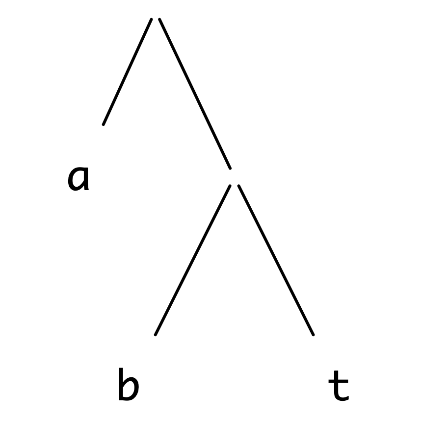<span class="img-wrapper"></span></label></figure>

We can see this as giving codes for the letters `a`, `b` and `t` by looking at the **routes** taken to reach the letters. For example, to get to `b`, we go *right* at the top node, and *left* at the next:

<figure><label class="checkbox-label"><input class="checkbox-img" type="checkbox">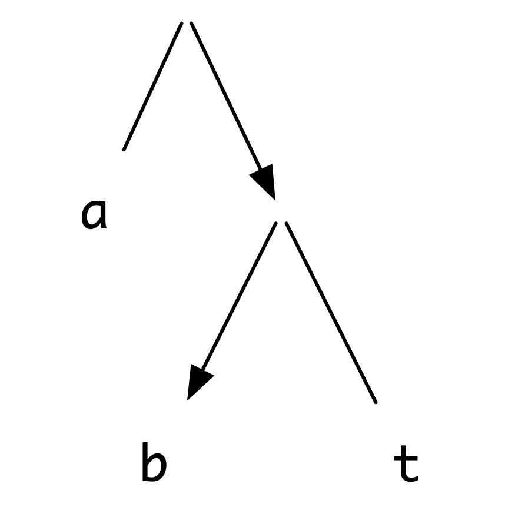<span class="img-wrapper"></span></label></figure>

which gives `b` the code `RL`. Similarly, `L` codes `a`, and `RR` the letter `t`.

The codes given by trees are **prefix codes**; in these codes no code for a letter is the start (or prefix) of the code for another. This is because no route to a leaf of the tree can be the start of the route to another leaf. For more information about Huffman codes and a wealth of general material on algorithms, see .

A message is also **decoded** using the tree. Consider the message `RLLRRRRLRR`. To decode we follow the route through the tree given, moving right then left, to give the letter `b`,

<figure><label class="checkbox-label"><input class="checkbox-img" type="checkbox">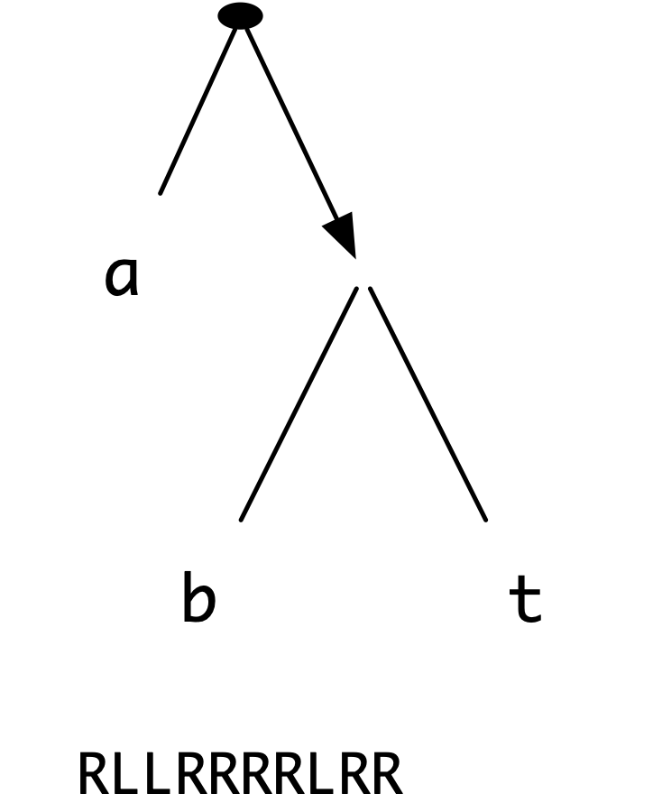<span class="img-wrapper"></span></label></figure> <figure><label class="checkbox-label"><input class="checkbox-img" type="checkbox">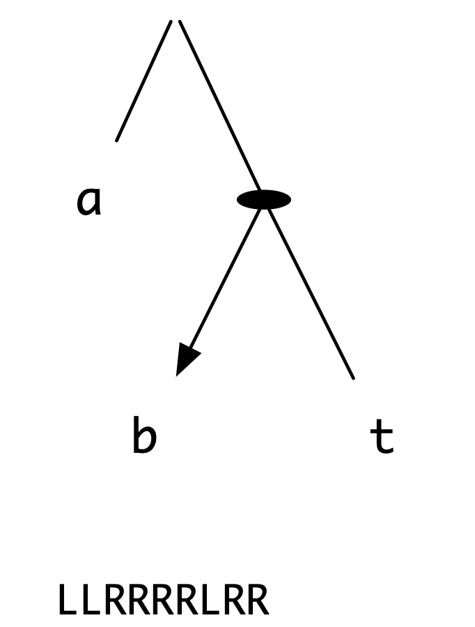<span class="img-wrapper"></span></label></figure> <figure><label class="checkbox-label"><input class="checkbox-img" type="checkbox">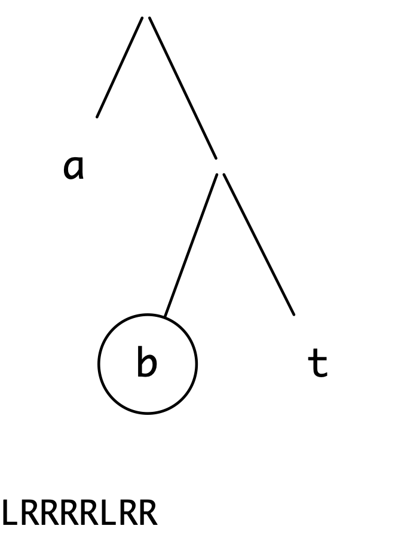<span class="img-wrapper"></span></label></figure>

where we have shown under each tree the sequence of bits remaining to be decoded. Continuing again from the top, we have the codes for `a` then `t`,

<figure><label class="checkbox-label"><input class="checkbox-img" type="checkbox">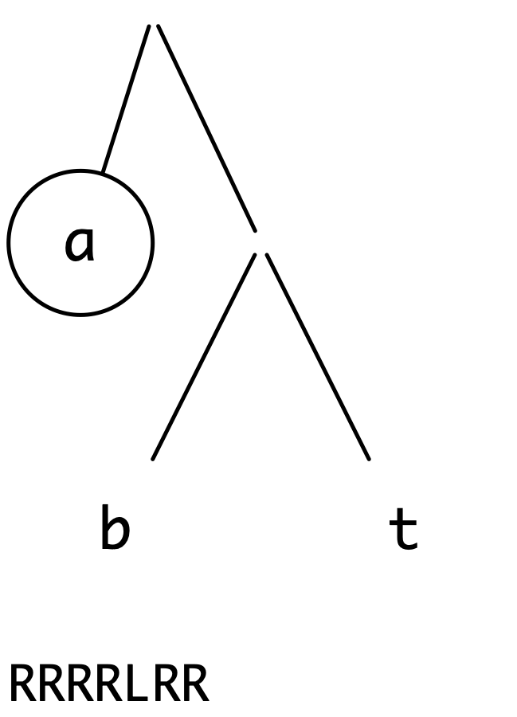<span class="img-wrapper"></span></label></figure> <figure><label class="checkbox-label"><input class="checkbox-img" type="checkbox">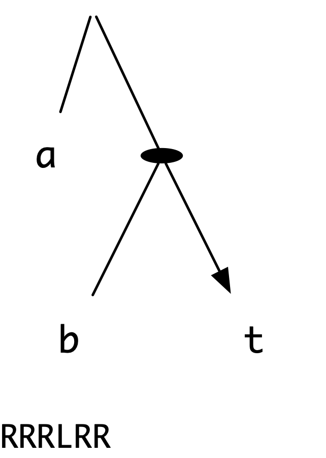<span class="img-wrapper"></span></label></figure> <figure><label class="checkbox-label"><input class="checkbox-img" type="checkbox">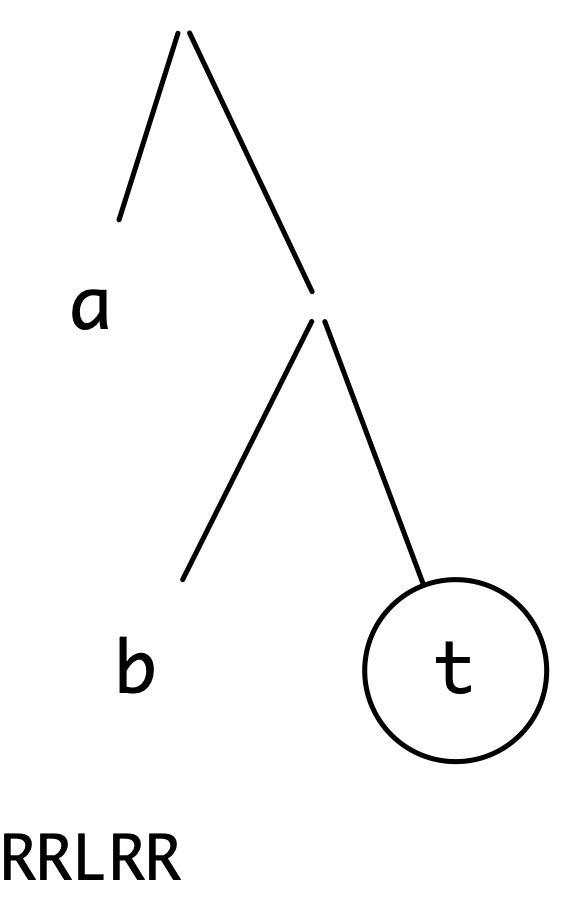<span class="img-wrapper"></span></label></figure>

so the decoded message begins with the letters `bat`.

In full, the message is `battat`, and the coded message is ten bits long. The codes for individual characters are of different lengths; `a` is coded in one bit, and the other characters in two. Is this a wise choice of code in view of a message in which the letter `t` predominates? Using the tree

<figure><label class="checkbox-label"><input class="checkbox-img" type="checkbox">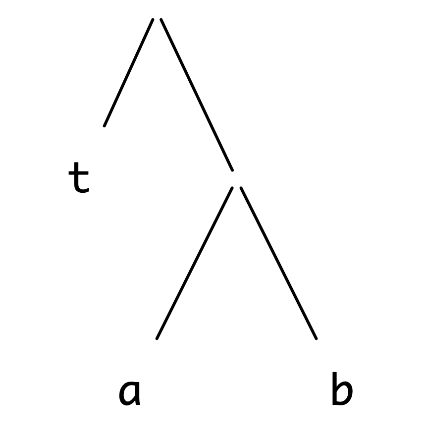<span class="img-wrapper"></span></label></figure>

the coded message becomes `RRRLLLRLL`, a nine-bit coding. A Huffman code is built so that the most frequent letters have the shortest sequences of code bits, and the less frequent have more 'expensive' code sequences, justified by the rarity of their occurrence; Morse code is an example of a Huffman code in common use.

The remainder of the chapter explores the implementation of Huffman coding, illustrating the module system of Haskell.

**Exercises**

1.  What is the coding of the message `battat` using the following tree?

    <figure><label class="checkbox-label"><input class="checkbox-img" type="checkbox">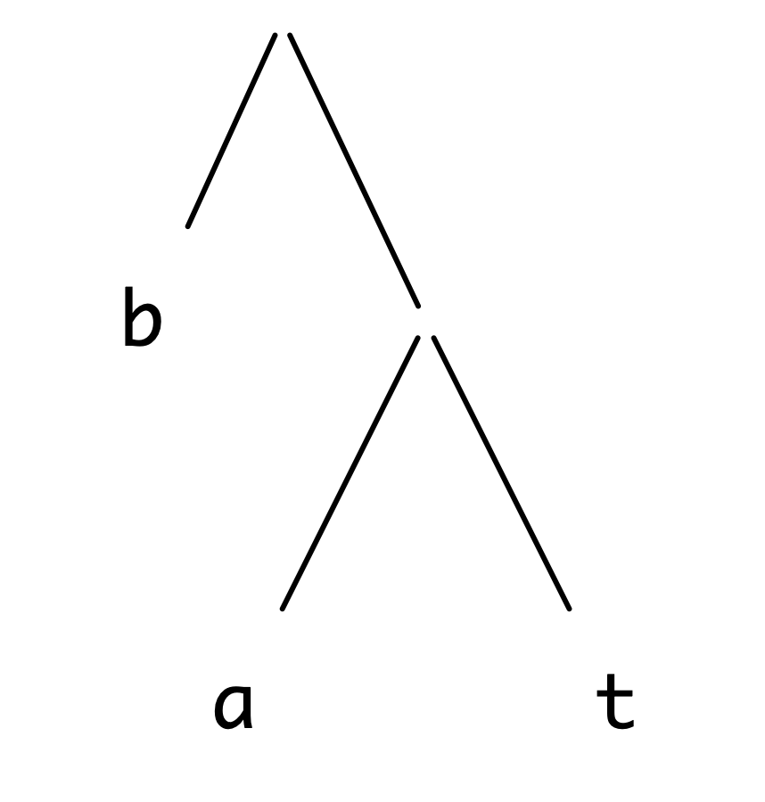<span class="img-wrapper"></span></label></figure>

    Compare the length of the coding with the others given earlier.

2.  Using the first coding tree, decode the coded message `RLLRLRLLRR`. Which tree would you expect to give the best coding of the message? Check your answer by trying the three possibilities.

Implementation -- I
-------------------

We now begin to implement the Huffman coding and decoding, in a series of Haskell modules. The overall structure of the system we develop is illustrated at the end of the chapter in Figure [The modules of the Huffman coding system.](#overallMod).

As earlier, we first develop the types used in the system.

### The types -- `Types.hs` {#the-types-types.hs .unnumbered}

The codes are sequences of bits, so we define

```haskell
data Bit   =  L | R deriving (Eq,Show)BitHCode
type HCode = [Bit]
```

and in the translation we will convert the Huffman tree to a table for ease of coding.

```haskell
type Table = [ (Char,HCode) ]Table
```

The Huffman trees themselves carry characters at the leaves. We shall see presently that during their formation we also use information about the frequency with which each character appears; hence the inclusion of integers both at the leaves and at the internal nodes.

```haskell
data Tree = Leaf Char Int |Tree
            Node Int Tree Tree
```

The file containing the module is illustrated in Figure [The file Types.hs.](#typeMod).

```haskell
--         Types.hs                         
--  
--         The types used in the Huffman coding example.            

-- The interface to the module Types is written out     
-- explicitly here, after the module name.                      

module Types ( Tree(Leaf,Node), 
               Bit(L,R),  
               HCode , 
               Table  ) where

-- Trees to represent the relative frequencies of characters    
-- and therefore the Huffman codes.                     

data Tree = Leaf Char Int | Node Int Tree Tree

-- The types of bits, Huffman codes and tables of Huffman codes.    

data Bit = L | R deriving (Eq,Show)

type HCode = [Bit]

type Table = [ (Char,HCode) ]
```

<figcaption>The file `Types.hs`.</figcaption>

<a id="typeMod"></a>
The name of the file, with an indication of its purpose, is listed at the start of the file; each of the definitions is preceded by a comment as to its purpose.

Note that we have given a full description of what is exported by the module, by listing the items after the module name. For the `data` types which are exported, `Tree` and `Bit`, the constructors are exported explicitly; this could also be done by following their names with `(..)`. This interface information could have been omitted, but we include it here as useful documentation of the interface to the module.

### Coding and decoding -- `Coding.hs` {#coding-and-decoding-coding.hs .unnumbered}

This module uses the types in `Types.hs`, and so imports them like this

```haskell
import Types ( Tree(Leaf,Node), Bit(L,R), HCode, Table )
```

We have chosen to list the names imported here; the statement `import Types` would have the same effect, but would lose the extra documentation.

The purpose of the module is to define functions to code and decode messages: we export only these, and not the auxiliary function(s) which may be used in their definition. Our module therefore has the header

```haskell
module Coding ( codeMessage , decodeMessage ) 
```

To code a message according to a table of codes, we look up each character in the table, and concatenate the results.

```haskell
codeMessage :: Table -> [Char] -> HCodecodeMessage

codeMessage tbl = concat . map (lookupTable tbl)
```

It is interesting to see that the function level definition here gives an exact implementation of the description which precedes it; using partial application and function composition has made the definition clearer.

We now define `lookupTable`, which is a standard function to look up the value corresponding to a 'key' in a table.

```haskell
lookupTable :: Table -> Char -> HCodelookupTable

lookupTable [] c = error "lookupTable"
lookupTable ((ch,n):tb) c
  | ch==c       = n
  | otherwise   = lookupTable tb c 
```

Because it is not included in the list of identifiers in the `module` statement above, this definition is not exported.

To decode a message, which is a sequence of bits, that is an element of `HCode`, we use a `Tree`.

```haskell
decodeMessage :: Tree -> HCode -> [Char]decodeMessage
```

We saw in [Coding and decoding](#codeIntro) that decoding according to the tree `tr` has two main cases.

-   If we are at an internal `Node`, we choose the sub-tree dictated by the first bit of the code.

-   If at a leaf, we read off the character found, and then begin to decode the remainder of the code at the top of the tree `tr`.

When the code is exhausted, so is the decoded message.

```haskell
decodeMessage tr
  = decodeByt tr
    where
    decodeByt (Node n t1 t2) (L:rest)
      = decodeByt t1 rest
    decodeByt (Node n t1 t2) (R:rest)
      = decodeByt t2 rest
    decodeByt (Leaf c n) rest
      = c : decodeByt tr rest
    decodeByt t [] = []
```

The locally defined function is called `decodeByt` because it decodes 'by `t`'.

The first coding tree and example message of [Coding and decoding](#codeIntro) can be given by

```haskell
exam1 = Node 0 (Leaf 'a' 0)
               (Node 0 (Leaf 'b' 0) (Leaf 't' 0))
mess1 = [R,L,L,R,R,R,R,L,R,R]
```

and decoding of this message begins thus

```haskell
decodeMessage exam1 mess1
~> decodeByt exam1 mess1
~> decodeByt exam1 [R,L,L,R,R,R,R,L,R,R]
~> decodeByt (Node 0 (Leaf 'b' 0) (Leaf 't' 0)) 
                                 [L,L,R,R,R,R,L,R,R]
~> decodeByt (Leaf 'b' 0) [L,R,R,R,R,L,R,R]
~> 'b' : decodeByt exam1 [L,R,R,R,R,L,R,R] 
~> 'b' : decodeByt (Leaf 'a' 0) [R,R,R,R,L,R,R]
~> 'b' : 'a' : decodeByt exam1 [R,R,R,R,L,R,R] 
```

Before looking at the implementation any further, we look at how to construct the Huffman coding tree, given a text.

**Exercises**

1.  Complete the calculation of `decodeMessage exam1 mess1` begun above.

2.  With the table

    ```haskell
    table1 = [ ('a',[L]) , ('b',[R,L]) , ('t',[R,R]) ]
    ```

    give a calculation of

    ```haskell
    codeMessage table1 "battab"
    ```

Building Huffman trees
----------------------

Given a text, such as `"battat"`, how do we find the tree giving the optimal code for the text? We explain it in a number of stages following Section 17.3 of .

-   We first find the frequencies of the individual letters, in this case giving

    ```haskell
    [('b',1),('a',2),('t',3)]
    ```

-   The main idea of the translation is to build the tree by taking the two characters occurring least frequently, and making a *single* character (or *tree*) of them. This process is repeated until a single tree results; the steps which follow give this process in more detail.

-   Each of `(’b’,1)`, ... is turned into a tree, giving the list of trees

    ```haskell
    [ Leaf 'b' 1 , Leaf 'a' 2 , Leaf 't' 3 ]
    ```

    which is sorted into frequency order.

-   We then begin to *amalgamate together* trees: we take the two trees of lowest frequency, put them together, and insert the result in the appropriate place to preserve the frequency order.

    ```haskell
    [ Node 3 (Leaf 'b' 1) (Leaf 'a' 2) , Leaf 't' 3 ]
    ```

-   This process is repeated, until a single tree results

    ```haskell
    Node 6 (Node 3 (Leaf 'b' 1) (Leaf 'a' 2)) (Leaf 't' 3)
    ```

    which is pictured like this

    <figure><label class="checkbox-label"><input class="checkbox-img" type="checkbox">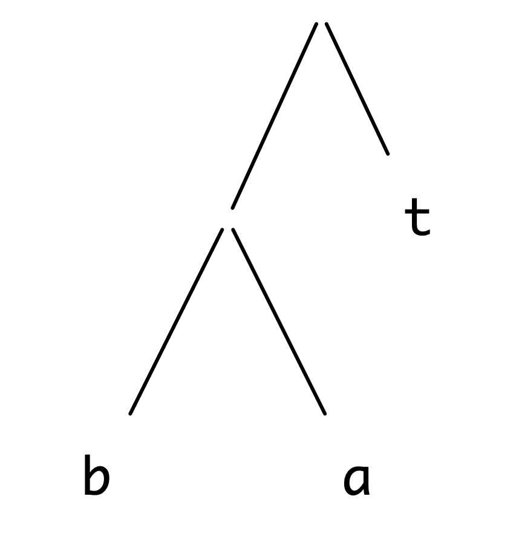<span class="img-wrapper"></span></label></figure>

-   This tree can then be turned into a `Table`

    ```haskell
    [ ('b',[L,L]) , ('a',[L,R]) , ('t',[R]) ]
    ```

We now look at how the system is implemented in Haskell.

Design
------

Implementing the system will involve us in designing various modules to perform the stages given above. We start by deciding what the modules will be and the functions that they will implement. This is the equivalent at the larger scale of **divide and conquer**; we separate the problem into manageable portions, which can be solved separately, and which are put together using the `import` and `module` statements. We design these **interfaces** before implementing the functions.

The three stages of conversion are summarized in Figure [Module directives for Huffman tree formation.](#codeDesign), which shows the module directives of the three component files. We have added as comments the types of objects to be exported, so that these directives contain enough information for the exported functions in the files to be used without knowing *how* they are defined.

```haskell
Frequency.hs:

module Frequency ( frequency )  -- [Char] -> [(Char,Int)]


MakeTree.hs:

module MakeTree ( makeTree )    -- [(Char,Int)] -> Tree
import Types


CodeTable.hs:

module CodeTable ( codeTable )  -- Tree -> Table
import Types 
```

<figcaption>Module directives for Huffman tree formation.</figcaption>

<a id="codeDesign"></a>
In fact the component functions `frequency` and `makeTree` will never be used separately, and so we compose them in the module `MakeCode.hs` when bringing the three files together. This is given in Figure [The module MakeCode.hs.](#makeCode).

```haskell
--                              
--         MakeCode.hs                          
--                              
--         Huffman coding in Haskell.                   
--                              

module MakeCode ( codes, codeTable ) where

import Types
import Frequency ( frequency )
import MakeTree  ( makeTree )
import CodeTable ( codeTable )

-- Putting together frequency calculation and tree conversion   

codes :: [Char] -> Tree

codes = makeTree . frequency
```

<figcaption>The module `MakeCode.hs`.</figcaption>

<a id="makeCode"></a>
Our next task is to implement each module in full and we turn to that now.

Implementation -- II
--------------------

In this section we discuss in turn the three implementation modules.

### Counting characters --- `Frequency.hs` {#counting-characters-frequency.hs .unnumbered}

The aim of the function `frequency` is to take a text such as `"battat"` to a list of characters, in increasing frequency of occurrence, `[(’b’,1),(’a’,2),(’t’,3)]`. We do this in three stages:

-   First we pair each character with the count of `1`, giving

    ```haskell
    [('b',1),('a',1),('t',1),('t',1),('a',1),('t',1)]
    ```

-   Next, we sort the list on the characters, bringing together the counts of equal characters.

    ```haskell
    [('a',2),('b',1),('t',3)]
    ```

-   Finally, we sort the list into increasing frequency order, to give the list above.

The function uses two different sorts -- one on character, one on frequency -- to achieve its result. Is there any way we can define a single sorting function to perform both sorts?

We can give a general merge sort

function, which works by **merging**, in order, the results of sorting the front and rear halves of the list.

```haskell
mergeSort :: ([a]->[a]->[a]) -> [a] -> [a]mergeSort

mergeSort merge xs
  | length xs < 2   = xs                    
  | otherwise       
      = merge (mergeSort merge first)
              (mergeSort merge second)  
        where
        first  = take half xs
        second = drop half xs
        half   = (length xs) `div` 2
```

The first argument to `mergeSort` is the merging function, which takes two sorted lists and merges their contents in order. It is by making this operation a *parameter* that the `mergeSort` function becomes reusable.

In sorting the characters, we amalgamate entries for the same character

```haskell
alphaMerge
alphaMerge :: [(Char,Int)] -> [(Char,Int)] -> [(Char,Int)]  

alphaMerge xs [] = xs
alphaMerge [] ys = ys
alphaMerge ((p,n):xs) ((q,m):ys)
  | (p==q)      = (p,n+m) : alphaMerge xs ys        
  | (p<q)       = (p,n) : alphaMerge xs ((q,m):ys)  
  | otherwise   = (q,m) : alphaMerge ((p,n):xs) ys  
```

while when sorting on frequency we compare frequencies; when two pairs have the same frequency, we order according to the character ordering.

```haskell
freqMerge
freqMerge :: [(Char,Int)] -> [(Char,Int)] -> [(Char,Int)]   

freqMerge xs [] = xs
freqMerge [] ys = ys
freqMerge ((p,n):xs) ((q,m):ys)
  | (n<m || (n==m && p<q)) 
    = (p,n) : freqMerge xs ((q,m):ys)   
  | otherwise 
    = (q,m) : freqMerge ((p,n):xs) ys   
```

We can now give the top-level definition of `frequency`

```haskell
frequency :: [Char] -> [ (Char,Int) ]frequency

frequency
  = mergeSort freqMerge . mergeSort alphaMerge . map start
    where
    start ch = (ch,1)
```

which we can see is a direct combination of the three stages listed in the informal description of the algorithm.

Note that of all the functions defined in this module, only `frequency` is exported.

### Making the Huffman tree -- `MakeTree.hs` {#making-the-huffman-tree-maketree.hs .unnumbered}

We have two stages in making a Huffman tree from a list of characters with their frequencies.

```haskell
makeTree :: [ (Char,Int) ] -> TreemakeTree
makeTree  = makeCodes . toTreeList
```

where

```haskell
toTreeListmakeCodes
toTreeList :: [ (Char,Int) ] -> [Tree]
makeCodes  :: [Tree] -> Tree
```

The function `toTreeList` converts each character-number pair into a tree, thus

```haskell
toTreeList = map (uncurry Leaf)
```

where note that we use the prelude function `uncurry` to make an uncurried version of the constructor function `Leaf`.

The function `makeCodes` amalgamates trees successively into a single tree

```haskell
makeCodes [t] = t
makeCodes ts  = makeCodes (amalgamate ts)
```

How are trees amalgamated? We have to pair together the first two trees in the list (since the list is kept in ascending order of frequency) and then insert the result in the list preserving the frequency order. Working top-down, we have

```haskell
amalgamate :: [ Tree ] -> [ Tree ]

amalgamate (t1:t2:ts) = insTree (pair t1 t2) ts
```

When we pair two trees, we need to combine their frequency counts, so

```haskell
pair :: Tree -> Tree -> Tree

pair t1 t2 = Node (v1+v2) t1 t2
             where
             v1 = value t1
             v2 = value t2
```

where the value of a tree is given by

```haskell
value :: Tree -> Int

value (Leaf _ n)   = n
value (Node n _ _) = n
```

The definition of `insTree`, which is similar to that used in an insertion sort, is left as an exercise. Again, the definition of the exported function uses various others whose definitions are not visible to the 'outside world'.

### The code table -- `CodeTable.hs` {#the-code-table-codetable.hs .unnumbered}

Here we give the function `codeTable` which takes a Huffman tree into a code table. In converting the tree `Node n t1 t2` we have to convert `t1`, adding `L` at the front of the code, and `t2` with `R` at the head. We therefore write the more general conversion function

```haskell
convert :: HCode -> Tree -> Tableconvert
```

whose first argument is the 'path so far' into the tree. The definition is

```haskell
convert cd (Leaf c n) 
      =  [(c,cd)]
convert cd (Node n t1 t2)
      = (convert (cd++[L]) t1) ++ (convert (cd++[R]) t2)
```

The `codeTable` function is given by starting the conversion with an empty code string

```haskell
codeTable
codeTable :: Tree -> Table
codeTable = convert []
```

Consider the calculation of

```haskell
codeTable (Node 6 (Node 3 (Leaf 'b' 1) (Leaf 'a' 2)) 
                  (Leaf 't' 3))
~> convert [] (Node 6 (Node 3 (Leaf 'b' 1) (Leaf 'a' 2)) 
                       (Leaf 't' 3))
~> convert [L] (Node 3 (Leaf 'b' 1) (Leaf 'a' 2)) ++
    convert [R] (Leaf 't' 3)
~> convert [L,L] (Leaf 'b' 1) ++ 
    convert [L,R] (Leaf 'a' 2) ++ 
    [ ('t',[R]) ]
~> [ ('b',[L,L]) , ('a',[L,R]) , ('t',[R]) ]
```

```haskell
-- The main module of the Huffman example

module Main (main, codeMessage, decodeMessage, codes, codeTable ) where

import Types    ( Tree(Leaf,Node), Bit(L,R), HCode , Table )
import Coding   ( codeMessage, decodeMessage ) 
import MakeCode ( codes, codeTable )

-- Main expression: print the coded and decoded 
-- example text "there is a green hill".
main = print decoded

-- The example message to be coded.
message :: String
message = "there are green hills here"

-- The Huffman tree generated from the example.
treeEx :: Tree
treeEx = codes "there is a green hill"

-- The coding table generated from the example.                 
tableEx :: Table
tableEx = codeTable (codes "there is a green hill")

-- The example in code.
coded :: HCode
coded = codeMessage tableEx message

-- The example coded and then decoded.
decoded :: String
decoded = decodeMessage treeEx coded
```

<figcaption>The `Main` module of the Huffman coding system.</figcaption>

<a id="mainMod"></a>
<figure><label class="checkbox-label"><input class="checkbox-img" type="checkbox">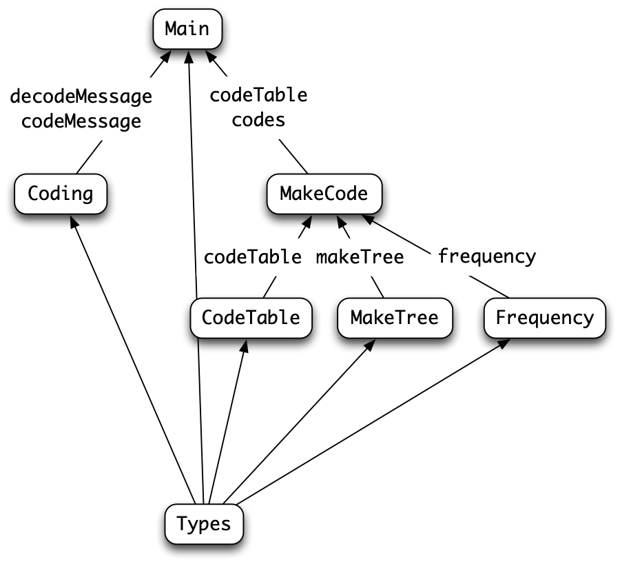<span class="img-wrapper"></span></label><figcaption>The modules of the Huffman coding system.</figcaption></figure>

<a id="overallMod"></a>
### The top-level file -- `Main.hs` {#the-top-level-file-main.hs .unnumbered}

We can now pull all the parts of the system together into a top-level file.

```haskell
module Main (main) where

import Types    ( Tree(Leaf,Node), Bit(L,R), HCode , Table )
import Coding   ( codeMessage , decodeMessage )
import MakeCode ( codes, codeTable )
```

In this file we can include representative examples, using the major functions listed in the `import` statements; the code is illustrated in Figure [The Main module of the Huffman coding system.](#mainMod).

The structure of the system is given in Figure [The modules of the Huffman coding system.](#overallMod). Modules are represented by boxes, and an arrow from `A` to `B` indicates that `A.hs` is imported into `B.hs`. An arrow is marked to indicate the functions exported by the included module, so that, for example, `codes` and `codeTable` are exported from `MakeCode.hs` to `Main.hs`.

If this coding system were to be used as a component of a larger system, a `module` directive could be used to control which of the four functions and the types are exported, after the module had been renamed. It is important to realize that the types will need to be exported (or be included in the file including `Main.hs`) if the functions are to be used.

### Testing the system {#testing-the-system .unnumbered}

We can write a top-level test for a system like this, by taking an example string, coding it and then decoding it. This should take us back to the string we started with, and indeed we can see this in the particular example in Figure [The Main module of the Huffman coding system.](#mainMod). It is possible to change this to a QuickCheck property, which checks that coding/decoding is the identity for a whole collection of strings; we leave this as an exercise for the reader.

The top-level test corresponds to a *system* test, in that it uses all the functions defined -- implicitly or explicitly -- and checks the overall functionality of the system. It is also possible to write *unit* tests, which check that a particular function or module has the required functionality.

For example, we might look at the module `Frequency.hs`, and in particular at the functions designed to merge or sort their arguments. A QuickCheck property embodying a unit test for these would include

```haskell
prop_mergeSort
prop_mergeSort :: [Int] -> Bool

prop_mergeSort xs =
    sorted (mergeSort merge xs) 
```

where `sorted` expresses that its argument is sorted into ascending order and `merge` will merge two ordered lists in order.

**Exercises**

1.  Give a definition of merge sort which uses the built-in ordering '`<=`'. What is its type?

2.  Modifying your previous answer if necessary, give a version of merge sort which removes duplicate entries.

3.  Give a version of merge sort which takes an ordering function as a parameter:

    ```haskell
    ordering :: a -> a -> Ordering
    ```

    Explain how to implement `mergeSort freqMerge` using this version of merge sort, and discuss why you *cannot* implement `mergeSort alphaMerge` this way.

4.  Define the `insTree` function, used in the definition of `makeTree`.

5.  Give a calculation of

    ```haskell
    makeTree  [('b',2),('a',2),('t',3),('e',4)]
    ```

6.  Define functions

    ```haskell
    showTree  :: Tree  -> String
    showTable :: Table -> String
    ```

    which give printable versions of Huffman trees and code tables. One general way of printing trees is to use indentation to indicate the structure. Schematically, this looks like

    ```haskell
        left sub tree,  indented by 4 characters
    value(s) at Node
        right sub tree, indented by 4 characters
    ```

7.  Define a QuickCheck property to test coding and decoding: specifically this should code a string and decode it, and compare the result with the original. You may need to restrict the strings over which the test is made.

8.  Define `sorted` so that it checks whether its argument is sorted into ascending order and define `merge` which will merge two ordered lists in order. Using these check whether the property `prop_mergeSort :: [Int] -> Bool`, defined earlier, holds.

9.  Write QuickCheck unit tests for other functions in `Frequency.hs` and other modules of the Hufmann coding system.

10. You may find that it is necessary to restrict the domain over which some properties hold in order for them to QuickCheck successfully: can you re-define the functions involved so that the properties hold for *all* randomly generated inputs.

11. The correctness property for the Huffman system formulated earlier states that `decode.code` is the identity. Would you expect that `code.decode` is the identity: if so, over what domain; if not, can you give a sub-domain over which you wold expect it to hold?

Summary {#summary .unnumbered}
-------

When writing a program of any size, we need to divide up the work in a sensible way. The Haskell module system allows one script to be included in another. At the boundary, it is possible to control exactly which definitions are exported from one module and imported into another.

We gave a number of guidelines for the design of a program into its constituent modules. The most important advice is to make each module perform one clearly defined task, and for only as much information as is needed to be exported -- the principle of **information hiding**. This principle is extended in the next chapter when we examine abstract data types.

The design principles were put into practice in the Huffman coding example. In particular, it was shown for the file `MakeCode.hs` and its three sub-modules that design can begin with the design of modules and their **interfaces** -- that is the definitions (and their types) which are exported. Thus the design process starts *before* any implementation takes place.
