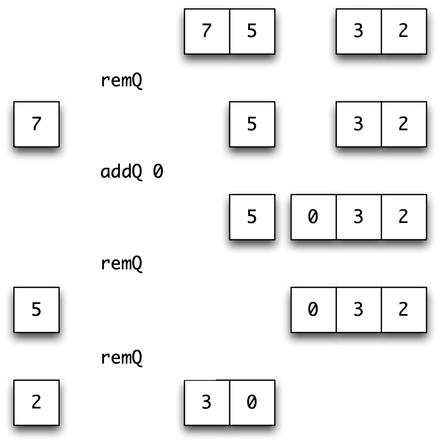
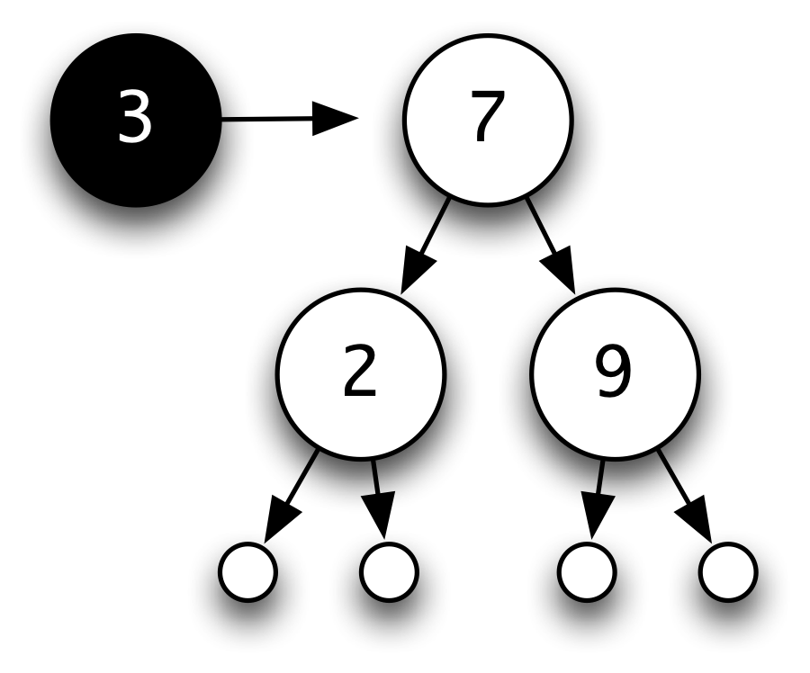
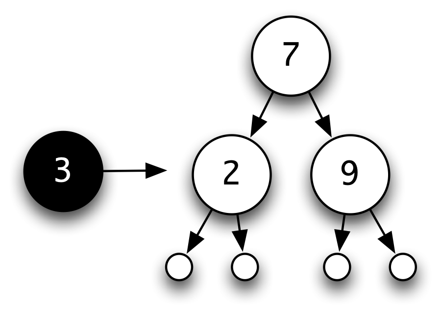
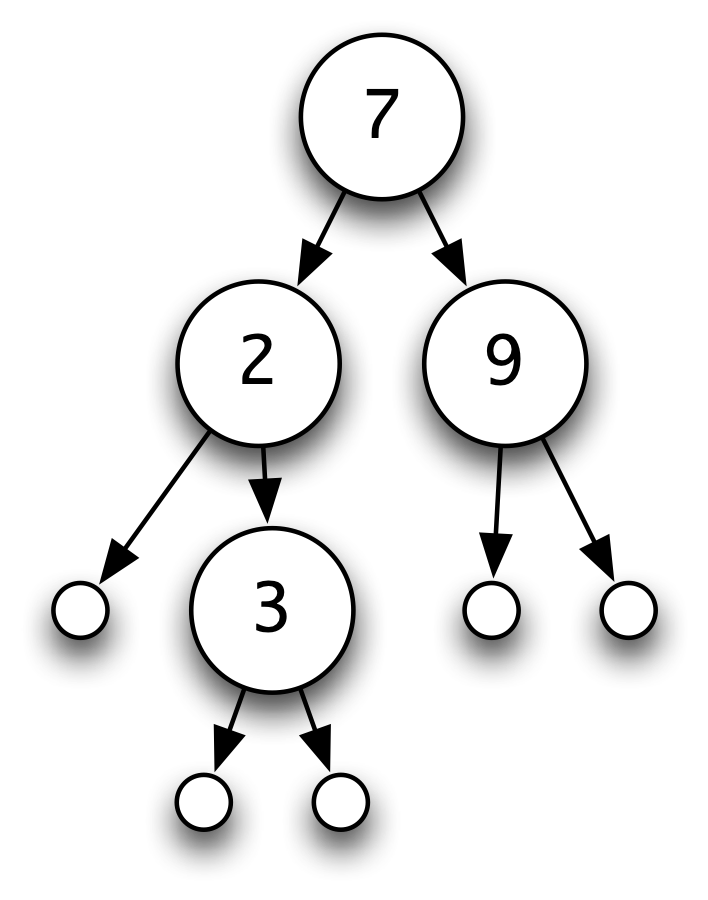
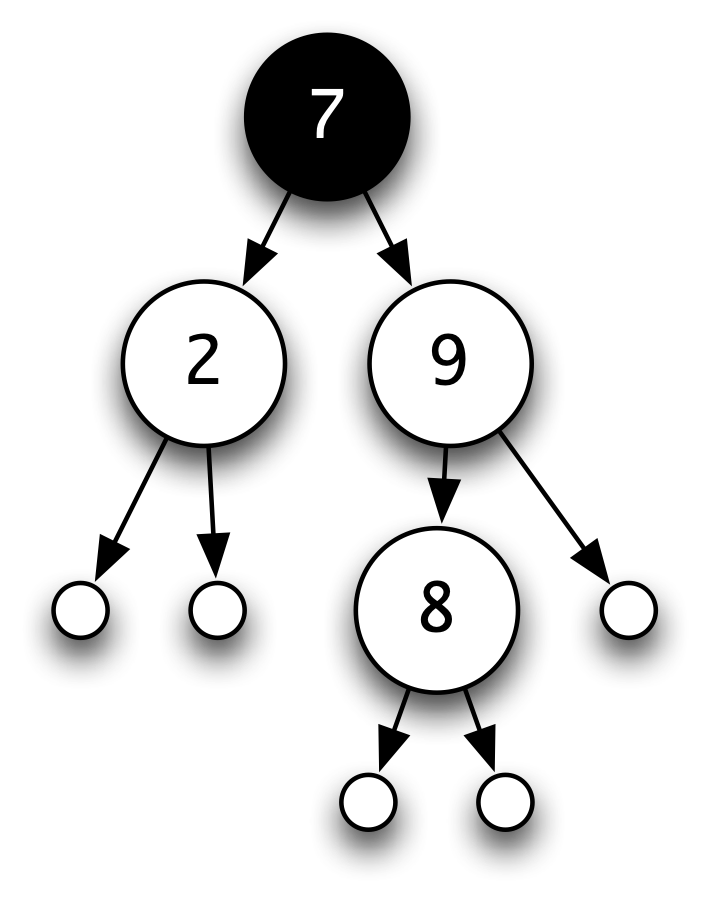
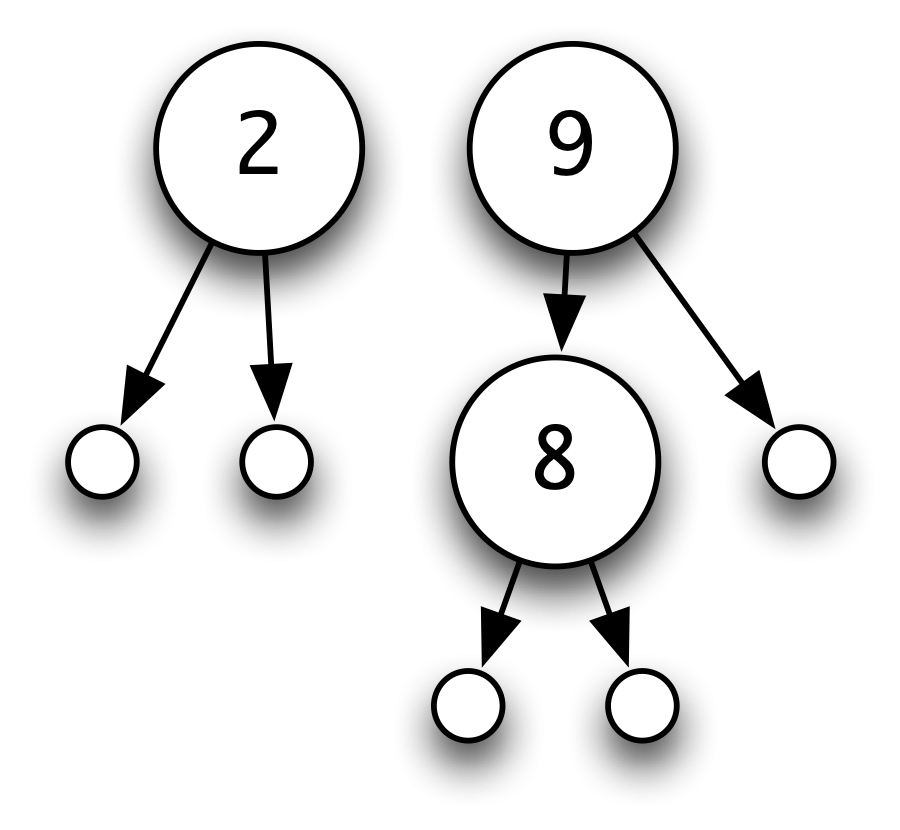
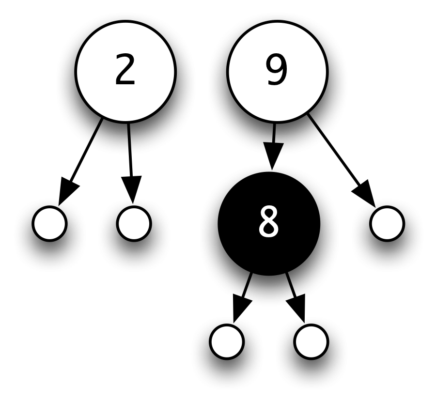
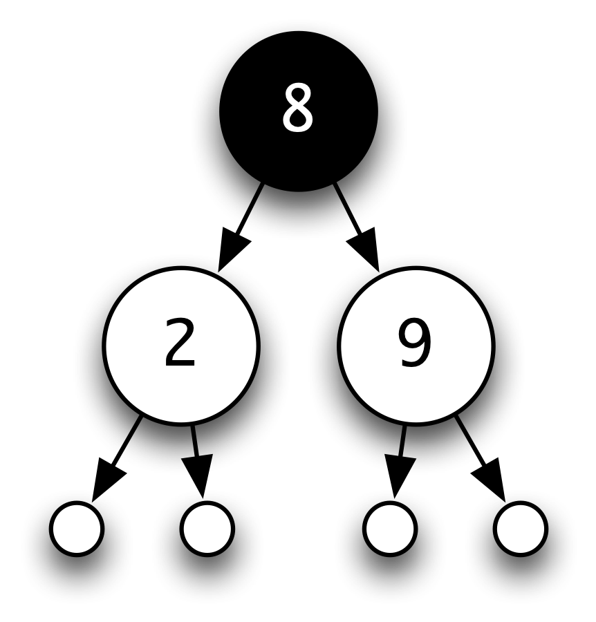
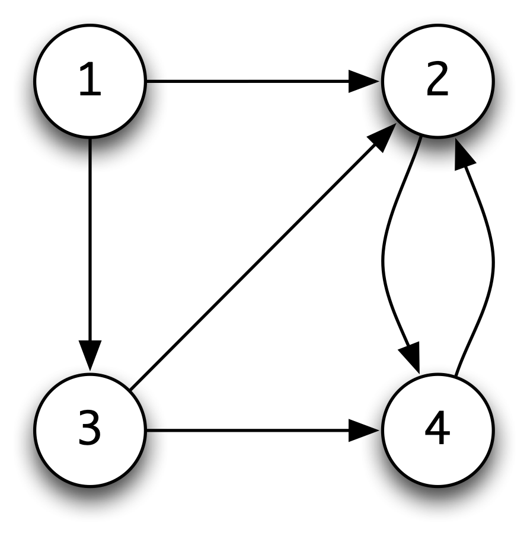

Abstract data types {#adt}
===================

The Haskell module system allows definitions of functions and other objects to be hidden when one module is imported into another. Those definitions hidden are only of use in defining the exported functions, and hiding them makes clearer the exact interface between the two modules: only those features of the module which are needed will be visible.

This chapter shows that information hiding is equally applicable for types, giving what are known as **abstract data types**, or **ADT**s. We explain the abstract data type mechanism here, as well as providing a number of examples of ADTs, including queues, sets, relations and the fundamental types belonging to a simulation case study.

Type representations
--------------------

We begin our discussion with a scenario which is intended to show both the purpose and the operation of the abstract data type mechanism.

Suppose we are to build a calculator for numerical expressions, like those given by the `Expr` type of [Recursive algebraic types](14.md#recTypes), but with variables included. The calculator is to provide the facility to set the values of variables, as well as for variables to form parts of expressions.

As a part of our system, we need to be able to model the current values of the variables, which we might call the **store** of the calculator. How can this be done? A number of models present themselves, including:

-   a list of integer/variable pairs: `[(Integer,Var)]`; and

-   a function from variables to integers: `(Var -> Integer)`.

Both models allow us to look up and update the values of variables, as well as set a starting value for the store. These operations have types as follows.

```haskell
initial :: Store
value   :: Store -> Var -> Integer    -- (StoreSig)
update  :: Store -> Var -> Integer -> Store
```

but each model allows more than that: we can, for instance, reverse a list, or compose a function with others. In using the type `Store` we intend only to use the three operations given, but it is always possible to use the model in unintended ways.

How can we give a better model of a store? The answer is to define a type which **only** has the operations `initial`, `value` and `update`, so that we cannot abuse the representation. We therefore hide the information about how the type is actually implemented, and only allow the operations `(StoreSig)` to manipulate objects of the type.

When we provide a limited interface to a type by means of a specified set of operations we call the type an **abstract data type** (or ADT).

Since the 'concrete' type itself is no longer accessible and we may only access the type by means of the operations provided, these operations give a more 'abstract' view of the type.

<figure><label class="checkbox-label"><input class="checkbox-img" type="checkbox"><span class="img-wrapper"></span></label><figcaption>The <code>Store</code> abstract data type.</figcaption></figure>

<a id="storePic"></a>
[The Store abstract data type.](#storePic) illustrates the situation, and suggests that as well as giving a natural representation of the type of stores, there are two other benefits of type abstraction.

-   The type declarations in `(StoreSig)` form a clearly defined **interface**,

    which is called the **signature** of the ADT, between the user of the type and its implementer. The only information that they have to agree on is the signature; once this is agreed, they can work independently. This is therefore another way of breaking a complex problem into simpler parts; another aspect of the 'divide and conquer' method.

-   We can **modify** the implementation of the `Store` without having any effect on the user. Contrast this with the situation where the implementation is visible to the user. In particular, if the implementation is an algebraic type then any change in the implementation will mean that all definitions that use pattern matching will have to be changed. These will include not just those in the signature, but also any user-defined functions which use pattern matching.

We shall see both aspects illustrated in the sections to come; first we look at the details of the Haskell abstract data type mechanism.

The Haskell abstract data type mechanism
----------------------------------------

When we introduced the Haskell module system in [Case study: Huffman codes](15.md#codes) we saw that there were two ways in which we could export a `data` type, called `Data` say. If we include `Data(..)` in the export list of the module, the type is exported with its constructors; if we include `Data` then the constructors are *not* exported, and so we can only operate over the type using the other operations of the signature.

In the case of the `Store` type, our module header would be

```haskell
module Store ( Store, initial, value, update ) where
```

which shows that we can access the type only through the three functions mentioned. In this book we will adopt the convention that we will also include as comments in the module header the types of the exported functions, giving in the case of `Store` the following header.

```haskell
module Store 
   ( Store, 
     initial,     -- Store
     value,       -- Store -> Var -> Integer
     update       -- Store -> Var -> Integer -> Store
    ) where
```

Now, the module must contain a definition of the `Store` type and the functions over it.

If the implementation type was a `data` type, then this would complete the realization of the abstract data type. However, in our running example of stores, we suggested earlier that we would use a list of pairs, `[ (Integer,Var) ]`, to model the type, and so we will have to define a new `data` type, called `Store`

```haskell
data Store = Store [ (Integer,Var) ] 
```

which has a single constructor which we also call `Store`. This is the function which converts a list into an element of the `Store` type; we can think of it as 'wrapping up' a list to make it into a `Store`.

We now have to define the functions `initial`, `value` and `update` over the `Store` type. One approach is to define the analogous functions over `[(Integer,Var)]` and then to adapt those. We can say

```haskell
init :: [(Integer,Var)]
init = []
     
val :: [(Integer,Var)] -> Var -> Integer
val [] v        = 0
val ((n,w):sto) v 
  | v==w        = n
  | otherwise   = val sto v

upd :: [(Integer,Var)] -> Var -> Integer -> [(Integer,Var)]
upd sto v n   = (n,v):sto
```

The initial store, `init`, is represented by an empty list; the value of `v` is looked up by finding the first pair `(n,v)` in the list, and the store is updated by adding a new `(Integer,Var)` at the front of the list.

These functions then have to be converted to work over the type `Store`, so that arguments and results are of the form `Store xs` with `xs::[(Integer,Var)]`. The definitions become

```haskell
initial :: Store 
initial = Store []

value  :: Store -> Var -> Integer
value (Store []) v  = 0
value (Store ((n,w):sto)) v 
  | v==w            = n
  | otherwise       = value (Store sto) v

update  :: Store -> Var -> Integer -> Store
update (Store sto) v n = Store ((n,v):sto)
```

where we can see that the pattern of the definitions is similar, except that we have to 'unwrap' arguments of the form `(Store sto)` on the left-hand side, and 'wrap up' results using `Store` on the right-hand side. We look at a general mechanism for 'wrapping up' functions in the example of the `Set` ADT in [Sets](#caseSets).

What happens if we try to break the abstraction barrier and deal with a `Store` as having the form `(Store xs)`? On typing

```haskell
initial == Store []
```

in a module importing `Store` we get the type error message

```haskell
Not in scope: data constructor `Store'
```

The fact that `initial` is indeed implemented as `Store []` is irrelevant, since the implementation is not in scope outside the `Store` module.

### The `newtype` construction {#the-newtype-construction .unnumbered}

In fact in this case rather than using a `data` type we will define

```haskell
newtype Store = Store [ (Integer,Var) ]
```

which has the same effect as declaring a `data` type with one unary constructor but which is implemented in a more efficient fashion.

> **Naming `newtypes`**
>
> Another possible way of implementing the type would be to say
>
> ``` {.haskell}
> newtype Store = Sto [ (Integer,Var) ]
> ```
>
> using different names for the type and its constructor. Although this makes it clear whether we are talking about the type or the constructor, we prefer to use a single name within this `newtype`, as otherwise we need to choose two different -- but related -- names.
>
> Moreover, in practice, when we use `Store` we will always be able to tell which use -- type name or constructor -- is meant. Finally, this convention is in widespread use in the Haskell developer community, and so it's helpful to be aware of the fact.

### Type classes: showing values and equality {#type-classes-showing-values-and-equality .unnumbered}

We can declare types as belonging to particular type classes such as `Show` and `Eq`, and this applies equally well to abstract data types. In the case of `Store` we can say

```haskell
instance Eq Store where 
  (Store sto1) == (Store sto2) = (sto1 == sto2)                 

instance Show Store where
  showsPrec n (Store sto) = showsPrec n sto     
```

Note, however, that once declared, these instances **cannot be hidden**, so that even though they are not named in the export list, the functions over `Store` which are defined by means of these `instance` declarations will be available whenever the module `Store` is imported. Of course, we can choose *not* to declare these instances, and so not to provide an equality or a `show` function over `Stores`.

### Stores as functions {#stores-as-functions .unnumbered}

A different implementation of `Store` is given by the type of functions from variables to integers.

```haskell
newtype Store = Store (Var -> Integer)                  

initial :: Store 
initial = Store (\v -> 0)

value :: Store -> Var -> Integer
value (Store sto) v = sto v

update  :: Store -> Var -> Integer -> Store
update (Store sto) v n 
  = Store (\w -> if v==w then n else sto w)
```

Under this implementation,

-   the `initial` store maps every variable to `0`;

-   to look up a `value` of a variable `v` the store function `sto` is applied to `v`, and

-   in the case of an `update`, a function returned is identical to `sto` except on the variable whose value is changed.

### Testing ADTs {#testing-adts .unnumbered}

Suppose that we have implemented a store as a list of integer-variable pairs. We can inspect the result of updating a store, which will be a new list, and check that it has the properties that we would expect. For example, we might take the difference of the lists before and after the update.

If we implement queues as an ADT, we *can't* look directly at the underlying implementation; instead we have to write properties using the interface functions, here `initial`, `value` and `update`. We can start by saying what happens if we look up a value in the initial store:

```haskell
prop_Initial :: Char -> Bool

prop_Initial ch =
   value initial ch == 0
```

What can we say about the effect of an `update` on a store? First, if perform an update for the variable `ch` and then look up the value, we would expect to see the new value:

```haskell
prop_Update1 :: Char -> Integer -> Store -> Bool

prop_Update1 ch int st =
    value (update st ch int) ch == int
```

Finally, what if we look up the value of another variable after this update? Its value should be the same as it was before:

```haskell
prop_Update2 :: Char -> Char -> Integer -> Store -> Bool

prop_Update2 ch1 ch2 int st =
    value (update st ch2 int) ch1 == value st ch1
```

If we perform a QuickCheck on these properties -- the appropriate QuickCheck magic is given in the module `StoreTest` and the properties in `QCStoreTest` -- the first two pass every time, but the third one sometimes fails: that is when `ch1` and `ch2` are equal!

Modifying the test to take this into account, we get a test that always passes:

```haskell
prop_Update2 :: Char -> Char -> Integer -> Store -> Bool

prop_Update2 ch1 ch2 int st =
    value (update st ch2 int) ch1 == value st ch1 || ch1==ch2
```

Because the tests are written in terms of the interface only, if we were to change the implementation then the tests could still be applied, assuming that we have the right QuickCheck definitions in place.

**Exercises**

1.  Give an implementation of `Store` using lists whose entries are ordered according to the variable names. Discuss why this might be preferable to the original list implementation, and also its disadvantages, if any.

2.  For the implementation of `Store` as a list type `[(Integer,Var)]`, give a definition of equality which equates any two stores which give the same values to each variable. Can this operation be defined for the second implementation? If not, give a modification of the implementation which allows it to be defined.

3.  In this question you should use the type `Maybe a`. Suppose it is an error to look up the `value` of a variable which does not have a value in the given store. Explain how you would modify both the signature of `Store` and the two implementations.

4.  Rather than giving an error when looking up a variable which does not have a value in the particular store, extend the signature to provide a test of whether a variable has a value in a given store, and explain how would modify the two implementations to define the test.

5.  Suppose you are to implement a fourth operation over `Store`

    ```haskell
    setAll :: Integer -> Store
    ```

    so that `setAll n` is the store where every variable has the value `n`. Can you do this for both the example implementations? Show how if you can, and explain why, if not.

6.  Design an ADT for the library database, first examined in [Data types, tuples and lists](5.md#tupleList).

Queues
------

A queue is a 'first in, first out' structure. If first `Flo` and then `Eddie` joins an initially empty queue, the first person to leave will be `Flo`. As an abstract data type, we expect to be able to add items and remove items as well as there being an empty queue.

```haskell
module Queue 
  ( Queue , 
    emptyQ ,       --  Queue a
    isEmptyQ ,     --  Queue a -> Bool 
    addQ ,         --  a -> Queue a -> Queue a
    remQ           --  Queue a -> (  a , Queue a )
   ) where 
```

The function `remQ` returns a pair -- the item removed together with the part of the queue that remains -- if there are any items in the queue. If not, the standard function `error` is called.

A list can be used to model a queue: we add to the end of the list, and remove from the front, giving

```haskell
newtype Queue a = Queue [a]
 
emptyQ :: Queue a
emptyQ = Queue []

isEmptyQ :: Queue a -> Bool
isEmptyQ (Queue []) = True
isEmptyQ _          = False

addQ   :: a -> Queue a -> Queue a
addQ x (Queue xs) = Queue (xs++[x])

remQ   :: Queue a -> (  a , Queue a )
remQ q@(Queue xs)
  | not (isEmptyQ q)   = (head xs , Queue (tail xs))
  | otherwise          = error "remQ"
```

> **As (`@`) patterns**
>
> The definition of `remQ` uses an aspect of pattern matching which we have not seen so far. We use the pattern `q@(Queue xs)`, where we can read '`@`' as 'as', to match the input. The variable `q` matches the whole input, while it is also matched against `Queue xs`, so that `xs` gives us access to the list from which it is built. This means that we can refer directly to the whole input *and* to its components in the definition. Without this, the alternative would be
>
> ``` {.haskell}
> remQ (Queue xs)
>
> \ \ | not (isEmptyQ (Queue xs)) = (head xs , Queue (tail xs))
>   
> \ \ | otherwise\ \ \ \ \ \ \ \ \ \ \ \ \ \ \ \ \ = error "remQ"
> ```
>
> in which we have to rebuild the original queue from `xs`.

In implementing queues, rather than adding elements at the end of the list, we could choose to add them at the beginning of the list. This leaves `emptyQ` and `isEmptyQ` unchanged, and gives

```haskell
addQ x (Queue xs) = Queue (x:xs)

remQ q@(Queue xs)
  | not (isEmptyQ q)   = (last xs , Queue (init xs))
  | otherwise          = error "remQ"
```

where the built-in functions `last` and `init` take the last element and the remainder of a list.

Although we have not said exactly how to calculate the cost of evaluation (a topic we take up in [Time and space behaviour](20.md#behaviour)), we can see that in each implementation one of the operations is 'cheap' and the other is 'expensive'. The 'cheap' functions -- `remQ` in the first implementation and `addQ` in the second -- can be evaluated in one step, while in both cases the 'expensive' function will have to run along a list `xs` one step per element, and so will be costly if the list is long.

Is there any way of making both operations 'cheap'? The idea is to make the queue out of *two* lists, so that both adding and removing an element can take place at the head of a list. The process is illustrated in [A two-list queue in action.](#twoListQ),

```haskell
```

<figure><label class="checkbox-label"><input class="checkbox-img" type="checkbox"><span class="img-wrapper"></span></label><figcaption>A two-list queue in action.</figcaption></figure>

```haskell
```

<a id="twoListQ"></a>
which represents a number of queues. Initially the queue containing the elements `7`, `5`, `2` and `3` is shown: here `7` is the oldest element in the queue and `3` the most recent addition. Subsequently we see the effect of removing an element, adding the element `0`, and removing two further elements. In each case the queue is represented by two lists, each being shown with its head at the left-hand side.

The function `remQ` removes elements from the head of the left-hand list, and `addQ` adds elements to the head of the right. This works until the left-hand list is empty, when the elements of the right-hand queue have to be transferred to the left, reversing their order.

This case in which we have to transfer elements is expensive, as we have to run along a list to reverse it, but we would not in general expect to perform this every time we remove an element from the queue. The Haskell implementation follows now.

```haskell
data Queue a = Queue [a] [a]

emptyQ :: Queue a
emptyQ = Queue [] []

isEmptyQ :: Queue a -> Bool
isEmptyQ (Queue [] []) = True
isEmptyQ _             = False

addQ   :: a -> Queue a -> Queue a
addQ x (Queue xs ys) = Queue xs (x:ys)

remQ   :: Queue a -> (  a , Queue a )
remQ (Queue (x:xs) ys)    = (x , Queue xs ys)
remQ (Queue [] ys@(z:zs)) = remQ (Queue (reverse ys) [])
remQ (Queue [] [])        = error "remQ"
```

As we commented for the `Store` types, the behaviour of this implementation will be indistinguishable from the first two, as far as the operations of the abstract data type are concerned. On the other hand, the implementation will be substantially more efficient than the single list implementations, as we explained above. A thorough examination of recent work on the efficient implementation of data structures in functional languages can be found in .

> **Using `newtype`**
>
> Why didn't we use a `newtype` in the definition of `Queue`? The reason is that a `newtype` must have a single argument, and `Queue` has two; we could pair the arguments, and then use a `newtype`. We leave this as an exercise for the reader.

**Exercises**

1.  Give calculations of

    ```haskell
    "abcde" ++ "f"
    init "abcdef"
    last "abcdef"
    ```

    where

    ```haskell
    init x = take (length x-1) x
    last x = x !! (length x-1)
    ```

2.  Explain the behaviour of the three queue models if you are asked to perform the following sequence of queue operations: add 2, add 1, remove item, add 3, remove item, add 1, add 4, remove item, remove item.

3.  Define QuickCheck properties which will test the queue implementations given here. We will show how to define the appropriate generators needed to perform the tests in [Domain-Specific Languages](19.md#dsls).

4.  A double-ended queue, or deque, allows elements to be added or removed from either end of the structure. Give a signature for the ADT `Deque a`, and give two different implementations of the deque type.

5.  A unique queue can contain only one occurrence of each entry (the one to arrive earliest). Give a signature for the ADT of these queues, and an implementation of the ADT.

6.  Each element of a priority queue has a numerical priority. When an element is removed, it will be of the highest priority in the queue. If there is more than one of these, the earliest to arrive is chosen. Give a signature and implementation of the ADT of priority queues.

7.  \[Harder\] Examine how priority queues could be used to implement the Huffman coding system in [Case study: Huffman codes](15.md#codes).

Design {#adtDesign}
------

This section examines the design of Haskell abstract data types, and how the presence of this mechanism affects design in general.

### General principles {#general-principles .unnumbered}

In building a system, the choice of types is fundamental, and affects the subsequent design and implementation profoundly. If we use abstract data types at an early stage we hope to find 'natural' representations of the types occurring in the problem. Designing the abstract data types is a three-stage process.

-   First we need to identify and **name** the types in the system.

-   Next, we should give an **informal description** of what is expected from each type.

-   Using this description we can then move to writing the **signature** of each abstract data type.

How do we decide what should go in the signature? This is the \$64,000 question, of course, but there are some general questions we can ask of any abstract data type signature.

-   Can we create objects of the type? For instance, in the `Queue a` type, we have the object `emptyQ`, and in a type of sets, we might give a function taking an element to the 'singleton' set containing that element alone. If there are no such objects or functions, something is wrong!

-   Can we check what sort of object we have? In a tree ADT we might want to check whether we have a leaf or a node, for instance.

-   Can we extract the components of objects, if we so require? Can we take the head of a `Queue a`, say?

-   Can we transform objects: can we reverse a list, perhaps, or add an item to a queue?

-   Can we combine objects? We might want to be able to join together two trees, for example.

-   Can we collapse objects? Can we take the sum of a numerical list, or find the size of an object, say?

Not all these questions are appropriate in every case, but the majority of operations we perform on types fall into one of these categories. All the operations in the following signature for binary trees can be so classified, for instance.

```haskell
module Tree
  (Tree,
   nil,           -- Tree a
   isNil,         -- Tree a -> Bool  
   isNode,        -- Tree a -> Bool
   leftSub,       -- Tree a -> Tree a 
   rightSub,      -- Tree a -> Tree a 
   treeVal,       -- Tree a -> a
   insTree,       -- Ord a => a -> Tree a -> Tree a 
   delete,        -- Ord a => a -> Tree a -> Tree a
   minTree        -- Ord a => Tree a -> Maybe a
  ) where
```

Other functions might be included in the signature; in the case of `Tree a` we might want to include the `size` function. This function can be defined using the other operations.

```haskell
size :: Tree a -> Integer
size t 
  | isNil t     = 0
  | otherwise   = 1 + size (leftSub t) + size (rightSub t)
```

This definition of `size` is **independent** of the implementation, and so would not have to be reimplemented if the implementation type for `Tree a` changed. This is a good reason for leaving `size` out of the signature, and this is a check we can make for any signature: are all the functions in the signature needed? We come back to this point, and the tree type, later in the chapter. Now we look at a larger-scale example.

**Exercises**

1.  Are all the operations in the `Tree a` signature necessary? Identify those which can be implemented using the other operations of the signature.

2.  Design a signature for an abstract type of library databases, as first introduced in [Data types, tuples and lists](5.md#tupleList).

3.  Design a signature for an abstract type of indexes, as examined in [Example: creating an index](12.md#indexExam).

Simulation {#simEx}
----------

We first introduced the simulation example in [Design with algebraic data types](14.md#algDesign), where we designed the algebraic types `Inmess` and `Outmess`. Let us suppose, for ease of exposition, that the system time is measured in minutes.

The `Inmess` `No` signals no arrival, while `Yes 34 12` signals the arrival of a customer at the `34`th minute, who will need `12` minutes to be served.

The `Outmess` `Discharge 34 27 12` signals that the person arriving at time `34` waited `27` minutes before receiving their `12` minutes of service.

Our aim in this section is to design the ADTs for a simple simulation of queueing. We start by looking at a single queue. Working through the stages, we will call the type `QueueState`, and it can be described thus.

> There are two main operations on a queue. The first is to add a new item, an `Inmess`, to the queue. The second is to process the queue by a one-minute step; the effect of this is to give one minute's further processing to the item at the head of the queue (if there is such a thing). Two outcomes are possible: the item might have its processing completed, in which case an `Outmess` is generated, or further processing may be needed.
>
> Other items we need are an empty queue, an indication of the length of a queue and a test of whether a queue is empty.

This description leads directly to a signature declaration

```haskell
module QueueState 
  ( QueueState ,
    addMessage,      -- Inmess -> QueueState -> QueueState
    queueStep,       -- QueueState -> ( QueueState , [Outmess] )
    queueStart,      -- QueueState
    queueLength,     -- QueueState -> Int
    queueEmpty       -- QueueState -> Bool
    ) where
```

The `queueStep` function returns a pair: the `QueueState` after a step of processing, and a **list** of `Outmess`. A list is used, rather than a single `Outmess`, so that in the case of no output an empty list can be returned.

The `QueueState` type allows us to model a situation in which all customers are served by a single processor (or bank clerk). How can we model the case where there is more than one queue? We call this a **server** and it is to be modelled by the `ServerState` ADT.

> A server consists of a collection of queues, which can be identified by the integers `0`, `1` and so on. It is assumed that the system receives one `Inmess` each minute: at most one person arrives every minute, in other words.
>
> There are three principal operations on a server. First, we should be able to add an `Inmess` to one of the queues. Second, a processing step of the server is given by processing each of the constituent queues by one step: this can generate a list of `Outmess`, as each queue can generate such a message. Finally, a step of the simulation combines a server step with allocation of the `Inmess` to the shortest queue in the server.
>
> Three other operations are necessary. We have a starting server, consisting of the appropriate number of empty queues, and we should be able to identify the number of queues in a server, as well as the shortest queue it contains.

As a signature, we have

```haskell
module ServerState 
  ( ServerState ,
    addToQueue,     -- Int -> Inmess -> ServerState -> ServerState
    serverStep,     -- ServerState -> ( ServerState , [Outmess] )
    simulationStep, -- ServerState -> Inmess -> ( ServerState , 
                                                  [Outmess] ) 
    serverStart,    -- ServerState
    serverSize,     -- ServerState -> Int
    shortestQueue   -- ServerState -> Int
  ) where
```

In the next section we explore how to implement these two abstract data types. It is important to realize that users of the ADTs can begin to do their programming now: all the information that they need to know is contained in the signature of the abstract data type.=-1

**Exercises**

1.  Are there redundant operations in the signatures of the ADTs `QueueState` and `ServerState`?

2.  Design a signature for **round-robin** simulation, in which allocation of the first item is to queue `0`, the second to queue `1`, and so on, starting again at `0` after the final queue has had an element assigned to it.

Implementing the simulation
---------------------------

This section gives an implementation of the ADTs for a queue and a server. The `QueueState` is implemented from scratch, while the `ServerState` implementation builds on the `QueueState` ADT. This means that the two implementations are independent; modifying the implementation of `QueueState` has no effect on the implementation of `ServerState`.

### The queue {#the-queue .unnumbered}

In the previous section, we designed the interfaces for the ADT; how do we proceed with implementation? First we ought to look again at the description of the `QueueState` type. What information does this imply the type should contain?

-   There has to be a **queue** of `Inmess` to be processed. This can be represented by a list, and we can take the item at the head of the list as the item currently being processed.

-   We need to keep a record of the processing time given to the head item, up to the particular time represented by the state.

-   In an `Outmess`, we need to give the waiting time for the particular item being processed. We know the time of arrival and the time needed for processing -- if we also know the current time, we can calculate the waiting time from these three numbers.

It therefore seems sensible to define

```haskell
data QueueState = QS Time Service [Inmess]
                  deriving (Eq, Show)
```

where the first field gives the current time, the second the service time so far for the item currently being processed, and the third the queue itself. Now we look at the operations one by one. To add a message, it is put at the end of the list of messages.

```haskell
addMessage  :: Inmess -> QueueState -> QueueState

addMessage im (QS time serv ml) = QS time serv (ml++[im])
```

The most complicated definition is of `queueStep`. As was explained informally, there are two principal cases, when there is an item being processed.

```haskell
queueStep   :: QueueState -> ( QueueState , [Outmess] )

queueStep (QS time servSoFar (Yes arr serv : inRest))
  | servSoFar < serv
    = (QS (time+1) (servSoFar+1) (Yes arr serv : inRest) , [])
  | otherwise
    = (QS (time+1) 0 inRest , [Discharge arr (time-serv-arr) serv])
```

In the first case, when the service time so far (`servSoFar`) is smaller than is required (`serv`), processing is not complete. We therefore add one to the time, and the service so far, and produce no output message.

If processing is complete -- which is the `otherwise` case -- the new state of the queue is `QS (time+1) 0 inRest`. In this state the time is advanced by one, processing time is set to zero and the head item in the list is removed. An output message is also produced in which the waiting time is given by subtracting the service and arrival times from the current time.

If there is nothing to process, then we simply have to advance the current time by one, and produce no output.

```haskell
queueStep (QS time serv []) = (QS (time+1) serv [] , [])
```

Note that the case of an input message `No` is not handled here since these messages are filtered out by the server; this is discussed below.

The three other functions are given by

```haskell
queueStart  :: QueueState
queueStart  =  QS 0 0 [] 

queueLength :: QueueState -> Int
queueLength (QS _ _ q) = length q

queueEmpty  :: QueueState -> Bool
queueEmpty (QS _ _ q)  = (q==[])
```

and this completes the implementation.

Obviously there are different possible implementations. We might choose to take the item being processed and hold it separately from the queue, or to use an ADT for the queue part, rather than a 'concrete' list.

### The server {#the-server .unnumbered}

The server consists of a collection of queues, accessed by integers from `0`; we choose to use a **list** of queues.

```haskell
newtype ServerState = SS [QueueState] 
                         deriving (Eq, Show)
```

Note that the implementation of this ADT builds on another ADT; this is not unusual. Now we take the functions in turn.

Adding an element to a queue uses the function `addMessage` from the `QueueState` abstract type.

```haskell
addToQueue :: Int -> Inmess -> ServerState -> ServerState
 
addToQueue n im (SS st)
  = SS (take n st ++ [newQueueState] ++ drop (n+1) st)
    where
    newQueueState = addMessage im (st!!n)
```

A step of the server is given by making a step in each of the constituent queues, and concatenating together the output messages they produce.

```haskell
serverStep :: ServerState -> ( ServerState , [Outmess] )

serverStep (SS [])
  = (SS [],[])
serverStep (SS (q:qs)) 
  =  (SS (q':qs') , mess++messes)
    where
    (q' , mess)       = queueStep  q
    (SS qs' , messes) = serverStep (SS qs)
```

In making a simulation step, we perform a server step, and then add the incoming message, if it indicates an arrival, to the shortest queue.

```haskell
simulationStep       
  :: ServerState -> Inmess -> ( ServerState , [Outmess] )

simulationStep servSt im 
  = (addNewObject im servSt1 , outmess)
    where
    (servSt1 , outmess) = serverStep servSt
```

Adding the message to the shortest queue is done by `addNewObject`, which is not in the signature. The reason for this is that it can be defined using the operations `addToQueue` and `shortestQueue`.

```haskell
addNewObject :: Inmess -> ServerState -> ServerState

addNewObject No servSt = servSt

addNewObject (Yes arr wait) servSt
  = addToQueue (shortestQueue servSt) (Yes arr wait) servSt
```

It is in this function that the input messages `No` are not passed to the queues, as was mentioned above.

The other three functions of the signature are standard.

```haskell
serverStart :: ServerState
serverStart = SS (replicate numQueues queueStart) 
```

where `numQueues` is a constant to be defined, and the standard function `replicate` returns a list of `n` copies of `x` when applied thus: `replicate n x`.

```haskell
serverSize :: ServerState -> Int
serverSize (SS xs) = length xs
```

In finding the shortest queue, we use the `queueLength` function from the `QueueState` type.

```haskell
shortestQueue :: ServerState -> Int
 
shortestQueue (SS [q]) = 0
shortestQueue (SS (q:qs)) 
  | (queueLength (qs!!short) <= queueLength q)   = short+1
  | otherwise                                    = 0
      where
      short = shortestQueue (SS qs)
```

This concludes the implementation of the two simulation ADTs. The example is intended to show the merit of designing in stages. First we gave an informal description of the operations on the types, then a description of their signature, and finally an implementation. Dividing the problem up in this way makes each stage easier to solve.

The example also shows that types can be implemented **independently**: since `ServerState` uses only the abstract data type operations over `QueueState`, we can reimplement `QueueState` without affecting the server state at all.

**Exercises**

1.  Give calculations of the expressions

    ```haskell
    queueStep (QS 12 3 [Yes 8 4])
    queueStep (QS 13 4 [Yes 8 4])
    queueStep (QS 14 0 [])
    ```

2.  If we let

    ```haskell
    serverSt1 = SS [ (QS 13 4 [Yes 8 4]) , (QS 13 3 [Yes 8 4]) ]
    ```

    then give calculations of

    ```haskell
    serverStep serverSt1
    simulationStep (Yes 13 10) serverSt1
    ```

3.  Define QuickCheck properties which will test the simulation system. We will show how to define the appropriate generators needed to perform the tests in [Domain-Specific Languages](19.md#dsls).

4.  Explain why we cannot use the function type `(Int -> QueueState)` as the representation type of `ServerState`. Design an extension of this type which will represent the server state, and implement the functions of the signature over this type.

5.  Given the implementations of the ADTs from this section, is your answer to the question of whether there are redundant operations in the signatures of queues and servers any different?

6.  If you have not done so already, design a signature for round-robin simulation, in which allocation of the first item is to queue `0`, the second to queue `1`, and so on.

7.  Give an implementation of the round-robin simulation which *uses* the `ServerState` ADT.

8.  Give a different implementation of the round-robin simulation which *modifies* the implementation of the type `ServerState` itself.

Search trees {#srchTrees}
------------

A binary search tree is an object of type `Tree a` whose elements are **ordered**. A general binary tree is implemented by the algebraic data type `Tree`:

```haskell
data Tree a = Nil | Node a (Tree a) (Tree a)
```

When is a tree ordered? The tree (Node val t\_1 t\_2) is ordered if

-   all values in `t_1` are smaller than `val`,

-   all values in `t_2` are larger than `val`, and

-   the trees `t_1` and `t_2` are themselves ordered;

and the tree `Nil` is ordered.

Search trees are used to represent sets of elements, for instance. How can we create a type of search trees? The concrete (algebraic) type `Tree a` will not serve, as it contains elements like `Node 2 (Node 3 Nil Nil) Nil`, which are not ordered.

The answer is to build elements of the type `Tree a` using only operations which create or preserve order. We ensure that only these 'approved' operations are used by making the type an abstract data type.

### The abstract data type for search trees {#the-abstract-data-type-for-search-trees .unnumbered}

We discussed the signature of the abstract data type earlier, in [Design](#adtDesign), but we repeat it here.

```haskell
module Tree
  (Tree,
   nil,           -- Tree a
   isNil,         -- Tree a -> Bool  
   isNode,        -- Tree a -> Bool
   leftSub,       -- Tree a -> Tree a 
   rightSub,      -- Tree a -> Tree a 
   treeVal,       -- Tree a -> a
   insTree,       -- Ord a => a -> Tree a -> Tree a 
   delete,        -- Ord a => a -> Tree a -> Tree a
   minTree        -- Ord a => Tree a -> Maybe a
  ) where
```

As we have said, the implementation type is

```haskell
data Tree a = Nil | Node a (Tree a) (Tree a)
```

and the standard operations to discriminate between different sorts of tree and to extract components are defined by

```haskell
nil :: Tree a
nil = Nil

isNil :: Tree a -> Bool
isNil Nil = True
isNil _   = False

isNode :: Tree a -> Bool
isNode Nil = False 
isNode _   = True

leftSub :: Tree a -> Tree a
leftSub Nil            = error "leftSub"
leftSub (Node _ t1 _)  = t1

rightSub :: Tree a -> Tree a
rightSub Nil            = error "rightSub"
rightSub (Node _ _ t2)  = t2

treeVal  :: Tree a -> a
treeVal Nil            = error "treeVal"
treeVal (Node v _ _)   = v
```

<figure><label class="checkbox-label"><input class="checkbox-img" type="checkbox"><span class="img-wrapper"></span></label> <label class="checkbox-label"><input class="checkbox-img" type="checkbox"><span class="img-wrapper"></span></label> <label class="checkbox-label"><input class="checkbox-img" type="checkbox"><span class="img-wrapper"></span></label><figcaption>Insertion into a search tree</figcaption></figure>

<a id="insertSearchTree"></a>
```haskell
insTree :: Ord a => a -> Tree a -> Tree a

insTree val Nil = (Node val Nil Nil)

insTree val (Node v t1 t2)
  | v==val      = Node v t1 t2
  | val > v     = Node v t1 (insTree val t2)    
  | val < v     = Node v (insTree val t1) t2    

delete :: Ord a => a -> Tree a -> Tree a

delete val (Node v t1 t2)
  | val < v     = Node v (delete val t1) t2
  | val > v     = Node v t1 (delete val t2)
  | isNil t2    = t1
  | isNil t1    = t2
  | otherwise   = join t1 t2

minTree :: Ord a => Tree a -> Maybe a

minTree t
  | isNil t     = Nothing
  | isNil t1    = Just v
  | otherwise   = minTree t1
      where
      t1 = leftSub t
      v  = treeVal t

--      join is an auxiliary function, used in delete;
--      it is not exported.

join :: Ord a => Tree a -> Tree a -> Tree a

join t1 t2 
  = Node mini t1 newt
    where
    (Just mini) = minTree t2
    newt        = delete mini t2 
```

<figcaption>Operations over search trees.</figcaption>

<a id="treeOps"></a>
[Operations over search trees.](#treeOps) contains the definitions of the insertion, deletion and

join functions. The function `join` is used to join two trees with the property that all elements in the left are smaller than all in the right; that will be the case for the call in `delete` where it is used. It is not exported, as it can break the ordered property of search trees if it is applied to an arbitrary pair of search trees.

<figure><label class="checkbox-label"><input class="checkbox-img" type="checkbox"><span class="img-wrapper"></span></label> <label class="checkbox-label"><input class="checkbox-img" type="checkbox"><span class="img-wrapper"></span></label> <label class="checkbox-label"><input class="checkbox-img" type="checkbox"><span class="img-wrapper"></span></label> <label class="checkbox-label"><input class="checkbox-img" type="checkbox"><span class="img-wrapper"></span></label><figcaption>Deletion from a search tree</figcaption></figure>

<a id="deleteSearchTree"></a>
Note that the types of `insTree`, `delete`, `minTree` and `join` contain the context `Ord a`. Recall from [Overloading, type classes and type checking](13.md#classes) that this constraint means that these functions can only be used over types which carry an ordering operation, `<=`. It is easy to see from the definitions of these functions that they do indeed use the ordering, and given the definition of search trees it is unsurprising that we use an ordering in these operations. Now we look at the definitions in [Operations over search trees.](#treeOps) in turn.

Inserting an element which is already present has no effect,

while inserting an element smaller (larger) than the value at the root causes it to be inserted in the left (right) subtree. [Insertion into a search tree](#insertSearchTree) shows `3` being inserted in the tree

```haskell
(Node 7 (Node 2 Nil Nil) (Node 9 Nil Nil))
```

to give

```haskell
(Node 7 (Node 2 Nil (Node 3 Nil Nil)) (Node 9 Nil Nil))
```

Deletion is straightforward when the value is smaller (larger) than the value

at the root node: the deletion is made in the left (right) sub-tree. If the value to be deleted lies at the root, deletion is again simple if either sub-tree is `Nil`: the other sub-tree is returned. The problem comes when both sub-trees are non-`Nil`. In this case, the two sub-trees have to be joined together, keeping the ordering intact.

To `join` two non-`Nil` trees `t1` and `t2`, where it is assumed that `t1` is smaller than `t2`, we pick the minimum element, `mini`, of `t2` to be the value at the root. The left sub-tree is `t1`, and the right is given by deleting `mini` from `t2`. [Deletion from a search tree](#deleteSearchTree) shows the deletion of `7` from

```haskell
(Node 7 (Node 2 Nil Nil) (Node 9 (Node 8 Nil Nil) Nil))
```

to give

```haskell
(Node 8 (Node 2 Nil Nil) (Node 9 Nil Nil))
```

The `minTree` function returns a value of type `Maybe a`, since a `Nil` tree has no minimum. The `Just` constructor therefore has to be removed in the `where` clause of `join`.

### Modifying the implementation {#modifying-the-implementation .unnumbered}

Given a search tree, we might be asked for its `n`th element,

```haskell
indexT :: Int -> Tree a -> a

indexT n t   -- (indexT)
  | isNil t     = error "indexT"
  | n < st1     = indexT n t1  
  | n == st1    = v           
  | otherwise   = indexT (n-st1-1) t2 
    where
    v   = treeVal t
    t1  = leftSub t
    t2  = rightSub t
    st1 = size t1
```

where the `size` is given by

```haskell
size :: Tree a -> Int
size t 
  | isNil t     = 0
  | otherwise   = 1 + size (leftSub t) + size (rightSub t)
```

If we are often asked to index elements of a tree, we will repeatedly have to find the `size` of search trees, and this will require computation.

We can think of making the size operation more efficient by *changing the implementation* of `Tree a`, so that an extra field is given in an `Stree` to hold the size of the tree:

```haskell
data Stree a = Nil | Node a Int (Stree a) (Stree a)
```

What will have to be changed?

-   We will have to redefine all the operations in the signature, since they access the implementation type, and this has changed. For example, the insertion function has the new definition

    ```haskell
    insTree val Nil = (Node val 1 Nil Nil)

    insTree val (Node v n t1 t2)
      | v==val      = Node v n t1 t2
      | val > v     = Node v (1 + size t1 + size nt2) t1 nt2
      | val < v     = Node v (1 + size nt1 + size t2) nt1 t2
        where
        nt1 = insTree val t1
        nt2 = insTree val t2
    ```

-   We will have to add `size` to the signature, and redefine it thus:

    ```haskell
    size Nil            = 0
    size (Node _ n _ _) = n
    ```

    to use the value held in the tree.

Nothing else needs to be changed, however. In particular, the definition of `indexT` given in `(indexT)` is unchanged. This is a powerful argument in favour of using abstract data type definitions, and against using pattern matching. If `(indexT)` had used a pattern match over its argument, then it would have to be rewritten if the underlying type changed. This shows that ADTs make programs more easily modifiable, as we argued at the start of the chapter.

In conclusion, it should be said that these search trees form a model for a collection of types, as they can be modified to carry different sorts of information. For, example, we could carry a count of the number of times an element occurs. This would be increased when an element is inserted, and reduced by one on deletion. Indeed any type of additional information can be held at the nodes -- the insertion, deletion and other operations use the ordering on the elements to structure the tree irrespective of whatever else is held there. An example might be to store indexing information together with a word, for instance. This would form the basis for a reimplementation of the indexing system of [Example: creating an index](12.md#indexExam).

**Exercises**

1.  Explain how you would *test* the implementations of the functions over search trees. You might need to augment the signature of the type with a function to print a tree.

2.  Define QuickCheck properties which will test the implementation of search trees. We will show how to define the appropriate generators needed to perform the tests in [Domain-Specific Languages](19.md#dsls).

3.  Define the functions

    ```haskell
    successor :: Ord a => a -> Tree a -> Maybe a
    closest   :: Int -> Tree Int -> Int 
    ```

    The successor of `v` in a tree `t` is the smallest value in `t` larger than `v`, while the closest value to `v` in a numerical tree `t` is a value in `t` which has the smallest difference from `v`. You can assume that `closest` is always called on a non-`Nil` tree, so always returns an answer.

4.  Redefine the functions of the `Tree a` signature over the `Stree` implementation type.

5.  To speed up the calculation of `maxTree` and other functions, you could imagine storing the maximum and minimum of the sub-tree at each node. Redefine the functions of the signature to manipulate these maxima and minima, and redefine the functions `maxTree`, `minTree` and `successor` to make use of this extra information stored in the trees.

6.  You are asked to implement search trees with a count of the number of times an element occurs. How would this affect the signature of the type? How would you implement the operations? How much of the previously written implementation could be re-used?

7.  Using a modified version of search trees instead of lists, reimplement the indexing software of [Example: creating an index](12.md#indexExam).

8.  Design a polymorphic abstract data type

    ```haskell
    Tree a b c
    ```

    so that entries at each node contain an item of type `a`, on which the tree is ordered, and an item of type `b`, which might be something like the count, or a list of index entries.

    On inserting an element, information of type `c` is given (a single index entry in that example); this information has to be combined with the information already present. The method of combination can be a functional parameter. There also needs to be a function to describe the way in which information is transformed at deletion.

    As a test of your type, you should be able to implement the count trees and the index trees as instances.

Sets {#caseSets}
----

A finite set is a collection of elements of a particular type, which is both like and unlike a list. Lists are, of course, familiar, and examples include

```haskell
[Joe,Sue,Ben]     [Ben,Sue,Joe]
[Joe,Sue,Sue,Ben] [Joe,Sue,Ben,Sue]
```

Each of these lists is different -- not only do the elements of a list matter, but also the **order** in which they occur and the number of times that each element occurs (its **multiplicity**) are significant.

In many situations, order and multiplicity are irrelevant. If we want to talk about the collection of people going to a birthday party, we just want the names; a person is either there or not and so multiplicity is not important and the order in which we might list them is also of no interest. In other words, all we want to know is the **set** of people coming. In the example above, this is the set consisting of `Joe`, `Sue` and `Ben`.

Like lists, queues, trees and so on, sets can be combined in many different ways: the operations which combine sets form the signature of the abstract data type. The search trees we saw earlier provide operations which concentrate on elements of a single ordered set: 'what is the successor of element `e` in set `s`?' for instance.

In this section we focus on the combining operations for sets. The signature for sets is as follows. We explain the purpose of the operations at the same time as giving their implementation.

```haskell
module Set 
 ( Set ,
  empty              , -- Set a
  sing               , -- a -> Set a
  memSet             , -- Ord a => Set a -> a -> Bool
  union,inter,diff   , -- Ord a => Set a -> Set a -> Set a
  eqSet              , -- Eq a  => Set a -> Set a -> Bool
  subSet             , -- Ord a => Set a -> Set a -> Bool
  makeSet            , -- Ord a => [a] -> Set a
  mapSet             , -- Ord b => (a -> b) -> Set a -> Set b
  filterSet          , -- (a->Bool) -> Set a -> Set a
  foldSet            , -- (a -> a -> a) -> a -> Set a -> a
  showSet            , -- (a -> String) -> Set a -> String
  card                 -- Set a -> Int
 ) where
```

There are numerous possible signatures for sets, some of which assume certain properties of the element type. To test for elementhood, we need the elements to belong to a type in the `Eq` class; here we assume that the elements are in fact from an ordered type, which enlarges the class of operations over `Set a`. This gives the contexts `Ord a` and `Ord b`, which are seen in some of the types in the signature above.

### Implementing the type and operations {#implementing-the-type-and-operations .unnumbered}

We choose to represent a set as an **ordered list of elements without repetitions**:

```haskell
newtype Set a = Set [a]
```

The principal definitions over `Set a` are given in [Operations over the set abstract data type, part 1.](#setDefs1) and [Operations over the set abstract data type, part 2.](#setDefs2). At the start of the file we see that we import the library `List`, but as there is a definition of `union` in there we have to hide this on import, thus,

```haskell
import List hiding ( union )
```

Also at the start of the file we give the `instance` declarations for the type. It is important to list these at the start because there is no explicit record of them in the `module` header.

We now run through the individual functions as they are implemented in [Operations over the set abstract data type, part 1.](#setDefs1) and [Operations over the set abstract data type, part 2.](#setDefs2). In our descriptions we use curly brackets '`{`', '`}`', to represent sets in examples -- this is emphatically not part of Haskell notation.

##### Empty set and singleton.

The empty set `{}` is represented by an empty list, and the singleton set `{x}`, consisting of the single element `x`, by a one-element list.

```haskell
import List hiding ( union )

instance Eq a => Eq (Set a) where
  (==) = eqSet
instance Ord a => Ord (Set a) where
  (<=) = leqSet

newtype Set a = Set [a]

empty :: Set a
empty  = Set []

sing :: a -> Set a
sing x = Set [x]

memSet :: Ord a => Set a -> a -> Bool
memSet (Set []) y     = False
memSet (Set (x:xs)) y 
  | x<y         = memSet (Set xs) y  -- (memSet.1)
  | x==y        = True  -- (memSet.2)
  | otherwise   = False  -- (memSet.3)

union :: Ord a => Set a -> Set a -> Set a
union (Set xs) (Set ys) = Set (uni xs ys)

uni :: Ord a => [a] -> [a] -> [a]
uni [] ys       = ys
uni xs []       = xs
uni (x:xs) (y:ys) 
  | x<y         = x : uni xs (y:ys)
  | x==y        = x : uni xs ys
  | otherwise   = y : uni (x:xs) ys

inter :: Ord a => Set a -> Set a -> Set a
inter (Set xs) (Set ys) = Set (int xs ys)

int :: Ord a => [a] -> [a] -> [a]
int [] ys       = []
int xs []       = []
int (x:xs) (y:ys) 
  | x<y         = int xs (y:ys)
  | x==y        = x : int xs ys
  | otherwise   = int (x:xs) ys
```

<figcaption>Operations over the set abstract data type, part 1.</figcaption>

<a id="setDefs1"></a>
```haskell
subSet :: Ord a => Set a -> Set a -> Bool
subSet (Set xs) (Set ys) = subS xs ys

subS :: Ord a => [a] -> [a] -> Bool
subS [] ys      = True
subS xs []      = False
subS (x:xs) (y:ys) 
  | x<y         = False
  | x==y        = subS xs ys
  | x>y         = subS (x:xs) ys

eqSet :: Eq a => Set a -> Set a -> Bool
eqSet (Set xs) (Set ys) = (xs == ys)

leqSet :: Ord a => Set a -> Set a -> Bool
leqSet (Set xs) (Set ys) = (xs <= ys)
    
makeSet :: Ord a => [a] -> Set a
makeSet = Set . remDups . sort
          where
          remDups []     = []
          remDups [x]    = [x]
          remDups (x:y:xs) 
            | x < y      = x : remDups (y:xs)
            | otherwise  = remDups (y:xs)

mapSet :: Ord b => (a -> b) -> Set a -> Set b
mapSet f (Set xs) = makeSet (map f xs)

filterSet :: (a -> Bool) -> Set a -> Set a
filterSet p (Set xs) = Set (filter p xs)

foldSet :: (a -> a -> a) -> a -> Set a -> a
foldSet f x (Set xs) = (foldr f x xs)

showSet :: (a->String) -> Set a -> String
showSet f (Set xs) = concat (map ((++"\n") . f) xs)

card :: Set a -> Int
card (Set xs) = length xs
```

<figcaption>Operations over the set abstract data type, part 2.</figcaption>

<a id="setDefs2"></a>
##### Membership.

To test for membership of a set, we define `memSet`. It is important to see that we exploit the ordering in giving this definition. Consider the three cases where the list is non-empty. In `(memSet.1)`, the head element of the set, `x`, is smaller than the element `y` which we seek, and so we should check recursively for the presence of `y` in the tail `xs`. In case `(memSet.2)` we have found the element, while in case `(memSet.3)` the head element is larger than `y`; since the list is ordered, all elements will be larger than `y`, so it cannot be a member of the list. This definition would not work if we chose to use arbitrary lists to represent sets.

##### Union, intersection, difference.

The functions `union,inter,diff` give the union, intersection and difference of two sets. The union consists of the elements occurring in either set (or both), the intersection of those elements in both sets and the difference of those elements in the first but not the second set -- we leave the definition of `diff` as an exercise for the reader. For example,

```haskell
union {Joe,Sue}\ {Sue,Ben}\ =  {Joe,Sue,Ben}
inter {Joe,Sue}\ {Sue,Ben}\ =  {Sue}
diff  {Joe,Sue}\ {Sue,Ben}\ =  {Joe}
```

In making these definitions we again exploit the fact that the two arguments are ordered. We also define the functions by 'wrapping up' a function over the 'bare' list type. For instance, in defining `union` we first define

```haskell
uni :: Ord a => [a] -> [a] -> [a]
```

which works directly over ordered lists, and then make a version which works over `Set`,

```haskell
union :: Ord a => Set a -> Set a -> Set a
union (Set xs) (Set ys) = Set (uni xs ys)
```

Recall that the brackets '`{`', '`}`' are not a part of Haskell; we can see them as shorthand for Haskell expressions as follows.

```haskell
{e_1, ...\ ,e_n} = makeSet [e_1, ...\ ,e_n]
```

##### Subset and equality tests.

To test whether the first argument is a subset of the second, we use `subSet`; `x` is a subset of `y` if every element of `x` is an element of `y`.

Two sets are going to be equal if their representations as ordered lists are the same -- hence the definition of `eqSet` as list equality; note that we require equality on `a` to define equality on `Set a`. The function `eqSet` is exported as part of the signature, but also we declare an instance of the `Eq` class, binding `==` to `eqSet` thus

```haskell
instance Eq a => Eq (Set a) where
  (==) = eqSet
```

The ADT equality will not in general be the equality on the underlying type: if we were to choose arbitrary lists to model sets, the equality test would be more complex, since `[1,2]` and `[2,1,2,2]` would represent the same set.

##### Ordering.

We also export list ordering as an ordering over `Set`.

```haskell
instance Ord a => Ord (Set a) where
  (<=) = leqSet
```

The subset ordering is not bound to `<=` since it is customary for the `<=` in `Ord` to be a total order, that is for all elements `x` and `y`, either `x<=y` or `y<=x` will hold.

The subset ordering is not a total order, while the lexicographic ordering over (ordered) lists is total. Some examples for comparison are given in the exercises.

##### Construction.

To form a set from an arbitrary list, `makeSet`, the list is sorted, and then duplicate elements are removed, before it is wrapped with `Set`. The definition of `sort` is imported from the `List` library.

##### Higher-order functions.

`mapSet`, `filterSet` and `foldSet` behave like `map`, `filter` and `foldr` except that they operate over sets. The latter two are essentially given by `filter` and `foldr`; in `mapSet` duplicates have to be removed after mapping.

##### Print.

`showSet f (Set xs)` gives a printable version of a set, one item per line, using the function `f` to give a printable version of each element.

```haskell
showSet f (Set xs) = concat (map ((++"\n") . f) xs)
```

##### Cardinality.

The cardinality of a set is the number of its members. The function `card` gives this, as it returns the `length` of the list.

In the next section we build a library of functions to work with relations and graphs which uses the `Set` library as its basis.

**Exercises**

1.  Compare how the following pairs of sets are related by the orderings `<=` and `subSet`.

    ```haskell
    {3}          {3,4}
    {2,3}        {3,4}
    {2,9}        {2,7,9}
    ```

2.  Define the function `diff` so that `diff s1 s2` consists of the elements of `s1` which do not belong to `s2`.

3.  Define the function

    ```haskell
    symmDiff :: Ord a => Set a -> Set a -> Set a
    ```

    which gives the **symmetric difference** of two sets. This consists of the elements which lie in one of the sets but not the other, so that

    ```haskell
    symmDiff {Joe,Sue}\ {Sue,Ben}\ =  {Joe,Ben}
    ```

    Can you use the function `diff` in your definition?

4.  How can you define the function

    ```haskell
    powerSet :: Ord a => Set a -> Set (Set a)
    ```

    which returns the set of all subsets of a set defined? Can you give a definition which uses only the operations of the abstract data type and not the concrete implementation?

5.  How are the functions

    ```haskell
    setUnion :: Ord a => Set (Set a) -> Set a
    setInter :: Ord a => Set (Set a) -> Set a
    ```

    which return the union and intersection of a set of sets defined using the operations of the abstract data type?

6.  Can infinite sets (of numbers, for instance) be adequately represented by ordered lists? Can you tell if two infinite lists are equal, for instance?

7.  The abstract data type `Set a` can be represented in a number of different ways. Alternatives include arbitrary lists (rather than ordered lists without repetitions) and Boolean valued functions, that is elements of the type `a -> Bool`. Give implementations of the type using these two representations.

8.  Give an implementation of the `Set` abstract data type using search trees.

9.  Give an implementation of the search tree abstract data type using ordered lists. Compare the behaviour of the two implementations.

10. Give a set of QuickCheck properties for the `Set` type. These should reflect the mathematical properties of sets. *Hint:* you could begin by thinking about corresponding properties of lists, and about which of these you would expect to hold for sets and which would not.

Relations and graphs {#rels}
--------------------

We now use the `Set` abstract data type as a means of implementing relations and, taking an alternative view of the same objects, graphs.

### Relations {#relations .unnumbered}

A binary relation relates together certain elements of a set. A family relationship can be summarized by saying that the `isParent` relation holds between `Ben` and `Sue`, between `Ben` and `Leo` and between `Sue` and `Joe`. In other words, it relates the **pairs** `(Ben,Sue)`, `(Ben,Leo)` and `(Sue,Joe)`, and so we can think of this particular relation as the set

```haskell
isParent = {(Ben,Sue) , (Ben,Leo) , (Sue,Joe)}
```

In general we say

```haskell
type Relation a = Set (a,a)
```

This definition means that all the set operations are available on relations. We can test whether a relation holds of two elements using `memSet`; the `union` of two relations like `isParent` and `isSibling` gives the relationship of being either a parent *or* a sibling, and so on.

We look at two examples of **family relations**, based on a relation `isParent` which we assume is given to us. We first set ourselves the task of defining the function `addChildren` which adds to a set of people all their children; we then aim to define the `isAncestor` relation. The full code for the functions discussed here is given in [Functions over the type of relations, Relation a.](#relFuns).

```haskell
image :: Ord a => Relation a -> a -> Set a
image rel val = mapSet snd (filterSet ((==val).fst) rel)
 
setImage :: Ord a => Relation a -> Set a -> Set a
setImage rel = unionSet . mapSet (image rel) 
 
unionSet :: Ord a => Set (Set a) -> Set a
unionSet = foldSet union empty

addImage :: Ord a => Relation a -> Set a -> Set a
addImage rel st = st `union` setImage rel st

addChildren :: Set People -> Set People
addChildren = addImage isParent 

        


compose :: Ord a => Relation a -> Relation a -> Relation a
compose rel1 rel2
  =  mapSet outer (filterSet equals (setProduct rel1 rel2))
     where
     equals ((a,b),(c,d)) = (b==c)
     outer  ((a,b),(c,d)) = (a,d)
 
setProduct :: (Ord a,Ord b) => Set a -> Set b -> Set (a,b)
setProduct st1 st2 = unionSet (mapSet (adjoin st1) st2)
 
adjoin :: (Ord a,Ord b) => Set a -> b -> Set (a,b)
adjoin st el = mapSet (addEl el) st
               where
               addEl el el' = (el',el)
 
tClosure :: Ord a => Relation a -> Relation a
tClosure rel = limit addGen rel
               where
               addGen rel' = rel' `union` (rel' `compose` rel)

limit:: Eq a => (a -> a) -> a -> a
limit f x 
  | x == next     = x
  | otherwise     = limit f next
    where
    next = f x
```

<figcaption>Functions over the type of relations, `Relation a`.</figcaption>

<a id="relFuns"></a>
### Defining `addChildren` {#defining-addchildren .unnumbered}

##### The image of an element.

Working bottom-up, we first ask how we find all elements related to a given element: who are all `Ben`'s children, for instance? We need to find all pairs beginning with `Ben`, and then return their second halves. The function to perform this is called `image` and the set of `Ben`'s children will be

```haskell
image isParent Ben = {Sue,Leo}
```

##### The image of a set of elements.

Now, how can we find all the elements related to a *set* of elements? We find the `image` of each element separately and then take the union of these sets. The union of a set of sets is given by folding the binary union operation into the set.

```haskell
unionSet {s_1, ...\ ,s_n}
  = s_1 ∪ ...\ ∪\ s_n 
  = s_1 `union` ...\ `union` s_n
```

Now, how do we add all the children to a set of people? We find the image of the set under `isParent`, and combine it with the set itself. This is given by the function `addChildren`.

### Defining `isAncestor` {#defining-isancestor .unnumbered}

The second task we set ourselves was to find the `isAncestor` relation. The general problem is to find the transitive closure of a relation, the function `tClosure` of [Functions over the type of relations, Relation a.](#relFuns). We do this by closing up the relation, so we add grandparenthood, great-grandparenthood and so forth to the relation until nothing further is added. We explain transitive closure formally later in this section.

##### The 'grandparent' relation: relational composition.

How do we define the relation `isGrandparent`? We match together pairs like

```haskell
(Ben,Sue)    (Sue,Joe)
```

and see that this gives that `Ben` is a grandparent of `Joe`. We call this the relational composition of `isParent` with itself. In general,

```haskell
isGrandparent 
  = isParent `compose` isParent
  = {(Ben,Joe)}
```

##### Set product.

In defining `compose` we have used the `setProduct` function to give the product of

two sets. This is formed by pairing every element of the first set with every element of the second. For instance,

```haskell
setProduct {Ben,Suzie}\ {Sue,Joe} 
  = { (Ben,Sue) , (Ben,Joe) , (Suzie,Sue) , (Suzie,Joe) } 
```

`setProduct` uses the function `adjoin` to pair each element of a set with a given element. For instance,

```haskell
adjoin {Ben,Sue}\ Joe = { (Ben,Joe) , (Sue,Joe) } 
```

##### Transitive closure and limits.

A relation `rel` is **transitive** if for all `(a,b)` and `(b,c)` in `rel`, `(a,c)` is in `rel`. The transitive closure of a relation `rel` is the smallest relation extending `rel` which is transitive. We compute the transitive closure of `rel`, `tClosure rel`, by repeatedly adding one more 'generation' of `rel`, using `compose`, until nothing more is added.

To do this, we make use of the `limit` function, a polymorphic higher-order function of general use. `limit f x` gives the **limit** of the sequence

```haskell
x , f x , f (f x) , f (f (f x)) , ...
```

The limit is the value to which the sequence settles down if it exists. It is found by taking the first element in the sequence whose successor is equal to the element itself.

##### Example.

As an example, take `Ben` to be `Sue`'s father, `Sue` to be `Joe`'s mother, who himself has no children. Now define

```haskell
addChildren :: Set Person -> Set Person
```

to add to a set the children of all members of the set, so that for instance

```haskell
addChildren {Joe,Ben} = {Joe,Sue,Ben}
```

Now we can give an example calculation of a `limit` of a function over sets.

```haskell
limit addChildren {Ben}
  ??  {Ben}=={Ben,Sue} ~> False
~> limit addChildren {Ben,Sue}
  ??  {Ben,Sue}=={Ben,Joe,Sue} ~> False
~> limit addChildren {Ben,Joe,Sue}
  ??  {Ben,Joe,Sue}=={Ben,Joe,Sue} ~> True
~> {Ben,Joe,Sue}
```

> **Context simplification**
>
> The functions of [Functions over the type of relations, Relation a.](#relFuns) give an interesting example of context simplification for type classes. The `adjoin` function requires that the types `a` and `b` carry an ordering. Haskell contains the instance declaration
>
> ``` {.haskell}
> instance (Ord a, Ord b) => Ord (a,b) ....  -- (pair)
> ```
>
> and so this is sufficient to ensure `Ord (a,b)`, which is required for the application of `mapSet` within `adjoin`.
>
> Similarly, in defining `compose` we require an ordering on the type `((a,a),(a,a))`; again, knowing `Ord a` is sufficient to give this, since `(pair)` can be used to derive the ordering on `((a,a),(a,a))`.

### Graphs {#graphs .unnumbered}

Another way of seeing a relation is as a directed **graph**. For example, the relation

```haskell
graph1 = { (1,2) , (1,3) , (3,2) , (3,4) , (4,2) , (2,4) }
```

can be pictured like this

<figure><label class="checkbox-label"><input class="checkbox-img" type="checkbox"><span class="img-wrapper"></span></label></figure>

where we draw an arrow joining `a` to `b` if the pair `(a,b)` is in the relation. What then does the transitive closure represent? Two points `a` and `b` are related by `tClosure graph1` if there is a **path** from `a` to `b` through the graph. For example, the pair `(1,4)` is in the closure, since a path leads from `1` to `3` then to `2` and finally to `4`, while the pair `(2,1)` is not in the closure, since no path leads from `2` to `1` through the graph.

### Strongly connected components {#strongly-connected-components .unnumbered}

A problem occurring in many different application areas, including networks and compilers, is to find the **strongly connected components** of a graph.

Every graph can have its nodes split into sets or components with the property that every node in a component is connected by a path to all other nodes in the same component. The components of `graph1` are `{1}`, `{3}` and `{2,4}`.

We solve the problem in two stages:

-   we first form the relation which links points in the same component, then

-   we form the components (or equivalence classes) generated by this relation.

There is a path from `x` to `y` and vice versa if both `(x,y)` and `(y,x)` are in the closure, so we define

```haskell
connect :: Ord a => Relation a -> Relation a
connect rel = clos `inter` solc
              where
              clos = tClosure rel
              solc = inverse clos

inverse :: Ord a => Relation a -> Relation a
inverse = mapSet swap
          where 
          swap (x,y) = (y,x)
```

Now, how do we form the components given by the relation `graph1`? We start with the set

```haskell
{{1},{2},{3},{4}}
```

and repeatedly add the images under the relation to each of the classes, until a fixed point is reached. In general this gives

```haskell
classes :: Ord a => Relation a -> Set (Set a)
classes rel 
  = limit (addImages rel) start
    where
    start = mapSet sing (eles rel)
```

where the auxiliary functions used are

```haskell
eles :: Ord a => Relation a -> Set a
eles rel = mapSet fst rel `union` mapSet snd rel

addImages :: Ord a => Relation a -> Set (Set a) -> Set (Set a)
addImages rel = mapSet (addImage rel)
```

### Searching in graphs {#searching-in-graphs .unnumbered}

Many algorithms require us to **search** through the nodes of a graph: we might want to find a shortest path from one point to another, or to count the number of paths between two points.

Two general patterns of search are depth-first and breadth-first. In a depth-first search, we explore all elements below a given child before moving to the next child; a breadth-first search examines all the children before examining the grandchildren, and so on. In the case of searching below node `1` in `graph1`, the sequence `[1,2,4,3]` is depth-first (`4` is visited before `3`), while `[1,2,3,4]` is breadth-first. These examples show that we can characterize the searches as functions

```haskell
breadthFirst :: Ord a => Relation a -> a -> [a]
depthFirst   :: Ord a => Relation a -> a -> [a]
```

with `breadthFirst graph1 1 = [1,2,3,4]`, for instance. The use of a list in these functions is crucial -- we are not simply interested in finding the nodes below a node (`tClosure` does this), we are interested in the *order* in which they occur.

The essential step in both searches is to find all the descendants of a node which have not been visited so far. We can write

```haskell
newDescs :: Ord a => Relation a -> Set a -> a -> Set a
newDescs rel st v = image rel v `diff` st
```

which returns the **set** of descendants of `v` in `rel` which are not in the set `st`. Here we have a problem; the result of this function is a set and not a list, but we require the elements in some order. One solution is to add to the `Set` abstract data type a function

```haskell
flatten :: Set a -> [a]  -- (setList)
flatten (Set xs) = xs
```

which breaks the abstraction barrier in the case of the ordered list implementation. An alternative is to supply as a parameter a function

```haskell
minSet :: Set a -> Maybe a
```

which returns the minimum of a non-empty set and which can be used in flattening a set to a list without breaking the abstraction barrier. Unconcerned about its particular definition, we assume the existence of a flatten function of type `(setList)`. Then we can say

```haskell
findDescs :: Ord a => Relation a -> [a] -> a -> [a]
findDescs rel xs v = flatten (newDescs rel (makeSet xs) v)
```

#### Breadth-first search {#breadth-first-search .unnumbered}

A breadth-first search involves repeatedly applying `findDescs` until a limit is reached. The `limit` function discussed earlier will find this, so we define

```haskell
breadthFirst :: Ord a => Relation a -> a -> [a]
breadthFirst rel val
    = limit step start
      where
      start = [val]
      step xs = xs ++ nub (concat (map (findDescs rel xs) xs))
```

A `step` performs a number of operations:

-   First, all the descendants of elements in `xs` which are not already in `xs` are found. This is given by mapping `(findDescs rel xs)` along the list `xs`.

-   This list of lists is then concatenated into a single list.

-   Duplicates can occur in this list, as a node may be a descendant of more than one node, and so any duplicated elements must be removed. This is the effect of the library function

    ```haskell
    nub :: Eq a => [a] -> [a]
    ```

    which removes all but the first occurrence of each element in a list.

#### Depth-first search {#depth-first-search .unnumbered}

How does depth-first search proceed? We first generalize the problem to

```haskell
depthSearch :: Ord a => Relation a -> a -> [a] -> [a]
depthFirst rel v = depthSearch rel v []
```

where the third argument is used to carry the list of nodes already visited, and which are therefore not to appear in the result of the function call.

```haskell
depthSearch rel v used
        = v : depthList rel (findDescs rel used' v) used'
          where
          used' = v:used
```

Here we call the auxiliary function `depthList`, which finds all the descendants of a list of nodes.

```haskell
depthList :: Ord a => Relation a -> [a] -> [a] -> [a]

depthList rel [] used = [] 

depthList rel (val:rest) used
  = next ++ depthList rel rest (used++next)
    where
    next = if   elem val used
           then []
           else depthSearch rel val used
```

The definition has two equations, the first giving the trivial case where no nodes are to be explored. In the second there are two parts to the solution:

-   `next` gives the part of the graph accessible below `val`. This may be `[]`, if `val` is a member of the list `used`, otherwise `depthSearch` is called.

-   `depthList` is then called on the tail of the list, but with `next` appended to the list of nodes already visited.

This pair of definitions is a good example of definition by **mutual recursion**, since each calls the other. It is possible to define a single function to perform the effect of the two, but this pair of functions seems to express the algorithm in the most natural way.

**Exercises**

1.  Calculate

    ```haskell
    classes (connect graph1)
    classes (connect graph2)
    ```

    where `graph2 = graph1 ∪ {(4,3)}`.

2.  Give calculations of

    ```haskell
    breadthFirst graph2 1
    depthFirst graph2 1
    ```

    where `graph2` is defined in the previous question.

3.  Using the searches as a model, give a function

    ```haskell
    distance :: Eq a => Relation a -> a -> a -> Int
    ```

    which gives the length of a shortest path from one node to another in a graph. For instance,

    ```haskell
    distance graph1 1 4 = 2
    distance graph1 4 1 = 0
    ```

    `0` is the result when no such path exists, or when the two nodes are equal.

4.  A weighted graph carries a numerical **weight** with each edge. Design a type to model this. Give functions for breadth-first and depth-first search which return lists of pairs. Each pair consists of a node, together with the length of a shortest path to that node from the node at the start of the search.

5.  A **heterogeneous** relation relates objects of different type. An example might be the relation relating a person to their age. Design a type to model these relations; how do you have to modify the functions defined over `Relation a` to work over this type, if it is possible?

6.  \[Harder\] Formulate QuickCheck properties for the search functions given in this section. You should try to think of properties which are shared by all search functions, and also other properties which hold of particular search functions.

Commentary {#adtCommentary}
----------

This section explores a number of issues raised by the introduction of ADTs into our repertoire.

First, we have not yet said anything about verification of functions over abstract data types.

This is because there is nothing new to say about the *proof* of theorems: these are proved for the implementation types exactly as we have seen earlier. The theorems valid for an abstract data type are precisely those which obey the type constraints on the functions in the signature. For a queue type, for instance, we will be able to prove that

```haskell
remQ (addQ x emptyQ) = (x , emptyQ)
```

by proving the appropriate result about the implementation. What would not be valid would be an equation like

```haskell
emptyQ = Qu []
```

since this breaks the information-hiding barrier and reveals something of the implementation itself.

Next we note that our implementation of sets gives rise to some properties which we ought to prove, often called **invariants**.

We have assumed that our sets are implemented as ordered lists without repetitions; we ought to prove that each operation over our implementation preserves this property. Both the properties of the functions, and the invariants over the implementation, can be formulated as QuickCheck properties; we leave these as exercises for the reader.

Finally, observe that both classes and abstract data types use signatures, so it is worth surveying their similarities and differences.

-   Their purposes are different: ADTs are used to provide information hiding, and to structure programs; classes are used to overload names, to allow the same name to be used over a class of different types.

-   The signature in an ADT is associated with a single implementation type, which may be monomorphic or polymorphic. On the other hand, the signature in a class will be associated with multiple instances; this is the whole point of including classes, in fact.

-   The functions in the signature of an ADT provide the only access to the underlying type. There is no such information hiding over classes: to be a member of a class, a type must provide at least the types in signature.

Summary {#summary .unnumbered}
-------

The abstract data types of this chapter have three important and related properties.

-   They provide a natural representation of a type, which avoids being over-specific. An abstract data type carries precisely the operations which are naturally associated with the type and nothing more.

-   The signature of an abstract data type is a firm interface between the user and the implementer: development of a system can proceed completely independently on the two sides of the interface.

-   If the implementation of a type is to be modified, then only the operations in the signature need to be changed; any operation using the signature functions can be used unchanged. We saw an example of this with search trees, when the implementation was modified to include size information.

We saw various examples of ADT development. Most importantly we saw the practical example of the simulation types being designed in the three stages suggested. First the types are named, then they are described informally and finally a signature is written down. After that we are able to implement the operations of the signature as a separate task.

One of the difficulties in writing a signature is being sure that all the relevant operations have been included; we have given a check-list of the kinds of operations which should be present, and against which it is sensible to evaluate any candidate signature definitions.
