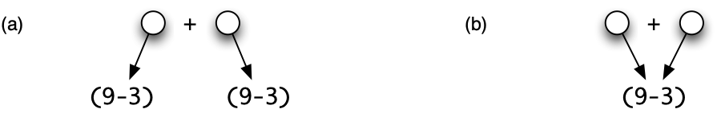
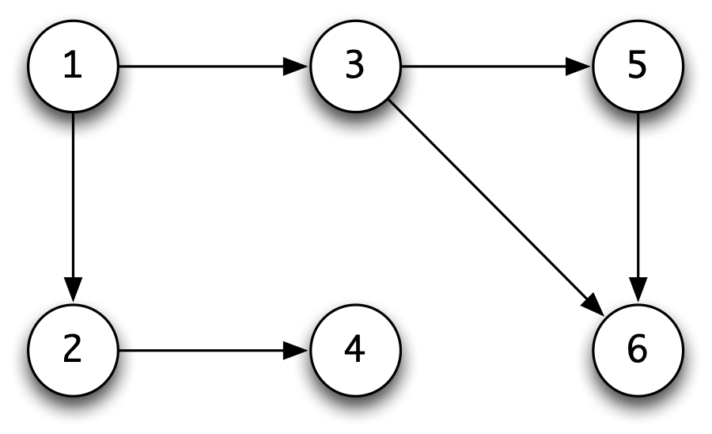
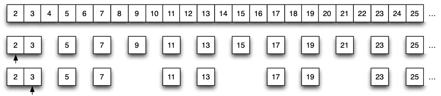
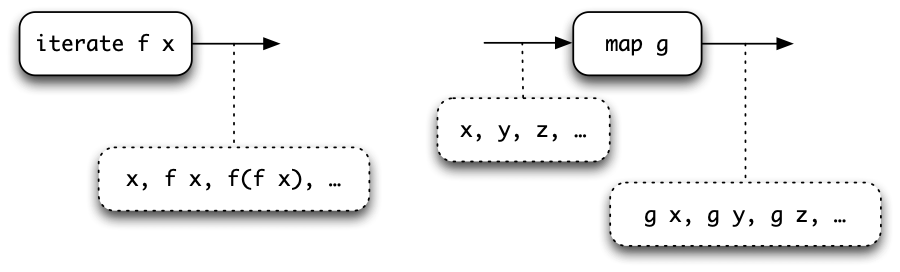
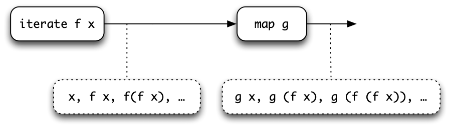
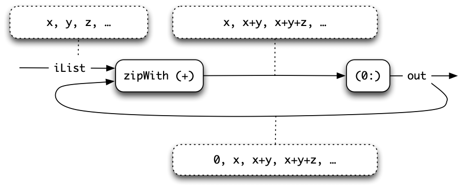

Lazy programming {#lazy}
================

In our calculations so far we have said that the order in which we make evaluation steps will not affect the results produced -- it may only affect whether the sequence leads to a result. This chapter describes precisely the *lazy evaluation* strategy which underlies Haskell. Lazy evaluation is well named: a lazy evaluator will only evaluate an argument to a function if that argument's value is needed to compute the overall result. Moreover, if an argument is structured (a list or a tuple, for instance), only those parts of the argument which are needed to make the computation continue will be evaluated; we'll look at how this works in practice in some examples.

Lazy evaluation has consequences for the style of programs we can write. Since an intermediate list will only be generated on demand, using an intermediate list will not necessarily be expensive computationally. We examine this in the context of a series of examples, culminating in a case study of parsing.

To build parsers we construct a *toolkit* of polymorphic, higher-order functions which can be combined in a flexible and extensible way to make language processors of all sorts. One of the distinctive features of a functional language is the collection of facilities it provides for defining libraries like this; we'll come back to this example when we discuss domain-specific languages in Chapter [Domain-Specific Languages](19.md#dsls).

We also take the opportunity to extend the *list comprehension* notation. This does not allow us to write any new programs, but does make a lot of list processing programs -- especially those which work by generating and then testing possible solutions -- easier to express and understand.

Another consequence of lazy evaluation is that it is possible for the language to describe *infinite* structures. These would require an infinite amount of time to evaluate fully, but under lazy evaluation, only parts of a data structure need to be examined. Any recursive type will contain infinite objects; we concentrate on lists here, as infinite lists are by far the most widely used infinite structures.

After introducing a variety of examples, such as infinite lists of prime and random numbers, we discuss the importance of infinite lists for *program design*, and see that programs manipulating infinite lists can be thought of as processes consuming and creating 'streams' of data. Based on this idea, we explore how to complete the simulation case study.

The chapter concludes with an update on program *verification* in the light of lazy evaluation and the existence of infinite lists; this section can only give a flavour of the area, but contains references to more detailed presentations.

Sections [Lazy evaluation](#lazyEval) and [Calculation rules and lazy evaluation](#calcRules) are essential reading, but the sections that follow explore the impact of laziness on a number of things we have looked at already, including list comprehensions and the simulation case study, as well as examining design and verification questions.

Lazy evaluation {#lazyEval}
---------------

Central to evaluation in Haskell is function application. The basic idea behind this is simple: to evaluate the function `f` applied to arguments ``, ``, ..., ``, we simply **substitute** the expressions `` for the corresponding variables in the definition of the function. For instance, if

```haskell
f x y = x+y
```

then

```haskell
f (9-3) (f 34 3)
~> (9-3)+(f 34 3)
```

since we replace `x` by `(9-3)` and `y` by `(f 34 3)`. The expressions `(f 34 3)` and `(9-3)` are not evaluated before they are passed to the function.

In this case, for evaluation to continue, we need to evaluate the arguments to '`+`', giving

```haskell
~> 6+(f 34 3)
~> 6+(34+3) 
~> 6+37 
~> 43
```

In this example, both of the arguments are evaluated eventually, but this is not always the case. If we define

```haskell
g x y = x+12
```

then

```haskell
g (9-3) (g 34 3)
~> (9-3)+12 
~> 6+12 
~> 18
```

Here `(9-3)` is substituted for `x`, but as `y` does not appear on the right-hand side of the equation, the argument `(g 34 3)` will not appear in the result, and so is not evaluated. Here we see the first advantage of lazy evaluation: *an argument which is not needed will not be evaluated*. This example is rather too simple: why would we write the second argument if its value is never needed? A rather more realistic example is

```haskell
switch :: Integer -> a -> a -> a
switch n x y
  | n>0         = x
  | otherwise   = y
```

If the integer `n` is positive, the result is the value of `x`; otherwise it is the value of `y`. Either of the arguments `x` and `y` might be used, but in the first case `y` is not evaluated and in the second `x` is not evaluated. A third example is

```haskell
h x y = x+x
```

so that

```haskell
h (9-3) (h 34 3)  -- (h-eval)
~> (9-3)+(9-3) 
```

It appears here that we will have to evaluate the argument `(9-3)` twice since it is duplicated on substitution. Lazy evaluation ensures that *a duplicated argument is never evaluated more than once*. This can be modelled in a calculation by doing the corresponding steps simultaneously, thus

```haskell
h (9-3) 17
~> (9-3)+(9-3) 
~> 6+6
~> 12 
```

In the implementation, there is no duplicated evaluation because calculations are made over **graphs** rather than trees to represent the expressions being evaluated. For instance, instead of duplicating the argument, as in (a) below, the evaluation of `(h-eval)` will give a graph in which on both sides of the plus there is the *same* expression. This is shown in (b).

{width="4in"}

A final example is given by the pattern matching function,

```haskell
pm (x,y) = x+1
```

applied to the pair `(3+2,4-17)`.

```haskell
pm (3+2,4-17)
~> (3+2)+1
~> 6
```

The argument is examined, and part of it is evaluated. The second half of the pair remains unevaluated, as it is not needed in the calculation. This completes the informal introduction to lazy evaluation, which can be summarized in the three points:

-   arguments to functions are evaluated only when this is necessary for evaluation to continue;

-   an argument is not necessarily evaluated fully: only the parts that are needed are examined;

-   an argument is evaluated at most only once. This is done in the implementation by replacing expressions by graphs and calculating over them.

We now give a more formal account of the calculation rules which embody lazy evaluation.

Calculation rules and lazy evaluation {#calcRules}
-------------------------------------

As we first saw in Section [Syntax](3.md#syntax), the definition of a function consists of a number of conditional equations. Each conditional equation can contain multiple clauses and may have a number of local definitions given in a `where` clause. Each equation will have on its left-hand side the function under definition applied to a number of patterns.

```haskell
f p_1 p_2 ... p_k
  | g_1          = e_1
  | g_2          = e_2
  ...
  | otherwise   = e_r
    where
    v_1  a_1,1 ... = r_1
    ....
f q_1 q_2 ... q_k
  = ...
```

In calculating `f … ` there are three aspects.

### Calculation -- pattern matching {#calculation-pattern-matching .unnumbered}

In order to determine which of the equations is used, the arguments are evaluated. The arguments are not evaluated fully, rather they are evaluated sufficiently to see whether they match the corresponding patterns. If they match the patterns `` to ``, then evaluation proceeds using the first equation; if not, they are checked against the second equation, which may require further evaluation. This is repeated until a match is given, or until there are no more equations (which would generate a `Program error`). For instance, given the definition

```haskell
f :: [Int] -> [Int] -> Int
f [] ys         = 0   -- (f.1)
f (x:xs) []     = 0   -- (f.2)
f (x:xs) (y:ys) = x+y   -- (f.3)
```

the evaluation of `f [1 .. 3] [1 .. 3]` proceeds thus

```haskell
f [1 ..\ 3] [1 ..\ 3]  -- (1)
~> f (1:[2 ..\ 3]) [1 ..\ 3]  -- (2)
~> f (1:[2 ..\ 3]) (1:[2 ..\ 3])  -- (3)
~> 1+1  -- (4)
```

At stage `(1)`, there is not enough information about the arguments to determine whether there is a match with `(f.1)`. One step of evaluation gives `(2)`, and shows there is not a match with `(f.1)`.

The first argument of `(2)` matches the first pattern of `(f.2)`, so we need to check the second. One step of calculation in `(3)` shows that there is no match with `(f.2)`, but that there is with `(f.3)`; hence we have `(4)`.

### Calculation -- guards {#calculation-guards .unnumbered}

Suppose that the first conditional equation matches (simply for the sake of explanation). The expressions `` to `` are substituted for the patterns `` to `` throughout the conditional equation. We must next determine which of the clauses on the right-hand side applies. The guards are evaluated in turn, until one is found which gives the value `True`; the corresponding clause is then used. If we have

```haskell
f :: Int -> Int -> Int -> Int
f m n p
  | m>=n && m>=p        = m
  | n>=m && n>=p        = n
  | otherwise           = p
```

then

```haskell
f (2+3) (4-1) (3+9)
  ??  (2+3)>=(4-1) && (2+3)>=(3+9)
  ??    ~> 5>=3 && 5>=(3+9)
  ??    ~> True && 5>=(3+9) 
  ??    ~> 5>=(3+9)
  ??    ~> 5>=12
  ??    ~> False
  ??  3>=5 && 3>=12
  ??    ~> False && 3>=12
  ??    ~> False
  ??  otherwise ~> True
~> 12
```

We leave it as an exercise for the reader to work out which parts of the calculation above are shared.

### Calculation -- local definitions {#calculation-local-definitions .unnumbered}

Values in `where` clauses are calculated on demand: only when a value is needed does calculation begin. Given the definitions

```haskell
f :: Int -> Int -> Int

f m n
  | notNil xs    = front xs
  | otherwise    = n
    where
    xs = [m ..\ n]

front (x:y:zs) = x+y
front [x]      = x

notNil []    = False
notNil (_:_) = True
```

the calculation of `f 3 5` will be

```haskell
f 3 5
  ?? notNil xs
  ??     where 
  ??     xs = [3 ..\ 5]
  ??       ~> 3:[4 ..\ 5]   -- (1)
  ?? ~> notNil (3:[4 ..\ 5])
  ?? ~> True
~> front xs
       where
       xs = 3:[4 ..\ 5]
          ~> 3:4:[5]   -- (2)
~> 3+4  -- (3)
~> 7
```

To evaluate the guard `notNil xs`, evaluation of `xs` begins, and after one step, `(1)` shows that the guard is `True`. Evaluating `front xs` requires more information about `xs`, and so we evaluate by one more step to give `(2)`. A successful pattern match in the definition of `front` then gives `(3)`, and so the result.

This section has described `where` clauses; a similar explanation applies to `let` expressions.

### Operators and other expression formers {#operators-and-other-expression-formers .unnumbered}

The three aspects of evaluating a function application are now complete; we should now say something about the built-in operators. If they can be given Haskell definitions, such as

```haskell
True  && x = x
False && x = False
```

then they will follow the rules for Haskell definitions. The left-to-right order means that '`&&`' will not evaluate its second argument in the case that its first is `False`, for instance. This is unlike many programming languages, where the 'and' function will evaluate both its arguments.

The other operations, such as the arithmetic operators, vary. Multiplication needs both its arguments to return a result[^1] but the equality on lists can return `False` on comparing `[]` and `(x:xs)` without evaluating `x` or `xs`. In general the language is implemented so that no manifestly unnecessary evaluation takes place.

Recall that `if` ...`then` ...`else` ...; `cases`; `let` and lambda expressions can be used in forming expressions. Their evaluation follows the form we have seen for function applications. Specifically, `if` ...`then` ...`else` ...  is evaluated like a guard, `cases` like a pattern match, `let` like a `where` clause and a lambda expression like the application of a named function such as `f` above.

Finally, we turn to the way in which a choice is made between applications.

### Evaluation order {#evaluation-order .unnumbered}

What characterizes evaluation in Haskell, apart from the fact that no argument is evaluated more than once, is the **order** in which applications are evaluated when there is a choice.

-   Evaluation is **from the outside in**. In a situation like

    ```haskell
    f_1 e_1\ (f_2 e_2\ 17)
    ```

    where one application encloses another, the outer one is evaluated. In the example, the outer one, `  (  17)`, is chosen for evaluation.

-   Otherwise, evaluation is **from left to right**. In the expression

    ```haskell
    f_1 e_1 + f_2 e_2
    ```

    the underlined expressions are both to be evaluated. The left-hand one, ` `, will be evaluated first.

These rules are enough to describe the way in which lazy evaluation works. In the sections to come we look at the consequences of a lazy approach for functional programming.

List comprehensions revisited {#listCompRev}
-----------------------------

The list comprehension notation does not add any new programs to the Haskell language, but it does allow us to (re-)write programs in a new and clearer way. Building on the introduction in Section [List comprehensions](5.md#listComps), the notation lets us combine multiple `map`s and `filter`s together in a single expression. Combinations of these functions allow us to write algorithms which generate and test: all the elements of a particular form are generated and combinations of them are tested, before results depending upon them are returned.

We begin the section with a re-examination of the syntax of the list comprehension, before giving some simple examples to illustrate the features that we describe. After that we give the rules for calculating with list comprehensions, and we finish the section with a series of longer examples.

### Syntax {#syntax .unnumbered}

A list comprehension has the form

```haskell
[ e | q_1 , ...\ , q_k ]
```

where each **qualifier** `` has one of two forms.

-   It can be a **generator**, `p <- lExp`, where `p` is a pattern and `lExp` is an expression of list type.

-   It can be a **test**, `bExp`, which is a boolean expression.

An expression `lExp` or `bExp` appearing in qualifier `` can refer to the variables used in the patterns of qualifiers `` to ``.

### Simpler examples {#simpler-examples .unnumbered}

Multiple generators allow us to combine elements from two or more lists

```haskell
pairs :: [a] -> [b] -> [(a,b)]
pairs xs ys = [ (x,y) | x<-xs , y<-ys ]
```

This example is important as it shows the way in which the values `x` and `y` are chosen.

```haskell
pairs [1,2,3] [4,5] 
~> [(1,4),(1,5),(2,4),(2,5),(3,4),(3,5)]
```

The first element of `xs`, `1`, is given to `x`, and then *for this fixed value* all possible values of `y` in `ys` are chosen. This process is repeated for the remaining values `x` in `xs`, namely `2` and `3`.

This choice is not accidental, since if we have

```haskell
triangle :: Int -> [(Int,Int)]triangle
triangle n = [ (x,y) | x <- [1 ..\ n] , y <- [1 ..\ x] ]
```

the second generator, `y <- [1 .. x]` depends on the value of `x` given by the first generator.

```haskell
triangle 3 
~> [(1,1),(2,1),(2,2),(3,1),(3,2),(3,3)]
```

For the first choice of `x`, `1`, the value of `y` is chosen from `[1 .. 1]`, for the second choice of `x`, the value of `y` is chosen from `[1 .. 2]`, and so on.

Three positive integers form a *Pythagorean triple* if the sum of squares of the first two is equal to the square of the third. The list of all triples with all sides below a particular bound, `n`, is given by

```haskell
pyTriple
pyTriple n
  = [ (x,y,z) | x <- [2 ..\ n] , y <- [x+1 ..\ n] , 
                z <- [y+1 ..\ n] , x*x + y*y == z*z ]

pyTriple 100 
~> [(3,4,5),(5,12,13),(6,8,10),...,(65,72,97)]         
```

Here the test combines values from the three generators.

### Calculating with list comprehensions {#calculating-with-list-comprehensions .unnumbered}

How can we describe the way in which the results of list comprehensions are obtained? One way is to give a translation of the comprehensions into applications of `map`, `filter` and `concat`. We give a different approach here, of calculating *directly* with the expressions.

Before we do this, we introduce one piece of very helpful notation. We write `e{f/x}` for the expression `e` in which every occurrence of the variable `x` has been replaced by the expression `f`. This is the **substitution** of `f` for `x` in `e`. If `p` is a pattern, we use `e{f/p}` for the substitution of the appropriate parts of `f` for the variables in `p`. For instance,

```haskell
[ (x,y) | x<-xs ]{[2,3]/xs}    = [ (x,y) | x<-[2,3] ]

(x + sum xs){(2,[3,4])/(x,xs)} = 2 + sum [3,4]
```

since `2` matches `x`, and `[3,4]` matches `xs` when `(2,[3,4])` is matched against `(x,xs)`.

We now explain list comprehensions. The notation looks a bit daunting, but the effect should be clear. The generator `v <- [,...,]` has the effect of setting `v` to the values `` to `` in turn. Setting the value appears in the calculation as **substitution** of a value for a variable.

```haskell
[ e | v <- [a_1,...,a_n] , q_2 , ...\ , q_k ]  
~> [ e{a_1/v} | q_2{a_1/v} , ...\ , q_k{a_1/v} ] 
    ++ ... ++
    [ e{a_n/v} | q_2{a_n/v} , ...\ , q_k{a_n/v} ] 
```

As a running example for this section we take

```haskell
[ x+y | x <- [1,2] , isEven x , y <- [x ..\ 2*x] ]
~> [ 1+y | isEven 1 , y <- [1 ..\ 2*1] ] ++
    [ 2+y | isEven 2 , y <- [2 ..\ 2*2] ]
```

where the values `1` and `2` are substituted for `x`. The rules for tests are simple,

```haskell
[ e | True  , q_2 , ...\ , q_k ] 
~> [ e | q_2 , ...\ , q_k ]

[ e | False , q_2 , ...\ , q_k ] 
~> []
```

so that our example is

```haskell
~> [ 1+y | False , y <- [1 ..\ 2*1] ] ++
    [ 2+y | True , y <- [2 ..\ 2*2] ]
~> [ 2+y | y <- [2,3,4] ]
~> [ 2+2 | ] ++ [ 2+3 | ] ++ [ 2+4 | ]
```

and when there are no qualifiers,

```haskell
[ e | ] = [ e ]
```

Completing the example, we have

```haskell
[ x+y | x <- [1,2] , isEven x , y <- [x ..\ 2*x] ] 
~> [4,5,6]
```

Now we consider some more examples.

```haskell
triangle 3
~> [ (x,y) | x <- [1 ..\ 3] , y <- [1 ..\ x] ]
~> [ (1,y) | y <- [1 ..\ 1] ] ++ 
    [ (2,y) | y <- [1 ..\ 2] ] ++
    [ (3,y) | y <- [1 ..\ 3] ]
~> [ (1,1) | ] ++ 
    [ (2,1) | ] ++ [ (2,2) | ] ++
    [ (3,1) | ] ++ [ (3,2) | ] ++ [ (3,3) | ]
~> [(1,1),(2,1),(2,2),(3,1),(3,2),(3,3)]
```

as we argued above. Another example contains a test:

```haskell
[ m*m | m <- [1 ..\ 10] , m*m<50 ]
~> [ 1*1 | 1*1<50 ] ++ [ 2*2 | 2*2<50 ] ++ ...
    [ 7*7 | 7*7<50 ] ++ [ 8*8 | 8*8<50 ] ++ ...
~> [ 1  | True ] ++ [ 4  | True ] ++ ...
    [ 49 | True ] ++ [ 64 | False ] ++ ...
~> [1,4,...49]
```

We now look at two longer examples, the solutions for which are aided by the list comprehension style.

### Example {#example .unnumbered}

#### List permutations {#list-permutations .unnumbered}

A permutation of a list is a list with the same elements in a different order. For a list of `n` elements, there are `n!` (`n` factorial) permutations of the list. The `perms` function returns a list of all permutations of a list.

```haskell
perms :: Eq a => [a] -> [[a]]
```

The empty list has one permutation, itself. If `xs` is not empty, a permutation is given by picking an element `x` from `xs` and putting `x` at the front of a permutation of the remainder `xs` with `x` removed. To do this we use the '``' operator, defined in `Data.List`.

The operator '``' returns the difference of two lists: `xsys` is the list `xs` with each element of `ys` removed, if it is present. The number of duplications is taken into account, so that for example `[2,3,2][3,2,3]` is `[2]`. We can now write the definition of the function giving all the permutations like this

```haskell
perms [] = [[]]
perms xs = [ x:ps | x <- xs , ps <- perms (xs\\[x]) ]
```

Example evaluations give, for a one-element list,

```haskell
perms [2]
~> [x:ps| x <- [2] , ps <- perms [] ] 
~> [x:ps| x <- [2] , ps <- [[]] ] 
~> [2:ps| ps <- [[]] ] 
~> [2:[] | ]
~> [[2]]
```

for a two-element list,

```haskell
perms [2,3]
~> [ x:ps | x <- [2,3] , ps <- perms([2,3]\\[x]) ]
~> [ 2:ps | ps <- perms [3] ] ++ [ 3:ps | ps <- perms [2] ]
~> [ 2:[3] ] ++ [ 3:[2] ]
~> [ [2,3] , [3,2] ]
```

and finally for a three-element list,

```haskell
perms [1,2,3]
~> [ x:ps | x <- [1,2,3] , ps <- perms([1,2,3]\\[x]) ]
~> [ 1:ps | ps <- perms [2,3]] ++...++ [ 3:ps | ps <- perms [1,2]]
~> [ 1:ps | ps<-[[2,3],[3,2]]] ++...++ [ 3:ps | ps<-[[1,2],[2,1]]]
~> [[1,2,3],[1,3,2],[2,1,3],[2,3,1],[3,1,2],[3,2,1]]
```

There is another algorithm for permutations: in this, a permutation of a list `(x:xs)` is given by forming a permutation of `xs`, and by inserting `x` into this somewhere. The possible insertion points are given by finding all the possible *splits* of the list into two halves.

```haskell
perm :: [a] -> [[a]]

perm []     = [[]]
perm (x:xs) = [ ps++[x]++qs | rs <- perm xs ,
                              (ps,qs) <- splits rs ]
```

We get the list of all possible `splits` of a list `xs` after seeing that on splitting `(y:ys)`, we either split at the front of `(y:ys)`, or somewhere inside `ys`, as given by a split of `ys`.

```haskell
splits :: [a]->[([a],[a])]

splits []     = [ ([],[]) ]
splits (y:ys) = ([],y:ys) : [ (y:ps,qs) | (ps,qs) <- splits ys]
```

Before moving on, observe that the type of `perms` requires that `a` must be in the class `Eq`. This is needed for the list difference operator `` to be defined over the type `[a]`. There is no such restriction on the type of `perm`, which uses a different method for calculating the permutations.

### Vectors and matrices {#vectors-and-matrices .unnumbered}

In this section we give one model for vectors and matrices of real numbers; others exist, and are suitable for different purposes. In particular, the `Data.Array` package provides implementations of both immutable and mutable arrays: the former are 'functional', and so can only be updated by copying, while the latter can be updated 'in place'.

In our implementation, a vector is a list of real numbers, as in the example vector `[2.1,3.0,4.0]`.

```haskell
type Vector = [Float]Vector
```

The scalar product of two vectors (assumed to be the same length) is given by multiplying together corresponding elements and taking the total of the results.

```haskell
scalarProduct [2.0,3.1] [4.1,5.0] 
~> 2.0*4.1 + 3.1*5.0 
~> 23.7
```

As a first attempt we might write

```haskell
mul xs ys = sum [ x*y | x<-xs , y<-ys ]
```

but this gives

```haskell
mul [2.0,3.1] [4.1,5.0] 
~> sum [8.2,10.0,12.71,15.5] 
~> 46.41
```

since *all* combinations of pairs from the lists are taken. In order to multiply together corresponding pairs, we first `zip` the lists together:

```haskell
scalarProduct
scalarProduct :: Vector -> Vector -> Float
scalarProduct xs ys = sum [ x*y | (x,y) <- zip xs ys ]
```

and a calculation shows that this gives the required result. It is also possible to use `zipWith` to define `scalarProduct`; we leave this as an exercise. A matrix like `( arrayrrr 2.0 & 3.0 & 4.0  5.0 & 6.0 & -1.0 array )` can be thought of as a list of rows or a list of columns; we choose a list of rows here.

```haskell
type Matrix = [Vector]Matrix
```

The example matrix is

```haskell
[[2.0,3.0,4.0],[5.0,6.0,-1.0]]
```

Two matrices `M` and `P` are multiplied by taking the scalar products of rows of `M` with columns of `P`. `( arrayrrr 2.0 & 3.0 & 4.0  5.0 & 6.0 & -1.0 array ) × ( arrayrr 1.0 & 0.0  1.0 & 1.0  0.0 & -1.0 array ) = ( arrayrr 5.0 & -1.0  11.0 & 7.0 array )` We therefore define

```haskell
matrixProduct
matrixProduct :: Matrix -> Matrix -> Matrix
matrixProduct m p
  = [ [scalarProduct r c | c <- columns p] | r <- m ]
```

where the function `columns` gives the representation of a matrix as a list of columns.

```haskell
columns :: Matrix -> Matrix

columns y = [ [ z!!j | z <- y ] | j <- [0 ..\ s] ]
            where 
            s = length (head y)-1
```

The expression `[ z!!j | z <- y ]` picks the `j`th element from each row `z` in `y`; this is exactly the `j`th column of `y`. `length (head y)` is the length of a row in `y`, and so the indices `j` will be in the range `0` to `s = length (head y)-1`. Another variant of the `columns` function is `transpose` which is in the library `Data.List`.

#### Refutable patterns in generators {#refutable-patterns-in-generators .unnumbered}

Some patterns are **refutable**, meaning that an attempt to pattern-match against them may fail. If a refutable pattern is used on the left-hand side of an '`<-`', its effect is to filter from the list only the elements matching the pattern. For example,

```haskell
[ x | (x:xs) <- [[],[2],[],[4,5]] ] ~> [2,4]
```

The rules for calculation with generators containing a refutable pattern on their left-hand side are similar to those given above, except that before performing the substitution for the pattern, the list is filtered for the elements which match the pattern. The details are left as an exercise.

**Exercises**

1.  Give a calculation of the expression

    ```haskell
    [ x+y | x <- [1 ..\ 4] , y <- [2 ..\ 4] , x>y ]
    ```

2.  Using the list comprehension notation, define the functions

    ```haskell
    subLists,subSequences :: [a] -> [[a]]
    ```

    which return all the sublists and subsequences of a list. A sublist is obtained by omitting some of the elements of a list; a subsequence is a continuous block from a list. For instance, both `[2,4]` and `[3,4]` are sublists of `[2,3,4]`, but only `[3,4]` is a subsequence.

3.  Give calculations of the expressions

    ```haskell
    perm [2]
    perm [2,3]
    perm [1,2,3]
    ```

    and of the matrix multiplication

    ```haskell
    matrixProduct [[2.0,3.0,4.0],[5.0,6.0,-1.0]] 
                  [[1.0,0.0],[1.0,1.0],[0.0,-1.0]]
    ```

4.  Give a definition of `scalarProduct` using `zipWith`.

5.  Define functions to calculate the determinant of a square matrix and, if this is non-zero, to invert the matrix.

6.  The calculation rules for list comprehensions can be re-stated for the two cases `[]` and `(x:xs)`, instead of for the arbitrary list `[,...,]`. Give these rules by completing the equations

    ```haskell
    [ e | v <- []     , q_2 , ...\ , q_k ] ~> ...
    [ e | v <- (x:xs) , q_2 , ...\ , q_k ] ~> ...
    ```

7.  Give the precise rules for calculating with a generator containing a refutable pattern, like `(x:xs) <- lExp`. You might need to define auxiliary functions to do this.

8.  List comprehensions can be translated into expressions involving `map`, `filter` and `concat` by the following equations.

    ```haskell
    [ x | x<-xs ]              = xs
    [ f x | x<-xs ]            = map f xs
    [ e | x<-xs , p x , ... ]  = [ e | x <- filter p xs , ... ]
    [ e | x<-xs , y<-ys , .. ] = concat [ [e|y<-ys, ..] | x<-xs]
    ```

    Translate the expressions

    ```haskell
    [ m*m | m <- [1 ..\ 10] ]
    [ m*m | m <- [1 ..\ 10] , m*m<50 ]
    [ x+y | x <- [1 ..\ 4] , y <- [2 ..\ 4] , x>y ]
    [ x:p | x <- xs , p <- perms (xs\\[x]) ]
    ```

    using these equations; you will need to define some auxiliary functions as a part of your translation.

Data-directed programming
-------------------------

This section looks at style of programming made possible by lazy evaluation, **data-directed programming**. This is an approach where we design the program by thinking about it as a sequence of transformations of data.

'In a traditional language it may well be too efficient to do this in practice, as we might have to compute a series of complex data structures which are 'internal' to the program. In a lazy language these are only constructed as they are needed, and in practice they may never be constructed completely: we just build the data structures incrementally, and once a part of it has been used, it can be 'recycled'. Luckily this is done by the implementation, and we do not have to worry about it ourselves.

All this should become clearer as we look at a particular example; let's start by looking at the example of finding the sum of fourth powers of numbers from `1` to `n`. A data-directed solution is to

-   build the list of numbers `[1 .. n]`;

-   take the power of each number, giving `[1,16,…,]`, and

-   find the sum of this list.

As a program, we have

```haskell
sumFourthPowers n = sum (map (^4) [1 ..\ n])
```

How does the calculation proceed?

```haskell
sumFourthPowers n 
~> sum (map (^4) [1 ..\ n])
\   -- create first part of the list with :
~> sum (map (^4) (1:[2 ..\ n]))  -- allows pattern match
~> sum (1^4 : map (^4) [2 ..\ n])  -- by definition of map
~> (1^4) + sum (map (^4) [2 ..\ n])   -- by definition of sum
\ \   -- now we can recycle the first part of the list
~> 1 + sum (map (^4) [2 ..\ n]) 
~> ...
~> 1 + (16 + sum (map (^4) [3 ..\ n])) 
~> ...
~> 1 + (16 + (81 + ... + n^4)) 
```

As can be seen, none of the intermediate lists is created in full in this calculation. As soon as the first part of the list is created, its fourth power is taken, and it becomes a part of the sum which produces the final result, and so the first part can be recycled.

A more striking example is given by the problem of finding the minimum of a list of numbers. One solution is to sort the list, and take its head! This would be ridiculous if the whole list were sorted in the process, but, in fact we have, using the definition of insertion sort from Chapter [Defining functions over lists](7.md#defFunLists),

```haskell
iSort [8,6,1,7,5]iSortins
~> ins 8 (ins 6 (ins 1 (ins 7 (ins 5 []))))
~> ins 8 (ins 6 (ins 1 (ins 7 [5]))) 
~> ins 8 (ins 6 (ins 1 (5 : ins 7 [])))
~> ins 8 (ins 6 (1 : (5 : ins 7 [])))
~> ins 8 (1 : ins 6 (5 : ins 7 []))
~> 1 : ins 8 (ins 6 (5 : ins 7 []))
```

As can be seen from the underlined parts of the calculation, each application of `ins` calculates the minimum of a larger part of the list, since the head of the result of `ins` is given in a single step. The head of the whole list is determined in this case without us working out the value of the tail, and this means that we have a sensible algorithm for minimum given by `(head . iSort)`.

A graph can be seen as an object of type `Relation a`, as defined in Section [Relations and graphs](16.md#rels). How can we find a route from one point in a graph to another? For example, in the graph

{width="2in"}

```haskell
graphEx = makeSet [(1,2),(1,3),(2,4),(3,5),(5,6),(3,6)]
```

a route from `1` to `4` is the list `[1,2,4]`.

We solve a slightly different problem: find the list of *all* routes from `x` to `y`; our original problem is solved by taking the head of this list. Note that as a list is returned, the algorithm allows for the possibility of there being *no* route from `x` to `y` -- the empty list of routes is the answer in such a case. This method, which is applicable in many different situations, is often called the **list of successes**

technique: instead of returning one result, or an error if there is none, we return a list; the error case is signalled by the empty list. The method also allows for multiple results to be returned, as we shall see.

How do we solve the new problem?

##### Acyclic case.

For the present we assume that the graph is **acyclic**: there is no circular path from any node back to itself.

-   The only route from `x` to `x` is `[x]`.

-   A route from `x` to `y` will start with a step to one of `x`'s neighbours, `z` say. The remainder will be a path from `z` to `y`.

We therefore look for all paths from `x` to `y` going through `z`, for each neighbour `z` of `x`.

```haskell
routes
routes :: Ord a => Relation a -> a -> a -> [[a]]
routes rel x y
  | x==y        = [[x]]
  | otherwise   = [ x:r | z <- nbhrs rel x ,
                          r <- routes rel z y ]
```

The `nbhrs` function is defined by

```haskell
nbhrs
nbhrs :: Ord a => Relation a -> a -> [a]
nbhrs rel x = flatten (image rel x)
```

where `flatten` turns a set into a list. Now consider the example, where we write `routes’` for `routes graphEx` and `nbhrs’` for `nbhrs graphEx`, to make the calculation more readable:

```haskell
routes' 1 4
~> [ 1:r | z <- nbhrs' 1 , r <- routes' z 4 ]
~> [ 1:r | z <- [2,3] , r <- routes' z 4 ]
~> [ 1:r | r <- routes' 2 4 ] ++ 
    [ 1:r | r <- routes' 3 4 ]  -- (†)
~> [ 1:r | r <- [ 2:s | w <- nbhrs' 2 , s <- routes' w 4 ]]++...
~> [ 1:r | r <- [ 2:s | w <- [4] , s <- routes' w 4 ] ] ++ ...
~> [ 1:r | r <- [ 2:s | s <- routes' 4 4 ] ] ++ ...  -- (‡)
~> [ 1:r | r <- [ 2:s | s <- [[4]] ] ] ++ ...
~> [ 1:r | r <- [ [2,4] ] ] ++ ...
~> [[1,2,4]] ++ ...
```

The head of the list is given by exploring only the first neighbour of `1`, namely `2`, and its first neighbour, `4`. In this case the search for a route leads directly to a result. This is not always so. Take the example of

```haskell
routes' 1 6 = ...
~> [ 1:r | r <- routes' 2 6 ] ++ 
    [ 1:r | r <- routes' 3 6 ]  -- (†)
~> ...
~> [ 1:r | r <- [ 2:s | s <- routes' 4 6 ] ] ++ 
    [ 1:r | r <- routes' 3 6 ]  -- (‡)
```

Corresponding points in the calculations are marked by `(†)` and `(‡)`. The search for routes from `4` to `6` will *fail*, though, as `4` has no neighbours -- we therefore have

```haskell
~> [] ++ [ 1:r | r <- routes' 3 6 ] = ...
~> [ 1:r | r <- [ 3:s | s <- routes' 5 6 ] ] ++ ...
~> [[1,3,5,6]] ++ ...
```

The effect of this algorithm is to **backtrack** when a search has failed: there is no route from `1` to `6` via `2`, so the other possibility of going through `3` is explored. This is done *only* when the first possibility is exhausted, however, so lazy evaluation ensures that this search through 'all' the paths turns out to be an efficient method of finding a single path. Moreover, we don't have to think explicitly about backtracking, it simply falls out from our description of the list of all solutions, evaluated lazily.

##### General case.

We assumed at the start of this development that the graph was acyclic, so that we have no chance of a path looping back on itself, and so of a search going into a loop. We can make a simple addition to the program to make sure that only paths without cycles are explored, and so that the program will work for an arbitrary graph. We add a list argument for the points not to be visited (again), and so have

```haskell
routesC
routesC :: Ord a => Relation a -> a -> a -> [a] -> [[a]]
routesC rel x y avoid
  | x==y        = [[x]]
  | otherwise   = [ x:r | z <- nbhrs rel x \\ avoid ,
                          r <- routesC rel z y (x:avoid) ]
```

Two changes are made in the recursive case.

-   In looking for neighbours of `x` we look only for those which are not in the list `avoid`;

-   in looking for routes from `z` to `y`, we exclude visiting both the elements of `avoid` and the node `x` itself.

A search for a route from `x` to `y` in `rel` is given by ` routesC rel x y []`.

**Exercises**

1.  Defining `graphEx2` to be

    ```haskell
    makeSet [(1,2),(2,1),(1,3),(2,4),(3,5),(5,6),(3,6)]
    ```

    try calculating the effect of the original definition on

    ```haskell
    routes graphEx 1 4
    ```

    Repeat the calculation with the revised definition which follows:

    ```haskell
    routes rel x y
      | x==y        = [[x]]   
      | otherwise   = [ x:r | z <- nbhrs rel x ,
                              r <- routes rel z y ,
                              not (elem x r) ]
    ```

    and explain why this definition is not suitable for use on cyclic graphs. Finally, give a calculation of

    ```haskell
    routesC graphEx 1 4 []
    ```

Case study: parsing expressions {#parsing}
-------------------------------

We have already seen the definition of `Expr`, the type of arithmetic expressions, in Section [Recursive algebraic types](14.md#recTypes) and in a revised version given:

```haskell
data Expr = Lit Int | Var Var | Op Ops Expr ExprExpr
data Ops  = Add | Sub | Mul | Div | ModOps
```

and showed there how we could calculate the results of these expressions using the function `eval`. Chapter

[Abstract data types](16.md#adt) began with a discussion of how to represent the values held in the variables using the abstract data type `Store`. Using these components, we can build a calculator for simple arithmetical expressions, but the input is unacceptably crude, as we have to enter members of the `Expr` type, so that to add `2` and `3`, we are forced to type Op Add (Lit 2) (Lit 3). What we need to make the input reasonable is a function which performs the reverse of `show`: it will take the string `"(2+3)"` and return the expression `Op Add (Lit 2) (Lit 3)`, which is of type `Expr`. A function like this is called a **parser** and the process of turning a 'flat' string into a structure like an `Expr` is called **parsing**.

Constructing a parser for a type like `Expr` gives a `read` function which essentially gives the functionality of the `Read` class, introduced in Section [A tour of the built-in Haskell classes](13.md#haskellClasses) above. Note, however, that the `derived` definition of `read` for `Expr` will parse strings of the form `"Op Add (Lit 2) (Lit 3)"`, which doesn't help us to build the parser for strings like `"(2+3)"`.

### The type of parsers: `Parse` {#the-type-of-parsers-parse .unnumbered}

In building a library of parsing functions, we first have to establish the type we shall use to represent parsers. Our approach here is again *data directed*: we will look at how a parser is represented as a function of a particular type, and in looking at how particular parsers are constructed we'll again concentrate on how data is transformed through the parsing process.

The problem of parsing is to take a list of objects -- of type `a` and characters in our example `"(2+3)"` -- and from it to extract an object of some other type, `b`, in this case `Expr`. As a first attempt, we might define the type of parsers thus:

```haskell
type Parse1 a b = [a] -> b
```

Suppose that `bracket` and `number` are the parsers of this type which recognize brackets and numbers then we have

```haskell
bracket "(xyz" ~> '('
number  "234"  ~> 2 or 23 or 234?
bracket "234"  ~> no result?
```

The problem evident here is that a parser can return more than one result -- as in `number "234"` -- or none at all, as seen in the final case. Instead of the original type, we suggest

```haskell
type Parse2 a b = [a] -> [b]
```

where a list of results is returned. In our examples,

```haskell
bracket "(xyz" ~> ['(']
number  "234"  ~> [2 , 23 , 234]
bracket "234"  ~> []
```

In this case an empty list signals failure to find what was sought, while multiple results show that more than one successful parse was possible. We are using the 'list of successes' technique again, in fact.

Another problem presents itself. What if we look for a bracket *followed by* a number, which we have to do in parsing our expressions? We need to know the part of the input which remains after the successful parse. Hence we define

```haskell
Parse
type Parse a b = [a] -> [(b,[a])]
```

and our example functions will give

```haskell
bracket "(xyz" ~> [('(' , "xyz")]
number  "234"  ~> [(2,"34") , (23,"4") , (234,"")]
bracket "234"  ~> []
```

Each element in the output list represents a successful parse. In `number "234"` we see three successful parses, each recognizing a number. In the first, the number `2` is recognized, leaving `"34"` unexamined, for instance.

The type `ReadS b`, which appears in the standard prelude and is used in defining the `Read` class, is a special case of the type `Parse a b` in which `[a]` is replaced by `String`, that is, `a` is replaced by `Char`.

### Some basic parsers {#some-basic-parsers .unnumbered}

Now we have established the type we shall use, we can begin to write some parsers. These and the parser-combining functions are illustrated in Figure [The major parsing functions.](#majParsing); we go through the definitions now.

The first is a parser which always fails, so accepts nothing. There are no entries in its output list.

```haskell
none
none :: Parse a b
none inp = []
```

On the other hand, we can succeed immediately, without reading any input. The value recognized is a parameter of the function.

```haskell
succeed :: b -> Parse a bsucceed 
succeed val inp = [(val,inp)]
```

More useful is a parser to recognize a single object or token, `t`, say. We define

```haskell
token :: Eq a => a -> Parse a atoken
token t (x:xs) 
  | t==x        = [(t,xs)]
  | otherwise   = []
token t []      = []
```

More generally, we can recognize (or `spot`) objects with a particular property, as represented by a Boolean-valued function.

```haskell
spot :: (a -> Bool) -> Parse a aspot
spot p (x:xs) 
  | p x         = [(x,xs)]
  | otherwise   = []
spot p []       = []
```

These parsers allow us to recognize single characters like a left bracket, or a single digit,

```haskell
bracket = token '('
dig     = spot isDigit
```

and indeed, we can define `token` from `spot`:

```haskell
token t = spot (==t)
```

If we are to build parsers for complex structures like expressions we will need to be able to combine these simple parsers into more complicated ones to, for instance, recognize numbers consisting of lists of digits.

```haskell
infixr 5 >*>

type Parse a b = [a] -> [(b,[a])]Parse
 
none :: Parse a bnone
none inp = []
 
succeed :: b -> Parse a b succeed
succeed val inp = [(val,inp)]
 
token :: Eq a => a -> Parse a atoken
token t = spot (==t)
 
spot :: (a -> Bool) -> Parse a aspot
spot p (x:xs) 
  | p x         = [(x,xs)]
  | otherwise   = []
spot p []       = []
 
alt :: Parse a b -> Parse a b -> Parse a balt
alt p1 p2 inp = p1 inp ++ p2 inp

(>*>) :: Parse a b -> Parse a c -> Parse a (b,c)    
(>*>) p1 p2 inp 
  = [((y,z),rem2) | (y,rem1) <- p1 inp , (z,rem2) <- p2 rem1 ]
 
build :: Parse a b -> (b -> c) -> Parse a cbuild
build p f inp = [ (f x,rem) | (x,rem) <- p inp ]
    
list :: Parse a b -> Parse a [b]list
list p = (succeed []) `alt`
         ((p >*> list p) `build` (uncurry (:)))
```

<a id="majParsing"></a>
### Combining parsers {#combining-parsers .unnumbered}

Here we build a library of higher-order polymorphic functions, which we then use to give our parser for expressions. First we have to think about the ways in which parsers need to be combined.

Looking at the expression example, an expression is *either* a literal, *or* a variable *or* an operator expression. From parsers for the three sorts of expression, we want to build a single parser for expressions. For this we use `alt`

```haskell
alt :: Parse a b -> Parse a b -> Parse a balt

alt p1 p2 inp = p1 inp ++ p2 inp
```

The parser combines the results of the parses given by parsers `p1` and `p2` into a single list, so a success in either is a success of the combination. For example,

```haskell
(bracket `alt` dig) "234" 
~> [] ++ [('2',"34")]
```

the parse by `bracket` fails, but that by `dig` succeeds, so the combined parser succeeds.

For our second function, we look again at the expression example. In recognizing an operator expression we see a bracket *then* a number. How do we put parsers together so that the second is applied to the input that remains after the first has been applied?

We make this function an operator, as we find that it is often used to combine a sequence of parsers, and an infix form with defined associativity is most convenient for this.

```haskell
infixr 5 >*>

(>*>) :: Parse a b -> Parse a c -> Parse a (b,c)

(>*>) p1 p2 inp 
  = [((y,z),rem2) | (y,rem1) <- p1 inp , (z,rem2) <- p2 rem1 ]
```

The values `(y,rem1)` run through the possible results of parsing `inp` using `p1`. For each of these, we apply `p2` to `rem1`, which is the input which is unconsumed by `p1` in that particular case. The results of the two successful parses, `y` and `z`, are returned as a pair.

As an example, assume that `digList` recognizes non-empty sequences of digits, and look at `(digList >*> bracket) "24("`. Applying `digList` to the string `"24("` gives two results,

```haskell
digList "24(" ~> [("2","4(") , ("24","(")]
```

and so `(y,rem1)` runs through two cases

```haskell
(digList >*> bracket) "24("
~> [((y,z),rem2) | (y,rem1) <- [("2","4(") , ("24","(")] ,
                    (z,rem2)  <- bracket rem1 ]
~> [(("2",z),rem2)  | (z,rem2)  <- bracket "4(" ] ++
    [(("24",z),rem2) | (z,rem2)  <- bracket "(" ] 
```

Now, `bracket "4("  > []`, so fails, giving

```haskell
~> [] ++ [(("24",z),rem2) | (z,rem2)  <- bracket "(" ] 
```

and

```haskell
bracket "(" ~> [('(',"")]
```

which signals success, and finally gives

```haskell
~> [(("24",z),rem2) | (z,rem2)  <- [('(',"")] ] 
~> [ (("24",'(') , "") ]
```

This shows we have one successful parse, in which we have recognized the digit list `"24"` followed by the left bracket `’(’`.

Our final operation is to change the item returned by a parser, or to `build` something from it. Consider again the case of the parser, `digList`, which returns a list of digits. Can we make it return the number which the list of digits represents? We apply conversion to the results, thus

```haskell
build :: Parse a b -> (b -> c) -> Parse a cbuild

build p f inp = [ (f x,rem) | (x,rem) <- p inp ]
```

so in an example, we have

```haskell
(digList `build` digsToNum) "21a3"
~> [ (digsToNum x,rem) | (x,rem) <- digList "21a3" ]
~> [ (digsToNum x,rem) | (x,rem) <- [("2","1a3"),("21","a3")]]
~> [ (digsToNum "2" , "1a3") , (digsToNum "21" , "a3") ]
~> [ (2,"1a3") , (21,"a3")]
```

Using the three operations or **combinators** `alt`, `>*>` and `build` together with the primitives of the last section we will be able to define all the parsers we require.

As an example, we show how to define a parser for a **list** of objects, when we are given a parser to recognize a single object. There are two sorts of list:

-   A list can be empty, which will be recognized by the parser `succeed []`.

-   Any other list is non-empty, and consists of an object followed by a list of objects. A pair like this is recognized by `p >*> list p`; we then have to turn this pair `(x,xs)` into the list `(x:xs)`, for which we use `build`, applied to the uncurried form of `(:)`, which takes its arguments as a pair, and thus converts `(x,xs)` to `(x:xs)`.

```haskell
list :: Parse a b -> Parse a [b]

list p = (succeed []) `alt`
         ((p >*> list p) `build` (uncurry (:)))
```

**Exercises**

1.  Define the functions

    ```haskell
    neList   :: Parse a b -> Parse a [b]
    optional :: Parse a b -> Parse a [b]
    ```

    so that `neList p` recognizes a non-empty list of the objects which are recognized by `p`, and `optional p` recognizes such an object *optionally* -- it may recognize an object or succeed immediately.

2.  Define the function

    ```haskell
    nTimes :: Integer -> Parse a b -> Parse a [b]
    ```

    so that `nTimes n p` recognizes `n` of the objects recognized by `p`.

### A parser for expressions {#a-parser-for-expressions .unnumbered}

Now we can describe our expressions and define the parser for them. Expressions have three forms:

-   Literals: `67`, `89`, where '``' is used for unary minus.

-   Variables: `’a’` to `’z’`.

-   Applications of the binary operations `+,*,-,/,%`, where `%` is used for `mod`, and `/` gives integer division. Expressions are fully bracketed, if compound, thus: `(23+(34-45))`, and white space not permitted.

The parser has three parts

```haskell
parser :: Parse Char Exprparser
parser = litParse `alt` varParse `alt` opExpParse
```

corresponding to the three sorts of expression. The simplest to define is

```haskell
varParse
varParse :: Parse Char Expr
varParse = spot isVar `build` Var

isVar :: Char -> Bool
isVar x = ('a' <= x && x <= 'z')
```

(Here the constructor `Var` is used as a function taking a character to the type `Expr`.)

An operator expression will consist of two expressions joined by an operator, the whole construct between a matching pair of parentheses: <a id="opExpParse"></a>

```haskell
opExpParse
opExpParse 
  = (token '(' >*>
     parser    >*>
     spot isOp >*>
     parser    >*>
     token ')') 
     `build` makeExpr
```

where the conversion function takes a nested sequence of pairs, like

```haskell
('(',(Lit 23,('+',(Var 'x',')'))))
```

into the expression `Op Add (Lit 23) (Var ’x’)`, thus

```haskell
makeExpr (_,(e1,(bop,(e2,_)))) = Op (charToOp bop) e1 e2
```

Defining the functions `isOp` and `charToOp` is left as an exercise.

Finally, we look at the case of literals. A number consists of a non-empty list of digits, with an optional '``' at the front. We therefore use the functions from the exercises of the previous section to say

```haskell
litParse litParse
  = ((optional (token '~')) >*>
     (neList (spot isDigit)) 
    `build` (charlistToExpr . uncurry (++)) 
```

Left undefined here is the function `charlistToExpr` which should convert a list of characters to a literal integer; this is an exercise for the reader.

**Exercises**

1.  Define the functions

    ```haskell
    isOp     :: Char -> Bool
    charToOp :: Char -> Ops
    ```

    used in the parsing of expressions.

2.  A **recogniser** is like a parser, but simpler: all it needs to do is to recognise whether (the first part of) a string is what we are looking for. Taking a particular example, a recogniser for numbers, `numberRec`, should behave like this

    ```haskell
    numberRec "234"  ~>["34" , "4" , ""]
    numberRec "(34"  ~>[]
    ```

    where the corresponding `number` parser gives:

    ```haskell
    number "234"  ~>[(2,"34") , (23,"4") , (234,"")]
    number "(34"  ~>[]
    ```

    Explain how you could define `numberRec` from `number`, and then give a general set of library functions for building recognisers in a similar way to the library for building parsers.

3.  Define the function

    ```haskell
    charlistToExpr :: [Char] -> Expr
    ```

    so that

    ```haskell
    charlistToExpr "234" ~>Lit 234
    charlistToExpr "~98" ~>Lit (-98)
    ```

    which is used in parsing literal expressions.

4.  A command to the calculator to assign the value of `expr` to the variable `var` is represented thus

    ```haskell
    var:expr
    ```

    Give a parser for these commands.

5.  How would you change the parser for numbers if decimal fractions are to be allowed in addition to integers?

6.  How would you change the parser for variables if names longer than a single character are to be allowed?

7.  Explain how you would modify your parser so that the *whitespace* characters space and tab can be used in expressions, but would be ignored on parsing. (Hint: there is a simple pre-processor which does the trick!)

8.  (Note: this exercise is for those familiar with Backus-Naur notation for grammars.)

    Expressions without bracketing and allowing the multiplicative expressions higher binding power are described by the grammar

    ```haskell
    Expr  ::= Integer | Var | (Expr Ops Expr) |
              Lexpr Mop Mexpr | Mexpr Aop Expr
    Lexpr ::= Integer | Var | (Expr Ops Expr)
    Mexpr ::= Integer | Var | (Expr Ops Expr) | Lexpr Mop Mexpr
    Mop   ::= '*' | '/' | '%'
    Aop   ::= '+' | '-'     
    Ops   ::= Mop | Aop
    ```

    Give a Haskell parser for this grammar. Discuss the associativity of the operator '`-`' in this grammar.

### The top-level parser {#the-top-level-parser .unnumbered}

The parser defined in the last section, `parser` is of type

```haskell
[Char] -> [ (Expr,[Char]) ]
```

yet what we need is to convert this to a function taking a string to the expression it represents. We therefore define the function

```haskell
topLevel :: Parse a b -> b -> [a] -> btopLevel
topLevel p defaultVal inp
  = case results of
      [] -> defaultVal
      _  -> head results
    where
    results = [ found | (found,[]) <- p inp ]
```

The parse `p inp` is successful if the result contains at least one parse (the second case) in which all the input has been read (the test given by the pattern match to `(found,[])`). If this happens, the first value `found` is returned; otherwise (the first case) we return the default value of type `b`, `defaultVal`, which in our case study will be the default command, `Null`.

We can define the type of commands thus

```haskell
Command
data Command = Eval Expr | Assign Var Expr | Null
```

which are intended to cause

-   the evaluation of the expression,

-   the assignment of the value of the expression to the variable, and

-   no effect.

If the assignment command takes the form `var:expr`, then it is not difficult to design a parser for this type,

```haskell
commandParse
commandParse :: Parse Char Command
```

We will assume this has been built when we revisit the calculator example below.

### Conclusions {#conclusions .unnumbered}

The type of parsers `Parse a b` with the functions

```haskell
Parse
none     :: Parse a b
succeed  :: b -> Parse a b 
spot     :: (a -> Bool) -> Parse a a
alt      :: Parse a b -> Parse a b -> Parse a b
>*>      :: Parse a b -> Parse a c -> Parse a (b,c)
build    :: Parse a b -> (b -> c) -> Parse a c
topLevel :: Parse a b -> [a] -> b
```

allow us to construct so-called recursive descent parsers in a straightforward way. It is worth looking at the aspects of the language we have exploited.

-   The type `Parse a b` is represented by a function type, so that all the parser combinators are higher order functions.

-   Because of polymorphism, we do not need to be specific about either the input or the output type of the parsers we build. In our example we have confined ourselves to inputs which are strings of characters, but they could have been *tokens* of any other type, if required: we might take the tokens to be *words* which are then parsed into sentences, for instance. More importantly in our example, we can return objects of any type using the same combinators, and in the example we returned lists and pairs as well as simple characters and expressions.

-   Lazy evaluation plays a role here also. The possible parses we build are generated *on demand* as the alternatives are tested. The parsers will backtrack through the different options until a successful one is found.

Building general libraries like this parser library is one of the major advantages of using a modern functional programming language with the facilities mentioned above. From a toolkit like this it is possible to build a whole range of parsers and language processors which can form the front ends of systems of all sorts.

We will return to a discussion of parsing in Chapter 18; note also that we could make the type of `Parse a b` into an abstract data type, along the lines discussed in Chapter [Abstract data types](16.md#adt). On the other hand, it would also be useful to leave the implementation open to extension by users, which is the way in which other Haskell libraries are made available.

**Exercises**

1.  Define a parser which recognizes strings representing Haskell lists of integers, like `"[2,-3,45]"`.

2.  Define a parser to recognize simple sentences of English, with a subject, verb and object. You will need to provide some vocabulary, `"cat"`, `"dog"`, and so on, and a parser to recognize a string. You will also need to define a function

    ```haskell
    tokenList :: Eq a => [a] -> Parse a [a]
    ```

    so that, for instance,

    ```haskell
    tokenList "Hello" "Hello Sailor" ~> [ ("Hello"," Sailor") ]
    ```

3.  Define the function

    ```haskell
    spotWhile :: (a -> Bool) -> Parse a [a]
    ```

    whose parameter is a function which tests elements of the input type, and returns the longest initial part of the input, all of whose elements have the required property. For instance

    ```haskell
    spotWhile digit "234abc"  ~> [ ("234","abc") ]
    spotWhile digit "abc234"  ~> [ ([],"abc234") ]
    ```

Infinite lists
--------------

<a id="infLists"></a>
One important consequence of lazy evaluation is that it is possible for the language to describe **infinite** structures. These would require an infinite amount of time to evaluate fully, but under lazy evaluation it is possible to compute with only portions of a data structure rather than the whole object. Any recursive type will contain infinite objects; we concentrate on lists here, as these are by far the most widely used infinite structures.

In this section we look at a variety of examples, starting with simple one-line definitions and moving to an examination of random numbers to be used in our simulation case study. The simplest examples of infinite lists are constant lists like

```haskell
ones
ones = 1 : ones
```

Evaluation of this in a Haskell system produces a list of ones, indefinitely. This can be **interrupted** in GHCi by typing `Ctrl-C`; this produces the result

```haskell
[1,1,1,1,1,1,1,^C,1,1,1,Interrupted.
```

We can sensibly evaluate functions applied to `ones`. If we define

```haskell
addFirstTwo :: [Integer] -> Integer
addFirstTwo (x:y:zs) = x+y
```

then applied to `ones` we have

```haskell
addFirstTwo ones
~> addFirstTwo (1:ones) 
~> addFirstTwo (1:1:ones)
~> 1+1
~> 2
```

Built into the system are the lists `[n .. ]`, `[n,m .. ]`, so that

```haskell
[3 ..\ ]   = [3,4,5,6,...
[3,5 ..\ ] = [3,5,7,9,...
```

We can define these ourselves:

```haskell
from :: Integer -> [Integer]
from n = n : from (n+1)

fromStep :: Integer -> Integer -> [Integer]
fromStep n m = n : fromStep (n+m) m
```

and an example evaluation gives

```haskell
fromStep 3 2
~> 3 : fromStep 5 2
~> 3 : 5 : fromStep 7 2
~> ...
```

These functions are also defined over any instance of the `Enum` class; details can be found in standard prelude.

List comprehensions can also define infinite lists. The list of *all* Pythagorean triples -- whole numbers which can the sides of a right-angled triangle -- is given by selecting `z` in `[2 .. ]`, and then selecting suitable values of `x` and `y` below that.

```haskell
pythagTriples
pythagTriples =
  [ (x,y,z) | z <- [2 ..\ ] , y <- [2 ..\ z-1] , 
              x <- [2 ..\ y-1] , x*x + y*y == z*z ]
pythagTriples
= [(3,4,5),(6,8,10),(5,12,13),(9,12,15),(8,15,17),(12,16,20),...
```

The powers of an integer are given by

```haskell
powers :: Integer -> [Integer]
powers n = [ n^x | x <- [0 ..\ ] ] 
```

and this is a special case of the prelude function `iterate`, which gives the infinite list

```haskell
[ x , f x , .. , f^n x , ..
```

```haskell
iterate :: (a -> a) -> a -> [a]iterate
iterate f x = x : iterate f (f x)
```

A positive integer greater than one is **prime** if it is divisible only by itself and one. The *Sieve of Eratosthenes* -- an algorithm known for over two thousand years -- works by cancelling out all the multiples of numbers, once they are established as prime. The primes are the only elements which remain in the list. The process is illustrated in Figure [The Sieve of Eratosthenes.](#sievePic).

{width="5in"}

<a id="sievePic"></a>
We begin with the list of numbers starting at `2`. The head is `2`, and we remove all the multiples of `2` from the list. The head of the remainder of the list, `3`, is prime, since it was not removed in the sieve by `2`. We therefore sieve the remainder of the list of multiples of `3`, and repeat the process indefinitely. As a Haskell definition, we write

```haskell
primessieve
primes :: [Integer]

primes       = sieve [2 ..\ ]
sieve (x:xs) = x : sieve [ y | y <- xs , y `mod` x > 0]
```

where we test whether `x` divides `y` by evaluating `y ‘mod‘ x`; `y` is a multiple of `x` if this value is zero. Beginning the evaluation, we have

```haskell
primes 
~> sieve [2 ..\ ]
~> 2 : sieve [ y | y <- [3 ..\ ] , y `mod` 2 > 0]
~> 2 : sieve (3 : [ y | y <- [4 ..\ ] , y `mod` 2 > 0])
~> 2 : 3 : sieve [ z | z <- [ y | y <- [4 ..\ ] , y `mod` 2 > 0],
                      z `mod` 3 > 0]  
~> ...
~> 2 : 3 : sieve [ z | z <- [5,7,9...] , z `mod` 3 > 0]  
~> ...
~> 2 : 3 : sieve [5,7,11,...]  
~> ...
```

Can we use `primes` to test for a number being a prime? If we evaluate `member primes 7` we get the response `True`, while `member primes 6` gives no answer. This is because an infinite number of elements have to be checked before we conclude that `6` is not in the list. The problem is that `member` cannot use the fact that `primes` is ordered. This we do in `memberOrd`.

```haskell
memberOrd
memberOrd :: Ord a => [a] -> a -> Bool
memberOrd (x:xs) n
  | x<n         = memberOrd xs n
  | x==n        = True
  | otherwise   = False
```

The difference here is in the final case: if the head of the list (`x)` is greater than the element we seek (`n`), the element cannot be a member of the ordered list. Evaluating the test again,

```haskell
memberOrd [2,3,5,7,11,...] 6
~> memberOrd [3,5,7,11,...] 6  
~> memberOrd [5,7,11,...] 6  
~> memberOrd [7,11,...] 6 
~> False
```

Many computer systems require us to generate 'random' numbers, one after another. Our queuing simulation is a particular example upon which we focus here, after looking at the basics of the problem.

No Haskell program can produce a truly random sequence; after all, we want to be able to predict the behaviour of our programs, and randomness is inherently unpredictable. What we can do, however, is generate a **pseudo-random** sequence of natural numbers, smaller than `modulus`. This **linear congruential method** works by starting with a `seed`, and then by getting the next element of the sequence from the previous value thus

```haskell
nextRand :: Integer -> Integer
nextRand n = (multiplier*n + increment) `mod` modulus
```

A (pseudo-)random sequence is given by iterating this function,

```haskell
randomSequence :: Integer -> [Integer]randomSequence
randomSequence = iterate nextRand
```

Given the values

```haskell
seed       = 17489
multiplier = 25173
increment  = 13849
modulus    = 65536
```

the sequence produced by `randomSequence seed` begins

```haskell
[17489,59134,9327,52468,43805,8378,...
```

The numbers in this sequence, which range from `0` to `65535`, all occur with the same frequency. What are we to do if instead we want the numbers to come in the (integer) range `a` to `b` inclusive? We need to scale the sequence, which is achieved by a `map`:

```haskell
scaleSequence
scaleSequence :: Integer -> Integer -> [Integer] -> [Integer]
scaleSequence s t
  = map scale
    where
    scale n = n `div` denom + s
    range   = t-s+1
    denom   = modulus `div` range
```

The original range of numbers `0` to `modulus-1` is split into `range` blocks, each of the same length. The number `s` is assigned to values in the first block, `s+1` to values in the next, and so on.

In our simulation example, we want to generate for each arrival the length of service that person will need on being served. For illustration, we suppose that they range from `1` to `6` minutes, but that they are supposed to happen with different probabilities.

  Waiting time     1     2      3      4      5     6
  -------------- ----- ------ ------ ------ ----- ------
  Probability     0.2   0.25   0.25   0.15   0.1   0.05

We need a function to turn such a distribution into a transformer of infinite lists. Once we have a function transforming individual values, we can `map` it along the list.

We can represent a distribution of objects of type `a` by a list of type `[(a,Float)]`, where we assume that the numeric entries add up to one. Our function transforming individual values will be

```haskell
makeFunction :: [(a,Float)] -> (Float -> a)makeFunction
```

so that numbers in the range `0` to `65535` are transformed into items of type `a`. The idea of the function is to give the following ranges to the entries for the list above.

  Waiting time      1          2             3        ...
  -------------- -------- ------------ ------------- -----
  Range start       0      (m\*0.2)+1   (m\*0.45)+1   ...
  Range end       m\*0.2    m\*0.45       m\*0.7      ...

where `m` is used for `modulus`. The definition follows:

```haskell
makeFunction dist = makeFun dist 0.0

makeFun ((ob,p):dist) nLast rand
  | nNext >= rand && rand > nLast     
        = ob
  | otherwise                           
        = makeFun dist nNext rand
          where
          nNext = p*fromIntegral modulus + nLast
```

The `makeFun` function has an extra argument, which carries the position in the range `0` to `modulus-1` reached so far in the search; it is initially zero. The `fromIntegral` function used here converts an `Int` to an equivalent `Float`.

The transformation of a list of random numbers is given by

```haskell
map (makeFunction dist)
```

and the random distribution of waiting times we require begins thus

```haskell
map (makeFunction dist . fromIntegral) (randomSequence seed)
= [2,5,1,4,3,1,2,5,4,2,2,2,1,3,2,5,...
```

with `6` first appearing at the `35`th position.

A full library for generating random numbers and random data for other types is given in `System.Random`.

**Exercises**

1.  Define the infinite lists of factorial and Fibonacci numbers,

    ```haskell
    factorial = [1,1,2,6,24,120,720,...]
    fibonacci = [0,1,1,2,3,5,8,13,21,...]
    ```

2.  Give a definition of the function

    ```haskell
    factors :: Int -> [Int]
    ```

    which returns a list containing the factors of a positive integer. For instance,

    ```haskell
    factors 12 = [1,2,3,4,6,12]
    ```

    Using this function or otherwise, define the list of numbers whose only prime factors are `2`, `3` and `5`, the so-called **Hamming numbers**: <a id="HamNos"></a>

    ```haskell
    hamming = [1,2,3,4,5,6,8,9,10,12,15,...
    ```

3.  Define the function

    ```haskell
    runningSums :: [Int] -> [Int]
    ```

    which calculates the running sums

    ```haskell
    [0,a_0,a_0+a_1,a_0+a_1+a_2,...
    ```

    of a list

    ```haskell
    [a_0,a_1,a_2,...
    ```

4.  Define the function `infiniteProduct` specified above, and use it to correct the definition of `pythagTriples2`.

Why infinite lists? {#whyInfLis}
-------------------

Haskell supports infinite lists and other infinite structures, and we saw in the last section that we could define a number of quite complicated lists, like the list of prime numbers, and lists of random numbers. The question remains, though, of whether these lists are anything other than a curiosity. There are two arguments which show their importance in functional programming.

First, an infinite version of a program can be more **abstract**, and so simpler

to write. Consider the problem of finding the `n`th prime number, using the Sieve of Eratosthenes. If we work with finite lists, we need to know in advance how large a list is needed to accommodate the first `n` primes; if we work with an infinite list, this is not necessary: only that part of the list which is needed will be generated as computation proceeds.=1

In a similar way, the random numbers given by `randomSequence seed` provided an unlimited resource: we can take as many random numbers from the list as we require. There needs to be no decision at the start of programming as to the size of sequence needed. (These arguments are rather like those for **virtual memory** in a computer. It is often the case that predicting the memory use of a program is possible, but tiresome; virtual memory makes this unnecessary, and so frees the programmer to proceed with other tasks.)

The second argument is of wider significance, and can be seen by re-examining the way in which we generated random numbers. We generated an infinite list by means of `iterate`, and we transformed the values using `map`; these operations are pictured in Figure [A generator and a transformer.](#processes1) as a generator of and a transformer of lists of values. These values are shown in the dashed boxes. These components can then be linked together, giving more complex combinations, as in Figure [Linking processes together.](#processes2).

{width="5in"}

<a id="processes1"></a>
{width="5in"}

<a id="processes2"></a>
This approach **modularizes** the generation of values in a distribution in an interesting way. We have separated the generation of the values from their transformation, and this means we can change each part independently of the other.

Once we have seen the view of infinite lists as the links between processes, other combinations suggest themselves, and in particular we can begin to write process-style programs which involve **recursion**.

Among the exercises in the last section was the problem of finding the running sums

```haskell
[0,a_0,a_0+a_1,a_0+a_1+a_2,...
```

of the list `[,,,...`. Given the sum up to ``, say, we get the next sum by adding the next value in the input, ``. It is as if we *feed the sum back* into the process to have the value `` added. This is precisely the effect of the network of processes in Figure [A process to compute the running sums of a list.](#sumStream), where the values passing along the links are shown in the dotted boxes.=1

{width="5in"}

<a id="sumStream"></a>
The first value in the output `out` is `0`, and we get the remaining values by adding the next value in `iList` to the previous sum, appearing in the list `out`. This is translated into Haskell as follows. The output of the function on input `iList` is `out`. This is itself got by adding `0` to the front of the output from the `zipWith (+)`, which itself has inputs `iList` and `out`. In other words,

```haskell
listSums :: [Integer] -> [Integer]

listSums iList = out
                 where
                 out = 0 : zipWith (+) iList out
```

where we recall that `zipWith` is defined by

```haskell
zipWith f (x:xs) (y:ys) = f x y : zipWith f xs ys
zipWith f _     _       = []
```

and the operator section `(0:)` puts a zero on the front of a list. We give a calculation of an example now.

```haskell
listSums
listSums [1 ..\ ]
~> out
~> 0 : zipWith (+) [1 ..\ ] out
~> 0 : zipWith (+) [1 ..\ ] (0:...)   -- (1)
~> 0 : 1+0 : zipWith (+) [2 ..\ ] (1+0:...)  -- (2)
~> 0 : 1 : 2+1 : zipWith (+) [3 ..\ ] (2+1:...)  ~> ...
```

In making this calculation, we replace the occurrence of `out` in line `(1)` with the incomplete list `(0:...)`. In a similar way, we replace the tail of `out` by `(1+0:...)` in line `(2)`.

The definition of `listSums` is an example of the general function `scanl’`, which combines values using the function `f`, and whose first output is `st`.

```haskell
scanl' :: (a -> b -> b) -> b -> [a] -> [b]
scanl' f st iList
  = out 
    where
    out = st : zipWith f iList out
```

The function `listSums` is given by `scanl’ (+) 0`, and a function which keeps a running sort of the initial parts of list is `sorts = scanl’ ins []`, where `ins` inserts an element in the appropriate place in a sorted list. The list of factorial values, ` [1,1,2,6,...]` is given by `scanl’ (*) 1 [1 .. ]`, and taking this as a model, any primitive recursive function can be described in a similar way.

The definition we give here is a minor variant of the standard function `scanl`, but we choose to give the definition here because of its close correspondence to the process networks for running sums given in Figure [A process to compute the running sums of a list.](#sumStream).

**Exercises**

1.  Give a definition of the list `[ 2^n | n <- [0 .. ] ]` using a process network based on `scanl’`. (Hint: you can take the example of factorial as a guide.)

2.  How would you select certain elements of an infinite list? For instance, how would you keep running sums of the *positive* numbers in a list of numbers?

3.  How would you *merge* two infinite lists, assuming that they are sorted? How would you remove duplicates from the list which results? As an example, how would you merge the lists of powers of `2` and `3`?

4.  Give definitions of the lists of Fibonacci numbers ` [0,1,1,2,3,5,...]` and Hamming numbers `[1,2,3,4,5,6,8,9,...]` (defined) using

    networks of processes. For the latter problem, you may find the merge function of the previous question useful.

Case study: simulation
----------------------

We are now in a position to put together the ingredients of the queue simulation covered in

-   Section [Design with algebraic data types](14.md#algDesign), where we designed the algebraic types `Inmess` and `Outmess`,

-   Section [Simulation](16.md#simEx), where the abstract types `QueueState` and `ServerState` were introduced, and in

-   Section [infLists](#infLists), where we showed how to generate an infinite list of pseudo-random waiting times chosen according to a distribution over the times `1` to `6`.

As we said in Section [Design with algebraic data types](14.md#algDesign), our top-level simulation will be a function from a series of input messages to a series of output messages, so

```haskell
doSimulation :: ServerState -> [Inmess] -> [Outmess]
```

where the first parameter is the state of the server at the start of the simulation. In Section [Simulation](16.md#simEx) we presented the function performing one step of the simulation,

```haskell
simulationStep :: ServerState -> 
                  Inmess -> 
                  (ServerState, [Outmess])
```

which takes the current server state, and the input message arriving at the current minute and returns the state after one minute's processing, paired with the list of the output messages produced by the queues that minute (potentially every queue could release a customer at the same instant, just as no customers might be released.)

The output of the simulation will be given by the output messages generated in the first minute, and after those the results of a new simulation beginning with the updated state:

```haskell
doSimulation servSt (im:messes)
  = outmesses ++ doSimulation servStNext messes
    where
    (servStNext , outmesses) = simulationStep servSt im
```

How do we generate an input sequence? From Section [infLists](#infLists) we have the sequence of times given by

```haskell
randomTimes randomTimes
  = map (makeFunction dist . fromIntegral) (randomSequence seed)
  ~> [2,5,1,4,3,1,2,5,...
```

We are to have arrivals of one person per minute, so the input messages we generate are

```haskell
simulationInput 
  = zipWith Yes [1 ..\ ] randomTimes simulationInput
  ~> [ Yes 1 2 , Yes 2 5 , Yes 3 1 , Yes 4 4 , Yes 5 3 ,...
```

What are the outputs produced when we run the simulation on this input with four queues, by setting the constant `numQueues` to `4`? The output begins

```haskell
doSimulation serverStart simulationInput
~> [Discharge 1 0 2, Discharge 3 0 1, Discharge 6 0 1, 
     Discharge 2 0 5, Discharge 5 0 3, Discharge 4 0 4,
     Discharge 7 2 2,...
```

The first six inputs are processed without delay, but the seventh requires a waiting time of `2` before being served.

The infinite number of arrivals represented by `simulationInput` will obviously generate a corresponding infinite number of output messages. We can make a finite approximation by giving the input

```haskell
simulationInput2 = take 50 simulationInput ++ noes
noes = No : noes
```

where after one arrival in each of the first 50 minutes, no further people arrive. Fifty output messages will be generated, and we define this list of outputs thus:

```haskell
take 50 (doSimulation serverStart simulationInput2)
```

### Experimenting {#experimenting .unnumbered}

We now have the facilities to begin experimenting with different data, such as the distribution and the number of queues. The total waiting time for a (finite) sequence of `Outmess` is given by

```haskell
totalWait :: [Outmess] -> Int
totalWait = sum . map waitTime
            where
            waitTime (Discharge _ w _) = w
```

For `simulationInput2` the total waiting time is `29`, going up to `287` with three queues and down to zero with five. We leave it to the reader to experiment with the **round robin** simulation outlined in the exercises of Section [Simulation](16.md#simEx).

A more substantial project is to model a set-up with a single queue feeding a number of bank clerks -- one way to do this is to extend the `serverState` with an extra queue which feeds into the individual queues: an element leaves the feeder queue when one of the small queues is empty. This should avoid the unnecessary waiting time we face when making the wrong choice of queue, and the simulation shows that waiting times are reduced by this strategy, though by less than we might expect if service times are short.

Proof revisited {#lazyProof}
---------------

After summarizing the effect that lazy evaluation has on the types of Haskell, we examine the consequences for reasoning about programs. Taking lists as a representative example, we look at how we can prove properties of infinite lists, and of all lists, rather than simply the set of finite lists, which was the scope of the proofs we looked at in Chapters [Reasoning about programs](9.md#reasoningProgs), [Higher-order functions](11.md#gen2) and [Algebraic types](14.md#algTypes).

This section cannot give complete coverage of the issues of verification; we conclude with pointers to further reading.

### Undefinedness {#undefinedness .unnumbered}

In nearly every programming language, it is possible to write a program which fails to terminate, and Haskell is no exception. We call the value of such programs the **undefined** value, as it gives no result to a computation.

The simplest expression which gives an undefined result is

```haskell
undef :: aundef
undef = undef  -- (undef.1)
```

which gives a non-terminating or undefined value of every type, but of course we can write an undefined program without intending to, as in

```haskell
fak n = (n+1) * fak n
```

where we have confused the use of `n` and `n+1` in attempting to define the factorial function. The value of `fak n` will be the same as `undef`, as they are both non-terminating.

We should remark that we are using the term 'undefined' in two different ways here. The **name**

`undef` is given a definition by `(undef.1)`; the **value** that the definition gives it is the undefined value, which represents the result of a calculation or evaluation which fails to terminate (and therefore fails to define a result).

The existence of these undefined values has an effect on the type of lists. What if we define, for example, the list

```haskell
list1 = 2:3:undef
```

The list has a well-defined head, `2`, and tail `3:undef`. Similarly, the tail has a head, `3`, but its tail is undefined. The type `[Integer]` therefore contains **partial** lists like `list1`, built from the undefined list, `undef`, parts of which are defined and parts of which are not.

Of course, there are also undefined integers, so we also include in `[Integer]` lists like

```haskell
list2 = undef:[2,3]
list3 = undef:4:undef
```

which contain undefined values, and might also be partial. Note that in `list3` the first occurrence of `undef` is at type `Integer` while the second is at type `[Integer]`.

What happens when a function is applied to `undef`? We use the rules for calculation we have seen already, so that the `const` function of the standard prelude satisfies

```haskell
const 17 undef ~> 17
```

If the function applied to `undef` has to pattern match, then the result of the function will be `undef`, since the pattern match has to look at the structure of `undef`, which will never terminate. For instance, for the functions used in Chapter [Reasoning about programs](9.md#reasoningProgs),

```haskell
sum undef       ~> undef   -- (sum.u)
doubleAll undef ~> undef   -- (doubleAll.u)
```

In writing proofs earlier in the book we were careful to state that in some cases the results hold only for **defined** values.

An integer is defined if it is not equal to `undef`; a list is defined if it is a finite list of defined values; using this as a model it is not difficult to give a definition of the defined values of any algebraic type.

A finite list as we have defined it may contain undefined values. Note that in some earlier proofs we stipulated that the results hold only for (finite) lists of defined values, that is for defined lists.

### List induction revisited {#list-induction-revisited .unnumbered}

As we said above, since there is an undefined list, `undef`, in each list type, lists can be built up from this; there will therefore be two base cases in the induction principle.

#### Proof by structural induction: fp-lists {#proof-by-structural-induction-fp-lists .unnumbered}

To prove the property `P(xs)` for all finite or partial lists (**fp-lists**) `xs` we have to do three things:

**Base cases & Prove `P([])` and `P(undef)`.\
**Induction step & Prove `P(x:xs)` assuming that `P(xs)` holds already.****

Among the results we proved by structural induction in Chapter [Reasoning about programs](9.md#reasoningProgs) were the equations

```haskell
sum (doubleAll xs) = 2 * sum xs   -- (sum-double)sumdoubleAll
xs ++ (ys ++ zs)   = (xs ++ ys) ++ zs  -- (assoc++)++
reverse (xs ++ ys) = reverse ys ++ reverse xs  -- (reverse++)reverse
```

for all **finite** lists `xs`, `ys` and `zs`. For these results to hold for all fp-lists, we need to show that

```haskell
sum (doubleAll undef) = 2 * sum undef   -- (sum-double.u)
undef ++ (ys ++ zs)   = (undef ++ ys) ++ zs  -- (assoc++.u)
reverse (undef ++ ys) = reverse ys ++ reverse undef  -- (reverse++.u)
```

as well as being sure that the induction step is valid for all fp-lists. Now, by `(sum.u)` and `(doubleAll.u)` the equation `(sum-double.u)` holds, and so `(sum-double)` holds for all fp-lists. In a similar way, we can show `(assoc++.u)`. More interesting is `(reverse++.u)`. Recall the definition of `reverse`:

```haskell
reverse []    = []
reverse (x:xs) = reverse xs ++ [x] 
```

It is clear from this that since there is a pattern match on the parameter, `undef` as the first parameter will give an `undef` result, so

```haskell
reverse undef = undef
```

Taking a defined list, like `[2,3]` for `ys` in `(reverse++.u)` gives

```haskell
reverse (undef ++ [2,3])
  = reverse undef
  = undef

reverse [2,3] ++ reverse undef
  = [3,2] ++ undef
```

This is enough to show that `(reverse++.u)` does not hold, and that we cannot infer that `(reverse++)` holds for all fp-lists. Indeed the example above shows exactly that `(reverse++)` is not valid.

### Infinite lists {#infinite-lists-1 .unnumbered}

Beside the fp-lists, there are **infinite** members of the list types. How can we prove properties of infinite lists? A hint is given by our discussion of printing the results of evaluating an infinite list. In practice what happens is that we interrupt evaluation by hitting `Ctrl-C` after some period of time. We can think of what we see on the screen as an **approximation** to the infinite list.

If what we see are the elements `,,,…,`, we can think of the approximation being the list

```haskell
a_0:a_1:a_2:...:a_n:undef
```

since we have no information about the list beyond the element ``.

More formally, we say that the partial lists

```haskell
undef, a_0:undef, a_0:a_1:undef, a_0:a_1:a_2:undef, ...
```

are approximations to the infinite list `[,,,…,,…]`.

Two lists `xs` and `ys` are equal if all their approximants are equal, that is for all natural numbers `n`, `take n xs = take n ys`. (The `take` function gives the defined portion of the `n`th approximant, and it is enough to compare these parts.) A more usable version of this principle applies to infinite lists only.

#### Infinite list equality {#infinite-list-equality .unnumbered}

A list `xs` is infinite if for all natural numbers `n`, `take n xs  take (n+1) xs`.\
Two infinite lists `xs` and `ys` are equal if for all natural numbers `n`, `xs!!n = ys!!n`.

### Example {#example-1 .unnumbered}

#### Two factorial lists {#two-factorial-lists .unnumbered}

Our example here is inspired by the process-based programs of Section [Why infinite lists?](#whyInfLis). If `fac` is the factorial function

```haskell
fac :: Int -> Intfac
fac 0 = 1  -- (fac.1)
fac m = m * fac (m-1)  -- (fac.2)
```

one way of defining the infinite list of factorials is

```haskell
facMap
facMap = map fac [0 ..\ ]  -- (facMap.1) 
```

while a process-based solution is

```haskell
facs
facs = 1 : zipWith (*) [1 ..\ ] facs  -- (facs.1)
```

Assuming these lists are infinite (which they clearly are), we have to prove for all natural numbers `n` that

```haskell
facMap!!n = facs!!n   -- (facMap.!!)
```

In our proof we will assume for all natural numbers `n` the results

```haskell
(map f xs)!!n        = f (xs!!n)  -- (map.!!)
(zipWith g xs ys)!!n = g (xs!!n) (ys!!n)  -- (zipWith.!!)
```

which we discuss again later in this section.

`(facMap.!!)` is proved by mathematical induction, that is we prove the result for `0` outright, and we prove the result for a positive `n` assuming the result for `n-1`.

###### Base {#base .unnumbered}

We start by proving the result at zero. Examining the left-hand side first,

```haskell
facMap!!0 
  = (map fac [0 ..\ ])!!0   -- by (facMap.1)
  = fac ([0 ..\ ]!!0)   -- by (map.!!)
  = fac 0  -- by def of [0 ..\ ],!!
  = 1   -- by (fac.1)
```

The right-hand side is

```haskell
facs!!0
  = (1 : zipWith (*) [1 ..\ ] facs)!!0   -- by (facs.1)
  = 1  -- by def of !!
```

thus establishing the base case.

###### Induction {#induction .unnumbered}

In the induction case we have to prove `(facMap.!!)` using the induction hypothesis:

```haskell
facMap!!(n-1) = facs!!(n-1)   -- (hyp)
```

The left-hand side of `(facMap.!!)` is

```haskell
facMap!!n
  = (map fac [0 ..\ ])!!n   -- by (facMap.1)
  = fac ([0 ..\ ]!!n)   -- by (map.!!)
  = fac n   -- by def of [0 ..\ ],!!
  = n * fac (n-1)   -- by (fac.2)
```

It is not hard to see that we have `facMap !! (n-1) = fac (n-1)` by a similar argument to the first three steps here and so,

```haskell
  = n * (facMap!!(n-1))
```

The right-hand side of `(facMap.!!)` is

```haskell
facs!!n
  = (1 : zipWith (*) [1 ..\ ] facs)!!n   -- by (facs.1)
  = (zipWith (*) [1 ..\ ] facs)!!(n-1)   -- by def of !!
  = (*) ([1 ..\ ]!!(n-1)) (facs!!(n-1))  -- by (zipWith.!!)
  = ([1 ..\ ]!!(n-1)) * (facs!!(n-1))  -- by def of (*)
  = n * (facs!!(n-1))   -- by def of [1 ..\ ],!!
  = n * (facMap!!(n-1))   -- by (hyp)
```

The final step of this proof is given by the induction hypothesis, and completes the proof of the induction step and the result itself.

### Proofs for infinite lists {#proofs-for-infinite-lists .unnumbered}

When are results we prove for all fp-lists valid for all lists? If a result holds for all fp-lists, then it holds for all *approximations* to infinite lists. For some properties it is enough to know the property for all approximations to know that it will be valid for all infinite lists as well. In particular, this is true for all *equations*. This means that, for example, we can assert that for *all* lists `xs`,

```haskell
(map f . map g) xs = map (f.g) xs
```

and therefore by the principle of extensionality for functions,

```haskell
map f . map g = map (f.g)
```

Many other of the equations we proved initially for finite lists can be extended to proof for the fp-lists, and therefore to all lists. Some of these are given in the exercises which follow.

### Further reading {#further-reading .unnumbered}

The techniques we have given here provide a flavour of how to write proofs for infinite lists and infinite data structures in general. We cannot give the breadth or depth of a full presentation, but refer the reader to for more details. An alternative approach to proving the factorial list example is given in , which also gives a survey of proof in functional programming.

**Exercises**

1.  Show that for all fp-lists `ys` and `zs`,

    ```haskell
    undef ++ (ys ++ zs)  = (undef ++ ys) ++ zs
    ```

    to infer that `++` is associative over all lists.

2.  If `rev xs` is defined to be `shunt xs []`, as in Section [Generalizing the proof goal](9.md#genPrf), show that

    ```haskell
    rev (rev undef) = undef   -- (rev-rev.1)
    ```

    In Chapter [Reasoning about programs](9.md#reasoningProgs) we proved that

    ```haskell
    rev (rev xs) = xs   -- (rev-rev.2)
    ```

    for all finite lists `xs`.

    Why can we not infer from `(rev-rev.1)` and `(rev-rev.2)` that the equation `rev (rev xs) = xs` holds for all fp-lists `xs`?

3.  Prove for all natural numbers `m`, `n` and functions `f :: Int -> a` that

    ```haskell
    (map f [m ..\ ])!!n = f (m+n)
    ```

    \[Hint: you will need to choose the right variable for the induction proof.\]

4.  Prove that the lists

    ```haskell
    facMap = map fac [0 ..\ ]
    facs = 1 : zipWith (*) [1 ..\ ] facs
    ```

    are infinite.

5.  If we define indexing thus

    ```haskell
    (x:_)!!0  = x
    (_:xs)!!n = xs!!(n-1)
    []!!n     = error "Indexing"
    ```

    show that for all strict functions `f`, fp-lists `xs` and natural numbers `n`,

    ```haskell
    (map f xs)!!n = f (xs!!n)
    ```

    and therefore infer that the result is valid for all lists `xs`. State and prove a similar result for `zipWith`.

6.  Show that the following equations hold between functions.

    ```haskell
    filter p . map f     = map f . filter (p . f)
    filter p . filter q  = filter (q &&& p)
    concat . map (map f) = map f . concat      
    ```

    where the operator `&&&` is defined by

    ```haskell
    (q &&& p) x = q x && p x
    ```

Summary {#summary .unnumbered}
-------

Lazy evaluation of Haskell expressions means that we can write programs in a different style. A data structure created within a program execution will only be created on demand, as we saw with the example of finding the sum of fourth powers. In finding routes through a graph we saw that we could explore just that part of the graph which is needed to reveal a path. In these and many more cases the advantage of lazy evaluation is to give programs whose purpose is clear and whose execution is efficient.

We re-examined the list comprehension notation, which makes many list processing programs easier to express; we saw this in the particular examples of route finding and parsing.

A design principle exploited in this chapter involved the use of lazy lists: if a function can return multiple results it is possible to represent this as a list; using lazy evaluation, the multiple results will only be generated one-by-one, as they are required. Also, we are able to represent 'no result' by the empty list, `[]`. This 'list of successes' method is useful in a variety of contexts.

Exploiting this principle as well as higher-order functions, polymorphism and list comprehensions we gave a library of parsing functions, which we saw applied to the type of arithmetical expressions, `Expr`. This showed one of the strengths of modern functional programming languages, whose constructs are especially well suited to describing general toolkits of this sort.

Rather than being simply a curiosity, this chapter has shown that we can exploit infinite lists for a variety of purposes.

-   In giving an *infinite* list of prime or random numbers we provide an unlimited resource: we do not have to know how much of the resource we need while constructing the program; this *abstraction* makes programming simpler and clearer.

-   Infinite lists provide a mechanism for process-based programming in a functional setting.

The chapter concluded with a discussion of how proofs could be lifted to the partial and infinite elements of the list type: criteria were given in both cases and we gave examples and counter-examples in illustration.

[^1]: In fact, multiplication could be 'lazier', since it is possible to say that `0*n` is `0` without evaluating `n`.
