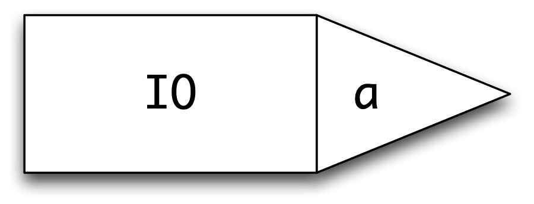
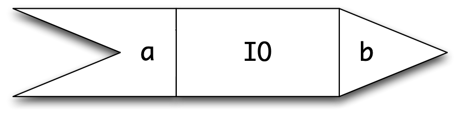
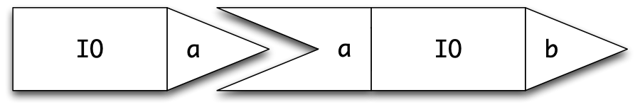
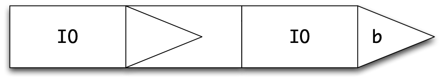
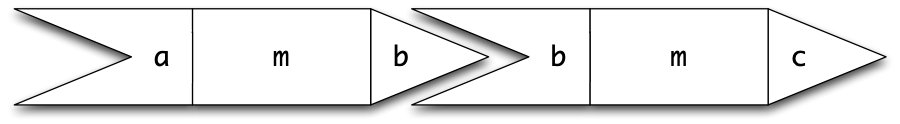
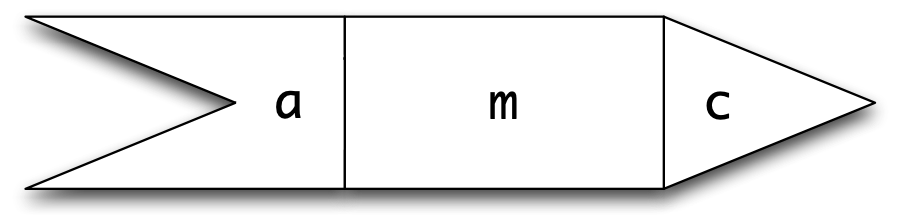
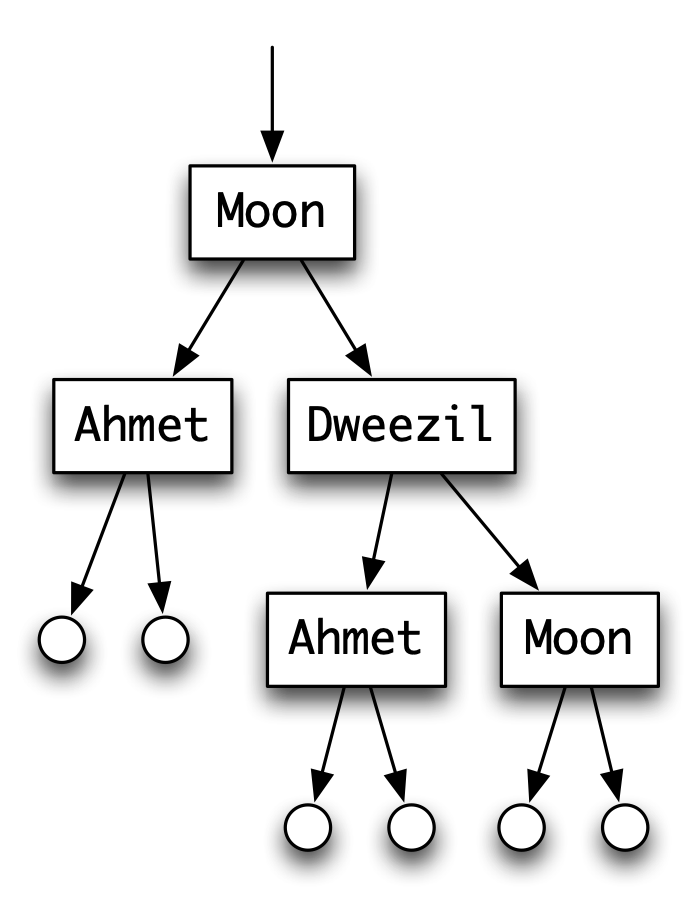
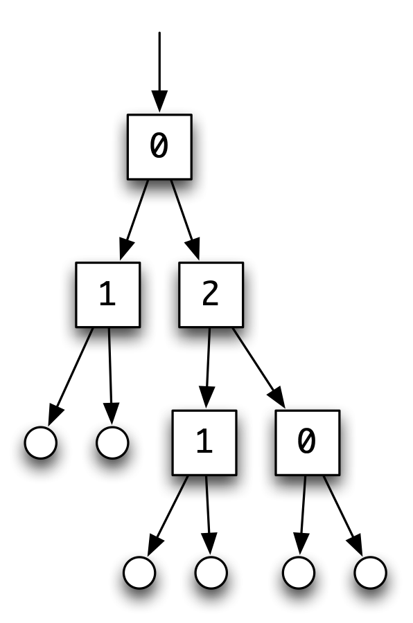

Programming with monads {#actions}
=======================

<a id="ix-18-actions"></a>

<a id="ix-18-i-o"></a>

This chapter looks again at I/O in Haskell, particularly focussing on the `do` notation which we use to write I/O programs. We'll see that we can write all sorts of different programs using `do` notation, including programs that manipulate state, that non-deterministically return more than one result, as well as programs that may fail, or raise exceptions.

Underlying each of these is a **monad**. A monad provides the infrastructure for sequencing and naming used in the `do` notation, and we will show instances of the `Monad` class for lists, the `Maybe` type, a parsing monad and more.

As well as looking at these definitions, we will program a number of examples, showing how a monadic style, using `do`, makes programs more readable and flexible. Each instance of a monad gives a 'little language' for writing programs, and we'll come back to look at this in detail in the next chapter.

I/O programming
---------------

<a id="ix-18-interactive-programs"></a>

We first looked at I/O programming in Haskell using the `IO` types in [Playing the game: I/O in Haskell](8.md#io). Something of type `IO t` is a *program* which will perform I/O and return a value of type `t`. Among the I/O primitives of Haskell are

```haskell
putStr :: String -> IO ()
getLine :: IO String
```

The effect of running `putStr str` is to output the string `str` and then to terminate; it will return the value `()` which is (the only value) of type `()`. The effect of executing `getLine` is to get a line of input, and to return that line as its result.

Programs are built using the `do` notation to *sequence statements* of type `IO t`. A program to read a line then output a message is given by

```haskell
readWrite :: IO ()

readWrite =
    do
      getLine
      putStrLn "one line read"
```

where the two statements are sequenced one after the other. It is also possible to *name* the results of statements for use in the program, so that we can name the line read, and output it, like this:

```haskell
readEcho :: IO ()

readEcho =
    do
      line <-getLine
      putStrLn ("line read: " ++ line)
```

In this program `line <- getLine` names the result of the `getLine` and so it can be echoed in the next statement.

### Adding a sequence of integers {#adding-a-sequence-of-integers .unnumbered}

Now suppose we want to write an interactive program to sum integers supplied one per line until zero is input. We will write an I/O program

```haskell
sumInts :: Integer -> IO Integer
```

which is passed a starting value for the sum, and which returns the sum from there; so, to sum from scratch we call `sumInts 0`. This gives the program

```haskell
sumInts s
  = do n <- getInt
       if n==0 
          then return s
          else sumInts (s+n)
```

In writing the program there are two cases: we first read an integer value, using the `getInt` function defined in [Playing the game: I/O in Haskell](8.md#io). If we read zero then the result must be the sum so far, `s`; if not, we get the result by calling `sumInts` again, with the parameter set to `(s+n)`.

The program is written in the style we saw in [Playing the game: I/O in Haskell](8.md#io): the function is *tail-recursive* -- being called as the last statement in the program -- and the *loop data* is used to carry the "sum so far": here `s` and `s+n`.

It is interesting with compare the definition of `sumInts` with the recursion in

```haskell
sumAcc s [] = s
sumAcc s (n:ns) 
  = if n==0
       then s
       else sumAcc (s+n) ns
```

Here we use the first variable to `sumAcc` as an *accumulator* where the "result so far" can be held.

We can also put the `sumInts` program inside a 'wrapper' which explains its purpose and prints the sum at the end.

```haskell
sumInteract :: IO ()
sumInteract
  = do putStrLn "Enter integers one per line"
       putStrLn "These will be summed until zero is entered"
       sum <- sumInts 0
       putStr "The sum is "
       print sum
```

**Exercises**

1.  Compare the definition of `sumInts` above with this definition:

    ```haskell
    sumInts :: IO Integer
    sumInts
      = do n <- getInt
           if n==0 
              then return 0
              else (do m <- sumInts
                       return (n+m))
    ```

    Which will have the better performance, do you think? Wny?

2.  Give a definition of the function

    ```haskell
    fmap :: (a -> b) -> IO a -> IO b
    ```

    the effect of which is to transform an interaction by applying the function to its result. You should define it using the `do` construct.

3.  Define the function

    ```haskell
    repeat ::  IO Bool -> IO () -> IO ()
    ```

    so that `repeat test oper` has the effect of repeating `oper` until the condition `test` is `True`.

4.  Define the higher-order function `while` in which the condition and the operation work over values of type `a`. Its type should be

    ```haskell
    whileG :: (a -> IO Bool) -> (a -> IO a) -> (a -> IO a)
    ```

5.  Using the function `whileG` or otherwise, define an interaction which reads a number, `n` say, and then reads a further `n` numbers and finally returns their average.

6.  Modify your answer to the previous question so that if the end of file is reached before `n` numbers have been read, a message to that effect is printed.

7.  Define a function

    ```haskell
    accumulate :: [IO a] -> IO [a]
    ```

    which performs a sequence of interactions and accumulates their result in a list. Also give a definition of the function

    ```haskell
    sequence :: [IO a] -> IO ()
    ```

    which performs the interactions in turn, but discards their results. Finally, show how you would sequence a series, passing values from one to the next:

    ```haskell
    seqList :: [a -> IO a] -> a -> IO a
    ```

    What will be the result on an empty list?

Further I/O {#furtherIO}
-----------

In this section we survey further features of Haskell I/O, defined in the `System.IO` module.

### Interaction at the terminal {#interaction-at-the-terminal .unnumbered}

We have seen that we can read from the terminal -- the 'standard input' -- and write to the screen -- the 'standard output'. Terminal input can be configured to work in different ways, depending on the way that the input is `buffered`.

The default is that input is unbuffered, and so each character is available to the I/O program immediately it is typed; a disadvantage of this mode is that it is impossible to use `Ctrl-D` to signal "end of file" in the interactive input. Setting to line buffering, where input is assembled into lines before being available to the I/O program, remedies this problem. To set the buffering modes we use `hSetBuffering` as in this example:

```haskell
copyInteract :: IO ()

copyInteract = 
    do
      hSetBuffering stdin LineBuffering
      copyEOF
      hSetBuffering stdin NoBuffering
```

where we can see that the buffering mode can be changed within an I/O program. The `copyEOF` program itself is given by

```haskell
copyEOF :: IO ()

copyEOF = 
    do 
      eof <- isEOF
      if eof  
        then return () 
        else do line <- getLine 
                putStrLn line
                copyEOF
```

where `isEOF :: IO Bool` is an I/O program to determine whether or not the end of standard input has been reached.

Give this a try within GHCi: you will find that you can use `Ctrl-D` to terminate your input if you run `copyInteract`; if on the other hand you run `copyEOF` directly, you will need to interrupt the program using `Ctrl-C`.

### File I/O {#file-io .unnumbered}

<a id="ix-18-i-o-files"></a>

As well as reading and writing to a terminal, the Haskell I/O model also provides for reading from and writing and appending to files, by means of the functions

```haskell
readFile   :: FilePath -> IO String
writeFile  :: FilePath -> String -> IO ()
appendFile :: FilePath -> String -> IO ()
```

where

```haskell
type FilePath = String
```

and files are specified by the text strings appropriate to the implementation in question.

### Errors {#errors .unnumbered}

<a id="ix-18-i-o-errors"></a>

I/O programs can raise errors, which belong to the system-dependent `data` type `IOError`. The function

```haskell
ioError :: IOError -> IO a
```

builds an I/O action which fails giving the appropriate error, and the program

```haskell
catch :: IO a -> (IOError -> IO a) -> IO a
```

will catch an error raised by the first argument and handle it using the second argument, which gives a handler -- that is an action of type `IO a` -- for each possible `IOError`.

### Input and output as lazy lists {#input-and-output-as-lazy-lists .unnumbered}

<a id="ix-18-i-o-as-lazy-lists"></a>

An alternative view of I/O programs, popular in earlier lazy functional programming languages, was to see the input and output as `Strings`, that is as lists of characters. Under that model an I/O program is a function

```haskell
listIOprog :: String -> String
```

This obviously makes sense in a 'batch' program, where all the input is read before any output is produced, but in fact it also works for interactive programs where input and output are interleaved, if the language is **lazy**. This is because in a lazy language we can begin to print the result of a computation -- the output of the interactive program here -- before the argument -- the interactive input -- is fully evaluated. As an example, repeatedly to reverse lines of input under this model one can write

```haskell
listIOprog  = unlines . map reverse . lines
```

The drawback of this approach is in scaling it up. It is often difficult to predict in advance the way in which the input and output are interleaved: often output comes after it is expected, and sometimes even before; the `IO` approach in Haskell avoids such problems. Nevertheless, support for this style is available, using

```haskell
getContents :: IO String
```

a primitive to get the contents of the standard input, and which is used in this function, also defined in `System.IO`

```haskell
interact :: (String -> String) -> IO ()
interact f = do s <- getContents
                putStr (f s)
```

Try out the program `interact listIOprog` in GHCi to see for yourself that the input and output lines are interleaved one-by-one just as you would expect.

### Generating random numbers {#generating-random-numbers .unnumbered}

<a id="ix-18-random-numbers"></a>

We introduced the `randomStrategy` in [Playing the game: I/O in Haskell](8.md#io), but pointed out there that it should properly be programmed using a monad, since it is a function which returns different values on different calls. We generate a random integer less than `n` based on the current time, which is accessible within the `IO` monad:

```haskell
randomInt :: Integer -> IO Integer
randomInt n = 
    do
      time <- getCurrentTime
      return ( (`rem` n)  read  take 6 $ 
                         formatTime defaultTimeLocale "%q" time)
      
randInt :: Integer -> Integer
randInt = unsafePerformIO . randomInt 
      
sRandom :: Strategy
sRandom _ = convertToMove (randInt 3)
```

Here we use the `unsafePerformIO` function to extract the result from the `IO` monad. As its name suggests this is (potentially) unsafe, and should be used with care; some would go further, and say that it should never be used.

If we want to avoid `unsafePerformIO` we need to look again at the design of our case study. In [Playing the game: I/O in Haskell](8.md#io) defined strategies to belong to the type

```haskell
type Strategy = [Move] -> Move
```

if we want to include monadic functions, then we should redefine them to be monadic, like this

```haskell
type StrategyM = [Move] -> IO Move
```

We leave the reimplementation of the case study to use monadic strategies as an exercise for the reader.

### The `System.IO` library {#the-system.io-library .unnumbered}

There is much more to the `System.IO` library than we are able to cover here; see the system documentation for more details.

**Exercises**

1.  Write a file-handling version of the program `sumInts`, which reads the integer sequence from a file.

2.  Write a lazy-list version of the program `sumInts`, which you can then run using `interact`.

3.  \[Harder\] Write a lazy-list version of the calculator program.

4.  \[Harder\] Reimplement the Rock - Paper - Scissors case study to use the monadic strategies in `StrategyM`.

The calculator {#interactiveCalc}
--------------

<a id="ix-18-calculator"></a>

The ingredients of the calculator are contained in three places in the text.

-   In [Recursive algebraic types](14.md#recTypes) we saw the introduction of the algebraic type of expressions, `Expr`, which we subsequently revised in [Case study: parsing expressions](17.md#parsing), giving

    ```haskell
    data Expr = Lit Integer | Var Var | Op Ops Expr Expr
    data Ops  = Add | Sub | Mul | Div | Mod
    type Var  = Char
    ```

    We revise the evaluation of expressions after discussing the store below.

-   In [Abstract data types](16.md#adt) we introduced the abstract type `Store`, which we use to model the values of the variables currently held. The signature of the abstract data type is

    ```haskell
    initial :: Store 
    value   :: Store -> Var -> Integer
    update  :: Store -> Var -> Integer -> Store
    ```

-   In [Case study: parsing expressions](17.md#parsing) we looked at how to parse expressions and commands,

    ```haskell
    data Command = Eval Expr | Assign Var Expr | Null
    ```

    and defined the ingredients of the function

    ```haskell
    commLine :: String -> Command
    ```

    which is used to parse each line of input into a `Command`. For instance,

    ```haskell
    commLine "(3+x)"   = (Eval (Op Add (Lit 3) (Var 'x')))
    commLine "x:(3+x)" = (Assign 'x' (Op Add (Lit 3) (Var 'x')))
    commLine "something unparsable" = Null
    ```

Expressions are evaluated by

```haskell
eval :: Expr -> Store -> Integer

eval (Lit n) st = n
eval (Var v) st = value st v
eval (Op op e1 e2) st
  = opValue op v1 v2
    where
    v1 = eval e1 st
    v2 = eval e2 st
```

where the `opValue` function of type `Ops->Integer->Integer->Integer` interprets each operator, such as `Add`, as the corresponding function, like `(+)`.

What is the effect of a command? An expression should return the value of the expression in the current store; an assignment will change the store, and a null command will do nothing. We therefore define a function which returns both a value and a store,

```haskell
command :: Command -> Store -> (Integer,Store)

command Null st     = (0 , st)
command (Eval e) st = (eval e st , st)
command (Assign v e) st 
  = (val , newSt)
    where
    val   = eval e st
    newSt = update st v val
```

A single step of the calculator will take a starting `Store`, and read an input line, evaluate the command in the line, print some output and finally return an updated `Store`,

```haskell
calcStep :: Store -> IO Store

calcStep st
  = do line <- getLine
       let comm        = commLine line  -- (1)
       let (val,newSt) = command comm st  -- (2)
       print val
       return newSt
```

In lines `(1)` and `(2)` of the definition of `calcStep` we see an example of the use of `let` within a `do` expression. Line `(1)`,

```haskell
let comm        = commLine line
```

gives `comm` the value of parsing the `line`, and this is subsequently used in `(2)`,

```haskell
let (val,newSt) = command comm st
```

which simultaneously gives `val` and `newSt` the value of the expression read and the new state. In the lines that follow the `let`s, the value `val` is printed and the new state `newSt` is returned as the overall result of the interaction. A sequence of calculator steps is given by

```haskell
calcSteps :: Store -> IO ()

calcSteps st =
    do
      eof <- isEOF
      if eof
         then return ()
         else do newSt <- calcStep st
                 calcSteps newSt
```

The main I/O program for the calculator is given by starting off `calcSteps` with the `initial` store, operating in modified buffering mode

```haskell
mainCalc :: IO ()
mainCalc = 
    do
      hSetBuffering stdin LineBuffering
      calcSteps initial
      hSetBuffering stdin NoBuffering
```

In the exercises various extensions and modifications of the calculator program are discussed.

**Exercises**

1.  How would you add initial and final messages to the output of the calculator?

2.  Discuss how you would have to modify the system to allow variables to have arbitrarily long names, consisting of letters and numbers, starting with a letter.

3.  How would you extend the calculator to deal with decimal floating-point numbers as well as integers?

4.  Discuss how you would modify the calculator so that it could read input commands split over more than one line. You will need to decide how this sort of split is signalled by the user -- maybe by `\` at the end of the line -- and how to modify the interaction program to accommodate this. Alternatively, you might let the user do this without signalling; can you modify the program to do that?

5.  How would you modify the parser so that 'white space' is permitted in the input commands, as in the example

    ```haskell
    "    x : (2\t+3)     "
    ```

    which parses to the `Command`

    ```haskell
    (Assign 'x' (Op Add (Lit 2) (Lit 3)))
    ```

The `do` notation revisited
---------------------------

<a id="ix-18-do"></a>

We have seen that the type `IO a` comes with various functions, including

```haskell
return  :: a -> IO a
putStr  :: String -> IO ()
getLine :: IO String
```

but also items of the `IO a` type can be sequenced using the `do` construct. In this section we look 'under the bonnet' to see how the `do` works, as this will lead to us seeing `IO` as just one example of a general phenomenon.

The key to understanding the `do` is the operation `(>>=)`, which is often pronounced '**bind**', which sequences two operations, one after the other, binding the result of the first and making it available as a parameter to the second.

```haskell
(>>=) :: IO a -> (a -> IO b) -> IO b
```

What is the effect of this operation? It combines an `IO a`

<figure><label class="checkbox-label"><input class="checkbox-img" type="checkbox"><span class="img-wrapper"></span></label></figure>

with a **function** taking the result of this (of type `a`) into an `IO b`, that is an object of type `a -> IO b`,

<figure><label class="checkbox-label"><input class="checkbox-img" type="checkbox"><span class="img-wrapper"></span></label></figure>

We can join them together, passing the result of the first as an argument to the second, thus:

<figure><label class="checkbox-label"><input class="checkbox-img" type="checkbox"><span class="img-wrapper"></span></label></figure>

The result of putting them together is something which does some I/O before returning a value of type `b`:

<figure><label class="checkbox-label"><input class="checkbox-img" type="checkbox"><span class="img-wrapper"></span></label></figure>

in other words, an object of type `IO b`.

How does this relate to the `do` notation? The bind operation, `(>>=)`, is one of the simplest possible things we can define using `do`:

```haskell
m >>= f =
    do
      res <- m
      f res
```

First what we do is execute `m`, which is to type `IO a`, and name its result `res`; we then pass that to the function `f`, giving `f res` ,which is of type `IO b`.

In fact we can translate *every* use of `do` into calls to `(>>=)`; `do` is just *syntactic sugar* to make writing IO programs more readable. Let's look at a particular example; consider what happens in the program

```haskell
addOneInt :: IO ()
addOneInt 
  = do line <- getLine
       putStrLn (show (1 + read line :: Int))       
```

The value returned by `getLine` is called `line` and then used in the subsequent interaction. Using `(>>=)` we have to sequence the interaction with a function expecting an argument of type `String`, so we write

```haskell
addOneInt 
  = getLine >>= \line ->
    putStrLn (show (1 + read line :: Int))       
```

where recall that `\x -> e` is the function which takes the parameter `x` to result `e`, so here the parameter is called `line`, and used just as above. More complex examples are translated in a similar way.

As you can see from this simple example, using `(>>=)` makes programs more difficult to read and understand: the `do` notation highlights the essential features of I/O programming:

-   sequencing operations, and,

-   binding the results of statements for use later on in the program.

and gives a readable and comprehensible way of writing these programs within Haskell.

We'll continue to use the `do` notation, but will keep in mind that it essentially boils down to the existence of a function `(>>=)` which does the work of sequencing I/O programs, and binding their results for future use.

**Exercises**

1.  Repeat some of the earlier examples and exercises using the `>>=` operator instead of a `do` expression.

Monads: languages for functional programming {#monadFP}
--------------------------------------------

<a id="ix-18-monad"></a>

The `do` notation allows us to write *programs* which perform I/O while calculating results; as we discussed in the last section, all we need to support the `do` notation is to have the 'bind' function and 'return' functions:

```haskell
(>>=) :: IO a -> (a -> IO b) -> IO b
return :: a -> IO a
```

The `IO` types give one kind of program which we can describe with the `do` notation, but there are other kinds of program we might want to write in a similar way, such as

-   programs that are *non-deterministic*: we can think of these as programs which return a collection of results, as a list, say;

-   programs that might *fail* to give any answer at all;

-   programs that work by manipulating a *state*: that is programs that have variables in the sense of imperative languages like Java and C;

-   programs that raise *exceptions*, and can have those exceptions handled within the program.

Well, we *can* do this, so long as the types have the analogue of the bind and return functions. In other words, we need to implement functions in a particular kind of *interface*, and we know from [Overloading, type classes and type checking](13.md#classes) that this is given in Haskell by the `Monad` class, like this:

```haskell
class Monad m where
  (>>=)  :: m a -> (a -> m b) -> m b
  return :: a -> m a
```

Once we have an instance of this class we can use the `do` notation over the type.

Let's look at the example of programs that might fail, second in the list of examples above. We looked at these in [Modelling program errors](14.md#progErrs) where we saw that the `Maybe` type was a good model for values including a potential failure:

```haskell
data Maybe a = Nothing | Just a
```

and we developed a number of functions which worked with `Maybe` types to transmit errors through the code. Alternatively we can use the `do` notation, because we have this `instance` for `Monad`:

```haskell
instance Monad Maybe where
  (Just x) >>= k  =  k x
  Nothing  >>= k  =  Nothing
  return x        =  Just x
```

so that we get this behaviour using `do`:

```haskell
Prelude> do { x <- Just 1; y <- Just 2; return (x+y) }
Just 3
Prelude> do { x <- Just 1; y <- Nothing; return (x+y) }
Nothing
Prelude> do { x <- Nothing; y <- Just 2; return (x+y) }
Nothing
```

where we are using the braces '{', '}' and explicit separator ':' to put the statements in the `do` program on a single line, as first introduced in [Designing and writing programs](4.md#writingProgs). In a similar way, lists form a monad:

```haskell
instance Monad [] where
  xs >>= f  = concat (map f xs)
  return x  = [x]
```

and we can use `do` notation over lists, like this:

```haskell
Prelude> do { x <- [1,2]; y <- [3,4]; return (x+y) }
[4,5,5,6]
```

From this example we can see that lists model *non-deterministic* computation: each of `x` and `y` have two possible values, and that gives four possibilities for `(x+y)`. The definition of `(>>=)` over lists reflects this: `f` is applied to all the possibilities in `xs` and the results are concatenated together.

In the next section we fill in some of the formalities about monads, but this latter section can be skipped on first reading, if you wish. We then look at some more examples of monads.

> **Why 'monad'?**
>
> <a id="ix-18-monad-terminology"></a>
>
> Why is this type class called 'monad'? The name originates in category theory, which was used by Eugenio Moggi to build mathematical models of different kinds of computations. However, that doesn't mean that you need to learn category theory to use them, any more than you need to understand the intricacies of modern microprocessors to use your computer! Understanding that the `do` notation gives sequencing and binding (or naming) is all you need to understand to get started.

### Monads, formally {#monads-formally .unnumbered}

<a id="ix-18-monad-definition"></a>

<a id="ix-18-sc8beaa"></a>

A monad is a family of types `m a`, based on a polymorphic type constructor `m`, with functions `return`, `(>>=)`, `(>>)`, and `fail`:

```haskell
class Monad m where
  (>>=)  :: m a -> (a -> m b) -> m b
  return :: a -> m a
  (>>)   :: m a -> m b -> m b
  fail   :: String -> m a
```

This is an example of a **class**, whose instances are **type constructors** -- that is functions which build types from types -- rather than types. Examples of type constructors are 'list', written `[]` in Haskell, and `IO` as we have seen already.

The definition of `Monad` also contains default declarations for `>>` and `fail`:

```haskell
m >> k = m >>= \_ -> k 
fail s = error s
```

From this definition it can be seen that `>>` acts like `>>=`, except that the value returned by the first argument is discarded rather than being passed to the second argument.

In order properly to be a monad, the functions `return` and `(>>=)` and the value `zero` should have some simple properties. Informally we can state the requirements as follows.

-   The operation `return x` should simply return the value `x`, without any additional computational effect, such as input or output in the case of the `IO` monad.

-   The sequencing given by `>>=` should be irrelevant of the way that expressions are bracketed.

-   The value `fail` `s` corresponds to a computation which **fails**, giving the error message `s`. <a id="ix-18-monad-failure-in-fail"></a>

The laws are much clearer when stated in terms of a derived operator, `>@>`. <a id="ix-18-se36849"></a>

```haskell
(>@>) :: Monad m => (a -> m b) ->
                    (b -> m c) ->
                    (a -> m c)

f >@> g = \x -> (f x) >>= g
```

This operator generalizes function composition[^1] <a id="ix-18-function-composition"></a> in that it composes objects

<figure><label class="checkbox-label"><input class="checkbox-img" type="checkbox"><span class="img-wrapper"></span></label></figure>

to give

<figure><label class="checkbox-label"><input class="checkbox-img" type="checkbox"><span class="img-wrapper"></span></label></figure>

Note also that `return` is of this shape, as its type is `a -> m a`.

Now we can state formally the rules that the operations of a monad should satisfy. <a id="ix-18-monad-properties"></a> First, `return` is an **identity**<a id="ix-18-identity"></a> for the operator `>@>`:

```haskell
return >@> f = f  -- (M1)
f >@> return = f  -- (M2)
```

and the operator `>@>` should be **associative**:<a id="ix-18-associativity"></a>

```haskell
(f >@> g) >@> h = f >@> (g >@> h)  -- (M3)
```

The derived sequencing operator, `>>`, is also associative.

Of course, there is no way that we can make the requirements `(M1)`--`(M3)` a part of the Haskell definition of `Monad`. We can also restate the rules in terms of `do`, since, as we saw earlier,

```haskell
m >>= f  =  do { x <- m; f x }
```

The first two rules become

```haskell
do { y <- return x; f y } =  f x
do { x <- m; return x }   =  m
```

and the third is implicit in the fact that the `do` construct is associative.

### Some more examples {#some-more-examples .unnumbered}

<a id="ix-18-monad-examples"></a>

Now we have seen the definition of what it means to be a monad, we look at some more examples of monads in Haskell.

#### The parsing monad {#the-parsing-monad .unnumbered}

<a id="ix-18-parsing-monad"></a>

<a id="ix-18-monad-parsing"></a>

A more substantial example is given by parsing, where we can show that `Parse a` is a monad. To make a formal declaration of this we need to wrap it in a `newtype` constructor, `MP`, which clutters the definition a bit.

```haskell
newtype MP a b = MP { mp :: (Parse a b) }

instance Monad (MP a) where
  return x = MP (succeed x)
  fail s   = MP none
  (MP pr) >>= f 
    = MP (\st -> concat [ mp (f x) rest | (x,rest) <- pr st ])
```

The crux of the definition of `(>>=)` is like that of `(>*>)` -- a parse is done by one parser, `pr`, and the remains of the input are passed to a second parser `f`, here dependent on the result of the first parse, and so a result of the first parse, `x`, is passed to `f` to give a second parser, which is applied to the remaining input, `rest`.

How does the monadic approach to parsing look in practice? Let's go back to the calculator example, and in particular the definition of `opExpParse` in [Case study: parsing expressions](17.md#parsing). If we redefine it monadically, we get

```haskell
opExpParseM :: MP Char Expr
opExpParseM =
    do
      tokenM '('
      e1 <- parseExprM 
      bop <- spotM isOp
      e2 <- parseExprM
      tokenM ')'
      return (Op (charToOp bop) e1 e2)
```

where `tokenM` is the monadic equivalent of `token`, and so forth. How do the definitions differ? It is mainly in the handling of the results: in the earlier treatment we built the results into a nested tuple, gathering a result for each step whether or not we needed it, and then passed the tuple to a function, via `build`. The approach here has the advantage that

-   we only name the results of the sub-parses that we need, and

-   we can build the final result directly, using these names, rather than having to use a function to re-jig the tuple into the value we want.

The disadvantage of the non-monadic approach is reminiscent of the discussion of 'point-free' programming: under both we combine functions, when the judicious use of names (of variables, of intermediate results) make the program substantially easier to read, write and understand.

#### The identity monad {#the-identity-monad .unnumbered}

<a id="ix-18-monad-identity"></a>

The identity monad, which takes a type to itself, is the simplest example of a monad, with the definitions

```haskell
x >>= f = f x 
return = id
```

In order for this to be a legal Haskell definition we need to define the identity type constructor, and, within Haskell 2010, any instance declaration needs to be for a `data` type, `newtype` or primitive type. So, we define, as in `Control.Monad.Identity`,

```haskell
newtype Identity a = Identity { identity :: a }
```

where the constructor `Identity` 'wraps' the value up, and the field name, `identity` is used to 'unwrap' them.. Now we can define the instance itself,

```haskell
instance Monad Identity where
    (Identity x) >>= f = f x          --  x >>= f = f x 
    return a           = Identity a   --  return = id 
```

We can then run things in this monad, if we give a `Show` instance for `Identity`

```haskell
instance Show a => Show (Identity a) where
    show (Identity x) = show x
```

as in this example, which also shows how we can give multi-line input to GHCi interactively.

```haskell
*UseMonads> :{
*UseMonads| do { x <- return 'c' :: Identity Char;
*UseMonads|      y <- return 'd';
*UseMonads|      return [x,y] }
*UseMonads| :}
"cd"
```

Computationally, this monad represents the trivial state in which no actions are performed, and values are returned immediately.

#### The state monad {#the-state-monad .unnumbered}

<a id="ix-18-monad-state"></a>

Later in this chapter we will give an example of a **state** monad, `State a b`. An operation of this type can change the state (of type `a`) before returning a value of type `b`.

### Some standard functions and the `Functor` class {#some-standard-functions-and-the-functor-class .unnumbered}

There is a set of standard functions over monads, defined in `Control.Monad`; we just look at two of these here. Their types should be familiar from the list case

```haskell
fmap :: Monad m => (a -> b) -> m a -> m b
join :: Monad m => m (m a) -> m a
```

and their definitions are

```haskell
fmap f m 
  = do x <- m 
       return (f x)
join m  
  = do x <- m
       x
```

Over lists these functions are called `map` and `concat`; many of the properties of `map` and `concat` over lists lift to these functions. For instance, we can show using properties `(M1)` to `(M3)` that for all `f` and `g`

```haskell
fmap (f.g) = fmap f . fmap g  -- (M4)
```

In fact, `fmap` is defined over a wider set of types that monads, and it is the function that characterises the `Functor` class:

```haskell
class Functor f where
  fmap :: (a -> b) -> f a -> f b
```

Example instances of `Functor` which are not monads include `(a,a)`, `([a],[a])` and `Tree a` (from the next section).

**Exercises**

1.  Show that sets and binary trees can be given a monad structure, as can the type:

    ```haskell
    data Error a = OK a | Error String
    ```

2.  For the monads `Id` , `[]` and `Maybe` prove the rules `(M1)` to `(M3)`. Also show that these rules hold for your implementations in the previous exercise.

3.  Prove the property `(M4)` using the laws `(M1)` to `(M3)`.

4.  Prove the following properties using the monad laws:

    ```haskell
    join . return = join . fmap return
    join . return = id
    ```

5.  Can you define a different monad structure over lists from that given above? Check that your definition has properties `(M1)` to `(M3)`.

6.  Write down the definitions of `map` and `join` over lists using list comprehensions. Compare them with the definitions of `fmap` and `join` given in the `do` notation in this section.

7.  Re-implement the parser for the calculator using the `do` construct (based on `>>=`) rather than `(>*>)` and `build`. Contrast the two approaches.

8.  Show that the type functions `(a,a)`, `([a],[a])` and `Tree a` are instances of `Functor`.

Example: monadic computation over trees
---------------------------------------

<a id="ix-18-monad-trees"></a>

<a id="monadicTrees"></a>

We now illustrate how computations over the type of

```haskell
data Tree a = Nil | Node a (Tree a) (Tree a)
```

can be given a monadic structure. We first look at a simple example, and then we look at a rather more realistic one.

We see that with a monadic approach the top-level structure of the two solutions is exactly the same. This structure guides the way that we build the implementation of the second example, as we shall see.

The moral of these examples is that monads provide an important structuring mechanism for program construction, as they encourage a **separation of concerns**. The top-level structure of the computation is given in terms of a monad whose specific properties are only touched upon. Within the monad itself is the appropriate computational behaviour to, for example, maintain a state or to perform some IO (or both); the particular sequencing operation of the monad will ensure that values are passed between the parts of the program in an appropriate way.

This separation of concerns comes into its own when changes are required in the details of the computation: it is usually possible to change the monad implementing a computation with at most minimal changes required at the top level. This is in stark contrast to a non-monadic computation in which data representations are visible: a wholesale restructuring is often required in such a situation.

### Summing a tree of integers {#summing-a-tree-of-integers .unnumbered}

Suppose we are asked to give the sum of a tree of integers,

```haskell
sTree :: Tree Integer -> Integer
```

A direct recursive solution is

```haskell
sTree Nil            = 0
sTree (Node n t1 t2) = n + sTree t1 + sTree t2
```

In writing this we give no explicit sequence to the calculation of the sum: we could calculate `sTree t1` and `sTree t2` one after the other, or indeed in parallel. How might a monadic solution proceed?

```haskell
sumTree :: Tree Integer -> St Integer
```

where `St` is a monad which we have yet to define. In the `Nil` case,

```haskell
sumTree Nil = return 0
```

while in the case of a `Node` we calculate the parts in a given order: <a id="sumTree"></a>

```haskell
sumTree (Node n t1 t2)  -- (sumTree)
  = do num <- return n
       s1  <- sumTree t1
       s2  <- sumTree t2
       return (num + s1 + s2)
```

How is the definition structured? We put the operations in sequence, using `do`. First we `return` the value `n`, giving it the name `num`. Next we calculate `sumTree t1` and `sumTree t2`, naming their results `s1` and `s2`. Finally we `return` the result, which is the sum `num+s1+s2`.

Now, since all we are doing here is calculating values and not trying to do any I/O or other side-effecting operation, we make the monad `St` the *identity* monad `Identity` which we mentioned earlier, so we have

```haskell
sumTree :: Tree Integer -> Identity Integer
```

There is a similarity between the definition `(sumTree)` and an imperative program, bearing in mind that `do` performs a sequencing and `j <- ...` gives (or assigns) a value to `j`. In an imperative setting, we might well write

```haskell
num := n ;
s1  := sumTree t1 ;
s2  := sumTree t2 ;
return (num + s1 + s2) ;
```

where '`num :=`' corresponds to the '`<-`' and `do` puts a sequence of commands one after the other, as does the semi-colon. Remember, though, that this is a *single-assignment* language, so that `num`, `s1` and so on are names not variables! <a id="ix-18-monad-and-imperative-programming"></a> <a id="ix-18-imperative-programming-and-monads"></a>

To give a function of type `Tree Integer -> Integer` we compose with the `identity` function to give

```haskell
identity . sumTree
```

where

```haskell
identity :: Identity a -> a
identity (Identity x) = x
```

takes the wrapper off an element `Identity x` to give the element `x`. In the next section we tackle a more complex problem, but see the same monadic structure repeated.

### Using a state monad in a tree calculation {#using-a-state-monad-in-a-tree-calculation .unnumbered}

Building on the experience of the last section in defining `sumTree` we tackle here a rather more tricky problem. We want to write a function

```haskell
numTree :: Eq a => Tree a -> Tree Integer
```

so that given an arbitrary tree we transform it to a tree of integers in which the original elements are replaced by natural numbers, starting from `0`. An example is given in [Replacing the elements of a tree with natural numbers.](#treeTrans). The same element has to be replaced by the same number at every occurrence, and when we meet an as-yet-unvisited element we have to find a 'new' number to match it with.

<figure><label class="checkbox-label"><input class="checkbox-img" type="checkbox"><span class="img-wrapper"></span></label> <label class="checkbox-label"><input class="checkbox-img" type="checkbox"><span class="img-wrapper"></span></label><figcaption>Replacing the elements of a tree with natural numbers.</figcaption></figure>

<a id="treeTrans"></a>

#### Describing the calculation {#describing-the-calculation .unnumbered}

How does our definition appear? We give the function a type,

```haskell
numberTree :: Eq a => Tree a -> State a (Tree Integer)
```

in which the monad `State a` will have to carry about enough information to allow us to replace the elements in the correct way. The structure of the program then is

```haskell
numberTree Nil = return Nil

numberTree (Node x t1 t2)  -- (numberTree)
  = do num <- numberNode x
       nt1 <- numberTree t1
       nt2 <- numberTree t2
       return (Node num nt1 nt2)
```

The structure here is exactly the same as that of `(sumTree)`; we perform the operations on the components `x`, `t1` and `t2` (for the subtrees we use recursion) and then combine them in the result `(Node num nt1 nt2)`.

What else do we have to define to give the result? We need to identify the monad `State a` and to define the function which replaces an individual entry,

```haskell
numberNode :: Eq a => a -> State a Integer
```

We now have to think about the implementation of the monad. We have called it `State` since it keeps a record of the state, that is of which values are associated with which numbers. This we do in a table:

```haskell
type Table a = [a]
```

where the table `[True,False]` indicates that `True` is associated with `0` and `False` with `1`.

#### The `State` monad {#the-state-monad-1 .unnumbered}

What then is the state monad? It consists of functions

```haskell
data State a b = State (Table a -> (Table a , b))
```

which, after we strip off the constructor `State`, we can think of as taking the state *before* doing the operation to the state *after* the operation, together with its result. In other words, we return a value of type `b`, but perhaps we change the value of the state of type `Table a` as a side-effect.

Next we have to define the two monad operations.

```haskell
instance Monad (State a) where
```

To `return` a value, we leave the state unchanged.

```haskell
  return x = State (\tab -> (tab,x))
```

How do we sequence the operations? The intended effect here is to do `st`, pass its result to `f` and then do the resulting operation.

In more detail, to perform `st`, we pass it the table `tab`; the output of this is a new state, `newTab`, and a value `y`. This `y` is passed to `f`, giving an object of type `State a b`; this is then performed starting with the *new* state `newTab`.

```haskell
  (State st) >>= f 
    = State (\tab -> let 
                     (newTab,y)    = st tab
                     (State trans) = f y 
                     in
                     trans newTab)
```

Here we can see that the operations are indeed done in sequence, leading from one state value to the next.

#### Completing the definition {#completing-the-definition .unnumbered}

This has given us the monad; all that remains is to define the function `numberNode`. Our definition is

```haskell
numberNode :: Eq a => a -> State a Integer
numberNode x = State (nNode x)

nNode :: Eq a => a -> (Table a -> (Table a , Integer))
nNode x table
  | elem x table        = (table      , lookup x table)
  | otherwise           = (table++[x] , integerLength table)
    where
    integerLength = toInteger.length
```

If `x` is an element of `table`, we return its position in the table, given by `lookup`; if it is not, we add it to the end of the table, and return its position, which is the length of the table. The definition of

```haskell
lookup :: Eq a => a -> Table a -> Integer
```

is standard, and we leave it as an exercise for the reader.

#### Running the program {#running-the-program .unnumbered}

Standing back, we can see that we have completed our definition of the function

```haskell
numberTree :: Eq a => Tree a -> State a (Tree Integer)
```

but one ingredient of the solution is still needed. If we form

```haskell
numberTree exampleTree
```

for some `exampleTree` of the tree type, we have an object in

```haskell
State a (Tree Integer)
```

In order to *extract* the result of running the program, we have to write a function

```haskell
runST :: State a b -> b
```

This has to perform the calculation, starting with some initial table, and return the resulting value of type `b`. The definition is

```haskell
runST :: State a b -> b
runST (State st) = snd (st [])
```

where we see that `st` is applied to the initial state `[]`. The result of this is a pair, from which we select the second part, of type `b`. Now we can define our function

```haskell
numTree :: Eq a => Tree a -> Tree Integer
numTree = runST . numberTree
```

which has the effect we require.

#### Discussion {#discussion .unnumbered}

To conclude, we have shown how a complex calculation over a tree, `(numberTree)`, can be structured in exactly the same way as a simple one, `(sumTree)`. In the case of a tree type the advantage is tangible, but for more complex types a monadic structure becomes almost essential if we are to follow a computation with complicated side-effects.

To see how much the monadic approach has tidied up the computation, it's interesting to see what the computation would look like if we passed the state around explicitly. Each function would need to take a 'before' state as part of its input, and return an 'after' state as part of its result. We'd then have to thread state values through the functions so that state is updated as we compute. With the monadic approach, all the explicit threading is in the definition of `(>>=)` and the rest is given by the `do` notation.

> **The `Control.Monad.State` module**
>
> What we have presented here gives the essential idea behind the state monad in Haskell. The monad contained in `Control.Monad.State` is more complicated than the version presented here; our simplified version still gives the essential idea of a monad which threads state through a calculation.

### Taking it further {#taking-it-further .unnumbered}

<a id="ix-18-monad-further-reading"></a>

What we have presented here just scratches the surface of monadic programming in Haskell. We have covered the basic monads, but not looked how multiple monads -- such as state and exceptions -- can be combined into a single monad: this is done using *monad transformers*, for which a number of libraries are available.

We have also not looked in any detail at monadic approaches to *parsing*, beyond showing how our earlier, non-monadic, parser combinators could support a monadic view too. Most of the available Haskell parsing libraries -- which extend the basic approach in both expressivity and efficiency -- are monadic.

There are extensions to the `Monad` interface: many monads, including lists and the `Maybe` monad, have a natural notion of a sum and zero: this gives the `MonadPlus` interface. At the same time, there are various weakenings of the notion of monad, including applicative functors and arrows, each with their own advantages and disadvantages.

There is no shortage of online tutorials on monads and these other features, and other texts cover them in more detail too. A standout among these is Peyton Jones' tutorial ([Peyton Jones 2001](bibliography.md#awkwardSquad)) on the 'awkward squad' of monads that support IO, exceptions and other computational effects.

**Exercises**

1.  Give a non-monadic definition of `numTree`, threading the state through the computation explicitly; compare your solution with the monadic version given here.

2.  Show how to look up the position of an element in a list

    ```haskell
    lookup :: Eq a => a -> Table a -> Int
    ```

    You might find it useful to define a function

    ```haskell
    look :: Eq a => a -> Table a -> Int -> Int
    ```

    where the extra integer parameter carries the current 'offset' into the list.

3.  Show how you can use a `State`-style monad in a computation to replace each element in a tree by a random integer, generated using the techniques of [Infinite lists](17.md#infLists).

4.  We can use monads to extend the case study of the calculator in a variety of ways. Consider how you would

    -   add exceptions or messages to be given on an attempt to divide by zero;

    -   count the number of steps taken in a calculation; and

    -   combine the two.

Summary {#summary .unnumbered}
-------

<a id="ix-18-design-monads-and"></a>

<a id="ix-18-monad-advantages-of-monads"></a>

In this chapter we have seen how the `do` notation, which we first saw used for I/O programming, can be used to support a whole lot of different kinds of program: non-deterministic, stateful, parsing and so on. The mechanism which underlies the `do` notation is the `Monad` class, which embodies the functionality needed to sequence sub-programs, and to name their results for use later on in the program.

Like any abstract data type interface, the advantage of programming against the interface is that it is possible to modify the underlying implementation without changing the higher-level program. We saw this in action in the final section of the chapter, where two very different computations over a tree had the same top-level structure, described in a monad.

We will come back to monads in the next chapter, where we look at how Haskell is a host for 'little languages' that describe how to compute in a particular application area.

[^1]: In category theory, this operation is called **Kleisli composition**<a id="ix-18-kleisli-composition"></a>.
