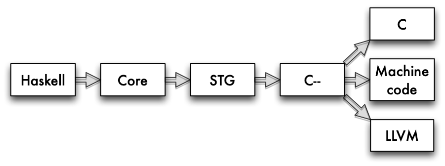
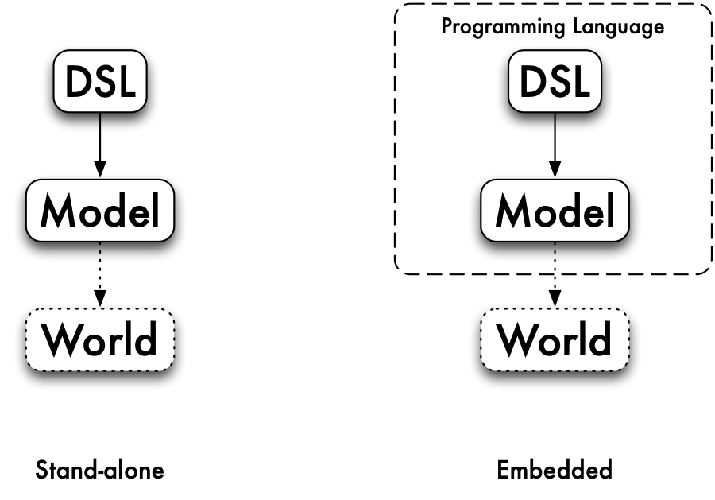
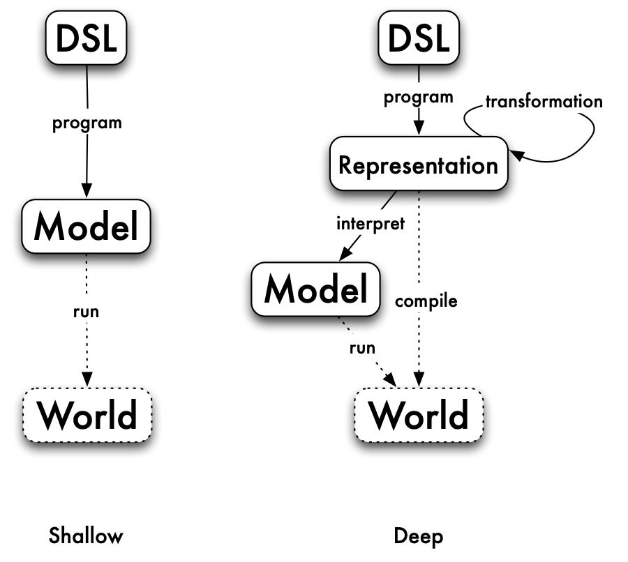
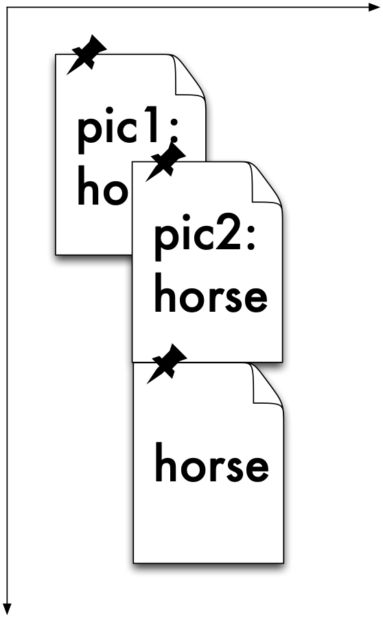
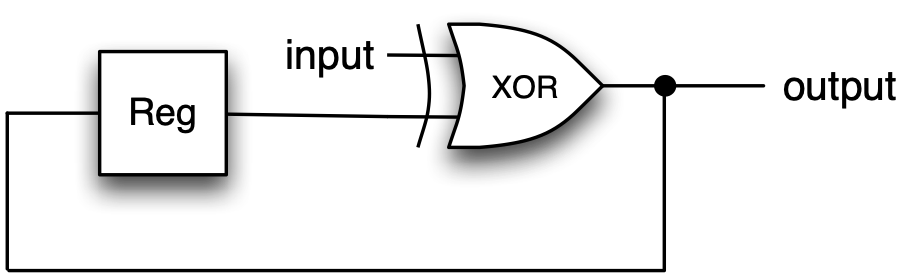

Domain-Specific Languages {#dsls}
=========================

One area where Haskell has been particularly successful is in building implementations of domain-specific languages (DSLs). Haskell algebraic types give a straightforward representation of language structure, and the rich collection of types, including functions as data, give us great flexibility in modelling phenomena, as we saw, for instance, with strategies in Rock - Paper - Scissors being modelled as functions. Moreover monads provide an additional expressive power.

This chapter first looks at what DSLs are, and why they are important. We then ask what it means to be a DSL in Haskell, and cover the different approaches to writing Haskell DSLs, both as combinator libraries and as monadic languages. We also discuss different types of embedding -- shallow and deep -- and contrast how these approaches apply in particular case studies, including pictures and regular expressions. We also revisit QuickCheck as a DSL for generating random data. We conclude by looking at a number of examples of practical Haskell DSLs.

Programming languages everywhere
--------------------------------

In using computers, we are at every point using programming languages.

-   As a programmer, we'll solve problems by writing programs in programming languages.

-   To use our program we need to run it, and to run a program on hardware, like an intel chip, we need to translate the high-level program into machine code that that chip can execute. A compiler like GHC works by successively transforming a source program written in Haskell into Haskell Core, a stripped-down functional programming language, then into STG, code for an abstract machine. Finally, via C\--, a C variant designed as 'high-level machine code', programs in C, LLVM and machine code are the output, as illustrated in [Languages in the Glasgow Haskell Compiler](#GHClanguages).

    <figure><label class="checkbox-label"><input class="checkbox-img" type="checkbox"><span class="img-wrapper"></span></label><figcaption>Languages in the Glasgow Haskell Compiler</figcaption></figure>

    <a id="GHClanguages"></a>
-   Network communications work through 'stacks' of protocols, each layer in the stack can be programmed using the services provided by the one below: effectively we have 'languages all the way down'[^1] to the hardware providing the communication.

-   In some cases the hardware itself will be programmable: a field-programmable gate array (FPGA) is a chip designed to be programmed after manufacture; all other hardware will have been designed and configured in a variety of programming languages, including VHDL and Lava.

### Domain-specific languages {#domain-specific-languages .unnumbered}

Haskell, Java, C, C\# and so forth are *general purpose programming languages*: in principle we can program anything we like in Haskell, Java or C. Other languages are designed to work in particular application areas: we call these **domain-specific languages** or DSLs. Let's look at some examples.

-   VHDL and Lava are DSLs for hardware design: instead of data types for strings, lists and so forth, the languages have data types representing transistors, logic gates, signals and so on. The results of processing them are circuit designs and layouts, to be fed to fabricators.

-   This book is being written using LaTeX, a text processing language. I write commands to express layout and other configurations and these, together with pictures (see below), get processed into a PDF file. PDF itself is a low-level language that also gets processed into bitmaps (on a display of some sort) or marks on paper (by printing).

-   Images can be described in 'little languages'. The Scalable Vector Graphics (SVG) standard provides a way of building high-quality images that can be rendered in a browser or into PDF. Bitmaps themselves are described in a particular data format.

-   We can see the spreadsheet language of Excel as the most widely used functional programming language in the world. Excel formulas describe how values in one call are calculated from values in others, and re-computing values is done automatically when values change.

Some DSLs serve to *model the world*: an Excel spreadsheet embodying a business plan will allow us to forecast future profits, for example. Others more directly *affect the world*: a DSL for robotic control will make machines move, while a VHDL design will ultimately become a complex physical artifact.

DSLs like VHDL, LaTeX and SVG have many of the features of general purpose languages. Their programs have structure, they have simple data types -- like numbers, as well as ways of naming sub-components for re-use: think of the 'cut and paste' to replicate a formula in Excel, or named circuits in VHDL.

On the other hand, they also have special types and constructs designed to make them work particularly well in their own domain. So, if you want to write a book, draw a picture, design a circuit or work out your cash flow, you will most likely use the DSL rather than starting from scratch to program the solution in Haskell or Java.

<figure><label class="checkbox-label"><input class="checkbox-img" type="checkbox"><span class="img-wrapper"></span></label><figcaption>Stand-alone and embedded DSLs</figcaption></figure>

<a id="DSLtypes"></a>
### Implementing Domain-Specific Languages {#implementing-domain-specific-languages .unnumbered}

So, suppose that we decide to implement a DSL using Haskell: how do we start? The first decision we have to take is whether or not the language is stand-alone or embedded, as pictured in [Stand-alone and embedded DSLs](#DSLtypes).

A language is **stand-alone** if it uses Haskell for its implementation, but nothing else. An example of this is the 'little language' for the calculator covered earlier in the book. Expressions in this language look like

```haskell
s:(23-s)
```

and we have to *parse* or translate them into Haskell to interpret them. Another way of seeing that this language is stand-alone is the fact that we could choose to implement it in any programming language whatever: the process would still involve parsing strings like `"s:(23-s)"` into that programming language to work with them. Another example of a stand-alone DSL would be a language for pictures with expressions like:

```haskell
Put pic1 above pic2, and this picture beside a copy of itself.
```

The advantages of implementing a stand-alone DSL are that we have complete control of the syntax of the language, and also of its semantics -- that is what programs in the language mean. We can also have complete control of any error messages that we send back to a user if things go wrong in some way: for instance if an expression is mal-formed.

On the other hand, we have to build the implementation up from scratch: the string `"23"` has nothing intrinsically to do with the number `23`, until our implementation defines that we should interpret that string as that particular number.

On the other hand, a DSL is **embedded** if it builds on features of the host language in which it is written. Going back to the examples, we can build a language for expressions using algebraic data types, building on the numbers built into Haskell. Doing this, we get numerical expressions like this

```haskell
Assign s (Op Sub (Lit 23) s)
```

and for pictures, we can use the normal syntax for function application and local definitions to describe pictures this way: <a id="localPicDef"></a>

```haskell
let 
  pic = pic1 `above` pic2   -- {(pic)}
in 
  pic `beside` pic
```

The advantage of the embedded approach is that we can 'piggy back' on the facilities of Haskell to make the language implementation much more straightforward. To use the language a user doesn't necessarily need to understand the whole of Haskell: for instance putting together pictures just needs `let` and (infix) function application.

On the other hand, we do lose the freedom to completely determine the syntax: for Haskell functions to be infix they do need to use `‘...‘` or operator syntax: we can't just say that a function should be infix. It is also possible that the error messages that come back from a DSL might 'leak' and say something about the host language which is not meaningful to the user.

On balance, it is the embedded approach which has been successful in Haskell, and that is what we'll concentrate on here; in the remainder of the chapter, when we say DSL, we'll mean 'embedded DSL'.

Why DSLs in Haskell?
--------------------

Why has Haskell been particularly successful as a language for embedding DSLs? A number of features combine to make it a good choice.

Purely functional.

:   Haskell functions are really functions in the mathematics sense: the output of a function is determined only by its inputs, and it has no side-effects. A Haskell function can therefore be used directly to model ways in which elements of a domain can be combined together into more complex objects.

    In the pictures example, there is a function which takes two pictures and returns the picture made up of one argument above the other Contrast this with an object-oriented programming language like Java. In OO style the combination operation would be a method on an object, which would destructively update that object in some way.

Higher-order.

:   Functions in Haskell are themselves data values, and so can be used to model elements of the domain of interest. The operations which work over the domain elements are then higher-order functions, which are often called **combinators**, as they are used to combine other functions. Many DSLs in Haskell use functions: parsers are represented by functions in [Lazy programming](17.md#lazy), strategies in Rock - Paper - Scissors are functions ([Playing the game: I/O in Haskell](8.md#io)). In both cases there are sets of combinators too: for parsers in [Case study: parsing expressions](17.md#parsing) and for strategies in [Functions as data: strategy combinators](12.md#strategyCombs).

    Again, this representation of functions as data is not accessible in an OO language like Java, and even if closures are added to Java at some point in the future it is unlikely that their will be so directly accessible as functions in Haskell.

Expressive type system.

:   Haskell's type system is both expressive and rigorous: it is possible to express complex constraints on the type of functions, and for these to be checked statically, so that no type errors occur at run time. The extensions to the type system implemented in GHC make the language more powerful, too.

    The effect of this is to make it easier for the types of a DSL to be reflected in the types of Haskell itself; obviously this is not always the case, since domain-specific constraints may be of a different nature, only allowing objects of the same 'size' or 'shape' to be combined, for instance, but Haskell is a better choice of language than one with a weaker type system.

Monadic `do` notation.

:   Haskell is purely functional, but also allows side-effecting computations to be described by programs in the `do` notation. Monads in Haskell can describe 'impure' aspects of languages such as I/O, naming or identifying objects, parallelism and so forth, and this gives a way for a pure language like Haskell to host not only pure DSLs but also more general DSLs.

Shallow and deep Embeddings
---------------------------

<figure><label class="checkbox-label"><input class="checkbox-img" type="checkbox"><span class="img-wrapper"></span></label><figcaption>Shallow and deep embeddings</figcaption></figure>

<a id="ShallowDeep"></a>
This section looks at the two main approaches to writing an embedded domain-specific language in Haskell.

### Shallow embeddings {#shallow-embeddings .unnumbered}

We have already seen that we can build a domain-specific language for pictures; indeed, we saw two different ways of modelling pictures in Haskell in [Two models of Pictures](1.md#two-models). First we saw that we could manipulate SVG pictures, as shown in [Viewing Pictures in a web browser](1.md#svgpix), and then we saw that pictures can be represented by lists of strings. Both of these DSLs are what are called **shallow** embeddings: the pictures are directly modelled by the SVG data or the list of strings, and the operations over pictures are functions over that data. Taking the list model, we have:

```haskell
Picture
type Picture = [[Char]]

horse :: Picture
horse = ...

above, beside :: Picture -> Picture -> Picture
above  = (++)
beside = zipWith (++)

flipH, flipV :: Picture -> Picture
flipH = reverse
flipV = map reverse

 ... etc. ...
```

### Using the `Picture` DSL {#using-the-picture-dsl .unnumbered}

We can use an embedded DSL like `Picture` in a number of ways. Using the API provided, together with *function application* we can describe objects of the domain like this:

```haskell
above horse horse :: Picture
```

We can also use *local definitions* in descriptions of more complex objects, like `(pic)`, which uses a `let` to define a sub-object used in the overall definition.

We can also define new functions over the domain too, as well as types which extend the original domain. In fact there are two possible ways of doing extending the functionality. We can either implement them on top of the existing functionality, as in the definition of `rotate`:

```haskell
rotate = flipV .\ flipH
```

or we can manipulate the underlying data types, like this:

```haskell
substChar
substChar x y
  = map (map (\z -> if z==x then y else z))
```

to give an entirely new operation.

DSL users don't have to be Haskell experts: users can build applicative expressions and define simple functions like `rotate` without being knowledgeable about Haskell; to define something like `substChar` requires more, but can still be achieved with relatively limited exposure to parts of the language relevant to the particular DSL.

### Deep embeddings {#deep-embeddings .unnumbered}

An alternative approach is to build a **deep** embedding. A deep embedding builds a syntactic **representation** of pictures, like this:

```haskell
Pic
data Pic = Horse |
           Above Pic Pic |
           Beside Pic Pic |
           FlipH Pic |
           FlipV Pic |
           ...
```

so that the corresponding `Pic` to the `Picture` above is

```haskell
Above Horse Horse :: Picture
```

Once we have a representation like this, we can do a whole lot of different things with it:

-   We can **interpret** or convert a `Pic` to a `Picture` like this:

    ```haskell
    interpretPic
    interpretPic :: Pic -> Picture
    interpretPic Horse = horse
    interpretPic (Above pic1 pic2)
      = above (interpretPic pic1)  (interpretPic pic2)
      ...
    ```

-   We can **transform** the `Pic`: we can remove redundant flips, and move all flips inwards through the other constructors, like this:

    ```haskell
    tidyPic
    tidyPic :: Pic -> Pic

    tidyPic (FlipV (FlipV pic)) 
      = tidyPic pic
    tidyPic (FlipV (FlipH pic)) 
      = FlipH (tidyPic (FlipV pic))   -- (†)

    tidyPic (FlipV (Above pic1 pic2))
      = Above (tidyPic (FlipV pic1)) (tidyPic (FlipV pic2)) 
    tidyPic (FlipV (Beside pic1 pic2))
      = Beside (tidyPic (FlipV pic2)) (tidyPic (FlipV pic1)) 
      
      ... similarly for FlipH ...
    ```

    (Note that equation (`†`) is designed to put all `FLipV`s inside the `FlipH` constructors).

    The result of this process is that we have located the flip operations at the pictures at the leaves of the tree. For many of these we will have efficient mechanisms for performing the operation: for example, over a symmetrical picture we need do nothing.

-   As well as transforming the `Pic` representation we can also **analyze** it. For instance, if we had the ability to overlay one picture on top of another, it would be possible to analyse whether the top picture completely overlaid the bottom one, and so whether the bottom one could be completely discarded from the representation.

-   Finally, because we have a representation of domain objects, we can directly **compile** these into executable 'machine code'. In the case of `Pic` this might be a compilation into PDF or PostScript, which can then be printed directly.

### Using the `Pic` DSL {#using-the-pic-dsl .unnumbered}

In using a deeply-embedded DSL like `Pic` we can *interpret* expressions, and so describe objects in the model just as we did for `Picture` earlier. To work directly with values of `Pic` type we need to understand appreciative syntax for `data` types, and in writing transformations and analyses we'll need this knowledge as well.

### Shallow or deep? {#shallow-or-deep .unnumbered}

If you are going to implement a DSL, should you make it shallow or deep? The advantages of the **shallow** embedding are, first, that it is a simple implementation of the semantics of the domain that you are interested in. Secondly, if we want to add new operations to the language, that's straightforward, as we saw when we discussed how to use an embedded DSL earlier.

On the other hand, a **deep** embedding allows us to do much more than simply manipulating the domain: we're able to manipulate representations, and so to transform, compile etc. On the other hand, extending a deep embedding is more complex: representation and all the interpretation, transformation and analysis all need to be extended to handle and addition to the representation.

A DSL for regular expressions
-----------------------------

Regular expressions give a way of writing down patterns in which letters or patterns which can be sequenced, repeated or chosen between. For instance, as we first saw in [Functions as data: recognising regular expressions](12.md#regExps), the regular expression `((a|b)(a|b))*` will match all strings of `a`s and `b`s of even length. This section introduced an implementation of regular expressions through the type

```haskell
type RegExp = String -> Bool
```

This is a typical example of a *shallow* DSL, mapping the domain directly to something that models their behaviour: here a function which returns `True` on those strings which match the pattern.

It is typical of a Haskell DSL because we have used *functions* to represent individual regular expressions, with higher-order functions, or *combinators*, representing the ways that regular expressions can be combined together, such as

```haskell
(|||), (<*>) :: RegExp -> RegExp -> RegExp
star :: RegExp -> RegExp
```

However, *all* we can do with this DSL is to check pattern matches, whereas a deep embedding allows us more. A deep embedding would be based on a `data` type definition like this

```haskell
RE:*::"|:
infixr 7 :*:
infixr 5 :|:

data RE = Eps |
          Ch Char |
          RE :|: RE |
          RE :*: RE |
          St RE |
          Plus RE
          deriving(Eq,Show)
```

where we have made fixity declarations which reflect the fixity of the operators, `St` binding more tightly than `:*:`, which binds more tightly than `:|:`. We can write an interpreter for `RE` into `RegExp`,

```haskell
interp
interp :: RE -> RegExp
```

which we leave as an exercise for the reader.

Regular expressions match strings, and `RegExp` is the type of *recognisers* for these expressions: using a recogniser we can tell whether or not a particular string matches a given expression.

### Enumerating {#enumerating .unnumbered}

Instead of this writing a recogniser, let's map a regular expression into a list of *all* the strings that it matches. These lists might be infinite, but because Haskell uses lazy evaluation, that's not a problem.

```haskell
enumerate
enumerate :: RE -> [String]

enumerate Eps = [""]

enumerate (Ch ch) = [[ch]]

enumerate (re1 :|: re2)
    = enumerate re1 `interleave` enumerate re2

enumerate  (re1 :*: re2)
    = enumerate re1 `cartesian` enumerate re2

enumerate (St re)
    = result 
      where
        result =
            [""] ++ (enumerate re `cartesian` result)
```

Let's step through this one clause at a time.

-   The only string matching `Eps` is the empty string, `""`.

-   The only string matching `(Ch ch)` is the string, containing `ch` on its own, `[ch]`.

-   The strings matching `(re1 :|: re2)` either match `re1` or `re2`, so the list we're looking for is got by putting together the lists for `re1` and `re2`. Because these lists might be infinite, we can't just use `++` to join them together, so instead we will interleave the contents, like this:

    ```haskell
      interleave :: [a] -> [a] -> [a]

      interleave [] ys     = ys
      interleave (x:xs) ys = x : interleave ys xs
    ```

-   The strings matching `(re1 :*: re2)` are of the form `x++y` where `x` matches `re1` and `y` matches `re2`. So, we need to generate all possible combinations of elements from the two listings.

    ```haskell
      cartesian :: [[a]] -> [[a]] -> [[a]]

      cartesian [] ys = []
      cartesian (x:xs) ys 
          = [ x++y | y<-ys ] `interleave` cartesian xs ys
    ```

    Supposing that the first argument is `x:xs` then we get all the combinations by taking `x` with all choices from `ys`, and interleaving the results with all combinations from `xs` and `ys`. To give an example,

    ```haskell
      *RegExp> cartesian [ "", "a", "aa", "aaa"] ["", "b", "bb"]
      ["","a","b","aa","bb","ab","aaa","abb","aab","aaab","aabb","aaabb"]
    ```

-   Finally, the definition for `(St re)` exactly mirrors the informal definition of 'star `e`', that is 'either match the empty string, or match `e` followed by star `e`'.

> **Value recursion: extending the domain**
>
> Haskell uses lazy evaluation, and so Haskell `data` types contain partial and infinite values. For example, the string
>
> ``` {.haskell}
> abs = "ab" ++ abs
> ```
>
> is a perfectly good member of the `String` type: our enumeration will not contain these values, and only contains *finite* strings.
>
> The `RE` type also has recursively defined members, like this:
>
> ``` {.haskell}
> anbn = Eps :|: (a :*: (anbn :*: b)) 
> ```
>
> which describes this set:
>
> ``` {.haskell}
> *RegExp> enumerate anbn
>
>
> ["","ab","aabb","aaabbb","aaaabbbb","aaaaabbbbb",
>
>  
> "aaaaaabbbbbb","aaaaaaabbbbbbb","aaaaaaaabbbbbbbb",
>
>  
> "aaaaaaaaabbbbbbbbb","aaaaaaaaaabbbbbbbbbb",...
> ```
>
> It is well known that this set *cannot* be described by a regular expression ([Aho et al. 2006](bibliography.md#dragon2ed)), so what is going on here? What we have effectively is an *infinite regular expression*, and so that goes beyond what we can usually write as a regular expression.
>
> This extension is a particular consequence of using a lazy language; it would not be the case in a strict language like ML or F\#. On the other hand, embedding a DSL in a general purpose language will extend its capability, because it is in a more powerful context: the point here is that this deep embedding adds elements to the representation itself.

### Extending the DSL {#extending-the-dsl .unnumbered}

We have given the minimal set of regular expression constructors, but in practice there are many more in use, such as `(e)+` for *one or more occurrences of `e`* and `(e)?` for *zero or one occurrences of `e`*. How could we extend the DSL to include 'plus', say?

-   We can define a *function* to define 'plus' from other constructors:

    ```haskell
    plus :: RE -> RE
    plus re = re :*: St re
    ```

-   We can define a new *constructor*, adding this to `RE`:

    ```haskell
    data RE = ... |
              Plus RE
    ```

What are the advantages and disadvantages of these two proposals?

Function `plus`.

:   This option has the advantage of simplicity: we don't need to extend any other functions once we have added this definition. The disadvantage is that we are always committed to processing `(e)+` as `e` followed by `(e)*`.

Constructor `Plus`.

:   This option has the disadvantage that we have to extend all the functions which deal with the `RE` type to include the new case of `Plus re`. The advantage of this is that we then have the option to deal with this *differently* from simply translating it out. For instance, we could make sure that a 'plus' was pretty printed as `"(e)+"` rather than `"e(e)*"`, which would be the result if we were to take the first option.

### Transformation and 'smart constructors' {#transformation-and-smart-constructors .unnumbered}

Regular expressions give us a lot of different ways of writing the same thing, and often we can *simplify* regular expressions from their orginal form. Some simple examples include `((e)*)*` and `(e)*`; `((e)+)*` and `(e)*`; `((e)*)+` and `(e)*`; `((e)+)+` and `(e)+`; `(e|e)` and `e`. We can describe these simplifications as a function,

```haskell
simplify
simplify :: RE -> RE

simplify (St (St re))     = simplify (St re)
simplify (St (Plus re))   = simplify (St re)
simplify (Plus (St re))   = simplify (St re)
simplify (Plus (Plus re)) = simplify (Plus re)
simplify (re1 :|: re2) =
    if sre1==sre2 then sre1 else (sre1 :|: sre2) 
          where
            sre1 = simplify re1; sre2 = simplify re2
simplify re = re
```

With this approach we build complex expressions, and then simplify them afterwards. An alternative is never to build the complicated forms in the first place, and we do this by defining **smart constructors** which do the simplification as they are applied. For example, we can write

```haskell
starC :: RE -> RE
starC (St re) = re
starC (Plus re) = re
starC re = (St re)
```

so that nested stars are never built:

```haskell
*RegExp> starC (starC (starC (Ch 'a')))
St (Ch 'a')
```

As well as simplifying data, smart constructors can be used to enforce constraints on data, so that, for instance, in building geometrical shapes, lengths of the sides are positive, and the triangle inequality on the three sides of a triangle hold too:

```haskell
triangleC :: Float -> FLoat -> Float -> Shape
triangleC a b c
  | a>0 && ... && triEq = Triangle a b c
  | otherwise = error ("Illegal triangle: " ++ show a ++ ...)
    where triEq = ...
```

The DSLs we have looked at so far are all functional; in the next section we will see that we can also add other aspects to a DSL, by making it monadic.

**Exercises**

1.  Define the interpreter function for `RE` into `RegExp`,

    ```haskell
    interp :: RE -> RegExp
    ```

    You should use the functions already defined over `RegExp` to help you in doing this.

2.  Choose a suitable notation for writing down regular expressions as strings (e.g. as used in [Functions as data: recognising regular expressions](12.md#regExps)) and then define functions to parse these strings into `RE`, and to pretty-print elements of `RE` as strings:

    ```haskell
    parseRE  :: String -> RE
    prettyRE :: RE -> String
    ```

    Can you define QuickCheck properties that you would expect these functions to satisfy?

3.  Define a recursive regular expression which will generate all palindromes built from `a`s and `b`s.

4.  \[Harder\] Can you give a recursive regular expression which generates all (non-recursive) regular expressions?

5.  \[Harder\] Is there any limit to what else you can define using recursive regular expressions: can you, for example, define all the strings which are strings of `a`s then `b`s, and then `c`s, each of the same length, as in `aaabbbccc`?

6.  Show how to extend the DSL to include these constructs:

    -   To say that an expression is matched a given *number* of times.

    -   To match something in a *range* of characters, e.g. `’a’` to `’z’`.

    -   To match a character in this *collection* of characters.

    -   To match a character that is *not* in this collection of characters.

7.  \[Harder\] Show how to extend the DSL to include these constructs:

    -   To say that an expression should match *both of* these two expressions.

    -   To *fail to* match this regular expression.

Monadic DSLs
------------

The domain specific languages that we have looked at so far are all *functional* DSLs: we embed the language as a functional API or a concrete representation of the language as a `data` type, and then build expressions and functions over that.

We have seen in [Programming with monads](18.md#actions) that the `do` notation gives a way of dealing with different kinds of computation: non-deterministic, side-effecting, state-based and so on. As important, the notation gives us a way of *naming* objects within our DSL, and we begin this section by discussing that in the context of a language of pictures. We will the look at other examples of *monadic* DSLs with non-functional behaviour, including the QuickCheck data generation language -- where random values are generated -- and hardware description languages.

### Naming within a DSL {#naming-within-a-dsl .unnumbered}

Haskell provides us with ways of naming *values*, through top-level and local definitions. A typical expression may take the form

```haskell
let x=horse; y=horse in
  x `above` y
```

in which `x` and `y` appear to refer to the left-hand and right-hand horses in a picture. However, this expression has exactly the same meaning as

```haskell
let x=horse in
  x `above` x
```

or indeed the simple `horse ‘above‘ horse`.

How can we build a DSL so that it allows us to *identify* particular components and use these names in the language? Let's look at the case study of a simple DSL to *lay out pictures*. We'd like to

-   *name* pictures as they are positioned, and

-   *use those names* to position other pictures, by placing their `NW` corner.

An example is shown in [Positioned images](#PositioningImages) where

-   `pic1` is positioned at coordinates (10,10),

-   `pic2` is positioned at the `Center` of `pic1`,

-   the third (unnamed) `horse` is positioned at the `SW` corner of `pic2`.

The names will have to be added to the language somehow, and one option is to build a data structure of the form

```haskell
[(Name, Picture, Position)]
```

to keep track of all the information. However, in this case we -- as programmers -- will be responsible for checking that names are defined before they are used, that names are defined uniquely and so forth. We leave it as an exercise for you to try doing this.

<figure><label class="checkbox-label"><input class="checkbox-img" type="checkbox"><span class="img-wrapper"></span></label><figcaption>Positioned images</figcaption></figure>

<a id="PositioningImages"></a>
The alternative is to use a *monadic* DSL, so that we can write the program to position the pictures just like this:

```haskell
do
  pic  <- placeId horse (10,10)
  pic2 <- positionId horse pic Center
  position horse pic2 SW
```

The underlying implementation is the `(Def a)` monad, a state monad (as described in [Example: monadic computation over trees](18.md#monadicTrees)) in which a unique identifier (an `Id`) is associated with each picture that has been positioned. The user interface to the monad is provided by the functions:

```haskell
placeId :: Picture -> Point -> Def Id
place   :: Picture -> Point -> Def ()

positionId :: Picture -> Id -> Position -> Def Id
position   :: Picture -> Id -> Position -> Def ()
```

The `place` functions put a picture at a particular position; the `position` functions position a picture relative to a named picture. In each case there are two variants: one returning an `Id`, the other not. We leave the implementation of this as an extended exercise.

This approach we use here is of value wherever we need to be able to identify instances of objects within a DSL; other examples include identifying instances of components in a hardware layout DSL, where the same component is replicated many times in a design. Monads are of use within DSLs for more than simply naming, and we turn to the general case now.

**Exercises**

1.  Define the state monad `(Def a)` which implements the information about the position of pictures, and in particular give the `instance` declaration which establishes that this is a monad.

2.  Define the functions `placeId`, `place`, `positionId` and `position` over the `(Def a)` monad.

3.  Define a function or functions which allow you to extract the pictures from the `(Def a)` monad so that they can be rendered somehow.

4.  \[Harder\] Give an extension to regular expressions so that sub-components can be *named* and the names used subsequently in the expression. An informal example would be

    ```haskell
    ((a|b)*:x)a<x>
    ```

    which should match an arbitrary string of `a`s and `b`s (which is named `x`) followed by an `a` and then a repeat of the string `x`. For example; `abbaaabba` would match this regular expression, but `abbaabba` would not.

    You will first need to think about how to make this idea 'watertight' and then for the best way to implement a DSL embodying this.

DSLs for computation: generating data in QuickCheck {#qcGens}
---------------------------------------------------

Many domain-specifc languages allow for different kinds of 'computational effects': that might be because the language goes beyond the purely functional -- in embodying state, exceptions or whatever -- or that it affects the world directly: think of a robotic control language. In this section we'll look at the example of QuickCheck, which has at its heart a DSL to describe *random* or *arbitrary* data.

Data is generated in QuickCheck using Haskell's random number generation. The principal concept is that of a *generator*,

```haskell
Arbitraryarbitrary
class Arbitrary a where
  arbitrary :: Gen a
```

where `(Gen a)` is a monad, returning an arbitrary value of type `a`. The underlying representation is a function from a random number to the type `a`; the monad does the 'plumbing' of passing around random values appropriately.

QuickCheck comes with instances of `Arbitrary` for many built-in types. You can see a sample for a particular type by typing, here for the `Int` type:

```haskell
sample
sample (arbitrary :: Gen Int)
```

where the type signature has to be specified to show which type you are interested in.

### Simple data types {#simple-data-types .unnumbered}

```haskell
Info
data Info = Number Int | Email String
            deriving (Eq, Show)

instance Arbitrary Info where
    arbitrary =
        do
          boo <- arbitrary
          if boo
            then do
              int <- arbitrary
              return (Number int) 
            else do
              string <- arbitrary
              return (Email string)
```

<figcaption>Generating values of type `Info`</figcaption>

<a id="InfoQC"></a>
If we define types for ourselves, then we need to generate random data for them. Let's look at some examples:

```haskell
Card
data Card = Card Int String
            deriving (Eq,Show)

instance Arbitrary Card where
    arbitrary =
        do
          int    <- arbitrary -- of type Gen Int
          string <- arbitrary -- of type Gen String
          return (Card int string)
```

To generate a random `Card` we need both a random `Int` and a random `String`. We use a `do` block to do this:

-   first we generate an arbitrary integer, and call it `int`;

-   next we generate an arbitrary string, and call it `string`;

-   finally we `return` the value `(Card int string)`.

Note here that we're using the notation to *name results of computations*, that is the two random values that have been generated. We have given the types of the generators in comments, we don't have to make this part of the program because the type inference mechanism can detect their types from the way that the result is constructed.

```haskell
arbExpr
arbExpr :: Int -> Gen Expr

arbExpr 0 = 
    do int <- arbitrary
       return (Lit int)

arbExpr n
    | n>0 =
        do
          pick <- choose (0,2::Int)
          case pick of
            0 -> do 
              int <- arbitrary
              return (Lit int)
            1 -> do 
              left  <- subExp
              right <- subExp
              return (Add left right)
            2 -> do 
              left  <- subExp
              right <- subExp
              return (Sub left right)
        where
          subExp = arbExpr (div n 2)
```

<figcaption>Generating 'sized' expressions</figcaption>

<a id="arbExpr"></a>
What happens in the case when there is more than one alternative in the `data` type definition? We give an example in [Generating values of type Info](#InfoQC). In this case we pick between the two cases by choosing an arbitrary Boolean, `boo`: in the `True` case we generate a `(Number int)` and otherwise an `(Email string)`.

### Recursive generators {#recursive-generators .unnumbered}

In a similar way we can declare an instance for a list type that we define ourselves:

```haskell
data List a = Empty | Cons a (List a)
              deriving (Eq, Show)

instance Arbitrary a => Arbitrary (List a) where
    arbitrary = ... exercise ...
```

> **Showing functions with QuickCheck**
>
> To use QuickCheck with randomly-generated *function* inputs QuickCheck needs to be able to `show` the functions that it generates. One way of doing this is
>
> ``` {.haskell}
> \ \ instance Show (a->b) where
>
> \ \ \ \ show f = "<function>"
> ```
>
> but that doesn't tell us anything about the particular function. Instead, we can use random data generated by QuickCheck as a sample input to a function, and show the corresponding input/output pairs for the function. We use the QuickCheck function
>
> ``` {.haskell}
> \ \ sample' :: Gen a -> IO [a]
> ```
>
> to generate a list of samples within the `IO` monad, and process it like this
>
> ``` {.haskell}
> \ \ sampleFun :: (Arbitrary a, Show a, Show b) => 
>
> \ \ \ \ \ \ \ \ \ \ \ \ \ \ \ \ \ \ \ \ \ \ \ \ \ \ \ \ \ \ \ \ (a -> b) -> IO String
>
> \ \ sampleFun f =
>
> \ \ \ \ \ \ do
>
> \ \ \ \ \ \ \ \ inputs <- sample' arbitrary
>
> \ \ \ \ \ \ \ \ let list = [ (a, f a) | a <- inputs ]
>
> \ \ \ \ \ \ \ \ return (showMap list)
> ```
>
> where `showMap` is used to show the list of pairs (an exercise). To make a `Show` instance we need to extract the `String` from the `IO` monad. We use the function
>
> ``` {.haskell}
> \ \ unsafePerformIO :: IO a -> a
> ```
>
> which is defined in `System.IO.Unsafe`. This function should be used with care. Finally we can say
>
> ``` {.haskell}
> \ \ instance (Arbitrary a, Show a, Show b) => Show (a -> b) where
>
> \ \ \ \ show = unsafePerformIO . sampleFun
> ```
>
> This code is contained in the `QCfuns.hs` module distributed with the book.

> **Testing higher-order functions in QuickCheck**
>
> Using the `Show` instance for functions in the module `QCfuns.hs` we can now *see* the functions that falsify a property such as
>
> ``` {.haskell}
> \ \ prop_map f g xs =
>
> \ \ \ \ map (f::Int->Int) (map (g::Int -> Int) xs) == map (g.f) xs
> ```
>
> when we test it using QuickCheck:
>
> ``` {.haskell}
> \ \ *QC> quickCheck prop_map
>
> \ \ *** Failed! Falsifiable (after 3 tests and 2 shrinks):   
>  
> \ \ (1|->1) ,(0|->0) ,(-1|->0) ,\ \ \ ... function f ...
>
> \ \ (1|->-1) ,(-1|->0) ,(-2|->0) , ... function g ...
>
> \ \ [1]
> ```
>
> (where some of the function values have been elided). It is not difficult to see how the functions do indeed give different results on `1` when applied in different composition orders. Of course, if we replace `g.f` by `f.g` in the property, then it passes all the tests.
>
> Without the type annotations this would be a polymorphic property, and GHCi would be unable to decide for which types to generate the data, so the type annotations are essential here.

While this approach works for the list type, we need to do something more sophisticated in the case of generating data for arbitrary recursive types, such as the expressions used in the calculator case study.

Here we need to control the *size* of the values generated, so that the recursion arising from generating expressions within expressions will terminate. We do this by stating

```haskell
instance Arbitrary Expr where
    arbitrary = sized arbExpr
```

where the function has type `arbExpr :: Int -> Gen Expr`, generating expressions based on a size parameter. The `sized` function does the work of generation to make sure that termination happens, assuming that we write a sensible definition for `arbExpr`, as shown in [Generating `sized' expressions](#arbExpr). The crucial point here is that the recursively generated sub-expressions come from the `subExpr` generator, which is defined to be `arbExpr (div n 2)` rather than `arbExpr n`.

### Going further with QuickCheck {#going-further-with-quickcheck .unnumbered}

We've used the basics of QuickCheck in giving generators for simple types. QuickCheck also provides facilities for controlling the distribution of data by specifying the (relative) frequency of generators, using

```haskell
frequency
frequency :: [(Int, Gen a)] -> Gen a
```

For example, the generator

```haskell
frequency [(1,gen1),(2,gen2)]
```

We generate values from the `gen1` and `gen2` in the ratio 1:2, so 33% of the values will come from `gen1`. We can use this to give a variant of the generator for expressions presented in [Generating `sized' expressions](#arbExpr): <a id="arbExpr2"></a>

```haskell
arbExpr :: Int -> Gen Expr

arbExpr 0 = liftM Lit arbitrary

arbExpr n = frequency
    [(1, liftM Lit arbitrary),
     (2, liftM2 Add subExp subExp),
     (2, liftM2 Sub subExp subExp)]
        where
          subExp = arbExpr (div n 2)
```

Note that we have used

```haskell
liftMliftM2
liftM  :: (Monad m) => (a -> b) -> m a -> m b
liftM2 :: (Monad m) => (a -> b -> c) -> m a -> m b -> m c
```

which 'lift' an operation over values to the corresponding function over monadic values. The values generated by this new generator for `Expr`s will be larger, as only 20% at any level will be literals (rather than 33% in our earlier definition).

> **Overloading and QuickCheck**
>
> As we saw when we looked at `infoCheck` in [Overloading, type classes and type checking](13.md#classes), it is possible to use overloading to make a DSL easier to use: instead of a whole collection of `infoCheckN` functions of different types, we were able to overload the name `infoCheck` to denote them all; the same is done in defining`quickCheck`.
>
> If it were possible to overload constructor names, then we could avoid using `liftM` etc. in defining the `arbExpr` generator; we could manage this instead by defining overloaded functions `lit` and so forth, mirroring the constructors, and so hiding the 'plumbing' underlying the monadic language.

QuickCheck has had a wide impact on programming practice in Haskell and other languages. The original paper was published in 2000, and in 2010 it was awarded an award for being the most influential paper presented at the International Conference on Functional Programming in 2000. The citation reads

> This paper presented a very simple but powerful system for testing Haskell programs that has had significant impact on the practice of debugging programs in Haskell. The paper describes a clever way to use type classes and monads to automatically generate random test data. QuickCheck has since become an extremely popular Haskell library that is widely used by programmers, and has been incorporated into many undergraduate courses in Haskell. The techniques described in the paper have spawned a significant body of follow-on work in test case generation. They have also been adapted to other languages, leading to their commercialisation for Erlang and C.

More information about using QuickCheck can be found in a number of places, including in the original paper on QuickCheck, ([Claessen and Hughes 2000](bibliography.md#quickCheck)), as well as follow-up papers ([Claessen and Hughes 2002](bibliography.md#monadicQC); [Claessen and Hughes 2003](bibliography.md#specBasedTesting)); in other texts on programming, including ([O'Sullivan et al. 2008](bibliography.md#realWorldHaskell)), and online at `URL`. Note that there are a small number of differences between QuickCheck 1 and 2; we use version 2 in this text.

**Exercises**

1.  Define a function which will give a pretty printed version of a sample from the generator for expressions.

2.  Define QuickCheck generators for the types used in the interactive version of the calculator, as described in [The calculator](18.md#interactiveCalc). Define properties that you would expect (parts of) the calculator to satisfy, and test them using your generators and QuickCheck.

3.  Define a function

    ```haskell
      showMap :: (Show a, Show b) => [(a,b)] -> String
    ```

    so that `[(1,1),(0,0),(-2,0)]` is shown as

    ```haskell
      (1|->1) ,(0|->0) ,(-2|->0)
    ```

Taking it further
-----------------

This chapter is intended to be an introduction to how DSLs are written in Haskell. We have been able to discuss the two major ideas underlying Haskell DSLs: first, we have seen that having functions as data allows us to use functions to represent complex behaviours from the domain. Secondly, we have seen that monads -- and in particular the `do` notation -- allow us to write languages with 'effects', such as naming, side-effects or non-determinacy, safely within Haskell.

However, we have only really scratched the surface of this topic. Let's look at the particular example of the Paradise DSL ([Augustsson et al. 2008](bibliography.md#paradise)), a two-stage language for building components which are used for pricing financial products. The first stage constructs models of these components; the second compiles them into Excel or .NET code, for integration with other financial modelling tools. In order to gain *type safety*, the implementation uses phantom types to avoid constructing objects which are ill-typed from the point of view of the domain (even if they are perfectly OK in Haskell). For *ease of use* numerical constants and operators are overloaded -- using Haskell classes -- so that they apply not only to numbers but also to numerical computations: this avoids introducing the `liftM` functions we saw in the previous section. The full implementation uses facilities well beyond the Haskell 2010 standard, many of which are implemented in GHC, and this is by no means unusual for larger-scale DSLs.

Naming in DSLs can be handled in many different ways. We saw already that using a monadic approach gives us naming, but names in a monad aren't given recursive definitions. Looking at the example of a small logic circuit, note that the output from the XOR gate is fed back into the gate after a delay.

<figure><label class="checkbox-label"><input class="checkbox-img" type="checkbox"><span class="img-wrapper"></span></label></figure>

When this is programmed in a typical hardware description DSL (using a *shallow* embedding) will appear like this:

```haskell
parity :: Bit -> Bit
 
parity input = output
  where 
  output = xor (delay output) input
```

How to observe the sharing of the `output` value? One approach is to allow a 'recursive `do`' which builds recursive value bindings within a monad, so allowing recursion in the DSL; ([Gill 2009](bibliography.md#typeSafeSharing)), discusses this and other approaches, proposing a new mechanism based on using stable names and the IO monad.

Other example DSLs in Haskell include HaXML ([Wallace and Runciman 1999](bibliography.md#haxml)) for XML programming, Orc ([Launchbury and Elliott 2010](bibliography.md#orc)) for concurrent orchestration and Lava ([Bjesse et al. 1998](bibliography.md#lava)) for hardware description. A list of many more papers on specific DSLs and general implementation approaches can be found on the Haskell Wiki.

[^1]: See the entry for \"Turtles all the way down\" in Wikipedia.
