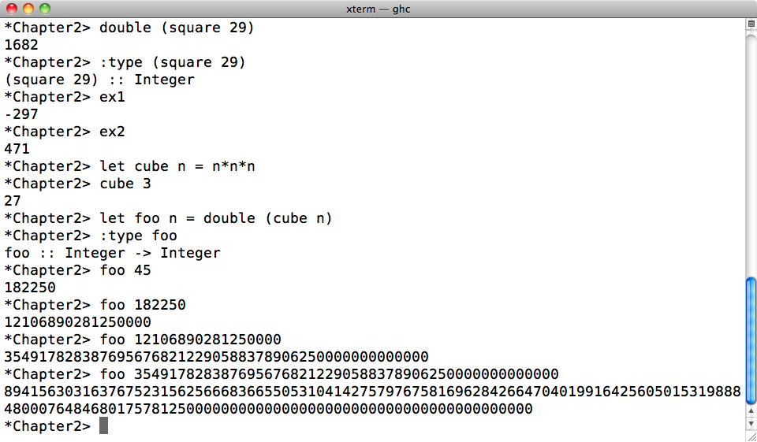
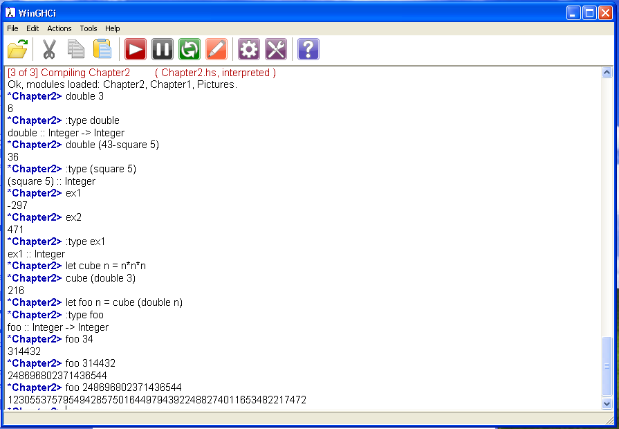
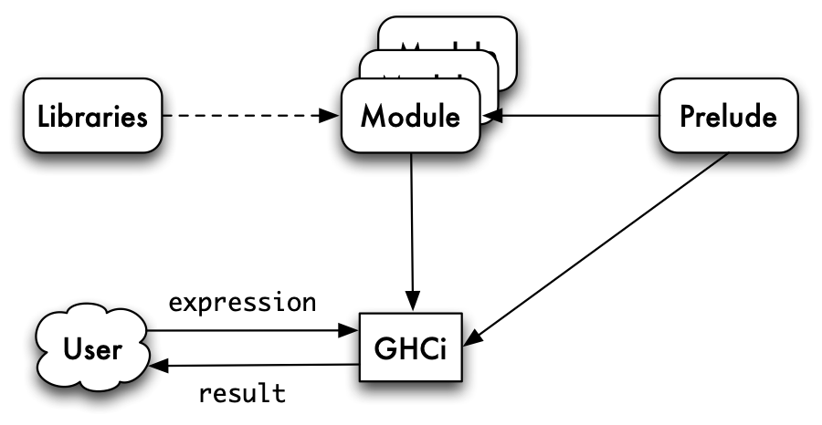
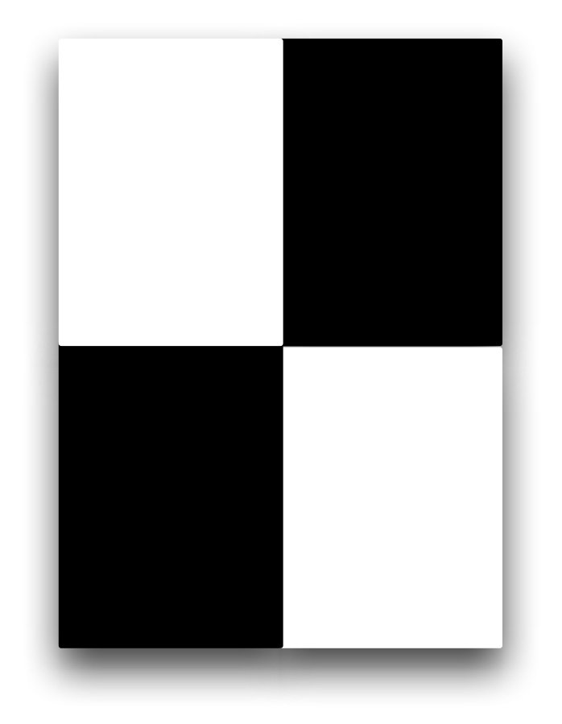
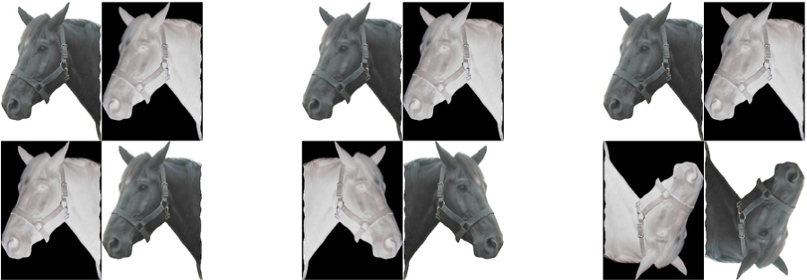
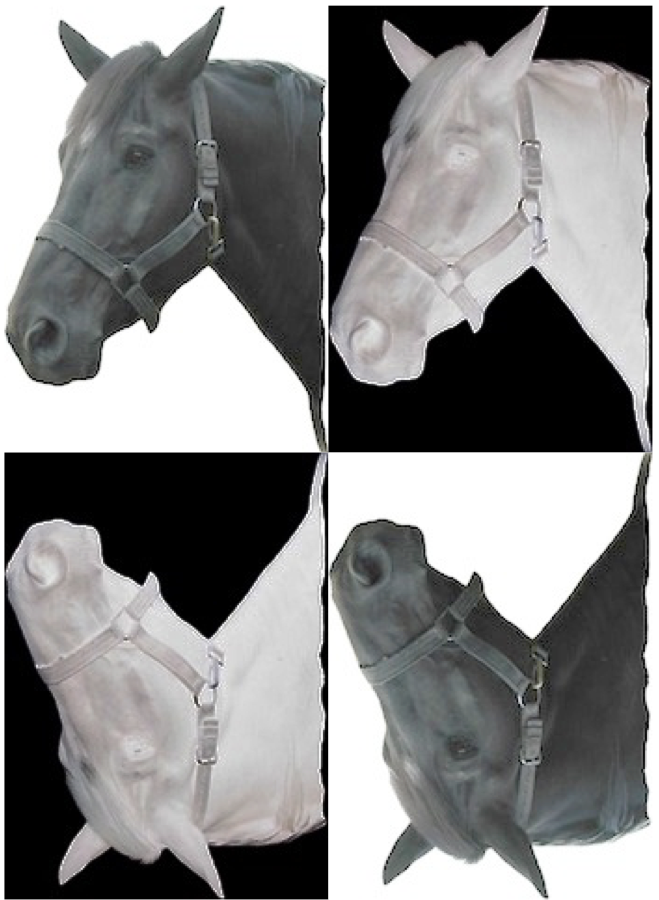

Getting started with Haskell and GHCi {#getStart}
=====================================

[Introducing functional programming](1.md#intro) introduced the foundations of functional programming in Haskell. We are now ready to use GHCi to do some practical programming, and we introduce it here.

In beginning to program we will also learn the basics of the Haskell module system, under which programs can be written in multiple, interdependent files, and which can use the 'built-in' functions in the prelude and libraries.

Our programming examples will concentrate on using the `Picture` example introduced in [Introducing functional programming](1.md#intro) as well as some simple numerical examples. In support of this we will look at how to get hold of the programs and other background materials for the book, as well as how to obtain and install GHCi as a part of the Haskell Platform.

We conclude by briefly surveying the kinds of error message that can result from typing something incorrect into GHCi.

```haskell
FirstScript.hs
{- #########################################################
        FirstScript.hs
        Simon Thompson, August 2010.
######################################################### -}

module FirstScript where

--      The value size is an integer (Integer), defined to be 
--      the sum of twelve and thirteen.

size :: Integer
size = 12+13

--      The function to square an integer.

square :: Integer -> Integer
square n = n*n

--      The function to double an integer.
        
double :: Integer -> Integer
double n = 2*n

--      An example using double, square and size.
         
example :: Integer
example = double (size - square (2+2))

```

<figcaption>An example script, `FirstScript.hs`.</figcaption>

<a id="FirstScript"></a>
A first Haskell program
-----------------------

We begin the chapter by giving a first Haskell program or **script**, which consists of the numerical examples from [Introducing functional programming](1.md#intro). This is the file `FirstScript.hs`, shown in Figure [An example script, FirstScript.hs.](#FirstScript). Haskell scripts are stored in files with the **extension** '`.hs`'.

As well as definitions, a script will contain comments. A **comment** in a script is a piece of information of value to a human reader rather than to a computer. It might contain an informal explanation of how a function works, how it should or should not be used, the overall design philosophy of a library and so on. Everything in a program file is interpreted as program text, *except* where it is explicitly indicated that it is a comment.

Comments are indicated in two ways. The symbol '`--`' begins a comment which occupies the part of the line to the right of the symbol. Comments can also be enclosed by the symbols '`{-`' and '`-}`'. These comments can be of arbitrary length, spanning more than one line, as well as enclosing other comments; they are therefore called **nested comments**.

Using Haskell in practice
-------------------------

The Glasgow Haskell Compiler (GHC) is an industrial-strength compiler for Haskell. **GHC interactive (GHCi)** is an interactive interpreter based on GHC, which supports program development by allowing programmers to evaluate Haskell expressions interactively as they develop programs.

 <label class="checkbox-label wrapfigure-left"><input class="checkbox-img" type="checkbox"><span class="img-wrapper"></span></label>

GHC and GHCi are available stand alone, but they also come as part of the **Haskell Platform**. In addition to GHC and GHCi, this contains a selection of standard libraries and tools for Haskell. Included in the tools is `cabal`, a package for distributing Haskell code and libraries, and which we use for distributing the code for the book; we come back to `cabal` in [Programming with lists](6.md#progLists). The platform also includes tools for interfacing with programs written in other languages, as well as `haddock` for documentation generation.

The libraries included with the Haskell Platform give comprehensive support for practical programming in Haskell. The home page for the platform is here:

` http://hackage.haskell.org/platform/`

and full details of the libraries in the platform are found at

` http://hackage.haskell.org/platform/contents.html`

Further information about downloading and installing the Haskell Platform may be found in Appendix [Haskell practicalities](otherHs.md#OtherHS); we discuss how to find out more about the functions and libraries in the Haskell Platform in [Programming with lists](6.md#progLists).

<figure><label class="checkbox-label"><input class="checkbox-img" type="checkbox"><span class="img-wrapper"></span></label><figcaption>A GHCi session in Mac OS X</figcaption></figure>

<a id="GHCiSessionMac"></a>
<figure><label class="checkbox-label"><input class="checkbox-img" type="checkbox"><span class="img-wrapper"></span></label><figcaption>A WinGHCi session in Windows XP</figcaption></figure>

<a id="WinGHCiSession"></a>
Using GHCi
----------

In this text we describe the terminal-style interface to GHCi, illustrated in Figure [A GHCi session in Mac OS X](#GHCiSessionMac), because this is common to Windows, Mac OS X and Linux. Once they have understood how GHCi itself works, experienced PC users should have little difficulty in using the WinGHCi system, shown in Figure [A WinGHCi session in Windows XP](#WinGHCiSession), which gives a Windows-style interface to the GHCi commands.

### GHCi documentation {#ghci-documentation .unnumbered}

On Mac OS X documentation for GHCi and other systems is found at

`file:///usr/share/doc/ghc/html/index.html`

Linux systems differ: for example, in Ubuntu 9.10 the path to the Haskell documentation is:

`/usr/share/doc/ghc6-doc`

Links to the documentation are found in the Haskell Platform program group on Windows systems.

### Starting GHCi {#starting-ghci .unnumbered}

To start GCHi on OS X and Linux, type `ghci` to the prompt; to launch GHCi using a particular file, type `ghci` followed by the name of the file in question, as in

```haskell
ghci
ghci Chapter2
```

On a Windows system, GHCi is launched by choosing it from the appropriate place on the Start menu; if you have the standard installation of the Haskell Platform it will be in the Haskell Platform program group. Double clicking a Haskell file will open that file in GHCi.[^1]

Haskell scripts carry the extension `.hs`; only such files can be loaded, and their extensions can be omitted when they are loaded either when GHCi is launched or by a `:load` command within GHCi.

### Evaluating expressions in GHCi {#evaluating-expressions-in-ghci .unnumbered}

As we said in [Expressions and evaluation](1.md#exprEval), GHCi will evaluate expressions typed at the prompt. We see in Figure [A GHCi session in Mac OS X](#GHCiSessionMac) the evaluation of `double (square 29)` to `1682`, like this

```haskell
*Chapter2> double (square 29)
1682
*Chapter2>
```

where we have indicated the machine output by using a slanted font; user input appears in unslanted form. The **prompt** here, `*Chapter2>`, will be explained in [Modules](#introModules) below. As can be seen from the examples, we can evaluate expressions which use the definitions in the current script. In this case it is `Chapter2.hs`.

One of the advantages of the GHCi interface is that it is easy to experiment with functions, trying different evaluations simply by typing the expressions at the keyboard. If we want to evaluate a complex expression, we could add it to the program, as in definition

```haskell
cube :: Integer -> Integer
cube n = n*n*n
```

but we can also input these definitions directly into GHCi by prefacing them with the keyword `let`, as seen in Figure [A GHCi session in Mac OS X](#GHCiSessionMac). Of course, this definition will be lost when we close GHCi, so if we want to keep a record of it, then we should add it to a Haskell module as well.

  ------------------ --------- -----------------------------------------------------------------------------------------------------------------------------------------------------------------------
                               
                               
  `:load Parrot`     `:l`      Load the Haskell module `Parrot.hs`; the file extension `.hs` can be omitted.
  `:reload`          `:r`      Repeat the last `:load` command.
  `:type exp`        `:t`      Give the type of the expression `exp`; e.g. typing `:type size+2`  gives  `size+2 :: Integer`.
  `:info name`       `:i`      Give information about the thing called `name`.
  `:browse Name`               Give information about the definitions in the module `Name`, if it is loaded.
  `:quit`            `:q`      Quit the system.
  `:help`            `:h,:?`   Give a complete list of the GHCi commands.
  `:! command`                 Escape to perform a Unix or DOS `command`.
  `:edit First.hs`   `:e`      Edit the file `First.hs` in the default editor. Note that the file extension `.hs` is needed in this case. See the following section for more information on editing.
  `:set editor vi`   `:s`      Set the `editor` to be `vi`.
  `↑`, `↓`                     Move up (`↑`) and down (`↓`) the command history.
  ⇥                            Name and command completion: complete module or file names, or GHCi commands.
  `let s = exp`                Give `s` the value of `exp` within this GHCi session.
  ------------------ --------- -----------------------------------------------------------------------------------------------------------------------------------------------------------------------

<figcaption>Principal GHCi commands</figcaption>

<a id="commands"></a>
### GHCi commands {#ghci-commands .unnumbered}

GHCi commands begin with a colon, '`:`'. A summary of the main commands is given in Figure [Principal GHCi commands](#commands). When a GHCi command can be abbreviated to their initial letter this is shown in the table in Figure [Principal GHCi commands](#commands). Outline information about other commands is given by the `:help` command, and comprehensive details can be found in the on-line GHCi documentation discussed above.

### Editing scripts {#editing-scripts .unnumbered}

GHCi can be connected to a default text editor, so that GHCi commands such as `:edit` use this editor. This may well be determined by your local set-up (e.g. in the `EDITOR` variable), or can be set using the `:set` command in GHCi.

Using the GHCi `:edit` command causes the editor to be invoked on the appropriate file. When the editor is quit, the updated file is loaded automatically. However, it can be more convenient to keep the editor running in a separate window and to reload the file by:

-   writing the updated file from the editor (without quitting it), and then

-   reloading the file in GHCi using `:reload` or `:reload filename`.

In this way the editor is still open on the file should it need further modification.

Alternatively some editors allow GHCi to be called from within the editor, as a part of the Haskell mode for the editor. A popular Haskell editor is emacs, with variants such as Aquamacs for Mac OS X. These editors will provide facilities such as syntax highlighting, and embedded evaluation. In Haskell mode for emacs, `^C ^B` opens GHCi and `^C ^L` (re)loads the current module in GHCi.

### A first GHCi session {#a-first-ghci-session .unnumbered}

Let's get started with GHCi by doing some introductory exercises.

#### Task 1 {#task-1 .unnumbered}

Load the file `FirstScript.hs` into GHCi, and evaluate the following expressions

```haskell
square size
square
double (square 2)
it
square (double 2)
let d = double 2
square d
23 - double (3+1)
23 - double 3+1
it + 34
13 `div` 5
13 `mod` 5
```

On the basis of this can you work out the purpose of `it` and `let`?

#### Task 2 {#task-2 .unnumbered}

Use the GHCi command `:type` to tell you the type of each of these, apart from `it`.

#### Task 3 {#task-3 .unnumbered}

What is the effect of typing each of the following?

```haskell
double 2 3
double square
2 double
```

Try to give an explanation of the results that you obtain.

#### Task 4 {#task-4 .unnumbered}

Edit the file `FirstScript.hs` to include definitions of functions from integers to integers which behave as follows.

-   The function should double its input and square the result of that.

-   The function should square its input and double the result of that.

Your solution should include declarations of the types of the functions.

> **`let` in GHCi**
>
> It is possible to make *temporary* definitions in GHCi using `let` like this:
>
> ``` {.haskell}
> let s = 23
> ```
>
> and once you have done this you can use `s` in any expressions you evaluate. You can define any Haskell value this way, too.
>
> Beware! These definitions are lost if you redefine `s` or when you leave GHCi, so it often best to put definitions into a file, so that they are saved and you can edit them subsequently.

The standard prelude and the Haskell libraries {#prelLibs}
----------------------------------------------

We saw in [Introducing functional programming](1.md#intro) that Haskell has various built-in types, such as integers and lists and functions over those types, including the arithmetic functions and the list functions `map` and `++`. Definitions of these are contained in a file, the **standard prelude**, `Prelude.hs`. When Haskell is used, the default is to load the standard prelude, and this can be seen by trying the GHCi command

```haskell
:browse Prelude
```

which will list the types of all the functions in the `Prelude.hs` module.

As Haskell has developed over the last decade, the prelude has also grown. In order to make the prelude smaller, and to free up some of the names used in it, many of the definitions have been moved into **standard libraries**, which can be included when they are needed. We shall say more about these libraries as we discuss particular parts of the language.

As well as the standard libraries, the Haskell Platform includes various contributed libraries which support concurrency, functional animations and so forth. Again, we will mention these as we go along. Other libraries are available using the Cabal installation system: see [Programming with lists](6.md#progLists) for details. In order to use the libraries we need to know something about Haskell modules, which we turn to now.

Modules {#introModules}
-------

<figure><label class="checkbox-label"><input class="checkbox-img" type="checkbox"><span class="img-wrapper"></span></label><figcaption>A GHCi session</figcaption></figure>

<a id="GHCiSession"></a>
A typical piece of computer software will contain thousands of lines of program text. To make this manageable, we need to split it into smaller components, which we call modules.

A **module** has a name and will contain a collection of Haskell definitions. To introduce a module called `Ant` we begin the program text in the file thus:

```haskell
Antmodule
module Ant where
   ...
```

A module may also **import** definitions from other modules. The module `Bee` will import the definitions in `Ant` by including an `import` statement, thus:

```haskell
Bee

module Bee where
import Ant
   ...
```

The import statement means that we can use all the definitions in `Ant` when making definitions in `Bee`. In dealing with modules in this text we adopt the conventions that

-   there is exactly one module per file;

-   the file `Blah.hs` contains the module `Blah`.

The module mechanism supports the libraries we discussed in [The standard prelude and the Haskell libraries](#prelLibs), but we can also use it to include code written by ourselves or someone else.

The module mechanism allows us to control how definitions are imported and also which definitions are made available or **exported** by a module for use by other modules. We look at this in more depth in [Case study: Huffman codes](15.md#codes), where we also ask how modules are best used to support the design of software systems.

In the light of what we have seen so far, Figure [A GHCi session](#GHCiSession) illustrates a GHCi session. like this: The current module will have access to the standard prelude, and to those modules which it `imports`; these might include modules from the standard libraries, which are found in the same directory as the standard prelude. The user interacts with GHCi, providing expressions to evaluate and other commands and receiving the results of the evaluations.

The next section revisits the picture example of [Introducing functional programming](1.md#intro), which is used to give a practical illustration of modules.

```haskell
Picture
module Pictures where

type Picture = ....

-- The horse example used in Craft3e, and a white picture.

horse , white :: Picture
horse = ....
white = ....

-- Getting a picture onto the screen.

printPicture :: Picture -> IO ()
printPicture = ....

-- Reflection in vertical and horizontal mirrors.

flipV , flipH :: Picture -> Picture
flipV = map reverse
flipH = reverse

-- One picture above another. To maintain the rectangular 
-- property, the pictures need to have the same width.

above :: Picture -> Picture -> Picture
above = (++)

-- One picture next to another. To maintain the rectangular 
-- property, the pictures need to have the same height.

beside :: Picture -> Picture -> Picture
beside = zipWith (++)

-- Superimpose two pictures (assumed to be same size). 

superimpose :: Picture -> Picture -> Picture
superimpose = ....

-- Invert the black and white in the picture.

invertColour :: Picture -> Picture
invertColour = ....
```

<figcaption>A view of the `Pictures` module.</figcaption>

<a id="pictScript"></a>
A second example: pictures {#picModuleEx}
--------------------------

The running example in [Introducing functional programming](1.md#intro) was of pictures, and we saw there that there are two implementations of these functions, one in `Pictures.hs` giving an 'ASCII art' version, and the other in `PicturesSVG.hs` rendering pictures in a web browser.

-   To use `PicturesSVG.hs`, open GHCi on this module like this:

    ```haskell
    ghci
    ghci PicturesSVG.hs
    ```

    and in your web browser of choice[^2] open the file `refresh.html` in the same directory.

    To show a picture in the browser, evaluate it using `render` as in

    ```haskell
    render (horse `beside` (flipV horse))
    ```

    This will give a browser display as shown in Figure [Viewing Pictures in a web browser](1.md#svgpix). The image in the browser will update automatically; if you would prefer to do this manually, use the file `showPic.html` instead.

-   To use the 'ASCII art' version, run

    ```haskell
    ghci Pictures.hs
    ```

    To show a picture in the terminal you need to use the function

    ```haskell
    printPicture
    printPicture :: Picture -> IO ()
    ```

    which is used to display a `Picture` on the screen. The type `IO` is a part of the Haskell mechanism for input/output (I/O). We examine this mechanism in detail in [Playing the game: I/O in Haskell](8.md#io); for the present it is enough to know that if `horse` is the name of the picture used in the earlier examples, then the effect of the function application ` printPicture horse ` is the display

    ```haskell
    .......##... 
    .....##..#..
    ...##.....#.
    ..#.......#.
    ..#...#...#.
    ..#...###.#.
    .#....#..##.
    ..#...#.....
    ...#...#....
    ....#..#....
    .....#.#....
    ......##....
    ```

    first seen in [Introducing functional programming](1.md#intro). Any `Picture` can be printed in a similar way. The `Pictures` module is shown in Figure [A view of the Pictures module.](#pictScript).

In the remainder of this section we present a series of practical exercises designed to use either of the modules `Pictures.hs` and `PicturesSVG.hs`.

**Exercises**

1.  Define a module `UsePictures` which imports `Pictures` (or `PicturesSVG`) and contains definitions of `blackHorse` and `rotateHorse` which can use the definitions imported from the pictures module.

    In the remaining questions you are expected to add other definitions to your module `UsePictures`.

2.  How could you make the picture

    <figure><label class="checkbox-label"><input class="checkbox-img" type="checkbox"><span class="img-wrapper"></span></label></figure>

    Try to find two different ways of getting the result. It may help to work with pieces of white and black paper.

    Using your answer to the first part of this question, how would you define a chess (or checkers) board, which is an `8×8` board of alternating squares?

3.  Three variants of the last picture which involve the 'horse' pictures are

    <figure><label class="checkbox-label"><input class="checkbox-img" type="checkbox"><span class="img-wrapper"></span></label></figure>

    How would you produce these three?

4.  Give another variant of the 'horse' pictures in the previous question, and show how it could be created. Note: a nice variant is

    <figure><label class="checkbox-label"><input class="checkbox-img" type="checkbox"><span class="img-wrapper"></span></label></figure>

Errors and error messages {#errors}
-------------------------

No system can guarantee that what you type is sensible, and GHCi is no exception. If something is wrong, either in an expression to be evaluated or in a script, you will receive an **error message**. Try typing

```haskell
2+(3+4
```

to the GHCi prompt. The error here is in the **syntax**, and is like a sentence in English which does not have the correct grammatical structure, such as 'Fishcake our camel'.

The expression has too few parentheses: after the '`4`', a closing parenthesis is expected, to match with the opening parenthesis before '`3`'. The error message says that something is wrong, but in fact it's not to do with indentation, but rather the lack of a closing parenthesis:

```haskell
<interactive>:1:6: parse error (possibly incorrect indentation)
```

In a similar way typing `2+(3+4))` results in the message

```haskell
<interactive>:1:7: parse error on input `)'
```

which this time says that (one of) the closing parentheses causes a problem. Now try typing the following expression.

```haskell
double square
```

This gives a **type** error, since `double` is applied to the function `square`, rather than an integer:

```haskell
    Couldn't match expected type `Integer'
           against inferred type `Integer -> Integer'
    In the first argument of `double', namely `square'
    In the expression: double square
    In the definition of `it': it = double square
```

The message indicates that something of type `Integer` was expected, but something of type `Integer -> Integer` was present instead. That's correct: `double` expects something of type Integer as its argument, but `square` of type `Integer -> Integer` is found in the place of an integer.

When you get an error message like the one above you need to look at how the **term**, in this case `square` of type `Integer -> Integer`, does not match the **context** in which it is used: the context is given in the second line (`double square`) and the type required by the context, `Integer`, is given in the last line.

Type errors do not always give rise to such well-structured error messages. Typing either `4 double` or `4 5` will give rise to a message like

```haskell
    No instance for (Num ((Integer -> Integer) -> t))
      arising from the literal `4' at <interactive>:1:0-7
    Possible fix:
      add an instance declaration for (Num ((Integer -> Integer) -> t))
    In the expression: 4 double
    In the definition of `it': it = 4 double
```

We will explore the technical details behind these messages in a later chapter; for now it is sufficient to read these as 'Type Error!'. One thing we can focis on, though, is the place that it says the error occurs: suppose that this was inside a larger program, it would still indicate the appearance of `4 double` as giving rise to the problem. So, *always take note of where an error is said to occur.*

The last kind of error we will see are **program errors**. Try the expression

```haskell
4 `div` (3*2-6)
```

We cannot divide by zero (what would the result be?) and so we get the message

```haskell
*** Exception: divide by zero
```

indicating that a division of `4` by `0` has occurred. More details about the error messages produced by GHCi can be found in Appendix [GHCi errors](errors.md#hugsErrors).

Summary {#summary .unnumbered}
-------

The main aim of this chapter is practical, to acquaint the reader with the GHCi implementation of Haskell. We have seen how to write simple Haskell programs, to load them into GHCi and then to evaluate expressions which use the definitions in the module.

Larger Haskell programs are structured into modules, which can be imported into other modules. Modules support the Haskell library mechanism and we illustrate modules in the case study of `Pictures` introduced in [Introducing functional programming](1.md#intro).

We concluded the chapter with an overview of the possible syntax, type and program errors in expressions or scripts submitted to GHCi.

The first two chapters have laid down the theoretical and practical foundations for the rest of the book, which explores the many aspects of functional programming using Haskell and GCHi.

[^1]: This assumes that the appropriate registry entries have been made; we work here with the standard installation of GHCi as discussed in Appendix [Haskell practicalities](otherHs.md#OtherHS).

[^2]: Both Firefox and Google Chrome work with SVG on all platforms; Safari on Mac OS X works apart from `invertColour`. Internet Explorer 8 doesn't support SVG, but IE9 is predicted to.
