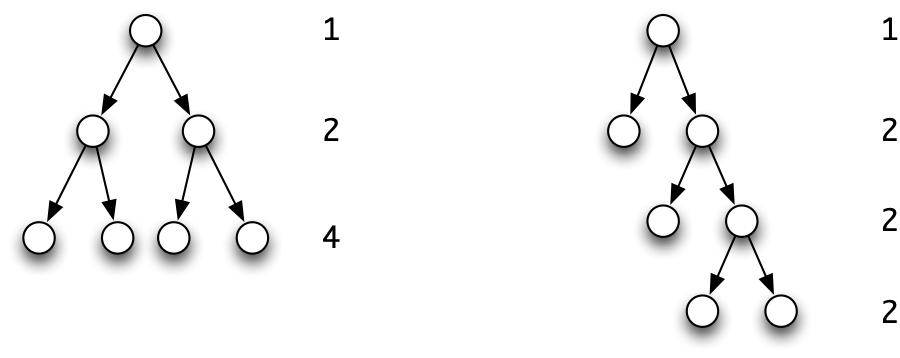
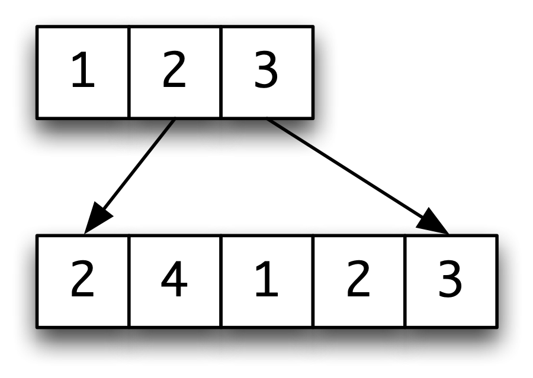

Time and space behaviour {#behaviour}
========================

<a id="ix-20-behaviour"></a>

This chapter explores not the values which programs compute, but the way in which those values are reached; we are interested here in program *efficiency* rather than program correctness.

We begin our discussion by asking how we can measure complexity in general, before asking how we measure the time and space behaviour of our functional programs. We work out the time complexity of a sequence of functions, leading up to looking at various implementations of the `Set` abstype.

The *space* behaviour of lazy programs is complex: we show that some programs use less space than we might predict, while others use more. This leads into a discussion of folding functions into lists, and we introduce the `foldl’` function, which folds from the left, and gives more space-efficient versions of folds of operators which need their arguments -- the *strict* operations. In contrast to this, `foldr` gives better performance on lazy folds, in general.

In many algorithms, the naive implementation causes recomputation of parts of the solution, and thus a poor performance. In the final section of the chapter we show how to exploit lazy evaluation to give more efficient implementations, by *memoizing* the partial results in a table.

Complexity of functions {#funComplex}
-----------------------

<a id="ix-20-complexity"></a>

If we are trying to measure the behaviour of functions, one approach is to ask how much time and space are consumed in evaluations for different input values. We might, for example, given a function `fred` over the natural numbers, count the number of steps taken in calculating the value of `fred n` for natural numbers `n`. This gives us a function, call it `stepsFred`, and then we can ask how complex that function is.

One way of estimating the complexity of a function is to look at how fast it grows for large values of its argument. The idea of this is that the essential behaviour of a function becomes clearer for large values. To start with, we examine this idea through an example. How fast does the function

```haskell
f n = 2*n^2 + 4*n + 13
```

grow, as `n` gets large? The function has three components:

-   a constant `13`,

-   a term `4*n`, and

-   a term, `2*n^2`. (Note that here we use the mathematical notation for powers, `n^2`, rather than the Haskell notation, `n^2`.)

As the values of `n` become large, how do these components behave?

-   The constant `13` is unchanged;

-   the term `4*n` grows like a straight line; but

-   a square term, `2*n^2`, will grow the most quickly.

For 'large' values of `n` the square term is greater than the others, and so we say that `f` is of **order** <a id="ix-20-order"></a> `n^2`, `O(n^2)`. In this case the square dominates for any `n` greater than or equal to `3`; we shall say exactly what is meant by 'large' when we make the definition of order precise. As a rule of thumb we can say that order classifies how functions behave when all but the fastest-growing components are removed, and constant multipliers are ignored; the remainder of the section makes this precise, but this explanation should be sufficient for understanding the remainder of the chapter.

The notation `n^2` is the usual way that mathematicians write down 'the function that takes `n` to `n^2`'. This is the notation which is generally used in describing complexity, and so we use it here. In a Haskell program to describe the function we would either write `\n -> n^2` or use the operator section <a id="ix-20-operator-sections"></a> `(^2)`.

In the remainder of this section we make the idea of order precise, before examining various examples and placing them on a scale for measuring complexity.

### The 'big-Oh' and Theta notation -- upper bounds {#the-big-oh-and-theta-notation-upper-bounds .unnumbered}

<a id="ix-20-s26b172"></a>

A function `f :: Integer -> Integer` is `O(g)` -- pronounced '*big-Oh* `g`' -- if there are positive integers `m` and `d`, so that for all `n≥m`,

```haskell
f n ≤ d*(g n)
```

The definition expresses the fact that when numbers are large enough (`n≥m`) the value of `f` is no larger than a multiple of the function `g`, namely `(d*).g`.

For example, `f` above is `O(n^2)` since, for `n` greater than or equal to `1`,

```haskell
2*n^2 + 4*n + 13 ≤ 2*n^2 + 4*n^2 + 13*n^2 = 19*n^2 
```

so the definition is satisfied by taking `m` as `1` and `d` as `19`.

Note that the measure gives an upper bound, which may be an overestimate; by similar reasoning, `f` is `O(n^17)` as well. In most cases we consider the bound will in fact be a tight one. One way of expressing that `g` is a tight bound on `f` is that in addition to `f` being `O(g)`, `g` is `O(f)`; we then say that `f` is `Θ(g)` -- pronounced '*Theta* `g`' -- our example `f` is in fact `Θ(n^2)`.

### A scale of measurement {#a-scale-of-measurement .unnumbered}

We say that `f ≪ g` if `f` is `O(g)`, but `g` is `not` `O(f)`; we also use `f ≡ g` to mean that `f` is `O(g)` and simultaneously `g` is `O(f)`.

We now give a scale by which function complexity can be measured. Constants which are `O(n^0)` grow more slowly than **linear** -- `O(n^1)` -- <a id="ix-20-complexity-linear"></a> functions, which in turn grow more slowly than **quadratic** <a id="ix-20-complexity-quadratic"></a> functions of order `O(n^2)`. This continues through the powers, and all the powers `(n^k)` are bounded by exponential functions, such as `2^n`.

```haskell
n^0 ≪ n^1 ≪ n^2 ≪ ... ≪ n^k ≪ ... ≪ 2^n ≪ ...
```

Two other points ought to be added to the scale. The logarithm function, `log`, grows more slowly than any positive power, and the product of the functions `n` and `log n`, `n(log n)` fits between linear and quadratic, like this:

```haskell
n^0 ≪ log n ≪ n^1 ≪ n(log n) ≪ n^2 ≪ ...
```

### Counting {#counting .unnumbered}

<a id="ix-20-counting"></a>

Many of the arguments we make will involve counting. In this section we look at some general examples which we will come across in examining the behaviour of functions below.

**Example 1.**

**1.** <a id="ix-20-lists-bisection-of"></a> The first question we ask is -- given a list, how many times can we **bisect** it, before we cut it into pieces of length one? If the length is `n`, after the first cut, the length of each half is `n/2`, and after `p` cuts, the length of each piece is `n/(2^p)`. This number will be smaller than or equal to one when

```haskell
(2^p) ≥ n > (2^(p-1))
```

which when we take `log2` of each side gives

```haskell
p ≥ log2 n > p-1
```

The function giving the number of steps in terms of the length of the list, `n`, will thus be `Θ(log2 n)`.

**2.** The second question concerns trees. A tree is called **balanced** <a id="ix-20-tree-balanced"></a><a id="ix-20-tree-branch-length"></a> if all its branches are the same length. Suppose we have a balanced binary tree, whose branches are of length `b`; how many nodes does the tree have?

<figure><label class="checkbox-label"><input class="checkbox-img" type="checkbox"><span class="img-wrapper"></span></label><figcaption>Counting the number of nodes of trees.</figcaption></figure>

<a id="countTrees"></a>

On the first level it has `1`, on the second `2`, on the `k`th it has `2^(k-1)`, so over all `b+1` levels it has

```haskell
1 + 2 + 4 + ... + 2^(k-1) + ... + 2^b = 2^(b+1) - 1
```

as illustrated in [Counting the number of nodes of trees.](#countTrees).

We thus see that the size of a balanced tree is `Θ(2^b)` in the length of the branches, `b`; taking logarithms, a balanced tree of size `n` will therefore have branches of length `Θ(log2 n)` in the size of the tree. If a tree is not balanced, the length of its longest branch can be of the same order as the size of the tree itself; see [Counting the number of nodes of trees.](#countTrees) for an example.

**3.** Our final counting question concerns taking **sums**. If we are given one object every day for `n` days, we have `n` at the end; if we are given `n` each day, we have `n^2`; what if we are given `1` on the first day, `2` on the second, and so on? What is the sum of the list `[1 .. n]`, in other words? Writing the list backwards, as well as forwards, we have

```haskell
1     + 2     + 3     +  ...  + (n-1) + n +
n     + (n-1) + (n-2) +  ...  + 2     + 1 
```

adding *vertically* at each point we have a sum of `(n+1)`,

```haskell
(n+1) + (n+1) + (n+1) +  ...  + (n+1) + (n+1)
```

and this sum occurs `n` times, so

```haskell
sum [1 .. n] = n*(n+1) `div` 2
```

which makes it `Θ(n^2)`, or quadratic. In a similar way, the sum of the squares is `Θ(n^3)`, and so on.

**Exercises**

**20.1** Show that the example

```haskell
f n = 2*n^2 + 4*n + 13
```

is `Θ(n^2)`.

**20.2** Give a table of the values of the functions `n^0`, `log n`, `n^1`, `n(log n)`, `n^2`, `n^3` and `2^n` for the values

```haskell
0 1 2 3 4 5 10 50 100 500 1000 10000 100000 10000000
```

**20.3** By giving the values of `d`, `m` and `c` (when necessary), show that the following functions have the complexity indicated.

```haskell
f1 n = 0.1*n^5 + 31*n^3 + 1000              O(n^6)
f2 n = 0.7*n^5 + 13*n^2 + 1000              Θ(n^5)
```

**20.4** Show that `n^k ≪ 2^n` for all positive `k`. By taking logarithms of both sides, show that `log n ≪ n^k` for all positive `k`.

**20.5** Show that

```haskell
log ≡ ln ≡ log2
```

and in fact that logarithms to any base have the same rate of growth.

**20.6** The function `fib` is defined by

```haskell
fib 0 = 0
fib 1 = 1
fib m = fib (m-2) + fib (m-1)
```

Show that `n^k ≪ fib n` for all `k`.

**20.7** Show that `≪` is transitive -- that is `f≪g` and `g≪h` together imply that `f≪h`. Show also that `≡` is an equivalence relation.

**20.8** If `f` is `O(g)`, show that any constant multiple of `f` is also of the same order. If `f1` and `f2` are `O(g)`, show that their sum and difference are also `O(g)`. Are the same results valid with `Θ` replacing `O`?

**20.9** If `f1` is `O(n^k1)` and `f2` is `O(n^k2)`, show that their product,

```haskell
f n = f1 n * f2 n
```

is `O(n^(k1+k2))`.

**20.10** Prove by induction over the natural number `n` that

```haskell
1 + 2 + 4 + ... + 2^n = 2^(n+1) - 1
1 + 2 + ... + n      = n*(n+1) `div` 2
1^2 + 2^2 + ... + n^2   = n*(n+1)*(2*n+1) `div` 6
1^3 + 2^3 + ... + n^3   = (n*(n+1) `div` 2)^2
```

The complexity of calculations {#complexCalc}
------------------------------

How can we measure the complexity of the functions we write? One answer is to use an implementation of Haskell, which can be expected to produce some diagnostic information about evaluation. We examine this option in [Folding revisited](#foldingRev), but for the moment we opt for a cleaner *model* of what is going on, and we choose to analyse the *calculations* we have been using. There are three principal measures we can use.

-   The **time** taken to compute a result is given by the number of steps in a calculation which uses lazy evaluation. <a id="ix-20-behaviour-time"></a><a id="ix-20-complexity-time"></a>

-   The **space** necessary for the computation can be <a id="ix-20-behaviour-space"></a><a id="ix-20-complexity-space"></a> measured in two ways. First, there is a lower limit on the amount of space we need for a calculation to complete successfully. During calculation, the expression being calculated grows and shrinks; obviously, we need enough space to hold the *largest* expression built during the calculation. This is often called the **residency**<a id="ix-20-residency"></a> of the computation, we shall call it the **space complexity**.

-   We can also make a measure of the **total space** used by a computation, which in some way reflects the total area of the calculation; it is of interest to implementers of functional languages but for users (and for us) the first two are the crucial measures.

How then do we measure the complexity of a function?

### Complexity measures {#complexity-measures .unnumbered}

We measure the complexity of the function `f` by looking at the time and space complexity as described above, as *functions* of the *size* of the inputs to `f`. The size of a number is the number itself, while the size of a list is given by its length, and of a tree by the number of nodes it contains. We now look at a series of examples.

**Example 2.**

**1.** <a id="ix-20-complexity-fac"></a> Let us start with the example of `fac`.

```haskell
fac :: Integer -> Integer
fac 0 = 1
fac n = n * fac (n-1)
```

Working through a calculation, we have

```haskell
fac n
~> n * fac (n-1)
~> ...
~> n * ((n-1) * ... * (2 * (1 * 1)) ...)   -- (facMax)
~> n * ((n-1) * ... * (2 * 1) ...) 
~> n * ((n-1) * ... * 2 ...)  
~> ...
~> n!
```

The calculation contains `2*n+1` steps, and the largest expression, `(facMax)`, contains `n` multiplication symbols. This makes the time and space complexity both `Θ(n^1)`, or linear.

**2.** <a id="ix-20-complexity-isort"></a> Next we look at insertion sort. Recall that

```haskell
iSort :: Ord a => [a] -> [a]

iSort []     = []
iSort (x:xs) = ins x (iSort xs)

ins x [] = [x]
ins x (y:ys) 
  | (x<=y)      = x:y:ys
  | otherwise   = y:ins x ys
```

A general calculation will be

```haskell
iSort [a1,a2,...,an-1,an]
~> ins a1 (iSort [a2,...,an-1,an])
~> ...
~> ins a1 (ins a2 ( ... (ins an-1 (ins an []))...))
```

followed by the calculation of the `n` `ins`'s. What sort of behaviour does `ins` have? Take the general example of

```haskell
ins a [a1,a2,...,an-1,an]
```

where we assume that `[a1,…,an]` is sorted. There are three possibilities:

-   In the *best* case, when `a<=a1`, the calculation takes `1` step.

-   In the *worst* case, when `a>an`, the calculation takes `n` steps.

-   In an *average* case, the calculation will take `n/2` steps.

What does this mean for `iSort`?

-   In the *best* case, each `ins` will take one step, and the calculation will therefore take a further `n` steps, making it `O(n^1)` in this case.

-   On the other hand, in the *worst* case, the first `ins` will take one step, the second two, and so on. By our counting argument in [Complexity of functions](#funComplex) the calculation will take `O(n^2)` steps.

-   In an *average* case, the `ins`'s will take a total of

    ```haskell
    1/2 + 2/2 + ... + (n-1)/2 + n/2
    ```

    steps, whose sum is again `O(n^2)`, by our observation in [Counting](#counting) about the size of the sum `1+2...n`.

We therefore see that in most cases the algorithm takes quadratic time, but in some exceptional cases, when sorting an (almost) sorted list, the complexity is linear in the length of the list. In all cases the space usage will also be linear.

**3.** <a id="ix-20-complexity-s25fb0b"></a> Before looking at another sorting algorithm, we look at the time taken to join together two lists, using `++`.

```haskell
[a1,a2,...,an-1,an] ++ x
~> a1 : ([a2,...,an-1,an] ++ x)
~> a1 : (a2 : [a3,...,an-1,an] ++ x)
~> ... n-3 steps ...
~> a1 : (a2 : ... : (an:x)...)
```

The time taken is *linear* in the length of the first list.

**4.** <a id="ix-20-complexity-qsort"></a> Our second sorting algorithm, quicksort,<a id="ix-20-sorting-quicksort"></a> is given by

```haskell
qSort :: Ord a => [a] -> [a]

qSort []     = []
qSort (x:xs) = qSort [z|z<-xs,z<=x] ++ [x] ++ qSort [z|z<-xs,z>x]
```

When the list is sorted and contains no duplicate elements, the calculation goes thus:

```haskell
qSort [a1,a2,...,an-1,an]
~> ... n steps ...
~> [] ++ [a1] ++ qSort [a2,...,an-1,an] 
~> ... n-1 steps ...
~> a1 : ([] ++ [a2] ++ qSort [a3,...,an])
~> ... n-2 steps ...
~> ...
~> a1 : (a2 : (a3 : ... an:[])
~> [a1,a2,...,an-1,an]
```

Since the number of steps here is 1+2+...n, we have **quadratic** behaviour in this sorted case. In the *average* case, we split thus

```haskell
qSort [a1,a2,...,an-1,an]
~> qSort [b1,...,bn/2] ++ [a1] ++ qSort [c1,...,cn/2]
```

where the list has been bisected. Forming the two sublists will take `O(n^1)` steps, as will the joining together of the results. As we argued in [Complexity of functions](#funComplex), there can be `log2 n` bisections before a list is reduced to one-element lists, so we have `O(n^1)` steps to perform `O(log n)` many times; this makes quicksort take `O(n(log n))` steps, *on average*, although we saw that it can take quadratic steps in the worst (already sorted!) case.[^1]

The logarithmic behaviour here is characteristic of a 'divide and conquer' <a id="ix-20-divide-and-conquer"></a> algorithm: we split the problem into two smaller problems, solve these and then recombine the results. The result is a comparatively efficient algorithm, which reaches its base cases in `O(log2 n)` rather than `O(n^1)` steps.

**Exercises**

**20.11** Estimate the time complexity of the two reverse functions given here:

```haskell
rev1 []     = []
rev1 (x:xs) = rev1 xs ++ [x]
```

and

```haskell
rev2            = shunt []
shunt xs []     = xs
shunt xs (y:ys) = shunt (y:xs) ys
```

**20.12** We can define multiplication by repeated addition as follows:

```haskell
mult n 0 = 0
mult n m = mult n (m-1) + n
```

'Russian' multiplication is defined by

```haskell
russ n 0 = 0
russ n m 
  | (m `mod` 2 == 0)    = russ (n+n) (m `div` 2)
  | otherwise           = russ (n+n) (m `div` 2) + n
```

Estimate the time complexity of these two multiplication algorithms.

**20.13** Estimate the time complexity of the Fibonacci function.

**20.14** Show that the worst-case time behaviour of the merge sort function below is `O(n(log n))`.

```haskell
mSort :: Ord a => [a] -> [a]

mSort xs 
  | (len < 2)   = xs
  | otherwise   = mer (mSort (take m xs)) (mSort (drop m xs))
    where
    len = length xs
    m   = len `div` 2

mer :: Ord a => [a] -> [a]  -> [a]

mer (x:xs) (y:ys) 
  | (x<=y)      = x : mer xs (y:ys)
  | otherwise   = y : mer (x:xs) ys
mer (x:xs) []   = (x:xs)
mer []     ys   = ys
```

Implementations of sets
-----------------------

<a id="ix-20-sets-behaviour-of-implementations"></a>

We first saw the `Set` abstract data type in [Sets](16.md#caseSets), where we gave an implementation based on ordered lists without repetitions. Alternatively we can write an implementation based on arbitrary lists whose elements may <a id="ix-20-lists-as-sets"></a> occur in any order and be repeated.

```haskell
type Set a = [a]

empty        = []
memSet       = member
inter xs ys  = filter (member xs) ys
union        = (++)
subSet xs ys = and (map (member ys) xs)
eqSet xs ys  = subSet xs ys && subSet ys xs
makeSet      = id
mapSet       = map
```

We can also write an implementation based on the search trees of Section <a id="ix-20-search-tree"></a> [Search trees](16.md#srchTrees). We now compare the time complexity of these implementations, and summarize the results in the table which follows.

|           |             |               |               |
|:----------|:-----------:|:-------------:|:-------------:|
|           |    Lists    | Ordered lists |  Search trees |
|           |             |               |   (average)   |
| `memSet`  |   `O(n^1)`  |    `O(n^1)`   |   `O(log n)`  |
| `subSet`  |   `O(n^2)`  |    `O(n^1)`   | `O(n(log n))` |
| `inter`   |   `O(n^2)`  |    `O(n^1)`   | `O(n(log n))` |
| `makeSet` |   `O(n^0)`  | `O(n(log n))` | `O(n(log n))` |
| `mapSet`  |   `O(n^1)`  | `O(n(log n))` | `O(n(log n))` |

As we can see from the table, there is no clear 'best' or 'worst' choice; <a id="ix-20-design-and-behaviour"></a> depending upon the kind of set operation we intend to perform, different implementations make more sense. This is one more reason for providing the abstract data type<a id="ix-20-abstract-data-type"></a> boundary beneath which the implementation can be changed to suit the use to which the sets are being put without any need to change the user programs. Using a variant of search trees which are 'balanced' so that all branches are of almost the same length, it is possible to achieve linear complexity for `subSet` and `inter` on average.

**Exercises**

**20.15** Confirm the time complexities given in the table above for the two list implementations of sets.

**20.16** Implement the operations `subSet`, `inter`, `makeSet` and `mapSet` for the search tree implementation, and estimate the time complexity of your implementations.

**20.17** Give an implementation of sets as lists without repetitions, and estimate the time complexity of the functions in your implementation.

Space behaviour {#spaceBeh}
---------------

A rule of thumb for estimating the space needed to calculate a result is to measure the largest expression produced during the calculation. This is accurate if the result being computed is a number or a Boolean, but it is not when the result is a data structure, like a list.

### Lazy evaluation {#lazy-evaluation .unnumbered}

Recall the explanation of lazy evaluation in [Lazy evaluation](17.md#lazyEval), where we explained that parts of results are printed as soon as possible. Once part of a result is printed, it need no longer occupy any space. In estimating space complexity, we must be aware of this.

Take the example of the lists `[m .. n]`, defined thus

```haskell
[m .. n] 
  | n>=m        = m:[m+1 .. n]
  | otherwise   = []
```

Calculating `[1 .. n]` gives

```haskell
[1 .. n]
      ?? n>=1
~> 1:[1+1 .. n]
      ??  n>=2
~> 1:[2 .. n]
~> 1:2:[2+1 .. n]
~> ...
~> 1:2:3:...:n:[]
```

where we have underlined those parts of the result which can be output. To measure the space complexity we look at the non-underlined part, which is of constant size, so the space complexity is `O(n^0)`. The calculation has approximately `2*n` steps, giving it linear time complexity, as expected.

### Saving values in where clauses {#saving-values-in-where-clauses .unnumbered}

<a id="ix-20-behaviour-space-local-definitions"></a>

Consider the example of

```haskell
exam1 = [1 .. n] ++ [1 .. n]
```

The time taken to calculate this will be `O(n^1)`, and the space used will be `O(n^0)`, but we will have to calculate the expression `[1 .. n]` *twice*. Suppose instead that we compute

```haskell
exam2 = list ++ list 
        where 
        list=[1 .. n]
```

The effect here is to compute the list `[1 .. n]` once, so that we save its value after calculating it in order to be able to use it again. Unfortunately, this means that after evaluating `list`, the whole of the list is stored, giving an `O(n^1)` space complexity.

This is a general phenomenon. If we save something by referring to it in a `where` clause we have to pay the penalty of the space that it occupies: if the space is available, fair enough; if not, we have turned a working computation into one which fails for lack of space.

This problem can be worse! Take the examples

```haskell
exam3 = [1 .. n] ++ [last [1 .. n]]
exam4 = list ++ [last list]
        where
        list=[1 .. n]
```

in which `last` returns the last element of a non-empty list. The space required by `exam3` is `O(n^0)`, while in exam4 it is `O(n^1)`, since we hold on to the calculated value of `list` even though we require only one value from it, the last. This feature, of keeping hold of a large structure when we only need part of it, is called a **space leak**<a id="ix-20-space-leak"></a>. In the example here, the problem is clear, but in a larger system the source of a space leak can be one of the most difficult debugging problems to solve.

The lesson of these examples must be that while it is *always* sensible not to repeat the calculation of a simple value, saving a compound value like a list or a tuple can increase the space usage of a program.

### Saving space? {#saving-space .unnumbered}

As we saw in [The complexity of calculations](#complexCalc), the naive factorial function has ` O(n^1)` space complexity, as it forms the expression

```haskell
n * ((n-1) * ... * (1 * 1)...)
```

before it is evaluated. Instead, we can perform the multiplications as we go along, using

```haskell
newFac :: Integer -> Integer
newFac n = aFac n 1

aFac :: Integer -> Integer -> Integer
aFac 0 p = p
aFac n p = aFac (n-1) (p*n)
```

and compute the factorial of `n` using `aFac n 1`. Now, we examine the calculation<a id="ix-20-factorial-complexity-of"></a>

```haskell
newFac n
~> aFac n 1
~> aFac (n-1) (1*n)
   ??  (n-1)==0 ~> False
~> aFac (n-2) (1*n*(n-1))
~> ...
~> aFac 0 (1*n*(n-1)*(n-2)*...*2*1)
~> (1*n*(n-1)*(n-2)*...*2*1)  -- (needVal)
```

so that the effect of this program is exactly the same: it still forms a large unevaluated expression! The reason that the expression is unevaluated is that it is not clear that its value is needed until the step `(needVal)`.

How can we overcome this? We ought to make the intermediate values *needed*, so that they are calculated earlier. We do this here by adding a test; another method is given in [Folding revisited](#foldingRev).

```haskell
aFac n p 
  | p==p        = aFac (n-1) (p*n)
```

Now the calculation of the factorial of `4`, say, is

```haskell
aFac 4 1
~> aFac (4-1) (1*4)
    ??  (4-1)==0     ~> False
    ??  (1*4)==(1*4) ~> True   -- (eqTest)
~> aFac (3-1) (4*3)
    ??  (3-1)==0     ~> False
    ??  (4*3)==(4*3) ~> True   -- (eqTest)
~> aFac (2-1) (12*2)
~> ...
~> aFac 0 (24*1)
~> (24*1) 
~>  24
```

The lines `(eqTest)` show where the guard `p==p` is tested, and so where the intermediate multiplications take place. From this we can conclude that this version has better (constant) space behaviour.

**Exercises**

**20.18** Estimate the space complexity of the function

```haskell
sumSquares :: Integer -> Integer
sumSquares n = sumList (map sq [1 .. n])
```

where

```haskell
sumList = foldr (+) 0
sq n    = n*n
```

and `map` and `[1 .. n]` have their standard definitions.

**20.19** Give an informal estimate of the complexity of the text processing functions in [Defining functions over lists](7.md#defFunLists).

Folding revisited {#foldingRev}
-----------------

<a id="ix-20-folding"></a>

One of the patterns of computation which we identified in [Generalization: patterns of computation](10.md#patternsGen) is **folding** an operator or function into a list. This section examines the complexity of the two standard folding functions, and discusses how we can choose between them in program design. Before this we make a definition which expresses the fact of a function needing to evaluate an argument. This distinction will be crucial to our full understanding of folding.

### Strictness {#strictness .unnumbered}

<a id="ix-20-function-strict"></a>

A function is **strict** in an argument if the result is undefined whenever an undefined value is passed to this argument. For instance, `(+)` is strict in both arguments, while `(&&)` is strict in its first only. Recall that it is defined by

```haskell
True  && x = x
False && x = False   -- (andFalse)
```

The pattern match in the first argument forces it to be strict there, but equation`(andFalse)` shows that it is possible to get an answer from `(&&)` when the second argument is `undef`, so it is therefore not strict in the second argument.

If a function is not strict in an argument, we say that it is **non-strict** or **lazy** in that argument. <a id="ix-20-function-lazy"></a>

### Folding from the right {#folding-from-the-right .unnumbered}

<a id="ix-20-foldr"></a>

Our definition of folding was given by

```haskell
foldr :: (a -> b -> b) -> b -> [a] -> b

foldr f st []     = st
foldr f st (x:xs) = f x (foldr f st xs)
```

which we saw was of general application. Sorting a list, by insertion sort, was given by

```haskell
iSort = foldr ins []
```

and indeed any primitive recursive definition over lists can be given by applying `foldr`.

Writing the function applications as infix operations gives

```haskell
foldr f st [a1,a2,...,an-1,an]
~> a1 `f` (a2 `f` ... `f` (an-1 `f` (an `f` st))...)  -- (foldr)
```

and shows why the '**r**' is added to the name: bracketing is to the **r**ight, with the starting value `st` appearing to the **r**ight of the elements also. If `f` is lazy in its second argument, we can see from `(foldr)` that given the head of the list, output may be possible. For instance, `map` can be defined like this

```haskell
map f = foldr ((:).f) []
```

and in calculating `map (+2) [1 .. n]` we see

```haskell
foldr ((:).(+2)) [] [1 .. n]
~> ((:).(+2)) 1 (foldr ((:).(+2)) [] [2 .. n])
~> 1+2 : (foldr ((:).(+2)) [] [2 .. n])
~> 3 : (foldr ((:).(+2)) [] [2 .. n])
~> ...
```

As in [Space behaviour](#spaceBeh), we see that the space complexity of this will be `O(n^0)`, since the elements of the list will be output as they are calculated. What happens when we fold a strict operator into a list? The definition of `fac` in [The complexity of calculations](#complexCalc) can be rewritten as

```haskell
fac n = foldr (*) 1 [1 .. n]
```

and we saw there that the effect was to give `O(n^1)` space behaviour, since the multiplications in equation `(foldr)` cannot be performed until the whole expression is formed, as they are bracketed to the right. We therefore define a function to fold from the left.

### Folding from the left {#folding-from-the-left .unnumbered}

Instead of folding from the right, we can define

```haskell
foldl :: (a -> b -> a) -> a -> [b] -> a
foldl f st []     = st
foldl f st (x:xs) = foldl f (f st x) xs
```

which gives

```haskell
foldl f st [a1,a2,...,an-1,an]
~> (...((st `f` a1) `f` a2) `f` ... `f` an-1) `f` an  -- (foldl)
```

We can calculate this in the factorial example, the effect being

```haskell
foldl (*) 1 [1 .. n]
~> foldl (*) (1*1) [2 .. n]
~> ...
~> foldl (*) (...((1*1)*2)*...*n) []
~> (...((1*1)*2)*...*n)
```

As in [The complexity of calculations](#complexCalc), the difficulty is that `foldl` as we have defined it is not strict in its second argument. Using the standard function `seq`

```haskell
seq :: a -> b -> b
```

it is possible to make it strict in the second argument. The effect of `seq x y` is to evaluate `x` before returning `y`. We can use `seq` over any type, since it is a polymorphic function. If we write

```haskell
strict :: (a -> b) -> a -> b
strict f x = seq x (f x)
```

then `strict f` is a **strict** version of the function `f` which evaluates its argument `x` before computing the result `f x`. We can therefore write a strict version of `foldl`, called `foldl’`,<a id="ix-20-foldl-type-of"></a>

```haskell
foldl' :: (a -> b -> a) -> a -> [b] -> a
foldl' f st []     = st
foldl' f st (x:xs) = strict (foldl' f) (f st x) xs
```

and this definition can be found in the `Data.List` module. Now, evaluating the example again,

```haskell
foldl' (*) 1 [1 .. n]
~> foldl' (*) 1 [2 .. n]
~> foldl' (*) 2 [3 .. n]
~> foldl' (*) 6 [4 .. n]
~> ...
```

Clearly, this evaluation is in constant space, `O(n^0)`. Can we draw any conclusions from these examples?

```haskell
module Main where

main = putStrLn (show (sumI 1 1000000))
-- main = putStrLn (show (sumIA 1 1000000))
-- main = putStrLn (show (sumIS 1 1000000))

sumI :: Integer -> Integer -> Integer
sumI n m
 | n>m       = 0
 | otherwise = n + sumI (n+1) m

sumIA :: Integer -> Integer -> Integer
sumIA n m = accIA n m 0

accIA n m s
 | n>m       = s
 | otherwise = accIA (n+1) m (n+s)

sumIS :: Integer -> Integer -> Integer
sumIS n m = accIS n m 0

accIS n m s
 | n>m       = s
 | otherwise = accIS (n+1) m $! (n+s)
```

<figcaption>Computing the sum `n+...+m`</figcaption>

<a id="sumDefs"></a>

```haskell
cabal run performanceI -- +RTS -K100000000 -sstderr
500000500000
     150,145,752 bytes allocated in the heap
      63,269,576 bytes copied during GC
      21,122,356 bytes maximum residency (7 sample(s))
      15,758,580 bytes maximum slop
              45 MB total memory in use (0 MB lost due to fragmentation)

  Generation 0:   217 collections,     0 parallel,  1.80s,  1.82s elapsed
  Generation 1:     7 collections,     0 parallel,  0.05s,  0.06s elapsed

  INIT  time    0.00s  (  0.00s elapsed)
  MUT   time    0.22s  (  0.24s elapsed)
  GC    time    1.86s  (  1.88s elapsed)
  EXIT  time    0.00s  (  0.00s elapsed)
  Total time    2.07s  (  2.12s elapsed)

  %GC time      89.6%  (88.5% elapsed)

  Alloc rate    695,428,301 bytes per MUT second

  Productivity  10.4% of total user, 10.2% of total elapsed
```

<figcaption>Performance of ` sumI 1 1000000`</figcaption>

<a id="perfIreport"></a>

```haskell
cabal run performanceIS -- +RTS -K100000000 -sstderr
500000500000
     126,083,156 bytes allocated in the heap
          27,444 bytes copied during GC
           5,340 bytes maximum residency (1 sample(s))
          11,044 bytes maximum slop
               1 MB total memory in use (0 MB lost due to fragmentation)

  Generation 0:   242 collections,     0 parallel,  0.00s,  0.00s elapsed
  Generation 1:     1 collections,     0 parallel,  0.00s,  0.00s elapsed

  INIT  time    0.00s  (  0.00s elapsed)
  MUT   time    0.16s  (  0.17s elapsed)
  GC    time    0.00s  (  0.00s elapsed)
  EXIT  time    0.00s  (  0.00s elapsed)
  Total time    0.16s  (  0.17s elapsed)

  %GC time       1.0%  (1.2% elapsed)

  Alloc rate    798,252,321 bytes per MUT second

  Productivity  98.7% of total user, 90.8% of total elapsed
```

<figcaption>Performance of ` sumIS 1 1000000`</figcaption>

<a id="perfISreport"></a>

### Assessing performance in practice {#perfInPractice .unnumbered}

<a id="ix-20-performance-measurement-in-ghc"></a>

<a id="ix-20-ghc-performance-measurement"></a>

We can get detailed performance information by *compiling* programs using `cabal` and passing the right parameters to the resulting executable. For the simple examples here, we define the expressions we are interested in [Computing the sum n+...+m](#sumDefs); the three variants -- `PerformanceI.hs`, `PerformanceIA.hs` and `PerformanceIS.hs`, in `Code/Craft3e/Chapter20` -- are already declared as three separate executables in `Craft3e.cabal`. Building all three, from the `Code/Craft3e` directory, is a single command:

```haskell
cabal build performanceI performanceIA performanceIS
```

which produces three executables, `performanceI`, `performanceIA` and `performanceIS`, one for each variant of the `main` program -- no renaming needed, since `cabal` already gives each its own name.

In the module we see three definitions of functions to sum integer ranges: `sumI`, a standard fold from the right, `sumIA`, a (lazy) fold from the left, and `sumIS` a *strict* fold from the left.

As we suggested earlier, we would only expect the last of the three to have reasonable behaviour, and indeed executing the compiled code for the first two gives this error message:

```haskell
Stack space overflow: current size 8388608 bytes.
Use `+RTS -Ksize -RTS' to increase it.
```

The brackets `+RTS ... -RTS` are used to pass parameters to the Haskell *runtime system*. We can increase the stack size and gather post-mortem information using the flag `-sstderr` like this:

```haskell
cabal run performanceI -- +RTS -K100000000 -sstderr -RTS
```

The report this produces is shown in [Performance of sumI 1 1000000](#perfIreport), which we explain now.

-   The first block of information explains how much memory has been used by the computation, and it is clear from this that the maximum space used -- the *residency* -- is high.

-   In the middle block we see the time devoted to various parts of the computation. `INIT` and `EXIT` explain the time to start and clean up, but the interesting results are `MUT` the *mutation* time -- that is time actually computing -- and `GC`, which is time dealing with storage: recycling information that is not used, and copying information that is still in use. We can see from this that of the total time, 89.6% is in `GC`, so we're doing something wrong here.

The performance of `performanceIA` is twice as bad (!), but for `performanceIS`, as shown in [Performance of sumIS 1 1000000](#perfISreport), we see something much better. How do the two reports compare?

-   The mutation time for the two computations is similar for the two: 0.22 seconds for `sumI` and 0.16 for `sumIA`.

-   On the other hand, the space behaviour is radically different. As we saw earlier, `GC` time for `sumI` is almost two seconds, whereas for `sumIA` it is negligible.

These reports give a clear indication of where problems can occur, and GHC has other facilities -- such as *heap profiling* -- to help users to see where space is sued in a large system. The GHC documentation will tell you more.

### Designing folds {#designing-folds .unnumbered}

<a id="ix-20-folding-designing-folds"></a>

When we fold in a *strict* function, we will form a list-sized expression with `foldr`, so it will always be worth using `foldl’`. This covers the examples of `(+)`, `(*)` and so forth.

We saw earlier that when `map` was defined using `foldr` we could begin to give output before the whole of the list argument was constructed. If we use `foldl’` instead, we will have to traverse the whole list before giving any output, since any `foldl’` computation follows the pattern

```haskell
foldl' f st1 xs1 
~> foldl' f st2 xs2 
~> ...
~> foldl' f stk xsk 
~> ...
~> foldl' f stn []
~> stn
```

so in the case of `map`, `foldr` is the clear choice of the two.

A more interesting example is given by the function which is `True` only if a list of Booleans consists of `True` throughout. We fold in `(&&)`, of course, but should we use `foldr` or `foldl’`? The latter will give a constant-space version, but will examine the *entire* list. Since `(&&)` is lazy in its second argument, we might not need to examine the value returned from the remainder of the list. For instance,

```haskell
foldr (&&) True (map (==2) [2 .. n])
~> (2==2) && (foldr (&&) True (map (==2) [3 .. n]))
~> True && (foldr (&&) True (map (==2) [3 .. n]))
~> foldr (&&) True (map (==2) [3 .. n])
~> (3==2) && (foldr (&&) True (map (==2) [4 .. n]))
~> False && (foldr (&&) True (map (==2) [4 .. n]))
~> False
```

This version uses constant space, *and* may not examine the whole list; `foldr` is therefore the best choice.

Beside the examples of `(+)` and `(*)`, there are many other examples where `foldl’` is preferable, including:

-   Reversing a list. To use `foldr` we have to add an element `a` to the end of a list, `x`. The operation `x++[a]` is strict in `x`, while the 'cons' operation `(:)` is lazy in its list argument.

-   Converting a list of digits `"7364"` into a number is strict in both the conversion of the front, `736` and the final character, `’4’`.

Since `foldl’` consumes an entire list before giving any output, it will be of no use in defining functions to work over infinite lists or the partial lists we looked at while writing interactive systems.

**Exercises**

**20.20** Define the functions to reverse a list and to convert a digit list into a number using both `foldr` and `foldl’` and compare their behaviour by means of calculation.

**20.21** Is it better to define insertion sort using `foldr` or `foldl’`? Justify your answer.

**20.22** How are the results of `foldr` and `foldl’` related? You may like to use the functions `reverse` and `flip` in framing your answer.

**20.23** What is the relationship between `foldr` and `foldl’` when the function to be folded is

`tabularll associative: & a ‘f‘ (b ‘f‘ c) = (a ‘f‘ b) ‘f‘ c; has st as an identity: & st ‘f‘ a = a = a ‘f‘ st; commutative: & a ‘f‘ b = b ‘f‘ a; tabular` and what is the relationship when all three hold?

```haskell
fibP 3
= (y,x+y)
  where
  (x,y) = fibP 2
        = (y1,x1+y1)
          where
          (x1,y1) = fibP 1
                  = (y2,x2+y2)
                    where
                    (x2,y2) = fibP 0
                           = (0,1)
                 = (1,1)
        = (1,2)
= (2,3)
```

<figcaption>Calculating `fibP 3`.</figcaption>

<a id="fibCalc"></a>

Avoiding recomputation: memoization
-----------------------------------

<a id="ix-20-memoization"></a>

In this section we look at general strategies which allow us to avoid having to recompute results during the course of evaluating an expression. This happens particularly in some recursive solutions of problems, where the solutions to sub-problems can be used repeatedly.

We begin the discussion by looking again at the Fibonacci function. <a id="ix-20-fibonacci-numbers"></a>

```haskell
fib :: Integer -> Integer
fib 0 = 0
fib 1 = 1
fib n = fib (n-2) + fib (n-1)
```

This definition is remarkably inefficient. Computing `fib n` calls `fib (n-2)` and `fib (n-1)` -- the latter will call `fib (n-2)` again, and within *each* call of `fib (n-2)` there will be two calls to `fib (n-3)`. The time complexity of `fib` is greater than any power. How might we avoid this recomputation? We explore two ways of augmenting the definition to make it efficient; in the first we return a complex data structure from each call, and in the second we define an infinite list to hold all the values of the function.

First we observe that to get the value at `n` we need the two previous values; we could therefore return *both* these values in the result.

```haskell
fibP :: Integer -> (Integer,Integer)
fibP 0 = (0,1)
fibP n = (y,x+y)
         where
         (x,y) = fibP (n-1)
```

A calculation is given in [Calculating fibP 3.](#fibCalc), where different variables `x1`, `y1`<a id="ix-20-variable"></a> and so on have been used for the different occurrences of the local variables `x` and `y`; this is not necessary but does make the different occurrences clearer.

As an alternative strategy, we can try to define the list of Fibonacci values, `fibs`, directly. The values of the `fib` function given above now become values at particular indices:

```haskell
fibs      :: [Integer]
fibs!!0     = 0
fibs!!1     = 1
fibs!!(n+2) = fibs!!n + fibs!!(n+1)
```

This gives a *description* of the list, but it is not executable in this form. The first two lines tell us that `fibs = 0 : 1 : rest`, while the third equation tells us what the `rest` is. The `(n+2)`nd element of `fibs` is the `n`th element of `rest`; similarly, the `(n+1)`st element is the `n`th element of `(tail fibs)`. We therefore have, for every `n`,

```haskell
rest!!n = fibs!!n + (tail fibs)!!n
```

which says that each element is got by adding the corresponding elements of two lists, that is

```haskell
rest = zipWith (+) fibs (tail fibs)
```

so that putting the parts together, we have

```haskell
fibs ::[Integer]
fibs = 0 : 1 : zipWith (+) fibs (tail fibs)
```

a **process network**<a id="ix-20-lists-as-processes"></a> computing the Fibonacci numbers. This gives a linear time, constant space algorithm for the problem, in contrast to the pair solution which is linear in both time and space, since all the nested calls to `fibP` are built before any result can be given.

### Dynamic programming {#dynamic-programming .unnumbered}

<a id="ix-20-dynamic-programming"></a>

```haskell
mLen :: Eq a => [a] -> [a] -> Integer

mLen xs []        = 0
mLen [] ys        = 0
mLen (x:xs) (y:ys) 
  | x==y        = 1 + mLen xs ys
  | otherwise   = max (mLen xs (y:ys)) (mLen (x:xs) ys)

maxLen :: Eq a => [a] -> [a] -> Int -> Int -> Int

maxLen xs ys 0 j = 0   -- (maxLen.1)
maxLen xs ys i 0 = 0  -- (maxLen.2)
maxLen xs ys i j
  | xs!!(i-1) == ys!!(j-1)  
     = (maxLen xs ys (i-1) (j-1)) + 1    -- (maxLen.3)
  | otherwise              
     = max (maxLen xs ys i (j-1)) (maxLen xs ys (i-1) j)   -- (maxLen.4)

maxTab ::  Eq a => [a] -> [a] -> [[Int]]

maxTab xs ys
  = result
    where 
    result = [0,0 .. ] : zipWith f [0 .. ] result
    f i prev  
        = ans
          where
          ans   = 0 : zipWith g [0 .. ] ans
          g j v 
            | xs!!i == ys!!j      = prev!!j + 1
            | otherwise           = max v (prev!!(j+1))
```

<figcaption>Three algorithms for the maximum common subsequence.</figcaption>

<a id="maxSubFig"></a>

The example in this section illustrates a general method of solving problems by what is known as **dynamic programming**. Dynamic programming solutions work by breaking a problem into subproblems but, as in the Fibonacci example, the subproblems will not be independent, in general. A naive solution therefore will contain massive redundancy, which we remove by building a *table* of solutions to subproblems.

The example we consider is to find the length of a **maximal common subsequence** <a id="ix-20-maximal-common-subsequence"></a> of two lists -- the subsequences need not have all their elements adjacent. In the examples of

```haskell
[2,1,4,5,2,3,5,2,4,3]      [1,7,5,3,2]
```

the length of `4` is given by the subsequence `[1,5,3,2]`. This problem is not simply a 'toy'; a solution to this can be used to find the common lines in two files, which gives the basis of the Unix `diff` program, which is used, for instance, for comparing different versions of programs stored in separate files.

The naive solution is given by `mLen` in [Three algorithms for the maximum common subsequence.](#maxSubFig). The interesting part of the definition is given by the third equation. In the case where the lists have equal first elements, these elements must be in a maximal common subsequence, so we find the overall solution by looking in the tails and adding one to the result. More problematic is the case in which the heads are distinct. We have the choice of excluding either `x` or `y`; in this algorithm we try both possibilities and take the maximal result. There, of course, is the source of the redundant computations -- each of these may well give rise to a computation of `mLen xs ys`. How are we to avoid this situation? We shall store these results in a **table**, which will be represented by a list of lists. Once a result appears in the table, we have no need to recompute it.

As an intermediate step, we rewrite the solution as `maxLen` which uses list indexing, so that

```haskell
maxLen xs ys u v
```

is the longest common subsequence in the lists `take u xs` and `take v ys`. The function is given in [Three algorithms for the maximum common subsequence.](#maxSubFig), and the definition is a straightforward adaptation of `mLen`.

Now we aim to define the table `maxTab xs ys` so that

```haskell
(maxTab xs ys)!!u!!v = maxLen xs ys u v
```

This requirement is made specific by equations `(maxLen.1)` to `(maxLen.4)`. The base case is given by `(maxLen.1)`, stating that

```haskell
(maxTab xs ys)!!0!!v = 0
```

for all `v`. In other words,

```haskell
(maxTab xs ys)!!0 = [0,0 .. ]
```

so,

```haskell
result = [0,0 .. ] :  ...
```

The equations `(maxLen.2)` to `(maxLen.4)` tell us how to define the list `maxTab!!(i+1)` from the list `maxTab!!i`, and i, so we can define

```haskell
maxTab xs ys = result
               where
               result = [0,0 .. ] : zipWith f [0 .. ] result
```

where `f :: Integer -> [Integer] -> [Integer]` is the function taking `i` and the previous value, `maxTab!!i`, to `maxTab!!(i+1)`. Now we have to define this latter, which appears in the solution as `ans`.

Equation `(maxLen.2)` tells us that it starts with `0`, and `g` is the function taking `maxTab!!(i+1)!!j` and `j` to `maxTab!!(i+1)!!(j+1)`, where we are also able to use the values of `maxTab!!i`, named by `prev`. Using these insights, the definition of `g` is a straightforward transliteration of `(maxLen.3)` and `(maxLen.4)`:

```haskell
ans   = 0 : zipWith g [0 .. ] ans
g j v 
  | xs!!i == ys!!j      = prev!!j + 1
  | otherwise           = max v (prev!!(j+1))
```

The top-level result is given by calling

```haskell
maxTab xs ys !! (length xs) !! (length ys)
```

and this is computed in linear time and space.

Haskell provides arrays which can be used to give a more efficient implementation of a number of algorithms, including this one here. Further details can be found in the library module `Array.hs` and its documentation.

### Greedy algorithms {#greedy-algorithms .unnumbered}

<a id="ix-20-greedy-algorithm"></a>

A greedy solution to a dynamic programming problem works by building up the optimal solution by making *local* choices of what appear to be the best solutions of sub-problems. In the common subsequence problem, we can think of searching along the two lists in a single sweep, looking successively for the first points of agreement; we search all pairs of indices smaller than `n` before looking at `n`. In an example, the greedy solution gives

<figure><label class="checkbox-label"><input class="checkbox-img" type="checkbox"><span class="img-wrapper"></span></label></figure>

which is *not* optimal: the subsequence `[1,2,3]` has been missed, since we make the choice of `2` the first element, it is the first point of agreement. This local choice is not part of an optimal global solution, but the algorithm gives reasonable performance.

In many situations, where local choices are always part of a global solution, a greedy solution will work. Examples we have seen thus far include

-   the line-splitting algorithm we gave in [Defining functions over lists](7.md#defFunLists) is optimal in minimizing the sum of the inter-word spaces when the lines are justified; <a id="ix-20-text-processing"></a>

-   the Huffman codes described in [Case study: Huffman codes](15.md#codes) are optimal in the sense of giving the shortest possible codings of files. We did not search all possible sets of codes in giving the Huffman code, rather we built it up from locally sensible choices. <a id="ix-20-huffman-codes"></a>

**Exercises**

**20.24** Give an implementation of the greedy solution to the maximal common subsequence problem, and show that it behaves as explained above on the lists `[1,2,3]` and `[2,4,1,2,3]` above.

**20.25** Can you give an improvement of the maximal common subsequence solution along the lines of `fibP`, returning a complex (finite) data structure as the result of a function call, rather than simply one value?

**20.26** Finding the 'edit distance' between two strings was first discussed in [Design with algebraic data types](14.md#algDesign) where we gave a dynamic programming solution to the problem. Show how you can give an efficient implementation of this algorithm using the techniques of this section, and also how you give a greedy solution to the problem. How do the two solutions compare?

**20.27** Based on the examples of this section, provide a program which gives the difference between two files, matching the corresponding lines and giving the output in a suitable form, such as a list of the pairs of matching line numbers or a form copied from the Unix `diff` program.

Summary {#summary .unnumbered}
-------

In this chapter we have examined the efficiency of lazy functional programs. We saw that we are able to analyse the time complexity of many of our more straightforward functions without too much difficulty. To analyse the space behaviour is more difficult, but we have shown how the space consumption of lazy programs can be estimated from our calculations.

The introduction of `foldl` brings the space issue into focus, and the distinction we made between strict and lazy functions allows us to analyse the different behaviour of the two folds.

We concluded the discussion with an application of lazy infinite lists to memoizing results for reuse; the transition from naive to efficient was done in a systematic way, which can be carried over to other application areas.

This chapter has provided an introduction to the study of functional program behaviour; much more information -- particularly about functional data structures -- can be found in .

[^1]: The explanation we have given here depends upon us rearranging the order of the calculation steps; this is legitimate if we observe that lazy evaluation of combinators is *optimal*, in the sense of taking fewest steps to reach a result; any rearrangement can only give more steps to our calculation, so the bound of `n(log n)` holds.
