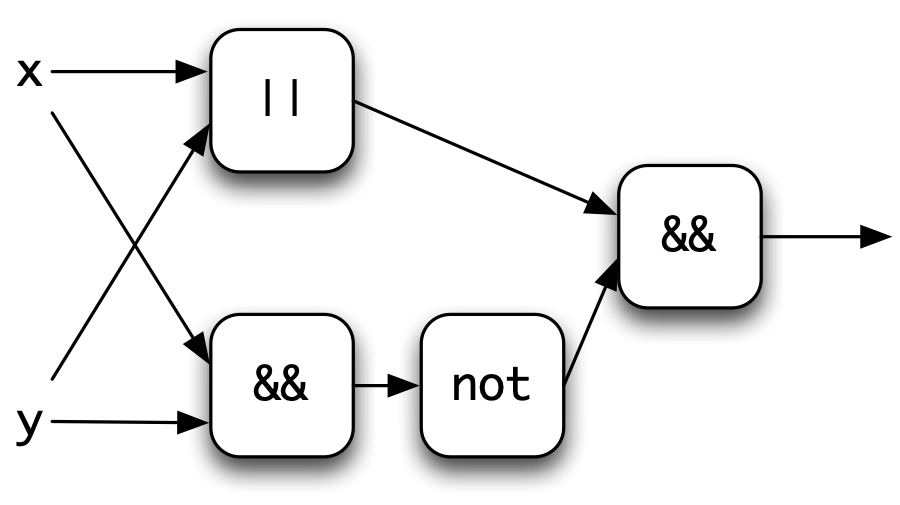
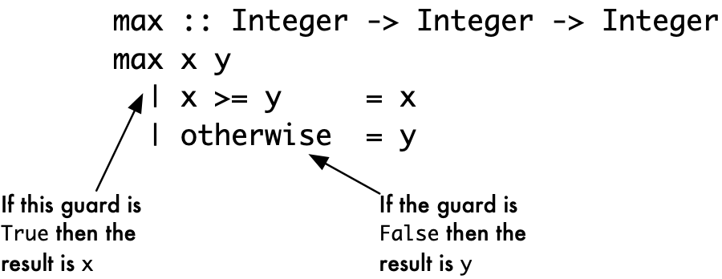
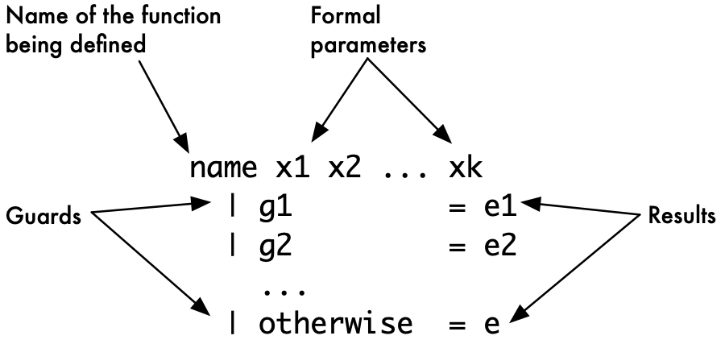
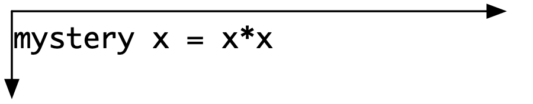
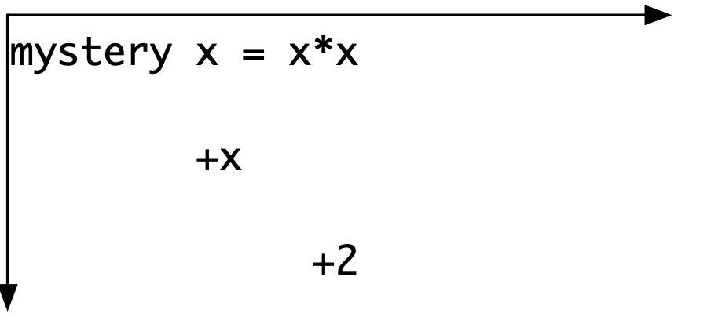
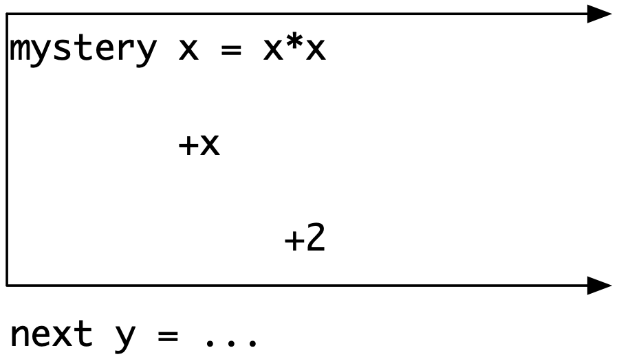

Basic types and definitions {#BasicTypes}
===========================

We have now covered the basics of functional programming and have shown how simple programs are written, modified and run in GHCi. This chapter covers Haskell's most important **basic types** and also shows how to write definitions of functions which have multiple **cases** to cover alternative situations. We conclude by looking at some of the details of the **syntax** of Haskell.

Haskell contains a variety of numerical types. We have already seen the `Integer` type in use; we shall cover this as well as the (related) `Int` type and the **floating-point** fractional numbers, `Float`.

Often in programming we want to make a choice of values, according to whether or not a particular **condition** holds. These conditions include tests of whether one number is greater than another; whether two values are equal, and so on. The results of these tests -- `True` if the condition holds and `False` if it fails -- are called the **Boolean**<a id="ix-3-boolean"></a> values, after the nineteenth-century logician George Boole,<a id="ix-3-boole-george"></a> and they form the Haskell type `Bool`. In this chapter we cover the Booleans, and how they are used to give choices in function definitions by means of **guards**<a id="ix-3-guard"></a>.

Next, we look at the types of characters and strings. Characters -- individual letters, digits, spaces and so forth -- are given by the Haskell type `Char`. Strings of letters and other characters make up strings, in the Haskell type `String`.

The chapter provides reference material for the basic types; a reader may skip the treatment of `Float` and much of the detail about `Char` and `String`, referring back to this chapter when necessary.

Each section here contains examples of functions, and the exercises build on these. Looking ahead, this chapter gives a foundation on top of which we look at a variety of different ways that programs can be designed and written, which is the topic of the next chapter.

The Booleans: `Bool`
--------------------

<a id="ix-3-booleans"></a>

The Boolean values `True` and `False` represent the results of tests, which might, for instance, compare two numbers for equality, or check whether the first is smaller than the second. The Boolean type in Haskell is called `Bool`. The Boolean operators provided in the language are:

|       |     |
|:------|:----|
| `&&`  | and |
| `\|\|`  | or  |
| `not` | not |

Because `Bool` contains only two values, we can define the meaning of Boolean operators by **truth tables**<a id="ix-3-truth-table"></a> which show the result of applying the operator to each possible combination of arguments. For instance, the third line of the first table says that the value of `False && True` is `False` and that the value of `False || True` is `True`.

|  t1 |  t2 | `t1 && t2` | t1 `\|\|` t2 |
|:---:|:---:|:----------:|:----------:|
| `T` | `T` |     `T`    |     `T`    |
| `T` | `F` |     `F`    |     `T`    |
| `F` | `T` |     `F`    |     `T`    |
| `F` | `F` |     `F`    |     `F`    |

|  t1 | `not t1` |
|:---:|:--------:|
| `T` |    `F`   |
| `F` |    `T`   |

### Defining Boolean functions {#defining-boolean-functions .unnumbered}

Booleans can be the arguments to or the results of functions. We look at some examples now.

The 'built-in or', `||`, is called 'inclusive' <a id="ix-3-inclusive-or"></a> because it returns `True` if either one or both of its arguments are `True`. 'Exclusive or' <a id="ix-3-exclusive-or"></a> is the function which returns `True` when *exactly* one but not both of its arguments has the value `True`; it is like the 'or' of a restaurant menu: you may choose vegetarian moussaka or fish as your main course, but not both! The definition here mirrors the definition: the result is true if either `x` or `y` is true (`x || y`), and they are not both true (`not (x && y)`):

```haskell
exOr :: Bool -> Bool -> Bool
exOr x y = (x || y) && not (x && y)
```

We can picture the function definition using boxes for functions, and lines for values, as we saw in [Introducing functional programming](1.md#intro). Lines coming into a function box represent the arguments, and the line going out the result.

<a id="ix-3-function-box-diagram"></a>

<figure><label class="checkbox-label"><input class="checkbox-img" type="checkbox"><span class="img-wrapper"></span></label></figure>

Boolean values can also be compared for equality and inequality using the operators `==` and `/=`, which both have the type

```haskell
Bool -> Bool -> Bool
```

Note that `/=` is the same function as `exOr`, since both return the result `True` when exactly one of their arguments is `True`.

### Literals and definitions {#literals-and-definitions .unnumbered}

Expressions like `True` and `False`, and also numbers like `2`, are known as **literals**.<a id="ix-3-literal"></a><a id="ix-3-value-literal"></a> These are values which are given literally, and which need no evaluation; the result of evaluating a literal is the literal itself.

We can use the literals `True` and `False` as arguments, in defining `not` for ourselves:

```haskell
myNot :: Bool -> Bool
myNot True  = False
myNot False = True
```

We can also use a combination of literals and variables on the left-hand side of equations defining `exOr`:

```haskell
exOr True  x = not x
exOr False x = x
```

Here we see a definition of a function which uses two equations: the first applies whenever the first argument to `exOr` is `True` and the second when that argument is `False`.

Definitions which use `True` and `False` on the left-hand side of equations are often more readable than definitions which only have variables on the left-hand side. This is a simple example of the general **pattern matching**<a id="ix-3-pattern-matching"></a> mechanism in Haskell, which we look at in detail in [Data types, tuples and lists](5.md#tupleList).

### Testing {#testing .unnumbered}

We can write some QuickCheck properties to test our new implementation of `not` and our multiple implementations of exclusive or. We test `myNot` against the built in function, and test our exclusive or functions -- let's call them `exOr` and `exOr1`:

```haskell
prop_myNot :: Bool -> Bool

prop_myNot x =
    not x == myNot x

prop_exOrs :: Bool -> Bool -> Bool

prop_exOrs x y =
    exOr x y == exOr1 x y 
```

and running them gives the results that we expect:

```haskell
*Chapter3> quickCheck prop_myNot
+++ OK, passed 100 tests.
*Chapter3> quickCheck prop_exOrs
+++ OK, passed 100 tests.
```

We can also check the earlier assertion that `exOr` and `/=` have the same behaviour over Booleans with this property:

```haskell
prop_exOr2 :: Bool -> Bool -> Bool

prop_exOr2 x y =
    exOr x y == (x /= y)
```

**Exercises**

**3.1** Give another version of the definition of 'exclusive or' which works informally like this: 'exclusive or of `x` and `y` will be `True` if either `x` is `True` and `y` is `False`, or `x` is `False` and `y` is `True`'.

**3.2** Give the 'box and line' diagram corresponding to your answer to the previous question.

**3.3** Using literals on the left-hand side we can make the truth table for a function into its Haskell definition. Complete the following definition of `exOr` in this style.

```haskell
exOr True True  = ...
exOr True False = ...
  ...
```

**3.4** Give your own definitions of the built-in `&&` and `||`. If you want to use the same operator for `&&`, say, you will need to make sure you hide its import. You can do this by adding it to the list of what is hidden, thus:

```haskell
import Prelude hiding (max,(&&))
```

after the `module` declaration at the start of the `Chapter3` module.

**3.5** Give two different definitions of the `nAnd` function

```haskell
nAnd :: Bool -> Bool -> Bool
```

which returns the result `True` except when both its arguments are `True`. Give a diagram illustrating one of your definitions.

**3.6** Give line-by-line calculations of

```haskell
nAnd True True
nAnd True False
```

for each of your definitions of `nAnd` in the previous exercise.

**3.7** Write QuickCheck properties to test the functions you have written in the earlier exercises. You might be able to check one version of a function against another, or perhaps think up different properties for your functions.

The integers: `Integer` and `Int` {#ints}
---------------------------------

<a id="ix-3-numbers-integers"></a>

The Haskell type `Integer` contains the integers, which are the whole numbers, positive, zero and negative, used for counting; they are written like this:

```haskell
0
45
-3452
2147483647
```

Integers in the `Integer` type can be as large as you wish: looking back at the GHCi screenshot in [A GHCi terminal session](2.md#GHCiSession) you can see examples of this. We do arithmetic on integers using the following operators and functions.

|          |                                                                                                     |
|:---------|:----------------------------------------------------------------------------------------------------|
| `+`      | The sum of two integers.                                                                            |
| `*`      | The product of two integers.                                                                        |
| `^`      | Raise to the power; `2^3` is `8`.                                                                   |
| `-`      | The difference of two integers, when infix: `a-b`; the integer of opposite sign, when prefix: `-a`. |
| `div`    | Whole number division; for example `div 14 3` is `4`. This can also be written `14 ‘div‘ 3`.        |
| `mod`    | The remainder from whole number division; for example `mod 14 3` (or `14 ‘mod‘ 3`) is `2`.          |
| `abs`    | The absolute value of an integer; remove the sign.                                                  |
| `negate` | The function to change the sign of an integer.                                                      |

Note that `‘mod‘` surrounded by **backquotes** <a id="ix-3-backquote"></a> is written between its two arguments, is an **infix**<a id="ix-3-function-infix-version-of"></a><a id="ix-3-infix-version-of-a-function"></a> version of the function `mod`. Any function can be made infix in this way.

In what follows we will use the term the **natural numbers** for the <a id="ix-3-numbers-natural-numbers"></a> non-negative integers: `0`, `1`, `2`, ....

<a id="ix-3-pitfalls-negative-literals"></a>

<a id="ix-3-literal-negative"></a>

> **Negative literals**
>
> Negative literals cause problems in Haskell, because of the way that they have been defined. For example the number minus twelve is written as `-12`, but the prefix '`-`' can often get confused with the infix operator to subtract one number from another and can lead to unforeseen and confusing type error messages. For example, the application
>
> ``` {.haskell}
> negate -34
> ```
>
> is interpreted as 'negate minus `34`' and leads to a GHCi error message: we discuss how to interpret that in the next note.
>
> If you are in any doubt about the source of an error and you are dealing with negative numbers you should enclose them in parentheses, thus: `negate (-34)`; it will do no harm! See [Operators](#operators) for more details.

> **Understanding GHCi error messages**
>
> When you first see an error message like this
>
> ``` {.haskell}
>     No instance for (Num (a -> a))
>       arising from a use of `-' at <interactive>:1:0-9
>     Possible fix: add an instance declaration for (Num (a -> a))
>       In the expression: negate - 34
>     In the definition of `it': it = negate - 34
> ```
>
> you could be forgiven for being bemused, because it talks about things we've not covered yet.
>
> Don't despair! What you can do is **extract some useful information** from it, particularly from the parts highlighted with a white background. The first one says that there's something wrong with a use of '`-`' on the line typed *interactively*; the second one says it's because of the expression `negate - 34`, where you can see that the system has mis-interpreted your use of `-34`.
>
> So, you need to be a detective, pulling out all the *clues* that you can find. These will usually be some indication of *where the error occurs* and *the reason for it*. If nothing else, it should give you a clue of where to look.

### Relational operators {#relational-operators .unnumbered}

There are ordering and (in)equality<a id="ix-3-order"></a><a id="ix-3-equality"></a> relations over the integers, as there are over all basic types. These functions take two integers as input and return a `Bool`, that is either `True` or `False`. The relations are

|      |                                 |
|:-----|:--------------------------------|
| `>`  | greater than (and not equal to) |
| `>=` | greater than or equal to        |
| `==` | equal to                        |
| `/=` | not equal to                    |
| `<=` | less than or equal to           |
| `<`  | less than (and not equal to)    |

A simple example using these definitions is a function to test whether three `Integer`s are equal.

```haskell
threeEqual :: Integer -> Integer -> Integer -> Bool
threeEqual m n p = (m==n) && (n==p)
```

> **Fixed-size integers: the `Int` type**
>
> The `Int` type represents integers in a fixed amount of space, and so can only represent a finite range of integers. The value `maxBound` gives the greatest value in the type, which happens to be `2147483647`.
>
> For many integer calculations these fixed size numbers are suitable, and they have the advantage of being more efficient, but if larger numbers may be required it's better to use the `Integer` type, which can accurately represent whole numbers of any size.
>
> The reason that we introduce `Int` at all is that because some of the standard Haskell functions which we introduce later in the chapter use the `Int` type, rather than `Integer`.
>
> What functions and operators can we use over `Int`? All the functions we have already given for `Integer`, in fact, because these functions are *overloaded*: we look at this in [Overloading](#overlIntro). We can also covert between the two types using
>
> ``` {.haskell}
> fromInteger :: Integer -> Int
> toInteger   :: Int -> Integer
> ```

**Exercises**

**3.8** Explain the effect of the function defined here:

```haskell
mystery :: Integer -> Integer -> Integer -> Bool
mystery m n p = not ((m==n) && (n==p))
```

Hint: if you find it difficult to answer this question directly, try to see what the function does on some example inputs.

**3.9** Define a function

```haskell
threeDifferent :: Integer -> Integer -> Integer -> Bool
```

so that the result of `threeDifferent m n p` is `True` only if all three of the numbers `m`, `n` and `p` are different.

What is your answer for `threeDifferent 3 4 3`? Explain why you get the answer that you do.

**3.10** This question is about the function

```haskell
fourEqual :: Integer -> Integer -> Integer -> Integer -> Bool
```

which returns the value `True` only if all four of its arguments are equal.

Give a definition of `fourEqual` modelled on the definition of `threeEqual` above. Now give a definition of `fourEqual` which *uses* the function `threeEqual` in its definition. Compare your two answers.

**3.11** Give line-by-line calculations of

```haskell
threeEqual (2+3) 5 (11 `div` 2)
mystery (2+4) 5 (11 `div` 2)
threeDifferent (2+4) 5 (11 `div` 2)
fourEqual (2+3) 5 (11 `div` 2) (21 `mod` 11)
```

**3.12** Devise QuickCheck tests for the functions that you have defined here.

Overloading {#overlIntro}
-----------

<a id="ix-3-overloading"></a>

<a id="ix-3-name-overloading-of"></a>

`Integer`s, `Int`s and Booleans can all compared for equality, and the same symbol `==` is used for all these operations, even though they are different. Indeed, `==` will be used for equality over any type `t` for which we are able to define an equality operator. This means that `(==)` will have the type

```haskell
Int -> Int -> Bool
Integer -> Integer  -> Bool
Bool -> Bool -> Bool
```

and indeed `t -> t -> Bool` if the type `t` carries an equality.

Using the same symbol or name for different operations is called **overloading**. A number of symbols in Haskell are overloaded, and we will see in [Overloading, type classes and type checking](13.md#typeClasses) how overloading is handled in the type system of Haskell, and also how users can define their own overloaded operators or names.

> **The type for equality**
>
> The type for equality, `t -> t -> Bool` for any type `t` carrying an equality, *doesn't* allow us to compare elements from different types for equality. So, if we evaluate<a id="ix-3-equality-type-of"></a>
>
> ``` {.haskell}
> 2 == True
> ```
>
> we get an error message from GHCi. Of course, there's not much point in comparing values of different types, because they will never be equal! We'll come back to this in [Overloading, type classes and type checking](13.md#typeClasses).

Guards
------

Here we explore how conditions or **guards** are used to give alternatives in the definitions of functions. A guard is a Boolean expression, and these expressions are used to express various cases in the definition of a function.

We take as a running example in this section functions which compare integers for size, and start by looking at the example of the function to return the maximum value of two integers. When the two numbers are the same then we call their common value the maximum.

```haskell
max :: Integer -> Integer -> Integer
max x y
  | x >= y      = x
  | otherwise   = y
```

How do we read a definition like this, which appears in the Haskell prelude?

<figure><label class="checkbox-label"><input class="checkbox-img" type="checkbox"><span class="img-wrapper"></span></label></figure>

In general, if the first guard (here `x>=y`) is `True` then the corresponding value is the result (`x` in this case). On the other hand, if the first guard is `False`, then we look at the second, and so on. An `otherwise` guard will hold whatever the arguments, so that in the case of `max` the result is `x` if `x>=y` and `y` otherwise, that is in the case that `y>x`.

An example in which there are multiple guards is a definition of the maximum of three inputs.

```haskell
maxThree :: Integer -> Integer -> Integer -> Integer
maxThree x y z
  | x >= y && x >= z    = x
  | y >= z              = y
  | otherwise           = z
```

How does this definition work? The first guard

```haskell
x >= y && x >= z
```

tests whether `x` is the maximum of the three inputs; if it is `True` the corresponding result is `x`. If the guard fails, then `x` is not the maximum, so there has to be a choice between `y` and `z`. The second guard is therefore

```haskell
y >= z
```

If this holds, the result is `y`; otherwise the result is `z`. We will go back to the example of `maxThree` in [Where do I start? Designing a program in Haskell](4.md#probSolvIntro).

We first gave a general form for simple function definitions in [Introducing functional programming](1.md#intro); we can now strengthen this to give a general form for function definitions with guards in [The general form for function definitions with guards.](#funGuardDef). Note that the `otherwise` is not compulsory. <a id="ix-3-function-definition-general-form"></a>

<figure><label class="checkbox-label"><input class="checkbox-img" type="checkbox"><span class="img-wrapper"></span></label><figcaption>The general form for function definitions with guards.</figcaption></figure>

<a id="funGuardDef"></a>

We also saw in [Introducing functional programming](1.md#intro) that we can write down line-by-line **calculations**<a id="ix-3-calculation-guards"></a> of the values of expressions. How do guards fit into this model? When we apply a function to its arguments we need to know which of the cases applies, and to do this we need to evaluate the guards until we find a guard whose value is `True`; once we find this, we can evaluate the corresponding result. Taking the example of `maxThree`, we give two examples in which we perform the evaluation of guards on lines beginning '`??`'.

```haskell
maxThree 4 3 2
  ?? 4>=3 && 4>=2
  ?? ~>True && True
  ?? ~>True
~>4
```

In this example the first guard we try, `4>=3 && 4>=2`, gives `True` and so the result is the corresponding value, `4`. In the second example we have to evaluate more than one guard.

```haskell
maxThree 6 (4+3) 5
  ?? 6>=(4+3) && 6>=5
  ?? ~>6>=7 && 6>=5
  ?? ~>False && True
  ?? ~>False
  ?? 7>=5
  ?? ~>True
~>7
```

In this example we first evaluate the first guard, `6>=(4+3) && 6>=5`, which results in `False`; we therefore evaluate the second guard, `7>=5`, which gives `True`, and so the result is `7`.

Once we have calculated the value of the second argument, `(4+3)`, we do not re-calculate its value when we look at it again. This is not just a trick on our part; the GHCi system will only evaluate an argument like `(4+3)` once, keeping its value in case it is needed again, as indeed it is in this calculation. This is one aspect of lazy evaluation, which is the topic of [Lazy programming](17.md#lazy).

### Conditional expressions {#conditional-expressions .unnumbered}

<a id="ix-3-conditional-expression"></a>

<a id="ix-3-expression-conditional"></a>

<a id="ix-3-boolean-conditional-expression"></a>

<a id="ix-3-if"></a>

Guards are conditions which distinguish between different cases in definitionsof functions. We can also write general conditional expressions by means of the construct of Haskell. The value of

```haskell
if condition then m else n
```

is `m` if the `condition` is `True` and is `n` if the `condition` is `False`, so that the expression `if False then 3 else 4` has the value `4`, and in general

```haskell
if x >= y then x else y
```

will be the maximum of `x` and `y`. This shows that we can write `max’` in a different way thus:

```haskell
max' :: Integer -> Integer -> Integer
max' x yMax
  = if x >= y then x else y
```

We tend to use the guard form rather than this, but we will see examples below where the use of `if ... then ... else ...` is more natural.

### Testing {#testing-1 .unnumbered}

We can test our implementations of 'maximum' by checking that they have the same behaviour, as we did earlier, writing a QuickCheck property like this:

```haskell
prop_compareMax :: Integer -> Integer -> Bool
prop_compareMax x y =
    max x y == max' x y
```

But this is not the only way of writing properties. We can often write down a collection of properties which together say what a function should do. In the case of `max` we can say two things

-   The maximum of `x` and `y` will be greater than or equal to both `x` and `y`.

-   The maximum of `x` and `y` will actually be equal to one (or both) of `x` and `y`.

We can write these two as QuickCheck properties,

```haskell
prop_max1, prop_max2 :: Integer -> Integer -> Bool

prop_max1 x y =
    x <= max x y && y <= max x y

prop_max2 x y =
    x == max x y || y == max x y
```

and check whether they hold.

> **Properties can be wrong too**
>
> <a id="ix-3-property-incorrect"></a>
>
> Sometimes we make mistakes writing properties. Suppose we'd written the property `prop_max2` like this instead:
>
> ``` {.haskell}
> prop_max3 x y =
>     (x == max x y) `exOr` (y == max x y)
> ```
>
> recall that QuickCheck will give us a *counterexample*, that is, an example of where the test fails:
>
> ``` {.haskell}
> *Chapter3> quickCheck prop_max3
> *** Failed! Falsifiable (after 1 test): 
> 0
> 0
> ```
>
> The example shows that the property fails when the two arguments are the same. That's the fault of the property, as we'd forgotten about this particular case. So, **when a property fails, we need to look both at the functions it is meant to test, and at the property itself**.

> **Redefining prelude functions**
>
> <a id="redefName"></a>
>
> The `max` function is defined in the prelude, `Prelude.hs`,<a id="ix-3-prelude-redefining-functions-in"></a> <a id="ix-3-function-definition-redefining-prelude-functions"></a> and if a definition
>
> ``` {.haskell}
> max :: Integer -> Integer -> Integer
> ```
>
> appears in a script then this definition will conflict with the prelude definition, leading to a GHCi error messages like this
>
> ``` {.haskell}
>     Ambiguous occurrence `max'
>     It could refer to either `Chapter3.max', defined at ...
>                       or `Prelude.max', imported from Prelude ...
> ```
>
> To redefine the prelude functions `max` and `min`, say, the line
>
> ``` {.haskell}
> import Prelude hiding (max,min)
> ```
>
> which overrides the usual import of the prelude should be included at the top of the module, after its `module` statement.
>
> Many of the functions defined in this text are in fact included in the prelude, and so this technique needs to be used whenever you want to redefine one of these.

**Exercises**

**3.13** Give calculations of

```haskell
max (3-2) (3*8)
maxThree (4+5) (2*6) (100 `div` 7)
```

**3.14** Give definitions of the functions

```haskell
min      :: Int -> Int -> Int
minThree :: Int -> Int -> Int -> Int
```

which calculate the minimum of two and three integers, respectively.

**3.15** Define QuickCheck properties to test the functions `maxThree`, `min` and `minThree`.

Characters and strings {#char}
----------------------

<a id="ix-3-characters"></a>

People and computers communicate using keyboard input and screen output, which are based on sequences of **characters**, that is letters, digits and 'special' characters like space, tab, newline and end-of-file. Haskell <a id="ix-3-characters-tab"></a> <a id="ix-3-characters-end-of-file"></a> contains a built-in type of characters, called `Char`. Sequences or **strings** of characters form the Haskell `String` type.

### Characters: `Char` {#characters-char .unnumbered}

Literal characters<a id="ix-3-characters-literal"></a> are written inside single quotes, thus `’d’` is the Haskell representative of the character d. Similarly `’3’` is the character three. Some special characters are represented as follows

<table><tbody><tr class="odd"><td style="text-align: left;">tab</td><td style="text-align: left;"><code>’\t’</code></td></tr><tr class="even"><td style="text-align: left;"><div id="ix-3-tab-t"></div><p>newline</p></td><td style="text-align: left;"><code>’\n’</code></td></tr><tr class="odd"><td style="text-align: left;"><div id="ix-3-newline-n"></div><p>backslash (<code>\</code>)</p></td><td style="text-align: left;"><code>’\’</code></td></tr><tr class="even"><td style="text-align: left;"><div id="ix-3-backslash"></div><p>single quote (<code>’</code>)</p></td><td style="text-align: left;"><code>’\”</code></td></tr><tr class="odd"><td style="text-align: left;"><div id="ix-3-single-quote"></div><p>double quote (<code>"</code>)</p></td><td style="text-align: left;"><code>’\"’</code></td></tr><tr class="even"><td style="text-align: left;"><div id="ix-3-double-quote"></div></td><td style="text-align: left;"></td></tr></tbody></table>

There is a standard coding for characters as integers, called the ASCII <a id="ix-3-characters-ascii-coding"></a> coding. The capital letters `’A’` to `’Z’` have the sequence of codes from `65` to `90`, and the small letters `’a’` to `’z’` the codes `97` to `122`. The character with code `34`, for example, can be written `’\34’`, and `’9’` and `’\57’` have the same meaning. ASCII has recently been extended to the Unicode<a id="ix-3-characters-unicode"></a><a id="ix-3-unicode"></a> standard, which contains characters from other character sets than English.

There are conversion functions between characters and their numerical codes which convert an integer into a character, and vice versa.

```haskell
fromEnum :: Char -> Int
toEnum :: Int -> Char
```

The coding functions can be used in defining functions over `Char`. To convert a small letter to a capital an offset needs to be added to its code:

```haskell
offset :: Int
offset = fromEnum 'A' - fromEnum 'a'
 
toUpper :: Char -> Char
toUpper ch = toEnum (fromEnum ch + offset)
```

Note that the `offset` is named, rather than appearing as a part of `toUpper`, as in

```haskell
toUpper ch = toEnum (fromEnum ch + (fromEnum 'A' - fromEnum 'a'))
```

This is standard practice, making the program both easier to read and to modify. To change the offset value, we just need to change the definition of `offset`, rather than having to change the function (or functions) which use it.

Characters can be compared using the ordering given by their codes. So, since the digits `0` to `9` occupy a block of adjacent codes `48` to `57`, we can check whether a character is a digit thus:

```haskell
isDigit :: Char -> Bool
isDigit ch = ('0' <= ch) && (ch <= '9')
```

The standard library `Data.Char` contains a number of conversion functions like `toUpper`, and discrimination functions like `isDigit`.

**Exercises**

**3.16** Define a function to convert small letters to capitals which returns unchanged characters which are not small letters.

**3.17** Define the function

```haskell
charToNum :: Char -> Int
```

which converts a digit like `’8’` to its value, `8`. The value of non-digits should be taken to be `0`.

### Strings: `String` {#strings-string .unnumbered}

The `String` type is made up of sequences of characters, written between double quotes like this: `"This is a string!"`. In the last section we showed how to write the special characters such as newline and tab using the 'escapes' `’\n’` and `’\t’`. These characters can form part of strings, as in the examples

```haskell
"baboon"
""
"\99a\116"
"gorilla\nhippo\nibex"
"1\t23\t456"
```

If we evaluate one of these strings in GHCi, the result is exactly the same as the input. In order to resolve the escape characters and to lose the double quotes we have to perform an output operation. This is done using the primitive Haskell function

```haskell
putStr :: String -> IO ()
```

with the effect of putting the argument string on the screen. Applying `putStr` to each of the strings above gives output as follows:

```haskell
baboon

cat
gorilla
hippo
ibex
1       23      456
```

Strings can be joined together using `++`, so that `"cat"++"\n"++"fish"` prints as

```haskell
cat
fish
```

We'll cover strings in more detail -- in particular seeing how we can write functions to create and manipulate strings -- in [Data types, tuples and lists](5.md#tupleList) below.

<a id="ix-3-name-and-strings-and-characters"></a>

> **Names, strings and characters**
>
> <a id="ix-3-pitfalls-char-and-string"></a>
>
> It is easy to confuse `a`, `’a’` and `"a"`. To summarize the difference,
>
> |       |                                                                                         |
> |:------|:----------------------------------------------------------------------------------------|
> | `a`   | is a name or a variable, if defined it may have any type whatever;                      |
> | `’a’` | is a character, so of type `Char`;                                                      |
> | `"a"` | is a string, and of type `String`, which just happens to consist of a single character. |
>
> Similarly, there is a difference between
>
> |         |                             |
> |:--------|:----------------------------|
> | `emu`   | a Haskell name or variable; |
> | `"emu"` | a string of type `String`.  |
>
### Strings and values {#strings-and-values .unnumbered}

Built into Haskell are the overloaded functions `show`<a id="ix-3-show"></a> and `read`, which convert from a value to a `String` and vice versa; for instance,

```haskell
show (2+3)           ~>"5"
show (True || False) ~>"True"
```

In the opposite direction, the function `read` is used to convert a string to the value it represents, so that

```haskell
read "True" ~>True
read "3"    ~>3
```

In some situations it will not be clear what should be the result type for `read` -- it is then possible to give a type to the application, as in

```haskell
(read "3") :: Int
```

the result of which will be `3` and its type, `Int`. A full explanation of the types of `read` and `show` can be found in [Overloading, type classes and type checking](13.md#typeClasses).

**Exercises**

**3.18** Define a function

```haskell
onThreeLines :: String -> String -> String -> String
```

which takes three strings and returns a single string which when printed shows the three strings on separate lines.

**3.19** Define a function

```haskell
romanDigit :: Char -> String
```

which converts a digit to its representation in Roman numerals, so at `’7’` it will have the value `"VII"` and so on.

Floating-point numbers: `Float` {#float}
-------------------------------

<a id="ix-3-numbers-floating-point"></a>

In [The integers: Integer and Int](#ints) we introduced the Haskell type `Int` of integers. In calculating we also want to use numbers with fractional parts, which are represented in Haskell by the **floating-point** numbers which make up the type `Float`. We do not use `Float` heavily in what follows, and so this section can be omitted on first reading and used as reference material to be consulted when necessary.

Internal to the Haskell system there is a fixed amount of space allocated to representing each `Float`. This has the effect that not all fractions can be represented by floating-point numbers, and arithmetic over them will not always be exact. It is possible to use the type of double-precision floating-point numbers, `Double` for greater precision, or for full-precision fractions built from `Integer` there is the type `Rational`. As this is a programming tutorial we restrict our attention to the types `Int` and `Float` but we shall survey the numerical types briefly in [Overloading, type classes and type checking](13.md#typeClasses).

Literal floats in Haskell can be given by decimal numerals, such as

```haskell
0.31426
-23.12
567.347
4523.0
```

The numbers are called floating point because the position of the decimal point is not the same for all `Floats`; depending upon the particular number, more of the space can be used to store the integer or the fractional part.

|                       |                             |                                                                                         |
|:----------------------|:----------------------------|:----------------------------------------------------------------------------------------|
| `+ - *`               | `Float -> Float -> Float`   | Add, subtract, multiply.                                                                |
| `/`                   | `Float -> Float -> Float`   | Fractional division.                                                                    |
| `^`                   | `Float -> Integer -> Float` | Exponentiation `x^n = x^n` for a natural number `n`.                                    |
| `**`                  | `Float -> Float -> Float`   | Exponentiation `x**y = x^y`.                                                            |
| `== /= < > <= >=`     | `Float -> Float -> Bool`    | Equality and ordering operations.                                                       |
| `abs`                 | `Float -> Float`            | Absolute value.                                                                         |
| `acos asin atan`      | `Float -> Float`            | The inverse of cosine, sine and tangent.                                                |
| `ceiling floor round` | `Float -> Integer`          | Convert a fraction to an integer by rounding up, down, or to the closest integer.       |
| `cos sin tan`         | `Float -> Float`            | Cosine, sine and tangent.                                                               |
| `exp`                 | `Float -> Float`            | Powers of e.                                                                            |
| `fromInteger`         | `Integer -> Float`          | Convert an `Integer` to a `Float`.                                                      |
| `fromIntegral`        | `Int -> Float`              | Convert an `Int` (or any integral value) to a `Float`.                                  |
| `log`                 | `Float -> Float`            | Logarithm to base e.                                                                    |
| `logBase`             | `Float -> Float -> Float`   | Logarithm to arbitrary base, provided as first argument.                                |
| `negate`              | `Float -> Float`            | Change the sign of a number.                                                            |
| `pi`                  | `Float`                     | The constant pi.                                                                        |
| `signum`              | `Float -> Float`            | `1.0`, `0.0` or `-1.0` according to whether the argument is positive, zero or negative. |
| `sqrt`                | `Float -> Float`            | (Positive) square root.                                                                 |

<figcaption>Floating-point operations and functions.</figcaption>

<a id="numOps"></a>

<a id="ix-3-operator-floating-point"></a>

<a id="ix-3-floating-point-operators"></a>

Haskell also allows literal floating-point numbers in **scientific notation**. <a id="ix-3-numbers-scientific-notation"></a> These take the form below, where their values are given in the right-hand column of the table

|             |                              |
|:------------|:-----------------------------|
| `231.61e7`  | `231.61×10^7= 2,316,100,000` |
| `231.6e-2`  | `231.61×10^-2 = 2.3161`      |
| `-3.412e03` | `-3.412×10^3= -3412`         |

This representation is more convenient than the decimal numerals above for very large and small numbers. Consider the number `2.1^444`. This will need well over a hundred digits before the decimal point, and this would not be possible in decimal notation of limited size (usually 20 digits at most). In scientific notation, it will be written as `1.162433e+143`.

> **Non-numerical results**
>
> <a id="ix-3-numbers-non-numerical-results"></a>
>
> Some calculations over floating point numbers don't give numerical results. These could be signalled in a variety of ways; Haskell will return an indication that the result is 'not a number', `NaN`, or infinite, `Infinity`. These give an indication of what has gone wrong, but can't be used in further calculations: once a value is 'not a number' any calculation with it will have the same result.

Haskell provides a range of operators and functions over `Float` in the standard prelude. The table in [Floating-point operations and functions.](#numOps) gives their name, type and a brief description of their behaviour. Included are the

-   standard mathematical operations: square root, exponential, logarithm and trigonometric functions;

-   functions to convert integers to floating-point numbers: `fromInt`, and vice versa: `ceiling`, `floor` and `round`.

Haskell can be used as a numeric calculator. Try typing the expression which follows to the GHCi prompt:

```haskell
sin (pi/4) * sqrt 2
```

> **Converting integers to floating-point numbers**
>
> <a id="ix-3-pitfalls-numeric-conversions"></a>
>
> Although literals are overloaded, there is no automatic conversion from `Integer` to `Float`.<a id="ix-3-numbers-conversion-between-types"></a> In general if we wish to add an integer quantity, like `floor 5.6`, to a float, like `6.7`, we will receive an error message if we type
>
> ``` {.haskell}
> (floor 5.6) + 6.7
> ```
>
> since we are trying to add quantities of two different types. We have to convert the `Integer` to a `Float` to perform the addition, thus:
>
> ``` {.haskell}
> fromIntegral (floor 5.6) + 6.7
> ```
>
> where `fromIntegral` takes anything of integral type (that is `Int`, `Integer` etc.) to the corresponding `Float`.

### Overloaded literals and functions {#overloaded-literals-and-functions .unnumbered}

In Haskell the numbers `4` and `2` belong to both `Int` and `Float`; they are overloaded, as discussed in [Overloading](#overlIntro). This is <a id="ix-3-overloading-literals"></a><a id="ix-3-literal-overloaded"></a> also true of some of the numeric functions; addition, for instance, has both the types

```haskell
Int -> Int -> Int
Float -> Float -> Float
```

and the relational operators `==` and so forth are available over all basic types. We shall explore this idea of overloading in more detail when we discuss type classes below in [Overloading, type classes and type checking](13.md#typeClasses).

**Exercises**

**3.20** Give a function to return the average of three integers

```haskell
averageThree :: Integer -> Integer -> Integer -> Float
```

Using this function define a function

```haskell
howManyAboveAverage :: Integer -> Integer -> Integer -> Integer
```

which returns how many of its inputs are larger than their average value.

**3.21** How would you write QuickCheck properties to test the functions `averageThree` and `howManyAboveAverage`?

<a id="quadratics"></a> The remainder of the questions look at solutions to a <a id="ix-3-quadratic-equation"></a>quadratic equation

```haskell
a*X^2 + b*X + c = 0.0
```

where `a`, `b` and `c` are real numbers. The equation has

-   two real roots, if `b^2 > 4.0*a*c`;

-   one real root, if `b^2 == 4.0*a*c`; and

-   no real roots, if `b^2 < 4.0*a*c`.

This assumes that `a` is non-zero --- the case which we call **non-degenerate**. In the degenerate case, there are three sub-cases:

-   one real root, if `b /= 0.0`;

-   no real roots, if `b == 0.0` and `c /= 0.0`;

-   every real number a root, if `b == 0.0` and `c == 0.0`.

**Exercises**

**3.22** Write a function

```haskell
numberNDroots :: Float -> Float -> Float -> Integer 
```

that given the coefficients of the quadratic, `a`, `b` and `c`, will return how many roots the equation has. You may assume that the equation is non-degenerate.

**3.23** Using your answer to the last question, write a function

```haskell
numberRoots :: Float -> Float -> Float -> Integer 
```

that given the coefficients of the quadratic, `a`, `b` and `c`, will return how many roots the equation has. In the case that the equation has every number a root you should return the result `3`.

**3.24** The formula for the roots of a quadratic is `(-b ± √(b^2 - 4ac))/(2a)` Write definitions of the functions

```haskell
smallerRoot, largerRoot :: Float -> Float -> Float -> Float
```

which return the smaller and larger real roots of the quadratic. In the case that the equation has no real roots or has all values as roots you should return zero as the result of each of the functions.

**3.25** How would you write QuickCheck properties to test the functions `smallerRoot` and `largerRoot`?

**Hint:** one thing you would expect is that the result of the first function is less than or equal to the second. Another thing you should expect is that if you substitute the roots back into the equation, the result should be zero. However, because floating-point calculation is only approximate, you need to check whether the result of substituting a root is *close to* zero, rather than being actually equal to it.

Syntax
------

<a id="ix-3-syntax"></a>

The syntax of a language describes all the properly formed programs. This section looks at various aspects of the syntax of Haskell, and stresses especially those which might seem unusual or unfamiliar at first sight.

### Definitions and layout {#definitions-and-layout .unnumbered}

A script contains a series of definitions, one after another. How is it clear where one definition ends and another begins? In writing English, the end of a sentence is signalled by a full stop, '.'. In Haskell the **layout**<a id="ix-3-layout"></a> of the program is used to state where one definition ends and the next begins.

Formally, a definition is ended by the first piece of text which lies at the same indentation or to the left of the start of the definition.

When we write a definition, its first character opens up a box which will hold the definition, like so

<figure><label class="checkbox-label"><input class="checkbox-img" type="checkbox"><span class="img-wrapper"></span></label></figure>

Whatever is typed in the box forms part of the definition ...

<figure><label class="checkbox-label"><input class="checkbox-img" type="checkbox"><span class="img-wrapper"></span></label></figure>

...until something is found which is on the line or to the left of the line. This closes the box, like this

<figure><label class="checkbox-label"><input class="checkbox-img" type="checkbox"><span class="img-wrapper"></span></label></figure>

In writing a sequence of definitions, it is therefore sensible to give them all the same level of indentation. In our scripts we shall always write top-level definitions starting at the left-hand side of the page, and in literate scripts we will indent the start of each definition by a single 'tab'.

This rule for layout is called the **offside rule**<a id="ix-3-offside-rule"></a> because it is reminiscent of the idea of being 'offside' in soccer. The rule also works for conditional equations such as `max` and `maxThree` which consist of more than one clause.

There is, in fact, a mechanism in Haskell for giving an explicit end to part of a definition, just as '`.`' does in English: the Haskell 'end' symbol is '`;`'. We can, for instance, use '`;`' if we wish to write more than one definition on a single line, thus:

```haskell
answer = 42 ;   facSix = 720 
```

<a id="ix-3-errors-layout"></a>

> **Layout errors**
>
> <a id="ix-3-pitfalls-in-error-message"></a>
>
> If we break the offside rule like this:
>
> ``` {.haskell}
> funny x = x+
> 1
> ```
>
> we receive an error message like this:
>
> ``` {.haskell}
> Chapter3.hs:33:0:
>     parse error (possibly incorrect indentation)
> Failed, modules loaded: none.
> ```
>
> which indicates that the indentation may well be the problem. The position 33:0 is the position of the digit `1`, which is in *row* 33 and *column* 0 of the file `Chapter3.hs`. <a id="ix-3-errors-offside-rule"></a>

### Recommended layout {#recommended-layout .unnumbered}

<a id="ix-3-layout-recommended"></a>

The offside rule permits various different styles of layout. In this book for definitions of any size we use the form

```haskell
fun v1 v2 ... vn
  | g1          = e1     
  | g2          = e2   
  ...
  | otherwise   = er       (or    | gr      = er)
```

for a **conditional equation**<a id="ix-3-conditional-equation"></a> built up from a number of clauses. In this layout, each **clause** starts on a new line, and the guards and results <a id="ix-3-clause"></a> are lined up. Note also that by convention in this text we always specify the type of the function being defined. <a id="ix-3-conventions-types-specified"></a>

If any of the expressions `ei` or guards `gi` is particularly long, then the guard can appear on a line (or lines) of its own, like this

```haskell
fun v1 v2 ... vn
  | a long guard which may
    go over a number of lines 
       = very long expression which goes 
         over a number of lines
  | g2       = e2         
  ...
```

If you use an editor which is Haskell-aware, e.g. emacs with Haskell mode, then the editor will help you to indent your code. In this particular case, hitting the tab key repeatedly will cycle through a set of suggested indentations of the line that you are currently working on, based on its contents.

### Names in Haskell {#names-in-haskell .unnumbered}

Thus far in the book we have seen a variety of uses of names in definitions and expressions. In a definition like

```haskell
addTwo :: Int -> Int -> Int
addTwo first second = first+second
```

the names or **identifiers** <a id="ix-3-name"></a><a id="ix-3-identifier"></a> `Int`, `addTwo`, `first` and `second` are used to name a type, a function and two variables. Identifiers in Haskell must begin with a letter -- small or capital -- which is followed by an optional sequence of letters, digits, underscores '`_`' and single quotes.

The names used in definitions of values must begin with a small letter, as must variables and type variables, which are introduced later. On the other hand, capital letters are used to begin type names, such as `Int`; **constructors**<a id="ix-3-constructor"></a>, such as `True` and `False`; module names and also the names of type classes, which we shall encounter below.

An attempt to give a function a name which begins with a capital letter, such as

```haskell
Funny x = x+1
```

gives the error message:

```haskell
Chapter3.hs:32:0:
    Not in scope: data constructor `Funny'
```

There are some restrictions on how identifiers can be chosen. There is a small collection of **reserved words** which cannot be used; these are<a id="ix-3-reserved-words"></a>

```haskell
case class data default deriving do else if import in infix
infixl infixr instance let module newtype of then type where
```

The special identifiers `as`, `qualified`, and `hiding` have special meanings in certain contexts but can be used as ordinary identifiers.

By convention, when we give names built up from more than one word, we capitalize the first letters of the second and subsequent words, as in '`maxThree`'. <a id="ix-3-conventions-capitalizing-internal-words"></a>

The same identifier can be used to name both a function and a variable, or both a type and a type constructor; we recommend strongly that this is *not* done, as it can only lead to confusion.

If we want to **redefine** a name that is already defined in the prelude or one of the libraries we have to **hide** that name on import; details of how to do this are given.

Haskell is built on top of the Unicode character description standard, which allows symbols from fonts other than those in the ASCII standard. These symbols can be used in identifiers and the like, and Unicode characters -- which are described by a 16-bit sequence -- can be input to Haskell in the form `\u`*hhhh* where each of the *h* is a hexadecimal (4 bit) digit. In this text we use the ASCII subset of Unicode exclusively.

### Operators {#operators .unnumbered}

<a id="ix-3-operator"></a>

The Haskell language contains various operators, like `+`, `++` and so on. Operators are **infix** functions, so that they are written between their <a id="ix-3-operator-infix"></a> arguments, rather than before them, as is the case for ordinary functions.

In principle it is possible to write all applications of an operator with enclosing parentheses, thus

```haskell
(((4+8)*3)+2)
```

but expressions rapidly become difficult to read. Instead two extra properties of operators allow us to write expressions uncluttered by parentheses.

#### Associativity {#associativity .unnumbered}

<a id="ix-3-operator-associativity-of"></a>

<a id="ix-3-associativity"></a>

If we wish to add the three numbers `4`, `8` and `99` we can write either `4+(8+99)` or `(4+8)+99`. The result is the same whichever we write, a property we call the **associativity** of addition. Because of this, we can write

```haskell
4+8+99
```

for the sum, unambiguously. Not every operator is associative, however; what happens when we write

```haskell
4-2-1
```

for instance? The two different ways of inserting parentheses give

```haskell
(4-2)-1 = 2-1 = 1  -- left associative
4-(2-1) = 4-1 = 3   -- right associative
```

<a id="ix-3-associativity-left-right"></a>

In Haskell each non-associative operator is classified as either left or right associative. If left associative, any double occurrences of the operator will be parenthesized to the left; if right associative, to the right. The choice is arbitrary, but follows custom as much as possible, and in particular '`-`' is taken to be left associative.

#### Binding powers {#binding-powers .unnumbered}

<a id="ix-3-operator-binding-power-of"></a>

The way in which an operator associates allows us to resolve expressions like

```haskell
2^3^2
```

where the same operator occurs twice, but what is done when two different operators occur, as in the following expressions?

```haskell
2+3*4
3^4*2
```

For this purpose the **binding power** or **fixity** of the operators<a id="ix-3-fixity"></a><a id="ix-3-binding-power"></a> need to be compared. `*` has binding power 7 while `+` has 6, so that in `2+3*4` the `3` sticks to the `4` rather than the `2`, giving

```haskell
2+3*4 = 2+(3*4)
```

In a similar way, `^` with binding power 8 binds more tightly than `*`, so

```haskell
3^4*2 = (3^4)*2
```

A full table of the associativities and binding powers of the predefined Haskell operators is given in Appendix [Haskell operators](opsTable.md#hsOps). In the section 'Do-it-yourself operators' below we discuss how operators are defined in scripts and also how their associativity and binding power can be set or changed by declarations.

> **Function application**
>
> <a id="ix-3-function-application"></a>
>
> <a id="ix-3-pitfalls-function-application"></a>
>
> Binding most tightly is function application, which is given by writing the name of the function in front of its argument(s) thus: `f v1 v2 … vn`. This binds more tightly than any other operator, so that `f n+1` is interpreted as `f n` plus `1`, `(f n)+1`, rather than `f` applied to `n+1`, `f (n+1)`. If in doubt, it is sensible to parenthesize each argument to a function application.
>
> Similarly, as '`-`' is both an infix and a prefix operator, there is scope for confusion. `f -x` will be interpreted as `x` subtracted from `f`, rather than `f` applied to `-x`; the solution again is to bracket the argument, giving `f (-x)`.

#### Operators and functions {#operators-and-functions .unnumbered}

Infix operators can be written *before* their arguments, by enclosing the operator in parentheses. We therefore have, for example,

```haskell
(+) :: Integer -> Integer -> Integer
```

so that

```haskell
(+) 2 3 = 2 + 3
```

This conversion is needed later when we make functions into arguments of other functions. We can also convert functions into operators by enclosing the function name in backquotes, thus `‘name‘`. We therefore have, using the maximum function defined earlier,

```haskell
2 `max` 3 = max 2 3
```

This notation can make expressions involving **binary**<a id="ix-3-function-binary"></a> or two-argument functions substantially easier to read.

The fixity and associativity of these operators can be controlled; see Appendix [Haskell operators](opsTable.md#hsOps).

#### Do-it-yourself operators {#do-it-yourself-operators .unnumbered}

<a id="ix-3-operator-definitions-of"></a>

The Haskell language allows us to define infix operators directly in exactly the same way as functions. Operator names are built from the operator symbols which include the ASCII symbols

```haskell
! # $ % & * + . / < = > ? @  ^ | : - ~
```

together with the Unicode symbols. An operator name may not begin with a colon.

To define the operator `&&&` as an integer minimum function, we write

```haskell
(&&&) :: Integer -> Integer -> Integer
x &&& y 
  | x > y       = y
  | otherwise   = x
```

The associativity and binding power of the operator can be specified; for details see Appendix [Haskell operators](opsTable.md#hsOps).

**Exercises**

**3.26** Rewrite your solutions to the earlier exercises to use the recommended layout.

**3.27** Given the definitions

```haskell
funny x = x+x
 peculiar y = y
```

explain what happens when you remove the space in front of the `peculiar`.

Summary {#summary .unnumbered}
-------

This chapter has introduced the base types `Integer`, `Int`, `Float`, `Char` and `Bool` together with various built-in functions over them. We have seen how Boolean expressions -- called guards -- allow definitions which have various cases, and this was exemplified by the function returning the maximum of two integer arguments. This definition contains two cases, one which applies when the first argument is the larger and the other when the second is the larger.

Finally, we have seen how the layout of a Haskell program is significant -- the end of a definition is implicitly given by the first piece of program text 'offside' of the start of the definition; we have also given an overview of operators in Haskell.

This material, together with what we have seen in earlier chapters, gives us a toolkit which we can use to solve programming problems. In the next chapter we will explore various ways of using that toolkit to solve practical problems.
