Designing and writing programs {#writingProgs}
==============================

In this chapter we step back from discussing the details of Haskell and instead look at how to build programs. We present some general strategies for program design; that is we talk about how programs can be planned *before* we start to write the details. The advice we give here is largely independent of Haskell and will be useful whatever programming language we use.

Two particular aspects of Haskell help with program design, and we introduce each of these in this chapter. First, we talk about **local definitions**, which we can use in solving problems -- that is defining functions -- step by step. Secondly we start our discussion of how to define types for ourselves, using Haskell `data` types.

We follow this by discussing recursion. We begin by concentrating on explaining **why** recursion works, and follow this by looking at **how** to find primitive recursive definitions, extending what we have said about design. We conclude with an optional examination of more general forms of recursion.

Once we have written a definition we need to ask whether it does what it is intended to do. We conclude the chapter by discussing the principles of program testing and examining a number of examples. We use the unit testing framework **HUnit** as well as **QuickCheck** for presenting and performing tests.

*Where do I start?* Designing a program in Haskell {#designProgram}
--------------------------------------------------

<a id="probSolvIntro"></a>
One theme which we want to emphasize in this book is how we can **design** programs to be written in Haskell. Design is used to mean many different things in computing; the way that we want to think of it is like this:

**Definition 1.**

Design is the stage before we start writing detailed Haskell code.

In this section we will concentrate on looking at examples, and on talking about the different ways we can try to define functions, but we will also try to give some general advice about how to start writing a program. These are set out as questions we can ask ourselves when we are stuck with a programming problem.

### Do I understand what I need to do? {#do-i-understand-what-i-need-to-do .unnumbered}

Before we can start to solve a programming problem we need to be clear about what we have to do. Often problems are described in an informal way, and this can mean that the problem either is not fully stated or cannot be solved as it is described.

Suppose we are asked to return the middle of three numbers. It is clear that given the numbers `2`, `4` and `3` we should return `3`, but when presented with `2`, `4` and `2` there are two possible responses.

-   <a id="middleNumb"></a>
    We could say that `2` is the middle number because when we write the numbers in order: `2 2 4`, then `2` is the number that appears in the middle.

-   Alternatively we could say that there is no middle number in this case, since `2` is the lower and `4` the higher, and that we therefore cannot return any result.

What can we learn from this illustration?

-   First, that even in simple problems there can be things we have to think about before we start programming.

-   Secondly, it is important to realize that there is **no right answer** among the two options given just now: it is up to the person wanting the program written and the programmer to work out between them what is wanted.

-   Thirdly, a very good way of thinking about whether we understand the problem is to think about how we expect it to work out in various **examples**.

-   Finally, it is worth realizing that often difficulties like this come out at the programming stage, when we have already written a whole lot of definitions; the sooner we spot a problem like this, the more wasted effort we can save.

Another example of this came up in the definition of `max` in [Guards](3.md#guards), where we had to say what the function should return when its two arguments were the same. In that case it was sensible to think of the maximum of, say, `3` and `3` as being `3`.

### Can I say anything about types at this stage? {#can-i-say-anything-about-types-at-this-stage .unnumbered}

One thing we can think about at this stage is the types of the various things we are thinking about. We can write

```haskell
middleNumber
middleNumber :: Integer -> Integer -> Integer -> Integer 
```

as the name and type of the function returning the middle of three numbers without having any idea about how we are going to define the function itself. Nevertheless, it is progress, and also it gives us something to check our definition against when we have written it: if we manage to write a function `middleNumber` but it does not have the type `Integer -> Integer -> Integer -> Integer`, then the function cannot be doing what it should.

It might be that the built-in types of Haskell don't suit the problem: we can then think of defining types for ourselves. We'll begin to do that in [Defining types for ourselves: enumerated types](#EnumTypes).

### What do I already know? How can I use this information? {#what-do-i-already-know-how-can-i-use-this-information .unnumbered}

These are crucial questions for a designer of a program. We need to know what resources are available to us for solving the problem at hand: what definitions have we already written which could be useful, what does the language provide in its prelude and libraries? We will obviously learn more about the latter as we go along, but even when we have written only a small number of programs we should always think about how these might help us solve the problem at hand. For instance, in trying to define the function `maxThree` introduced in [Guards](3.md#guards), we know that we have already got the `max` function, giving the maximum of two numbers.

As well as knowing our resources we also need to know how we can use them; this we look at now. There are two different ways that a definition we already have can be helpful.

#### We can take the definition of a function as a  **model** for what we want to do {#we-can-take-the-definition-of-a-function-as-a-model-for-what-we-want-to-do .unnumbered}

In defining `maxThree` we have the resource of already having defined the function `max`. We can think of its definition as a model for how we might define `maxThree`.

In `max` we give the result `x` on condition that it is the maximum of the two, that is

```haskell
x >= y
```

Our definition of `maxThree` does a similar thing, replacing the condition for two values with the condition for three, namely:

```haskell
x >= y && x >= z
```

This way of using `max` is probably the first to spring to mind, but it is not the only way that `max` can help us in defining `maxThree`.

#### We can **use** a function we have already defined within the new definition {#we-can-use-a-function-we-have-already-defined-within-the-new-definition .unnumbered}

We are trying to find the maximum of three numbers, and we are already provided with a function `max` to give us the maximum of two. How could we *use* `max` to give us the result we want? We can take the maximum of the first two, and then the maximum of that and the third. In pictures,

<figure><label class="checkbox-label"><input class="checkbox-img" type="checkbox">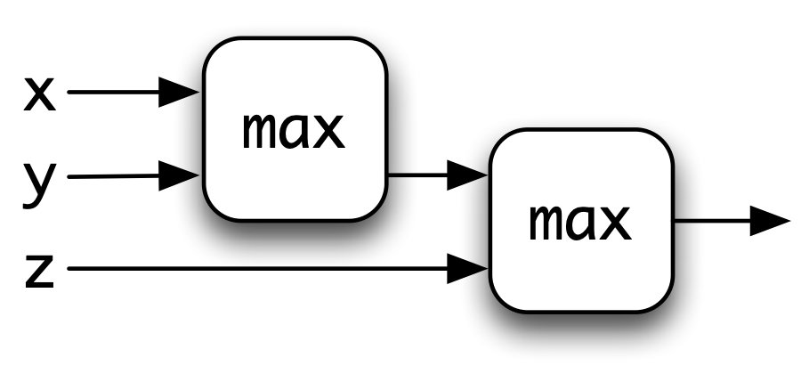<span class="img-wrapper"></span></label></figure>

and in Haskell

```haskell
maxThree x y z = max (max x y) z
```

or writing the `max` in its infix form, `‘max‘`,

```haskell
maxThree x y z = (x `max` y) `max` z
```

Using `max` in this way has some advantages.

The definition of `maxThree` is considerably shorter and easier to read than the original. If at some point we changed the way that `max` was calculated -- perhaps making it a built-in function -- then this definition would get the benefit of the 'new' `max`. This is not such an advantage in a small example like this, but can be of considerable benefit in a larger-scale system where we can expect software to be modified and extended over its lifetime.

### Can I break the problem down into simpler parts? {#can-i-break-the-problem-down-into-simpler-parts .unnumbered}

If we cannot solve a problem as it stands, we can think about breaking it down into smaller parts. This principle of 'divide and conquer' is the basis of all larger-scale programming: we solve aspects of the problem separately and then put them together to give an overall solution.

How do we decide how to break a problem down into parts? We can think of solving a simpler problem and then building the full solution on top, or we can ask ourselves the question here.

#### **What if** I had any functions I wanted: which could I use in writing the solution? {#what-if-i-had-any-functions-i-wanted-which-could-i-use-in-writing-the-solution .unnumbered}

This *what if ...?* is a central question, because it breaks the problem into two parts. First we have to give the solution *assuming* we are given the auxiliary functions we want and thus without worrying about how they are to be defined. Then, we have separately to define these auxiliary functions.

<figure><label class="checkbox-label"><input class="checkbox-img" type="checkbox">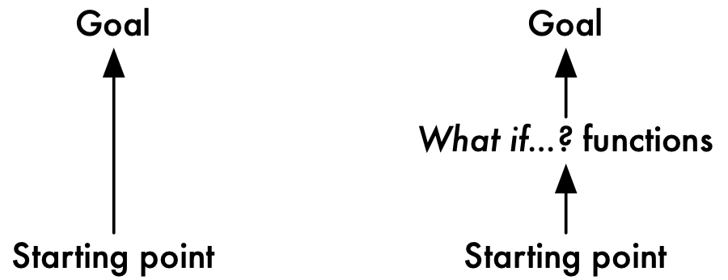<span class="img-wrapper"></span></label></figure>

Instead of a single jump from the starting point to the goal, we have two shorter jumps, each of which should be easier to do. This approach is called **top-down** as we start at the top with the overall problem, and work by breaking it down into smaller problems.

This process can be done repeatedly, so that the overall problem is solved in a series of small jumps. We now look at an example; more examples appear in the exercises at the end of the section.

Suppose we are faced with the problem of defining

```haskell
middleNumber
middleNumber :: Integer -> Integer -> Integer -> Integer 
```

according to the first of the alternatives described. A model is given by the definition of `maxThree`, in which we give conditions for `x` to be the solution, `y` to be the solution and so on. We can therefore sketch out our solution like this

```haskell
middleNumber x y z
  | condition for x to be solution      = x
  | condition for y to be solution      = y
  ....
```

Now, the problem comes in writing down the conditions, but here we say *what if* we had a function to do this. Let us call it `between`. It has three numbers as arguments, and a Boolean result,

```haskell
between
between :: Integer -> Integer -> Integer -> Bool
```

and is defined so that `between m n p` is `True` if `n` is between `m` and `p`. We can complete the definition of `middleNumber` now:

```haskell
middleNumber x y z
  | between y x z      = x
  | between x y z      = y
  | otherwise          = z
```

The definition of the function `between` is left as an exercise for the reader.

This section has introduced some of the general ideas which can help us to get started in solving a problem. Obviously, because programming is a creative activity there is not going to be a set of rules which will always lead us mechanically to a solution to a problem. On the other hand, the questions posed here will get us started, and show us some of the alternative strategies we can use to plan how we are going to write a program.

We'll follow this up in the next section, where we look at another way we can break problems down and solve them in steps. After that we'll take a first look at how to define our own data types in solving problems. We take up the discussion again in [Developing higher-order programs](12.md#moreDesign).

**Exercises**

1.  This question is about the function

    ```haskell
    maxFour :: Integer -> Integer -> Integer -> Integer -> Integer
    ```

    which returns the maximum of four integers. Give three definitions of this function: the first should be modelled on that of `maxThree`, the second should use the function `max` and the third should use the functions `max` and `maxThree`. For your second and third solutions give diagrams to illustrate your answers. Discuss the relative merits of the three solutions you have given.

2.  Give a definition of the function

    ```haskell
    between :: Integer -> Integer -> Integer -> Bool
    ```

    discussed in this section. The definition should be consistent with what we said in explaining how `middleNumber` works. You also need to think carefully about the different ways that one number can lie between two others. You might find it useful to define a function

    ```haskell
    weakAscendingOrder :: Integer -> Integer -> Integer -> Bool
    ```

    so that `weakAscendingOrder m n p` is `True` exactly when `m`, `n` and `p` are in weak ascending order, that is the sequence does not go down at any point. An example of such a sequence is `2 3 3`.

3.  Give a definition of the function

    ```haskell
    howManyEqual
    howManyEqual :: Integer -> Integer -> Integer -> Integer
    ```

    which returns how many of its three arguments are equal, so that

    ```haskell
    howManyEqual 34 25 36 = 0
    howManyEqual 34 25 34 = 2
    howManyEqual 34 34 34 = 3
    ```

    Think about what functions you have already seen -- perhaps in the exercises -- which you can use in the solution.

4.  Give a definition of the function

    ```haskell
    howManyOfFourEqual :: Integer -> Integer -> Integer -> Integer -> Integer
    ```

    which is the analogue of `howManyEqual` for four numbers. You may need to think *what if ...?*.

Solving a problem in steps: local definitions {#intro-localdefs}
---------------------------------------------

<a id="localDefs"></a>
In this section we'll look at a way that we can make *local* definitions as a part of making a function definition: these might be definitions of useful functions, or of values which we can use in defining our answers. We start by looking at some examples, and then discuss some of the details of the `where` and `let` constructs.

### Examples {#examples .unnumbered}

<label class="checkbox-label"><input class="checkbox-img" type="checkbox">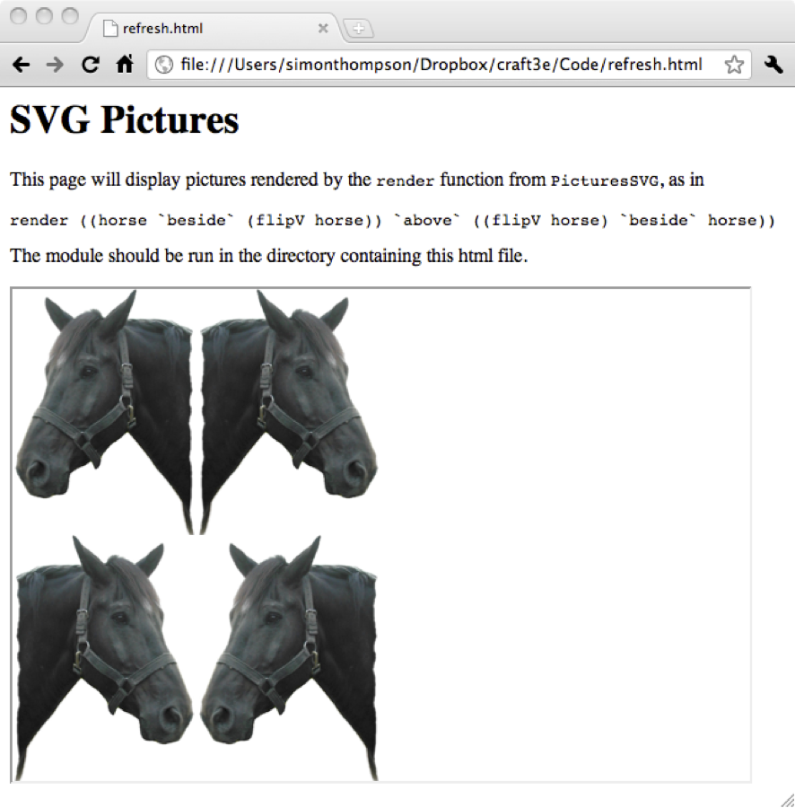<span class="img-wrapper"></span></label>

The example we will follow is to define a function over pictures, as implemented in the module `PicturesSVG.hs`. Suppose we want to define a function that takes a picture like horse, and delivers the picture first shown in Figure [Viewing Pictures in a web browser](1.md#svgpix).

One way to tackle it is to start this way:

```haskell
fourPics :: Picture -> Picture

fourPics pic =
    left `beside` right
      where
        left  = ...
        right = ...
```

where we define what `left` and `right` mean in the *local definitions* that follow the `where`. The reason these are called 'local' is that they can only be used in the definition of the `fourPics` function, and nowhere else.

So, we have broken the problem down into two parts, each simpler than the whole problem. Let's look at the `left` first. We get this by putting the `pic` above an inverted version, so giving us

```haskell
fourPicswhere
fourPics :: Picture -> Picture

fourPics pic =
    left `beside` right
      where
        left  = pic `above` invertColour pic
        right = ...
```

Now, there are a number of ways of finishing off the definition. Let's look at three of these now.

-   Let's start by defining `right` *from scratch*, like this

    ```haskell
    fourPics :: Picture -> Picture

    fourPics pic =
        left `beside` right
          where
            left  = pic `above` invertColour pic
            right = invertColour (flipV pic) `above` flipV pic
    ```

-   We could modify this solution so that we *add another local definition* to help us. In this case we define `flipped` as the original `pic` flipped in a vertical mirror. We do this because we can use this in defining the right hand side in a similar way to how we defined the left.

    ```haskell
    fourPics :: Picture -> Picture

    fourPics pic =
        left `beside` right
          where
            left    = pic `above` invertColour pic
            right   = invertColour flipped `above` flipped
            flipped = flipV pic
    ```

-   We could *use* the definition of `left` in defining `right`: we get `right` from `left` by reflecting it in a vertical mirror, and then inverting the colour (or the other way around), so giving the definition

    ```haskell
    fourPics :: Picture -> Picture

    fourPics pic =
        left `beside` right
          where
            left  = pic `above` invertColour pic
            right = invertColour (flipV left)
    ```

-   Finally, we could define a *local function*; this is a function we can use only within the definition of `fourPics`, and not elsewhere. The function `stack` will put a picture above its inverted version; we'll then use `stack` in defining the `left` and `right` parts of the picture.

    ```haskell
    fourPics :: Picture -> Picture

    fourPics pic =
        left `beside` right
          where
            stack p  = p `above` invertColour p
            left     = stack pic
            right    = stack (invertColour (flipV pic))
    ```

As you can see from this example, there's often more than one way of solving a problem, but a very useful tool in each of these solutions was to use local definitions.

Another more mathematical example is given by a function to calculate the area of a triangle with sides `a`, `b` and `c`. The formula for this is `√(s*(s-a)*(s-b)*(s-c))` where `s` is `(a+b+c)/2`. As a definition in Haskell this becomes

```haskell
triArea
triArea :: Float -> Float -> Float -> Float

triArea a b c 
    | possible   = sqrt(s*(s-a)*(s-b)*(s-c))
    | otherwise  = 0
    where
      s = (a+b+c)/2 
      possible = ... for you to define ...
```

Defining `possible` is left as an exercise: this value should be `True` only if it's possible to have a triangle with those sides. Each of the numbers should be positive, and each side should satisfy the *triangle inequality*: the length of the side is less than the sum of the other two sides.

> **`let` expressions**
>
> It is also possible to make definitions local to an expression, rather than local to a function clause as for `where`. For instance, we can write
>
> ``` {.haskell}
> let x = 3+2 in x^2 + 2*x - 4
> ```
>
> giving the result `31`. If more than one definition is included in one line they need to be separated by semi-colons, thus:
>
> ``` {.haskell}
> ;
> let x = 3+2 ; y = 5-1 in x^2 + 2*x - y
> ```
>
> We shall find that we use this form only occasionally.

### Calculation with local definitions {#calculation-with-local-definitions .unnumbered}

We look at how to calculate with local definitions by taking the example of a function which is to return the sum of the squares of two integers.

```haskell
sumSquares :: Integer -> Integer -> IntegersumSquares

sumSquares n m 
  = sqN + sqM
    where
    sqN = n*n
    sqM = m*m
```

where the `where` clause is used to find the two squares.

The way in which calculations are written can be extended to deal with `where` clauses. The sumSquares function in the previous section gives, for example

```haskell
sumSquares 4 3
= sqN + sqM
  where
  sqN = 4*4 = 16
  sqM = 3*3 = 9
= 16 + 9
= 25
```

The values of the local definitions are calculated beneath the `where` if their values are needed. All local evaluation below the `where` is indented. To follow the top-level value, we just have to look at the calculation at the left-hand side.

The vertical lines which appear are used to link the successive steps of a calculation when these have intermediate `where` calculations. The lines can be omitted.

### Layout {#layout .unnumbered}

In definitions with `where` clauses, the layout is significant. The offside rule is used by the system to determine the end of each definition in the `where` clause.

The `where` clause must be found in the definition to which it belongs, so that the `where` must occur somewhere to the right of the start of the definition. Inside the `where` clause, the same rules apply as at the top level: it is therefore important that the definitions are aligned vertically -- if not, an error will result. Our recommended layout is therefore

```haskell
f p_1 p_2 ... p_k
  | g_1          = e_1  
   ...
  | otherwise   = e_r  
    where
    v_1  a_1 ... a_n = r_1
    v_2 = r_2
    ....
```

The `where` clause here is attached to the whole of the conditional equation, and so is attached to all the clauses of the conditional equation.

This example also shows that the local definitions can include functions -- here `v_1` is an example of a local function definition. We have given type declarations for all top-level definitions; it is

also possible to give type declarations for `where`-defined objects in Haskell. In cases where the type of a locally defined object is not obvious from its context, our convention is to include a declaration of its type.

### Scopes {#scopes .unnumbered}

A Haskell script consists of a sequence of definitions. The **scope** of a definition is that part of the program in which the definition can be used. All definitions at the top-level in Haskell have as their scope the whole script that they are defined in: that is, they can be used in all the definitions the script contains. In particular they can be used in definitions which occur before theirs in the script, as in

```haskell
isOdd, isEven :: Int -> Bool

isOdd n 
  | n<=0        = False
  | otherwise   = isEven (n-1)

isEven n 
  | n<0         = False
  | n==0        = True
  | otherwise   = isOdd (n-1)
```

Local definitions, given by `where` clauses, are not intended to be 'visible' in the whole of the script, but rather just in the conditional equation in which they appear. The same is true of the variables in a function definition: their scope is the whole of the conditional equation in which they appear.

Specifically, in the example which follows, the scope of the definitions of `sqx`, `sqy` and `sq` and of the variables `x` and `y` is given by the large box; the smaller box gives the scope of the variable `z`.

```haskell
maxsq x y maxsq
  
| sqx > sqy     = sqx

| otherwise     = sqy


    where

    sqx  = sq x

    sqy  = sq y


    sq :: Int -> Int

    sq z = z*z


```

In particular it is important to see that

-   the variables appearing on the left-hand side of the function definition -- `x` and `y` in this case -- can be used in the local definitions; here they are used in `sqx` and `sqy`;

-   local definitions can be used before they are defined: `sq` is used in `sqx` here;

-   local definitions can be used in results and in guards as well as in other local definitions.

It is possible for a script to have two definitions or variables with the same name. In the example below, the variable `x` appears twice. Which definition is in force at each point? The *most local* is the one which is used.

```haskell
maxsq x y 
  
| sq x > sq y   = sq x

| otherwise     = sq y


    where


    sq x = x*x


```

In the example, we can think of the inner box *cutting a hole* in the outer, so that the scope of the outer `x` will exclude the definition of `sq`. When one definition is contained inside another the best advice is that different variables and names should be used for the inner definitions unless there is a very good reason for using the same name twice.

Finally note that it is not possible to have multiple definitions of the same name at the same level; one of them needs to be hidden if a clash occurs due to the combination of a number of modules.

**Exercises**

1.  Give two other ways of completing the definition of `fourPics` given in this section.

2.  Another way of solving the problem is to break it down into one picture above another, as in

    ```haskell
    fourPics :: Picture -> Picture

    fourPics pic =
        top `above` bottom
          where
            top    = ...
            bottom = ...
    ```

    Give three different ways of completing this definition.

3.  Give two other ways of defining the `fourPics` function.

4.  Define the `possible` value as used in the `triArea` function.

5.  Define the function

    ```haskell
    maxThreeOccurs :: Int -> Int -> Int -> (Int,Int)
    ```

    which returns the maximum of three integers paired with the number of times it occurs among the three. A natural solution first finds the maximum, and then investigates how often it occurs among the three. Discuss how you would write your solution if you were not allowed to use `where`-definitions.

6.  Give sample calculations of

    ```haskell
    maxThreeOccurs 4 5 5
    maxThreeOccurs 4 5 4
    ```

    using your definition of `maxThreeOccurs` from the previous question.

Defining types for ourselves: enumerated types {#EnumTypes}
----------------------------------------------

Often the first thing we need to do in solving a problem is to find the right types to model the problem domain. While Haskell comes with a comprehensive set of basic data types, which we discussed in [Basic types and definitions](3.md#BasicTypes), and ways of building complex types from simpler ones, which we'll discuss in the coming chapters, it also makes sense to define types which directly model the problem domain. This is done with Haskell `data` types: this section introduces the simplest cases of these types in the context of a gaming example.

### Rock - Paper - Scissors {#rock---paper---scissors .unnumbered}

<label class="checkbox-label"><input class="checkbox-img" type="checkbox"><span class="img-wrapper"></span></label>

Two players choose one of Rock, Paper and Scissors after counting to three and making one of these gestures:

-   **A clenched fist** which represents a rock.

-   **A flat hand** representing a piece of paper.

-   **Index and middle figure extended** which represents a pair of scissors.

If they choose the same gesture, neither wins; if not, the result is decided this way:

-   Rock defeats scissors, because a rock will blunt a pair of scissors.

-   Paper defeats rock, because a paper can wrap up a rock.

-   Scissors defeat paper, because scissors cut paper.

Suppose that we want to model this in Haskell. One option would be to use integers, characters or strings (which we'll find out about later), but none of these is ideal, for a number of reasons.

-   A choice may well be arbitrary: what numbers should we associate with 'rock', which with 'scissors'?

-   The type we would choose would have lots of other elements which don't correspond to anything in the game.

So, instead, we will define a `data` type with three members

```haskell
Move
data Move = Rock | Paper | Scissors
```

where we list the members separated by a vertical bar. We can also put the different members on different lines, like this:

```haskell
data Move = Rock | 
            Paper | 
            Scissors
```

Whatever the case, we add another line -- some 'Haskell magic' which we'll explain in [Overloading, type classes and type checking](13.md#typeClasses) -- which allows us to compare elements of this type for equality, and also to be able to see them printed out (or 'shown'), like so:

```haskell
deriving
data Move = Rock | Paper | Scissors
            deriving (Show,Eq)
```

Now we can begin to define functions using the `Move` type. Let's write a function which tells us the move to `beat` a particular move:

```haskell
beat
beat :: Move -> Move

beat Rock     = Paper
beat Paper    = Scissors
beat Scissors = Rock
```

and also the move that will `lose` against a particular move.

```haskell
lose
lose :: Move -> Move

lose Rock  = Scissors
lose Paper = Rock
lose _     = Paper
```

In the definition of `lose` we've used a wildcard '\_' instead of `Scissors` in the final clause of the definition. That is because this clause is only matched when the others don't, and that will only happen for the value `Scissors`.

We will come back to this example in [Rock - Paper - Scissors: strategies](8.md#strategiesRPS) once we have covered lists in Haskell, when we'll look at some of the strategies for playing (and winning!) Rock - Paper - Scissors.

**Exercises**

1.  Define a `data` type `Result` which represents the outcome of a round of rock - paper - scissors, which will either be a win. lose or draw.

2.  Define a function

    ```haskell
    outcome :: Move -> Move -> Result
    ```

    so that this gives the outcome of a round for the first player. For example, we should expect that `outcome Rock Scissors` should be a win.

3.  We have added some 'magic' to the `Chapter4` module to allow QuickCheck properties to be tested over the `Move` type. Define a QuickCheck property which connects the results of `beat` and `lose`.

4.  How would you define a QuickCheck property to test the `outcome` function?

### Standard types {#standard-types .unnumbered}

We can see some standard types as being defined in this way. In particular, we could define `Bool` like this:

```haskell
Bool
data Bool = False | True
            deriving (Show, Eq, Ord)
```

Deriving `Ord` means that the elements have an ordering defined on them; in this case `False < True`.

**Exercises**

1.  Define a type of seasons, `Season`, and give a function from seasons to temperature given by the type

    ```haskell
    data Temp = Cold | Hot
                deriving (Eq, Show, Ord)
    ```

    In defining this function assume that you're in the UK.

2.  Define a type `Month` and a function from this type to `Season`, assuming that you're in the northern hemisphere.

Recursion {#recursionIntro}
---------

Recursion is an important programming mechanism, in which a definition of a function or other object refers to the object itself. This section concentrates on explaining the idea of recursion, and why it makes sense. In particular we give two complementary explanations of how primitive recursion works in defining the factorial function over the natural numbers. In the section after this we look at how recursion is *used* in practice.

### Getting started: a story about factorials {#getting-started-a-story-about-factorials .unnumbered}

Suppose that someone tells us that the factorial of a natural number is the product of all natural numbers from one up to (and including) that number, so that, for instance

```haskell
fac 6 = 1*2*3*4*5*6
```

Suppose we are also asked to write down a table of factorials, where we take the factorial of zero to be one. We begin thus

```haskell
  n      fac n
  0        1
  1        1 
  2        1*2 = 2
  3        1*2*3 = 6
  4        1*2*3*4 = 24
```

but we notice that we are repeating a lot of multiplication in doing this. In working out

```haskell
1*2*3*4
```

we see that we are repeating the multiplication of `1*2*3` before multiplying the result by `4`

```haskell
1*2*3    *4
```

and this suggests that we can produce the table in a different way, by saying how to start

```haskell
fac 0 = 1  -- (fac.1)
```

which starts the table thus

```haskell
  n      fac n
  0        1
```

and then by saying how to go from one line to the next

```haskell
fac n = fac (n-1) * n  -- (fac.2)
```

since this gives us the lines

```haskell
  n      fac n
  0        1
  1        1*1 = 1
  2        1*2 = 2
  3        2*3 = 6
  4        6*4 = 24
```

and so on.

What is the moral of this story? We started off describing the table in one way, but came to see that all we needed was the information in `(fac.1)` and `(fac.2)`.

-   `(fac.1)` tells us the first line of the table, and

-   `(fac.2)` tells us how to get from one line of the table to the next.

The table is just a written form of the factorial function, so we can see that `(fac.1)` and `(fac.2)` actually describe the **function** to calculate the factorial, and putting them together we get

```haskell
fac
fac :: Integer -> Integer
fac n
  | n==0        = 1
  | n>0         = fac (n-1) * n
```

A definition like this is called **recursive** because we actually use `fac` in describing `fac` itself. Put this way it may sound paradoxical: after all, how can we describe something in terms of itself? But, the story we have just told shows that the definition is perfectly sensible, since it gives

-   a starting point: the value of `fac` at `0`, and

-   a way of going from the value of `fac` at a particular point, `fac (n-1)`, to the value of `fac` on the next line, namely `fac n`.

These recursive rules will give a value to `fac n` whatever the (positive) value `n` has -- we just have to write out `n` lines of the table, as it were.

### Recursion and calculation {#recursion-and-calculation .unnumbered}

The story in the previous section described how the definition of factorial

```haskell
fac :: Integer -> Integer
fac n
  | n==0        = 1  -- (fac.1)
  | n>0         = fac (n-1) * n  -- (fac.2)
```

can be seen as generating the table of factorials, starting from `fac 0` and working up to `fac 1`, `fac 2` and so forth, up to any value we wish.

We can also read the definition in a calculational way, and see recursion justified in another way. Take the example of `fac 4`

```haskell
fac 4
~> fac 3 * 4
```

so that `(fac.2)` replaces one goal -- `fac 4` -- with a simpler goal -- finding `fac 3` (and multiplying it by `4`). Continuing to use `(fac.2)`, we have

```haskell
fac 4
~> fac 3 * 4
~> (fac 2 * 3) * 4
~> ((fac 1 * 2) * 3) * 4
~> (((fac 0 * 1) * 2) * 3) * 4
```

Now, we have got down to the simplest case (or **base case**),

which is solved by `(fac.1)`.

```haskell
~> (((1 * 1) * 2) * 3) * 4
~> ((1 * 2) * 3) * 4
~> (2 * 3) * 4
~> 6 * 4
~> 24
```

In the calculation we have worked from the goal back down to the base case, using the **recursion step**

`(fac.2)`. We can again see that we get the result we want, because the recursion step takes us from a more complicated case to a simpler one, and we have given a value for the simplest case (zero, here) which we will eventually reach.

We have now seen in the case of `fac` two explanations for why recursion works.

-   The **bottom-up** explanation says that the `fac` equations can be seen to generate the values of `fac` one-by-one from the base case at zero.

-   A **top-down** view starts with a goal to be evaluated, and shows how the equations simplify this until we hit the base case.

The two views here are related, since we can think of the top-down explanation generating a table too, but in this case the table is generated as it is needed. Starting with the goal of `fac 4` we require the lines for `0` to `3` also.

Technically, we call the form of recursion we have seen here **primitive recursion**. We will describe it more formally in the next section, where we examine how to start to find recursive definitions. Before we do that, we discuss another aspect of the `fac` function as defined here.

### Undefined or error values {#undefined-or-error-values .unnumbered}

Our definition of factorial covers zero and the positive integers. What will be the effect of applying `fac` to a negative number? On evaluating `fac (-2)` in GHCi we receive the error message

```haskell
*** Exception: Chapter4.hs:(106,0)-(108,33): 
        Non-exhaustive patterns in function fac
```

because `fac` is not defined on the negative numbers, since the patterns in the definition of `fac` don't cover the case of negative numbers.

We could if we wished extend the definition to zero, on the negative numbers, thus

```haskell
fac n
  | n==0        = 1
  | n>0         = fac (n-1) * n
  | otherwise   = 0
```

or we could include our own error message, as follows

```haskell
fac n
  | n==0        = 1
  | n>0         = fac (n-1) * n
  | otherwise   = error "fac only defined on natural numbers"error
```

so that when we evaluate `fac (-2)` we receive the message

```haskell
Program error: fac only defined on natural numbers
```

The error message here is a Haskell string, as discussed in Chapter 5.

**Exercises**

1.  Define the function `rangeProduct` which when given natural numbers `m` and `n` returns the product

    ```haskell
    m*(m+1)*...*(n-1)*n
    ```

    You should include in your definition the type of the function, and your function should return `0` when `n` is smaller than `m`.\
    Hint: you do not need to use recursion in your definition, but you may if you wish.

2.  As `fac` is a special case of `rangeProduct`, write a definition of `fac` which *uses* `rangeProduct`.

Primitive recursion in practice
-------------------------------

This section examines how primitive recursion is used in practice by examining a number of examples.

The pattern of primitive recursion says that we can define a function from the natural numbers `0`, `1`, ...by giving the value at zero, and by explaining how to go from the value at `n-1` to the value at `n`. We can give a **template** for this

```haskell
fun n
  | n==0        = ....  -- (prim)
  | n>0         = .... fun (n-1) ....
```

where we have to supply the two right-hand sides.

How can we decide whether a function can be defined in this way? Just as we did earlier in the chapter, we frame a question which summarizes the essential property we need for primitive recursion to apply.

#### **What if** we were given the value fun (n-1). How could we define fun n from it? {#what-if-we-were-given-the-value-fun-n-1.-how-could-we-define-fun-n-from-it .unnumbered}

We see how this form of recursion works in practice by looking at some examples.

**Example 1.**

1em Suppose first that we are asked to define the function to give us powers of two for natural numbers

```haskell
power2 :: Integer -> Integer
```

so that `power2 n` is 2\^n, that is `2` multiplied by itself `n` times. The template is

```haskell
power2 n
  | n==0        = ....
  | n>0         = .... power2 (n-1) ....
```

In the zero case the result is `1`, and in general 2\^n is 2\^n-1 multiplied by 2, so we define

```haskell
power2
power2 n
  | n==0        = 1
  | n>0         = 2 * power2 (n-1)
```

**2.** As the next example we take the function

```haskell
sumFacs
sumFacs :: Integer -> Integer
```

so that

```haskell
sumFacs n = fac 0 + fac 1 + ... + fac (n-1) + fac n
```

If we are told that `sumFacs 4` is `34` then we can work out `sumFacs 5` in one step: we simply add `fac 5`, that is `120`, giving the result `154`. This works in general, and so we can fill in the template like this:

```haskell
sumFacs
sumFacs :: Integer -> Integer
sumFacs n
  | n==0        = 1
  | n>0         = sumFacs (n-1) + fac n  
```

In fact this pattern works for any function `f` of type `Integer -> Integer` in the place of `fac`, so we can say

```haskell
sumFun
sumFun :: (Integer -> Integer) -> Integer -> Integer
sumFun f n
  | n==0        = f 0
  | n>0         = sumFun f (n-1) + f n  
```

where the function whose values are being added is itself an argument of the `sumFun` function. A sample calculation using `sumFun` is

```haskell
sumFun fac 3
~> sumFun fac 2 + fac 3
~> sumFun fac 1 + fac 2 + fac 3
~> sumFun fac 0 + fac 1 + fac 2 + fac 3
~> fac 0 + fac 1 + fac 2 + fac 3
~> ...
~> 10
```

and we can define `sumFacs` from `sumFun` thus:

```haskell
sumFacs n = sumFun fac n
```

We briefly introduced the idea of functions as data in [Introducing functional programming](1.md#intro), and we will revisit it in detail in [Generalization: patterns of computation](10.md#patternsGen). As we mentioned in [Introducing functional programming](1.md#intro), having functions as arguments is powerful and `sumFun` gives a good example: one definition serves to sum the values of *any* function of type `Integer -> Integer` over the range of arguments from `0` to `n`.

**3.** As a last example we look at a geometrical problem. Suppose we want to find out the maximum number of pieces we can get by making a given number of straight-line cuts across a piece of paper. With no cuts we get one piece; what about the general case? Suppose we have `n-1` lines already, and that we add one more.

<figure><label class="checkbox-label"><input class="checkbox-img" type="checkbox">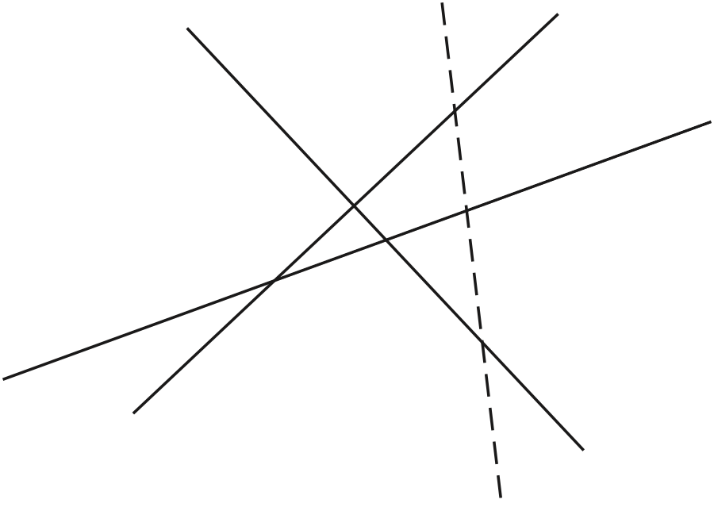<span class="img-wrapper"></span></label></figure>

We will get the most new regions if we cross each of these lines; because they are straight lines, we can only cut each one once. This means that the new line crosses exactly `n` of the regions, and so splits each of these into two. We therefore get `n` new regions by adding the `n`th line. Our function definition is given by filling in the template `(prim)` according to what we have said.

```haskell
regions
regions :: Integer -> Integer 
regions n
  | n==0        = 1
  | n>0         = regions (n-1) + n
```

**Exercises**

1.  Using the addition function over the natural numbers, give a recursive definition of multiplication of natural numbers.

2.  The integer square root of a positive integer `n` is the largest integer whose square is less than or equal to `n`. For instance, the integer square roots of `15` and `16` are `3` and `4`, respectively. Give a primitive recursive definition of this function.

3.  Given a function `f` of type `Integer -> Integer` give a recursive definition of a function of type `Integer -> Integer` which on input `n` returns the maximum of the values `f 0`, `f 1`, ..., `f n`. You might find the `max` function defined in [Guards](3.md#guards) useful.

    To test this function, add to your script a definition of some values of `f` thus:

    ```haskell
    f 0 = 0
    f 1 = 44
    f 2 = 17
    f _ = 0
    ```

    and so on; then test your function at various values.

4.  Given a function `f` of type `Integer -> Integer` give a recursive definition of a function of type `Integer -> Bool` which on input `n` returns `True` if one or more of the values `f 0`, `f 1`, ..., `f n` is zero and `False` otherwise.

5.  Can you give a definition of `regions` which instead of being recursive *uses* the function `sumFun`?

6.  \[Harder\] Find out the maximum number of pieces we can get by making a given number of flat (that is planar) cuts through a solid block. It is *not* the same answer as we calculated for straight-line cuts of a flat piece of paper.

Extended exercise: pictures
---------------------------

This section looks at how recursion over integers can be used to describe geometrical patterns, using pictures as implemented in `PicturesSVG` (or `Pictures`). We start by giving a definition of a line of `n` black squares:

```haskell
blackSquares :: Integer -> Picture

blackSquares n
  | n<=1         = black
  | otherwise = black `beside` blackSquares (n-1)
```

or diagrammatically,

<figure><label class="checkbox-label"><input class="checkbox-img" type="checkbox">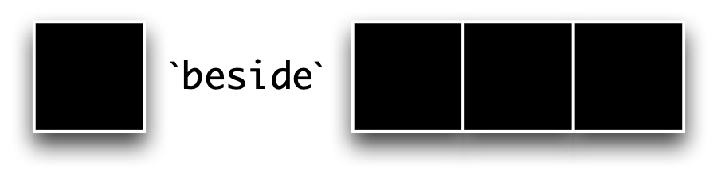<span class="img-wrapper"></span></label></figure>

Suppose that we want to build a line of alternating black and white squares: we get this by putting a black square on the front of a line beginning with a white square:

```haskell
blackWhite :: Integer -> Picture

blackWhite n
  | n<=1         = black
  | otherwise = black `beside` whiteBlack (n-1)
```

where `whiteBlack` is the function that builds a line of alternating squares, beginning with a white. Diagrammatically this is given by

<figure><label class="checkbox-label"><input class="checkbox-img" type="checkbox">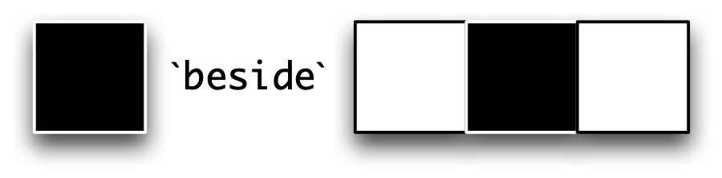<span class="img-wrapper"></span></label></figure>

Using these functions we can build chessboards of any shape:

```haskell
blackChess :: Integer -> Integer -> Picture

blackChess n m
  | n<=1         = blackWhite m
  | otherwise = blackWhite m `above` whiteChess (n-1) m
```

where the corresponding function `whiteChess` builds a board with a white square in the top left-hand corner. Diagrammatically,

<figure><label class="checkbox-label"><input class="checkbox-img" type="checkbox">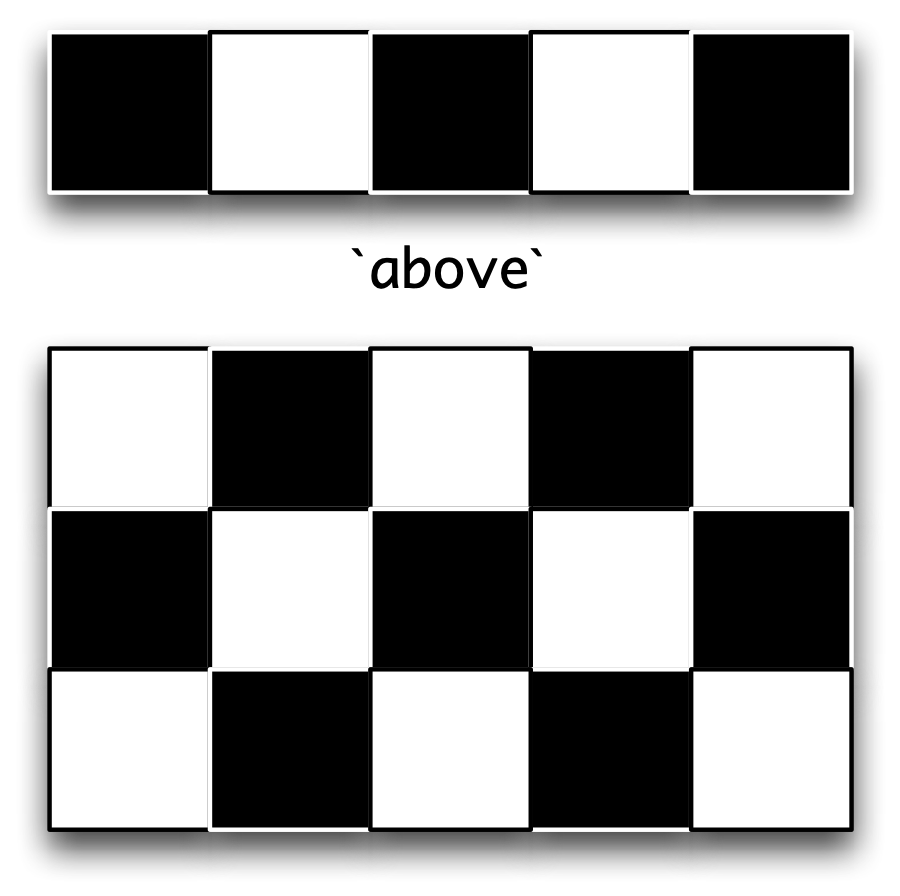<span class="img-wrapper"></span></label></figure>

<label class="checkbox-label"><input class="checkbox-img" type="checkbox">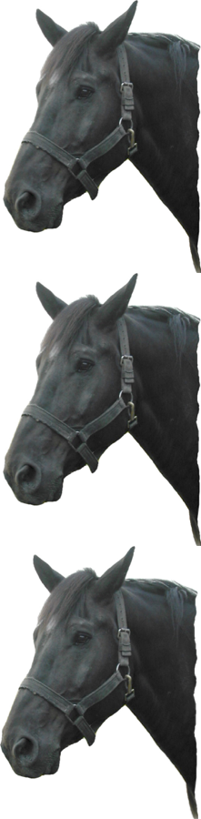<span class="img-wrapper"></span></label>

**Exercises**

1.  Complete the definitions of `whiteBlack` and `whiteChess`.

2.  How would you define a function to give a column of pictures,

    ```haskell
    column :: Picture -> Integer -> Picture
    ```

    so that the result of ` column horse 3 ` is as shown to the right.

3.  Give a Haskell function which takes an integer `n` and returns an `n` by `n` white square with a diagonal black line from top left to bottom right, as in.

    <figure><label class="checkbox-label"><input class="checkbox-img" type="checkbox">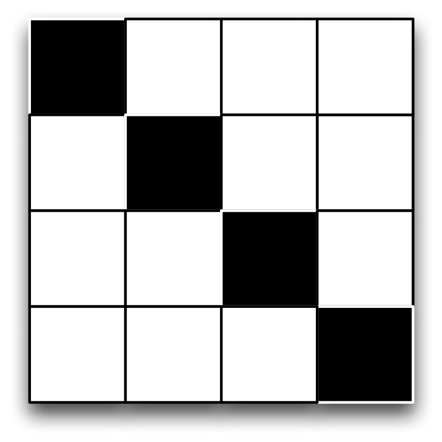<span class="img-wrapper"></span></label></figure>

4.  Give a Haskell function which takes an integer `n` and returns an `n` by `n` white square with a diagonal black line from top right to bottom left, as in.

    <figure><label class="checkbox-label"><input class="checkbox-img" type="checkbox">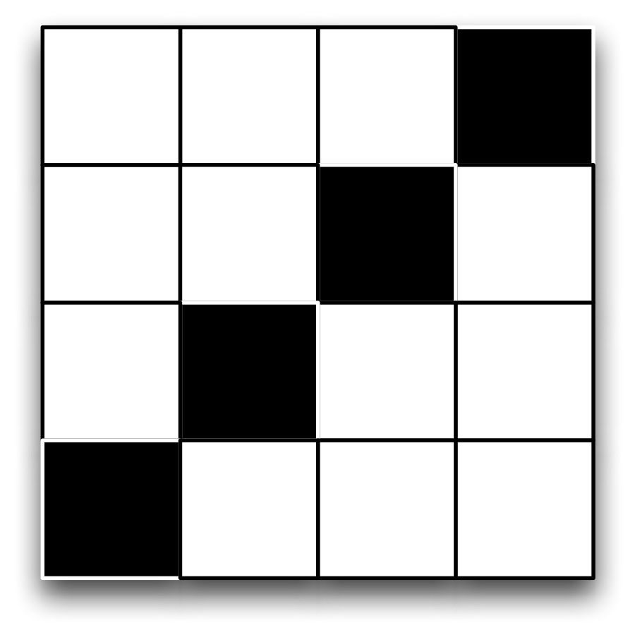<span class="img-wrapper"></span></label></figure>

5.  Give a Haskell function which takes an integer `n` and returns an `n` by `n` white square with both diagonals coloured black, as in.

    <figure><label class="checkbox-label"><input class="checkbox-img" type="checkbox">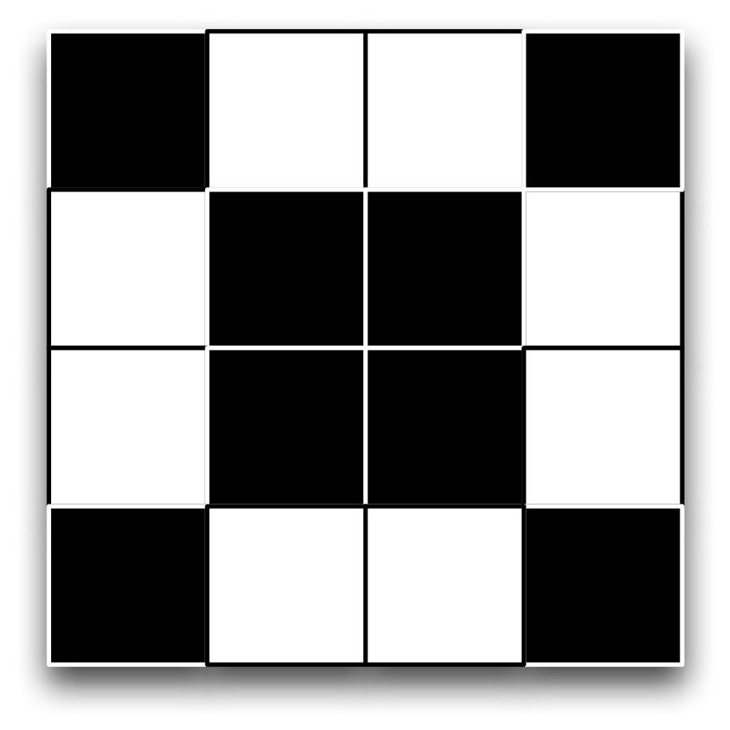<span class="img-wrapper"></span></label></figure>

6.  Can you give a direct recursive definition of a function

    ```haskell
    chessBoard :: Integer -> Picture
    ```

    so that

    ```haskell
    chessBoard n = ... chessBoard (n-1) ...
    ```

    Hint: you might want to use some of the functions defined here, or variants of them, in writing your definition.

General forms of recursion {#genRecursion}
--------------------------

As we explained in [Recursion](#recursionIntro), a recursive definition of a function such as `fac` would give the value of `fac n` using the value `fac (n-1)`. We saw there that `fac (n-1)` is *simpler* in being closer to the base case `fac 0`. As long as we preserve this property of becoming simpler, different patterns of recursion are possible and we look at some of them in this section. These more general forms of recursion are called **general recursion**. In trying to use recursion to define a function we need to pose the question:

#### In defining f n which values of f k would help me to work out the answer? {#in-defining-f-n-which-values-of-f-k-would-help-me-to-work-out-the-answer .unnumbered}

**Example 2.**

**1.** The sequence of Fibonacci numbers starts with `0` and `1`,

and subsequent values are given by adding the last two values, so that we get `0+1=1`, `1+1=2` and so forth. This can be given a recursive definition as follows

```haskell
fib :: Integer -> Integer
fib n 
  | n==0        = 0
  | n==1        = 1
  | n>1         = fib (n-2) + fib (n-1)
```

where we see in the general case that `fib n` depends upon not only `fib (n-1)` but also `fib (n-2)`.

This gives a clear description of the Fibonacci numbers, but unfortunately it gives a very inefficient program for calculating them. We can see that calculating `fib n` requires us to calculate both `fib (n-2)` and `fib (n-1)`, and in calculating `fib (n-1)` we will have to calculate `fib (n-2)` *again*. We look at ways of overcoming this problem in Section 5.2.

**2.** Dividing one positive integer by another can be done in many different ways. One of the simplest ways is repeatedly to subtract the divisor from the number being divided, and we give a program doing that here. In fact we will define two functions

```haskell
remainder :: Integer -> Integer -> Integer
divide    :: Integer -> Integer -> Integer
```

which separately give the division's remainder and quotient.

In trying to find a definition it often helps to look at an example. Suppose we want to divide `37` by `10`. We expect that

```haskell
remainder 37 10 = 7
divide    37 10 = 3
```

If we subtract the divisor, `10`, from the number being divided, `37`, how are the values related?

```haskell
remainder 27 10 = 7
divide    27 10 = 2
```

The remainder is the same, and the result of the division is one less. What happens at the base case? An example is

```haskell
remainder 7 10 = 7
divide    7 10 = 0
```

Using these examples as a guide, we have

```haskell
remainder m n 
  | m<n         = m
  | otherwise   = remainder (m-n) n
```

```haskell
divide m n
  | m<n         = 0
  | otherwise   = 1 + divide (m-n) n
```

These definitions also illustrate another important point: a general recursive function does not always give an answer; instead an evaluation may go on forever. Look at what happens if we evaluate

```haskell
remainder 7 0
~> remainder (7-0) 0
~> remainder 7 0
~> ....
```

This calculation will loop for ever, and indeed we should expect problems if we try to divide by zero! However, the problem also appears if we try to divide by a negative number, for instance

```haskell
divide 4 (-4)
~> divide (4-(-4)) (-4)
~> divide 8 (-4)
~> ...
```

The lesson of this example is that in general there is no guarantee that a function defined by recursion will always **terminate**. We will have termination if we use primitive recursion, and other cases where we are sure that we always go from a more complex case to a simpler one; the problem in the example here is that subtracting a negative number increases the result, giving a more complex application of the function.

**Exercises**

1.  Give a recursive definition of a function to find the highest common factor of two positive integers.

2.  Suppose we have to raise `2` to the power `n`. If `n` is even, `2*m` say, then

    ```haskell
    2^n = 2^2*m = (2^m)^2
    ```

    If `n` is odd, `2*m+1` say, then

    ```haskell
    2^n = 2^2*m+1 = (2^m)^2*2
    ```

    Give a recursive function to compute 2\^n which uses these insights.

Program testing {#testing}
---------------

Just because a program is accepted by the Haskell system, it does not mean that it necessarily does what it should. How can we be sure that a program behaves as it is intended to? One option, first aired in [Tests, properties and proofs](1.md#proof), is to **prove** in some way that it behaves correctly. Proof is, however, an expensive business, and we can get a good deal of assurance that our programs behave correctly by testing the program.

If we are not to use proof, then we can use **QuickCheck** to test properties of functions using randomly generated data. This has a number of advantages -- we don't have to select input data, for example -- but we do need to define the properties to be tested, and it is not always clear how to do this. So, we can also do traditional testing, where we specify the inputs and expected result for a function.

The art of testing is then to choose the inputs to be as comprehensive as possible. That is, we want to test data to represent all the different 'kinds' of input that can be presented to the function.

How might we choose test data? There are two possible approaches. We could simply be told the **specification** of the function, and devise test data according to that. This is called **black box** testing, as we cannot see into the box which contains the function. On the other hand, in devising **white box** tests we can use the form of the function definition itself to guide our choice of test data. We will explore these two in turn, by addressing the example of the function which is to return the maximum of three integers,

```haskell
maxThree
maxThree :: Integer -> Integer -> Integer -> Integer
```

### Black box testing {#black-box-testing .unnumbered}

How can we make a rational choice of test data for a function, rather than simply picking (supposedly) random numbers out of the air?

What we need to do is try to partition the inputs into different **testing groups** where we expect the function to behave in a similar way for all the values in a given group. In picking the test data we then want to make sure that we choose at least one representative from each group.

We should also pay particular attention to any **special cases**, which will occur on the 'boundaries' of the groups. If we have groups of positive and negative numbers, then we should pay particular attention to the zero case, for instance.

What are the testing groups for the example of `maxThree`? There is not a single right answer to this, but we can think about what is likely to be relevant to the problem and what is likely to be irrelevant. In the case of `maxThree` it is reasonable to think that the size or sign of the integers will not be relevant: what will determine the result is their relative ordering. We can make a first subdivision this way

-   all three values different;

-   all three values the same;

-   two items equal, the third different. In fact, this represents two cases

    -   two values equal to the maximum, one other;

    -   one value equal to the maximum, two others.

We can then pick a set of test data thus

```haskell
6 4 1
6 6 6
2 6 6
2 2 6
```

If we test our definition in [Guards](3.md#guards) with these data then we see that the program gives the right results.

We can code these tests in the HUnit unit testing framework, like this:

```haskell
testMax1 = TestCase (assertEqual "for: maxThree 6 4 1" 6 (maxThree 6 4 1))
testMax2 = TestCase (assertEqual "for: maxThree 6 6 6" 6 (maxThree 6 6 6))
testMax3 = TestCase (assertEqual "for: maxThree 2 6 6" 6 (maxThree 2 6 6))
testMax4 = TestCase (assertEqual "for: maxThree 2 2 6" 6 (maxThree 2 2 6))

-- To run the tests, type 
--   runTestTT testsMaxrunTestTT

testsMax = TestList [testMax1, testMax2, testMax3, testMax4]
```

Let's look at what is going on here. The final line collects all the tests into a list, which allows us to run the tests in one go, as we see below. Each test case involves some 'boilerplate' code, but the crucial parts are the three arguments to `assertEqual` (which says we're doing a test of two things being equal):

-   A `String` printed in case the test fails, e.g. `"for: maxThree 6 4 1"`.=-1

-   The *expected result*, e.g. `6`.

-   The *expression we want to evaluate*, e.g. `maxThree 6 4 1`.

We can run the tests in GHCi like this:

```haskell
*Chapter4> runTestTT testsMax
Cases: 4  Tried: 4  Errors: 0  Failures: 0
Counts {cases = 4, tried = 4, errors = 0, failures = 0}
```

The following program also meets these tests:

```haskell
mysteryMax
mysteryMax :: Integer -> Integer -> Integer -> Integer
mysteryMax x y z
  | x > y && x > z      = x
  | y > x && y > z      = y
  | otherwise           = z
```

so should we conclude that `mysteryMax` computes the maximum of the three inputs? If we do, we are wrong, for we have that

```haskell
mysteryMax 6 6 2 ~> 2
```

If we add the following test case to the test set:

```haskell
testMax5 = TestCase (assertEqual "for: mysteryMax 6 6 2" 6 (mysteryMax 6 6 2))
testsMMax = TestList [testMMax1, testMMax2, testMMax3, testMMax4, testMMax5]
```

and run the tests, we get these results:

```haskell
*Chapter4> runTestTT testsMMax
### Failure in: 4
for: mysteryMax 6 6 2
expected: 6
 but got: 2
Cases: 5  Tried: 5  Errors: 0  Failures: 1
Counts {cases = 5, tried = 5, errors = 0, failures = 1}
```

This is an important example: it tells us that **testing alone cannot assure us that a function is correct**. How might we have spotted this error in designing our test data? We could have said that not only did we need to consider the groups above, but that we should have looked at all the different possible orderings of the data, giving

-   all three values different: six different orderings;

-   all three values the same: one ordering;

-   two items equal, the third different. In each of the two cases we consider three orderings.

The final case generates the test data `6 6 2` which find the error.

We mentioned special cases earlier: we could see this case of two equal to the maximum in this way. Clearly the author of `mysteryMax` was thinking about the general case of three different values, so we can see the example as underlining the importance of looking at special cases.

### White box testing {#white-box-testing .unnumbered}

In writing white box test data we will be guided by the principles which apply to black box testing, but we can also use the form of the program to help us choose data.

-   If we have a function containing guards, we should supply data for each case in the definition. We should also pay attention to 'boundary conditions' by testing the equality case when a guard uses `>=` or `>`, for example.

-   If a function uses recursion we should test the zero case, the one case and the general case.

In the example of `mysteryMax` we should be guided to the data `6 6 2` since the first two inputs are at the boundaries of the guards

```haskell
x > y && x > z                       y > x && y > z
```

We take up the ideas discussed in this section when we discuss proof in [Reasoning about programs](9.md#reasoningProgs).

> **QuickCheck with `Int` and `Integer`**
>
> Suppose we define
>
> ``` {.haskell}
> \ \ fact :: Int -> Int
>   
> \ \ fact n
>
> \ \ \ \ | n>1       = n * fact (n-1)
>
> \ \ \ \ | otherwise = 1
> ```
>
> we would expect this property to be true whatever the input `n`:
>
> ``` {.haskell}
> \ \ prop_fact n =
>
> \ \ \ \ fact n > 0
> ```
>
> But if we try this out, we get this result
>
> ``` {.haskell}
> \ \ *Chapter4> quickCheck prop_fact
>
> \ \ *** Failed! Falsifiable (after 14 tests and 2 shrinks):    
> 17
> ```
>
> and we can see that this is indeed true:
>
> ``` {.haskell}
> \ \ *Chapter4> fact 17
>
> \ \ -288522240
> ```
>
> This is because `Int` is a fixed-size representation of integers, and when numbers become big enough, they 'wrap around' into the negative.
>
> The lesson of this example is that if you expect the integers in your program to behave like the 'real' integers, then you should use `Integer` rather than `Int`.

**Exercises**

1.  Devise test data for a function

    ```haskell
    allEqual :: Integer -> Integer -> Integer -> Bool
    ```

    intended to test whether its three integer inputs are equal.

2.  Use the test data from the previous question to test the function

    ```haskell
    solution m n p = ((m+n+p)==3*p)
    ```

    Discuss your results.

3.  The function

    ```haskell
    allDifferent :: Integer -> Integer -> Integer -> Bool
    ```

    should return `True` only if all its inputs are different. Devise black box test data for this function.

4.  Test the following function

    ```haskell
    attempt m n p = (m/=n) && (n/=p)
    ```

    using the test data written in the previous question. What do you conclude on the basis of your results?

5.  Devise test data for a function

    ```haskell
    howManyAboveAverage :: Integer -> Integer -> Integer -> Integer
    ```

    which returns how many of its three integer inputs are larger than their average value.

6.  Devise test data for a function to raise two to a positive integer power.

7.  Repeat these exercises to define QuickCheck properties which can be used to test these functions.

Summary {#summary .unnumbered}
-------

This chapter has introduced some general principles of program design.

-   We should think about how best to use what we already know. If we have already defined a function `f` we can make use of it in two ways.

    -   We can *model* our new definition on the definition of `f`.

    -   We can *use* `f` in our new definition.

-   We should think about how to break the problem into smaller, more easily solved, parts. We should ask *What if I had \...?*.

    -   This could be another function, which we can define separately.

    -   It could also be a local definition, defined in a `where` clause.

-   We can define `data` types to model our problem domain. We'll come back to this in later chapters, where we'll discover ways of building complex types from simpler ones, as well as how to define more complex `data` types.

-   We can use recursion to define functions.

We also explained the basics of recursion, and saw how it is used in practice to define a variety of functions. We shall see many more illustrations of this when we look at recursion over lists in Chapter 7.

We concluded by showing that it was possible to think in a principled way about designing test data for function definitions rather than simply choosing the first data that came to mind.
