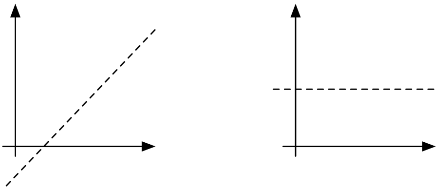
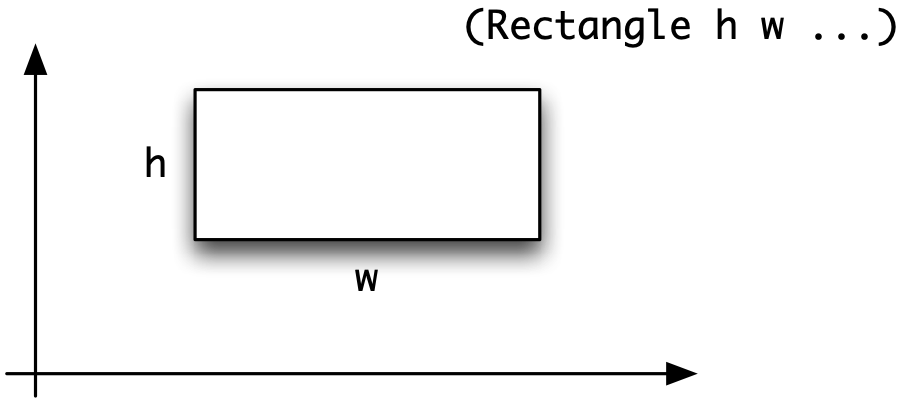
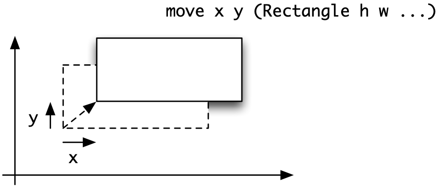

Data types, tuples and lists {#tupleList}
============================

Thus far we have looked at programs which work over the basic types `Integer`, `Int`, `Float`, `Bool` and `Char`, and we have also seen how to design enumerated types like the `Move` type in the Rock - Paper - Scissors game. We've also looked at strategies for designing programs in general, including breaking problems down into smaller problems to solve them in steps. However, in practical problems we will want to represent more complex things, as we saw with our `Picture` example in Chapter [Introducing functional programming](1.md#intro).

This chapter introduces two ways of building compound data built into Haskell; these are the **tuple** and the **list**, and in particular the `String` type. We'll also look again at ways of defining `data` types for ourselves. Together they are enough to let us represent many different kinds of 'structured' information. We shall meet other ways of defining data types for ourselves in Chapters [Algebraic types](14.md#algTypes) and [Abstract data types](16.md#adt).

After looking at these various types, we'll explain how to manipulate tuples and lists, and in particular we introduce the 'list comprehension' notation to write down descriptions of how lists may be formed from other lists, and use this in a database case study.

In the chapters to come we look at the range of built-in list processing functions, aw well as how list-manipulating functions can be defined from scratch.

Introducing tuples and lists
----------------------------

Both tuples and lists are built up by combining a number of pieces of data into a single object, but they have different properties.

-   In a tuple, we combine a fixed number of values of fixed types -- which might be different -- into a single object.

-   In a list we combine an arbitrary number of values -- all of the same type -- into a single object.

Let's look at an example to clarify the difference. Suppose that we want to make a simple model of a supermarket, and as part of that model we want to record the contents of someone's shopping basket.

#### Individual items {#individual-items .unnumbered}

A given item has a name and a price (in pence), and we therefore need somehow to combine these two pieces of information. We do this in a tuple, such as

```haskell
("Salt:\ 1kg",139)
("Plain crisps",25)
```

where in each tuple a `String` is combined with an `Int`.

-   The `String` gives the name of the item.

-   The `Int` gives its price, in pence.[^1]

We can give names to types in Haskell, so that types are made easier to read, and we name this **tuple type** `ShopItem` like this:

```haskell
type
type ShopItem = (String,Int)ShopItem
```

Now we can say that '`("Salt: 1kg",139)` is a `ShopItem`' or

```haskell
("Salt:\ 1kg",139) ::\ ShopItem
```

#### The shopping basket {#the-shopping-basket .unnumbered}

How are the contents of the basket represented? We know that we have a collection of items, but we do not know in advance how many we have; one basket might contain ten items, another one three; a third might be empty. Each item is represented in the same way, as a member of the `ShopItem` type, and so we represent the contents of the basket by a **list** of these, as in the list

```haskell
[ ("Salt:\ 1kg",139) , ("Plain crisps",25) , ("Gin:\ 1lt",1099) ]
```

This is a member of the **list type**

```haskell
[ (String,Int) ]
```

which we can also write

```haskell
[ ShopItem ]
```

Other members of this list type include the empty list, `[]`, and the basket above with a second packet of crisps replacing the gin:

```haskell
[ ("Salt:\ 1kg",139) , ("Plain crisps",25) , ("Plain crisps",25) ]
```

We can give a name to this type too:

```haskell
type
type Basket   = [ShopItem]Basket
```

We now look at tuple types in more detail, and examine some examples of how tuples are used in practice.

Tuple types
-----------

The last section introduced the idea of tuple types. In general a tuple type is built up from components of simpler types. The type

```haskell
(t_1,t_2,...,t_n)
```

consists of tuples of values

```haskell
(v_1,v_2,...,v_n)
```

in which `::`, ..., `::`. In other words, each component `` of the tuple has to have the type `` given in the corresponding position in the tuple type.

The reason for the name 'tuple' is that these objects are usually called pairs, triples, quadruples, quintuples, sextuples and so on. The general word for them is therefore 'tuple'. In other programming languages, these types are called records or structures; see Appendix [Functional, imperative and OO programming](appendix1.md#vs) for a more detailed comparison.

We can model a type of supermarket items by the `ShopItem` type defined by

```haskell
type ShopItem = (String,Int)
```

and we saw above that its members include items like `("Gin, 1lt",1099)`. How else are tuple types used in programs? We look at a series of examples now.

First, we can use a tuple to return a compound result from a function, as in the example where we are required to return both the minimum and the maximum of two `Integers`

```haskell
minAndMax :: Integer -> Integer -> (Integer,Integer)minAndMax
minAndMax x y
  | x>=y        = (y,x)
  | otherwise   = (x,y)
```

Secondly, suppose we are asked to find a (numerical) solution to a problem when it is uncertain whether a solution actually exists in every case: this might be the question of where a straight line meets the horizontal or x-axis, for instance.

{width="3in"}

One way of dealing with this is for the function to return a `(Float,Bool)` pair. If the boolean part is False, this signals that no solution was found; if it is like (2.1,True), it indicates that `2.1` is indeed the solution.

### Pattern matching {#pattern-matching .unnumbered}

Next we turn to look at how functions can be defined over tuples. Functions over tuples are usually defined by **pattern matching**. Instead of writing a variable for an argument of type `(Integer,Integer)`, say, a **pattern**,

`(x,y)` is used.

```haskell
addPair :: (Integer,Integer) -> IntegeraddPair
addPair (x,y) = x+y
```

On application the components of the pattern are matched by the corresponding components of the argument, so that on applying the function `addPair` to the argument `(5,8)` the value `5` is matched to `x`, and `8` to `y`, giving the calculation

```haskell
addPair (5,8) 
~> 5+8
~> 13
```

Patterns can contain literals and nested patterns, as in the examples

```haskell
addPair (0,y) = y
addPair (x,y) = x+y

shift :: ((Integer,Integer),Integer) -> (Integer,(Integer,Integer))
shift ((x,y),z) = (x,(y,z))
```

Functions which pick out particular parts of a tuple can be defined by pattern matching. For the `ShopItem` type, the definitions might be

```haskell
name  :: ShopItem -> String
price :: ShopItem -> Int

name  (n,p) = n
price (n,p) = p
```

Haskell has these **selector functions** on pairs built in. They are

```haskell
fst (x,y) = xfst
snd (x,y) = ysnd
```

Given these selector functions we can avoid pattern matching if we so wish. For instance, we could redefine `addPair` like this

```haskell
addPair :: (Integer,Integer) -> IntegeraddPair
addPair p = fst p + snd p
```

but generally a pattern-matching definition is easier to read than one which uses selector functions instead.

We first introduced the Fibonacci numbers

```haskell
0, 1, 1, 2, 3, 5, ... , u, v, (u+v), ...
```

in Section [General forms of recursion](4.md#genRecursion), where we gave an inefficient recursive definition of the sequence. Using a tuple we can give an efficient solution to the problem. The next value in the sequence is given by adding the previous two, so what we do is to write a function which returns *two consecutive values* as a result. In other words we want to define a function `fibPair` so that it has the property that

```haskell
fibPair n = (fib n , fib (n+1))
```

then given such a pair, `(u,v)` we get the next pair as `(v,u+v)`, which is exactly the effect of the `fibStep` function:

```haskell
fibStep :: (Integer,Integer) -> (Integer,Integer)fibStep
fibStep (u,v) = (v,u+v)
```

This gives us the definition of the 'Fibonacci pair' function

```haskell
fibPair :: Integer -> (Integer,Integer)fibPair
fibPair n
  | n==0        = (0,1)
  | otherwise   = fibStep (fibPair (n-1))
```

and we can define

```haskell
fastFib :: Integer -> IntegerfastFib
fastFib = fst . fibPair
```

where recall that '`.`' composes the two functions, passing the output of `fibPair` to the input of `fst`, which picks out its first component.

**Exercises**

1.  Give a definition of the function

    ```haskell
    maxOccurs :: Integer -> Integer -> (Integer,Integer)
    ```

    which returns the maximum of two integers, together with the number of times it occurs. Using this, or otherwise, define the function

    ```haskell
    maxThreeOccurs :: Integer -> Integer -> Integer -> (Integer,Integer)
    ```

    which does a similar thing for three arguments.

2.  Give a definition of a function

    ```haskell
    orderTriple :: (Integer,Integer,Integer) -> (Integer,Integer,Integer)
    ```

    which puts the elements of a triple of three integers into ascending order. You might like to use the `maxThree`, `middle` and `minThree` functions defined earlier.

3.  Define the function which finds where a straight line crosses the x-axis. You will need to think about how to supply the information about the straight line to the function.

4.  Design test data for the preceding exercises; explain the choices you have made in each case. Give a sample evaluation of each of your functions.

Introducing algebraic types {#introAlg}
---------------------------

We have already seen that it's useful to be able to define our own enumerated types, such as a move in the Rock - Paper - Scissors game, a day of the week, or a season of the year. In this section we'll see that we can use `data` types for much more general combinations of values.

Algebraic data type definitions are introduced by the keyword `data`, followed by the name of the type, an equals sign and then information about how elements are constructed by applying **constructors**. The names of the type and the constructors begin with capital letters.

We give a sequence of examples of increasing complexity, first recapping enumerated types, then looking at single constructor product types, and finally looking at types which contain a number of alternative 'shapes' of data. We look again at `data` types in Chapter [Algebraic types](14.md#algTypes).

### Enumerated types {#enumerated-types .unnumbered}

We have already seen examples of this, such as the type modelling a move in the Rock - Paper - Scissors game, in Section [Defining types for ourselves: enumerated types](4.md#EnumTypes). Recall that the definition lists the elements of the type, thus:

```haskell
data Move = Rock | Paper | Scissors Move
            deriving (Eq,Show)
```

and we can define functions by pattern matching over the values, as in

```haskell
score
score :: Move -> Move -> Integer
score Rock Rock     = 0
score Rock Paper    = -1
score Rock Scissors = 1
score Paper Rock    = 1
```

As we noted in Section [Defining types for ourselves: enumerated types](4.md#EnumTypes) we can derive definitions of functions like equality using a '`deriving`' clause in the definition of a `data` type so that we don't need to define these functions for ourselves when we introduce a new data type definition. We will talk about the details of what underlies this in Section [Algebraic types and type classes](14.md#algClasses).

### Product types {#product-types .unnumbered}

Instead of using a tuple we can define a `data` type with a number of components or fields, often called a **product** type. An example might be

```haskell
PersonPeople
data People = Person Name Age   -- (People)
              deriving (Eq,Show)
```

where `Name` is a synonym for `String`, and `Age` for `Int`, written thus:

```haskell
type Name = String
type Age  = Int
```

The definition of `People` should be read as saying `28pcTo construct an element of type People, you need to supply two values; one, st say, of type Name, and another, n say, of type Age. The element of People formed from them will be Person st n.` Example values of this type include

```haskell
Person "Electric Aunt Jemima" 77
Person "Ronnie" 14
```

As before, functions are defined using **pattern matching**. Any element of type `People` will have the form `Person st n`, and so we can use this pattern on the left-hand side of a definition,

```haskell
showPerson :: People -> String
showPerson (Person st n) = st ++ " -- " ++ show n
```

(recall that `show` gives a textual form of an `Int`). For instance,

```haskell
showPerson (Person "Electric Aunt Jemima" 77)
 = "Electric Aunt Jemima -- 77"
```

Elements of the `People` type are made (or `constructed`) by applying the **constructor** `Person`. This is called a **binary** constructor

because it takes two values to form a value of type `People`. For the enumerated types like `Move` the constructors are called **nullary**

(or *0-ary*) as they take no arguments.

The constructors introduced by algebraic type definitions can be used just like functions, so that `Person st n` is the result of applying the function `Person` to the arguments `st` and `n`; we can interpret the definition `(People)` as giving the **type of the constructor**, here

```haskell
Person :: Name -> Age -> People
```

The examples of types given here are a special case of what we look at next.

### Alternatives {#alternatives .unnumbered}

A shape in a simple geometrical program is either a circle or a rectangle. These alternatives are given by the type

```haskell
CircleRectangle
data Shape = Circle Float |  -- (Shape)Shape
             Rectangle Float Float
             deriving (Eq,Ord,Show)
```

which says that there are two ways of building an element of `Shape`. One way is to supply the radius of a `Circle`; the other alternative is to give the sides of a `Rectangle`. Example objects of this type are

```haskell
Circle 3.0
Rectangle 45.9 87.6
```

Pattern matching allows us to define functions by cases, as in

```haskell
isRound :: Shape -> Bool
isRound (Circle _)      = True
isRound (Rectangle _ _) = False
```

and also lets us use the components of the elements: <a id="areaDef"></a>

```haskell
area :: Shape -> Float
area (Circle r)      = pi*r*r
area (Rectangle h w) = h*w
```

Another way of reading the definition `(Shape)` is to say that there are two **constructor functions** for the type `Shape`, whose types are

```haskell
Circle    :: Float -> Shape
Rectangle :: Float -> Float -> Shape
```

These functions are called constructor functions because the elements of the type are constructed by applying these functions.

Extensions of this type, to accommodate the position of an object, are discussed in the exercises at the end of this section.

### The general form of algebraic type definitions {#the-general-form-of-algebraic-type-definitions .unnumbered}

The general form of the algebraic type definitions which we have seen so far is

```haskell
data Typename   -- (Typename)
  = Con_1 t_11 ... t_1k_1 | 
    Con_2 t_21 ... t_2k_2 | 
        ....
    Con_n t_n1 ... t_nk_n   
```

Each `` is a constructor, followed by  types, where  is a non-negative integer which may be zero. We build elements of the type `Typename` by applying these constructor functions to arguments of the types given in the definition, so that

```haskell
Con_i v_i1 ... v_ik_i
```

will be a member of the type `Typename` if is in for `j` ranging from `1` to .

Reading the constructors as functions, the definition `(Typename)` gives the constructors the following types

```haskell
Con_i :: t_i1 -> ... -> t_ik_i -> Typename
```

In Chapter [Algebraic types](14.md#algTypes) we shall see two extensions of the definitions seen already.

-   The types can be **recursive**; we can use the type we are defining, `Typename`, as (part of) any of the types . This gives us lists, trees and many other data structures.

-   The `Typename` can be followed by one or more type variables which may be used on the right-hand side, making the definition **polymorphic**.

Recursive polymorphic types combine these two ideas, and this powerful mixture provides types which can be reused in many different situations -- the built-in type of lists is an example of this kind of type. We look at these in Chapter [Algebraic types](14.md#algTypes).

For the moment, however, we'll deal with the simple cases we have covered in this section, which are enough to model a wide variety of different problem domains, particularly in conjunction with tuples and lists.

**Exercises**

1.  Define a function to give the length of the perimeter of a geometrical shape, of type `Shape`. What is the type of this function?

2.  Re-define the `Item` type for supermarket products so that it uses a `data` definition rather than a `type` definition.

3.  Add an extra constructor to `Shape` for triangles, and extend the functions `isRound`, `area` and `perimeter` to include triangles.

4.  Define a function which decides whether a `Shape` is regular: a circle is regular, a square is a regular rectangle and being equilateral makes a triangle regular.

5.  Investigate the derived definitions for `Move` and `Shape`: what form do the `show` functions take, for example?

6.  Define an `==` function over `Shape` so that all circles of negative radius are equated. How would you treat rectangles with negative sides?

7.  The type `Shape` takes no account of the position or orientation of a shape. After deciding how to represent points, how would you modify the original definition of `Shape` to contain the **centre** of each object? You can assume that rectangles lie with their sides parallel to the axes, thus:

    {width="3in"}

8.  Calling the new shape type `NewShape`, define a function

    ```haskell
    move :: Float -> Float -> NewShape -> NewShape 
    ```

    which moves a shape by the two offsets given:

    {width="3.5in"}

9.  Define a function to test whether two `NewShapes` overlap.

10. Some houses have a number; others have a name. How would you implement the type of 'strings or numbers' used as a part of an address? Write a function which gives the textual form of one of these objects. Give a definition of a type of names and addresses using the type you have defined.

Our approach to lists
---------------------

Lists are a remarkably expressive data type. We can represent a text as a list of lines, each of which is a list of words; we can represent a collection of information, like a supermarket bill, as a list of individual items of data; we can represent a collection of readings from a measuring device as a list of `Floats`, to mention but three potential applications.

At the same time, there are many different things which we can do to lists, some of which first came out in our implementation of `Pictures` by lists in Chapter [Introducing functional programming](1.md#intro). Given a list we can split it up according to various criteria, we can sort it, select items from it and transform all its members in a particular way. We can combine lists by joining them together or by coalescing corresponding elements. We can combine all the members of a list together -- by taking their sum, maximum or conjunction, say -- among many other operations. Haskell contains many built-in list functions and operators in the standard prelude `Prelude.hs` and also various library modules, including `List.hs`.

Because Haskell has so many list functions built in, we can approach our discussion of lists in two very different ways. We could argue that we should start by defining list-manipulating functions for ourselves, and only use library functions after we have understood their definitions.[^2] On the other hand, we could adopt a 'toolkit' approach, and simply discuss the library functions and how they can be used. What we aim to do here is to combine the two approaches, often introducing and using functions before they are defined explicitly, but then looking 'under the bonnet' to see how these functions are defined and how we can define other functions for ourselves.

In the remainder of this chapter we introduce some of the facilities for list manipulation within Haskell, particularly *list comprehensions* which give a flexible notation for transforming and selecting elements of lists. This is followed in Chapter [Programming with lists](6.md#progLists) with an overview of the list functions available to the Haskell programmer, and in Chapter [Defining functions over lists](7.md#defFunLists) we see how to define these and other functions for ourselves.

Lists in Haskell
----------------

A list in Haskell is a collection of items from a given type. For every type `t` there is a Haskell type `[t]` of lists of elements from `t`.

```haskell
[1,2,3,4,1,4] :: [Integer]
[True]        :: [Bool]
```

We read these as '`[1,2,3,4,1,4]` is a list of `Integer`' and '`[True]` is a list of `Bool`'. `String` is a synonym

for and the two lists which follow are the same.

```haskell
['a','a','b'] :: String
"aab"         :: String
```

We can build lists of items of any particular type, and so we can have lists of functions and lists of lists of numbers, as in

```haskell
[fastFib,fastFib]  :: [ Integer -> Integer ]
[[12,2],[2,12],[]] :: [ [Integer] ]
```

As can be seen, the list with elements ``, ``, ``, `` and `` is written by enclosing the elements in square brackets, separated by commas, like this

```haskell
[e_1,e_2,e_3,e_4,e_5]
```

As a special case the empty list, `[]`, which contains no items, is an element of every list type.

The order of the items in a list is significant, as is the number of times that an item appears. The three lists of numbers which follow are therefore all different:

```haskell
[1,2,1,2,2]
[2,1,1,2,2]
[2,1,1,2]
```

The first two have length `5`, while the third has length `4`; the first element of the first list is `1`, while the first element of the second is `2`. A set is another kind of collection in which the ordering of items and the number of occurrences of a particular item are not relevant; we look at sets in Chapter [Abstract data types](16.md#adt).

There are some other ways of writing down lists of numbers, characters and other enumerated types

-   `[n .. m]` is the list `[n,n+1,…,m]`; if `n` exceeds `m`, the list is empty.

    ```haskell
    [2 ..\ 7]     ~>[2,3,4,5,6,7]
    [3.1 ..\ 7.0] ~>[3.1,4.1,5.1,6.1,7.1]
    ['a' ..\ 'm'] ~>"abcdefghijklm"
    ```

-   `[n,p .. m]` is the list of numbers whose first two elements are `n` and `p` and whose last is `m`, with the numbers ascending in steps of `p-n`. For example,

    ```haskell
    [7,6 ..\ 3]       ~>[7,6,5,4,3]
    [0.0,0.3 ..\ 1.0] ~>[0.0,0.3,0.6,0.8999999999999999]
    ['a','c' ..\ 'n'] ~>"acegikm"
    ```

-   In both cases it can be seen that if the step size does not allow us to reach `m` exactly, the last item of the list is the element in the sequence that is closest to `m`, even if it appears to "overshoot" the limit. It can also be the case that rounding errors on `Float` lead to lists being different from what is anticipated; an example is given in the exercises.

In the next section we turn to a powerful method of writing down lists which we can use to define a variety of list-manipulating functions.

### The `String` type {#the-string-type .unnumbered}

We first introduced the string type `String` in Section [char](3.md#char), and saw there that strings are sequences of characters, that is sequences of `Char`s. In fact, the `String` type is a special case of lists,

```haskell
type String = [Char]
```

and all the polymorphic prelude functions in Figure [Some polymorphic list operations from Prelude.hs.](6.md#polyListOps) can be used over strings. We saw in Section [char](3.md#char) how to write the special characters such as newline and tab using the 'escapes' `’’` and `’’`, and also how we could join strings using '`++`': of course, we can use that operator on *any* list type. Other functions over strings can be found in the library `Data.String`.

Built into Haskell are the overloaded functions `show` and `read`, which convert from a value to a `String` and vice versa; for instance,

```haskell
show (2+3)           ~>"5"
show (True || False) ~>"True"
```

In the opposite direction, the function `read` is used to convert a string to the value it represents, so that

```haskell
read "True" ~>True
read "3"    ~>3
```

In some situations it will not be clear what should be the result type for `read` -- it is then possible to give a type to the application, as in

```haskell
(read "3") :: Integer
```

the result of which will be `3` and its type, `Integer`.

We saw in Section [char](3.md#char) that `show` and `read` could be used to and from `String` from other types; a full explanation of the types of `read` and `show` can be found in Chapter [Overloading, type classes and type checking](13.md#typeClasses).

**Exercises**

1.  What value has the expression `[0, 0.1 .. 1]`? Check your answer in GHCi and explain any discrepancy there might be between the two.

2.  How many items does the list `[2,3]` contain? How many does `[[2,3]]` contain? What is the type of `[[2,3]]`?

3.  What is the result of evaluating `[2 .. 2]`? What about `[2,7 .. 4]`? Try evaluating `[2,2 .. 2]`; to **interrupt evaluation** in GHCi under Windows or Unix you need to type `Ctrl-C`.

List comprehensions {#listComps}
-------------------

One of the distinct features of a functional language is the list comprehension notation, which has no parallels in other paradigms.

In a list comprehension we write down a description of a list in terms of the elements of another list. From the first list we **generate** elements, which we **test** and **transform** to form elements of the result. We will describe list comprehensions with a single generator in this section; Section 17.3 covers the general case. Nevertheless, the simple case we look at here is very useful in writing a variety of list-processing programs. We introduce the topic by a series of examples.

Suppose that the list `ex` is `[2,4,7]`, then the list comprehension

```haskell
[ 2*n | n<-ex]  -- (1)
```

will be

```haskell
[4,8,14]
```

as it contains each of the elements `n` of the list `ex`, doubled: `2*n`. We can read `(1)` as saying

> 'Take all `2*n` where `n` comes from `ex`.'

where the symbol `<-` is meant to resemble the mathematical symbol for being an element, '`∈`'. We can write the evaluation of the list comprehension in a table, thus:

```haskell
[ 2*n | n <- [2,4,7] ] 
 
  n   =   2   4   7
2*n   =   4   8  14
```

In a similar way,

```haskell
[ isEven n | n<-ex ] ~>[True,True,False]
```

if the function `isEven` has the definition

```haskell
isEven :: Integer -> Bool
isEven n = (n `mod` 2 == 0)
```

In list comprehensions `n<-ex` is called a **generator** because it

generates the data from which the results are built. On the left-hand side of the '`<-`' there is a variable, `n`, while on the right-hand side we put the list, in this case `ex`, from which the elements are taken.

We can combine a generator with one or more **tests**, which are Boolean expressions, thus:

```haskell
[ 2*n | n <- ex , isEven n , n>3 ]  -- (2)
```

`(2)` is paraphrased as

> 'Take all `2*n` where `n` comes from `ex`, `n` is even and greater than `3`.'

Again, we can write the evaluation in tabular form.

```haskell
[ 2*n | n <- [2,4,7] , isEven n , n>3 ]
 
       n   =   2   4   7
isEven n   =   T   T   F
     n>3   =   F   T   
     2*n   =       8   
```

The result of `(2)` will therefore be the list `[8]`, as `4` is the only even element of `[2,4,7]` which is greater than `3`.

Instead of placing a variable to the left of the arrow '`<-`', we can put a pattern. For instance,

```haskell
addPairs :: [(Integer,Integer)] -> [Integer]addPairs
addPairs pairList = [ m+n | (m,n) <- pairList ]
```

Here we choose all the pairs in the list `pairList`, and add their components to give a single number in the result list. For example,

```haskell
[ m+n | (m,n) <- [(2,3),(2,1),(7,8)] ]
 
  m   =   2   2   7  
  n   =   3   1   8
m+n   =   5   3  15
```

giving the result

```haskell
addPairs [(2,3),(2,1),(7,8)] ~>[5,3,15]
```

We can add tests in such a situation, too:

```haskell
addOrdPairs :: [(Integer,Integer)] -> [Integer]
addOrdPairs pairList = [ m+n | (m,n) <- pairList , m<n ]
```

so that with the same input example,

```haskell
[ m+n | (m,n) <- [(2,3),(2,1),(7,8)] , m<n ]
 
  m   =   2   2   7  
  n   =   3   1   8
m<n   =   T   F   T
m+n   =   5      15
```

giving

```haskell
addOrdPairs [(2,3),(2,1),(7,8)] ~>[5,15]
```

since the second pair in the list, `(2,1)`, fails the test.

Note that we can simply test elements, with the effect that we filter some of the elements of a list, according to a Boolean condition. To find all the digits in a string we can say

```haskell
digits :: String -> Stringdigits
digits st = [ ch | ch<-st , isDigit ch ] 
```

where the function

```haskell
isDigit :: Char -> Bool
```

imported from the module `Data.Char` is `True` on those characters which are digits: `’0’`, `’1’` up to `’9’`.

A list comprehension can form a part of a larger function definition. Suppose that we want to check whether all members of a list of integers are even, or all are odd. We can write

```haskell
allEven xs = (xs == [x | x<-xs, isEven x])
allOdd xs  = ([] == [x | x<-xs, isEven x])
```

We will see list comprehensions in practice in the next section when we examine a simple library database.

The pattern on the left-hand side of an arrow need not match everything in the list: take the example

```haskell
totalRadii :: [Shape] -> Float
totalRadii shapes = sum [r | Circle r <- shapes]
```

The effect of this is to match only the circles in the `shapes` list, and to ignore any other shapes, so that, for example

```haskell
totalRadii [Circle 2.1, Rectangle 2.1 3.2, Circle 4.7] ~>6.8
```

This also applies to patterns for built-in types, so we can define

```haskell
sings :: [[Integer]] -> [Integer]
sings xss = [x | [x] <-xss ]
```

which extracts all singleton elements from a list of lists:

```haskell
sings [[],[1],[2,3],[4],[5,6,7],[8]] ~>[1,4,8]
```

**Exercises**

1.  Give a definition of a function

    ```haskell
    doubleAll :: [Integer] -> [Integer]
    ```

    which doubles all the elements of a list of integers.

2.  Give a definition of a function

    ```haskell
    capitalize :: String -> String
    ```

    which converts all small letters in a `String` into capitals, leaving the other characters unchanged. How would you modify this function to give

    ```haskell
    capitalizeLetters :: String -> String
    ```

    which behaves in the same way except that all non-letters are removed from the list?

3.  Define the function

    ```haskell
    divisors :: Integer -> [Integer]
    ```

    which returns the list of divisors of a positive integer (and the empty list for other inputs). For instance,

    ```haskell
    divisors 12 ~>[1,2,3,4,6,12]
    ```

    A prime number `n` is a number whose only divisors are `1` and `n`. Using `divisors` or otherwise define a function

    ```haskell
    isPrime :: Integer -> Bool
    ```

    which checks whether or not a positive integer is prime (and returns `False` if its input is not a positive integer).

4.  Define the function

    ```haskell
    matches :: Integer -> [Integer] -> [Integer]
    ```

    which picks out all occurrences of an integer n in a list. For instance,

    ```haskell
    matches 1 [1,2,1,4,5,1] ~>[1,1,1]
    matches 1 [2,3,4,6]     ~>[]
    ```

    Using `matches` or otherwise, define a function

    ```haskell
    elem :: Integer -> [Integer] -> Bool
    ```

    which is `True` if the `Integer` is an element of the list, and `False` otherwise. For the examples above, we have

    ```haskell
    elem 1 [1,2,1,4,5,1] ~>True
    elem 1 [2,3,4,6]     ~>False
    ```

    Since `elem` is a prelude function, you need to hide it as described.

5.  Define a function

    ```haskell
    onSeparateLines :: [String] -> String
    ```

    which takes a list of strings and returns a single string which when printed shows the strings on separate lines.

6.  Give a function

    ```haskell
    duplicate :: String -> Integer -> String
    ```

    which takes a string and an integer, `n`. The result is `n` copies of the string joined together. If `n` is less than or equal to `0`, the result should be the empty string, `""`, and if `n` is `1`, the result will be the string itself.

7.  Give a function

    ```haskell
    pushRight :: String -> String
    ```

    which takes a string and forms a string of length `linelength` by putting spaces at the front of the string. If `linelength` were `12` then `pushRight "crocodile"` would be `"   crocodile"`. How would you make `linelength` a parameter of this function?

8.  Can you criticize the way the previous function is specified? Look for a case in which it is not defined what it should do -- it is an exceptional case.

9.  Define a function

    ```haskell
    fibTable :: Integer -> String
    ```

    which produces a table of Fibonacci numbers. For instance, the effect of `putStr (fibTable 6)` should be

    ```haskell
            n        fib n
            0            0
            1            1
            2            1
            3            2
            4            3
            5            5
            6            8                
    ```

A library database {#library}
------------------

This section presents a simple model of the loan data kept by a library, and illustrates how list comprehensions are used in practice.

A library uses a database to keep a record of the books on loan to borrowers; we first look at which type to use to model the database, and then look at the functions which extract information from a database. This is followed by a discussion of how to model changes to the database, and we conclude by exploring how the database functions can be tested.

### Types {#types .unnumbered}

In modelling this situation, we first look at the types of the objects involved. People and books are represented by strings

```haskell
PersonBook
type Person = String
type Book   = String
```

The database can be represented in a number of different ways, including the following four possibilities:

-   We could record each loan as a `(Person,Book)` pair.

-   We could define a `data` type for loans, like this:

    ```haskell
    data Loan = Loan Person Book
    ```

    and then record each loan in the form `Loan "Alice" "Asterix"`.

-   We could associate with each person the list of books that they have borrowed, using a pair `(Person,[Book])`.

-   We could record a list of borrowers with each book, thus: `([Person],Book)`,

Here we choose to make the database a list of `(Person,Book)` pairs. If the pair `("Alice" , "Asterix")` is in the list, it means that `"Alice"` has borrowed the book called `"Asterix"`. We therefore define

```haskell
type Database = [ (Person , Book) ] Database
```

We have chosen this representation because it is simple, and also treats people and books in the same way, rather than grouping data in an asymmetrical way.

An example object of this type is

```haskell
exampleBase :: Database
exampleBase 
= [ ("Alice" , "Tintin")  , ("Anna" , "Little Women") ,
    ("Alice" , "Asterix") , ("Rory" , "Tintin") ]
```

After defining the types of the objects involved, we consider the functions which work over the database.

-   Given a person, we want to find the book(s) that he or she has borrowed, if any.

-   Given a book, we want to find the borrower(s) of the book, if any. (It is assumed that there may be more than one copy of any book.)

-   Given a book, we want to find out whether it is borrowed.

-   Given a person, we may want to find out the number of books that he or she has borrowed.

Each of these **lookup** functions will take a `Database`, and a `Person` or `Book`, and return the result of the query. Their types will be

```haskell
books       :: Database -> Person -> [Book]books
borrowers   :: Database -> Book -> [Person]borrowers
borrowed    :: Database -> Book -> Boolborrowed
numBorrowed :: Database -> Person -> IntnumBorrowed
```

Note that `borrowers` and `books` return lists; these can contain zero, one or more items, and so in particular an empty list can signal that a book has no borrowers, or that a person has no books on loan.

Two other functions need to be defined. We need to be able to model a book being loaned to a person and a loaned book being returned. The functions modelling these will take a database, plus the loan information, and return a *different* database, which is the original with the loan added or removed. These **update** functions will have type

```haskell
makeLoan   :: Database -> Person -> Book -> DatabasemakeLoan
returnLoan :: Database -> Person -> Book -> DatabasereturnLoan
```

### Defining the lookup functions {#defining-the-lookup-functions .unnumbered}

We concentrate on the definition of the function

```haskell
books :: Database -> Person -> [Book]books
```

which forms a model for the other lookup functions. For the `exampleBase`, we have

```haskell
books exampleBase "Alice" = [ "Tintin" , "Asterix" ]
books exampleBase "Rory"  = [ "Tintin" ]
```

How are these found? In the `"Alice"` case we need to run through the list `exampleBase` finding all the pairs whose first component is `"Alice"`; for each of these we return the second component. As a list comprehension, we have

```haskell
[ book | (person,book) <- exampleBase , person=="Alice" ]

person       =   "Alice"    "Anna"           "Alice"     "Rory"
  book       =   "Tintin"   "Little Women"   "Asterix"   "Tintin"
(person==    =      T          F                T           F 
 "Alice")
  book       =   "Tintin"                    "Asterix"           
```

We make this into a general function by saying

```haskell
books       :: Database -> Person -> [Book]books  -- (books.1)
books dBase findPerson
  = [ book | (person,book) <- dBase , person==findPerson ]
```

Note that in this definition `Person` is a type while `person` is a variable of type `Person`.

As we said at the start, `books` forms a model for the other lookup functions, which we leave as an exercise.

### Defining the update functions {#defining-the-update-functions .unnumbered}

The database is modified, or updated, by the functions `makeLoan` and `returnLoan`. Making a loan is done by adding a pair to the database, which can be done simply by adding an extra pair to the front of the list of pairs.

```haskell
makeLoan   :: Database -> Person -> Book -> DatabasemakeLoan
makeLoan dBase pers bk = [ (pers,bk) ] ++ dBase
```

We have used the `++` operator here to join two lists, namely the one element list `[(pers,bk)]` and the 'old' database `dBase`.

To return a loan, we need to check through the database, and to remove the pair `(pers,bk)`. We therefore run through all the pairs in the database, and retain those which are not equal to `(pers,bk)`, thus

```haskell
returnLoan   :: Database -> Person -> Book -> DatabasereturnLoan
returnLoan dBase pers bk
  = [ pair | pair <- dBase , pair /= (pers,bk) ]
```

Note that we have used a simple variable `pair` rather than a pattern to run over the pairs in the `dBase`. This is because we do not need to deal with the components separately; all we do is check whether the whole pair is equal to the pair `(pers,bk)`. On the other hand we could use a pattern thus:

```haskell
[ (p,b) | (p,b) <- dBase , (p,b) /= (pers,bk) ]
```

and get exactly the same result.

As we have defined it, the `returnLoan` function will remove *all* pairs `(pers,bk)` from the database. We will return to this point in the exercises in Section 9.3.

### Testing {#testing .unnumbered}

A Haskell interpreter acts like a calculator, and this is useful when we wish to test functions like those in the library database. Any function can be tested by typing expressions to the GHCi prompt. For example,

```haskell
makeLoan [] "Alice" "Rotten Romans"
```

To test more substantial examples, it is sensible to put test data into a script, so we might include the definition of `exampleBase` as well as various tests

```haskell
test1 :: Bool
test1 = borrowed exampleBase "Asterix"

test2 :: Database
test2 = makeLoan exampleBase "Alice" "Rotten Romans"
```

and so on. Adding them to the script means that we can repeatedly evaluate them without having to type them out in full each time. Another device which can help is to use `it`, which is short for 'the last expression evaluated' in GHCi. The following sequence makes a loan, then another, then returns the first.

```haskell
makeLoan exampleBase "Alice" "Rotten Romans"
makeLoan it "Rory" "Godzilla"
returnLoan it "Alice" "Rotten Romans"
```

To make the tests repeatable it is possible to define a sequence of `Database` values, and to describe as HUnit tests using these database values. We leave that as an exercise for the reader.

### Testing in QuickCheck {#testing-in-quickcheck .unnumbered}

We can use QuickCheck to test the database, too. The `Chapter5` module has a number of properties, but here we include two basic ones:

-   If we loan `bk` to `pers` and then lookup the books loaned to `pers`, then `bk` should be in that list:

    ```haskell
    prop_db*
    prop_db1 :: Database -> Person -> Book -> Bool

    prop_db1 dBase pers bk =
        elem bk loanedAfterLoan == True
             where
               afterLoan = makeLoan dBase pers bk
               loanedAfterLoan = books afterLoan pers
    ```

-   If we return the loan of `bk` to `pers` and then lookup the books loaned to `pers`, then `bk` should be *not* in that list:

    ```haskell
    prop_db2 :: Database -> Person -> Book -> Bool

    prop_db2 dBase pers bk =
        elem bk loanedAfterReturn == False
             where
               afterReturn = returnLoan dBase pers bk
               loanedAfterReturn = books afterReturn pers
    ```

**Exercises**

1.  Go through the calculation of

    ```haskell
    books exampleBase "Charlie" 
    books exampleBase "Rory"
    ```

2.  Define the functions `borrowers`, `borrowed` and `numBorrowed`. To define `numBorrowed` you will probably need the `length` function which returns the length of a list.

3.  Give calculations of

    ```haskell
    returnLoan exampleBase "Alice" "Asterix"
    returnLoan exampleBase "Alice" "Little Women"
    ```

4.  How would you have to modify the database functions if you had used the type

    ```haskell
    data Loan = Loan Person Book
    ```

    to model individual loans, rather than the tuple type?

5.  How would you express this as a QuickCheck property:

    > "Suppose that a particular `bk` is *not* loaned to a `pers`. Now make a random loan of `bk2` to `pers2`. `bk` should still not be loaned to `pers`."

    Would you expect this property to hold? If so, why? If not, why not, and how would you modify it so that it does hold?

6.  Discuss how you would implement the database functions had you used the representation `[(Person,[Book])]` rather than `[(Person,Book)]`for the database.

7.  How would the tests for the database have to be modified to work with the implementation defined in the previous question? Would the QuickCheck properties have to be modified: if so, how? If not, why not?

8.  Define functions to give more readable output from the database operations of this section.

Summary {#summary .unnumbered}
-------

This chapter has introduced the structured types of tuples and lists, and explained their differences: in a given tuple type, `(,...)` the elements all have the same form, namely `(,...)`, with each component `` being a member of the corresponding type ``. The list type `[t]` on the other hand contains elements `[,...,]` of different lengths but in which all the values `` have the same type `t`.

Over tuples we introduced the notion of pattern matching -- in which a pattern such as `(x,y)` could be used to stand for an arbitrary member of a pair type -- and saw how this led to more readable definitions.

We also saw how we could define our own `data` types to model product types -- like tuples -- and sums, which can represent types containing a number of different alternative elements.

The bulk of the chapter was an account of the facilities which Haskell provides for working with lists. These include various ways of writing lists of elements of base type, including ranges like `[2,4..12]`, and *list comprehensions*, in which the members of a list are generated, tested and transformed from the elements of another list, as exemplified by

```haskell
[ toUpper ch | ch <- string , isAlpha ch ]
```

which selects the alphabetic characters from a `string`, and converts them to upper case, using functions imported from the module `Data.Char`. We also saw that `String` is the list type `[Char]`.

In the chapters to come we will use the list functions given here in making our own definitions, as well as finding out about the prelude and library functions for lists, and how they are themselves defined.

[^1]: We use an `Int` here rather than an `Integer` because we can be sure that prices of individual items, and also totals for shopping bills, will always be 'small' integers.

[^2]: This was essentially the approach taken in the first edition of this book.
