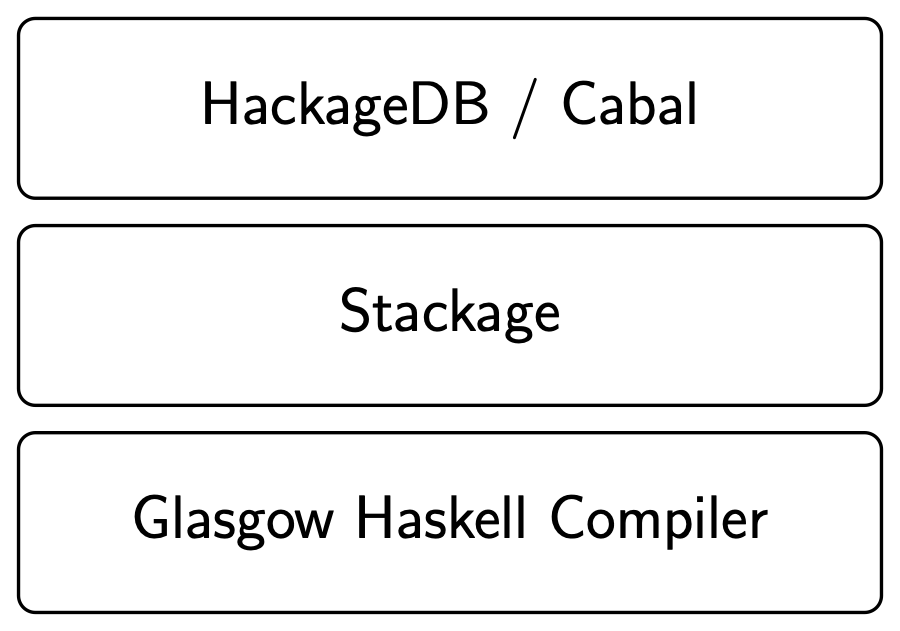
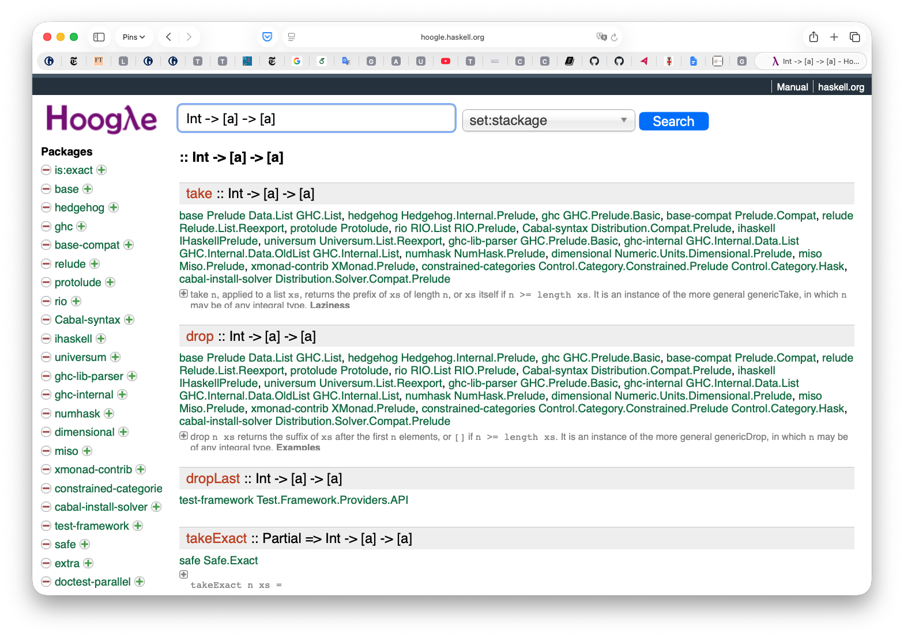
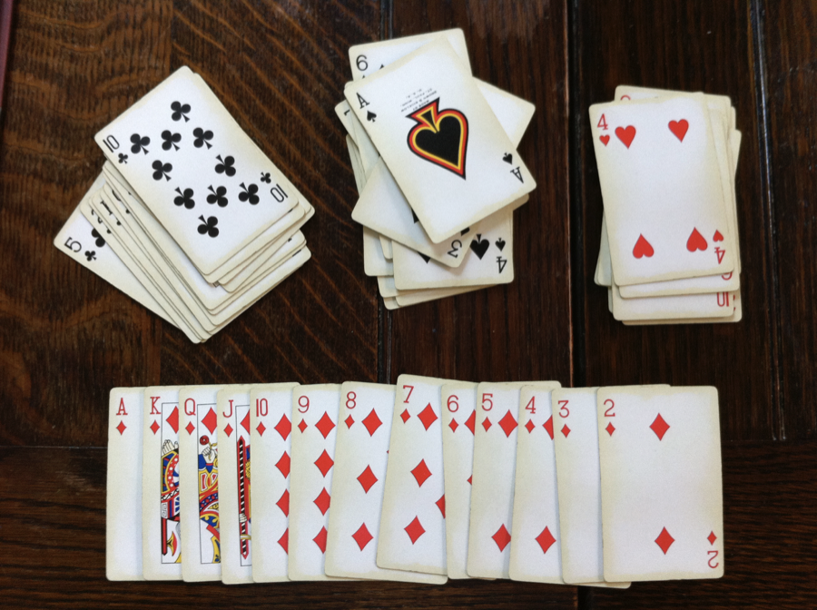
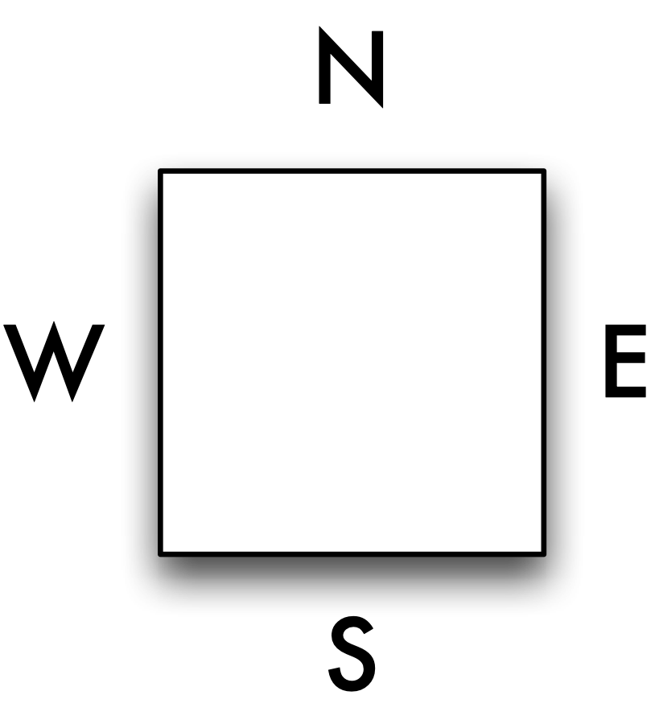
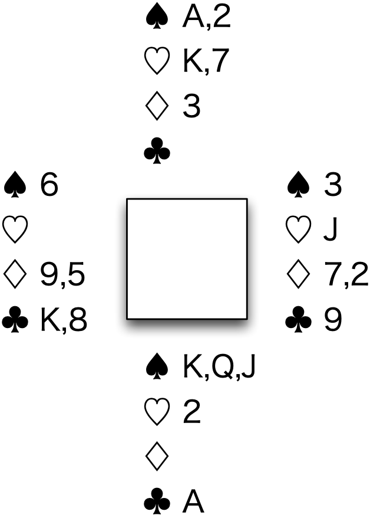

Programming with lists {#progLists}
======================

The aim of this chapter is to introduce the operations on lists contained in the prelude and the libraries that come with Haskell 2010. In order to understand the types of these library functions we have to examine how generic or **polymorphic** functions. Polymorphism is the mechanism by which a Haskell function can act over more than one type: the `length` function on lists can be used over any list type, for instance.

After doing this we're in a position to review the functions in the prelude, in the Haskell 2010 libraries, those which are available in the Haskell Platform and those others which appear on Hackage. All these are reviewed, and in particular we look at how we can discover functions with the type or behaviour that we're looking for.

To make use of these library functions, we then introduce a series of extended exercises to stretch the reader rather more than the small exercises we have given thus far. These include extensions of the `Picture` functions and a billing program for a supermarket checkout, which has to produce a formatted bill from the list of bar codes scanned in at a checkout. Finally we include the example of card games, which shows the importance of *type design* in writing non-trivial programs.

Generic functions: polymorphism {#poly}
-------------------------------

Before looking in detail at the functions on lists provided in the Haskell prelude and libraries we need to look at the idea of **polymorphism**, which literally means 'has many shapes'. A function is polymorphic if it 'has many types', and this is the case for many list-manipulating functions. An example is the `length` function, which returns the length of a list, an `Int`. This function can be applied to any type of list, so that we can say

```haskell
length :: [Bool] -> Int
length :: [[Char]] -> Int
```

and so forth. How do we write down a type for `length` which encapsulates this? We say

```haskell
length :: [a] -> Int
```

where `a` is a **type variable**. Any identifier beginning with a small letter can be used as a type variable; conventionally, letters from the beginning of the alphabet, `a`, `b`, `c`, ... are used. Just as in the definition

```haskell
square x = x*x
```

the variable `x` stands for an arbitrary value, so a type variable stands for an *arbitrary type*, and so we can see all the types like

```haskell
[Bool] -> Int          [[Char]] -> Int
```

as coming about by replacing the variable `a` by particular types: here `Bool` and `[Char]`.

Types like `[Bool] -> Int` are called **instances** of the type `[a] -> Int`, and because every type for `length` is an instance of `[a] -> Int` we call this type the **most general type** for `length`. The type of the function to join together two lists, `++`, is

```haskell
[a] -> [a] -> [a]
```

The variable `a` stands for 'an arbitrary type', but we should be clear that all the `a`'s stand for the same type, just as in

```haskell
square x = x*x
```

the `x`'s all stand for the same (arbitrary) value. Instances of `[a]->[a]->[a]` will include

```haskell
[Integer]->[Integer]->[Integer]
```

but *not* the type

```haskell
[Integer]->[Bool]->[Char]
```

This makes sense: we cannot expect to join a list of numbers and a list of Booleans to give a string!

On the other hand, the functions `zip` and `unzip` convert between pairs of lists and lists of pairs, and their types involve two type variables:

```haskell
zip   :: [a] -> [b] -> [(a,b)]
unzip :: [(a,b)] -> ([a],[b])
```

because the types of the lists being (un)zipped are not related. Now, instances of the type of `zip` include

```haskell
[Integer]->[Bool]->[(Integer,Bool)]
```

where `a` and `b` are replaced by different types (`Integer` and `Bool`, here). It is, of course, possible to replace both variables by the same type, giving

```haskell
[Integer]->[Integer]->[(Integer,Integer)]
```

and the general type `[a] -> [a] -> [(a,a)]`.

### Types and definitions {#types-and-definitions .unnumbered}

How is a polymorphic function defined? Consider the definition of the identity function,

```haskell
id x = x
```

which returns its argument unchanged. In the definition there is nothing to **constrain** the type of `x` -- all we know about `x` is that it is returned directly from the function. We know, therefore, that the output type is the same as the input, and so the most general type will be

```haskell
id :: a -> a
```

At work here is the principle that a function's type is as general as possible, consistent with the constraints put upon the types by its definition. In the case of the `id` function, the only constraint is that the input and output types are the same.

In a similar way, in defining

```haskell
fst (x,y) = x
```

neither `x` nor `y` is constrained at all, and so they can come from different types `a` and `b`, giving the type

```haskell
fst :: (a,b) -> a
```

A final example is given by

```haskell
mystery (x,y) = if x then 'c' else 'd'
```

Here we see that `x` is used as a `Bool` in the `if x then ...`, whereas `y` is not used at all, and so is not constrained in the definition, giving `mystery` the type

```haskell
(Bool,a) -> Char
```

We shall examine the definitions of many of the `Prelude` and library functions in [Defining functions over lists](7.md#defFunLists), and see there that, as outlined above, a function or other object will have as general as possible a type, consistent with the constraints put upon the types by its definition. We look in more depth at the mechanics of type checking in [Overloading, type classes and type checking](13.md#types).

GHCi can be used to give the most general type of a function definition, using the `:type` command. If you have given a type declaration for the function, this can be commented out before asking for the type.

### Polymorphism and overloading {#polymorphism-and-overloading .unnumbered}

Polymorphism and overloading are both mechanisms by which the same function name can be used at different types, but they have an important difference.

A polymorphic function like `fst` has the same definition, namely

```haskell
fst (x,y) = x
```

at all types, so that it is the **same** function at all its instances.

On the other hand, an overloaded name like `==` has different definitions over different types, so that the same name is being used to mean **different** but similar functions at different types. For example, `==` over `Integer` is built in, whereas over pairs it will be defined by

```haskell
(n,m) == (p,q)
  = (n==p) && (m==q)
```

More details about overloading can be found in [Overloading, type classes and type checking](13.md#typeClasses).

**Exercises**

1.  Give the most general types for the functions `snd` and `sing` defined by

    ```haskell
    snd (x,y) = y
    sing x = [x]
    ```

2.  Explain why

    ```haskell
    [[a]] -> [[a]]
    ```

    is a type for `id` but why it is not the most general type for this function.

3.  Earlier in the chapter we saw the example of

    ```haskell
    shift :: ((Integer,Integer),Integer) -> (Integer,(Integer,Integer))
    shift ((x,y),z) = (x,(y,z))
    ```

    What is the most general type for `shift`, if the type declaration is omitted?

Haskell list functions in the `Prelude`
---------------------------------------

<figure><label class="checkbox-label"><input class="checkbox-img" type="checkbox"><span class="img-wrapper"></span></label><figcaption>Some polymorphic list operations from <code>Prelude.hs</code>.</figcaption></figure>

<a id="polyListOps"></a>
Armed with the insight provided by the previous section we can look at the descriptions of the polymorphic list operations from `Prelude` given in [Some polymorphic list operations from Prelude.hs.](#polyListOps). In this table we give the name of the function or operator, its type, a brief description of its effect and an example, as in the description of `length`

|        |         |                         |
|:-------|:--------|:------------------------|
| length | -\> Int | The length of the list. |
|        |         | `length "word"  > 4`    |

As well as the polymorphic functions in [Some polymorphic list operations from Prelude.hs.](#polyListOps), the standard prelude provides various operations over specific types; some of these can be seen in [Some monomorphic list operations from the Prelude.](#monoListOps). The types of the functions `sum` and `product`, which are overloaded, will be discussed further in [Overloading, type classes and type checking](13.md#typeClasses).

|         |             |                                        |
|:--------|:------------|:---------------------------------------|
| and     | -\> Bool    | The conjunction of a list of Booleans. |
|         |             | `and [True,False]  > False`            |
|         |             |                                        |
| or      | -\> Bool    | The disjunction of a list of Booleans. |
|         |             | `or [True,False]  > True`              |
|         |             |                                        |
| sum     | -\> Integer | The sum of a numeric list.             |
|         | -\> Float   | `sum [2,3,4]  > 9`                     |
|         |             |                                        |
| product | -\> Integer | The product of a numeric list.         |
|         | -\> Float   | `product [0.1,0.4 .. 1]  > 0.028`      |

<figcaption>Some monomorphic list operations from the `Prelude`.</figcaption>

<a id="monoListOps"></a>
### The importance of types {#the-importance-of-types .unnumbered}

The single most useful piece of information about a function is its **type**, and this is particularly true when we look at the polymorphic types of functions in a library like [Some polymorphic list operations from Prelude.hs.](#polyListOps). Suppose we are looking for a function to make a list from a number of copies of a single element. It must take the item and a count and give a list, so its type will be one of

```haskell
Integer -> a -> [a]             a -> Integer -> [a]
```

Looking at [Some polymorphic list operations from Prelude.hs.](#polyListOps) we can quickly locate one function, `replicate`, which does have one of these types and is indeed the function which we seek. If we want a function to reverse a list it will have type `[a] -> [a]` and although there is more than one function with this type, the search is very much narrowed by looking at types. We'll see a little later on () that there's a web service called *hoogle* to look up functions by type.

This insight is not confined to functional languages, but is of particular use when a language supports polymorphic or **generic** functions and operators as we have seen here.

### Further functions {#further-functions .unnumbered}

We have not described all the functions in the prelude for two different reasons. First, some of the general functions are **higher-order** and we postpone discussion of these until [Generalization: patterns of computation](10.md#patternsGen); secondly, some of the functions, such as `zip3`, are obvious variants of things we have discussed here. Similarly, we have not chosen to enumerate the functions in the library `Data.List`; readers should consult the library file itself, which contains type information and comments about the effects of the functions, as well as the Haddock documentation for the library: we talk in detail about documentation in the next section.

<figure><label class="checkbox-label"><input class="checkbox-img" type="checkbox"><span class="img-wrapper"></span></label><figcaption>The Haskell infrastructure</figcaption></figure>

<a id="HaskellInfrastr"></a>
Finding your way around the Haskell libraries {#HaskellLibs}
---------------------------------------------

> **A note on `module` names and exports**
>
> ::: {#note-names}
> :::
>
> Module names in Haskell 2010 are "hierarchical" in style, and consist of a sequence of identifiers beginning with capital letters, separated with dots. Examples in the standard libraries include `Foreign.Marshal.Alloc`, `Data.Bool` and `Foreign`. To quote from the report
>
> > Module names can be thought of as being arranged in a hierarchy in which appending a new component creates a child of the original module name. For example, the module `Control.Monad.ST` is a child of the `Control.Monad` sub-hierarchy. This is purely a convention, however, and not part of the language definition.
>
> However, that's not quite the end of the story, because some modules are defined in such a way as to (re-)export all their "children": an example of this is the module `Foreign.C` (quoting again from the report)
>
> > The module `Foreign.C` combines the interfaces of all modules providing C-specific marshalling support, namely
> >
> > ``` {.haskell}
> > module Foreign.C.Types 
> >
> > module Foreign.C.String 
> >
> > module Foreign.C.Error
> > ```
>
> while other modules export a subset of that functionality:
>
> > The module `Foreign` combines the interfaces of all modules providing language-independent marshalling support, namely
> >
> > ``` {.haskell}
> > module Data.Bits 
> >
> > module Foreign.Ptr 
> >
> >  ...
> > ```

> **Packages and Hackage**
>
> ::: {#package-hackage}
> :::
>
> **Hackage** is an online repository for Haskell programs, bundled as a **package**. The simplest package is a collection of Haskell modules, but more complex packages can contain C code, documentation, test cases and so forth. Moreover, Hackage has the great advantage that it keeps track of dependencies between packages and indeed package versions.
>
> Combined with the Cabal it makes up an awesome infrastructure: in comparison with five years ago, Haskell now provides a simple mechanism for downloading and maintaining sets of libraries. Cabal has facilities for package developers and maintainers, but we confine ourselves to user-facing features here.
>
> **Packages** have a globally unique **package name** and a **version number**, such as `HaRe-0.6.0.1`. Each package will **expose** some of the Haskell modules it contains. Crucially, the package will state which other packages it depends on, typically in as general as possible a way. The HaRe package mentioned earlier has this dependency: `base >4 && <= 5` so that it can use *any* version of the `base` package in that range, including 'fractional' versions, of course. Further details of how packages are specified is available at the Hackage website.
>
> ``` {.haskell}
> http://hackage.haskell.org/
> ```
>
> A typical package description page in Hackage is shown in [The HackageDB description of the agum package](#HackagePic).

> **Cabal**
>
> ::: {#cabal}
> :::
>
> **Cabal** is a command-line tool for installing packages -- and the packages that they depend on -- in your system. Cabal is itself installed as a part of the Haskell Platform. As a user you'll need to know these cabal commands.
>
> `cabal update`
>
> :   \
>     Update the (cached) list of available packages. It's sensible to do this each time you start using the cabal command.
>
> `cabal list string`
>
> :   \
>     List all the packages whose descriptions contain a match of the `string`; all packages are listed if the string is omitted.
>
> `cabal install pkg`
>
> :   \
>     Install the package `pkg`; you can also supply a list of packages here.
>
> `cabal install foo-1.0 `
>
> :   \
>     Install specific version of a package.
>
> `cabal install ’foo < 2’`
>
> :   \
>     Install version with constrained version number.
>
> `cabal install pkg --dry-run`
>
> :   \
>     Dry run what happens if you install a particular pkg.
>
> `cabal help`
>
> :   \
>     Give a summary of all the available cabal commands.
>
> `ghc-pkg list`
>
> :   \
>     List all the packages that are currently installed.
>
> Further information about the system, including how to install it manually if you are not using the Haskell Platform, is available at these sites:
>
> ``` {.haskell}
> http://haskell.org/haskellwiki/Cabal-Install
> http://hackage.haskell.org/trac/hackage/wiki/CabalInstall
> ```

Haskell comes with some great libraries which will allow you to get started writing programs in all sorts of different application areas without having to build up everything from scratch yourself, thanks to the contributions of thousands of people in the Haskell community.

### What libraries are there? {#what-libraries-are-there .unnumbered}

Libraries are found in the Haskell 2010 standard, including the `Prelude`, in the Haskell Platform and on the Hackage database. We first describe the libraries in some more detail, and then explain how to find out more about them.

Prelude

:   The `Prelude` is a part of the language standard and gives definitions of standard types, functions and classes (which we come to later). The `Prelude` is listed in full in the Haskell 2010 Language Report.

    The `Prelude` is special because it is imported into all modules by default. We have seen this already: if we want to re-define a `Prelude` function, then we have to import the `Prelude` explicitly, but `hiding` that function.

Haskell 2010

:   The standard libraries in Haskell 2010 use hierarchical names: see the note on module names for more details of this.

    The libraries are grouped by name, and are described in depth in the Haskell 2010 Language Report:

    Control

    :   The `Control.Monad` library contains definitions which underly the IO mechanism in Haskell, as well as structuring side-effecting computations and DSL definitions.

    Data

    :   These libraries contain additional data types, e.g. `Data.Array`, or additional operations on existing types, such as the bitwise operations on integers in `Data.Bit`.

    Foreign

    :   The `Foreign` libraries provide support for interworking with other programming languages. This includes support for the communication of data between languages in `Foreign.C` and `Foreign.Marshal`, as well as facilities for pointers to foreign entities.

    Numeric

    :   The `Numeric` library contains functions to read and print numbers in a variety of formats.

    System

    :   The `System` libraries have support for various forms of IO handling (in `System.IO` and `System.IO.Error`), and functions to interact with the command line and signals in Unix.

The Haskell Platform

:   The Haskell Platform is a bundled distribution of GHCi, some standard tools, including Cabal for building, distributing and downloading libraries and the `Hsc2hs` preprocessor to assist in Haskell/C interworking.

    The Haskell Platform also comes with a large collection of packages: we'll talk about that terminology later in this section when we discuss Cabal and Hackage. These packages include the following areas.

    -   Data and control structures, such as sets, finite maps, bytestrings and hash tables.

    -   Concurrency. including lightweight threads, MVars for thread synchronisation and channels.

    -   Testing and debugging, including `HUnit` and `QuickCheck` as we use here.

    -   Network, system and web programming. These include facilities for HTTP and socket programming, as well as access to many OS and lower-level operations.

    -   Other packages cover text processing, graphics and math programming.

HackageDB

:   HackageDB provides an online repository for sharing and distributing Haskell packages and libraries. There are 2787 packages on Hackage at the time of writing[^1], a testament to the strength and engagement of the Haskell developer community. The variety and number of packages make it impossible to give a summary of what's there: you'll need to consult the documentation to find out more. We turn to looking at that now.

[The Haskell infrastructure](#HaskellInfrastr) illustrates the layers of libraries available.

### Where do I find out more? {#where-do-i-find-out-more .unnumbered}

You can find out about the Haskell libraries in a number of different places, some bundled with GHC and the Haskell Platform locally on your machine, and others online. Much of the online documentation is generated using the **Haddock** system, which itself comes bundled with the Haskell Platform. Haddock documents are hyperlinked for ease of navigation, and also provide links from the documentation into the source code, so that you don't have to look at that separately.

We'll go through these in turn now.

<figure><label class="checkbox-label"><input class="checkbox-img" type="checkbox"><span class="img-wrapper"></span></label><figcaption>The HackageDB description of the <code>agum</code> package</figcaption></figure>

<a id="HackagePic"></a>
<figure><label class="checkbox-label"><input class="checkbox-img" type="checkbox"><span class="img-wrapper"></span></label><figcaption>Haddock documentation for the <code>agum</code> package</figcaption></figure>

<a id="Haddock"></a>
<figure><label class="checkbox-label"><input class="checkbox-img" type="checkbox"><span class="img-wrapper"></span></label><figcaption>Hoogle in action</figcaption></figure>

<a id="Hoogle"></a>
System documentation

:   As part of the Haskell Platform distribution there is an index page for documentation. On Mac OS X systems it is installed at

    ```haskell
    file:///usr/share/doc/ghc/html/
    ```

    On linux systems the default installation is in `/usr` or `/usr/local`. On Windows systems there are links to the documentation in the `Haskell Platform` programs group accessible from the `All Programs` menu.

Libraries

:   Haddock documentation for many libraries is available from the `Libraries` link on the system documentation page, or directly at

    ```haskell
    file:///usr/share/doc/ghc/html/libraries/index.html
    ```

    This is also inked from the `Haskell Platform` programs group on Windows.

Prelude

:   In particular, documentation for the `Prelude`, including descriptions of and examples for many of the functions, is available within the library documentation, or directly at

    ```haskell
    file:///usr/share/doc/ghc/html/libraries/base-XXXXX/Prelude.html
    ```

    Here `XXXXX` is the particular version of the base libraries: for the Haskell Platform at the time of writing it is `base-4.2.0.2`.

Hackage

:   Haddock documentation is available for many packages on Hackage. This will be accessible from

    ```haskell
    http://hackage.haskell.org/package/
    ```

    which is listed by category, but also searchable. A typical package page is shown in [The HackageDB description of the agum package](#HackagePic): documentation for the modules making up the package is linked from the list of modules below the **Module** header, towards the bottom of the page; an example is shown in [Haddock documentation for the agum package](#Haddock).

Hoogle search

:   <a id="hoogle"></a>
    Hoogle allows you to search many of the standard libraries: what is cool about Hoogle is that you can **search by type** as well as by name. Narrowing down a search by type can lead you very quickly to your answer, or at least eliminate a lot of "noise" in a search.

    ```haskell
    http://www.haskell.org/hoogle/
    ```

    See [Hoogle in action](#Hoogle) for example results. Be aware, though, that Hoogle doesn't cover all the packages in Hackage.

Hayoo! search

:   Hayoo! *does* search the whole of Hackage, but it is a string-based search only.

    ```haskell
    http://holumbus.fh-wedel.de/hayoo/hayoo.html
    ```

    You can also use google to search the web, for example using a type signature. This is successful more often than you might think.

GHCi

:   Once you have asked to `import` a module (`Foo`, say) into GHCi you can then find out the types of all its exported functions using the GHCi command

    ```haskell
    :browse Foo
    ```

    Information about a particular function (`foo`, say) which is in a module loaded in GHCi is given using the command

    ```haskell
    :info foo
    ```

Online resources

:   You can go online to ask questions: there's a really lively community on the Haskell Cafe mailing list, `haskell-cafe@haskell.org`: you can find out more about how to join this list in the Communities section on the homepage of the Haskell website `www.haskell.org`: you can also find links to the Haskell *IRC channel* and Haskell on *Stack Overflow* here too.

Online texts

:   Finally, you can find a number of texts online, including *Learn You a Haskell for Great Good*, `http://learnyouahaskell.com/` and the *Haskell wikibook*, `http://en.wikibooks.org/wiki/Haskell`.

The `Picture` example: implementation {#picturesAgain}
-------------------------------------

In this section we revisit the `Picture` example, first introduced in [Introducing functional programming](1.md#intro) and re-examined in [A second example: pictures](2.md#picModuleEx). What we do here is to look at how to implement some of the operations over the `Picture` type, now that we know about list comprehensions and the list functions in the prelude. We also look at how to write more QuickCheck properties for the `Picture` functions.

```haskell
type Picture = [[Char]]
```

Some of the operations are defined as library functions. To flip a picture in a horizontal mirror, we simply have to reverse the order of the lines of the picture:

```haskell
flipH :: Picture -> Picture
flipH = reverse
```

and to place one picture above another it is sufficient to join the two lists of lines together:

```haskell
above :: Picture -> Picture -> Picture
above = (++)
```

where we have enclosed the operator `++` in parentheses to make it a (prefix) function.

How do we flip a picture in a vertical mirror? We have to reverse each of the lines, that is we have to transform each member of a list in some way. This is one of the features of a list comprehension, so we can say

```haskell
flipV :: Picture -> Picture
flipV pic 
  = [ reverse line | line <- pic ]
```

and we can read off from this program its intended effect:

> "`reverse` every `line` in the `pic`".

This is an example of the general operation of applying a function `f` to every element of a list `xs`, given by the list comprehension

```haskell
[ f x | x <- xs ]
```

We shall see that this operation is itself a higher-order function in [Generalization: patterns of computation](10.md#patternsGen) below.

Next we explore how to place two pictures side by side. What we want to do is to join up the corresponding lines of the two pictures, as illustrated. How can we accomplish this? We can see this as like `flipV`, in that we want to do something to every pair of lines -- namely join them with `++` -- but we need to associate corresponding lines before we do this. That is exactly the purpose of the prelude function `zip`, which takes two lists and pairs corresponding elements, and so we can say

```haskell
beside :: Picture -> Picture -> Picture
beside picL picR
  = [ lineL ++ lineR | (lineL,lineR) <- zip picL picR ]
```

The effect of `zip` is to chop the list of pairs to the shorter of the two inputs, and so `beside` will clip the bottom lines off whichever picture is the longer; if they are the same length, then there is no clipping. We can also use the higher-order `zipWith` to define `beside`; we revisit this in Chapter 9.

In our pictures, white is represented by the dot '`.`' and black by the hash symbol '`#`'. To invert the colour of a single character we define

```haskell
invertChar :: Char -> Char
invertChar ch 
  = if ch=='.' then '#' else '.'
```

The characters '`.`' and '`#`' are swapped by this definition (and any other character is transformed into '`.`', too). Now, how do we invert the colours in a whole picture? We need to invert each character in a line, using

```haskell
invertLine :: [Char] -> [Char]
invertLine line 
  = [ invertChar ch | ch <- line ]
```

and we want to apply this to all the lines in the picture

```haskell
invertColour :: Picture -> Picture
invertColour pic 
  = [ invertLine line | line <- pic ]
```

We could if we wish write this as a single definition, thus

```haskell
invertColour :: Picture -> Picture
invertColour pic 
  = [ [ invertChar ch | ch <- line ] | line <- pic ]
```

but our use of the auxiliary function `invertLine` makes the previous definition more readable.

In the next section we extend our model of pictures to give them a position as well as some pictorial content.

### Tests and properties {#tests-and-properties .unnumbered}

We first discussed writing properties for the functions over pictures in [Tests, properties and proofs](1.md#pictureProps); it's time to look at this again. In that section we looked at properties of `flipH` and `flipV`, separately and together. Here we look at how these functions interact with `above` and `beside`, and we look at other properties in the exercises.

What happens if we flip `pic1 ‘above‘ pic2` in a vertical mirror? The result is the same as flipping the two pictures separately before putting them together. We can write this as a property

```haskell
prop_AboveFlipV :: Picture -> Picture -> Bool

prop_AboveFlipV pic1 pic2 = 
    flipV (pic1 `above` pic2) == (flipV pic1) `above` (flipV pic2) 
```

and test it by typing

```haskell
quickCheck prop_AboveFlipV
```

(ensuring that the module `Test.QuickCheck` is loaded.) Similarly we can write the property for `flipH`:

```haskell
prop_AboveFlipH :: Picture -> Picture -> Bool

prop_AboveFlipH pic1 pic2 = 
    flipH (pic1 `above` pic2) == (flipH pic1) `above` (flipH pic2) 
```

but this fails: why? Can you correct the property? Remember that `flipH` means that we're flipping the picture in a *horizontal* mirror.

In [Solving a problem in steps: local definitions](4.md#localDefs) we put together four pictures as `fourPics`. We chose to do this by putting one picture beside another using `beside`: we could also have done this by putting one picture `above` another, and we could expect that this gives the same result, as expressed in the property

```haskell
propAboveBeside :: Picture -> Picture ->  Picture -> Picture -> Bool

propAboveBeside nw ne sw se =
  (nw `beside` ne) `above` (sw `beside` se) 
  == 
  (nw `above` sw) `beside` (ne `above` se) 
```

If we test this, then it fails. Why? Remember that we're using the built-in facilities of QuickCheck to generate *random* values from `[String]`. If we look at a sample of the data,[^2] the results look like this:

```haskell
[]
["a1","\EOT"]
[]
["","p\DC3=","\229\a\183","\218\SOH\194",""]
["g}","P","_y","\169\131\FS\t","U\nl",":YicLX\194\198","\t3"] 
 ...
```

The elements are random, the pictures are generally not rectangular -- because within each list the strings are of different length -- it is also very likely that four of these chosen randomly will not have the right dimensions to be put together using `beside` and `above`. We'll see in [DSLs for computation: generating data in QuickCheck](19.md#qcGens) how to define random *generators* of data for ourselves, and we'll see there how to generate 'sensible' random pictures, built up from `’.’` and `’#’` in rectangular patterns, and indeed to generate sets of pictures containing random data but all of the same size.

In the meantime we can say that we only want to check a property when the generated data satisfy some conditions: let's take a look at an example.

```haskell
propAboveBeside3Correct :: Picture -> Picture -> Property

propAboveBeside3Correct w e =
  (rectangular w && rectangular e && height w == height e) 
  ==>
     (w `beside` e) `above` (w `beside` e) 
         == 
     (w `above` w) `beside` (e `above` e) 
```

In writing this property we have used `==>` which we can read as 'implies'. The property following the `==>` is only checked when the `Bool`ean *condition* before the arrow is true. Without the condition the property fails: try it out!

**Exercises**

1.  Define a function

    ```haskell
    superimposeChar :: Char -> Char -> Char
    ```

    so that the superimposition of '`.`' with itself gives '`.`' while any other combination of characters gives '`#`'.

2.  Define a function

    ```haskell
    superimposeLine :: [Char] -> [Char] -> [Char]
    ```

    which takes two lines -- which you can assume are of the same length -- and superimposes their corresponding characters using `superimposeChar`, so that, for example,

    ```haskell
    superimposeLine ".##." ".#.#" = ".###"
    ```

    You may want to use `zip` in your solution.

3.  In a similar way to `superimposeLine`, define the function

    ```haskell
    superimpose :: Picture -> Picture -> Picture
    ```

    which superimposes two pictures, which you may assume have the same dimensions.

4.  Using the function `putStr :: String -> IO ()` and any other functions you might need, define the function

    ```haskell
    printPicture :: Picture -> IO ()
    ```

    so that the effect of `printPicture [ ".##." , ".#.#" , ".###" , "####" ]` is that

    ```haskell
    .##.
    .#.#
    .###
    ####
    ```

    is printed at the terminal window. *Hint:* it is enough to transform this list of strings to the single string

    ```haskell
    ".##.\n.#.#\n.###\n####\n"
    ```

    and to pass that to `putStr`.

5.  \[Harder\] Define a function

    ```haskell
    rotate90 :: Picture -> Picture
    ```

    which rotates a picture through `90°` clockwise. For instance, the effect of `rotate90` on the picture in the previous exercise would be to give

    ```haskell
    #...
    ####
    ##.#
    ###.
    ```

    Hint: you need to make a line of the new picture by picking out the `i`th elements in each of the lines of the original picture, reflected in a horizontal mirror.

6.  Using `rotate90` or otherwise, define a function which rotates a picture through `90°` *anti*clockwise.

7.  \[Harder\] Define the function

    ```haskell
    scale :: Picture -> Int -> Picture
    ```

    which scales the input picture by the integer provided as the second argument. For instance, if `exPic` is the picture

    ```haskell
    #.#
    ..#
    ```

    then the result of `scale exPic 2` should be

    ```haskell
    ##..##
    ##..##
    ....##
    ....##
    ```

    In the case of a zero or negative scale factor, you should return an empty picture.

8.  Correct the property `prop_AboveFlipH` given earlier.

9.  Define properties which describe how `beside` interacts with `flipH` and `flipV`.

10. One property we can show holds is that if we take the same picture and put four copies of it together using `beside` and `above` in the two different ways, then the results are the same. Express this as a quick check property.

11. You can test your implementation of `rotate90` using QuickCheck. Can you think of properties which only use `rotate90` and others that use `rotate`? You may want to impose a condition that any picture involved is rectangular: the function is given in the program code for this chapter.

12. What property would you expect `invertColour` to have? Can you be sure that this will hold for randomly generated data?

13. \[Harder\] Write the analogue of `propAboveBeside3Correct` where two pictures are again used, but with two the same at the top (call them `n`) and two the same at the bottom (`s`, say). Do you need the condition in this case?

Extended exercise: alternative implementations of pictures {#aliterPictures}
----------------------------------------------------------

This section looks again at the pictures example, and explores alternative implementations. First we look at extending the implementation so that two pictures don't have to be of compatible size when joining them together into one. After that we look at various alternative implementations of pictures as lists.

### Incompatible combinations {#incompatible-combinations .unnumbered}

In earlier discussions of the `Picture` type, we have made the assumption that binary functions like `above` have been called on arguments of compatible size: in the case of `above` this would mean that the *width* of the two arguments was the same. What should be done if this is not the case?

We could reasonably assume that each picture was *rectangular* and define the functions so that this *invariant* was preserved by the binary functions. In the example of `above` this requires that pictures can be padded in an appropriate way. Let's take the specific example of

```haskell
(horse `beside` horse)
       `above`
horse
```

as shown in [`Ragged' picture](#lshapedhorses).

```haskell
.......##..........##...
.....##..#.......##..#..
...##.....#....##.....#.
..#.......#...#.......#.
..#...#...#...#...#...#.
..#...###.#...#...###.#.
.#....#..##..#....#..##.
..#...#.......#...#.....
...#...#.......#...#....
....#..#........#..#....
.....#.#.........#.#....
......##..........##....
.......##...
.....##..#..
...##.....#.
..#.......#.
..#...#...#.
..#...###.#.
.#....#..##.
..#...#.....
...#...#....
....#..#....
.....#.#....
......##....
```

<figcaption>'Ragged' picture</figcaption>

<a id="lshapedhorses"></a>
To preserve the rectangular picture, we need to pad out the lower as shown in [``Padded' picture](#paddedhorses).

```haskell
.......##..........##...
.....##..#.......##..#..
...##.....#....##.....#.
..#.......#...#.......#.
..#...#...#...#...#...#.
..#...###.#...#...###.#.
.#....#..##..#....#..##.
..#...#.......#...#.....
...#...#.......#...#....
....#..#........#..#....
.....#.#.........#.#....
......##..........##....
.......##...............
.....##..#..............
...##.....#.............
..#.......#.............
..#...#...#.............
..#...###.#.............
.#....#..##.............
..#...#.................
...#...#................
....#..#................
.....#.#................
......##................
```

<figcaption>"Padded' picture</figcaption>

<a id="paddedhorses"></a>
**Exercises**

1.  Redefine the functions over pictures to pad pictures in the way just described. One way to solve the problem is to use the function

    ```haskell
    replicate :: Int -> a -> [a]
    ```

    `replicate n x` returns a list containing `n` `x`s, so `replicate 3 ’g’` is `"ggg"`.

2.  How would you work with basic pictures that were not rectangular? Define a function which will take a picture - as a list of `String`s -- and return a rectangular list of strings, padding out each line as necessary. Once you start with rectangular pictures the functions you defined in the first part of this exercise should be enough to preserve them as rectangular.

### Alternative representations {#alternative-representations .unnumbered}

In this section we look at a number of different ways that these \"low fi\" pictures can be represented.

**Exercises**

1.  An alternative representation of `Picture` is the type

    ```haskell
    [[Bool]]
    ```

    where `True` and `False` represent black and white points in a picture. How would you have to modify the functions working over `Picture` to accommodate this change? What are the advantages and disadvantages of the two representations?

2.  We have represented pictures as a list of rows: how would you redefine the functions working over pictures if they are represented as a *list of columns*.

3.  \[Harder\] How would you re-implement the function `printPicture`, defined in the solution to exercise 6.7, so that it works over this column-based representation?

4.  It would be possible to represent a `Picture` as *a single list of characters*, with `’\n’` terminating each line of the picture, as in

    ```haskell
    ".##.\n.#.#\n.###\n####\n"
    ```

    How would you redefine the picture manipulating functions over this representation? Which functions become easier to define? Which more difficult?

### Run-length encoding {#run-length-encoding .unnumbered}

A more compact representation is given by run-length encoding of Pictures, which will code a repeated character *run* like `"###"` as a pair, `(3,’#’)`, and a picture is represented as a member of `[[(Int,Char)]]`. For example, the picture

```haskell
.##.
.#.#
.###
####
```

is represented like this

```haskell
[ [(1,'.'), (2,'#'), (1,'.')],
  [(1,'.'), (1,'#'), (1,'.'), (1,'#')],
  [(1,'.'), (3,'#')],
  [(4,'#')] ]
```

using run-length encoding for each row of the picture.

**Exercises**

1.  Re-implement the functions over pictures to work with this new representation. In particular, how would you print pictures which were represented in this way?

2.  Is it the case that all your answers to the last question give the most compact representation, so that you don't have adjacent runs of the same character, as in

    ```haskell
    [(1,'.'), (2,'.'), (1,'#')]
    ```

    which could be given more compactly as

    ```haskell
    [(3,'.'), (1,'#')]
    ```

    If this can happen with your functions, how could you change your definitions to avoid it?

3.  Take another look at the QuickCheck properties you wrote to test pictures: rewrite these for your alternative implementations. How many of the properties carry over to the alternative implementations without alteration, and how many have to be modified in some way?

4.  \[Harder\] The run-length encoding above works a line at a time, but it would be possible to give a more compact representation which combines runs in different lines. The earlier example could then be given by

    ```haskell
    [(1,'.'), (2,'#'), (2,'.'),
     (1,'#'), (1,'.'), (1,'#'),
     (1,'.'), (7,'#')]
    ```

    This representation loses the length of the rows, so you would have to keep information about the row length in the type too, giving

    ```haskell
    type Picture = (Int, [(Int,Char)] )
    ```

    as the representation. Re-implement the picture functions to work over this type.

5.  \[Harder\] If you know that only the characters `’.’` and `’#’` are used in a picture, how could you make the representation of the previous question even more compact?

6.  \[Harder\] Define two more representations of pictures yourself, and re-implement the picture functions over these types.

Extended exercise: positioned pictures {#posPix}
--------------------------------------

The pictures that we have modelled using the type `Picture` are not anchored at any particular point in space: we can think of them concretely as being on pieces of paper which can be joined together, superimposed, rotated and so on.

A different model of pictures gives each picture a `Position` in space: we can then think of moving these pictures, of superimposing two of these pictures to give another picture, and so on.

<figure><label class="checkbox-label"><input class="checkbox-img" type="checkbox"><span class="img-wrapper"></span></label><figcaption>An example <code>Image</code>.</figcaption></figure>

<a id="horsePos"></a>
### Basics {#basics .unnumbered}

How can we represent pictures with positions? First we need to think about how we model positions on an *integer* grid. A `Position` is given by a pair of integers,

```haskell
type Position = (Int,Int)
```

We will use the term `Image` for a picture with a position, and so we define

```haskell
type Image = (Picture,Position)
```

An example, in which we position the `horse` with its bottom left-hand corner or **reference point** at position `(31,23)`, is given in [An example Image.](#horsePos).

The remainder of this section is a collection of exercises to write functions which manipulate these `Images`; you can use any of the list functions introduced in the previous chapter and also the functions over `Picture` which we have already defined.

**Exercises**

1.  Define a function

    ```haskell
    makeImage :: Picture -> Position -> Image
    ```

    which makes an `Image` from a `Picture` and a `Position`.

2.  Define a function

    ```haskell
    changePosition :: Image -> Position -> Image
    ```

    which takes an `Image` and returns a new `Image` whose `Picture` is unchanged but whose `Position` is given by the second argument to `changePosition`.

3.  Give a definition of the function

    ```haskell
    moveImage :: Image -> Int -> Int -> Image
    ```

    so that the effect of `moveImage img xMove yMove` is to move `img` by `xMove` in the horizontal (`x`) direction and by `yMove` in the vertical (`y`) direction.

4.  Define a function

    ```haskell
    printImage :: Image -> IO ()
    ```

    whose action is the analogue of `printPicture` for pictures.

    <figure><label class="checkbox-label"><input class="checkbox-img" type="checkbox"><span class="img-wrapper"></span></label><figcaption>The geometrical view of <code>flipV</code> and <code>rotate</code>.</figcaption></figure>

    <a id="transfPos"></a>
### Transformations {#transformations .unnumbered}

We can extend the transformations over the type `Picture` to the `Image` type, but we need to think about the effect of these transformations on the position. One way to lift the transformations from pictures to images is simply to say that the pictures stay in the same position -- we call this the **naive** view.

If we think of reflections and rotations going on in space, then the results are more likely to be as shown in [The geometrical view of flipV and rotate.](#transfPos), where we see that the position of the resulting image has changed. Rotation is about the reference point, and reflection is in the horizontal or vertical line through the reference point; in general these operations will change the reference point. We call this the **geometrical** view of the transformations.

**Exercises**

1.  Implement for `Image` the analogues of `flipH`, `flipV`, `rotate` and `rotate90` under the naive view of how to lift the transformations.

2.  Implement for `Image` the analogues of `flipH`, `flipV`, `rotate` and `rotate90` under the geometrical view.

### Superimposition {#superimposition .unnumbered}

When pictures have positions, superimposition can be more complex. Consider the example illustrated in [Superimposing two Images.](#superPos); here we see one way of superimposing the two images is to use `Picture` superimposition on two pictures which have first been 'padded out' with white space as shown in the figure.

<figure><label class="checkbox-label"><input class="checkbox-img" type="checkbox"><span class="img-wrapper"></span></label><figcaption>Superimposing two <code>Images</code>.</figcaption></figure>

<a id="superPos"></a>
**Exercises**

1.  Define functions to 'pad out' a `Picture` with an amount of white space, as shown in [Superimposing two Images.](#superPos).

    You will need to think carefully about the intended effect of the functions before you start to implement them. You will need to have function parameters for the amount of padding to the left, right, bottom and top of the image.

    Note, in particular, that the `Position` of an `Image` might change as a result of padding.

2.  Using the padding functions, define a superimposition function for the `Image` type.

3.  How would you use `Image` superimposition to give analogues of `above` and `beside` for `Images`?

4.  Define QuickCheck properties to check the implementation of the functions over the `Image` type. How many carry over from the `Picture` type, and how many have to be re-defined?

Extended exercise: supermarket billing {#superBill}
--------------------------------------

This collection of exercises looks at supermarket billing.[^3] The idea is to use the list-manipulating techniques presented in [Data types, tuples and lists](5.md#tupleList). In particular we will be using list comprehensions and also the prelude functions mentioned there. We will also expect local definitions -- as explained in [Solving a problem in steps: local definitions](4.md#localDefs) -- to be used when appropriate.

```haskell
                          Haskell Stores
                     
                  Dry Sherry, 1lt...........5.40
                  Fish Fingers..............1.21
                  Orange Jelly..............0.56
                  Hula Hoops (Giant)........1.33
                  Unknown Item..............0.00
                  Dry Sherry, 1lt...........5.40
                       
                  Total....................13.90
```

<figcaption>A supermarket bill</figcaption>

<a id="basicBill"></a>
### The problem {#the-problem .unnumbered}

A scanner at a supermarket checkout will produce from a basket of shopping a list of bar codes, like

```haskell
[1234,4719,3814,1112,1113,1234]
```

which has to be converted to a bill as shown in [A supermarket bill](#basicBill) We have to decide first how to model the objects involved. Bar codes and prices (in pence) can be modelled by integers; names of goods by strings. We say therefore that

```haskell
type Name    = String
type Price   = Int
type BarCode = Int
```

The conversion will be based on a **database** which links bar codes, names and prices. As in the library, we use a list to model the relationship.

```haskell
type Database = [ (BarCode,Name,Price) ]
```

The example database we use is

```haskell
codeIndex :: Database
codeIndex = [ (4719, "Fish Fingers" , 121),
              (5643, "Nappies" , 1010),
              (3814, "Orange Jelly", 56),
              (1111, "Hula Hoops", 21),
              (1112, "Hula Hoops (Giant)", 133),
              (1234, "Dry Sherry, 1lt", 540)]
```

The object of the script will be to convert a list of bar codes into a list of `(Name,Price)` pairs; this then has to be converted into a string for printing as above. We make the type definitions

```haskell
type TillType = [BarCode]
type BillType = [(Name,Price)]
```

and then we can say that the functions we wish to define are

```haskell
makeBill    :: TillType -> BillType
```

which takes a list of bar codes to a list of name/price pairs,

```haskell
formatBill  :: BillType -> String
```

which takes a list of name/price pairs into a formatted bill, and

```haskell
produceBill :: TillType -> String
```

which will combine the effects of `makeBill` and `formatBill`, thus

```haskell
produceBill = formatBill . makeBill
```

The length of a line in the bill is decided to be `30`. This is made a constant, thus

```haskell
lineLength :: Int
lineLength = 30
```

Making `lineLength` a constant in this way means that to change the

length of a line in the bill, only one definition needs to be altered; if `30` were used in each of the formatting functions, then each would have to be modified on changing the line length. The rest of the script is developed through the sequences of exercises which follow.

### Formatting the bill {#formatting-the-bill .unnumbered}

First we develop the `formatBill` function from the bottom up: we design functions to format prices, lines, and the total, and using these we finally build the `formatBill` function itself.

**Exercises**

1.  Given a number of pence, `1023` say, the pounds and pence parts are given by `1023 ‘div‘ 100` and `1023 ‘mod‘ 100`. Using this fact, and the `show` function, define a function

    ```haskell
    formatPence :: Price -> String
    ```

    so that, for example, `formatPence 1023 = "10.23"`; you need to be careful about cases like `"12.02"`.

2.  Using the `formatPence` function, define a function

    ```haskell
    formatLine  :: (Name,Price) -> String
    ```

    which formats a line of a bill, thus

    ```haskell
    formatLine ("Dry Sherry, 1lt",540) 
                   = "Dry Sherry, 1lt...........5.40\n"
    ```

    Recall that `’\n’` is the newline character, that `++` can be used to join two strings together, and that `length` will give the length of a string. You might also find the `replicate` function useful.

3.  Using the `formatLine` function, define

    ```haskell
    formatLines :: [ (Name,Price) ] -> String
    ```

    which applies `formatLine` to each `(Name,Price)` pair, and joins the results together.

4.  Define a function

    ```haskell
    makeTotal :: BillType -> Price
    ```

    which takes a list of `(Name,Price)` pairs, and gives the total of the prices. For instance,

    ```haskell
    makeTotal [(" ... ",540),(" ... ",121)] = 661
    ```

5.  Define the function

    ```haskell
    formatTotal :: Price -> String
    ```

    so that, for example,

    ```haskell
    formatTotal 661 = "\nTotal.....................6.61"
    ```

6.  Using the functions `formatLines`, `makeTotal` and `formatTotal`, define

    ```haskell
    formatBill :: BillType -> String
    ```

    so that on the input

    ```haskell
    [("Dry Sherry, 1lt",540),("Fish Fingers",121),
    ("Orange Jelly",56),("Hula Hoops (Giant)",133),
    ("Unknown Item",0),("Dry Sherry, 1lt",540)]
    ```

    the example bill at the start of the section is produced.

### Making the bill: bar codes into names and prices {#making-the-bill-bar-codes-into-names-and-prices .unnumbered}

Now we have to look at the database functions which accomplish the conversion of bar codes into names and prices.

**Exercises**

1.  Define a function

    ```haskell
    look :: Database -> BarCode -> (Name,Price)
    ```

    which returns the `(Name,Price)` pair corresponding to the `BarCode` in the `Database`. If the `BarCode` does not appear in the database, then the pair `("Unknown Item", 0)` should be the result.

    Hint: using the ideas of the library database you might find that you are returning a *list* of `(Name,Price)` rather than a single value. You can assume that each bar code occurs only once in the database, so you can extract this value by taking the `head` of such a list *if it is non-empty*.

2.  Define a function

    ```haskell
    lookup :: BarCode -> (Name,Price)
    ```

    which uses `look` to look up an item in the particular database `codeIndex`. This function clashes with a function `lookup` defined in the prelude; consult for details of how to handle this.

3.  Define the function

    ```haskell
    makeBill   :: TillType -> BillType
    ```

    which applies `lookup` to every item in the input list. For instance, when applied to `[1234,4719,3814,1112,1113,1234]` the result will be the list of `(Name,Price)` pairs given in Exercise 6.25. Note that `1113` does not appear in `codeIndex` and so is converted to `("Unknown Item",0)`.

    This completes the definition of `makeBill` and together with `formatBill` gives the conversion program.

### Extending the problem {#extending-the-problem .unnumbered}

We conclude with some further exercises.

**Exercises**

1.  You are asked to add a discount for multiple buys of sherry: for every two bottles bought, there is a `1.00` discount. From the example list of bar codes

    ```haskell
    [1234,4719,3814,1112,1113,1234]
    ```

    the bill should be as illustrated in [Bills with `multibuy' discounts.](#newBill).

    ```haskell
                              Haskell Stores
                         
                      Dry Sherry, 1lt...........5.40
                      Fish Fingers..............1.21
                      Orange Jelly..............0.56
                      Hula Hoops (Giant)........1.33
                      Unknown Item..............0.00
                      Dry Sherry, 1lt...........5.40
                         
                      Discount..................1.00
                         
                      Total....................12.90
    ```

    <figcaption>Bills with 'multibuy' discounts.</figcaption>

    <a id="newBill"></a>
    You will probably find it helpful to define functions

    ```haskell
    makeDiscount :: BillType -> Price
    formatDiscount :: Price -> String
    ```

    which you can use in a redefined

    ```haskell
    formatBill :: BillType -> String
    ```

2.  Design functions which update the database of bar codes. You will need a function to add a `BarCode` and a `(Name,Price)` pair to the `Database`, while at the same time removing any other reference to the bar code already present in the database.

3.  Re-design your system so that bar codes which do not appear in the database give no entry in the final bill. There are (at least) two ways of doing this.

    -   Keep the function `makeBill` as it is, and modify the formatting functions, or

    -   modify the `makeBill` function to remove the 'unknown item' pairs.

4.  \[Harder\] How appropriate would it be to test your supermarket billing system using QuickCheck? Could you check parts of the system using QuickCheck? Could you use it to test the whole system, or could you do both?

5.  \[Project\] Design a script of functions to analyse collections of sales. Given a list of `TillType`, produce a table showing the total sales of each item. You might also analyse the bills to see which *pairs* of items are bought together; this could assist with placing items in the supermarket.

Extended exercise: cards and card games {#cardGames}
---------------------------------------

<label class="checkbox-label wrapfigure-right"><input class="checkbox-img" type="checkbox"><span class="img-wrapper"></span></label>

An British deck (or pack) of cards has four suits: spades (♠), hearts (♥), diamonds (♦) and clubs (♣).

Each suit contains cards 2 to 10, and the court cards, Jack, Queen, King and Ace. The values of the cards increase in the same order, so, for example, a 9 beats a 2, a King beats a 10, and an Ace beats everything (in this discussion we're taking "Aces high").

**Exercises**

1.  Define a type `Suit` to represent *suits* and a type `Value` to represent the *value* of cards. Using these or otherwise, define a type `Deck` to represent a deck of cards. You may use type synonyms (`type`) or data type definitions (`data`), or both.

2.  Try to give a rationale for the choices you have made in answering the previous question: if you can, give alternative definitions which use the other mechanism, and compare your solutions.

<label class="checkbox-label wrapfigure-right"><input class="checkbox-img" type="checkbox"><span class="img-wrapper"></span></label>

Many card games involve the idea of each player playing one card in turn, called a *trick*. Traditionally for games like whist and bridge the players are called after the points of the compass: North, South, East and West. The play is in clockwise order: if East is the player to start (to *lead*) then the players South, West and North follow in that order.

Define a type `Player` to represent the four players.

There is an important rule about how players should choose cards to play. A player should *follow suit*: that is, if they can, they must play a card from the same suit as the card that was led (the card played by the person starting). A player can only play from a different suit if she has no cards left in the suit that was led.

<label class="checkbox-label wrapfigure-right"><input class="checkbox-img" type="checkbox"><span class="img-wrapper"></span></label>

Let's have a look at an example. Suppose that each of the players has five cards left, as shown to the right. Suppose also that East is to lead and that she plays the Jack of Hearts. South has no choice: he has to play the 2 of Hearts. West has no Hearts, so she can choose any other card to play. Finally, North has a choice of two Hearts: the King or the 7, let's suppose that he plays the King.

Who wins the trick? Let's suppose first that there is no trump suit. The highest Heart will win the trick, and that's the King. Why Hearts? Because a Heart was led by East.\
If there is a *trump* suit, then the highest trump card wins if any trumps have been played, but remember that you can only play a trump if you're unable to follow suit. If Spades were trumps in this case, then West could win the trick by playing the 6 of Spades, no one else can play a trump as they are able to follow suit.

**Exercises**

1.  How would you represent a trick? Define a type `Trick`, using either a `type` or a `data` definition. Remember that you need to know which player has played which card, and also who led.

2.  Define a function

    ```haskell
    winNT :: Trick -> Player
    ```

    which decides the winner of a trick, assuming that there is no trump suit.

3.  Define a function

    ```haskell
    winT :: Suit -> Trick -> Player
    ```

    which decides the winner of a trick, assuming that there is a trump suit, which is passed in as the first argument.

4.  Define a type `Hand` which represents the collection of cards held by a player at one point during a game. In the earlier example, the hand held by North is ♠ A, 2; ♥ K, 7; ♦ 3 (and no ♣ cards).

5.  Define a type `Hands` which describes the hands held by the four players at one point in the game. This should represent the four hands shown in the diagram above, for example.

6.  Define a function

    ```haskell
    checkPlay :: Hands -> Trick -> Bool
    ```

    which checks whether the play in a particular trick is both *possible* and *legal*. It should be possible in the sense that the card played by each player (given in the `Trick`) should be in their hand, as given in the `Hands`. It should be legal in following the rule that players should *follow suit* if they can.

What does a game look like? As there are 52 cards, when dealt to four players this results in each player receiving 13 cards. There will therefore be thirteen tricks played. In whist and bridge pairs of players -- North/South and East/West -- play together, so in an game of 13 tricks one side or the other will win.

**Exercises**

1.  Define a type `Team` to represent the two teams North/South and East/West. Define a function

    ```haskell
    winnerNT :: [Trick] -> Team
    ```

    which will give the winning team from the list of tricks, assuming that there are no trumps. Also define the function

    ```haskell
    winnerT :: Suit -> [Trick] -> Team
    ```

    where the trump suit is passed in as the first argument.

2.  \[Harder\] Define a function

    ```haskell
    checkPlay :: [Trick] -> Bool
    ```

    which checks whether the play in each trick is both *possible* and *legal*. *Hint:* you will need to deduce the hand in each case from the cards played subsequently: once you have done this, you can use `checkPlay` as defined earlier.

Summary {#summary .unnumbered}
-------

This chapter has shown how the combination of list comprehensions and the built-in functions from the prelude give us a powerful repertoire of tools with which to build definitions over particular list types. This was evident in the `Picture` example as well as in the case studies, and these also gave an opportunity to see the way in which a larger program was built as a collection of related functions. returning a member of the same list type. The example in [Extended exercise: cards and card games](#cardGames) particularly emphasised the process of choosing types to represent the various entities in the domain in question.

[Finding your way around the Haskell libraries](#HaskellLibs) contains vital information about the libraries available in Haskell, including how to download them, how to find out more about their contents and how to search for functions performing particular tasks.

In the next chapter we'll find out about how to define functions over lists for ourselves.

[^1]: Early August 2010

[^2]: We do this using  `sample (arbitrary :: Gen [String]).`

[^3]: I am grateful to Peter Lindsay *et al. *of the Department of Computer Science at the University of New South Wales, Australia, for the inspiration for this example, which was suggested by their lecture notes.
