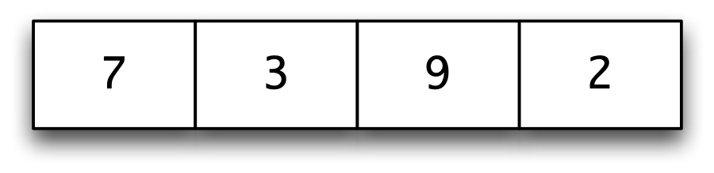
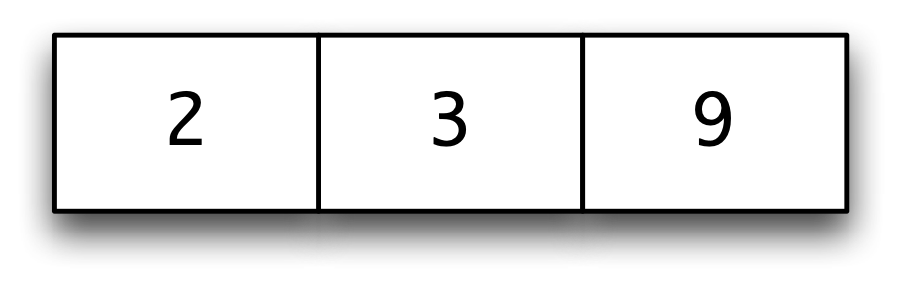
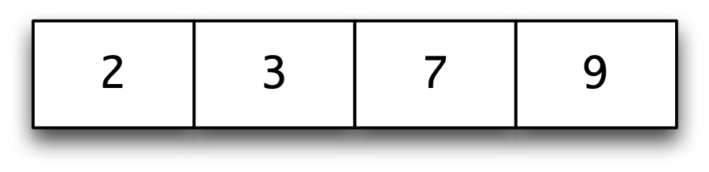
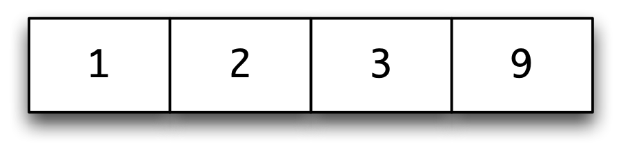
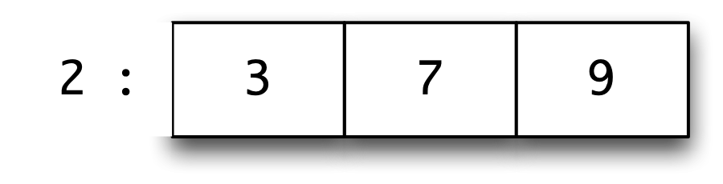

Defining functions over lists {#defFunLists}
=============================

We have already seen how to define a variety of functions over lists using a combination of list comprehensions and the built-in list processing functions in the Haskell prelude and libraries. This chapter looks 'under the bonnet' and explains how functions over lists can be defined by means of recursion. This will allow us to define the prelude functions we have already been using, as well as letting us look at a wider class of applications, including sorting and a case study of text processing.

The chapter begins with a summary of the mechanism of pattern matching, and continues with a justification and explanation of recursion echoing the discussion in [Designing and writing programs](4.md#writingProgs). We then explore a variety of examples both of functions defined by primitive recursion and of more general recursive functions, and conclude with the case study mentioned earlier.

Pattern matching revisited {#pattMatchRevisit}
--------------------------

We have seen that function definitions take the form of conditional equations like

```haskell
mystery :: Integer -> Integer -> Integer
mystery x y 
  | x==0        = y
  | otherwise   = x
```

where a choice of two alternatives is made by guards; we can rewrite this into two equations, thus

```haskell
mystery 0 y = y  -- (mystery.1)
mystery x y = x  -- (mystery.2)
```

where we distinguish between the two cases by using a pattern -- here the literal `0` -- instead of a variable. Just as for guards, the equations are applied **sequentially**, and so `(mystery.2)` will only be used in cases that `(mystery.1)` does not apply.

Another aspect of this definition is that `y` is not used on the right-hand side of `(mystery.2)`. Because of this we do not need to give a name to the second argument in this case, and so we can replace the variable y with the **wildcard** '`_`' which matches anything, thus

```haskell
_
mystery 0 y = y
mystery x _ = x
```

We have therefore seen that pattern matching can be used for distinguishing between certain sorts of **cases** in function definitions. We have also seen pattern matching used to **name the components** of tuples, as in

```haskell
joinStrings :: (String,String) -> String
joinStrings (st1,st2) = st1 ++ "\t" ++ st2
```

where the variables `st1` and `st2` will be matched with the components of any argument.

We can see the case switching and extracting components in action together in the definition of the function to give the `area` of a `Shape`, first seen in [Alternatives](5.md#areaDef):

```haskell
Shapearea
area :: Shape -> Float
area (Circle r)      = pi*r*r
area (Rectangle h w) = h*w
```

The two equations apply to different kinds of shape, and within each equation the appropriate information is extracted: from a circle its radius, `r`, and from a rectangle its height, `h`, and width, `w`. We see exactly this combination of case switching and component extraction in working with lists too, as we see in the next section.

### Summarizing patterns {#summarizing-patterns .unnumbered}

A pattern can be one of a number of things:

-   A **literal value** such as `24`, `’f’` or `True`; an argument matches this pattern if it is equal to the value.

-   A **variable** such as `x` or `longVariableName`; any argument value will match this.

-   A **wildcard** '`_`'; any argument value will match this.

-   A **tuple pattern** `(p_1,p_2,...,p_n)`. To match this, an argument must be of the form `(v_1,v_2,...,v_n)`, and each `v_k` must match `p_k`.

-   A **constructor** applied to a number of patterns `(C p_1 p_2,...,p_n)`. To match this the argument must be an application of the constructor `C` to n arguments: each of the each `v_k` must match the corresponding pattern `p_k`. We'll look at this case again in the next section.

In a function definition we have a number of conditional equations, each of which will have a left-hand side in which the function is applied to a number of patterns. When the function is applied we try to match the arguments with the patterns in sequence, and we use the first equation which applies; pattern matching in Haskell is thus **sequential**, in a similar way to the conditions expressed by guards.

Lists and list patterns
-----------------------

Every list is either **empty**, `[]`, or is non-empty. In the latter case -- take the example `[4,2,3]` -- then it can be written in the form `x:xs`, where `x` is the first item in the list and `xs` is the remainder of the list; in our example, we have `4:[2,3]`. We call `4` the **head** of the list and `[2,3]` the **tail**.

What is more, every list can be built up from the empty list by repeatedly applying '`:`', and indeed Haskell lists are represented in that way internally. Our example list can be thought of as being built step-by-step from the right, like this

```haskell
[]      3:[] = [3]      2:[3] = [2,3]      4:[2,3] = [4,2,3]
```

and we can write the list using '`:`' repeatedly like this:

```haskell
4:2:3:[]
```

Note that here we use the fact that '`:`' is **right associative**, so that for any values of `x`, `y` and `zs`,

```haskell
x:y:zs = x:(y:zs)
```

It is also not hard to see that `4:2:3:[]` is the *only* way that `[4,2,3]` can be built using '`:`'. The operator '`:`', of type

```haskell
a -> [a] -> [a]
```

therefore has a special role to play for lists: it is a **constructor** for lists, since every list can be built up in a unique way from \[\] and '`:`'. For historical reasons we sometimes call this constructor **cons**. Not all functions that build lists are constructors: `++` can be used to build lists, but this construction will not be unique, since, for example

```haskell
[1] ++ [2,3] = [1,2,3] = [1,2] ++ [3]
```

### Pattern-matching definitions {#pattern-matching-definitions .unnumbered}

If we want to make a definition covering all cases of lists we can write

```haskell
fun xs = ....
```

but more often than not we will want to distinguish between empty and non-empty cases, as in the prelude functions

```haskell
head             :: [a] -> a
head (x:_)        = x

tail             :: [a] -> [a]
tail (_:xs)       = xs

null             :: [a] -> Bool
null []           = True
null (_:_)        = False
```

where `head` takes the first item in a non-empty list, `tail` takes all but the head of a non-empty list and `null` checks whether or not a list is empty.

In the definition of `null` the pattern `(_:_)` will match any non-empty list, but it gives no names for the head and tail; when we need to name one of these, as in `tail`, then a different pattern, `(_:xs)`, is used.

It has become an informal convention in the Haskell community to write variables over lists in the form `xs`, `ys` (pronounced 'exes', 'whyes') and so on, with variables `x`, `y`, ...ranging over their elements. We will -- when using short variable names -- often use that convention.

We can now go back to the final case of **pattern matching**. A **constructor pattern** over lists will either be `[]` or will have the form `(p:ps)` where `p` and `ps` are themselves patterns.

-   A list matches `[]` exactly when it is empty.

-   A list will match the pattern `(p:ps)` if it is non-empty, and also if its head matches the pattern `p` and its tail the pattern `ps`.

In the case of the pattern `(x:xs)`, it is sufficient for the argument to be non-empty to match the pattern; the head of the argument is matched with `x` and its tail with `xs`. Let's look at some examples in more detail.

-   The list `[2,3,4]` will match `(p:ps)`, because `2` is matched with `p` and `[3,4]` with `ps`.

-   The list `[2,3,4]` will match `(q:(p:ps))`, because `2` is matched with `q`, `3` is matched with `p` and `[4]` with `ps`.

-   The list `[5]` will **not** match `(q:(p:ps))`; this is because `5` can match with `q`, but `[]` cannot be matched with `(p:ps)`.

> **Patterns and Parentheses**
>
> A pattern involving a constructor like '`:`' will always have to be parenthesized, since function application binds more tightly than any other operation. This means that writing
>
> ``` {.haskell}
> f x:xs
> ```
>
> will be interpreted as
>
> ``` {.haskell}
> (f x):xs
> ```
>
> and not as
>
> ``` {.haskell}
> f (x:xs)
> ```
>
> as we would like.

### The `case` construction {#the-case-construction .unnumbered}

So far we have seen how to perform a pattern match over the arguments of functions; sometimes we might want to pattern match over other values. This can be done by a `case` expression, which we introduce by means of an example.

Suppose we are asked to find the first digit in the string `st`, returning `’\0’` in case no digit is found. We can use the function `digits` of [List comprehensions](5.md#listComps) to give us the list of all the digits in the string: `digits st`. If this is not empty, that is if it matches `(x:_)`, we want to return its first element, `x`; if it is empty, we return `’\0’`.

We therefore want to pattern match over the value of `(digits st)` and for this we use a `case` expression as follows:

```haskell
firstDigit
firstDigit :: String -> Char

firstDigit st 
  = case (digits st) of
      []    -> '\0'
      (x:_) -> x
```

A `case` expression has the effect of distinguishing between various alternatives -- here those of an empty and a non-empty list -- and of extracting parts of a value, by associating values with the variables in a pattern. In the case of matching `e` with `(x:_)` we associate the head of `e` with `x`; as we have used a wild-card pattern in `(x:_)`, the tail of `e` is not associated with any variable.

So, `case` is a way of defining an expression using pattern matching, whereas up to now we have used pattern matching in defining a function. Both mechanisms are useful, and we will use them as appropriate. We can avoid using `case` by defining a function instead, but that is not always the best way of defining what we want.

In general, a `case` expression has the form

```haskell
case e of
  p_1 -> e_1
  p_2 -> e_2
  ...
  p_k -> e_k
```

where `e` is an expression to be matched in turn against the patterns p\_1, p\_2, ..., p\_k. If p\_i is the first pattern which `e` matches, the result is e\_i where the variables in p\_i are associated with the corresponding parts of `e`.

**Exercises**

1.  Give a pattern-matching definition of a function which returns the first integer in a list plus one, if there is one, and returns zero otherwise.

2.  Give a pattern-matching definition of a function which adds together the first two integers in a list, if a list contains at least two elements; returns the head element if the list contains one, and returns zero otherwise.

3.  Give solutions to the previous two questions *without* using pattern matching, using built-in functions instead.

4.  Give a definition of the `firstDigit` function without using a `case` expression.

Primitive recursion over lists
------------------------------

Suppose we are to find the sum of a list of integers. Just as we described calculating factorial in [Recursion](4.md#recursionIntro), we can think of laying out the values of `sum` in a table thus:

```haskell
sum
         sum [] = 0
 ....    sum [5] = 5    .... 
 ....    sum [7,5] = 12    ....
 ....    sum [2,7,5] = 14     ....
 ....    sum [3,2,7,5] = 17      ....
 ....
```

and just as in the case of factorial, we can describe the table by describing the first line and how to go from one line to the next, as follows:

```haskell
sum :: [Integer] -> Integer
sum []     = 0  -- (sum.1)
sum (x:xs) = x + sum xs  -- (sum.2)
```

This gives a definition of `sum` by **primitive recursion over lists**. In such a definition we give

-   a starting point: the value of `sum` at `[]`, and

-   a way of going from the value of `sum` at a particular point -- `sum xs` -- to the value of `sum` on the next line, namely `sum (x:xs)`.

There is also a calculational explanation for why this form of recursion works; again, this is just like the case put forward in [Recursion](4.md#recursionIntro). Consider the calculation of `sum [3,2,7,5]`. Using the equation `(sum.2)` repeatedly we have

```haskell
sum [3,2,7,5]
~> 3 + sum [2,7,5]
~> 3 + (2 + sum [7,5])
~> 3 + (2 + (7 + sum [5]))
~> 3 + (2 + (7 + (5 + sum [])))
```

and now we can use the equation `(sum.1)` and integer arithmetic to give

```haskell
~> 3 + (2 + (7 + (5 + 0)))
~> 17
```

We can see that the recursion used to define `sum` will give an answer on any finite list since each recursion step takes us closer to the 'base case' where `sum` is applied to `[]`.

In the next section we look at a collection of examples of definitions by primitive recursion, before we do that we talk about a nice way of using QuickCheck to test functions from the Prelude or any other library which we re-implement.

> **Testing re-implemented functions using QuickCheck**
>
> ::: {#qcretest}
> :::
>
> Suppose we re-implement a function like `sum` which is already implemented in the Prelude. We need to make sure that we hide the Prelude definition, but we can also test our re-implementation against the original, using the **qualified** name of the hidden function. So, putting it all together we have
>
> ``` {.haskell}
> module Chapter7 where
>
> \ 
>
> import Prelude hiding (...,sum,...)
>
> import qualified Prelude
>
> \ 
>
> import Test.QuickCheck
>
> \ 
>
> sum = ... our definition ...
>
> \ 
>
> prop_sum xs =  sum xs == Prelude.sum xs
> ```
>
> Of course, this is also something we can do when we have ourselves written two different implementations of a particular function: test that they always give the same value using a QuickCheck property.

**Exercises**

1.  Define the function

    ```haskell
    product :: [Integer] -> Integer
    ```

    which gives the product of a list of integers, and returns `1` for an empty list; why is this particular value chosen as the result for the empty list?

2.  Define the functions

    ```haskell
    and, or :: [Bool] -> Bool
    ```

    which give the conjunction and disjunction of a list of Booleans. For instance,

    ```haskell
    and [False, True] = False
    or  [False, True] = True
    ```

    On an empty list `and` gives `True` and `or` gives `False`; explain the reason for these choices.

Finding primitive recursive definitions
---------------------------------------

We saw in the last section how primitive recursion over lists works, by means of two explanations: tabulating a function and calculating the result of a function. In this section we present a series of examples of primitive recursive definitions over lists. A template for a primitive recursive definition over lists is

```haskell
fun []     = ....
fun (x:xs) = .... x .... xs .... fun xs ....
```

The crucial question to ask in trying to find a primitive recursive definition is:

#### **What if** we were given the value fun xs. How could we define fun (x:xs) from it? {#what-if-we-were-given-the-value-fun-xs.-how-could-we-define-fun-xxs-from-it .unnumbered}

We explore how definitions are found through a series of examples.

**Example 1.**

**1.** By analogy with `sum`, many other functions can be defined by 'folding in' an operator. The prelude functions `product`, `and` and `or` are examples; here we look at how to define the prelude function `concat`,

```haskell
concat
concat :: [[a]] -> [a]  -- (concat.0)
```

with the effect that

```haskell
concat [e_1,e_2,...,e_n] = e_1++e_2++...++e_n
```

We can begin our definition

```haskell
concat []     = []
concat (x:xs) = ....
```

How do we find `concat (x:xs)` if we are given `concat xs`? Look at the example where `(x:xs)` is the list `[e_1,e_2,...,e_n]`. The value of `concat xs` is going to be

```haskell
e_2++...++e_n
```

and the result we want is `e_1++e_2++...++e_n`, and so we simply have to join the list `x` to the front of the joined lists `concat xs`, giving the definition

```haskell
concat []     = []  -- (concat.1)
concat (x:xs) = x ++ concat xs  -- (concat.2)
```

Looking at the definition here we can see that `(x:xs)` is a list of lists, since its element is joined to another list in `(concat.2)`; the type of `x` will be the type of the result. Putting these facts together we can conclude that the type of the input is `[[a]]` and the type of the output is `[a]`; this agrees with the type given in `(concat.0)`.

**2.** How is the function `++` which we used in the previous example itself defined? Can we use primitive recursion? One strategy we can use is to look at examples, so, taking `2` for `x` and `[3,4]` for `xs` we have

```haskell
[2,3,4] ++ [9,8] = [2,3,4,9,8]             
  [3,4] ++ [9,8] = [3,4,9,8]
```

so we get `[2,3,4] ++ [9,8]` by putting `2` on the front of `[3,4] ++ [9,8]`. In the case that the first list is empty,

```haskell
     [] ++ [9,8] = [9,8]
```

These examples suggest a definition

```haskell
(++) :: [a] -> [a] -> [a]

[]     ++ ys = ys
(x:xs) ++ ys = x:(xs++ys)
```

Note that the type of `++` allows lists of arbitrary type to be joined, as long as the two lists are of the same type.

**3.** A third example is to check whether an `Int` is an element of an `Integer` list,

```haskell
elem
elem :: Integer -> [Integer] -> Bool
```

Clearly, no value is an element of `[]`, but under what circumstances is `x` an element of `(y:ys)`? If you are not sure about how to answer this question, now is the point to stop and look at an example or two.

Returning to the question, since `(y:ys)` is built by adding `y` to the front of `ys`, `x` can be an element of `y:ys` either

-   by being equal to `y`, or

-   by being an element of `ys`.

It is this second case where we use the value `elem x ys`, and we make the following primitive recursive definition of `elem`.

```haskell
elem x []     = False  -- (elem.1)
elem x (y:ys) = (x==y) || (elem x ys)  -- (elem.2)
```

> **Repeated variables in patterns**
>
> Another candidate definition of `elem` is
>
> ``` {.haskell}
> elem x (x:ys) = True  -- (elem.3)
>
> elem x (y:ys) = elem x ys
> ```
>
> in which the equality check is done by repeating the variable `x` on the left-hand side of `(elem.3)`. Unfortunately, repeated variables like this are not permitted in Haskell patterns.

**4.** Suppose we wish to double every element of an integer list

```haskell
doubleAll
doubleAll :: [Integer] -> [Integer]
```

The neatest solution is to use a list comprehension

```haskell
doubleAll xs = [ 2*x | x<-xs ]
```

but we could ask whether this can be done 'by hand', as it were, using primitive recursion. Looking at some examples, we expect that

```haskell
  doubleAll [2,3] =   [4,6]               
doubleAll [4,2,3] = [8,4,6]
```

so that to double all the elements of `(x:xs)` we need to double all the elements of `xs`, and to stick `2*x` on the front. Formally, we have

```haskell
doubleAll []     = []  -- (doubleAll.1)
doubleAll (x:xs) = 2*x : doubleAll xs  -- (doubleAll.2)
```

**5.** Suppose that we want to select the even elements from an integer list.

```haskell
selectEven
selectEven :: [Integer] -> [Integer]
```

Using a list comprehension, we can say

```haskell
selectEven xs = [ x | x<-xs , isEven x ]
```

but can we give a primitive recursive definition of this function? For an empty list, there are no elements to select from,

```haskell
selectEven [] = []  -- (selectEven.1)
```

but what happens in the case of a non-empty list? Consider the examples

```haskell
selectEven [2,3,4] = [2,4] = 2 : selectEven [3,4]
selectEven [5,3,4] =   [4] =     selectEven [3,4]
```

It is thus a matter of taking `selectEven xs`, and adding `x` to (the front of) this only when `x` is even. We therefore define

```haskell
selectEven (x:xs)  -- (selectEven.2)
  | isEven x    = x : selectEven xs
  | otherwise   =     selectEven xs
```

**6.** As a final example, suppose that we want to **sort** a list of numbers into ascending order. One way to sort the list\
<label class="checkbox-label"><input class="checkbox-img" type="checkbox"><span class="img-wrapper"></span></label>\
is to sort the tail `[3,9,2]` to give\
<label class="checkbox-label"><input class="checkbox-img" type="checkbox"><span class="img-wrapper"></span></label>\
It is then a matter of inserting the head, 7, in the right place in this list, to give the result\
<label class="checkbox-label"><input class="checkbox-img" type="checkbox"><span class="img-wrapper"></span></label>\
This gives the definition of `iSort` -- the '`i`' is for **insertion** sort.

```haskell
iSort :: [Integer] -> [Integer]iSort

iSort []     = []   -- (iSort.1)
iSort (x:xs) = ins x (iSort xs)   -- (iSort.2)
```

This is a typical example of top-down definition, first discussed in [Where do I start? Designing a program in Haskell](4.md#designProgram). We have defined `iSort` assuming we can define `ins`. The development of the program has been in two separate parts, since we have a definition of the function `iSort` using a simpler function `ins`, together with a definition of the function `ins` itself. Solving each sub-problem is simpler than solving the original problem itself.

Now we have to define the function

```haskell
ins
ins :: Integer -> [Integer] -> [Integer]
```

To get some guidance about how `ins` should behave, we look at some examples. Inserting `7` into `[2,3,9]` was given above, while inserting `1` into the same list gives\
<label class="checkbox-label"><input class="checkbox-img" type="checkbox"><span class="img-wrapper"></span></label>\
Looking at these two examples we see that

-   in the case of `1`, if the item to be inserted is no larger than the head of the list, we cons it to the front of the list;

-   In the case of `7`, if the item is greater than the head, we insert it in the tail of the list, and cons the head to the result, thus:

<label class="checkbox-label"><input class="checkbox-img" type="checkbox"><span class="img-wrapper"></span></label>\
The function can now be defined, including the case that the list is empty.

```haskell
ins x []    = [x]   -- (ins.1)
ins x (y:ys) 
  | x <= y      = x:(y:ys)  -- (ins.2)
  | otherwise   = y : ins x ys  -- (ins.3)
```

We now show the functions in action, in the calculation of `iSort [3,9,2]`:

```haskell
iSort [3,9,2]
~> ins 3 (iSort [9,2])   -- by (iSort.2)
~> ins 3 (ins 9 (iSort [2]))   -- by (iSort.2)
~> ins 3 (ins 9 (ins 2 (iSort [])))   -- by (iSort.2)
~> ins 3 (ins 9 (ins 2 []))   -- by (iSort.1)
~> ins 3 (ins 9 [2])   -- by (ins.1)
~> ins 3 (2 : ins 9 [])   -- by (ins.3)
~> ins 3 [2,9]   -- by (ins.1)
~> 2 : ins 3 [9]   -- by (ins.3)
~> 2 : [3,9]   -- by (ins.2)
~> [2,3,9]
```

Developing this function has shown the advantage of looking at examples while trying to define a function; the examples can give a guide about how the definition might break into cases, or the pattern of the recursion. We also saw how using top-down design can break a larger problem into smaller problems which are easier to solve.

In the next section we look at definitions by more general forms of recursion.

**Exercises**

1.  Test your implementations against the built-in definitions, using the method outlined.

2.  Using primitive recursion over lists, define a function

    ```haskell
    elemNum :: Integer -> [Integer] -> Integer
    ```

    so that `elemNum x xs` returns the number of times that `x` occurs in the list `xs`.

    Can you define `elemNum` without using primitive recursion, using list comprehensions and built-in functions instead?

3.  Define a function

    ```haskell
    unique :: [Integer] -> [Integer]
    ```

    so that `unique xs` returns the list of elements of `xs` which occur exactly once. For example, `unique [4,2,1,3,2,3]` is `[4,1]`. You might like to think of two solutions to this problem: one using list comprehensions and the other not.

4.  Can you write a property which links `elemNum` and `unique` from the previous two questions? Check to see whether this property does hold using QuickCheck.

5.  Give primitive recursive definitions of the prelude functions `reverse` and `unzip`.

6.  Can you use the `iSort` function to find the minimum and maximum elements of a list of numbers? How would you find these elements without using `iSort`?

7.  Design test data for the `ins` function. Your data should address different possible points of insertion, and also look at any exceptional cases.

8.  Define a function

    ```haskell
    isSorted :: [Integer] -> Bool
    ```

    which is true when its argument is sorted in ascending order. How could you use this to write QuickCheck properties to check your `iSort` and `ins` functions?

9.  \[Harder\] Is it enough to test that the result of `iSort` is sorted? What other property should a sorting function have? Can you write a QuickCheck property to check this?

10. By modifying the definition of the `ins` function we can change the behaviour of the sort, `iSort`. Redefine `ins` in two different ways so that

    -   the list is sorted in descending order;

    -   duplicates are removed from the list. For example,

        ```haskell
        iSort [2,1,4,1,2] = [1,2,4]
        ```

        under this definition.

11. Would you need to redefine your function `isSorted` to deal with the two different variations of sorting discussed in the last question? If so, how would you modify it; if not, explain why not.

12. Design test data for the duplicate-removing version of `iSort`, explaining your choices.

13. By modifying the definition of the `ins` and `iSort` functions, define a function to sort lists of pairs of numbers. The ordering should be **lexicographic** -- the dictionary ordering. This ordering first looks at the first halves of the pairs; only if these values are equal are the second halves compared. For instance, `(2,73)` is smaller than `(3,0)`, and this is smaller than `(3,2)`.

General recursions over lists
-----------------------------

Just as we argued in [General forms of recursion](4.md#genRecursion), a recursive definition of a function need not always use the value of the function on the tail; any recursive call to a value on a *simpler* list will be legitimate, and so a number of different patterns of recursion are available for finding function definitions over lists. In trying to use recursion over lists to define a function we need to pose the question:

#### In defining f (x:xs) which values of f ys would help me to work out the answer? {#in-defining-f-xxs-which-values-of-f-ys-would-help-me-to-work-out-the-answer .unnumbered}

**Example 2.**

**1.** It is possible to use recursion over two arguments simultaneously, an example being the definition of the prelude function `zip`. Recall that here we turn two lists into a list of pairs,

```haskell
zip
zip :: [a] -> [b] -> [(a,b)]
```

with the examples

```haskell
zip [1,5] ['c','d']     = [(1,'c'), (5,'d')]
zip [1,5] ['c','d','e'] = [(1,'c'), (5,'d')]
```

If each of the lists is non-empty, we form a pair from their heads, and then zip their tails, giving

```haskell
zip (x:xs) (y:ys) = (x,y) : zip xs ys  -- (zip.1)
```

but in all other cases -- that is when at least one of the lists is empty -- the result is empty:

```haskell
zip _ _ = []  -- (zip.2)
```

Note that we rely on the sequential nature of pattern matching here; we can give the patterns for `(zip.2)` explicitly if we wish, thus:

```haskell
zip (x:xs) (y:ys) = (x,y) : zip xs ys
zip (x:xs) []     = []
zip []     zs     = []
```

and in the second definition we see the three separate cases given in three separate equations. Using the original definition, an example calculation gives

```haskell
zip [1,5] ['c','d','e']
~> (1,'c') : zip [5] ['d','e']  -- by (zip.1)
~> (1,'c') : (5,'d') : zip [] ['e']  -- by (zip.1)
~> (1,'c') : (5,'d') : []  -- by (zip.2)
~> (1,'c') : [ (5,'d') ]  -- by defn\ of :
~> [ (1,'c') , (5,'d') ]  -- by defn\ of :
```

Note that we have used the fact that '`:`' is right associative in writing this calculation.

**2.** The function `take` is used to take a given number of values from a list. For instance,

```haskell
take
take 5  "Hot Rats" = "Hot R"
take 15 "Hot Rats" = "Hot Rats" 
```

In this example we do recursion over an `Int` and a list

```haskell
take :: Int -> [a] -> [a]
```

There are some special cases, when the `Int` is zero, or the list is empty

```haskell
take 0 _        = []  -- (take.1)
take _ []       = []  -- (take.2)
```

What about the general case, when the list is non-empty and the `Int` greater than zero? We take `n-1` elements from the tail of the list, and place the head on the front, thus:

```haskell
take n (x:xs)
  | n>0         = x : take (n-1) xs  -- (take.3)
```

and in the other cases we give an error

```haskell
error
take _ _        = error "PreludeList.take: negative argument"
\   -- (take.4)
```

**3.** As a final example, we look at another method for sorting lists (of integers). The **quicksort** algorithm works by generating *two* recursive calls to sort. Suppose we are to sort the list

```haskell
                        [4,2,7,1,4,5,6]
```

we can take off the head, `4`, and then split the result `[2,7,1,4,5,6]` into two parts:

```haskell
                        [2,1,4]           [7,5,6]
```

The first contains the elements no larger than `4`, the second those exceeding `4`. We sort these two, giving

```haskell
                        [1,2,4]           [5,6,7]
```

and then we get an ordered version of the original list thus

```haskell
                        [1,2,4] ++ [4] ++ [5,6,7]
```

We can write this now

```haskell
qSort :: [Integer] -> [Integer]

qSort [] = []  -- (qSort.1)
qSort (x:xs) 
  = qSort [ y | y<-xs , y<=x] ++ [x] ++ qSort [ y | y<-xs , y>x]
\   -- (qSort.2)
```

It is striking to see how close this program is to our informal description of the algorithm, and this expressiveness is one of the important advantages of a functional approach.

We can see that this recursion will give an answer for every finite list, since in the recursive calls we apply `qSort` to two sublists of `xs`, which are necessarily smaller than `(x:xs)`.

In [Time and space behaviour](20.md#behaviour) we talk about the efficiency of various algorithms, and show that in general quicksort will be more efficient than insertion sort. In the following section we look at a larger example of definitions which use general forms of recursion.

**Exercises**

1.  Using the definition of `take` as a guide, define the prelude functions `drop` and `splitAt`. Write QuickCheck tests for these re-defined functions.

2.  What is the value of `take (-3) []` according to the definition of `take` given earlier? How would you modify the definition so that there is an error reported whenever the `Int` argument is negative?

3.  The `zip` function takes its two arguments separately: we can define this variant to take the arguments as a pair:

    ```haskell
    zip' :: ([a],[b]) -> [(a,b)]
    zip' (xs,ys) = zip xs ys
    ```

    There's a built-in function, which has the reverse effect, taking a list of pairs into a pair of lists:

    ```haskell
    unzip :: [(a,b)] -> ([a],[b])
    ```

    Write a property for `zip’` and `unzip` that expresses that they are the 'inverse' of each other: does it matter the order in which they are applied? Try both ways, and see what happens when you apply `quickCheck` in each case.

4.  How would you define a function `zip3` which zips together three lists? Try to write a recursive definition and also one which *uses* `zip` instead; what are the advantages and disadvantages of the two different definitions?

5.  How would you modify `qSort` to sort a list into descending order? How would you ensure that `qSort` removed duplicate elements?

6.  One list is a **sublist** of another if the elements of the first occur in the second, in the same order. For instance, `"ship"` is a sublist of `"Fish & Chips"`, but not of `"hippies"`.

    A list is a **subsequence** of another if it occurs as a sequence of elements *next to each other*. For example, `"Chip"` is a subsequence of `"Fish & Chips"`, but not of `"Chin up"`.

    Define functions which decide whether one string is a sublist or a subsequence of another string.

7.  Write QuickCheck properties which test your implementations of the tests for 'sublist' and 'subsequence'.

Example: text processing {#textProc}
------------------------

In word processing systems it is customary for lines to be filled and broken automatically, to enhance the appearance of the text. This book is no exception. Input of the form

```haskell
The heat bloomed     in December 
 as the   carnival  season 
            kicked into  gear.
Nearly helpless with sun and glare, I avoided Rio's brilliant
sidewalks
  and glittering beaches,
panting in dark   corners
and waiting out the inverted southern summer.
```

would be transformed by **filling** to

```haskell
The heat bloomed in December as the
carnival season kicked into gear.
Nearly helpless with sun and glare, 
I avoided Rio's brilliant sidewalks
and glittering beaches, panting in
dark corners and waiting out the
inverted southern summer.
```

To align the right-hand margin, the text is **justified** by adding extra

inter-word spaces on all lines but the last:

```haskell
The heat bloomed in December as the
carnival  season  kicked into gear.
Nearly helpless with sun and glare, 
I avoided Rio's brilliant sidewalks
and glittering beaches, panting  in
dark  corners  and  waiting out the
inverted southern summer. 
```

An input file in Haskell can be treated as a string of characters, and so string-manipulating operations play an important role here. Also, since strings are lists, this example will exercise general list functions.

### Overall strategy {#overall-strategy .unnumbered}

In this section we give an example of bottom-up program development, thinking first about some of the components we will need to solve the problem, rather than decomposing the solution in a top-down way.

The first step in processing text will be to split an input string into **words**, discarding any white space. The words are then rearranged into lines of the required length. These lines can then have spaces added so as to justify the text. We therefore start by looking at how text is split into

words.

### Extracting words {#extracting-words .unnumbered}

We first ask, given a string of characters, how should we define a function to take the first word from the front of a string?

A word is any sequence which does not contain the **whitespace** characters space, tab and newline.

```haskell
whitespace = ['\n','\t',' ']whitespace
```

In defining `getWord` we will use the standard function `elem`, which tests whether an object is an element of a list. For instance, `elem ’a’ whitespace` is `False`.

To guide the definition, consider two examples.

-   `getWord " boo"` should be `""` as the first character is whitespace;

-   `getWord "cat dog"` is `"cat"`. We get this by putting 'c' on the front of `"at"`, which is `getWord "at dog"`.

The definition is therefore given by:

```haskell
getWord :: String -> StringgetWord
getWord []    = []   -- (getWord.1)
getWord (x:xs) 
  | elem x whitespace   = []  -- (getWord.2)
  | otherwise           = x : getWord xs  -- (getWord.3)
```

Consider an example

```haskell
getWord "cat dog"
~> 'c' : getWord "at dog"   -- by (getWord.3)
~> 'c' : 'a' : getWord "t dog"   -- by (getWord.3)
~> 'c' : 'a' : 't' : getWord " dog"   -- by (getWord.3)
~> 'c' : 'a' : 't' : []   -- by (getWord.2)
~> "cat"
```

In a similar way, the first word of a string can be dropped.

```haskell
dropWord :: String -> StringdropWord
dropWord []    = []
dropWord (x:xs) 
  | elem x whitespace   = (x:xs)
  | otherwise           = dropWord xs
```

It is easy to check that `dropWord "cat dog" = " dog"`. We aim to use the functions `getWord` and `dropWord` to split a string into its constituent words. Note that before we take a word from the string `" dog"`, we should remove the whitespace character(s) from the front. The function `dropSpace` will do this.

```haskell
dropSpace :: String -> StringdropSpace
dropSpace []    = []
dropSpace (x:xs) 
  | elem x whitespace   = dropSpace xs
  | otherwise           = (x:xs)
```

How is a string `st` to be split into words? Assuming `st` has no whitespace at the start,

-   the first word in the output will be given by applying `getWord` to `st`;

-   the remainder will be given by splitting what remains after removing the first word and the space following it: `dropSpace (dropWord st)`.

The top-level function `splitWords` calls `split` after removing any whitespace at the start of the string.

```haskell
type Word = StringWord

splitWords :: String -> [Word]splitWords
splitWords st = split (dropSpace st)

split :: String -> [Word]
split [] = []
split st
  = (getWord st) : split (dropSpace (dropWord st))
```

Consider a short example.

```haskell
splitWords "  dog cat"
~> split "dog cat"
~> (getWord "dog cat")
         : split (dropSpace (dropWord "dog cat"))
~> "dog" : split (dropSpace " cat")
~> "dog" : split "cat"
~> "dog" : (getWord "cat")
         : split (dropSpace (dropWord "cat"))
~> "dog" : "cat" : split (dropSpace [])
~> "dog" : "cat" : split []
~> "dog" : "cat" : []
~> [ "dog" , "cat" ]
```

### Splitting into lines {#splitting-into-lines .unnumbered}

Now we have to consider how to break a list of words into lines. As before, we look to see how we can take the first line from a list of words.

```haskell
type Line = [Word]
getLine :: Int -> [Word] -> LinegetLine
```

`getLine` takes two parameters. The first is the length of the line to be formed, and the second the list from which the words are taken. The definition uses `length` to give the length of a list. The definition will have three cases

-   In the case that no words are available, the line formed is empty.

-   If the first word available is `w`, then this goes on the line if there is room for it: its length, `length w`, has to be no greater than the length of the line, `len`.\
    The remainder of the line is built from the words that remain by taking a line of length `len-(length w+1)`.

-   If the first word does not fit, the line has to be empty.

```haskell
getLine len []     = []
getLine len (w:ws)
  | length w <= len     = w : restOfLine  
  | otherwise           = []
    where
    newlen      = len - (length w + 1)
    restOfLine  = getLine newlen ws
```

Why is the `rest` of the line of length `len-(length w+1)`? Space must be allocated for the word `w` *and* the inter-word space needed to separate it from the word which follows. How does the function work in an example?

```haskell
getLine 20 ["Mary","Poppins","looks","like",...
~> "Mary" : getLine 15 ["Poppins","looks","like",...
~> "Mary" : "Poppins" : getLine 7 ["looks","like",...
~> "Mary" : "Poppins" : "looks" : getLine 1 ["like",...
~> "Mary" : "Poppins" : "looks" : []
~> [ "Mary" , "Poppins" , "looks" ]
```

A companion function,

```haskell
dropLine :: Int -> [Word] -> LinedropLine
```

removes a line from the front of a list of words, just as `dropWord` is a companion to `getWord`. The function to split a list of words into lines of length at most (the constant value) `lineLen` can now be defined:

```haskell
splitLines :: [Word] -> [Line]splitLines
splitLines [] = []
splitLines ws
  = getLine lineLen ws
         : splitLines (dropLine lineLen ws)
```

This concludes the definition of the function `splitLines`, which gives filled lines from a list of words.

### Conclusion {#conclusion .unnumbered}

To fill a text string into lines, we write

```haskell
fill :: String -> [Line]fill
fill = splitLines . splitWords
```

To make the result into a single string we need to write a function

```haskell
joinLines :: [Line] -> StringjoinLines
```

This is left as an exercise, as is justification of lines.

**Exercises**

1.  Define the function `dropLine` specified in the text.

2.  Give a definition of the function

    ```haskell
    joinLine :: Line -> String
    ```

    which turns a line into printable form. For example,

    ```haskell
    joinLine [ "dog" , "cat" ] = "dog cat"
    ```

3.  Using the function `joinLine`, or otherwise, define the function

    ```haskell
    joinLines :: [Line] -> String
    ```

    which joins together the lines, separated by newlines.

4.  In this case study we have defined separate 'take' and 'drop' functions for words and lines. Redesign the program so that it uses 'split' functions -- like the prelude function `splitAt` -- instead.

5.  \[Harder\] Modify the function `joinLine` so that it justifies the line to length `lineLen` by adding the appropriate number of spaces between the words.

6.  Design a function

    ```haskell
    wc :: String -> (Int,Int,Int)
    ```

    which when given a text string returns the number of characters, words and lines in the string. The end of a line in the string is signalled by the newline character, `’\n’`. Define a similar function

    ```haskell
    wcFormat :: String -> (Int,Int,Int)
    ```

    which returns the same statistics for the text *after* it has been filled.

7.  Define a function

    ```haskell
    isPalin :: String -> Bool
    ```

    which tests whether a string is a palindrome -- that is whether it is the same read both backwards and forwards. An example is the string

    ```haskell
    Madam I'm Adam
    ```

    Note that punctuation and white space are ignored in the test, and that no distinction is made between capital and small letters. You might first like to develop a test which simply tests whether the string is exactly the same backwards and forwards, and only afterwards take account of punctuation and capital letters.

8.  \[Harder\] Design a function

    ```haskell
    subst :: String -> String -> String -> String 
    ```

    so that

    ```haskell
    subst oldSub newSub st
    ```

    is the result of replacing the first occurrence in `st` of the substring `oldSub` by the substring newSub. For instance,

    ```haskell
    subst "much  " "tall " "How much  is that?" 
      = "How tall is that?"
    ```

    If the substring `oldSub` does not occur in `st`, the result should be `st`.

9.  \[Harder\] Define QuickCheck properties which test the behaviour of your `subst` function, defined in the previous question.

Summary {#summary .unnumbered}
-------

This chapter has shown how functions can be defined by recursion over lists, and completes our account of the different ways that list-processing functions can be defined. In the chapter we have looked at examples of the design principles which we first discussed in [Designing and writing programs](4.md#writingProgs), including 'divide and conquer' and general pieces of advice about designing recursive programs. The text processing case study provides a broadly bottom-up approach to defining a library of functions.
